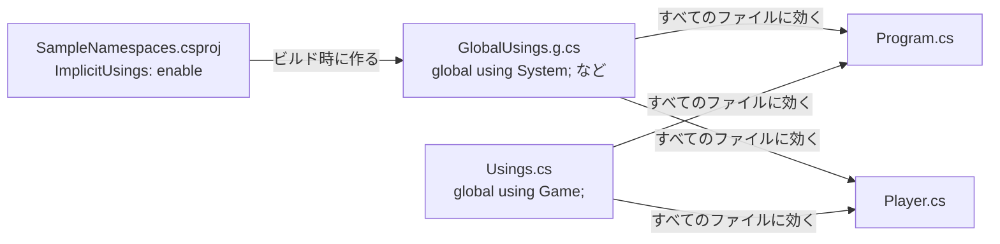

# 名前空間

[名前空間と using ディレクティブ（補足）](/unity-csharp-learning/csharp/using-directives/) では、.NET が用意している名前空間の型を使う方法を学びました。このページでは、自分で作る型を **名前空間**（namespace）に入れる方法と、同じ名前の型を区別する方法を学びます。拡張メソッドと名前空間の関係や、暗黙的な using ディレクティブの仕組みも説明します。

## 学習目標

このページを読み終えると、以下のことができるようになります。

- `namespace` で名前空間を宣言し、その中に型を定義できる
- 同じ名前の型を、完全修飾名やエイリアスで区別できる
- 拡張メソッドを使うには、その static クラスの名前空間を読み込む必要があることを説明できる
- ファイルスコープの名前空間を使って、型を別のファイルに分けられる
- `using static` と `global using` を使える
- 暗黙的な using ディレクティブが、`global using` として作られていることを説明できる

## 前提知識

- [名前空間と using ディレクティブ（補足）](/unity-csharp-learning/csharp/using-directives/) を読んでいること
- [拡張メソッド](/unity-csharp-learning/csharp/extension-methods/) を読んでいること

---

## 1. 型の名前がぶつかる

ここまでのページでは、クラスを名前空間に入れずに定義してきました。名前空間を指定せずに定義した型は、**グローバル名前空間**（global namespace）という、名前の付いていない名前空間に入ります。

プログラムが大きくなると、同じ名前を付けたい型が出てきます。たとえばゲームでは、「操作するキャラクター」も「音楽を再生する機能」も `Player` と呼びたくなります。しかし、すべての型がグローバル名前空間にあると、同じ名前の型は 2 つ定義できません。

```csharp
// ❌ NG: 同じ名前空間に、同じ名前の型は定義できない
// class Player { }
// class Player { }  // CS0101
```

型を別々の名前空間に入れれば、`Game.Player` と `Audio.Player` のように、名前空間を含めた名前で区別できます。

---

## 2. 名前空間を宣言する

**書式：[namespace キーワード](https://learn.microsoft.com/dotnet/csharp/language-reference/keywords/namespace)**
```
namespace 名前空間名
{
    // 型の定義
}
```

| 要素 | 説明 |
|---|---|
| `namespace` | 名前空間を宣言するキーワード |
| `名前空間名` | 名前空間の名前 |
| `{ }` | この中に定義した型が、その名前空間に入る |

`Player` クラスを、`Game` 名前空間に入れます。

```csharp
using Game;

Player p = new Player();
Console.WriteLine(p.Name);

Game.Player q = new Game.Player();
Console.WriteLine(q.GetType());

namespace Game
{
    class Player
    {
        public string Name = "勇者";
    }
}
```

```
勇者
Game.Player
```

自分で宣言した名前空間も、.NET の名前空間と同じように使えます。ファイルの先頭の `using Game;` で読み込めば `Player` と書けますし、完全修飾名で `Game.Player` とも書けます。`GetType` の結果からも、`Player` の完全修飾名が `Game.Player` になったことがわかります。

トップレベルのステートメントと同じファイルに名前空間を書くときは、型の宣言と同じように、名前空間の宣言をステートメントより後ろに書きます。

> 💡 **ポイント**: 名前空間は、型の名前を整理するためのもので、型を使える範囲を制限するものではありません。別の名前空間にある型でも、完全修飾名か `using` で指定すれば使えます。型を使える範囲を決めるのは、`public` や `internal` などの [アクセス修飾子](/unity-csharp-learning/csharp/access-modifiers/) です。

---

## 3. 同じ名前の型を区別する

`Game` と `Audio` の 2 つの名前空間に、それぞれ `Player` を定義します。名前空間が違うので、この 2 つは定義できます。

ただし、両方の名前空間を `using` で読み込んで `Player` と書くと、コンパイラーはどちらの `Player` なのかを決められません。

```csharp
// ❌ NG: どちらの Player かわからない
// using Game;
// using Audio;
//
// Player p = new Player();  // CS0104
//
// namespace Game
// {
//     class Player { }
// }
//
// namespace Audio
// {
//     class Player { }
// }
```

CS0104 は「'Player' は、'Audio.Player' と 'Game.Player' 間のあいまいな参照です」というエラーです。完全修飾名で `Game.Player` と書けば区別できますが、何度も使うと長くなります。

### エイリアスを付ける

**書式：[using エイリアス](https://learn.microsoft.com/dotnet/csharp/language-reference/keywords/using-directive#the-using-alias)**
```
using 別名 = 名前空間または型;
```

| 要素 | 説明 |
|---|---|
| `別名` | ファイルの中で使う、新しい名前 |
| `名前空間または型` | 別名を付ける名前空間や型の、完全修飾名 |

**エイリアス**（alias）は、名前空間や型に付ける別名です。同じ名前の型に、ファイルの中だけで使える別の名前を付けて区別します。

```csharp
using GamePlayer = Game.Player;
using MusicPlayer = Audio.Player;

GamePlayer p = new GamePlayer();
MusicPlayer m = new MusicPlayer();
Console.WriteLine(p.GetType());
Console.WriteLine(m.GetType());

namespace Game
{
    class Player { }
}

namespace Audio
{
    class Player { }
}
```

```
Game.Player
Audio.Player
```

エイリアスは、型の名前を変えるわけではありません。`GetType` の結果は、元の完全修飾名のままです。

---

## 4. 拡張メソッドと名前空間

[拡張メソッド](/unity-csharp-learning/csharp/extension-methods/) の `Shout` を、`Game.Extensions` 名前空間の static クラスに入れます。すると、それまでと同じ呼び出し方でコンパイルエラーになります。

```csharp
// ❌ NG: Game.Extensions を読み込んでいないので、Shout が見つからない
// Console.WriteLine("hello".Shout());  // CS1061
//
// namespace Game.Extensions
// {
//     static class StringExtensions
//     {
//         public static string Shout(this string text)
//         {
//             return text.ToUpper() + "!";
//         }
//     }
// }
```

拡張メソッドは、定義した static クラスの名前空間を読み込んだときだけ、インスタンスメソッドのような形で呼び出せます。CS1061 のエラーメッセージにも、「using ディレクティブまたはアセンブリ参照が不足していないことを確認してください」と書かれます。

ファイルの先頭に `using Game.Extensions;` を書くと、呼び出せるようになります。

```csharp
using Game.Extensions;

Console.WriteLine("hello".Shout());

namespace Game.Extensions
{
    static class StringExtensions
    {
        public static string Shout(this string text)
        {
            return text.ToUpper() + "!";
        }
    }
}
```

```
HELLO!
```

拡張メソッドの名前空間を読み込まなければ、その拡張メソッドは候補に入りません。使う拡張メソッドを、読み込む名前空間で選べるということです。後で学ぶ LINQ の `Where` や `Select` も、`System.Linq` 名前空間にある拡張メソッドです。暗黙的な using ディレクティブで `System.Linq` が読み込まれているので、`using` を書かずに使えます。

> 💡 **ポイント**: `namespace Game.Extensions` のように、名前空間の名前には `.` を含められます。これは、`Game` 名前空間の中に `Extensions` 名前空間を書いたのと同じ意味です。

---

## 5. 名前空間の階層

名前空間の中には、さらに名前空間を書けます。次の 2 つの書き方は、同じ `Game.Characters` 名前空間を宣言します。

```
namespace Game.Characters
{
    class Enemy { }
}
```

```
namespace Game
{
    namespace Characters
    {
        class Enemy { }
    }
}
```

`Game.Characters` にある `Enemy` から、`Game` にある `Player` を使ってみます。

```csharp
using Game.Characters;

Enemy e = new Enemy();
Console.WriteLine(e.GetType());
Console.WriteLine(e.Target.GetType());

namespace Game
{
    class Player { }

    namespace Characters
    {
        class Enemy
        {
            public Player Target = new Player();
        }
    }
}
```

```
Game.Characters.Enemy
Game.Player
```

`Enemy` の中では、`using Game;` を書かずに `Player` と書けています。名前空間の中のコードは、自分の名前空間に型が見つからないと、外側の名前空間を順にさかのぼって探すからです。

反対に、外側から内側は探しません。[名前空間と using ディレクティブ（補足）](/unity-csharp-learning/csharp/using-directives/) で学んだように、`using Game;` で読み込まれるのは `Game` に直接ある型だけで、`Game.Characters` の `Enemy` は含まれません。

```csharp
// ❌ NG: using Game; では Game.Characters の型は読み込まれない
// using Game;
//
// Enemy e = new Enemy();  // CS0246
```

---

## 6. 型をファイルに分ける

ここまでは、1 つのファイルにすべてのコードを書いてきました。実際のプログラムでは、型ごとにファイルを分けるのが一般的です。ファイルに分けるときに使う、もう 1 つの名前空間の書き方を学びます。

### ファイルスコープの名前空間

**書式：[ファイルスコープの名前空間](https://learn.microsoft.com/dotnet/csharp/language-reference/keywords/namespace)**
```
namespace 名前空間名;

// 型の定義
```

| 要素 | 説明 |
|---|---|
| `namespace 名前空間名;` | ファイルの先頭に書くと、そのファイルにあるすべての型が、この名前空間に入る |

`{ }` で囲む書き方は、**ブロック形式**の名前空間です。`;` で終える書き方は **ファイルスコープの名前空間**（file-scoped namespace）といい、ファイル全体が 1 つの名前空間に入ります。字下げが 1 段少なくなるので、1 つのファイルに 1 つの名前空間を書くときに使います。

### プロジェクトにファイルを追加する

[.NET SDK と dotnet CLI](/unity-csharp-learning/csharp/dotnet-sdk/) で学んだ手順で、コンソールアプリのプロジェクトを作ります。

```powershell
dotnet new console -n SampleNamespaces
```

`SampleNamespaces` フォルダーに、`Player.cs` というファイルを追加して、次のように書きます。

```csharp
namespace Game;

class Player
{
    public string Name = "勇者";
}
```

`Program.cs` を、次のように書き換えます。

```csharp
using Game;

Player p = new Player();
Console.WriteLine(p.Name);
```

`SampleNamespaces` フォルダーで `dotnet run` を実行します。

```
勇者
```

同じプロジェクトにある `.cs` ファイルは、まとめて 1 つのプログラムとしてコンパイルされます。`Program.cs` から、別のファイルにある `Player` を使えるのはこのためです。`using Game;` が必要なのは、ファイルが分かれているからではなく、`Player` が `Game` 名前空間にあるからです。

> 💡 **ポイント**: 名前空間の名前と、ファイルを置くフォルダーの名前は、一致させる決まりはありません。ただし、`Game/Characters/Enemy.cs` のファイルに `Game.Characters` 名前空間を書くように、フォルダーの構成と名前空間をそろえておくと、型のファイルを探しやすくなります。

---

## 7. using static

`using static` を使うと、static クラスの static メンバーを、クラス名を書かずに使えます。

**書式：[using static ディレクティブ](https://learn.microsoft.com/dotnet/csharp/language-reference/keywords/using-directive#the-static-modifier)**
```
using static 型;
```

| 要素 | 説明 |
|---|---|
| `using static` | 型の static メンバーを読み込むことを表す |
| `型` | static メンバーを読み込む型の完全修飾名 |

[Math クラス](https://learn.microsoft.com/dotnet/api/system.math) の static メンバーを、`Math.` を付けずに使います。

```csharp
using static System.Math;

Console.WriteLine(Sqrt(16));
Console.WriteLine(Max(3, 8));
Console.WriteLine(PI);
```

```
4
8
3.141592653589793
```

`Sqrt(16)` は `Math.Sqrt(16)` と同じです。計算式の中で同じクラスのメンバーを何度も使うときに便利です。一方で、どのクラスのメンバーなのかが見えにくくなるので、使う場面は選びます。

`using` ディレクティブに型の名前を書くと CS0138 のエラーになりますが、`using static` なら型の名前を書けます。`using` に書けるのは名前空間、`using static` に書けるのは型です。

---

## 8. global using と暗黙的な using ディレクティブ

### global using

`using` ディレクティブの効果は、書いたファイルの中だけです。複数のファイルで同じ名前空間を使うなら、それぞれのファイルに `using` を書く必要があります。

`global` を付けると、1 か所に書くだけで、プロジェクトのすべてのファイルに効果が及びます。

**書式：[global using ディレクティブ](https://learn.microsoft.com/dotnet/csharp/language-reference/keywords/using-directive#the-global-modifier)**
```
global using 名前空間;
```

| 要素 | 説明 |
|---|---|
| `global` | プロジェクトのすべてのファイルに効果を及ぼすことを表す |
| `名前空間` | 読み込む名前空間。`global using static` や `global using` のエイリアスも書ける |

6 節の `SampleNamespaces` に、`Usings.cs` というファイルを追加します。

```csharp
global using Game;
```

`Program.cs` から `using Game;` を削除します。

```csharp
Player p = new Player();
Console.WriteLine(p.Name);
```

`dotnet run` を実行すると、`using Game;` がなくても `Player` を使えます。

```
勇者
```

`global using` は、どのファイルに書いてもかまいません。ただし、どこに書いたのかがわからなくなりやすいので、`Usings.cs` のような 1 つのファイルにまとめておくのが一般的です。

### 暗黙的な using ディレクティブの正体

[名前空間と using ディレクティブ（補足）](/unity-csharp-learning/csharp/using-directives/) で学んだ暗黙的な using ディレクティブは、`global using` で作られています。`.csproj` の `<ImplicitUsings>enable</ImplicitUsings>` が有効なプロジェクトでは、ビルドするときに、`obj/Debug/net10.0/SampleNamespaces.GlobalUsings.g.cs` のようなファイルが自動で作られます。

```csharp
// <auto-generated/>
global using System;
global using System.Collections.Generic;
global using System.IO;
global using System.Linq;
global using System.Net.Http;
global using System.Threading;
global using System.Threading.Tasks;
```

このファイルもプロジェクトのほかのファイルと一緒にコンパイルされるので、すべてのファイルで `Console` や `List<T>` を `using` なしで使えます。



読み込まれる名前空間は、プロジェクトの種類で変わります。たとえば、[ASP.NET Core でサーバーを作る](/unity-csharp-learning/networking/aspnetcore-server/) で使う Web アプリのプロジェクトでは、`Microsoft.AspNetCore.Http` などの名前空間も読み込まれます。種類ごとの一覧は、[.NET プロジェクト SDK の暗黙的な using ディレクティブ](https://learn.microsoft.com/dotnet/core/project-sdk/overview#implicit-using-directives) で確認できます。

### .csproj で追加・除外する

暗黙的に読み込む名前空間は、`.csproj` の `<Using>` 要素で追加したり、除外したりできます。`SampleNamespaces.csproj` の `</Project>` の前に、次の `<ItemGroup>` を追加します。

```xml
  <ItemGroup>
    <Using Include="Game" />
    <Using Remove="System.Net.Http" />
  </ItemGroup>
```

| 要素 | 説明 |
|---|---|
| `<Using Include="名前空間" />` | 暗黙的に読み込む名前空間に追加する |
| `<Using Remove="名前空間" />` | 暗黙的に読み込む名前空間から除外する |

ビルドし直すと、`GlobalUsings.g.cs` に `global using Game;` が加わり、`global using System.Net.Http;` がなくなります。`Usings.cs` と同じ効果を、`.csproj` の設定で得られます。

---

## よくあるミス

### トップレベルのステートメントと同じファイルに、ファイルスコープの名前空間を書く

```csharp
// ❌ NG: ファイルスコープの名前空間は、ファイルのほかのすべてのメンバーより前に書く
// Console.WriteLine(new Game.Player().Name);
//
// namespace Game;  // CS8956
//
// class Player
// {
//     public string Name = "勇者";
// }
```

ファイルスコープの名前空間は、ファイルの中のすべての型を 1 つの名前空間に入れる書き方なので、ファイルの先頭（`using` ディレクティブの後）に書く必要があります。一方、トップレベルのステートメントは、名前空間の宣言より前に書く必要があります。この 2 つは同じファイルに書けないので、型を別のファイルに分けるか、ブロック形式の名前空間を使います。

### 1 つのファイルに、ファイルスコープの名前空間を 2 つ書く

```csharp
// ❌ NG: ファイルスコープの名前空間は、1 つのファイルに 1 つだけ
// namespace Game;
// namespace Audio;  // CS8954
```

1 つのファイルに複数の名前空間を書きたいときは、ブロック形式を使います。

### global using を、ふつうの using より後に書く

```csharp
// ❌ NG: global using は、ふつうの using ディレクティブより前に書く
// using System.Text;
// global using System.Diagnostics;  // CS8915
```

同じファイルに書くときは、`global using` をすべて先に書きます。

---

## まとめ

- 名前空間を指定せずに定義した型は、グローバル名前空間に入る
- `namespace 名前空間名 { }`（ブロック形式）や `namespace 名前空間名;`（ファイルスコープ）で、型を名前空間に入れる。名前空間は名前を整理するもので、使える範囲はアクセス修飾子で決まる
- 同じ名前の型は、完全修飾名か、`using 別名 = 型;` のエイリアスで区別する
- 拡張メソッドは、定義した static クラスの名前空間を読み込んだときだけ呼び出せる
- 名前空間の中のコードは、外側の名前空間の型を `using` なしで使える。`using` で読み込んでも、下の階層の名前空間は含まれない
- ファイルスコープの名前空間は、トップレベルのステートメントと同じファイルには書けない
- `using static 型;` で、static メンバーをクラス名なしで使える
- `global using` は、プロジェクトのすべてのファイルに効く。暗黙的な using ディレクティブは、`ImplicitUsings` の設定から作られる `global using` で、`.csproj` の `<Using>` で追加・除外できる

---

## 理解度チェック

1. 次のコードを実行すると何が出力されますか？

   ```csharp
   using Shop;
   using Item = Inventory.Item;

   Item a = new Item();
   Shop.Item b = new Shop.Item();
   Console.WriteLine(a.GetType());
   Console.WriteLine(b.GetType());

   namespace Shop
   {
       class Item { }
   }

   namespace Inventory
   {
       class Item { }
   }
   ```

2. `Tools` 名前空間の static クラスに、`int` の拡張メソッド `Double` を定義しました。別のファイルの `Program.cs` で `5.Double()` と書いたところ、CS1061 のエラーになりました。どう直しますか？
3. 次のコードを実行すると何が出力されますか？

   ```csharp
   using static System.Math;

   Console.WriteLine(Abs(-7) + Min(2, 5));
   ```

4. トップレベルのステートメントを書いた `Program.cs` に、`namespace Game;` と書いて `Player` クラスを定義したところ、コンパイルエラーになりました。直し方を 2 つ答えてください。

<details markdown="1">
<summary>解答を見る</summary>

1. 次のように出力されます。エイリアスの `Item` は、`using Shop;` で読み込んだ `Shop.Item` より優先されるので、`a` は `Inventory.Item` です。

   ```
   Inventory.Item
   Shop.Item
   ```

2. `Program.cs` の先頭に `using Tools;` を書きます。拡張メソッドは、定義した static クラスの名前空間を読み込んだときだけ呼び出せます。プロジェクトのすべてのファイルで使うなら、`global using Tools;` を書いてもかまいません。
3. `9` が出力されます。`Abs(-7)` は `Math.Abs(-7)` で `7`、`Min(2, 5)` は `Math.Min(2, 5)` で `2` です。
4. `Player` クラスを `Player.cs` などの別のファイルに移し、そのファイルに `namespace Game;` を書きます。または、`Program.cs` のまま、ブロック形式の `namespace Game { }` で `Player` を囲み、トップレベルのステートメントより後ろに書きます（CS8956）。

</details>

---

## 次のステップ

これで「C# メソッドの応用文法」のセクションは終わりです。[継承](/unity-csharp-learning/csharp/inheritance/) からは「C# 継承と抽象化」のセクションに進み、既存のクラスのメンバーを引き継いで、新しいクラスを作る仕組みを学びます。
