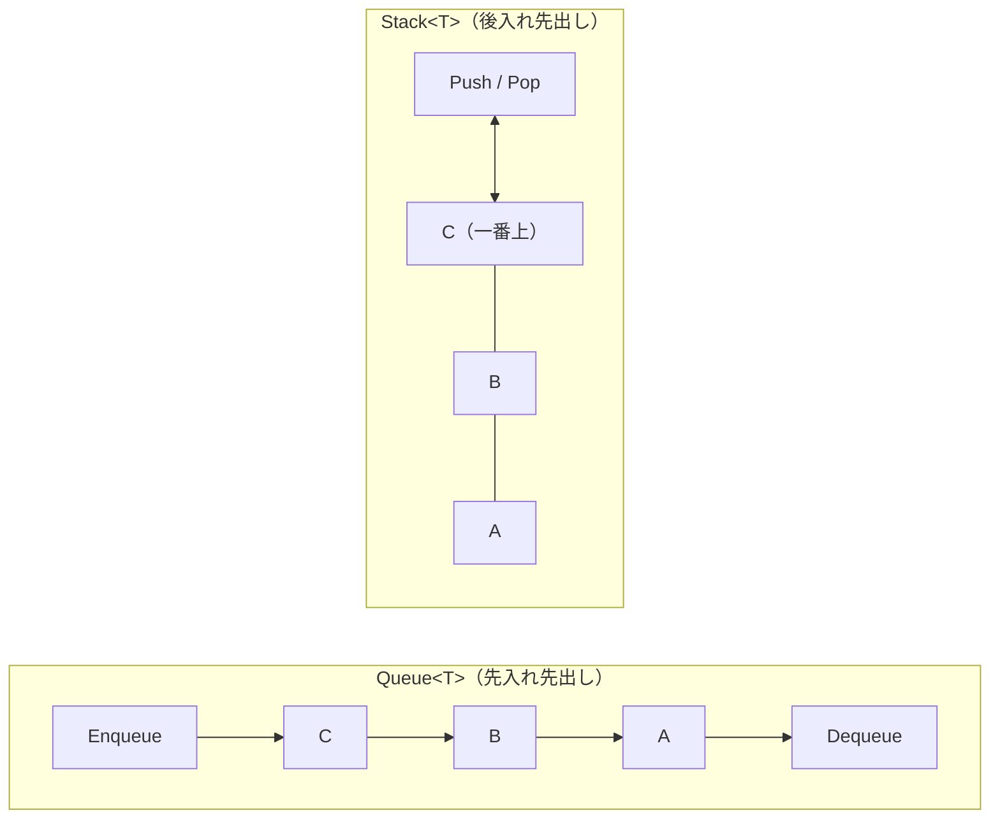

# Queue\<T\>・Stack\<T\>・HashSet\<T\>（補足）

.NET には、`List<T>` と `Dictionary<TKey, TValue>` のほかにも、用途に合わせたコレクションが用意されています。このページでは、入れた順に取り出す **Queue\<T\>**、最後に入れたものから取り出す **Stack\<T\>**、重複しない要素の集まりを表す **HashSet\<T\>** を紹介します。

## 学習目標

このページを読み終えると、以下のことができるようになります。

- `Queue<T>` で、先に入れた要素から順に取り出せる
- `Stack<T>` で、後に入れた要素から順に取り出せる
- `HashSet<T>` で、重複のない要素の集まりを扱い、和集合・積集合・差集合を求められる
- 用途に合わせて、コレクションを選べる

## 前提知識

- [Dictionary\<TKey, TValue\>](/unity-csharp-learning/csharp/dictionary/) を読んでいること
- [再帰関数とコールスタック](/unity-csharp-learning/csharp/recursion/) を読んでいること

---

## 1. Queue\<T\>：先に入れたものから取り出す

[Queue\<T\> クラス](https://learn.microsoft.com/dotnet/api/system.collections.generic.queue-1) は、入れた順に要素を取り出すコレクションです。レジの行列のように、先に並んだ人から順番に処理されます。この取り出し方を **先入れ先出し**（FIFO：First In, First Out）といいます。

| メンバー | 説明 |
|---|---|
| [Enqueue(item)](https://learn.microsoft.com/dotnet/api/system.collections.generic.queue-1.enqueue) | 末尾に要素を入れる |
| [Dequeue()](https://learn.microsoft.com/dotnet/api/system.collections.generic.queue-1.dequeue) | 先頭の要素を取り出して返す。取り出した要素は `Queue<T>` から消える |
| [Peek()](https://learn.microsoft.com/dotnet/api/system.collections.generic.queue-1.peek) | 先頭の要素を、取り出さずに返す |
| `Count` | 要素の数 |

```csharp
Queue<string> queue = new Queue<string>();
queue.Enqueue("Alice");
queue.Enqueue("Bob");
queue.Enqueue("Carol");

Console.WriteLine($"Peek: {queue.Peek()}");
while (queue.Count > 0)
{
    string name = queue.Dequeue();
    Console.WriteLine($"{name} の番（残り {queue.Count} 人）");
}
```

```
Peek: Alice
Alice の番（残り 2 人）
Bob の番（残り 1 人）
Carol の番（残り 0 人）
```

`Peek` は先頭の `Alice` を返しますが、取り出さないので `Count` は変わりません。`Dequeue` は、入れた順に `Alice`・`Bob`・`Carol` を取り出します。

`Queue<T>` は、届いた順に処理したい仕事をためておく **待ち行列** として使います。

---

## 2. Stack\<T\>：後に入れたものから取り出す

[Stack\<T\> クラス](https://learn.microsoft.com/dotnet/api/system.collections.generic.stack-1) は、最後に入れた要素から取り出すコレクションです。積み重ねた皿のように、上に載せたものから取っていきます。この取り出し方を **後入れ先出し**（LIFO：Last In, First Out）といいます。

| メンバー | 説明 |
|---|---|
| [Push(item)](https://learn.microsoft.com/dotnet/api/system.collections.generic.stack-1.push) | 一番上に要素を積む |
| [Pop()](https://learn.microsoft.com/dotnet/api/system.collections.generic.stack-1.pop) | 一番上の要素を取り出して返す。取り出した要素は `Stack<T>` から消える |
| [Peek()](https://learn.microsoft.com/dotnet/api/system.collections.generic.stack-1.peek) | 一番上の要素を、取り出さずに返す |
| `Count` | 要素の数 |

次のコードは、Web ブラウザーの「戻る」のように、見たページの履歴を `Stack<string>` で管理します。

```csharp
Stack<string> history = new Stack<string>();
history.Push("トップ");
history.Push("商品一覧");
history.Push("商品詳細");

Console.WriteLine($"今のページ: {history.Peek()}");
history.Pop();
Console.WriteLine($"戻る → {history.Peek()}");
history.Pop();
Console.WriteLine($"戻る → {history.Peek()}");
```

```
今のページ: 商品詳細
戻る → 商品一覧
戻る → トップ
```

最後に `Push` した `商品詳細` が一番上にあり、`Pop` で取り除くたびに、1 つ前に見たページが一番上になります。

[再帰関数とコールスタック](/unity-csharp-learning/csharp/recursion/) で学んだコールスタックも、後入れ先出しの仕組みです。メソッドを呼び出すとスタックフレームが積まれ、戻るときには最後に積まれたものから取り除かれます。



`Queue<T>` と `Stack<T>` を `foreach` で回すと、それぞれ `Dequeue` と `Pop` で取り出すのと同じ順番で要素が取り出されます。ただし、`foreach` では要素は取り除かれません。

---

## 3. HashSet\<T\>：重複しない要素の集まり

[HashSet\<T\> クラス](https://learn.microsoft.com/dotnet/api/system.collections.generic.hashset-1) は、同じ要素を 2 つ以上持たないコレクションです。数学の **集合** に当たります。

| メンバー | 説明 |
|---|---|
| [Add(item)](https://learn.microsoft.com/dotnet/api/system.collections.generic.hashset-1.add) | 要素を追加する。追加できたら `true`、すでにあって追加しなかったら `false` を返す |
| [Contains(item)](https://learn.microsoft.com/dotnet/api/system.collections.generic.hashset-1.contains) | 要素があれば `true` を返す |
| `Remove(item)` | 要素を削除する |
| `Count` | 要素の数 |

```csharp
HashSet<string> visited = new HashSet<string>();

Console.WriteLine(visited.Add("東京"));
Console.WriteLine(visited.Add("大阪"));
Console.WriteLine(visited.Add("東京"));
Console.WriteLine($"Count = {visited.Count}");
Console.WriteLine($"Contains(\"大阪\") = {visited.Contains("大阪")}");
```

```
True
True
False
Count = 2
Contains("大阪") = True
```

2 回目の `Add("東京")` は、すでに `東京` があるので `false` を返し、要素は増えません。

`HashSet<T>` は、[Dictionary\<TKey, TValue\>](/unity-csharp-learning/csharp/dictionary/) のキーと同じくハッシュ値を使って要素を管理しているので、`Contains` は要素が多くても速く答えを返します。`List<T>` の `Contains` は先頭から順に比べるので、要素が多いほど時間がかかります。「すでに出てきたか」を何度も調べるときは、`HashSet<T>` が向いています。

### 和集合・積集合・差集合

`HashSet<T>` には、集合どうしの演算を行うメソッドがあります。どれも、呼び出した `HashSet<T>` そのものを書き換えます。元の集合を残したいときは、`new HashSet<T>(元の集合)` でコピーを作ってから呼び出します。

| メソッド | 呼び出した集合に残る要素 |
|---|---|
| [UnionWith(other)](https://learn.microsoft.com/dotnet/api/system.collections.generic.hashset-1.unionwith) | どちらかにある要素（和集合） |
| [IntersectWith(other)](https://learn.microsoft.com/dotnet/api/system.collections.generic.hashset-1.intersectwith) | 両方にある要素（積集合） |
| [ExceptWith(other)](https://learn.microsoft.com/dotnet/api/system.collections.generic.hashset-1.exceptwith) | 自分にだけある要素（差集合） |

```csharp
HashSet<int> a = new HashSet<int> { 1, 2, 3, 4 };
HashSet<int> b = new HashSet<int> { 3, 4, 5 };

HashSet<int> union = new HashSet<int>(a);
union.UnionWith(b);
Console.WriteLine($"和集合: {string.Join(", ", union)}");

HashSet<int> intersection = new HashSet<int>(a);
intersection.IntersectWith(b);
Console.WriteLine($"積集合: {string.Join(", ", intersection)}");

HashSet<int> difference = new HashSet<int>(a);
difference.ExceptWith(b);
Console.WriteLine($"差集合: {string.Join(", ", difference)}");
```

実行結果の例です。`HashSet<T>` は要素の順番を保証しないので、表示される順番は変わることがあります。

```
和集合: 1, 2, 3, 4, 5
積集合: 3, 4
差集合: 1, 2
```

---

## 4. コレクションの選び方

| やりたいこと | コレクション |
|---|---|
| 要素を順番に並べて持ち、インデックスで読み書きする | `List<T>` |
| キーから値を探す | `Dictionary<TKey, TValue>` |
| 届いた順に処理する | `Queue<T>` |
| 最後に入れたものから処理する（取り消し、戻る） | `Stack<T>` |
| 重複をなくす、含まれているかを速く調べる | `HashSet<T>` |

どのコレクションも `foreach` 文で要素を取り出せます。その仕組みは、次のページで学びます。

---

## よくあるミス

### 空の Queue\<T\> や Stack\<T\> から取り出す

要素が 1 つもない `Queue<T>` で `Dequeue` や `Peek` を、`Stack<T>` で `Pop` や `Peek` を呼ぶと、`InvalidOperationException` が発生します。

```csharp
// ❌ NG: 空の Queue<T> から Dequeue すると InvalidOperationException が発生する
Queue<int> queue = new Queue<int>();
queue.Dequeue();
```

取り出す前に `Count` が `0` でないことを確かめます。

---

## まとめ

- `Queue<T>` は先入れ先出し。`Enqueue` で入れ、`Dequeue` で先に入れたものから取り出す
- `Stack<T>` は後入れ先出し。`Push` で積み、`Pop` で最後に積んだものから取り出す
- `Peek` は、取り出さずに次の要素を返す
- `HashSet<T>` は重複しない要素の集まり。`Add` は、すでにある要素なら `false` を返す
- `HashSet<T>` の `Contains` は速い。`UnionWith`・`IntersectWith`・`ExceptWith` で集合の演算ができる
- 空の `Queue<T>` や `Stack<T>` から取り出すと `InvalidOperationException` が発生する

---

## 理解度チェック

1. 次のコードを実行すると何が出力されますか？

   ```csharp
   Stack<int> stack = new Stack<int>();
   Queue<int> queue = new Queue<int>();
   for (int i = 1; i <= 3; i++)
   {
       stack.Push(i);
       queue.Enqueue(i);
   }
   Console.WriteLine($"{stack.Pop()} {queue.Dequeue()}");
   ```

2. 文書作成アプリケーションの「元に戻す」機能で、行った操作の履歴を保存するには、どのコレクションが適していますか？
3. 10 万個の単語の中に、同じ単語が 2 回以上出てくるかを調べたいとき、`List<string>` と `HashSet<string>` のどちらが適していますか？

<details markdown="1">
<summary>解答を見る</summary>

1. `3 1` が出力されます。`Stack<int>` の `Pop` は最後に積んだ `3` を、`Queue<int>` の `Dequeue` は最初に入れた `1` を取り出します。
2. `Stack<T>` です。「元に戻す」では、最後に行った操作から順に取り消すので、後入れ先出しの `Stack<T>` が合っています。
3. `HashSet<string>` です。単語を 1 つずつ `Add` し、`false` が返れば 2 回目です。`HashSet<string>` の `Add` や `Contains` は要素が多くても速く、`List<string>` の `Contains` は先頭から順に比べるので、単語が多いほど時間がかかります。

</details>

---

## 次のステップ

[IEnumerable\<T\> と foreach の仕組み](/unity-csharp-learning/csharp/ienumerable/) では、どのコレクションも `foreach` で回せる理由と、自分で作ったクラスを `foreach` で回せるようにする方法を学びます。
