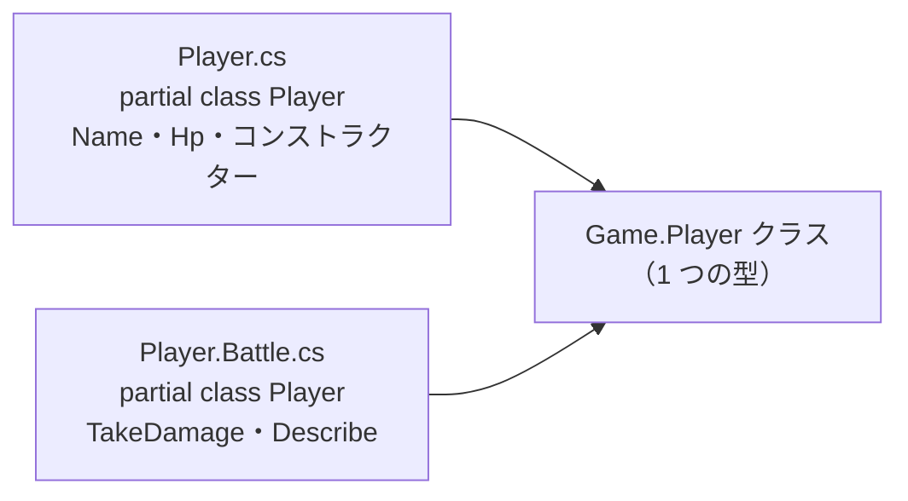

# partial 型と partial メンバー

`partial` を付けると、1 つのクラスの定義を、複数の部分に分けて書けます。このページでは、クラスを複数のファイルに分ける **partial 型**（partial type）と、宣言と本体を別々の部分に書く **partial メンバー**（partial member）を学びます。

## 学習目標

このページを読み終えると、以下のことができるようになります。

- `partial class` で、1 つのクラスを複数の部分に分けて定義できる
- 部分に分けた型が 1 つの型になるための条件を説明できる
- partial メソッドの宣言と実装を書ける
- 実装を省略できる partial メソッドと、実装が必要な partial メソッドの違いを説明できる
- partial プロパティの宣言と実装を書ける

## 前提知識

- [ファイルの分割と global using](/unity-csharp-learning/csharp/multiple-files/) を読んでいること
- [プロパティ](/unity-csharp-learning/csharp/properties/) を読んでいること

---

## 1. クラスを複数の部分に分ける

[ファイルの分割と global using](/unity-csharp-learning/csharp/multiple-files/) では、型ごとにファイルを分けました。`partial` を使うと、さらに 1 つの型の定義を、複数の部分に分けて書けます。

**書式：[partial 型](https://learn.microsoft.com/dotnet/csharp/language-reference/keywords/partial-type)**
```
partial class クラス名
{
    // メンバーの一部
}

partial class クラス名
{
    // 残りのメンバー
}
```

| 要素 | 説明 |
|---|---|
| `partial` | この型の定義が、ほかの部分と合わせて 1 つの型になることを表す修飾子 |
| `class クラス名` | どの部分でも、同じ名前を書く |

コンパイラーは、同じ名前の部分をすべて集めて、1 つのクラスとしてコンパイルします。どの部分に書いたメンバーも、同じクラスのメンバーとして扱われます。

`partial` は、ツールが自動で作るコードと、自分で書くコードを、1 つのクラスにまとめるときによく使われます。このページでは、partial の仕組みと書き方を、自分で書いたコードで確かめます。

### ファイルに分ける

コンソールアプリのプロジェクトを作ります。

```powershell
dotnet new console -n SamplePartial
```

`SamplePartial` フォルダーに、`Player.cs` を追加します。名前と HP のフィールドと、コンストラクターを書きます。

```csharp
namespace Game;

partial class Player
{
    public string Name;
    public int Hp;

    public Player(string name, int hp)
    {
        Name = name;
        Hp = hp;
    }
}
```

もう 1 つ、`Player.Battle.cs` を追加します。戦闘に関係するメソッドを書きます。

```csharp
namespace Game;

partial class Player
{
    public void TakeDamage(int damage)
    {
        Hp -= damage;
    }

    public string Describe()
    {
        return $"{Name}: HP {Hp}";
    }
}
```

`Program.cs` を、次のように書き換えます。

```csharp
using Game;

Player p = new Player("勇者", 30);
p.TakeDamage(12);
Console.WriteLine(p.Describe());
```

`SamplePartial` フォルダーで `dotnet run` を実行します。

```
勇者: HP 18
```

`Player.Battle.cs` の `TakeDamage` から、`Player.cs` のフィールド `Hp` を使えています。2 つのファイルに書いた部分が、1 つの `Game.Player` クラスになっているからです。



> 💡 **ポイント**: partial 型の部分を書くファイルには、`Player.Battle.cs` のように、`型の名前.役割.cs` という名前を付けるのが一般的です。どの型の部分なのかが、ファイル名からわかります。

### 1 つのファイルに書く

部分は、同じファイルに書いてもかまいません。このページのこの後の例は、1 つのファイルで試せるように、部分を並べて書きます。

```csharp
Player p = new Player("勇者", 30);
p.TakeDamage(12);
Console.WriteLine(p.Describe());

partial class Player
{
    public string Name;
    public int Hp;

    public Player(string name, int hp)
    {
        Name = name;
        Hp = hp;
    }
}

partial class Player
{
    public void TakeDamage(int damage)
    {
        Hp -= damage;
    }

    public string Describe()
    {
        return $"{Name}: HP {Hp}";
    }
}
```

```
勇者: HP 18
```

---

## 2. 1 つの型になるための条件

部分に分けた定義が 1 つの型にまとまるには、次の条件を満たす必要があります。

| 条件 | 満たさないとき |
|---|---|
| すべての部分に `partial` を付ける | CS0260 のエラーになる |
| すべての部分を、同じ名前空間に書く | 別々の型になる。エラーにはならない |
| すべての部分を、同じプロジェクトに書く | 1 つの型にまとまらない |
| アクセス修飾子を書くなら、すべての部分で同じにする | CS0262 のエラーになる |
| 同じメンバーを、複数の部分に書かない | CS0102 のエラーになる |

アクセス修飾子は、1 つの部分にだけ書いてもかまいません。ほかの部分に書かなければ、書いた部分の指定が型全体に使われます。

気をつけたいのは、名前空間が違う場合です。エラーにならずに、別々の型ができます。

```csharp
// ❌ NG: 名前空間が違うので、2 つの Player は別々の型になる
// var p = new Game.Player();
// p.Attack();  // CS1061
//
// namespace Game
// {
//     partial class Player { }
// }
//
// partial class Player
// {
//     public void Attack() { }
// }
```

`Attack` は、グローバル名前空間の `Player` のメンバーです。`Game.Player` には `Attack` がないので、CS1061 のエラーになります。エラーが出るのは部分の定義ではなく、使った場所なので、原因に気づきにくいです。ファイルスコープの名前空間を書き忘れたときや、名前空間の名前を書き間違えたときに起こります。

しかも、エラーになるとは限りません。次の例では、両方の `Player` に同じ `Describe` メソッドがあります。1 つの型にまとまっていれば、メンバーの重複で CS0102 のエラーになるはずのコードです。

```csharp
var p = new Game.Player();
Console.WriteLine(p.Describe());

namespace Game
{
    partial class Player
    {
        public string Describe()
        {
            return "Game.Player の Describe";
        }
    }
}

partial class Player
{
    public string Describe()
    {
        return "グローバル名前空間の Player の Describe";
    }
}
```

```
Game.Player の Describe
```

エラーにならずに、`Game.Player` の `Describe` が実行されます。グローバル名前空間の `Player` に書いたコードは、使われないまま残ります。

名前空間が食い違っていても、コンパイラーが教えてくれるとは限りません。partial 型の部分を書くときは、すべての部分で名前空間がそろっているかを確認します。

> 💡 **ポイント**: `partial` は、クラスのほかに、後で学ぶ [構造体](/unity-csharp-learning/csharp/structs/)、[インターフェイス](/unity-csharp-learning/csharp/interfaces/)、[record](/unity-csharp-learning/csharp/records/) にも付けられます。

---

## 3. partial メソッド

メソッドも、**宣言** と **実装**（本体）を、別々の部分に書けます。これを **partial メソッド** といいます。宣言する部分では、メソッドの本体の代わりに `;` を書きます。

**書式：[partial メソッド](https://learn.microsoft.com/dotnet/csharp/language-reference/keywords/partial-member)**
```
// 宣言する部分
partial void メソッド名(パラメータ);

// 実装する部分
partial void メソッド名(パラメータ)
{
    // 処理
}
```

| 要素 | 説明 |
|---|---|
| `partial` | 宣言と実装を、別々の部分に書くことを表す修飾子 |
| 宣言 | 本体の代わりに `;` を書く。ここでは呼び出し方だけを決める |
| 実装 | 宣言と同じ名前・戻り値・パラメータで、本体を書く |

### 実装を省略できる partial メソッド

アクセス修飾子を付けず、戻り値が `void` の partial メソッドは、実装を書かなくてもかまいません。

ドアを開ける `Open` メソッドの中で、`OnOpened` を呼び出します。`OnOpened` は宣言だけで、実装はありません。

```csharp
Door d = new Door();
d.Open();
Console.WriteLine("終了");

partial class Door
{
    partial void OnOpened();

    public void Open()
    {
        Console.WriteLine("ドアを開けた");
        OnOpened();
    }
}
```

```
ドアを開けた
終了
```

実装がないのに、エラーになりません。実装がない partial メソッドは、呼び出しごとコンパイラーが取り除きます。`OnOpened();` の行は、書かなかったのと同じになります。

別の部分に実装を書くと、呼び出されるようになります。

```csharp
Door d = new Door();
d.Open();
Console.WriteLine("終了");

partial class Door
{
    partial void OnOpened();

    public void Open()
    {
        Console.WriteLine("ドアを開けた");
        OnOpened();
    }
}

partial class Door
{
    partial void OnOpened()
    {
        Console.WriteLine("効果音を鳴らす");
    }
}
```

```
ドアを開けた
効果音を鳴らす
終了
```

`Open` の側は変えずに、「開けた後の処理」を別の部分から差し込めます。差し込む必要がなければ、何も書かなくてかまいません。

アクセス修飾子を付けない partial メソッドは、`private` として扱われます。呼び出せるのは、同じクラスの中からだけです。クラスの外から `d.OnOpened()` と呼び出すと、CS0122 のエラーになります。

### 実装が必要な partial メソッド

アクセス修飾子（`public`、`private` など）を付けた partial メソッドは、実装を必ず書く必要があります。

戻り値が `void` 以外のメソッドや、`out` パラメータがあるメソッドは、アクセス修飾子を付けて宣言しなければなりません。呼び出しを取り除くと、戻り値や `out` パラメータの値が決まらなくなるので、実装を省略できない形でしか宣言できないということです。

| partial メソッド | アクセス修飾子 | 実装 |
|---|---|---|
| 戻り値が `void` で、`out` パラメータがない（アクセス修飾子なし） | 付けなくてよい | 省略できる |
| 戻り値が `void` 以外、または `out` パラメータがある | 必要（ないと CS8796 / CS8797） | 必要 |
| アクセス修飾子を付けたもの | — | 必要（ないと CS8795） |

```csharp
Shop s = new Shop();
Console.WriteLine(s.GetPrice("薬草"));

partial class Shop
{
    public partial int GetPrice(string item);
}

partial class Shop
{
    public partial int GetPrice(string item)
    {
        return item == "薬草" ? 10 : 0;
    }
}
```

```
10
```

実装する部分がないと、CS8795 のエラーになります。

---

## 4. partial プロパティ

プロパティも、宣言と実装を別々の部分に書けます（C# 13 から）。宣言する部分には、自動実装プロパティと同じ形で、アクセサーの `get;` や `set;` を書きます。実装する部分には、アクセサーの本体を書きます。

**書式：[partial プロパティ](https://learn.microsoft.com/dotnet/csharp/language-reference/keywords/partial-member)**
```
// 宣言する部分
アクセス修飾子 partial 型 プロパティ名 { get; set; }

// 実装する部分
アクセス修飾子 partial 型 プロパティ名
{
    get { /* 値を返す処理 */ }
    set { /* 値を設定する処理 */ }
}
```

```csharp
Enemy e = new Enemy();
Console.WriteLine(e.Hp);

partial class Enemy
{
    public partial int Hp { get; }
}

partial class Enemy
{
    public partial int Hp { get { return 100; } }
}
```

```
100
```

宣言する部分の `{ get; }` は、自動実装プロパティと同じ見た目ですが、自動実装プロパティにはなりません。partial プロパティには、実装する部分が必ず必要です。

---

## よくあるミス

### 一部の定義に partial を付け忘れる

```csharp
// ❌ NG: すべての部分に partial が必要
// partial class A { }
// class A { }  // CS0260
```

`partial` を付けた定義が 1 つでもあれば、同じ型のほかの定義にも `partial` が必要です。

### アクセス修飾子が部分ごとに違う

```csharp
// ❌ NG: アクセス修飾子が食い違っている
// public partial class A { }  // CS0262
// internal partial class A { }
```

アクセス修飾子は、すべての部分で同じにするか、1 つの部分にだけ書きます。

### 戻り値のある partial メソッドに、アクセス修飾子を付けない

```csharp
// ❌ NG: 戻り値が void 以外の partial メソッドには、アクセス修飾子が必要
// partial class A
// {
//     partial int F();  // CS8796
// }
```

戻り値のある partial メソッドは、実装が必要なメソッドとして、アクセス修飾子を付けて宣言します。クラスの中だけで使うなら `private` を付けます。

### partial プロパティの実装を、自動実装プロパティで書く

```csharp
// ❌ NG: 両方とも宣言になり、実装する部分がない
// partial class Enemy
// {
//     public partial int Hp { get; }  // CS9248
// }
//
// partial class Enemy
// {
//     public partial int Hp { get; }  // CS9250
// }
```

`{ get; }` と書くと、その部分は宣言として扱われます。実装する部分には、アクセサーの本体を書きます。

---

## ワンポイントアドバイス

### partial にできるメンバー

partial にできるメンバーは、C# のバージョンとともに増えています。どれも「宣言と実装を別々の部分に書く」という同じ仕組みです。

| メンバー | 使える C# のバージョン |
|---|---|
| メソッド（アクセス修飾子なし・戻り値 `void`） | C# 3.0 |
| メソッド（アクセス修飾子あり・戻り値あり・`out` パラメータ） | C# 9.0 |
| プロパティ・インデクサー | C# 13 |
| コンストラクター・イベント | C# 14 |

---

## まとめ

- `partial class` で、1 つのクラスの定義を複数の部分に分けて書ける。部分はファイルに分けても、同じファイルに並べてもよい
- すべての部分に `partial` を付け、同じ名前空間・同じプロジェクトに書く。名前空間が違うと、エラーにならずに別々の型になる。使う側でもエラーになるとは限らないので、名前空間がそろっているかを確認する
- アクセス修飾子は、すべての部分で同じにするか、1 つの部分にだけ書く
- partial メソッドは、宣言（本体の代わりに `;`）と実装を別々の部分に書く
- アクセス修飾子がなく戻り値が `void` の partial メソッドは、実装を省略できる。省略すると、呼び出しごと取り除かれる
- 戻り値がある、または `out` パラメータがある partial メソッドは、アクセス修飾子が必要。アクセス修飾子を付けた partial メソッドは、実装が必要
- partial プロパティは、宣言に `{ get; }` などを書き、実装にアクセサーの本体を書く

---

## 理解度チェック

1. 次のコードを実行すると何が出力されますか？

   ```csharp
   Counter c = new Counter();
   c.Add();
   c.Add();
   Console.WriteLine(c.Count);

   partial class Counter
   {
       public int Count;

       partial void OnAdded();

       public void Add()
       {
           Count++;
           OnAdded();
       }
   }
   ```

2. 1 のコードに、次の部分を追加しました。実行すると何が出力されますか？

   ```csharp
   partial class Counter
   {
       partial void OnAdded()
       {
           Console.WriteLine($"追加: {Count}");
       }
   }
   ```

3. partial 型の部分を書いたファイルの 1 つで、`namespace Game;` を書き忘れました。コンパイルエラーになりますか？ 何が起きるかを説明してください。
4. 次の partial メソッドのうち、実装を省略できるものはどれですか？

   ```
   ① partial void OnSaved();
   ② private partial void OnLoaded();
   ③ public partial string GetName();
   ```

<details markdown="1">
<summary>解答を見る</summary>

1. `2` が出力されます。`OnAdded` には実装がないので、呼び出しごと取り除かれます。
2. 次のように出力されます。`Count++` の後に `OnAdded` が呼び出されます。

   ```
   追加: 1
   追加: 2
   2
   ```

3. 定義の時点ではエラーになりません。`namespace Game;` を書き忘れた部分は、グローバル名前空間の別の型になります。使う側で、もう一方の部分にしかないメンバーを呼び出すと CS1061 のエラーになることはありますが、必ずエラーになるとは限りません。両方の部分に同じ名前のメンバーがあると、エラーにならずに、別の型のメンバーが使われます。
4. ① だけです。② と ③ は、アクセス修飾子が付いているので、実装が必要です（CS8795）。③ は戻り値があるので、そもそもアクセス修飾子なしでは宣言できません。

</details>

---

## 次のステップ

[入れ子の型](/unity-csharp-learning/csharp/nested-types/) では、クラスの中にクラスを定義し、あるクラスの中でしか使わない補助のクラスを外から隠す方法を学びます。
