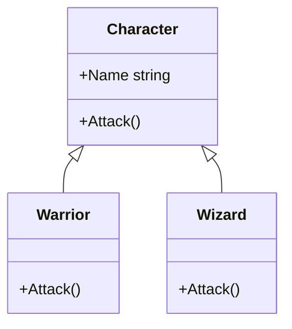

# オーバーライドとポリモーフィズム

**オーバーライド**（override）は、基底クラスで定義されたメソッドの動作を、派生クラスで書き換える仕組みです。オーバーライドしたメソッドは、基底クラスの型の変数から呼び出しても、インスタンスの実体の型のメソッドが実行されます。この性質を **ポリモーフィズム**（polymorphism、多態性）といいます。

## 学習目標

このページを読み終えると、以下のことができるようになります。

- `virtual` と `override` で、基底クラスのメソッドを派生クラスで書き換えられる
- 基底クラスの型の変数から呼び出しても、実体の型のメソッドが実行されることを説明できる
- 基底クラスの型の配列で、いろいろな派生クラスのインスタンスをまとめて扱える
- `base.メソッド名()` で、オーバーライドする前の基底クラスのメソッドを呼び出せる

## 前提知識

- [型変換と型チェック](/unity-csharp-learning/csharp/type-casting/) を読んでいること
- [protected 修飾子](/unity-csharp-learning/csharp/protected-modifier/) を読んでいること

---

## 1. virtual と override

基底クラスのメソッドに [virtual](https://learn.microsoft.com/dotnet/csharp/language-reference/keywords/virtual) を付けると、派生クラスでオーバーライドできるようになります。派生クラスでは、同じシグネチャのメソッドに [override](https://learn.microsoft.com/dotnet/csharp/language-reference/keywords/override) を付けて、動作を書き換えます。

**書式：[virtual メソッドと override メソッド](https://learn.microsoft.com/dotnet/csharp/language-reference/keywords/override)**
```
// 基底クラス
アクセス修飾子 virtual 戻り値の型 メソッド名(パラメータ)
{
    // 基底クラスでの動作
}

// 派生クラス
アクセス修飾子 override 戻り値の型 メソッド名(パラメータ)
{
    // 派生クラスでの動作
}
```

| 要素 | 説明 |
|---|---|
| `virtual` | 派生クラスでオーバーライドしてよいことを表す |
| `override` | 基底クラスの `virtual` のメソッドを書き換えることを表す。名前・パラメータ・戻り値の型・アクセス修飾子を、基底クラスのメソッドと同じにする |

```csharp
A a = new A();
a.M();

B b = new B();
b.M();

class A
{
    public virtual void M()
    {
        Console.WriteLine("A.M");
    }
}

class B : A
{
    public override void M()
    {
        Console.WriteLine("B.M");
    }
}
```

```
A.M
B.M
```

`virtual` を付けていないメソッドは、オーバーライドできません（よくあるミスを参照）。

---

## 2. ポリモーフィズム

オーバーライドしたメソッドは、基底クラスの型の変数から呼び出しても、**インスタンスの実体の型** のメソッドが実行されます。

```csharp
A x = new B();
x.M();

class A
{
    public virtual void M()
    {
        Console.WriteLine("A.M");
    }
}

class B : A
{
    public override void M()
    {
        Console.WriteLine("B.M");
    }
}
```

```
B.M
```

変数 `x` の型は `A` ですが、実体は `B` なので、`B` の `M` が実行されます。どのメソッドを実行するかが、実行したときの実体の型で決まることを、**動的ディスパッチ** といいます。

### 基底クラスの型でまとめて扱う

ポリモーフィズムを使うと、いろいろな派生クラスのインスタンスを、基底クラスの型の配列にまとめて、同じ書き方で扱えます。

```csharp
Character[] party =
{
    new Warrior("Alice"),
    new Wizard("Bob"),
    new Warrior("Carol")
};

foreach (Character c in party)
{
    c.Attack();
}

class Character
{
    public string Name { get; }

    public Character(string name)
    {
        Name = name;
    }

    public virtual void Attack()
    {
        Console.WriteLine($"{Name} の攻撃");
    }
}

class Warrior : Character
{
    public Warrior(string name) : base(name)
    {
    }

    public override void Attack()
    {
        Console.WriteLine($"{Name} は剣で斬りつけた");
    }
}

class Wizard : Character
{
    public Wizard(string name) : base(name)
    {
    }

    public override void Attack()
    {
        Console.WriteLine($"{Name} は炎の魔法を唱えた");
    }
}
```

```
Alice は剣で斬りつけた
Bob は炎の魔法を唱えた
Carol は剣で斬りつけた
```

`foreach` の中では、`c.Attack()` と同じ書き方で呼び出しているだけですが、実体が `Warrior` か `Wizard` かによって、違う動作になります。新しい種類のキャラクターを追加するときも、`Character` を継承して `Attack` をオーバーライドするだけで、この `foreach` を書き換える必要はありません。



---

## 3. base で基底クラスのメソッドを呼び出す

オーバーライドしたメソッドの中で、[base](https://learn.microsoft.com/dotnet/csharp/language-reference/keywords/base) を使って `base.メソッド名()` と書くと、オーバーライドする前の、基底クラスのメソッドを呼び出せます。基底クラスの処理に、処理を付け足したいときに使います。

```csharp
Character c = new Knight("Alice");
c.Attack();

class Character
{
    public string Name { get; }

    public Character(string name)
    {
        Name = name;
    }

    public virtual void Attack()
    {
        Console.WriteLine($"{Name} の攻撃");
    }
}

class Knight : Character
{
    public Knight(string name) : base(name)
    {
    }

    public override void Attack()
    {
        base.Attack();
        Console.WriteLine("さらに盾で押し返した");
    }
}
```

```
Alice の攻撃
さらに盾で押し返した
```

---

## 4. object のメソッドをオーバーライドする

すべてのクラスが継承している `object` の [ToString](https://learn.microsoft.com/dotnet/api/system.object.tostring) メソッドは、`virtual` です。オーバーライドすると、インスタンスを文字列にしたときの表示を決められます。`Console.WriteLine` や文字列補間は、インスタンスを表示するときに `ToString` を呼び出します。

```csharp
Item a = new Item("回復薬", 50);
Console.WriteLine(a);
Console.WriteLine($"買った物: {a}");

class Item
{
    public string Name { get; }
    public int Price { get; }

    public Item(string name, int price)
    {
        Name = name;
        Price = price;
    }

    public override string ToString()
    {
        return $"{Name}（{Price} G）";
    }
}
```

```
回復薬（50 G）
買った物: 回復薬（50 G）
```

`ToString` をオーバーライドしないと、`Item` のように、型の名前が表示されます。

`object` の `Equals` と `GetHashCode` も `virtual` です。[演算子のオーバーロード](/unity-csharp-learning/csharp/operator-overloading/) で `==` を定義したときにオーバーライドしたのは、この 2 つのメソッドです。

---

## よくあるミス

### virtual のないメソッドをオーバーライドする

```csharp
// ❌ NG: A.M に virtual がないので、オーバーライドできない
// class A
// {
//     public void M() { }
// }
//
// class B : A
// {
//     public override void M() { }  // CS0506
// }
```

### override を付け忘れる

```csharp
A x = new B();
x.M();

class A
{
    public virtual void M()
    {
        Console.WriteLine("A.M");
    }
}

class B : A
{
    public void M()
    {
        Console.WriteLine("B.M");
    }
}
```

```
A.M
```

`B` の `M` に `override` がないので、オーバーライドにはならず、`A` の `M` を隠す別のメソッドとして扱われます。基底クラスの型の変数から呼び出すと、`A` の `M` が実行されます。コンパイラーは警告（CS0114）で知らせます。メソッドを隠すことについては、次のページで学びます。

---

## まとめ

- 基底クラスのメソッドに `virtual` を付けると、派生クラスで `override` を付けて書き換えられる
- オーバーライドしたメソッドは、基底クラスの型の変数から呼び出しても、実体の型のメソッドが実行される（ポリモーフィズム）
- 基底クラスの型の配列を使うと、いろいろな派生クラスのインスタンスを同じ書き方で扱える
- `base.メソッド名()` で、オーバーライドする前の基底クラスのメソッドを呼び出せる
- `object` の `ToString`・`Equals`・`GetHashCode` もオーバーライドできる

---

## 理解度チェック

1. `virtual` のないメソッドを、派生クラスで `override` しようとすると、どうなりますか？
2. 次のコードを実行すると何が出力されますか？

   ```csharp
   Animal[] animals = { new Dog(), new Cat(), new Animal() };
   foreach (Animal a in animals)
   {
       a.Speak();
   }

   class Animal
   {
       public virtual void Speak() { Console.WriteLine("..."); }
   }

   class Dog : Animal
   {
       public override void Speak() { Console.WriteLine("ワン"); }
   }

   class Cat : Animal
   {
       public override void Speak() { Console.WriteLine("ニャー"); }
   }
   ```

3. 次の `Point` クラスで `ToString` をオーバーライドし、`Console.WriteLine(new Point(1, 2));` で `(1, 2)` と表示されるようにしてください。

   ```csharp
   class Point
   {
       public int X { get; }
       public int Y { get; }

       public Point(int x, int y)
       {
           X = x;
           Y = y;
       }
   }
   ```

<details markdown="1">
<summary>解答を見る</summary>

1. コンパイルエラー（CS0506）になります。オーバーライドできるのは、`virtual`（や `abstract`）が付いたメソッドだけです。
2. 次のように出力されます。それぞれの実体の型の `Speak` が実行されます。

   ```
   ワン
   ニャー
   ...
   ```

3. ```csharp
   Console.WriteLine(new Point(1, 2));

   class Point
   {
       public int X { get; }
       public int Y { get; }

       public Point(int x, int y)
       {
           X = x;
           Y = y;
       }

       public override string ToString()
       {
           return $"({X}, {Y})";
       }
   }
   ```

</details>

---

## 次のステップ

[メソッドの隠ぺいと sealed](/unity-csharp-learning/csharp/method-hiding/) では、基底クラスのメソッドを隠す `new` 修飾子と、継承やオーバーライドを禁止する `sealed` を学びます。
