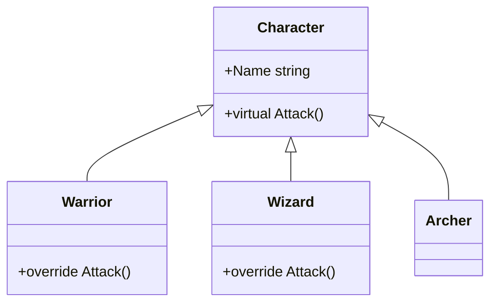
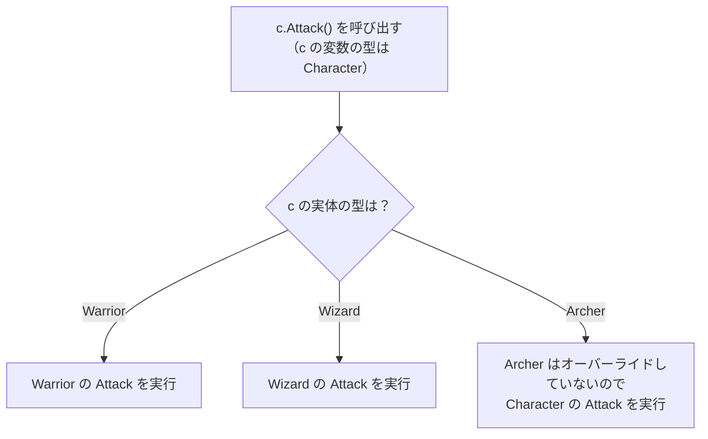

# オーバーライドとポリモーフィズム

戦士は剣で、魔法使いは魔法で攻撃するように、同じ「攻撃」でも、キャラクターの種類によって動作を変えたいことがあります。**オーバーライド**（override）は、基底クラスで定義されたメソッドの動作を、派生クラスで書き換える仕組みです。オーバーライドしたメソッドは、基底クラスの型の変数から呼び出しても、インスタンスの実体の型のメソッドが実行されます。この性質を **ポリモーフィズム**（polymorphism、多態性）といいます。

## 学習目標

このページを読み終えると、以下のことができるようになります。

- 種類ごとの動作の違いを `is` の分岐で書くと何が困るかを説明できる
- `virtual` と `override` で、基底クラスのメソッドを派生クラスで書き換えられる
- 基底クラスの型の変数から呼び出しても、実体の型のメソッドが実行されることを説明できる
- `base.メソッド名()` で、オーバーライドする前の基底クラスのメソッドを呼び出せる
- `object` の `ToString` をオーバーライドできる

## 前提知識

- [型変換と型チェック](/unity-csharp-learning/csharp/type-casting/) を読んでいること
- [protected 修飾子](/unity-csharp-learning/csharp/protected-modifier/) を読んでいること

---

## 1. 種類ごとに動作を変えたい

パーティーに、剣で戦う戦士 `Warrior` と、魔法を使う魔法使い `Wizard` がいるとします。どちらも `Character` の派生クラスで、`Character` の型の配列にまとめてあります。全員に順に攻撃させたいのですが、攻撃の仕方は種類ごとに違います。

[型変換と型チェック](/unity-csharp-learning/csharp/type-casting/) で学んだ型パターンを使うと、次のように書けます。途中で、弓で戦う弓使い `Archer` も仲間に加えました。

```csharp
Character[] party =
{
    new Warrior("Alice"),
    new Wizard("Bob"),
    new Archer("Carol")
};

foreach (Character c in party)
{
    if (c is Warrior warrior)
    {
        warrior.Slash();
    }
    else if (c is Wizard wizard)
    {
        wizard.CastFire();
    }
}

class Character
{
    public string Name { get; }

    public Character(string name)
    {
        Name = name;
    }
}

class Warrior : Character
{
    public Warrior(string name) : base(name) { }

    public void Slash()
    {
        Console.WriteLine($"{Name} は剣で斬りつけた");
    }
}

class Wizard : Character
{
    public Wizard(string name) : base(name) { }

    public void CastFire()
    {
        Console.WriteLine($"{Name} は炎の魔法を唱えた");
    }
}

class Archer : Character
{
    public Archer(string name) : base(name) { }

    public void Shoot()
    {
        Console.WriteLine($"{Name} は矢を放った");
    }
}
```

```
Alice は剣で斬りつけた
Bob は炎の魔法を唱えた
```

弓使いの `Carol` が攻撃していません。`Archer` クラスを追加したのに、`foreach` の中の分岐に `Archer` を書き足し忘れたからです。コンパイラーは、この書き忘れを教えてくれません。

この書き方には、次の問題があります。

- キャラクターの種類を追加するたびに、種類で分岐しているすべての場所を探して書き足す必要がある
- 書き足し忘れても、エラーにならず、黙って何もしない
- 攻撃の仕方を知っているのは各クラスなのに、呼び出す側が種類ごとのメソッド名を知っている必要がある

呼び出す側は、どのキャラクターにも同じ `c.Attack()` と書くだけにして、何をするかは各クラスが決める、という形にできれば、これらの問題はなくなります。

---

## 2. virtual と override

基底クラスのメソッドに [virtual](https://learn.microsoft.com/dotnet/csharp/language-reference/keywords/virtual) を付けると、派生クラスでそのメソッドの動作を書き換えられるようになります。派生クラスでは、同じ名前・同じパラメータのメソッドに [override](https://learn.microsoft.com/dotnet/csharp/language-reference/keywords/override) を付けて、新しい動作を書きます。これを **オーバーライド** といいます。

**書式：[virtual メソッドと override メソッド](https://learn.microsoft.com/dotnet/csharp/language-reference/keywords/override)**
```
// 基底クラス
アクセス修飾子 virtual 戻り値の型 メソッド名(パラメータ)
{
    // 基底クラスでの動作
}

// 派生クラス
アクセス修飾子 override 戻り値の型 メソッド名(パラメータ)
{
    // 派生クラスでの動作
}
```

| 要素 | 説明 |
|---|---|
| `virtual` | 派生クラスでオーバーライドしてよいことを表す。派生クラスがオーバーライドしなければ、この動作が使われる |
| `override` | 基底クラスの `virtual` のメソッドを書き換えることを表す。名前・パラメータ・戻り値の型・アクセス修飾子を、基底クラスのメソッドと同じにする |

1 節の例を、`Character` の `virtual` の `Attack` メソッドと、それをオーバーライドする形に書き直します。

```csharp
Character[] party =
{
    new Warrior("Alice"),
    new Wizard("Bob"),
    new Archer("Carol")
};

foreach (Character c in party)
{
    c.Attack();
}

class Character
{
    public string Name { get; }

    public Character(string name)
    {
        Name = name;
    }

    public virtual void Attack()
    {
        Console.WriteLine($"{Name} の攻撃");
    }
}

class Warrior : Character
{
    public Warrior(string name) : base(name) { }

    public override void Attack()
    {
        Console.WriteLine($"{Name} は剣で斬りつけた");
    }
}

class Wizard : Character
{
    public Wizard(string name) : base(name) { }

    public override void Attack()
    {
        Console.WriteLine($"{Name} は炎の魔法を唱えた");
    }
}

class Archer : Character
{
    public Archer(string name) : base(name) { }
}
```

```
Alice は剣で斬りつけた
Bob は炎の魔法を唱えた
Carol の攻撃
```

`foreach` の中は、`c.Attack()` の 1 行だけになりました。それでも、実体が `Warrior` なら剣で、`Wizard` なら魔法で攻撃します。`Archer` は `Attack` をオーバーライドしていないので、`Character` の `virtual` の `Attack` がそのまま使われます。

新しい種類のキャラクターを追加するときは、`Character` を継承して `Attack` をオーバーライドするだけです。呼び出す側の `foreach` を書き換える必要はありません。



---

## 3. 実体の型でメソッドが決まる

[型変換と型チェック](/unity-csharp-learning/csharp/type-casting/) では、変数の型によって、使えるメンバーが決まることを学びました。`c.Attack()` と書けるのは、`c` の変数の型 `Character` が `Attack` を持っているからです。

しかし、`virtual` のメソッドを呼び出したときに **どのクラスの** `Attack` が実行されるかは、変数の型ではなく、実行したときの **実体の型** で決まります。



このように、実行するメソッドを実行時に実体の型から選ぶことを **動的ディスパッチ**（dynamic dispatch）といいます。`virtual` の付いていないふつうのメソッドは、コンパイルしたときに、変数の型のメソッドに決まります。

| | 使えるメンバーを決めるもの | 実行されるメソッドを決めるもの |
|---|---|---|
| ふつうのメソッド | 変数の型 | 変数の型 |
| `virtual` のメソッド | 変数の型 | 実体の型 |

### 基底クラスの中から呼び出したとき

動的ディスパッチは、基底クラスの中から `virtual` のメソッドを呼び出したときにも働きます。`Character` に、自分のターンの処理をまとめた `TakeTurn` メソッドを追加します。`Warrior` と `Wizard` は 2 節と同じものを使います。

```csharp
Character[] party = { new Warrior("Alice"), new Wizard("Bob") };

foreach (Character c in party)
{
    c.TakeTurn();
}

class Character
{
    public string Name { get; }

    public Character(string name)
    {
        Name = name;
    }

    public void TakeTurn()
    {
        Console.WriteLine($"--- {Name} のターン ---");
        Attack();
    }

    public virtual void Attack()
    {
        Console.WriteLine($"{Name} の攻撃");
    }
}
```

```
--- Alice のターン ---
Alice は剣で斬りつけた
--- Bob のターン ---
Bob は炎の魔法を唱えた
```

`TakeTurn` は `Character` のメソッドで、`Warrior` も `Wizard` も書き換えていません。それでも、中で呼び出している `Attack()` は、実体の型でオーバーライドされたメソッドが実行されます。基底クラスに処理の流れを書いておき、流れの中の一部分だけを派生クラスごとに変える、という使い方ができます。

---

## 4. base で基底クラスのメソッドを呼び出す

オーバーライドするときに、基底クラスの動作をすべて書き換えるのではなく、基底クラスの動作に処理を付け足したいことがあります。オーバーライドしたメソッドの中で、[base](https://learn.microsoft.com/dotnet/csharp/language-reference/keywords/base) を使って `base.メソッド名()` と書くと、オーバーライドする前の、基底クラスのメソッドを呼び出せます。

騎士 `Knight` は、ふつうの攻撃をした後に、盾で押し返します。

```csharp
Character c = new Knight("Alice");
c.Attack();

class Character
{
    public string Name { get; }

    public Character(string name)
    {
        Name = name;
    }

    public virtual void Attack()
    {
        Console.WriteLine($"{Name} の攻撃");
    }
}

class Knight : Character
{
    public Knight(string name) : base(name) { }

    public override void Attack()
    {
        base.Attack();
        Console.WriteLine("さらに盾で押し返した");
    }
}
```

```
Alice の攻撃
さらに盾で押し返した
```

`base.Attack()` で `Character` の `Attack` を実行してから、`Knight` 独自の処理を続けています。基底クラスの `Attack` の内容が後で変わっても、`Knight` はその変更をそのまま引き継げます。

---

## 5. object のメソッドをオーバーライドする

すべてのクラスが継承している `object` の [ToString](https://learn.microsoft.com/dotnet/api/system.object.tostring) メソッドは、`virtual` です。`Console.WriteLine` や文字列補間は、インスタンスを表示するときに、そのインスタンスの `ToString` を呼び出します。`ToString` をオーバーライドすると、インスタンスを文字列にしたときの表示を決められます。

```csharp
Item a = new Item("回復薬", 50);
Console.WriteLine(a);
Console.WriteLine($"買った物: {a}");

class Item
{
    public string Name { get; }
    public int Price { get; }

    public Item(string name, int price)
    {
        Name = name;
        Price = price;
    }

    public override string ToString()
    {
        return $"{Name}（{Price} G）";
    }
}
```

```
回復薬（50 G）
買った物: 回復薬（50 G）
```

`Console.WriteLine` は、`Item` のことを何も知りません。`object` の `ToString` を呼び出しているだけです。それでも `Item` の `ToString` が実行されるのは、動的ディスパッチによって、実体の型のメソッドが選ばれるからです。`ToString` をオーバーライドしないと、`object` の `ToString` が使われ、`Item` のように型の名前が表示されます。

`object` の `Equals` と `GetHashCode` も `virtual` です。[演算子のオーバーロード](/unity-csharp-learning/csharp/operator-overloading/) で `==` を定義したときにオーバーライドしたのは、この 2 つのメソッドです。

---

## よくあるミス

### virtual のないメソッドをオーバーライドする

```csharp
// ❌ NG: Character の Attack に virtual がないので、オーバーライドできない
// class Character
// {
//     public void Attack() { }
// }
//
// class Warrior : Character
// {
//     public override void Attack() { }  // CS0506
// }
```

オーバーライドできるのは、基底クラスで `virtual`（や、後で学ぶ `abstract`）が付いたメソッドだけです。基底クラスを作るときに、派生クラスで書き換えてよいメソッドを `virtual` で選んでおきます。

### override を付け忘れる

```csharp
Character c = new Warrior("Alice");
c.Attack();

class Character
{
    public string Name { get; }

    public Character(string name)
    {
        Name = name;
    }

    public virtual void Attack()
    {
        Console.WriteLine($"{Name} の攻撃");
    }
}

class Warrior : Character
{
    public Warrior(string name) : base(name) { }

    public void Attack()
    {
        Console.WriteLine($"{Name} は剣で斬りつけた");
    }
}
```

```
Alice の攻撃
```

`Warrior` の `Attack` に `override` がないので、オーバーライドにはならず、`Character` の `Attack` を隠す別のメソッドとして扱われます。`Character` の型の変数から呼び出すと、`Character` の `Attack` が実行されます。コンパイラーは警告（CS0114）で知らせます。メソッドを隠すことについては、次のページで学びます。

---

## まとめ

- 種類ごとの動作の違いを `is` の分岐で書くと、種類を追加するたびに分岐を書き足す必要があり、書き忘れても気付けない
- 基底クラスのメソッドに `virtual` を付けると、派生クラスで `override` を付けて書き換えられる。オーバーライドしなければ、基底クラスの動作が使われる
- `virtual` のメソッドは、基底クラスの型の変数から呼び出しても、実体の型のメソッドが実行される（ポリモーフィズム、動的ディスパッチ）
- 基底クラスの中から呼び出したときも、実体の型のメソッドが実行される
- `base.メソッド名()` で、オーバーライドする前の基底クラスのメソッドを呼び出せる
- `object` の `ToString`・`Equals`・`GetHashCode` もオーバーライドできる

---

## 理解度チェック

1. `virtual` のないメソッドを、派生クラスで `override` しようとすると、どうなりますか？
2. 次のコードを実行すると何が出力されますか？

   ```csharp
   Animal[] animals = { new Dog(), new Cat(), new Animal() };
   foreach (Animal a in animals)
   {
       a.Speak();
   }

   class Animal
   {
       public virtual void Speak() { Console.WriteLine("..."); }
   }

   class Dog : Animal
   {
       public override void Speak() { Console.WriteLine("ワン"); }
   }

   class Cat : Animal
   {
       public override void Speak() { Console.WriteLine("ニャー"); }
   }
   ```

3. 1 節のように `is` で種類ごとに分岐する書き方と比べて、オーバーライドを使う書き方の利点を説明してください。
4. 次の `Point` クラスで `ToString` をオーバーライドし、`Console.WriteLine(new Point(1, 2));` で `(1, 2)` と表示されるようにしてください。

   ```csharp
   class Point
   {
       public int X { get; }
       public int Y { get; }

       public Point(int x, int y)
       {
           X = x;
           Y = y;
       }
   }
   ```

<details markdown="1">
<summary>解答を見る</summary>

1. コンパイルエラー（CS0506）になります。オーバーライドできるのは、`virtual`（や `abstract`）が付いたメソッドだけです。
2. 次のように出力されます。それぞれの実体の型の `Speak` が実行されます。

   ```
   ワン
   ニャー
   ...
   ```

3. 呼び出す側は `c.Attack()` のように同じ書き方をするだけで、何をするかは各クラスが決めます。種類を追加しても、呼び出す側を書き換える必要がありません。また、種類ごとのメソッド名を呼び出す側が知っている必要もなくなります。
4. ```csharp
   Console.WriteLine(new Point(1, 2));

   class Point
   {
       public int X { get; }
       public int Y { get; }

       public Point(int x, int y)
       {
           X = x;
           Y = y;
       }

       public override string ToString()
       {
           return $"({X}, {Y})";
       }
   }
   ```

</details>

---

## 次のステップ

[メソッドの隠ぺいと sealed](/unity-csharp-learning/csharp/method-hiding/) では、基底クラスのメソッドを隠す `new` 修飾子と、継承やオーバーライドを禁止する `sealed` を学びます。
