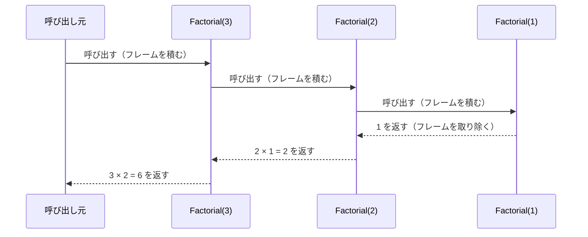

# 再帰関数とコールスタック

メソッドが自分自身を呼び出すことを **再帰**（recursion）といいます。再帰の動きを理解するには、メソッドを呼び出すたびに情報が積み重なる **コールスタック**（call stack）の仕組みを知っておく必要があります。

## 学習目標

このページを読み終えると、以下のことができるようになります。

- 再帰が、メソッドが自分自身を呼び出すことだと説明できる
- 再帰に終了条件が必要な理由を説明できる
- メソッドを呼び出すたびにスタックフレームが積まれ、戻るときに逆の順に取り除かれることを説明できる
- 再帰で書いた処理を、ループでも書けることを確かめられる

## 前提知識

- [メソッド](/unity-csharp-learning/csharp/methods/) を読んでいること

---

## 1. 再帰とは

メソッドの本体から、同じメソッドを呼び出すことを **再帰呼び出し** といいます。

**書式：再帰呼び出し**
```
戻り値の型 メソッド名(型 パラメータ名)
{
    if (終了条件)
    {
        // 自分自身を呼び出さずに終える
        return;
    }

    // この段階の処理
    メソッド名(次の値);
}
```

| 要素 | 説明 |
|---|---|
| `終了条件` | 再帰を止める条件。これ以上自分自身を呼び出さない場合 |
| `次の値` | 次の呼び出しに渡す値。呼び出すたびに、終了条件に近づくように変える |

```csharp
A a = new A();
a.Countdown(3);

class A
{
    public void Countdown(int n)
    {
        if (n <= 0)
        {
            Console.WriteLine("発射！");
            return;
        }
        Console.WriteLine(n);
        Countdown(n - 1);
    }
}
```

```
3
2
1
発射！
```

`Countdown(3)` は `3` を表示して `Countdown(2)` を呼び出し、`Countdown(2)` は `2` を表示して `Countdown(1)` を呼び出します。`Countdown(0)` で `n <= 0` になり、自分自身を呼び出さずに終わります。

---

## 2. 終了条件が必要な理由

再帰には、必ず **終了条件** が必要です。終了条件がないと、メソッドは自分自身を呼び出し続け、終わりません。

```csharp
// ❌ NG: 終了条件がないので、呼び出しが終わらない
// A a = new A();
// a.Countdown(3);
//
// class A
// {
//     public void Countdown(int n)
//     {
//         Console.WriteLine(n);
//         Countdown(n - 1);
//     }
// }
```

このコードを実行すると、次の節で学ぶコールスタックがあふれる **スタックオーバーフロー** が起き、`Stack overflow.` と表示されてプログラムが異常終了します。スタックオーバーフローは、`try` / `catch` で受け止めることもできません。

再帰を書くときは、まず「どこで止めるか」を決め、メソッドの先頭で終了条件を調べます。

---

## 3. コールスタック

メソッドを呼び出すと、その呼び出しのための情報（パラメータやローカル変数の値、終わったときに戻る場所など）が、**コールスタック** という領域に積まれます。1 回の呼び出しの分の情報を、**スタックフレーム** といいます。

- メソッドを呼び出すと、新しいスタックフレームが積まれる
- メソッドから戻ると、そのスタックフレームが取り除かれ、呼び出した場所に戻る
- 再帰では、同じメソッドでも、呼び出しごとに別々のスタックフレームが積まれる。パラメータ `n` も、呼び出しごとに別々にある

コールスタックの「スタック」は、上に積んでいき、上から取り除く積み重ねのことです。最後に積んだものから先に取り除かれます。

### 戻り値を使う再帰

n の **階乗**（1 から n までの整数をすべて掛けた値。n! と書く）を、再帰で求めます。n! = n × (n - 1)! なので、「n の階乗は、n と (n - 1) の階乗の積」と書けます。

```csharp
A a = new A();
Console.WriteLine($"結果: {a.Factorial(3)}");

class A
{
    public int Factorial(int n)
    {
        Console.WriteLine($"Factorial({n}) を開始");
        if (n <= 1)
        {
            Console.WriteLine($"Factorial({n}) は 1 を返す");
            return 1;
        }
        int result = n * Factorial(n - 1);
        Console.WriteLine($"Factorial({n}) は {result} を返す");
        return result;
    }
}
```

```
Factorial(3) を開始
Factorial(2) を開始
Factorial(1) を開始
Factorial(1) は 1 を返す
Factorial(2) は 2 を返す
Factorial(3) は 6 を返す
結果: 6
```

`Factorial(3)` は、`3 * Factorial(2)` を計算するために `Factorial(2)` を呼び出し、その結果が返ってくるまで待ちます。`Factorial(1)` が `1` を返すと、待っていた呼び出しが、積まれたのと **逆の順** に計算を終えて戻っていきます。



`Factorial(1)` を実行している時点では、コールスタックに `Factorial(3)`・`Factorial(2)`・`Factorial(1)` の 3 つのスタックフレームが積まれています。

---

## 4. ループで書き直す

再帰で書いた処理の多くは、ループでも書けます。階乗をループで求めると、次のようになります。

```csharp
int n = 3;
int result = 1;
for (int i = 2; i <= n; i++)
{
    result *= i;
}
Console.WriteLine($"結果: {result}");
```

```
結果: 6
```

ループはスタックフレームを積み重ねないので、繰り返しの回数が多くても、スタックオーバーフローになりません。一方、木のように枝分かれする構造をたどる処理などは、再帰のほうが自然に書けることがあります。処理の形に合わせて選びます。

---

## よくあるミス

### 終了条件に届かない

```csharp
// ❌ NG: n が負の数だと、n == 0 にならない
// A a = new A();
// a.Countdown(-1);
//
// class A
// {
//     public void Countdown(int n)
//     {
//         if (n == 0)
//         {
//             return;
//         }
//         Countdown(n - 1);  // -1、-2、-3 … と減り続け、スタックオーバーフロー
//     }
// }
```

終了条件を書いていても、呼び出しを重ねたときにその条件を満たさなければ、再帰は終わりません。`n == 0` ではなく `n <= 0` のように、終了条件を少し広めに書くと安全です。

---

## まとめ

- 再帰は、メソッドが自分自身を呼び出すこと
- 再帰には、必ず終了条件が必要。終了条件がないと、スタックオーバーフローでプログラムが異常終了する
- メソッドを呼び出すたびに、コールスタックにスタックフレームが積まれ、戻るときに取り除かれる
- 再帰の呼び出しは、積まれたのと逆の順に戻っていく
- 再帰で書いた処理の多くは、ループでも書ける

---

## 理解度チェック

1. 再帰に終了条件が必要なのはなぜですか？
2. 次のコードを実行すると何が出力されますか？

   ```csharp
   A a = new A();
   a.M(3);

   class A
   {
       public void M(int n)
       {
           if (n <= 0)
           {
               return;
           }
           M(n - 1);
           Console.WriteLine(n);
       }
   }
   ```

3. 1 から n までの整数の合計を、再帰で求める `Sum(int n)` メソッドを書いてください。

<details markdown="1">
<summary>解答を見る</summary>

1. 終了条件がないと、メソッドが自分自身を呼び出し続け、コールスタックがあふれてスタックオーバーフローになるからです。
2. 次のように出力されます。`Console.WriteLine(n)` は再帰呼び出しの **後** にあるので、`M(1)` が最初に表示を終え、積まれたのと逆の順に表示されます。

   ```
   1
   2
   3
   ```

3. ```csharp
   A a = new A();
   Console.WriteLine(a.Sum(10));

   class A
   {
       public int Sum(int n)
       {
           if (n <= 0)
           {
               return 0;
           }
           return n + Sum(n - 1);
       }
   }
   ```

   `55` が表示されます。

</details>

---

## 次のステップ

[static メンバーと static クラス](/unity-csharp-learning/csharp/static-members/) では、インスタンスではなく、クラスそのものに属するメンバーを学びます。
