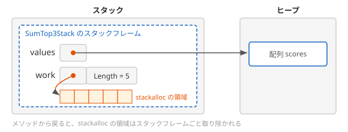

# stackalloc

メソッドの中で一時的に使うだけの配列でも、`new` で作ると、ヒープに確保されてガベージコレクションの対象になります。**stackalloc** は、配列のように要素が並んだ領域を、ヒープではなくスタックの上に確保する式です。このページでは、`stackalloc` で確保した領域を `Span<T>` で扱う方法と、使うときの注意点を学びます。

## 学習目標

このページを読み終えると、以下のことができるようになります。

- `stackalloc` で確保した領域を `Span<T>` で受け取り、配列のように読み書きできる
- `stackalloc` の領域がメソッドから戻ると取り除かれ、ガベージコレクションが関係しないことを説明できる
- `stackalloc` の領域を、メソッドの戻り値として返せない理由を説明できる
- 大きさによって、`stackalloc` と `new` を使い分けられる

## 前提知識

- [ref struct と Span の制約](/unity-csharp-learning/csharp/ref-struct/) を読んでいること
- [再帰関数とコールスタック](/unity-csharp-learning/csharp/recursion/) でスタックフレームとスタックオーバーフローを学んだこと
- [ガベージコレクション](/unity-csharp-learning/csharp/garbage-collection/) を読んでいること

---

## 1. 一時的な配列もヒープに作られる

次の `SumTop3Heap` は、配列の中の大きいほうから 3 つの値を合計します。元の配列を並べ替えてしまわないように、作業用の配列にコピーしてから並べ替えています。

```csharp
int SumTop3Heap(int[] values)
{
    int[] work = new int[values.Length];
    values.CopyTo(work, 0);
    Array.Sort(work);
    return work[^1] + work[^2] + work[^3];
}
```

作業用の配列 `work` は、このメソッドの中でしか使いません。それでも `new` で作った配列はヒープに確保されるので、メソッドを呼び出すたびに、ガベージコレクションで回収するものが 1 つ増えます。

---

## 2. stackalloc

[stackalloc 式](https://learn.microsoft.com/dotnet/csharp/language-reference/operators/stackalloc) は、指定した数の要素が並んだ領域を、スタックの上に確保します。確保した領域は、`Span<T>` で受け取って使います。

**書式：[stackalloc 式](https://learn.microsoft.com/dotnet/csharp/language-reference/operators/stackalloc)**
```
Span<T> 変数名 = stackalloc T[要素の数];
Span<T> 変数名 = stackalloc T[] { 要素, 要素, ... };
```

| 要素 | 説明 |
|---|---|
| `T` | 要素の型。`int` や `char` などの値型を指定する |
| `要素の数` | 確保する要素の数。定数でなくてもよい |
| `{ 要素, ... }` | 配列と同じように、初期値を並べて書ける |

```csharp
Span<int> buffer = stackalloc int[4];
Console.WriteLine(buffer.Length);
Console.WriteLine(string.Join(", ", buffer.ToArray()));
for (int i = 0; i < buffer.Length; i++)
{
    buffer[i] = i * 10;
}
Console.WriteLine(string.Join(", ", buffer.ToArray()));
```

```
4
0, 0, 0, 0
0, 10, 20, 30
```

確保した直後の要素は、`new` で作った配列と同じように `0` です。`Span<int>` で受け取っているので、インデックスでの読み書き、`Length`、`Slice` など、[Span\<T\> と ReadOnlySpan\<T\>](/unity-csharp-learning/csharp/span/) で学んだ操作がそのまま使えます。

### 領域はメソッドから戻ると取り除かれる

`stackalloc` の領域は、それを確保したメソッドのスタックフレームの中に作られます。[再帰関数とコールスタック](/unity-csharp-learning/csharp/recursion/) で学んだように、スタックフレームはメソッドから戻ると取り除かれます。`stackalloc` の領域も、そのときに一緒に取り除かれます。ガベージコレクションが回収する必要はありません。

1 節のメソッドを、`stackalloc` を使って書き直します。`values.CopyTo(work)` は配列の要素を `Span<int>` にコピーし、`work.Sort()` は `Span<int>` の要素を並べ替えます。

```csharp
int SumTop3Stack(int[] values)
{
    Span<int> work = stackalloc int[values.Length];
    values.CopyTo(work);
    work.Sort();
    return work[^1] + work[^2] + work[^3];
}
```



### ヒープに確保されるメモリを比べる

2 つのメソッドを 1000 回ずつ呼び出して、ヒープに確保されたメモリの量を比べます。

```csharp
int[] scores = { 72, 95, 60, 88, 79 };

long before = GC.GetAllocatedBytesForCurrentThread();
int total = 0;
for (int i = 0; i < 1000; i++)
{
    total += SumTop3Heap(scores);
}
long after = GC.GetAllocatedBytesForCurrentThread();
Console.WriteLine($"new: {after - before} バイト");

before = GC.GetAllocatedBytesForCurrentThread();
for (int i = 0; i < 1000; i++)
{
    total += SumTop3Stack(scores);
}
after = GC.GetAllocatedBytesForCurrentThread();
Console.WriteLine($"stackalloc: {after - before} バイト");
Console.WriteLine(SumTop3Heap(scores));
Console.WriteLine(SumTop3Stack(scores));

int SumTop3Heap(int[] values)
{
    int[] work = new int[values.Length];
    values.CopyTo(work, 0);
    Array.Sort(work);
    return work[^1] + work[^2] + work[^3];
}

int SumTop3Stack(int[] values)
{
    Span<int> work = stackalloc int[values.Length];
    values.CopyTo(work);
    work.Sort();
    return work[^1] + work[^2] + work[^3];
}
```

64 ビットの環境で実行した結果の例です。バイト数は実行環境によって変わることがあります。

```
new: 48024 バイト
stackalloc: 0 バイト
262
262
```

どちらのメソッドも同じ結果（95 + 88 + 79 = 262）を返しますが、`stackalloc` を使ったほうは、ヒープにメモリを確保していません。

---

## 3. stackalloc の領域は返せない

`stackalloc` の領域を指す `Span<T>` を、メソッドの戻り値として返すことはできません。

```csharp
Span<int> Create()
{
    Span<int> buffer = stackalloc int[4];
    return buffer;  // ❌ CS8352: スタックフレームの中の領域を外に出せない
}
```

`buffer` が指す領域は、`Create` から戻ると取り除かれます。返せたとすると、呼び出し元は、もう存在しない領域を指す `Span<int>` を受け取ることになります。[ref ローカルと ref 戻り値](/unity-csharp-learning/csharp/ref-locals/) でローカル変数への参照を返せなかったのと同じ理由です。[ref struct と Span の制約](/unity-csharp-learning/csharp/ref-struct/) で学んだ `Span<T>` の制約も、このような領域を指すことがあるために設けられています。

メソッドで作った値を `stackalloc` の領域に入れて使いたいときは、呼び出す側で領域を確保し、`Span<T>` のパラメータで渡します。

```csharp
Span<int> squares = stackalloc int[4];
FillSquares(squares);
Console.WriteLine(string.Join(", ", squares.ToArray()));

void FillSquares(Span<int> destination)
{
    for (int i = 0; i < destination.Length; i++)
    {
        destination[i] = i * i;
    }
}
```

```
0, 1, 4, 9
```

---

## 4. 大きな領域を確保しない

スタックに使える大きさは、ヒープよりずっと小さく、1 MB から数 MB 程度です。大きさは環境によって違います。`stackalloc` でスタックに入りきらない大きさを確保しようとすると、[再帰関数とコールスタック](/unity-csharp-learning/csharp/recursion/) で学んだスタックオーバーフローが発生します。

```csharp
Span<byte> big = stackalloc byte[100_000_000];  // ❌ スタックオーバーフロー
```

スタックオーバーフローは、`try` / `catch` で捕まえられず、プログラムはその場で終了します。

`stackalloc` は、小さな領域にだけ使います。要素の数が実行するまでわからないときは、大きさを確かめて、小さければ `stackalloc`、大きければ `new` で確保します。どちらで確保しても `Span<T>` で受け取れるので、その後の処理は同じコードで書けます。

```csharp
Console.WriteLine(Describe(10));
Console.WriteLine(Describe(1000));

string Describe(int count)
{
    Span<int> buffer = count <= 256 ? stackalloc int[count] : new int[count];
    for (int i = 0; i < buffer.Length; i++)
    {
        buffer[i] = i;
    }
    return $"{buffer.Length} 個, 最後は {buffer[^1]}";
}
```

```
10 個, 最後は 9
1000 個, 最後は 999
```

`count` が 256 以下なら `stackalloc` で、それより大きければ `new` で確保しています。どこまでを小さいとみなすかに決まりはありませんが、数百バイトから 1 KB 程度までにとどめることが多いです。

---

## よくあるミス

### ループの中で stackalloc を使う

`stackalloc` の領域が取り除かれるのは、ブロックの終わりではなく、メソッドから戻るときです。ループの中で `stackalloc` を使うと、繰り返すたびに新しい領域が確保され、ループが終わるまでスタックに積み上がっていきます。

```csharp
for (int i = 0; i < 3; i++)
{
    Span<int> buffer = stackalloc int[4];  // ⚠ CA2014: stackalloc をループの外に移動する
    buffer[0] = i;
}
```

繰り返す回数が多いと、スタックオーバーフローの原因になります。コンパイル時にも CA2014 の警告が出ます。`stackalloc` はループの外で 1 回だけ使い、確保した領域をループの中で使い回します。

### var で受け取る

`stackalloc` の結果を `var` で受け取ると、`Span<T>` ではなく、このサイトでは扱わない **ポインター** の型になります。ポインターは `unsafe`（安全でないコード）の中でしか使えないので、コンパイルエラーになります。

```csharp
// ❌ NG: ポインターの型になる
// var buffer = stackalloc int[4];  // CS0214

// ✅ OK: Span<T> で受け取る
Span<int> buffer = stackalloc int[4];
```

`stackalloc` の結果は、`Span<T>` か `ReadOnlySpan<T>` の型を書いた変数で受け取ります。

---

## ワンポイントアドバイス

### 大きな一時的な配列を使い回す

`stackalloc` に向かない大きさの一時的な配列でも、呼び出すたびに `new` で作る必要はありません。[ArrayPool\<T\>（補足）](/unity-csharp-learning/csharp/array-pool/) では、使い終わった配列を返しておき、次に必要になったときに借りて使い回す方法を学びます。

---

## まとめ

- `stackalloc` は、要素が並んだ領域をスタックの上に確保する。`Span<T>` で受け取れば、`unsafe` は必要ない
- 確保した直後の要素は `0` になっている
- `stackalloc` の領域は、メソッドから戻るとスタックフレームごと取り除かれる。ガベージコレクションは関係しない
- `stackalloc` の領域を指す `Span<T>` は、戻り値として返せない。呼び出す側で確保して、パラメータで渡す
- スタックは小さいので、`stackalloc` は小さな領域にだけ使う。大きさが決まっていないときは、大きさによって `new` と使い分ける
- ループの中では `stackalloc` を使わない

---

## 理解度チェック

1. `stackalloc` で確保した領域が、ガベージコレクションの対象にならないのはなぜですか？
2. 次のコードを実行すると何が出力されますか？

   ```csharp
   Span<int> a = stackalloc int[3];
   a[1] = 5;
   Span<int> b = a[1..];
   b[1] = b[0] * 2;
   Console.WriteLine($"{a[0]}, {a[1]}, {a[2]}");
   ```

3. 次のメソッドはコンパイルエラーになります。理由を説明してください。

   ```csharp
   Span<char> MakeStars(int count)
   {
       Span<char> stars = stackalloc char[count];
       stars.Fill('*');
       return stars;
   }
   ```

<details markdown="1">
<summary>解答を見る</summary>

1. `stackalloc` の領域は、確保したメソッドのスタックフレームの中にあり、メソッドから戻るとスタックフレームごと取り除かれるからです。ヒープには確保されないので、ガベージコレクションが回収するものはありません。
2. 次のように出力されます。`a` の要素は最初すべて `0` です。`b` は `a[1]` と `a[2]` を指すので、`b[0]` は `5` で、`b[1] = 10` で `a[2]` が `10` になります。

   ```
   0, 5, 10
   ```

3. `stars` が指す `stackalloc` の領域は、`MakeStars` のスタックフレームの中にあり、メソッドから戻ると取り除かれるからです。返せたとすると、呼び出し元は存在しない領域を指す `Span<char>` を受け取ることになります（CS8352）。呼び出す側で領域を確保して、`Span<char>` のパラメータで渡すように書き換えます。

</details>

---

## 次のステップ

[Memory\<T\>](/unity-csharp-learning/csharp/memory/) では、`Span<T>` と同じように配列の一部を指しながら、クラスのフィールドにしたり、`await` をまたいだりできる型を学びます。
