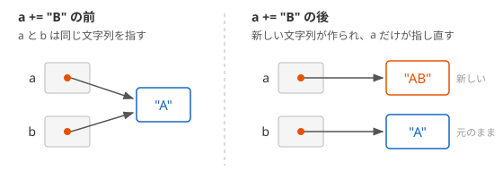

# 文字列の不変性と StringBuilder

`string` のオブジェクトは、一度作ると中身を変更できません。文字列を連結したり書き換えたりするメソッドは、元の文字列を変えずに、新しい文字列を作って返します。この性質を **不変性**（immutability）といいます。このページでは、文字列が変更できないことの意味と、ループの中で連結を繰り返すとヒープへの割り当てが急に増える問題、それを解決する **StringBuilder** を学びます。

## 学習目標

このページを読み終えると、以下のことができるようになります。

- `string` のオブジェクトは変更できず、`ToUpper` や `+` が新しい文字列を作ることを説明できる
- ループの中で `+=` による連結を繰り返すと、ヒープへの割り当てが回数の 2 乗に比例して増えることを説明できる
- `StringBuilder` を使って、少しずつ文字列を組み立てられる
- `+`、文字列補間、`StringBuilder`、`string.Join` を使い分けられる

## 前提知識

- [プリミティブ型と型変換](/unity-csharp-learning/csharp/primitive-types/) の `string` と文字列補間を読んでいること
- [値型と参照型](/unity-csharp-learning/csharp/value-reference-types/) と [ガベージコレクション](/unity-csharp-learning/csharp/garbage-collection/) を読んでいること
- [ボクシングとアンボクシング](/unity-csharp-learning/csharp/boxing/) で、`GC.GetAllocatedBytesForCurrentThread` を使ってヒープへの割り当てを測ったこと

---

## 1. 文字列は変更できない

[string](https://learn.microsoft.com/dotnet/csharp/language-reference/builtin-types/reference-types#the-string-type) には、文字列を加工するメソッドがたくさんあります。たとえば、[ToUpper メソッド](https://learn.microsoft.com/dotnet/api/system.string.toupper) は英字を大文字にし、[Replace メソッド](https://learn.microsoft.com/dotnet/api/system.string.replace) は指定した文字を別の文字に置き換えます。

```csharp
string s = "hello";
string upper = s.ToUpper();
string replaced = s.Replace('l', 'L');
Console.WriteLine(s);
Console.WriteLine(upper);
Console.WriteLine(replaced);
Console.WriteLine(s[0]);
```

```
hello
HELLO
heLLo
h
```

`ToUpper` と `Replace` を呼んだ後でも、`s` は `"hello"` のままです。どちらのメソッドも、`s` の中身を書き換えるのではなく、加工した結果を持つ新しい文字列を作って返します。

最後の行のように、`s[0]` で文字列の中の 1 文字を読むことはできます。しかし、[配列](/unity-csharp-learning/csharp/arrays/) の要素のように書き換えることはできません。`string` の [インデクサ](https://learn.microsoft.com/dotnet/api/system.string.chars) には `get` アクセサーしかないからです。

```csharp
string s = "hello";
s[0] = 'H';  // ❌ CS0200: 読み取り専用のインデクサには代入できない
```

`string` には、中身を書き換えるメソッドも、インデクサの `set` アクセサーもありません。そのため、一度作った `string` のオブジェクトの中身は、どのような方法でも変更できません。

### 変更できないので、安心して共有できる

文字列を書き換えられないことには、利点があります。同じ文字列を複数の場所で共有しても、どこかで中身が変わる心配がありません。

次のコードでは、`char` の配列と文字列を同じメソッドに渡しています。

```csharp
char[] chars = { 'c', 'a', 't' };
string text = "cat";
Change(chars, text);
Console.WriteLine(new string(chars));
Console.WriteLine(text);

void Change(char[] c, string s)
{
    c[0] = 'b';
}
```

```
bat
cat
```

配列も `string` も参照型なので、メソッドには同じオブジェクトへの参照が渡されます。配列はメソッドの中で書き換えられるので、呼び出し元の `chars` も `bat` になりました。`string` は書き換えられないので、渡した文字列が知らないうちに変わることはありません。

---

## 2. 連結すると新しい文字列が作られる

`+` や `+=` による連結も、ほかのメソッドと同じように、新しい文字列を作ります。次のコードで確かめます。

```csharp
string a = "A";
string b = a;
Console.WriteLine(object.ReferenceEquals(a, b));
a += "B";
Console.WriteLine(a);
Console.WriteLine(b);
Console.WriteLine(object.ReferenceEquals(a, b));
```

```
True
AB
A
False
```

`b = a` の時点では、`a` と `b` は同じ文字列のオブジェクトを指しています。`a += "B"` は `a = a + "B"` と同じ意味です。`a + "B"` は `"AB"` という新しい文字列を作り、`a` はその新しい文字列を指すように変わります。元の `"A"` は変わらず、`b` は `"A"` を指したままです。



### ループの中で連結を繰り返す

連結するたびに新しい文字列が作られることは、ループの中で問題になります。`+=` で 1 文字ずつ連結する処理を 1000 回、2000 回、4000 回繰り返して、ヒープに確保されたメモリの量を比べます。

```csharp
Console.WriteLine($"1000 回: {MeasureConcat(1000)} バイト");
Console.WriteLine($"2000 回: {MeasureConcat(2000)} バイト");
Console.WriteLine($"4000 回: {MeasureConcat(4000)} バイト");

long MeasureConcat(int count)
{
    long before = GC.GetAllocatedBytesForCurrentThread();
    string text = "";
    for (int i = 0; i < count; i++)
    {
        text += "a";
    }
    long after = GC.GetAllocatedBytesForCurrentThread();
    return after - before;
}
```

64 ビットの環境で実行した結果の例です。バイト数は実行環境によって変わることがあります。

```
1000 回: 1025976 バイト
2000 回: 4051976 バイト
4000 回: 16103976 バイト
```

最後にできる文字列は、1000 回なら 1000 文字です。`char` は 1 文字 2 バイトなので、文字の分はおよそ 2000 バイトです。ところが、1000 回の連結でおよそ 1 MB のメモリが確保されました。

連結するたびに、それまでの文字列の全体をコピーした、1 文字長い文字列が作られるからです。1 回目は 1 文字、2 回目は 2 文字、…、1000 回目は 1000 文字の文字列が作られるので、合計で 1 + 2 + … + 1000 = 500500 文字分の文字列が作られます。それまでに作った文字列は、次の連結で使われなくなり、[ガベージコレクション](/unity-csharp-learning/csharp/garbage-collection/) で回収されるのを待つだけになります。

回数を 2 倍にすると、確保されるメモリはおよそ 4 倍になっています。確保されるメモリの量は、連結する回数の 2 乗に比例して増えます。

---

## 3. StringBuilder

[StringBuilder クラス](https://learn.microsoft.com/dotnet/api/system.text.stringbuilder) は、文字列を少しずつ組み立てるためのクラスです。`string` と違って、中身を変更できます。`System.Text` 名前空間にあるので、ファイルの先頭に `using System.Text;` を書きます。

**書式：[StringBuilder.Append メソッド](https://learn.microsoft.com/dotnet/api/system.text.stringbuilder.append)**
```
StringBuilder 変数名 = new StringBuilder();
変数名.Append(追加する値);
string 結果 = 変数名.ToString();
```

| メンバー | 説明 |
|---|---|
| `Append(値)` | 値を末尾に追加する。`string` や `char` のほか、`int` などの数値も追加できる |
| [Length](https://learn.microsoft.com/dotnet/api/system.text.stringbuilder.length) | 現在の文字数 |
| [ToString()](https://learn.microsoft.com/dotnet/api/system.text.stringbuilder.tostring) | 組み立てた内容から `string` を作って返す |

```csharp
using System.Text;

StringBuilder builder = new StringBuilder();
builder.Append("Score: ");
builder.Append(100);
builder.Append('!');
Console.WriteLine(builder.Length);
string result = builder.ToString();
Console.WriteLine(result);
```

```
11
Score: 100!
```

`StringBuilder` は、文字をためておく領域を内部に持っています。`Append` は、その領域の空いているところに文字を書き込むだけで、新しい文字列を作りません。領域が足りなくなったときは、新しい領域を追加します。組み立てが終わったら、`ToString` で 1 回だけ `string` を作ります。

### ヒープに確保されるメモリを比べる

2 節と同じ処理を `StringBuilder` で書いて、ヒープに確保されたメモリの量を測ります。

```csharp
using System.Text;

Console.WriteLine($"1000 回: {MeasureBuilder(1000)} バイト");
Console.WriteLine($"2000 回: {MeasureBuilder(2000)} バイト");
Console.WriteLine($"4000 回: {MeasureBuilder(4000)} バイト");

long MeasureBuilder(int count)
{
    long before = GC.GetAllocatedBytesForCurrentThread();
    StringBuilder builder = new StringBuilder();
    for (int i = 0; i < count; i++)
    {
        builder.Append('a');
    }
    string text = builder.ToString();
    long after = GC.GetAllocatedBytesForCurrentThread();
    return after - before;
}
```

64 ビットの環境で実行した結果の例です。バイト数は実行環境によって変わることがあります。

```
1000 回: 4576 バイト
2000 回: 8696 バイト
4000 回: 16864 バイト
```

1000 回のとき、`+=` ではおよそ 1 MB だったメモリが、4576 バイトになりました。この中には、`StringBuilder` オブジェクト、文字をためる領域、最後に `ToString` で作った文字列が含まれています。回数を 2 倍にすると、確保されるメモリもおよそ 2 倍になり、回数に比例して増えるだけです。

---

## 4. 連結の方法の使い分け

`+` による連結がいつも問題になるわけではありません。1 つの式の中で `+` を使って文字列をつなぐと、コンパイラーはそれを [String.Concat メソッド](https://learn.microsoft.com/dotnet/api/system.string.concat) の 1 回の呼び出しに置き換えます。`String.Concat` は、つなぐ文字列の全体の長さを先に求めてから、結果の文字列を 1 つだけ作ります。

1 つの式で連結した場合と、`+=` を 2 回に分けて連結した場合を比べます。

```csharp
string first = "Alice";
string last = "Smith";

long before = GC.GetAllocatedBytesForCurrentThread();
string full1 = first + " " + last;
long after = GC.GetAllocatedBytesForCurrentThread();
Console.WriteLine($"{full1}（1 つの式）: {after - before} バイト");

before = GC.GetAllocatedBytesForCurrentThread();
string full2 = first;
full2 += " ";
full2 += last;
after = GC.GetAllocatedBytesForCurrentThread();
Console.WriteLine($"{full2}（+= を 2 回）: {after - before} バイト");
```

64 ビットの環境で実行した結果の例です。バイト数は実行環境によって変わることがあります。

```
Alice Smith（1 つの式）: 48 バイト
Alice Smith（+= を 2 回）: 88 バイト
```

1 つの式で連結したときは、結果の `"Alice Smith"` だけが作られました。`+=` を 2 回に分けたときは、途中の `"Alice "` も作られるので、その分が増えています。

文字列補間も、1 つの式で結果の文字列を作ります。つなぐものが決まっていて 1 つの式で書けるなら、`+` や文字列補間を使えば十分です。

| 場面 | 使うもの |
|---|---|
| つなぐものが決まっていて、1 つの式で書ける | `+` または文字列補間 |
| ループの中などで、少しずつ組み立てる | `StringBuilder` |
| 配列やコレクションの要素を区切り文字でつなぐ | [string.Join メソッド](https://learn.microsoft.com/dotnet/api/system.string.join) |

---

## よくあるミス

### 戻り値を受け取らない

文字列を加工するメソッドは、結果を戻り値で返します。戻り値を受け取らずに呼び出しても、コンパイルエラーにはなりませんが、何も変わりません。

```csharp
string s = "hello";
s.ToUpper();      // ❌ NG: 作られた大文字の文字列を捨てている
Console.WriteLine(s);
s = s.ToUpper();  // ✅ OK: 戻り値を変数に代入する
Console.WriteLine(s);
```

```
hello
HELLO
```

`s = s.ToUpper();` は、`s` の文字列を書き換えているのではありません。新しく作られた大文字の文字列を指すように、変数 `s` の中身を入れ替えています。

---

## ワンポイントアドバイス

### 同じ内容のリテラルは同じオブジェクトになる

プログラムの中に同じ内容の文字列リテラルが何度出てきても、実行時には 1 つのオブジェクトが共有されます。

```csharp
string s1 = "hello";
string s2 = "hello";
string s3 = new string(new[] { 'h', 'e', 'l', 'l', 'o' });
Console.WriteLine(object.ReferenceEquals(s1, s2));
Console.WriteLine(object.ReferenceEquals(s1, s3));
Console.WriteLine(s1 == s3);
```

```
True
False
True
```

`s1` と `s2` は、同じオブジェクトを指しています。このように共有できるのも、文字列を変更できないからです。実行中に作った `s3` は、中身が同じでも別のオブジェクトになります。[値型と参照型](/unity-csharp-learning/csharp/value-reference-types/) で `new string('a', 3)` を使ったのは、リテラルの共有を避けて、別々のオブジェクトを作るためでした。

### 文字列の一部を取り出すときもコピーされる

[Substring メソッド](https://learn.microsoft.com/dotnet/api/system.string.substring) のように、文字列の一部を取り出すメソッドも、取り出した部分をコピーした新しい文字列を作ります。長い文字列を少しずつ切り出しながら処理すると、切り出すたびにヒープにメモリが確保されます。このセクションの後のページでは、コピーを作らずに文字列や配列の一部を扱う方法を学びます。

---

## まとめ

- `string` のオブジェクトは変更できない。`ToUpper` や `Replace` は、新しい文字列を作って返す
- 文字列を変更できないので、複数の場所で共有しても中身が変わる心配がない
- `+` や `+=` による連結も新しい文字列を作る。ループの中で `+=` を繰り返すと、ヒープへの割り当てが回数の 2 乗に比例して増える
- `StringBuilder` は、内部の領域に文字を追加していき、`ToString` で 1 回だけ文字列を作る
- 1 つの式で書ける連結は `+` や文字列補間、少しずつ組み立てるときは `StringBuilder`、コレクションをつなぐときは `string.Join` を使う
- 文字列を加工するメソッドの戻り値は、変数に代入して受け取る

---

## 理解度チェック

1. `s.Replace('a', 'b')` を呼び出しても、`s` の中身が変わらないのはなぜですか？
2. 次のコードを実行すると何が出力されますか？

   ```csharp
   string a = "cat";
   string b = a;
   a += "s";
   b.ToUpper();
   Console.WriteLine(a);
   Console.WriteLine(b);
   Console.WriteLine(a.Length + b.Length);
   ```

3. `StringBuilder` を使って、`0` から `4` までの整数を `-` でつないだ文字列 `0-1-2-3-4` を作り、出力するコードを書いてください。

<details markdown="1">
<summary>解答を見る</summary>

1. `string` のオブジェクトは変更できないからです。`Replace` は、`s` を書き換えずに、置き換えた結果を持つ新しい文字列を作って返します。
2. 次のように出力されます。`a += "s"` は新しい文字列 `"cats"` を作って `a` に代入するので、`b` は `"cat"` のままです。`b.ToUpper()` は戻り値を捨てているので、`b` は変わりません。

   ```
   cats
   cat
   7
   ```

3. ```csharp
   using System.Text;

   StringBuilder builder = new StringBuilder();
   for (int i = 0; i < 5; i++)
   {
       if (i > 0)
       {
           builder.Append('-');
       }
       builder.Append(i);
   }
   Console.WriteLine(builder.ToString());
   ```

</details>

---

## 次のステップ

[ref ローカルと ref 戻り値](/unity-csharp-learning/csharp/ref-locals/) では、変数そのものを指す参照を変数に入れたり、メソッドから返したりする方法を学びます。コピーを作らずにデータの一部を扱うための準備です。
