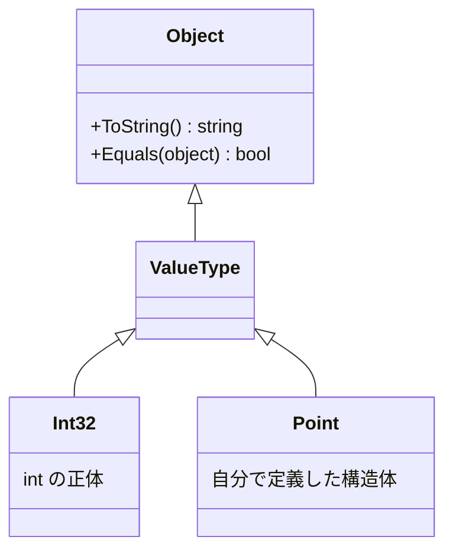

# 構造体の制約

構造体は、クラスと同じようにメンバーを書けますが、値型であるためにクラスとは違う決まりがあります。このページでは、構造体が継承できないこと、インターフェイスは実装できること、コンストラクターの規則、書き換えられない構造体を定義する `readonly struct` を学びます。

## 学習目標

このページを読み終えると、以下のことができるようになります。

- 構造体が継承できないことと、すべての構造体の基底クラスを説明できる
- 構造体にインターフェイスを実装できる
- `default` や配列の要素では、構造体のコンストラクターが呼ばれないことを説明できる
- `readonly struct` で、作った後に書き換えられない構造体を定義できる

## 前提知識

- [構造体](/unity-csharp-learning/csharp/structs/) を読んでいること
- [継承](/unity-csharp-learning/csharp/inheritance/) を読んでいること
- [メソッドの隠ぺいと sealed](/unity-csharp-learning/csharp/method-hiding/) を読んでいること
- [インターフェイス](/unity-csharp-learning/csharp/interfaces/) を読んでいること

---

## 1. 構造体は継承できない

構造体は、ほかの構造体やクラスを継承できません。また、構造体を継承したクラスや構造体も作れません。構造体は、暗黙的に `sealed` になっています。

```csharp
// ❌ NG: 構造体は、構造体を継承できない
// struct A { }
// struct B : A { }  // CS0527

// ❌ NG: 構造体を継承したクラスは作れない
// class C : A { }  // CS0509
```

ただし、構造体に基底クラスがないわけではありません。すべての構造体は、[System.ValueType クラス](https://learn.microsoft.com/dotnet/api/system.valuetype) を暗黙的に継承しています。`ValueType` は `object` を継承しているので、構造体も `object` のメンバーを持っています。`int` などの数値型も、.NET の中では構造体として定義されていて、同じ位置にあります。



そのため、構造体でも `object` の `ToString` をオーバーライドできます。

```csharp
Point p = new Point(1, 2);
Console.WriteLine(p);

struct Point
{
    public int X;
    public int Y;

    public Point(int x, int y)
    {
        X = x;
        Y = y;
    }

    public override string ToString()
    {
        return $"({X}, {Y})";
    }
}
```

```
(1, 2)
```

`Console.WriteLine` に `p` を渡すと、オーバーライドした `ToString` の戻り値が表示されます。

---

## 2. インターフェイスは実装できる

継承はできませんが、インターフェイスは実装できます。書き方はクラスと同じです。

```csharp
Point p = new Point(3, 4);
Console.WriteLine(p.Describe());

interface IDescribable
{
    string Describe();
}

struct Point : IDescribable
{
    public int X;
    public int Y;

    public Point(int x, int y)
    {
        X = x;
        Y = y;
    }

    public string Describe()
    {
        return $"点 ({X}, {Y})";
    }
}
```

```
点 (3, 4)
```

構造体の値を、インターフェイス型の変数に代入することもできます。ただし、そのときは値がコピーされ、ヒープに置かれます。この仕組みは、[ボクシングとアンボクシング](/unity-csharp-learning/csharp/boxing/) で学びます。

---

## 3. コンストラクターと既定値

C# 10 以降では、構造体にも、パラメータのないコンストラクターを書けます。ただし、次の場合は、そのコンストラクターは呼ばれません。

- `default` で既定値を作るとき（[値型と参照型](/unity-csharp-learning/csharp/value-reference-types/) の 5 節）
- 配列を作ったときの要素

これらの場合、すべてのフィールドが 0（参照型のフィールドは `null`）の値になります。

```csharp
Counter c1 = new Counter();
Counter c2 = default;
Counter[] counters = new Counter[1];

Console.WriteLine($"new: {c1.Value}");
Console.WriteLine($"default: {c2.Value}");
Console.WriteLine($"配列の要素: {counters[0].Value}");

struct Counter
{
    public int Value;

    public Counter()
    {
        Value = 1;
    }
}
```

```
new: 1
default: 0
配列の要素: 0
```

`new Counter()` ではコンストラクターが呼ばれて `Value` が `1` になりますが、`default` と配列の要素では `0` のままです。構造体は、すべてのフィールドが 0 の状態でも正しく使えるように設計しておくのが基本です。

---

## 4. readonly struct

[構造体](/unity-csharp-learning/csharp/structs/) で、値を書き換えられる構造体は、コピーを書き換えてしまう間違いを起こしやすいことを学びました。`struct` の前に `readonly` を付けると、作った後に書き換えられない構造体になります。

**書式：[readonly struct](https://learn.microsoft.com/dotnet/csharp/language-reference/builtin-types/struct#readonly-struct)**
```
readonly struct 構造体名
{
    // メンバー
}
```

`readonly struct` のメンバーには、値を書き換える手段を持たせられません。[プロパティ](/unity-csharp-learning/csharp/properties/) で学んだ `{ get; }` の読み取り専用プロパティを使い、値はコンストラクターで設定します。

```csharp
Point p = new Point(1, 2);
Point moved = p.Move(10, 0);

Console.WriteLine($"p = ({p.X}, {p.Y})");
Console.WriteLine($"moved = ({moved.X}, {moved.Y})");

readonly struct Point
{
    public int X { get; }
    public int Y { get; }

    public Point(int x, int y)
    {
        X = x;
        Y = y;
    }

    public Point Move(int dx, int dy)
    {
        return new Point(X + dx, Y + dy);
    }
}
```

```
p = (1, 2)
moved = (11, 2)
```

`Move` は、`p` を書き換えるのではなく、移動した後の値を新しく作って返します。書き換えられないので、値がコピーされても、どちらを書き換えたのかを気にする必要がありません。

`readonly struct` に、書き換えられるフィールドやプロパティを書くと、コンパイルエラーになります。

```csharp
// ❌ NG: readonly struct に書き換えられるメンバーを書いている
// readonly struct P
// {
//     public int X;                // CS8340
//     public int Y { get; set; }   // CS8341
// }
```

構造体を定義するときは、書き換える必要がなければ `readonly struct` にするのがおすすめです。

---

## ワンポイントアドバイス

### readonly struct と in パラメータ

[ref / out / in パラメータ](/unity-csharp-learning/csharp/ref-out-in/) で学んだ `in` パラメータは、大きな構造体をコピーせずに、読み取り専用で渡すための仕組みです。`readonly struct` ではない構造体を `in` で受け取ってメソッドやプロパティを使うと、値を書き換えられないことを保証するために、コンパイラーが内部で値のコピーを作ることがあります。`readonly struct` なら書き換えられないことがわかっているので、このコピーは作られません。`in` で渡す構造体は、`readonly struct` にしておきましょう。

---

## まとめ

- 構造体は継承できず、ほかの型から継承されることもない。すべての構造体は `System.ValueType` を暗黙的に継承している
- 構造体はインターフェイスを実装できる
- パラメータのないコンストラクターを書いても、`default` や配列の要素では呼ばれない
- `readonly struct` は、作った後に書き換えられない構造体。書き換える必要がなければ `readonly struct` にする

---

## 理解度チェック

1. 構造体を継承したクラスを作れないのはなぜですか？
2. 次のコードを実行すると何が出力されますか？

   ```csharp
   Temperature[] temps = new Temperature[2];
   temps[0] = new Temperature();

   Console.WriteLine(temps[0].Celsius);
   Console.WriteLine(temps[1].Celsius);

   struct Temperature
   {
       public double Celsius;

       public Temperature()
       {
           Celsius = 20.5;
       }
   }
   ```

3. （応用）次の `Size` 構造体を `readonly struct` に書き換え、幅と高さを 2 倍にした新しい値を返す `Double` メソッドを追加してください。

   ```csharp
   struct Size
   {
       public int Width;
       public int Height;
   }
   ```

<details markdown="1">
<summary>解答を見る</summary>

1. 構造体は暗黙的に `sealed` になっているからです（CS0509）。
2. 次のように出力されます。`temps[0]` には `new Temperature()` で作った値を代入したのでコンストラクターの `20.5` になり、`temps[1]` は配列の要素なのでコンストラクターが呼ばれず `0` のままです。

   ```
   20.5
   0
   ```

3. ```csharp
   readonly struct Size
   {
       public int Width { get; }
       public int Height { get; }

       public Size(int width, int height)
       {
           Width = width;
           Height = height;
       }

       public Size Double()
       {
           return new Size(Width * 2, Height * 2);
       }
   }
   ```

</details>

---

## 次のステップ

[ボクシングとアンボクシング](/unity-csharp-learning/csharp/boxing/) では、値型の値を `object` やインターフェイスとして扱うときに起きることを学びます。
