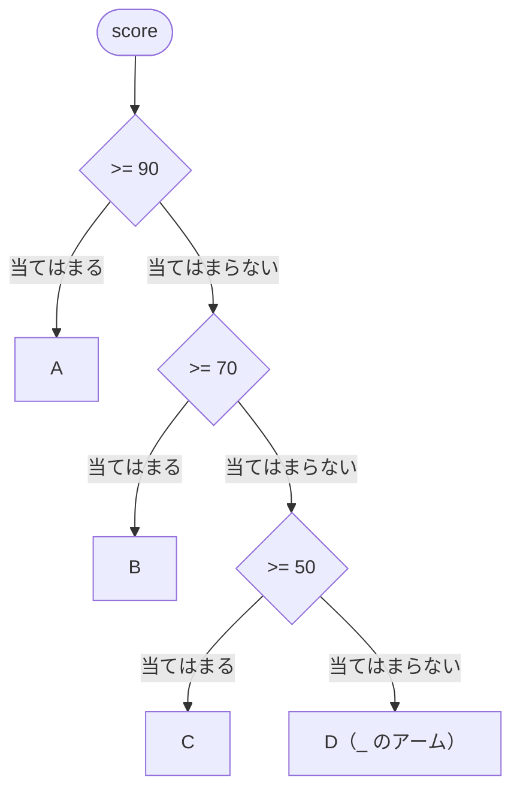

# switch 式

**switch 式**（switch expression）は、値がどのパターンに当てはまるかによって、結果の値を 1 つ選ぶ式です。[パターンと is 演算子](/unity-csharp-learning/csharp/is-patterns/) では、`is` で 1 つのパターンを調べました。`switch` 式では、パターンを上から順に並べて、最初に当てはまったパターンの結果を選びます。

## 学習目標

このページを読み終えると、以下のことができるようになります。

- `switch` 式で、値によって結果を選べる
- `switch` 式が、すべての値を扱っていないときの警告と例外を説明できる
- 定数パターン・型パターン・関係パターン・論理パターンを、`switch` 式のアームに並べられる
- `when` で、パターンに変数を使った条件を追加できる
- `switch` 文の `case` に、パターンを書ける

## 前提知識

- [条件分岐](/unity-csharp-learning/csharp/conditionals/) を読んでいること
- [列挙型](/unity-csharp-learning/csharp/enums/) を読んでいること
- [パターンと is 演算子](/unity-csharp-learning/csharp/is-patterns/) を読んでいること

---

## 1. switch 文で値を選ぶときの手間

向きを表す列挙型の値から、向きの名前を選ぶとします。[条件分岐](/unity-csharp-learning/csharp/conditionals/) で学んだ `switch` 文では、次のように書きます。

```csharp
Direction d = Direction.South;

string name;
switch (d)
{
    case Direction.North:
        name = "北";
        break;
    case Direction.East:
        name = "東";
        break;
    case Direction.South:
        name = "南";
        break;
    case Direction.West:
        name = "西";
        break;
    default:
        name = "不明";
        break;
}
Console.WriteLine(name);

enum Direction
{
    North,
    East,
    South,
    West
}
```

```
南
```

やりたいことは「`d` に応じた名前を 1 つ選ぶ」だけですが、`case` ごとに `name =` と `break;` を書く必要があります。`switch` 文は、処理を分けるための文だからです。

---

## 2. switch 式

**書式：[switch 式](https://learn.microsoft.com/dotnet/csharp/language-reference/operators/switch-expression)**
```
式 switch
{
    パターン1 => 結果1,
    パターン2 => 結果2,
    _ => どれにも当てはまらないときの結果,
}
```

| 要素 | 説明 |
|---|---|
| `式 switch` | `switch` の前に、調べる値を書く |
| `パターン => 結果` | **アーム**（arm）。`式` がパターンに当てはまったら、`結果` が `switch` 式の値になる。アームは `,` で区切る |
| `_` | **破棄パターン**。どんな値にも当てはまる。`switch` 文の `default` に当たる |

1 節のコードを、`switch` 式で書き直します。`Direction.North` などは、[パターンと is 演算子](/unity-csharp-learning/csharp/is-patterns/) で学んだ定数パターンです。

```csharp
Direction d = Direction.South;

string name = d switch
{
    Direction.North => "北",
    Direction.East => "東",
    Direction.South => "南",
    Direction.West => "西",
    _ => "不明",
};
Console.WriteLine(name);

enum Direction
{
    North,
    East,
    South,
    West
}
```

```
南
```

アームは上から順に調べられ、最初に当てはまったアームの結果が選ばれます。`switch` 式は式なので、変数の初期化子や、メソッドの引数、`return` の後ろにそのまま書けます。最後のアームの後ろの `,` は、あってもなくてもかまいません。

---

## 3. すべての値を扱う

`switch` 式は、必ず何かの値にならなければいけません。そのため、どのアームにも当てはまらない値があると、コンパイラーが警告を出します。

```csharp
// ⚠️ NG: 1 と 2 以外の値を扱っていない（警告 CS8509）
// int day = 9;
// string kind = day switch
// {
//     1 => "月",
//     2 => "火",
// };
// Console.WriteLine(kind);
```

警告のまま実行して、どのアームにも当てはまらなかった場合は、例外 [SwitchExpressionException](https://learn.microsoft.com/dotnet/api/system.runtime.compilerservices.switchexpressionexception) が発生します。

```
Unhandled exception. System.Runtime.CompilerServices.SwitchExpressionException: Non-exhaustive switch expression failed to match its input.
Unmatched value was 9.
```

列挙型では、すべてのメンバーのアームを書いても、`_` がないと警告 CS8524 が出ます。[列挙型](/unity-csharp-learning/csharp/enums/) で学んだように、列挙型の変数には `(Direction)4` のような、定義されていない値も入るからです。

`switch` 式には、最後に `_` のアームを書いて、どの値でも結果が決まるようにします。

---

## 4. アームにパターンを並べる

アームには、[パターンと is 演算子](/unity-csharp-learning/csharp/is-patterns/) で学んだどのパターンも書けます。`is` では 1 つのパターンを調べましたが、`switch` 式では、パターンを順に並べて、当てはまったものの結果を選べます。

### 定数パターンと型パターン

```csharp
object?[] values = { 42, "abc", null, 1.5 };

foreach (object? v in values)
{
    string text = v switch
    {
        null => "null",
        int i => $"整数 {i}",
        string s => $"文字列 {s}",
        _ => "その他",
    };
    Console.WriteLine(text);
}
```

```
整数 42
文字列 abc
null
その他
```

`null` は定数パターン、`int i` と `string s` は型パターンです。型パターンに当てはまると、変換した値が変数に入り、そのアームの結果の中で使えます。`1.5` は `double` なので、どのアームにも当てはまらず、`_` のアームが選ばれます。

### 関係パターン

点数から成績を選びます。

```csharp
int score = 75;

string grade = score switch
{
    >= 90 => "A",
    >= 70 => "B",
    >= 50 => "C",
    _ => "D",
};
Console.WriteLine(grade);
```

```
B
```

`75` は `>= 90` には当てはまらず、次の `>= 70` に当てはまるので `B` です。アームは上から順に調べられるので、`>= 70` のアームには、実際には「70 以上 90 未満」の値だけが来ます。`if` と `else if` で書くと、`score >= 90`、`score >= 70` のように、条件ごとに `score` を書くことになります。



### 論理パターン

[条件分岐](/unity-csharp-learning/csharp/conditionals/) で `case` を並べて書いた曜日の判定は、次のように書けます。

```csharp
int day = 6;

string kind = day switch
{
    >= 1 and <= 5 => "平日",
    6 or 7 => "休日",
    _ => "無効な値",
};
Console.WriteLine(kind);
```

```
休日
```

---

## 5. when で条件を追加する

[パターンと is 演算子](/unity-csharp-learning/csharp/is-patterns/) で学んだように、パターンには定数しか書けません。合格点を変数 `passLine` で決めているとき、`>= passLine` というパターンは書けません。

`switch` 式のアームでは、パターンの後ろに `when 条件式` を書けます。パターンに当てはまり、さらに条件式が `true` のときだけ、そのアームが選ばれます。この条件を **ケースガード**（case guard）といいます。条件式には、変数を使えます。

**書式：[ケースガード](https://learn.microsoft.com/dotnet/csharp/language-reference/operators/switch-expression#case-guards)**
```
パターン when 条件式 => 結果
```

```csharp
int passLine = 60;
int[] scores = { 95, 70, 40 };

foreach (int s in scores)
{
    string result = s switch
    {
        >= 90 => "優秀",
        _ when s >= passLine => "合格",
        _ => "不合格",
    };
    Console.WriteLine($"{s} 点: {result}");
}
```

```
95 点: 優秀
70 点: 合格
40 点: 不合格
```

`_ when s >= passLine` は、「値は何でもよいが、`s >= passLine` が `true` のとき」というアームです。`70` は `>= 90` に当てはまらず、次のアームで `70 >= 60` が `true` なので `合格` です。

`when` の条件式では、型パターンで取り出した変数も使えます。4 節の例に、負の整数のアームを追加します。

```csharp
object?[] values = { 42, -3, "abc", null, 1.5 };

foreach (object? v in values)
{
    string text = v switch
    {
        null => "null",
        int i when i < 0 => $"負の整数 {i}",
        int i => $"整数 {i}",
        string s => $"文字列 {s}",
        _ => "その他",
    };
    Console.WriteLine(text);
}
```

```
整数 42
負の整数 -3
文字列 abc
null
その他
```

`-3` は `int i` に当てはまり、`i < 0` も `true` なので、`負の整数 -3` になります。`42` は `i < 0` が `false` なので、次の `int i` のアームに進みます。このアームは `int i and < 0` とも書けますが、`when` を使うと、パターンでは書けない条件（変数との比較や、メソッドの呼び出しなど）も書けます。

`is` 演算子には `when` を書けません。`is` では、`v is int i && i < 0` のように `&&` で条件をつなぎます。

---

## 6. switch 文の case でパターンを使う

パターンと `when` は、`switch` 文の `case` にも書けます。処理そのものを分けたいときは、`switch` 文を使います。

```csharp
int n = 7;

switch (n)
{
    case < 0:
        Console.WriteLine("負の数");
        break;
    case int x when x % 2 == 0:
        Console.WriteLine("0 以上の偶数");
        break;
    default:
        Console.WriteLine("0 以上の奇数");
        break;
}
```

```
0 以上の奇数
```

`case` の順番も、`switch` 式のアームと同じく、上から調べられます。

---

## よくあるミス

### 広いパターンを先に書く

```csharp
// ❌ NG: > 0 のアームが、> 10 の値も先に受け取ってしまう
// int x = 3;
// string r = x switch
// {
//     > 0 => "正",
//     > 10 => "10 より大きい",  // CS8510
//     _ => "0 以下",
// };
```

アームは上から順に調べられるので、`> 10` に当てはまる値は、すべてその前の `> 0` に当てはまります。`> 10` のアームが選ばれることはないので、コンパイラーが CS8510 のエラーにします。`switch` 文の `case` でも、同じ場合は CS8120 のエラーになります。狭いパターンから先に書きます。

### _ のアームを書かない

3 節のように、`_` のアームがないと、扱っていない値があるという警告（CS8509、列挙型では CS8524）が出ます。警告のまま、どのアームにも当てはまらない値が来ると、`SwitchExpressionException` が発生します。

---

## ワンポイントアドバイス

### switch 文と switch 式の使い分け

値に応じて結果の値を 1 つ選ぶときは、`switch` 式が向いています。代入や `break` を書く必要がなく、すべての値を扱っているかもコンパイラーが確かめます。

値に応じて、実行する処理そのものを変えるときは、`switch` 文を使います。`switch` 式のアームには、値を 1 つ書くことしかできず、複数の文を書けないからです。

---

## まとめ

- `switch` 式は、`式 switch { パターン => 結果, ... }` で、値に応じて結果を 1 つ選ぶ式。アームは上から順に調べられる
- どのアームにも当てはまらない値があると警告（CS8509 / CS8524）が出て、実行時に当てはまらなければ `SwitchExpressionException` が発生する。最後に `_` のアームを書く
- アームには、定数・型・関係・論理パターンを並べられる。狭いパターンから先に書く
- `when 条件式` で、アームに条件を追加できる。条件式には、変数や、型パターンで取り出した値を使える
- パターンと `when` は、`switch` 文の `case` にも書ける

---

## 理解度チェック

1. 次のコードを実行すると何が出力されますか？

   ```csharp
   int[] temps = { -5, 12, 28, 35 };

   foreach (int t in temps)
   {
       string feel = t switch
       {
           < 0 => "氷点下",
           < 15 => "寒い",
           >= 15 and < 30 => "快適",
           _ => "暑い",
       };
       Console.WriteLine(feel);
   }
   ```

2. 次の `switch` 文を、`switch` 式で書き直してください。

   ```csharp
   char c = 'b';
   string kind;
   switch (c)
   {
       case 'a':
       case 'i':
       case 'u':
       case 'e':
       case 'o':
           kind = "母音";
           break;
       default:
           kind = "子音";
           break;
   }
   Console.WriteLine(kind);
   ```

3. 次のコードはコンパイルエラーになります。どのアームが問題で、どう直せばよいですか？

   ```csharp
   int level = 42;
   string rank = level switch
   {
       >= 10 => "中級",
       >= 50 => "上級",
       _ => "初級",
   };
   ```

4. 変数 `limit` より大きい値のときに `"超過"`、それ以外で `"範囲内"` を選ぶ `switch` 式を書いてください。調べる変数は `value` とします。

<details markdown="1">
<summary>解答を見る</summary>

1. 次のように出力されます。`12` は `< 0` に当てはまらず、`< 15` に当てはまります。`35` は `>= 15 and < 30` に当てはまらないので、`_` のアームが選ばれます。

   ```
   氷点下
   寒い
   快適
   暑い
   ```

2. 論理パターンの `or` を使います。`子音` と表示されます。

   ```csharp
   char c = 'b';
   string kind = c switch
   {
       'a' or 'i' or 'u' or 'e' or 'o' => "母音",
       _ => "子音",
   };
   Console.WriteLine(kind);
   ```

3. `>= 50` のアームです。`>= 50` に当てはまる値は、すべてその前の `>= 10` に当てはまるので、`>= 50` のアームは選ばれることがありません（CS8510）。`>= 50` のアームを `>= 10` より先に書きます。
4. `limit` は変数なので、パターンには書けません。`when` を使います。

   ```csharp
   string state = value switch
   {
       _ when value > limit => "超過",
       _ => "範囲内",
   };
   ```

</details>

---

## 次のステップ

[プロパティパターン](/unity-csharp-learning/csharp/property-patterns/) では、オブジェクトのプロパティの値を調べるパターンと、その使いどころを学びます。
