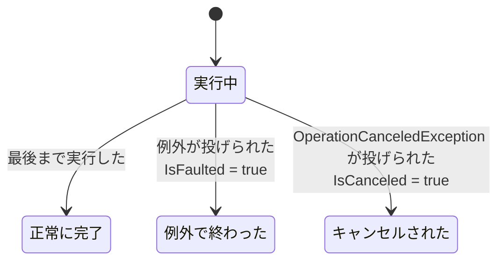

# キャンセル

[複数の Task を待つ](/unity-csharp-learning/csharp/task-whenall/) では、タイムアウトしても元の処理は止まらないことを学びました。実行中の非同期処理を途中でやめさせるには、**キャンセル**（cancellation）の仕組みを使います。.NET のキャンセルは、外から処理を無理やり止めるのではなく、「やめてほしい」という要求を処理の側が確かめて、自分で終わる方式です。このページでは、`CancellationTokenSource` と `CancellationToken` を使ったキャンセルを学びます。

## 学習目標

このページを読み終えると、以下のことができるようになります。

- `CancellationTokenSource` でキャンセルを要求し、`CancellationToken` で要求を受け取れる
- `ThrowIfCancellationRequested` で処理をやめ、`OperationCanceledException` で呼び出し元に伝えられる
- `Task.Delay` などのメソッドに `CancellationToken` を渡して、待っている途中でやめさせられる
- `CancelAfter` で、一定の時間が経ったらキャンセルするタイムアウトを作れる

## 前提知識

- [複数の Task を待つ](/unity-csharp-learning/csharp/task-whenall/) を読んでいること
- [IDisposable と using](/unity-csharp-learning/csharp/dispose-using/) を読んでいること

---

## 1. 協調的なキャンセル

実行中の処理を外から強制的に止めると、処理がどこまで進んだかわからない状態で止まります。`lock` の中で止まればロックが解放されず、ファイルの書き込みの途中で止まれば中途半端なファイルが残ります。そのため .NET では、処理を外から強制的に止める方法は用意されていません。

代わりに、キャンセルは次の 2 つの役割で行います。

| 役割 | 使うもの | すること |
|---|---|---|
| キャンセルを要求する側 | [CancellationTokenSource クラス](https://learn.microsoft.com/dotnet/api/system.threading.cancellationtokensource) | `Cancel` メソッドで、キャンセルを要求する |
| キャンセルに応じる側 | [CancellationToken 構造体](https://learn.microsoft.com/dotnet/api/system.threading.cancellationtoken) | キャンセルが要求されたかを、きりのよいところで確かめ、要求されていれば自分で終わる |

`CancellationTokenSource` の [Token プロパティ](https://learn.microsoft.com/dotnet/api/system.threading.cancellationtokensource.token) で取り出した `CancellationToken` を、キャンセルに応じる処理にパラメータとして渡します。処理の側は、渡された `CancellationToken` から、キャンセルが要求されたかどうかを調べられますが、自分でキャンセルを要求することはできません。要求する側と応じる側が協力して終わるので、この方式を **協調的なキャンセル** といいます。

`CancellationTokenSource` は `IDisposable` を実装しているので、`using` 宣言で使います。

---

## 2. キャンセルを要求し、確かめる

キャンセルを要求するには、`CancellationTokenSource` の `Cancel` メソッドを呼びます。応じる側は、`CancellationToken` の `IsCancellationRequested` プロパティで、要求されたかどうかを調べます。

**書式：[CancellationTokenSource.Cancel メソッド](https://learn.microsoft.com/dotnet/api/system.threading.cancellationtokensource.cancel)**
```csharp
public void Cancel();
```

**書式：[CancellationToken.IsCancellationRequested プロパティ](https://learn.microsoft.com/dotnet/api/system.threading.cancellationtoken.iscancellationrequested)**
```csharp
public bool IsCancellationRequested { get; }
```

次のコードでは、0.2 秒ごとに数を表示する `CountAsync` を開始し、0.5 秒後にキャンセルを要求します。

```csharp
using CancellationTokenSource source = new CancellationTokenSource();

Task task = CountAsync(source.Token);

await Task.Delay(500);
source.Cancel();
Console.WriteLine("Main: キャンセルを要求した");

await task;
Console.WriteLine("Main: 終了");

async Task CountAsync(CancellationToken token)
{
    for (int i = 0; i < 10; i++)
    {
        if (token.IsCancellationRequested)
        {
            Console.WriteLine("CountAsync: キャンセルされたのでやめる");
            return;
        }
        Console.WriteLine($"CountAsync: {i}");
        await Task.Delay(200);
    }
}
```

実行結果の例です。表示される数の個数は、時間の進み方によって変わることがあります。

```
CountAsync: 0
CountAsync: 1
CountAsync: 2
Main: キャンセルを要求した
CountAsync: キャンセルされたのでやめる
Main: 終了
```

`CountAsync` は、0 秒・0.2 秒・0.4 秒の時点で数を表示します。0.5 秒の時点で `Cancel` が呼ばれ、0.6 秒の時点で `IsCancellationRequested` が `true` になっていることを確かめて、`return` で終わります。

`Cancel` を呼んでも、`CountAsync` がすぐに止まるわけではありません。`CountAsync` が次に `IsCancellationRequested` を確かめるまで、処理は続きます。キャンセルにどれだけ早く応じられるかは、応じる側がどれだけこまめに確かめるかで決まります。

---

## 3. OperationCanceledException でキャンセルを伝える

前の節の `CountAsync` は、キャンセルされたときに `return` で終わりました。これでは、呼び出し元から見ると、最後まで実行して終わったのか、キャンセルされて途中で終わったのかを区別できません。

キャンセルされたことを呼び出し元に伝えるには、[OperationCanceledException](https://learn.microsoft.com/dotnet/api/system.operationcanceledexception) を投げます。`CancellationToken` の `ThrowIfCancellationRequested` メソッドは、キャンセルが要求されていれば `OperationCanceledException` を投げ、要求されていなければ何もしません。

**書式：[CancellationToken.ThrowIfCancellationRequested メソッド](https://learn.microsoft.com/dotnet/api/system.threading.cancellationtoken.throwifcancellationrequested)**
```csharp
public void ThrowIfCancellationRequested();
```

async メソッドの中で `OperationCanceledException` が投げられると、戻り値の `Task` は、例外で終わった状態ではなく、**キャンセルされた** 状態で完了します。キャンセルされた `Task` では、[IsCanceled プロパティ](https://learn.microsoft.com/dotnet/api/system.threading.tasks.task.iscanceled) が `true` になります。その `Task` を `await` すると、`OperationCanceledException` が投げられます。次のコードは、前のコード例とは別のプログラムです。

```csharp
using CancellationTokenSource source = new CancellationTokenSource();

Task task = CountAsync(source.Token);

await Task.Delay(500);
source.Cancel();

try
{
    await task;
}
catch (OperationCanceledException)
{
    Console.WriteLine("Main: キャンセルされた");
}
Console.WriteLine($"IsCanceled = {task.IsCanceled}");
Console.WriteLine($"IsFaulted = {task.IsFaulted}");

async Task CountAsync(CancellationToken token)
{
    for (int i = 0; i < 10; i++)
    {
        token.ThrowIfCancellationRequested();
        Console.WriteLine($"CountAsync: {i}");
        await Task.Delay(200);
    }
}
```

実行結果の例です。表示される数の個数は、時間の進み方によって変わることがあります。

```
CountAsync: 0
CountAsync: 1
CountAsync: 2
Main: キャンセルされた
IsCanceled = True
IsFaulted = False
```

`IsFaulted` は `False` なので、キャンセルは失敗（例外で終わること）とは区別されています。呼び出し元は、`catch (OperationCanceledException)` でキャンセルだけを受け止められます。



---

## 4. 待っている途中でキャンセルする

前の節の `CountAsync` は、`Task.Delay(200)` を待っている間にキャンセルされても、待ち終わるまでは気づけません。`Task.Delay` をはじめとする多くの非同期メソッドには、`CancellationToken` を受け取るオーバーロードがあります。`CancellationToken` を渡しておくと、待っている途中でキャンセルが要求されたとき、すぐにキャンセルされた状態で完了します。

**書式：[Task.Delay メソッド](https://learn.microsoft.com/dotnet/api/system.threading.tasks.task.delay)（CancellationToken）**
```csharp
public static Task Delay(int millisecondsDelay, CancellationToken cancellationToken);
```

一定の時間が経ったらキャンセルを要求するには、`CancellationTokenSource` の `CancelAfter` メソッドを使います。

**書式：[CancellationTokenSource.CancelAfter メソッド](https://learn.microsoft.com/dotnet/api/system.threading.cancellationtokensource.cancelafter)**
```csharp
public void CancelAfter(int millisecondsDelay);
```

| パラメータ | 説明 |
|---|---|
| `millisecondsDelay` | キャンセルを要求するまでの時間（ミリ秒） |

次のコードは、5 秒待つ `Task.Delay` を、0.3 秒でキャンセルします。

```csharp
using System.Diagnostics;

using CancellationTokenSource source = new CancellationTokenSource();
source.CancelAfter(300);

Stopwatch sw = Stopwatch.StartNew();
try
{
    await Task.Delay(5000, source.Token);
    Console.WriteLine("5 秒待った");
}
catch (OperationCanceledException e)
{
    Console.WriteLine($"{e.GetType().Name}: {sw.ElapsedMilliseconds} ミリ秒でキャンセルされた");
}
```

実行結果の例です。時間は環境や実行するたびに変わりますが、300 ミリ秒を少し超える程度になります。

```
TaskCanceledException: 313 ミリ秒でキャンセルされた
```

5 秒待たずに、およそ 0.3 秒でキャンセルされています。投げられた例外は [TaskCanceledException](https://learn.microsoft.com/dotnet/api/system.threading.tasks.taskcanceledexception) です。`TaskCanceledException` は `OperationCanceledException` の派生クラスなので、`catch (OperationCanceledException)` で受け止められます。

### キャンセルをタイムアウトに使う

[複数の Task を待つ](/unity-csharp-learning/csharp/task-whenall/) では、`Task.WhenAny` でタイムアウトを作りましたが、元の処理は止まりませんでした。`CancelAfter` で作った `CancellationToken` を処理に渡せば、タイムアウトしたときに処理そのものをやめさせられます。受け取った `CancellationToken` は、中で呼び出す非同期メソッドにそのまま渡します。

```csharp
using CancellationTokenSource source = new CancellationTokenSource();
source.CancelAfter(500);

try
{
    string result = await DownloadAsync(source.Token);
    Console.WriteLine(result);
}
catch (OperationCanceledException)
{
    Console.WriteLine("タイムアウトした");
}

async Task<string> DownloadAsync(CancellationToken token)
{
    for (int i = 1; i <= 5; i++)
    {
        await Task.Delay(200, token);
        Console.WriteLine($"{i * 20}% 受信");
    }
    return "受信完了";
}
```

実行結果の例です。表示される行の数は、時間の進み方によって変わることがあります。

```
20% 受信
40% 受信
タイムアウトした
```

0.5 秒の時点で、3 回目の `Task.Delay(200, token)` を待っている途中にキャンセルされ、`DownloadAsync` はそこで終わります。`60% 受信` 以降は表示されません。

---

## よくあるミス

### TaskCanceledException だけを catch する

`Task.Delay` のキャンセルでは `TaskCanceledException` が投げられますが、`ThrowIfCancellationRequested` が投げるのは `OperationCanceledException` です。

```csharp
// ❌ NG: ThrowIfCancellationRequested による OperationCanceledException を受け止められない
catch (TaskCanceledException)
{
    Console.WriteLine("キャンセルされた");
}

// ✅ OK: 派生クラスの TaskCanceledException も含めて受け止める
catch (OperationCanceledException)
{
    Console.WriteLine("キャンセルされた");
}
```

[例外の基本](/unity-csharp-learning/csharp/exceptions/) で学んだように、`catch` は指定した型とその派生クラスの例外を受け止めます。キャンセルを受け止めるときは、基底クラスの `OperationCanceledException` を指定します。

---

## ワンポイントアドバイス

### キャンセルしないときは CancellationToken.None

`CancellationToken` を受け取るメソッドを、キャンセルせずに呼び出したいときは、[CancellationToken.None プロパティ](https://learn.microsoft.com/dotnet/api/system.threading.cancellationtoken.none) を渡します。`CancellationToken.None` は、キャンセルが要求されることのない `CancellationToken` です。自分で async メソッドを作るときは、`CancellationToken token = default` のように [省略可能パラメータ](/unity-csharp-learning/csharp/optional-named-params/) にしておくと、キャンセルしない呼び出し元は引数を省略できます。`CancellationToken` は構造体なので、`default` は `CancellationToken.None` と同じ値です。

### Thread.Abort は使えない

.NET Framework には、スレッドを外から強制的に止める `Thread.Abort` メソッドがありました。1 節で説明した問題があるため、現在の .NET では、呼び出すと `PlatformNotSupportedException` が投げられます。スレッドや `Task` をやめさせるときは、`CancellationToken` を使います。

---

## まとめ

- .NET のキャンセルは協調的で、要求する側が `CancellationTokenSource.Cancel` で要求し、応じる側が `CancellationToken` で確かめて自分で終わる
- `IsCancellationRequested` でキャンセルが要求されたかを調べられる
- `ThrowIfCancellationRequested` は、キャンセルが要求されていれば `OperationCanceledException` を投げる
- async メソッドで `OperationCanceledException` が投げられると、`Task` はキャンセルされた状態（`IsCanceled` が `true`）で完了し、`await` すると `OperationCanceledException` が投げられる
- `Task.Delay` などに `CancellationToken` を渡すと、待っている途中でもキャンセルできる。このとき投げられる `TaskCanceledException` は `OperationCanceledException` の派生クラス
- `CancelAfter` で、一定の時間が経ったらキャンセルを要求できる。処理に `CancellationToken` を渡せば、タイムアウトで処理そのものをやめさせられる
- `CancellationTokenSource` は `IDisposable` なので、`using` で使う

---

## 理解度チェック

1. `CancellationTokenSource` と `CancellationToken` は、それぞれどのような役割を持っていますか？
2. 次のコードを実行すると何が出力されますか？

   ```csharp
   using CancellationTokenSource source = new CancellationTokenSource();
   source.Cancel();

   Task task = Task.Delay(1000, source.Token);
   try
   {
       await task;
       Console.WriteLine("A");
   }
   catch (OperationCanceledException)
   {
       Console.WriteLine("B");
   }
   Console.WriteLine(task.IsCanceled);
   ```

3. 2 節の `CountAsync` の中の `await Task.Delay(200)` を `await Task.Delay(200, token)` に変えると、キャンセルに応じる早さはどう変わりますか？

<details markdown="1">
<summary>解答を見る</summary>

1. `CancellationTokenSource` はキャンセルを要求する側が使い、`Cancel` や `CancelAfter` でキャンセルを要求します。`CancellationToken` はキャンセルに応じる側に渡され、キャンセルが要求されたかを確かめるために使います。`CancellationToken` からはキャンセルを要求できません。
2. 次のように出力されます。`Task.Delay` を呼ぶ前にキャンセルが要求されているので、`task` はすぐにキャンセルされた状態で完了し、`await task` は `OperationCanceledException` の派生クラスである `TaskCanceledException` を投げます。

   ```
   B
   True
   ```

3. `Task.Delay` を待っている途中でキャンセルが要求されたとき、待ち終わるのを待たずに、すぐに `Task.Delay` がキャンセルされた状態で完了するので、早く応じられるようになります。ただし、そのときは `IsCancellationRequested` を確かめる前に `TaskCanceledException` が投げられるので、`CountAsync` は `return` ではなく例外で終わり、呼び出し元の `await task` で `TaskCanceledException` が投げられます。

</details>

---

## 次のステップ

[ValueTask](/unity-csharp-learning/csharp/value-task/) では、async メソッドを呼び出すたびに `Task` オブジェクトが作られることのコストと、それを避ける `ValueTask` を学びます。
