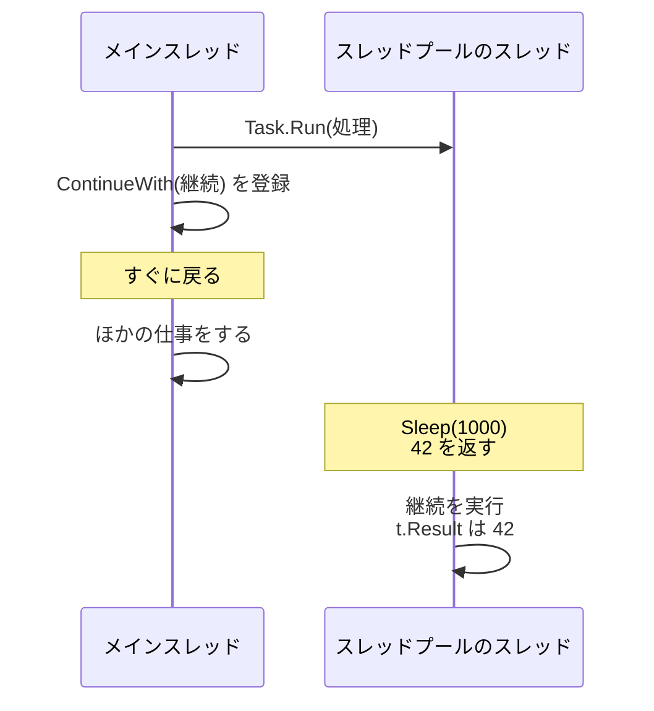
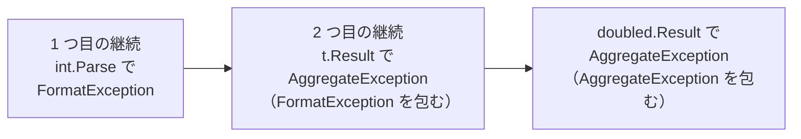

# 継続と ContinueWith

`Task` の `Wait` や `Result` は、処理が完了するまで呼び出したスレッドを止めてしまいます。止めずに済ませるには、「完了したら、この処理を続けて実行してほしい」と `Task` に頼んでおきます。この続きの処理を **継続**（continuation）といいます。このページでは、`ContinueWith` メソッドで継続を登録する方法と、継続でプログラムを組み立てるときの難しさを学びます。

## 学習目標

このページを読み終えると、以下のことができるようになります。

- `Wait` で待つことと、継続を登録することの違いを説明できる
- `ContinueWith` で継続を登録し、継続をつなげて処理を組み立てられる
- 継続でプログラムを組み立てると、例外の処理や繰り返しが書きにくくなる理由を説明できる

## 前提知識

- [Task と Task\<T\>](/unity-csharp-learning/csharp/tasks/) を読んでいること
- [デリゲートの変数渡しとコールバック](/unity-csharp-learning/csharp/delegate-callback/) を読んでいること

---

## 1. Wait は呼び出したスレッドを止める

[Task と Task\<T\>](/unity-csharp-learning/csharp/tasks/) では、`Task` の完了を `Wait` や `Result` で待ちました。どちらも、処理が完了するまで、呼び出したスレッドを止めます。止まっている間、そのスレッドはほかの仕事を何もできません。

[スレッドの数と性能](/unity-csharp-learning/csharp/thread-performance/) で学んだように、待っているスレッドはコアを使いませんが、スタックのメモリは使い続けます。スレッドプールのスレッドが `Wait` で止まれば、そのスレッドは待ち行列の次の処理も取り出せません。

必要なのは、「完了するまでスレッドを止めて待つ」ことではなく、「完了したら、結果を使う処理を実行する」ことです。これは、[デリゲートの変数渡しとコールバック](/unity-csharp-learning/csharp/delegate-callback/) で学んだ **コールバック** の考え方です。完了したときに呼んでほしいメソッドを先に渡しておけば、呼び出したスレッドは待たずに次の仕事へ進めます。

---

## 2. ContinueWith で継続を登録する

`Task` の完了後に実行する処理は、`ContinueWith` メソッドで登録します。

**書式：[Task.ContinueWith メソッド](https://learn.microsoft.com/dotnet/api/system.threading.tasks.task.continuewith)**
```csharp
public Task ContinueWith(Action<Task> continuationAction);
```

| パラメータ | 説明 |
|---|---|
| `continuationAction` | 元の `Task` が完了したときに実行するメソッド。完了した元の `Task` が引数として渡される |

`ContinueWith` は、継続を登録するとすぐに戻ります。戻り値は、継続そのものを表す新しい `Task` です。

`Task<TResult>` の `ContinueWith` では、継続に `Task<TResult>` が渡されるので、継続の中で `Result` を読んで結果を使えます。このとき元の `Task` はすでに完了しているので、`Result` を読んでもスレッドは止まりません。

```csharp
Console.WriteLine($"Main: スレッド {Environment.CurrentManagedThreadId}");

Task<int> task = Task.Run(() =>
{
    Thread.Sleep(1000);
    return 42;
});

Task continuation = task.ContinueWith(t =>
{
    Console.WriteLine($"継続: スレッド {Environment.CurrentManagedThreadId}");
    Console.WriteLine($"継続: 結果 = {t.Result}");
});

Console.WriteLine("Main: ほかの仕事をする");

continuation.Wait();
Console.WriteLine("Main: 終了");
```

実行結果の例です。スレッドの ID の値は、環境や実行するたびに変わります。

```
Main: スレッド 2
Main: ほかの仕事をする
継続: スレッド 6
継続: 結果 = 42
Main: 終了
```

`ContinueWith` はすぐに戻るので、メインスレッドは `task` の完了を待たずに `Main: ほかの仕事をする` を表示します。1 秒後に `task` が完了すると、登録しておいた継続が実行され、結果の `42` を表示します。継続はスレッドプールのスレッドで実行されるので、スレッドの ID はメインスレッドとは異なります。



最後の `continuation.Wait()` は、継続が終わる前にプログラムが終了しないようにするためのものです。スレッドプールのスレッドはバックグラウンドスレッドなので、メインスレッドが終わるとプログラムごと終了してしまいます。このように、プログラムの最後では完了を待つ必要がありますが、それまでの間、メインスレッドは止まらずにほかの仕事ができます。

---

## 3. 継続をつなげる

`Task<TResult>` の `ContinueWith` には、値を返す継続を渡すこともできます。このとき、`ContinueWith` は継続の結果を表す `Task<TNewResult>` を返します。

**書式：[Task\<TResult\>.ContinueWith メソッド](https://learn.microsoft.com/dotnet/api/system.threading.tasks.task-1.continuewith)（Func\<Task\<TResult\>, TNewResult\>）**
```csharp
public Task<TNewResult> ContinueWith<TNewResult>(Func<Task<TResult>, TNewResult> continuationFunction);
```

| パラメータ | 説明 |
|---|---|
| `continuationFunction` | 元の `Task` が完了したときに実行するメソッド。完了した元の `Task<TResult>` を受け取り、`TNewResult` 型の値を返す |

戻り値も `Task` なので、その `Task` にさらに継続を登録できます。こうして、前の処理の結果を次の処理に渡しながら、処理をつなげていけます。

```csharp
Task<string> read = Task.Run(() =>
{
    Console.WriteLine("1. 文字列を読み込む");
    return "21";
});

Task<int> parse = read.ContinueWith(t =>
{
    Console.WriteLine("2. 数値に変換する");
    return int.Parse(t.Result);
});

Task<int> doubled = parse.ContinueWith(t =>
{
    Console.WriteLine("3. 2 倍する");
    return t.Result * 2;
});

Console.WriteLine($"結果 = {doubled.Result}");
```

```
1. 文字列を読み込む
2. 数値に変換する
3. 2 倍する
結果 = 42
```

それぞれの継続は、前の `Task` が完了してから実行されるので、1 から 3 は必ずこの順に表示されます。最後の `doubled.Result` は、プログラムが終わる前に結果を待つためのものです。

`ContinueWith` の戻り値に続けて `ContinueWith` を書けば、途中の変数を省略できます。

```csharp
Task<int> doubled = Task.Run(() => "21")
    .ContinueWith(t => int.Parse(t.Result))
    .ContinueWith(t => t.Result * 2);
```

---

## 4. 継続での例外

継続は、元の `Task` が例外で終わったときにも実行されます。このとき継続の中で `t.Result` を読むと、[Task と Task\<T\>](/unity-csharp-learning/csharp/tasks/) で学んだように、元の例外を包んだ `AggregateException` が投げられます。その例外は継続の `Task` に記録されるので、次の継続で `Result` を読むと、それがまた `AggregateException` に包まれます。

次のコードは、前の節のコードに、数値に変換できない文字列 `"abc"` を渡したものです。

```csharp
Task<int> doubled = Task.Run(() => "abc")
    .ContinueWith(t => int.Parse(t.Result))
    .ContinueWith(t => t.Result * 2);

try
{
    Console.WriteLine(doubled.Result);
}
catch (AggregateException e)
{
    Exception? current = e;
    while (current != null)
    {
        Console.WriteLine(current.GetType().Name);
        current = current.InnerException;
    }
}
```

```
AggregateException
AggregateException
FormatException
```

`catch` では、`InnerException` をたどって、例外を外側から順に表示しています。`int.Parse` で発生した `FormatException` は、2 つ目の継続で `t.Result` を読んだときに `AggregateException` に包まれ、最後に `doubled.Result` を読んだときにもう一度包まれています。継続をつなげるほど、元の例外は深く包まれていきます。



---

## 5. 継続で組み立てることの難しさ

`ContinueWith` を使えば、スレッドを止めずに処理をつなげられます。しかし、`Wait` で待つ書き方と比べると、プログラムの形が大きく変わります。

次のコードは、時間のかかる読み込みを行う `Read` の完了を待ってから、結果を数値に変換して表示します。数値に変換できないときは、メッセージを表示します。

```csharp
try
{
    string text = Read();
    int number = int.Parse(text);
    Console.WriteLine($"結果 = {number * 2}");
}
catch (FormatException)
{
    Console.WriteLine("数値に変換できない");
}

string Read()
{
    Thread.Sleep(500);
    return "abc";
}
```

```
数値に変換できない
```

上から順に読めば処理の流れがわかり、例外は `try` / `catch` 1 つで受け止められます。ただし、`Read` の間、呼び出したスレッドは止まっています。

同じ処理を、スレッドを止めないように `ContinueWith` で書くと、次のようになります。次のコードは、前のコード例とは別のプログラムです。

```csharp
Task.Run(Read)
    .ContinueWith(t =>
    {
        try
        {
            int number = int.Parse(t.Result);
            Console.WriteLine($"結果 = {number * 2}");
        }
        catch (FormatException)
        {
            Console.WriteLine("数値に変換できない");
        }
    })
    .Wait();

string Read()
{
    Thread.Sleep(500);
    return "abc";
}
```

```
数値に変換できない
```

結果は同じですが、次のような違いがあります。

- `Read` の後に実行する処理は、すべてラムダ式の中に移さなければならない。つなげる処理が増えるほど、継続の中に継続を書くことになり、処理の流れが追いにくくなる
- `try` / `catch` は、継続ごとに書かなければならない。処理全体を 1 つの `try` で囲むことはできない。`Task.Run` の呼び出しを `try` で囲んでも、`Task.Run` はすぐに戻るので、後で継続の中で発生する例外は届かない
- 前の `Task` で発生した例外は、`t.Result` から `AggregateException` として届く。たとえば `Read` の中で `FormatException` が発生しても、この `catch (FormatException)` では受け止められない

繰り返しも書きにくくなります。たとえば「読み込んで表示する」を 3 回順に行う処理は、`Wait` で待つなら `for` 文で書けます。しかし継続では、前の回の継続の中で次の回を始めなければならないので、`for` 文をそのまま使えません。

`if`・`for`・`try` / `catch` といった、これまで学んできた制御の書き方が、継続ではそのまま使えなくなるのです。

C# 5 で追加された `async` と `await` を使うと、スレッドを止めずに済む継続の仕組みはそのままに、最初のコードのような上から順に読める形で書けるようになります。

---

## ワンポイントアドバイス

### Task より前の非同期処理

`Task` が登場する前から、.NET には、時間のかかる処理を別に進めて、完了したらコールバックで知らせる仕組みがありました。ファイルやネットワークの読み書きを行うクラスの `BeginRead` / `EndRead` のようなメソッドの組や、完了をイベントで知らせる `XxxAsync` メソッドと `XxxCompleted` イベントの組です。

どちらも、完了後の処理をコールバックに書くという点で、`ContinueWith` と同じ難しさを抱えていました。これらの書き方が `Task` と `async` / `await` へどう移り変わったかは、[非同期処理のパターンの変遷（補足）](/unity-csharp-learning/csharp/async-patterns-history/) で紹介します。

---

## まとめ

- `Wait` や `Result` は、完了するまで呼び出したスレッドを止める
- 完了後に実行する処理を **継続** という。`ContinueWith` で登録すると、呼び出したスレッドは止まらずに次の処理へ進める
- 継続には、完了した元の `Task` が渡される。継続の中では、`Result` を読んでもスレッドは止まらない
- 値を返す継続を登録すると `Task<TNewResult>` が返り、さらに継続をつなげられる
- 継続は元の `Task` が例外で終わっても実行され、`t.Result` から `AggregateException` が投げられる。継続をつなげるほど、元の例外は深く包まれる
- 継続で処理を組み立てると、`if`・`for`・`try` / `catch` といった制御の書き方がそのまま使えなくなる

---

## 理解度チェック

1. `Wait` で完了を待つことと、`ContinueWith` で継続を登録することの違いを、呼び出したスレッドに注目して説明してください。
2. 次のコードを実行すると何が出力されますか？

   ```csharp
   Task<int> task = Task.Run(() => 5)
       .ContinueWith(t => t.Result + 1)
       .ContinueWith(t => t.Result * 10);

   Console.WriteLine(task.Result);
   ```

3. 次のコードの `catch` で、`Task.Run` に渡した処理の例外を受け止められないのはなぜですか？

   ```csharp
   try
   {
       Task.Run(() => int.Parse("abc"))
           .ContinueWith(t => Console.WriteLine(t.Result));
   }
   catch (Exception)
   {
       Console.WriteLine("catch");
   }
   ```

<details markdown="1">
<summary>解答を見る</summary>

1. `Wait` は、処理が完了するまで呼び出したスレッドを止めます。`ContinueWith` は、完了後に実行する処理を登録するとすぐに戻るので、呼び出したスレッドは止まらずにほかの処理を続けられます。
2. `60` が出力されます。`5` に 1 を足した `6` が次の継続に渡され、`6 * 10` が最後の `Task` の結果になります。
3. `Task.Run` も `ContinueWith` もすぐに戻るので、`try` ブロックは例外が発生する前に終わっているからです。例外はスレッドプールのスレッドで発生して `Task` に記録され、継続の中で `t.Result` を読んだときに、スレッドプールのスレッドで `AggregateException` として投げられます。その例外は継続の `Task` に記録されるだけで、誰も `Wait` や `Result` を呼ばないので、何も表示されません。

</details>

---

## 次のステップ

[非同期処理のパターンの変遷（補足）](/unity-csharp-learning/csharp/async-patterns-history/) では、`Task` より前の非同期処理の書き方と、`Task` にたどり着くまでの流れを紹介します。
