# 複数の Task を待つ

複数の非同期処理を 1 つずつ順に `await` すると、前の処理が終わるまで次の処理が始まりません。互いに関係のない処理なら、先にすべて開始してからまとめて待つほうが、早く終わります。このページでは、すべての完了を待つ `Task.WhenAll` と、最初の完了を待つ `Task.WhenAny` を学びます。

## 学習目標

このページを読み終えると、以下のことができるようになります。

- 処理を開始することと、完了を `await` することを分けて考えられる
- `Task.WhenAll` で複数の `Task` の完了をまとめて待ち、結果を配列で受け取れる
- `Task.WhenAll` で複数の例外が発生したとき、それぞれの例外を取り出せる
- `Task.WhenAny` で、最初に完了した `Task` を受け取れる

## 前提知識

- [await の前後で実行されるスレッド](/unity-csharp-learning/csharp/await-threads/) を読んでいること
- [Task と Task\<T\>](/unity-csharp-learning/csharp/tasks/) を読んでいること

---

## 1. 開始と await を分ける

次のコードは、0.5 秒かかる async メソッド `GetValueAsync` を 3 回呼び出し、結果を合計します。

```csharp
using System.Diagnostics;

Stopwatch sw = Stopwatch.StartNew();

int a = await GetValueAsync(1);
int b = await GetValueAsync(2);
int c = await GetValueAsync(3);

Console.WriteLine($"合計 = {a + b + c}");
Console.WriteLine($"{sw.ElapsedMilliseconds} ミリ秒");

async Task<int> GetValueAsync(int value)
{
    await Task.Delay(500);
    return value * 10;
}
```

実行結果の例です。時間は環境や実行するたびに変わりますが、1500 ミリ秒を少し超える程度になります。

```
合計 = 60
1534 ミリ秒
```

呼び出すたびに `await` しているので、1 回目が完了してから 2 回目が始まり、2 回目が完了してから 3 回目が始まります。全体で 0.5 秒の 3 倍かかっています。

3 つの処理は互いの結果を使っていないので、先に 3 つとも開始し、そのあとで完了を待つことができます。async メソッドを呼び出すと、最初の `await` で `Task` が返り、処理はその時点で始まっています。`await` は、始まっている処理の完了を待つだけです。次のコードは、前のコード例とは別のプログラムです。

```csharp
using System.Diagnostics;

Stopwatch sw = Stopwatch.StartNew();

Task<int> taskA = GetValueAsync(1);
Task<int> taskB = GetValueAsync(2);
Task<int> taskC = GetValueAsync(3);

int a = await taskA;
int b = await taskB;
int c = await taskC;

Console.WriteLine($"合計 = {a + b + c}");
Console.WriteLine($"{sw.ElapsedMilliseconds} ミリ秒");

async Task<int> GetValueAsync(int value)
{
    await Task.Delay(500);
    return value * 10;
}
```

実行結果の例です。時間は環境や実行するたびに変わりますが、500 ミリ秒を少し超える程度になります。

```
合計 = 60
518 ミリ秒
```

3 つの `Task.Delay(500)` が同時に進むので、全体でおよそ 0.5 秒で終わります。`await taskA` で待っている間に、`taskB` と `taskC` も進んでいて、`taskA` の完了後に `await taskB` を実行するころには、`taskB` もほぼ完了しています。

```mermaid
gantt
    dateFormat x
    axisFormat %S.%L 秒
    section 呼び出すたびに await
    1 回目 : a1, 0, 500ms
    2 回目 : a2, after a1, 500ms
    3 回目 : a3, after a2, 500ms
    section 先に開始してから await
    1 回目 : 0, 500ms
    2 回目 : 0, 500ms
    3 回目 : 0, 500ms
```



---

## 2. Task.WhenAll ですべての完了を待つ

先に開始した `Task` を 1 つずつ `await` する代わりに、`Task.WhenAll` メソッドでまとめて待てます。

**書式：[Task.WhenAll メソッド](https://learn.microsoft.com/dotnet/api/system.threading.tasks.task.whenall)**
```csharp
public static Task WhenAll(params Task[] tasks);
public static Task<TResult[]> WhenAll<TResult>(params Task<TResult>[] tasks);
```

| パラメータ | 説明 |
|---|---|
| `tasks` | 完了を待つ `Task` の配列。[params キーワード](/unity-csharp-learning/csharp/params-keyword/) なので、`Task` を並べて渡すこともできる |

`Task.WhenAll` は、渡したすべての `Task` が完了したときに完了する、新しい `Task` を返します。`Task<TResult>` を渡したときは `Task<TResult[]>` を返し、`await` すると、それぞれの結果が入った配列が得られます。配列の並びは、完了した順ではなく、渡した `Task` の順です。

```csharp
Task<int>[] tasks = new Task<int>[3];
for (int i = 0; i < tasks.Length; i++)
{
    tasks[i] = GetValueAsync(i + 1);
}

int[] results = await Task.WhenAll(tasks);
Console.WriteLine(string.Join(", ", results));

async Task<int> GetValueAsync(int value)
{
    await Task.Delay(500 - value * 100);
    Console.WriteLine($"{value} が完了");
    return value * 10;
}
```

```
3 が完了
2 が完了
1 が完了
10, 20, 30
```

`GetValueAsync(3)` は 0.2 秒、`GetValueAsync(1)` は 0.4 秒待つので、完了は 3・2・1 の順です。それでも、`results` には渡した `Task` の順に `10, 20, 30` が入っています。

`Task.WhenAll` 自体は、呼び出したスレッドを止めません。完了を待つのは、返された `Task` を `await` したときです。

---

## 3. Task.WhenAll と例外

`Task.WhenAll` に渡した `Task` の中に例外で終わったものがあると、`Task.WhenAll` が返した `Task` も例外で終わります。このとき、ほかの `Task` の完了も待ってから終わるので、途中で失敗した `Task` があっても、渡したすべての `Task` が完了しています。

`await` は、[async と await](/unity-csharp-learning/csharp/async-await/) で学んだように、`AggregateException` ではなく元の例外を投げます。ただし、投げられるのは記録された例外のうち最初の 1 つだけです。すべての例外を調べるには、`Task.WhenAll` が返した `Task` の [Exception プロパティ](https://learn.microsoft.com/dotnet/api/system.threading.tasks.task.exception) を使います。`Exception` プロパティは、記録されたすべての例外を持つ `AggregateException` を返します。

```csharp
Task task1 = FailAsync("1 つ目", 100);
Task task2 = FailAsync("2 つ目", 200);
Task all = Task.WhenAll(task1, task2);

try
{
    await all;
}
catch (InvalidOperationException e)
{
    Console.WriteLine($"catch: {e.Message}");
}

AggregateException? errors = all.Exception;
if (errors != null)
{
    Console.WriteLine($"all.Exception の例外の数: {errors.InnerExceptions.Count}");
    foreach (Exception inner in errors.InnerExceptions)
    {
        Console.WriteLine($"  {inner.Message}");
    }
}

async Task FailAsync(string name, int delay)
{
    await Task.Delay(delay);
    throw new InvalidOperationException($"{name}の処理で失敗");
}
```

```
catch: 1 つ目の処理で失敗
all.Exception の例外の数: 2
  1 つ目の処理で失敗
  2 つ目の処理で失敗
```

`await all` が投げたのは 1 つ目の例外だけですが、`all.Exception` の `InnerExceptions` には 2 つの例外が入っています。[Task と Task\<T\>](/unity-csharp-learning/csharp/tasks/) で、1 つの `Task` が複数の例外を持つことがあるので `AggregateException` が使われる、と説明しました。`Task.WhenAll` が、その代表的な例です。`Exception` プロパティは、`Task` が例外で終わっていなければ `null` を返すので、`null` でないことを確かめてから使います。

---

## 4. Task.WhenAny で最初の完了を待つ

複数の `Task` のうち、どれか 1 つが完了したところで先に進みたいときは、`Task.WhenAny` メソッドを使います。

**書式：[Task.WhenAny メソッド](https://learn.microsoft.com/dotnet/api/system.threading.tasks.task.whenany)**
```csharp
public static Task<Task> WhenAny(params Task[] tasks);
public static Task<Task<TResult>> WhenAny<TResult>(params Task<TResult>[] tasks);
```

`Task.WhenAny` は、渡した `Task` のどれか 1 つが完了したときに完了する `Task` を返します。その結果は、最初に完了した `Task` そのものです。そのため、`await Task.WhenAny(...)` で得られるのは結果の値ではなく `Task` で、値を取り出すにはもう一度 `await` します。

```csharp
Task<string> fast = GetAsync("速い処理", 100);
Task<string> slow = GetAsync("遅い処理", 500);

Task<string> first = await Task.WhenAny(fast, slow);
Console.WriteLine($"最初に完了: {await first}");
Console.WriteLine($"slow.IsCompleted = {slow.IsCompleted}");

async Task<string> GetAsync(string name, int delay)
{
    await Task.Delay(delay);
    return name;
}
```

```
最初に完了: 速い処理
slow.IsCompleted = False
```

`first` は完了済みの `fast` なので、`await first` は中断せずに結果を返します。`Task.WhenAny` が完了した時点で、`slow` はまだ完了していません。

### タイムアウトを作る

`Task.WhenAny` と `Task.Delay` を組み合わせると、「一定の時間内に終わらなければあきらめる」という **タイムアウト** を作れます。`Task.WhenAny` が返した `Task` と、元の `Task` を `==` で比べて、どちらが先に完了したかを調べます。

```csharp
Task<string> work = GetAsync("処理の結果", 2000);
Task timeout = Task.Delay(500);

Task completed = await Task.WhenAny(work, timeout);
if (completed == work)
{
    Console.WriteLine(await work);
}
else
{
    Console.WriteLine("タイムアウト");
}

async Task<string> GetAsync(string result, int delay)
{
    await Task.Delay(delay);
    return result;
}
```

```
タイムアウト
```

`work` は 2 秒かかり、`timeout` は 0.5 秒で完了するので、`completed` は `timeout` になります。

ただし、タイムアウトしても `work` の処理が止まるわけではありません。`Task.WhenAny` は完了を待つのをやめただけで、`work` は裏で最後まで続きます。処理そのものを途中でやめさせる方法は、次のページで学びます。

---

## ワンポイントアドバイス

### Task.WaitAll と Task.WaitAny

`Task.WhenAll` と `Task.WhenAny` には、スレッドを止めて待つ版として [Task.WaitAll メソッド](https://learn.microsoft.com/dotnet/api/system.threading.tasks.task.waitall) と [Task.WaitAny メソッド](https://learn.microsoft.com/dotnet/api/system.threading.tasks.task.waitany) があります。`Wait` と同じように、完了するまで呼び出したスレッドを止め、例外は `AggregateException` で投げます。`WhenAll` / `WhenAny` が `await` のための `Task` を返すのに対し、`WaitAll` / `WaitAny` は戻るまで待ちます。async メソッドの中では、`WhenAll` / `WhenAny` を `await` します。

---

## まとめ

- async メソッドを呼び出した時点で、処理は始まっている。`await` は、始まっている処理の完了を待つだけ
- 互いに関係のない処理は、先にすべて開始してから待つと、全体の時間が短くなる
- `Task.WhenAll` は、すべての `Task` が完了すると完了する `Task` を返す。`Task<TResult>` を渡すと、結果は渡した順の配列になる
- `Task.WhenAll` を `await` すると最初の例外だけが投げられる。すべての例外は、返された `Task` の `Exception.InnerExceptions` にある
- `Task.WhenAny` は、最初に完了した `Task` を結果とする `Task` を返す。`Task.Delay` と組み合わせるとタイムアウトを作れる
- タイムアウトしても、元の処理は止まらない

---

## 理解度チェック

1. 0.5 秒かかる async メソッドを 3 つ、呼び出すたびに `await` した場合と、先に 3 つとも呼び出してから `Task.WhenAll` で待った場合、全体の時間はおよそ何秒になりますか？
2. 次のコードを実行すると何が出力されますか？

   ```csharp
   int[] results = await Task.WhenAll(DoubleAsync(1), DoubleAsync(2), DoubleAsync(3));
   Console.WriteLine(results.Length);
   Console.WriteLine(results[2]);

   async Task<int> DoubleAsync(int value)
   {
       await Task.Delay(100 * (4 - value));
       return value * 2;
   }
   ```

3. `await Task.WhenAny(work, Task.Delay(500))` でタイムアウトしたとき、`work` の処理はどうなりますか？

<details markdown="1">
<summary>解答を見る</summary>

1. 呼び出すたびに `await` した場合はおよそ 1.5 秒、`Task.WhenAll` で待った場合はおよそ 0.5 秒です。`Task.WhenAll` の場合は、3 つの処理が同時に進むからです。
2. 次のように出力されます。`DoubleAsync(3)` がいちばん早く完了しますが、結果の配列は渡した順に並ぶので、`results[2]` は `DoubleAsync(3)` の結果の `6` です。

   ```
   3
   6
   ```

3. 止まらずに、最後まで続きます。`Task.WhenAny` は、どちらかが完了したところで待つのをやめるだけで、`work` の処理をやめさせる働きはありません。

</details>

---

## 次のステップ

[キャンセル](/unity-csharp-learning/csharp/task-cancellation/) では、`CancellationToken` を使って、実行中の非同期処理を途中でやめさせる方法を学びます。
