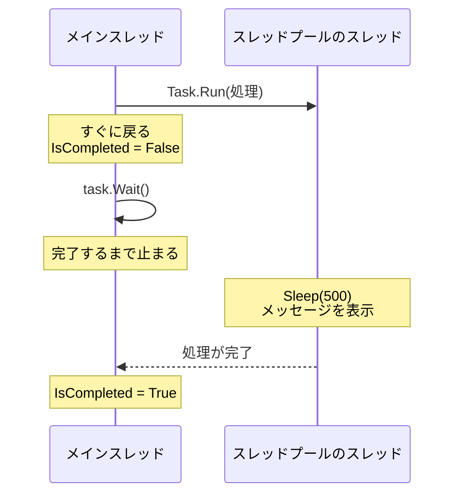
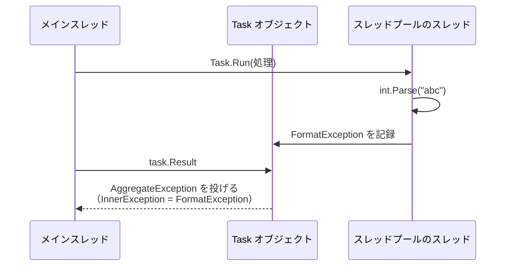

# Task と Task\<T\>

**Task**（タスク）は、スレッドプールで実行する処理を、1 つのオブジェクトとして表したものです。[スレッドプール](/unity-csharp-learning/csharp/thread-pool/) では自分で用意しなければならなかった「完了を待つ」「結果を受け取る」「例外を受け止める」を、`Task` オブジェクトを通して行えます。

## 学習目標

このページを読み終えると、以下のことができるようになります。

- `Task.Run` で処理をスレッドプールに渡し、`Wait` で完了を待てる
- `Task<T>` の `Result` で、処理の結果を受け取れる
- `Task` の中で発生した例外が、`Wait` や `Result` で `AggregateException` として伝わることを説明できる

## 前提知識

- [スレッドプール](/unity-csharp-learning/csharp/thread-pool/) を読んでいること
- [ジェネリクスの基本](/unity-csharp-learning/csharp/generics/) を読んでいること
- [ラムダ式](/unity-csharp-learning/csharp/lambda/) を読んでいること

---

## 1. Task とは

[スレッドプール](/unity-csharp-learning/csharp/thread-pool/) では、`ThreadPool.QueueUserWorkItem` に処理を渡したあと、その処理がどうなったかを知る手段がありませんでした。完了を待つには `CountdownEvent`、結果を受け取るには共有変数を別に用意し、例外は呼び出し元に伝わりませんでした。

.NET 4.0 で追加された [Task クラス](https://learn.microsoft.com/dotnet/api/system.threading.tasks.task) は、スレッドプールに渡した処理 1 つ 1 つを、オブジェクトとして表します。処理を渡すと `Task` オブジェクトが返ってくるので、そのオブジェクトに対して「終わったか」「結果は何か」「例外は発生したか」を問い合わせられます。

`Task` が表しているのは「いずれ完了する処理」であって、スレッドそのものではありません。このページの `Task` はどれもスレッドプールのスレッドで実行されますが、スレッドを使わない `Task` もあることを、後のページで学びます。

---

## 2. Task.Run で処理を実行する

処理をスレッドプールで実行するには、`Task.Run` メソッドを使います。

**書式：[Task.Run メソッド](https://learn.microsoft.com/dotnet/api/system.threading.tasks.task.run)**
```csharp
public static Task Run(Action action);
```

| パラメータ | 説明 |
|---|---|
| `action` | スレッドプールで実行するメソッド。[Action](https://learn.microsoft.com/dotnet/api/system.action) は、パラメータも戻り値もないメソッドを表すデリゲート型 |

`Task.Run` は、`QueueUserWorkItem` と同じように、処理を待ち行列に入れるとすぐに戻ります。違うのは、渡した処理を表す `Task` オブジェクトを返すことです。

渡した処理の完了を待つには、返ってきた `Task` の `Wait` メソッドを呼びます。`Wait` は、`Thread` の `Join` と同じように、処理が完了するまで呼び出したスレッドを止めます。

**書式：[Task.Wait メソッド](https://learn.microsoft.com/dotnet/api/system.threading.tasks.task.wait)**
```csharp
public void Wait();
```

処理が完了したかどうかは、[IsCompleted プロパティ](https://learn.microsoft.com/dotnet/api/system.threading.tasks.task.iscompleted) で調べられます。

```csharp
Task task = Task.Run(() =>
{
    Thread.Sleep(500);
    Thread current = Thread.CurrentThread;
    Console.WriteLine($"Task: スレッドプールのスレッドか: {current.IsThreadPoolThread}");
});

Console.WriteLine($"Main: IsCompleted = {task.IsCompleted}");
task.Wait();
Console.WriteLine($"Main: IsCompleted = {task.IsCompleted}");
```

```
Main: IsCompleted = False
Task: スレッドプールのスレッドか: True
Main: IsCompleted = True
```

`Task.Run` はすぐに戻るので、最初の `IsCompleted` は `False` です。`task.Wait()` で処理の完了を待ったあとは `True` になります。`IsThreadPoolThread` が `True` なので、渡した処理はスレッドプールのスレッドで実行されたことがわかります。



[スレッドプール](/unity-csharp-learning/csharp/thread-pool/) では、完了を待つために `CountdownEvent` を用意し、渡す処理の中で `Signal` を呼ぶ必要がありました。`Task` では、渡す処理の中に何も書き足さなくても、`Wait` で完了を待てます。

---

## 3. Task\<T\> で結果を受け取る

`Task.Run` に、値を返すラムダ式を渡すこともできます。このとき `Task.Run` は、`Task` ではなく `Task<T>` を返します。

**書式：[Task.Run メソッド](https://learn.microsoft.com/dotnet/api/system.threading.tasks.task.run)（Func\<TResult\>）**
```csharp
public static Task<TResult> Run<TResult>(Func<TResult> function);
```

| パラメータ | 説明 |
|---|---|
| `function` | スレッドプールで実行するメソッド。[Func\<TResult\>](https://learn.microsoft.com/dotnet/api/system.func-1) は、パラメータがなく、`TResult` 型の値を返すメソッドを表すデリゲート型 |

[Task\<TResult\> クラス](https://learn.microsoft.com/dotnet/api/system.threading.tasks.task-1) は、`TResult` 型の結果を返す処理を表します。`Task<TResult>` は `Task` の派生クラスなので、`Wait` や `IsCompleted` も使えます。`TResult` は、[ジェネリックメソッド](/unity-csharp-learning/csharp/generic-methods/) で学んだ型推論によって、ラムダ式が返す値の型から決まります。

処理の結果は、[Result プロパティ](https://learn.microsoft.com/dotnet/api/system.threading.tasks.task-1.result) で受け取ります。

**書式：[Task\<TResult\>.Result プロパティ](https://learn.microsoft.com/dotnet/api/system.threading.tasks.task-1.result)**
```csharp
public TResult Result { get; }
```

次のコードは、[スレッドプール](/unity-csharp-learning/csharp/thread-pool/) で共有変数と `CountdownEvent` を使って書いた、1 から 100 までの合計を求める処理を、`Task<int>` で書き直したものです。

```csharp
Task<int> task = Task.Run(() =>
{
    int sum = 0;
    for (int i = 1; i <= 100; i++)
    {
        sum += i;
    }
    return sum;
});

Console.WriteLine($"result = {task.Result}");
```

```
result = 5050
```

ラムダ式は `int` 型の `sum` を返すので、`Task.Run` は `Task<int>` を返します。

`Result` は、処理がまだ完了していなければ、`Wait` と同じように完了するまで呼び出したスレッドを止めてから、結果を返します。そのため、`Wait` を呼ばずに `Result` を読んでも、計算の途中の値を読んでしまうことはありません。結果を入れる変数と完了を知らせる仕組みを別々に用意して、その使い方を自分で守る必要はもうありません。

### 複数の Task の結果を受け取る

`Task` はオブジェクトなので、配列に入れて扱えます。次のコードは、前のコード例とは別のプログラムです。3 つの処理をスレッドプールで実行し、結果を合計します。

```csharp
Task<int>[] tasks = new Task<int>[3];
for (int i = 0; i < tasks.Length; i++)
{
    int n = i;
    tasks[i] = Task.Run(() =>
    {
        Console.WriteLine($"処理 {n}");
        return n * 10;
    });
}

int total = 0;
foreach (Task<int> t in tasks)
{
    total += t.Result;
}
Console.WriteLine($"total = {total}");
```

実行結果の例です。`処理 0` から `処理 2` の順序は、環境や実行するたびに変わります。

```
処理 1
処理 0
処理 2
total = 30
```

`foreach` の中の `t.Result` が、それぞれの処理の完了を待ってから結果を返します。3 つの結果をすべて足してから表示するので、`total = 30` は必ず最後に表示されます。`int n = i;` でループ変数をコピーしているのは、[スレッドの基本](/unity-csharp-learning/csharp/threads/) の「よくあるミス」で学んだ、ループ変数のキャプチャを避けるためです。

複数の `Task` をまとめて待つ方法は、後のページで学びます。

---

## 4. 例外を受け止める

`Task` の中で例外が発生すると、その例外は `Task` オブジェクトに記録されます。スレッドプールのように、プログラムがその場で異常終了することはありません。

記録された例外は、`Wait` を呼んだとき、または `Result` を読んだときに、呼び出したスレッドで投げ直されます。このとき投げられるのは、元の例外ではなく、元の例外を包んだ [AggregateException](https://learn.microsoft.com/dotnet/api/system.aggregateexception) です。元の例外は、[例外を投げる](/unity-csharp-learning/csharp/throwing-exceptions/) で学んだ `InnerException` プロパティで取り出せます。

```csharp
Task<int> task = Task.Run(() => int.Parse("abc"));

try
{
    Console.WriteLine(task.Result);
}
catch (AggregateException e)
{
    Console.WriteLine(e.GetType().Name);
    Console.WriteLine(e.InnerException?.GetType().Name);
    Console.WriteLine(e.InnerException?.Message);
}
Console.WriteLine($"IsFaulted = {task.IsFaulted}");
Console.WriteLine("Main: 終了");
```

```
AggregateException
FormatException
The input string 'abc' was not in a correct format.
IsFaulted = True
Main: 終了
```

スレッドプールのスレッドで発生した `FormatException` が、`AggregateException` に包まれて、メインスレッドの `catch` で受け止められています。[IsFaulted プロパティ](https://learn.microsoft.com/dotnet/api/system.threading.tasks.task.isfaulted) は、処理が例外で終わったときに `true` になります。



例外がメインスレッドの `catch` に届かない理由は、[スレッドプール](/unity-csharp-learning/csharp/thread-pool/) で学んだとおり、例外は発生したスレッドの中でしかさかのぼらないからでした。`Task` は、この仕組みを変えたわけではありません。スレッドプールのスレッドで発生した例外を `Task` オブジェクトがいったん受け止めて保存し、`Wait` や `Result` を呼んだスレッドで改めて投げているのです。

> 💡 **ポイント**: 元の例外が `AggregateException`（aggregate は「集めたもの」という意味）に包まれるのは、1 つの `Task` が複数の例外を持つことがあるからです。複数の例外は [InnerExceptions プロパティ](https://learn.microsoft.com/dotnet/api/system.aggregateexception.innerexceptions) にすべて入っています。`InnerException` はその最初の 1 つです。

---

## 5. Thread・スレッドプール・Task の比較

[スレッドプール](/unity-csharp-learning/csharp/thread-pool/) の比較表に、`Task` を加えると次のようになります。

| | `Thread` | スレッドプール | `Task` |
|---|---|---|---|
| スレッドを用意するコスト | 高い（毎回作る） | 低い（使い回す） | 低い（スレッドプールを使う） |
| 完了を待つ | `Join` | 自分で用意する（`CountdownEvent` など） | `Wait` |
| 結果を受け取る | 共有変数 | 共有変数 | `Task<T>` の `Result` |
| 例外を呼び出し元で受け止める | できない | できない | `Wait` や `Result` で `AggregateException` として受け止める |

`Task` によって、スレッドプールの効率のよさを保ったまま、完了・結果・例外を扱えるようになりました。

ただし、`Wait` と `Result` には、`Join` と同じ性質が残っています。完了するまで、呼び出したスレッドを止めてしまうことです。[スレッドの数と性能](/unity-csharp-learning/csharp/thread-performance/) で学んだように、待つためだけにスレッドを止めておくのは無駄が大きいのでした。この問題をどう解決するかを、次のページから学んでいきます。

---

## よくあるミス

### Wait も Result も呼ばないと、例外に気づけない

`Task` の中で発生した例外は、`Wait` か `Result` を呼んだときに初めて投げ直されます。どちらも呼ばなければ、例外は `Task` オブジェクトに記録されたままになり、誰にも知らされません。

```csharp
// ❌ NG: 例外が発生しても、何も表示されずに終わる
Task.Run(() => int.Parse("abc"));

Thread.Sleep(1000);
Console.WriteLine("Main: 終了");
```

```
Main: 終了
```

[スレッドプール](/unity-csharp-learning/csharp/thread-pool/) では、同じ処理でプログラムが異常終了しました。`Task` ではプログラムは止まりませんが、そのぶん、失敗したことに気づけません。

このコードをトップレベルステートメントに書くと、ビルド時に警告 CS4014 が表示されます。この警告の意味は、後の [async と await](/unity-csharp-learning/csharp/async-await/) で説明します。警告が出ない書き方もあるので、`Task.Run` が返した `Task` は、必ず `Wait` や `Result` などで完了を確かめるようにします。

---

## ワンポイントアドバイス

### Task.Factory.StartNew と Task.Run

`Task` が追加された .NET 4.0 では、処理を実行するのに [TaskFactory.StartNew メソッド](https://learn.microsoft.com/dotnet/api/system.threading.tasks.taskfactory.startnew) を `Task.Factory.StartNew(...)` の形で使っていました。`StartNew` は細かな設定ができる反面、パラメータが多く、使い方を誤りやすいメソッドです。

.NET 4.5 で、よく使う設定だけで処理をスレッドプールに渡せる `Task.Run` が追加されました。古いコードや資料では `Task.Factory.StartNew` を見かけることがありますが、新しく書くときは `Task.Run` を使います。

---

## まとめ

- `Task` は、スレッドプールで実行する処理を表すオブジェクト。スレッドそのものではない
- `Task.Run` は、処理をスレッドプールの待ち行列に入れ、その処理を表す `Task` をすぐに返す
- `Wait` は、処理が完了するまで呼び出したスレッドを止める
- 値を返す処理を渡すと `Task<T>` が返る。`Result` は完了を待ってから結果を返す
- `Task` の中で発生した例外は `Task` に記録され、`Wait` や `Result` を呼んだスレッドで `AggregateException` に包まれて投げられる
- `Wait` と `Result` は、完了するまで呼び出したスレッドを止める

---

## 理解度チェック

1. `Task.Run` に `() => 42` を渡したとき、戻り値の型は何ですか？
2. 次のコードを実行すると何が出力されますか？

   ```csharp
   Task<int> a = Task.Run(() => 2);
   Task<int> b = Task.Run(() => a.Result * 10);

   Console.WriteLine(a.Result + b.Result);
   ```

3. 次のコードを実行すると、`catch` ブロックは実行されますか？理由も説明してください。

   ```csharp
   Task task = Task.Run(() => throw new InvalidOperationException());

   try
   {
       task.Wait();
   }
   catch (InvalidOperationException)
   {
       Console.WriteLine("catch");
   }
   ```

<details markdown="1">
<summary>解答を見る</summary>

1. `Task<int>` です。ラムダ式が `int` 型の値を返すので、`Func<TResult>` を受け取る `Task.Run` が選ばれ、`TResult` は `int` になります。
2. `22` が出力されます。`b` の処理は `a.Result` で `a` の完了を待って `2 * 10` を計算し、`a.Result + b.Result` は `2 + 20` になります。
3. 実行されません。`Wait` が投げるのは `InvalidOperationException` ではなく、それを包んだ `AggregateException` なので、`catch (InvalidOperationException)` では受け止められません。受け止められなかった `AggregateException` によって、プログラムは異常終了します。

</details>

---

## 次のステップ

[継続と ContinueWith](/unity-csharp-learning/csharp/task-continuation/) では、`Wait` でスレッドを止めずに、`Task` の完了後に続きの処理を実行する方法を学びます。
