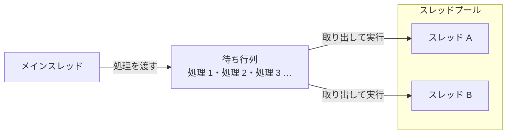

# スレッドプール

**スレッドプール**（thread pool）は、あらかじめ用意したスレッドを使い回して、処理を実行する仕組みです。スレッドを作るコストを抑えられますが、完了を待つ・結果を受け取る・例外を受け止めるといったことは、自分で工夫しなければなりません。

## 学習目標

このページを読み終えると、以下のことができるようになります。

- スレッドプールがスレッドを使い回す理由を説明できる
- `ThreadPool.QueueUserWorkItem` で、スレッドプールに処理を実行させられる
- スレッドプールに渡した処理の完了・結果・例外を、呼び出し元で扱いにくい理由を説明できる

## 前提知識

- [スレッドの基本](/unity-csharp-learning/csharp/threads/) を読んでいること
- [共有データと lock](/unity-csharp-learning/csharp/thread-safety/) を読んでいること
- [スレッドの数と性能](/unity-csharp-learning/csharp/thread-performance/) を読んでいること
- [例外を投げる](/unity-csharp-learning/csharp/throwing-exceptions/) を読んでいること

---

## 1. スレッドを作るコスト

スレッドを 1 つ作るたびに、そのスレッド専用のスタック（[再帰関数とコールスタック](/unity-csharp-learning/csharp/recursion/) で学んだ、メソッドの呼び出しを積み重ねる領域）のメモリが確保されます。スレッドを作る処理と、終わったスレッドを片付ける処理にも時間がかかります。

すぐに終わる短い処理のたびにスレッドを作って捨てると、処理そのものより、スレッドを作って片付ける時間のほうが長くなることがあります。また、[スレッドの数と性能](/unity-csharp-learning/csharp/thread-performance/) で学んだように、計算するスレッドは論理プロセッサーの数を超えて増やしても速くなりません。処理の数だけスレッドを作っても、切り替えが増えてメモリを使うだけです。

そこで .NET には、少ない数のスレッドをあらかじめ用意しておき、使い回す **スレッドプール** が用意されています。実行したい処理をスレッドプールに渡すと、待ち行列に入れられます。手の空いたスレッドが待ち行列から処理を取り出して実行し、終わると次の処理を取り出します。



スレッドプールのスレッドは、処理が終わっても片付けられず、次の処理に使い回されます。スレッドの数は、論理プロセッサーの数などをもとに、.NET が状況に応じて調整します。処理がたくさん渡されても、スレッドの数は処理の数までは増えず、処理は待ち行列で順番を待ちます。

---

## 2. ThreadPool.QueueUserWorkItem で処理を渡す

スレッドプールに処理を渡すには、[ThreadPool クラス](https://learn.microsoft.com/dotnet/api/system.threading.threadpool) の `QueueUserWorkItem` メソッドを使います。

**書式：[ThreadPool.QueueUserWorkItem メソッド](https://learn.microsoft.com/dotnet/api/system.threading.threadpool.queueuserworkitem)**
```csharp
public static bool QueueUserWorkItem(WaitCallback callBack);
```

| パラメータ | 説明 |
|---|---|
| `callBack` | スレッドプールで実行するメソッド。[WaitCallback](https://learn.microsoft.com/dotnet/api/system.threading.waitcallback) は、`object?` 型のパラメータを 1 つ受け取り、戻り値のないメソッドを表すデリゲート型 |

`QueueUserWorkItem` は、処理を待ち行列に入れるとすぐに戻ります。`WaitCallback` のパラメータはこのページでは使わないので、ラムダ式では `_` と書きます。

次のコードでは、スレッドプールで実行された処理が、どのようなスレッドで実行されているかを表示します。[Thread.CurrentThread プロパティ](https://learn.microsoft.com/dotnet/api/system.threading.thread.currentthread) で、実行中のスレッドの `Thread` オブジェクトを取得できます。

```csharp
ThreadPool.QueueUserWorkItem(_ =>
{
    Thread current = Thread.CurrentThread;
    Console.WriteLine($"スレッドプールのスレッドか: {current.IsThreadPoolThread}");
    Console.WriteLine($"バックグラウンドスレッドか: {current.IsBackground}");
});

Thread.Sleep(1000);
Console.WriteLine("Main: 終了");
```

```
スレッドプールのスレッドか: True
バックグラウンドスレッドか: True
Main: 終了
```

[IsThreadPoolThread プロパティ](https://learn.microsoft.com/dotnet/api/system.threading.thread.isthreadpoolthread) が `True` なので、スレッドプールのスレッドで実行されたことがわかります。また、スレッドプールのスレッドは **バックグラウンドスレッド** です。

最後の `Thread.Sleep(1000)` を消すと、メインスレッドがすぐに終わり、バックグラウンドスレッドの処理は途中で止められます。何も表示されずにプログラムが終了することがあります。

---

## 3. スレッドプールの限界

`Thread` の `Join` のように、渡した処理の完了を待つメソッドは、スレッドプールにはありません。結果を返したり、例外を呼び出し元に伝えたりする仕組みもありません。

### 完了を待つ仕組みを自分で用意する

前の節では `Thread.Sleep(1000)` で待ちましたが、処理が 1 秒以内に終わる保証はありません。処理の完了を待つには、待つための仕組みを別に用意します。ここでは [CountdownEvent クラス](https://learn.microsoft.com/dotnet/api/system.threading.countdownevent) を使います。

`CountdownEvent` は、コンストラクターで指定した回数のカウントを持ちます。[Signal メソッド](https://learn.microsoft.com/dotnet/api/system.threading.countdownevent.signal) を呼ぶたびにカウントが 1 減り、[Wait メソッド](https://learn.microsoft.com/dotnet/api/system.threading.countdownevent.wait) は、カウントが 0 になるまで呼び出したスレッドを止めます。`CountdownEvent` は `IDisposable` を実装しているので、`using` 宣言で使います。

```csharp
using CountdownEvent done = new CountdownEvent(3);

for (int i = 0; i < 3; i++)
{
    int n = i;
    ThreadPool.QueueUserWorkItem(_ =>
    {
        Console.WriteLine($"処理 {n}");
        done.Signal();
    });
}

done.Wait();
Console.WriteLine("すべて終わった");
```

実行結果の例です。`処理 0` から `処理 2` の順序は、環境や実行するたびに変わります。

```
処理 1
処理 0
処理 2
すべて終わった
```

3 つの処理がそれぞれ `Signal` を呼び、カウントが 0 になったところで `Wait` から戻ります。そのため、`すべて終わった` は必ず最後に表示されます。

`Signal` の呼び出しは、渡す処理の側に書く必要があります。書き忘れたり、`Signal` の前で処理が止まったりすると、`Wait` はいつまでも戻りません。

### 結果を共有変数で受け取る

`WaitCallback` は戻り値のないデリゲート型なので、スレッドプールで計算した結果を戻り値として受け取ることはできません。結果は、外側の変数に書き込んでもらうしかありません。次のコードは、前のコード例とは別のプログラムです。

```csharp
int result = 0;
using CountdownEvent done = new CountdownEvent(1);

ThreadPool.QueueUserWorkItem(_ =>
{
    int sum = 0;
    for (int i = 1; i <= 100; i++)
    {
        sum += i;
    }
    result = sum;
    done.Signal();
});

done.Wait();
Console.WriteLine($"result = {result}");
```

```
result = 5050
```

正しく動きますが、結果を入れる変数 `result` と、完了を知らせる `done` を別々に用意して、その使い方を自分で守らなければなりません。`done.Wait()` より前に `result` を読んでも、コンパイラーは何も指摘しません。

### 例外を呼び出し元で受け止められない

スレッドプールで実行した処理が例外を投げても、`QueueUserWorkItem` を呼び出した側の `catch` では受け止められません。

```csharp
// ❌ NG: スレッドプールで発生した例外は、この catch では受け止められない
try
{
    ThreadPool.QueueUserWorkItem(_ => int.Parse("abc"));
}
catch (FormatException)
{
    Console.WriteLine("catch");
}

Thread.Sleep(1000);
Console.WriteLine("Main: 終了");  // 表示されない。FormatException が処理されずにプログラムが異常終了する
```

[例外を投げる](/unity-csharp-learning/csharp/throwing-exceptions/) で学んだように、例外はメソッドを呼び出した順をさかのぼって、`catch` を探しながら伝わります。このさかのぼりは、例外が発生したスレッドの中で行われます。

`int.Parse("abc")` を呼び出しているのは、スレッドプールのスレッドです。このスレッドの呼び出しをさかのぼっても、メインスレッドの `try` にはたどり着きません。`try` が囲んでいるのは `QueueUserWorkItem` の呼び出しだけで、`QueueUserWorkItem` は処理を待ち行列に入れるとすぐに戻っているからです。どこでも `catch` されなかった例外は、プログラム全体を異常終了させます。

呼び出し元で例外を知るには、渡す処理の中で `try` / `catch` を書き、受け止めた例外を共有変数に入れて、完了を待ってから確かめる、といった仕組みをまた自分で用意する必要があります。

---

## 4. Thread とスレッドプールの比較

ここまでの内容をまとめると、次のようになります。

| | `Thread` | スレッドプール |
|---|---|---|
| スレッドを用意するコスト | 高い（毎回作る） | 低い（使い回す） |
| 完了を待つ | `Join` | 自分で用意する（`CountdownEvent` など） |
| 結果を受け取る | 共有変数 | 共有変数 |
| 例外を呼び出し元で受け止める | できない | できない |

.NET 4.0 で追加された **Task** は、スレッドプールで処理を実行しながら、「完了を待つ」「結果を受け取る」「例外を受け止める」を、1 つのオブジェクトでまとめて扱えるようにしたものです。現在は、スレッドプールを直接使うより、`Task` を使うのが一般的です。

---

## ワンポイントアドバイス

### Thread とスレッドプールの使い分け

スレッドプールのスレッドは数が限られていて、多くの処理で使い回されます。1 つの処理が長い時間スレッドを占有すると、ほかの処理が待たされます。`Thread.Sleep` などで待っているだけの処理も、その間スレッドを占有します。プログラムが終わるまで動き続けるような長い処理には `Thread` を、すぐに終わる短い処理にはスレッドプールを使います。

---

## まとめ

- スレッドを作って片付けるにはコストがかかる。スレッドプールは、用意したスレッドを使い回して処理を実行する
- `ThreadPool.QueueUserWorkItem` は、処理を待ち行列に入れてすぐに戻る。スレッドプールのスレッドはバックグラウンドスレッド
- スレッドプールには、完了を待つ・結果を返す仕組みがない。`CountdownEvent` や共有変数を自分で用意する
- スレッドプールで発生した例外は、呼び出し元の `catch` では受け止められず、プログラムを異常終了させる

---

## 理解度チェック

1. すぐに終わる処理をたくさん実行するとき、処理ごとに `Thread` を作るより、スレッドプールを使うほうがよいのはなぜですか？
2. 次のコードを実行すると何が出力されますか？

   ```csharp
   int total = 0;
   using CountdownEvent done = new CountdownEvent(2);

   ThreadPool.QueueUserWorkItem(_ =>
   {
       Interlocked.Add(ref total, 10);
       done.Signal();
   });
   ThreadPool.QueueUserWorkItem(_ =>
   {
       Interlocked.Add(ref total, 20);
       done.Signal();
   });

   done.Wait();
   Console.WriteLine(total);
   ```

3. `QueueUserWorkItem` の呼び出しを `try` / `catch` で囲んでも、渡した処理の例外を受け止められないのはなぜですか？

<details markdown="1">
<summary>解答を見る</summary>

1. スレッドを作って片付けるにはコストがかかり、短い処理ではそのコストのほうが大きくなるからです。スレッドプールは、すでにあるスレッドを使い回すので、そのコストがかかりません。
2. `30` が出力されます。2 つの処理が `Interlocked.Add` で `10` と `20` を足し、`done.Wait()` で両方の完了を待ってから表示しているからです。
3. 例外は、発生したスレッドの呼び出しをさかのぼって伝わるからです。`QueueUserWorkItem` は処理を待ち行列に入れるとすぐに戻り、渡した処理は別のスレッドで実行されるので、例外は呼び出し元の `try` に届きません。

</details>

---

## 次のステップ

[Task と Task\<T\>](/unity-csharp-learning/csharp/tasks/) では、完了を待つ・結果を受け取る・例外を受け止めるをまとめて扱える `Task` を学びます。
