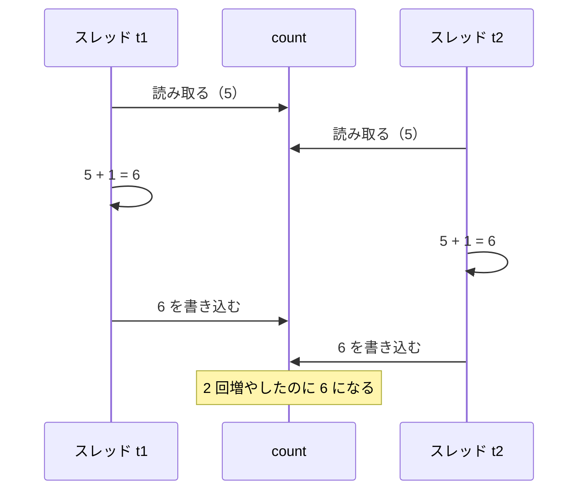
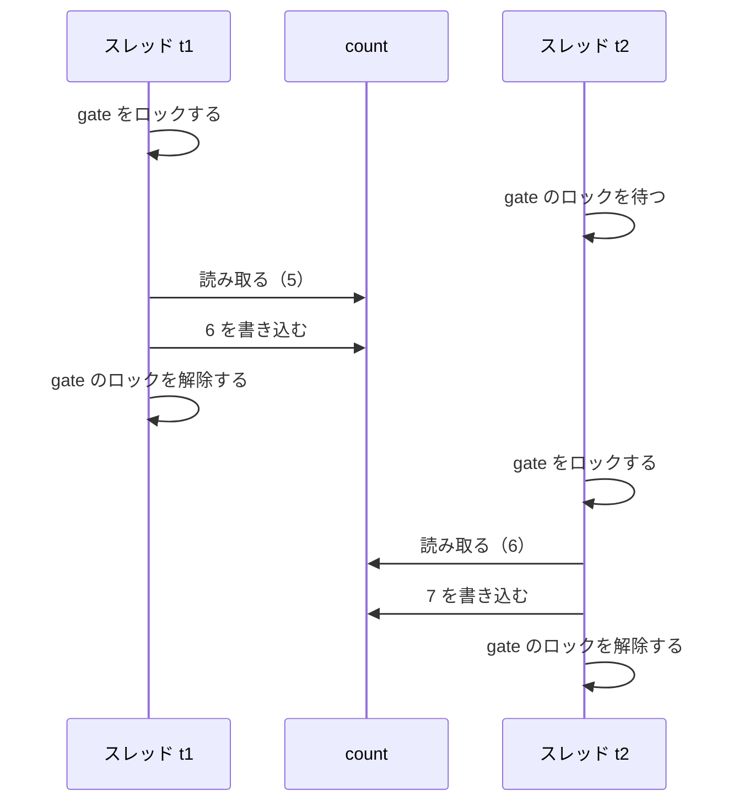

# 共有データと lock

複数のスレッドから同じ変数を書き換えると、書き換えた結果の一部が失われることがあります。このページでは、この問題が起きる理由と、`lock` 文や `Interlocked` クラスで防ぐ方法を学びます。

## 学習目標

このページを読み終えると、以下のことができるようになります。

- 複数のスレッドで `count++` を実行すると、結果が正しくならない理由を説明できる
- `lock` 文で、同じオブジェクトをロックする処理を 1 つずつ実行させられる
- `Interlocked.Increment` で、変数を安全に 1 増やせる

## 前提知識

- [スレッドの基本](/unity-csharp-learning/csharp/threads/) を読んでいること
- [インクリメント・デクリメント（補足）](/unity-csharp-learning/csharp/increment-decrement/) を読んでいること
- [ref / out / in パラメータ](/unity-csharp-learning/csharp/ref-out-in/) を読んでいること
- [IDisposable と using](/unity-csharp-learning/csharp/dispose-using/) を読んでいること

---

## 1. 同じ変数を複数のスレッドで書き換える

2 つのスレッドで、同じ変数 `count` を 100000 回ずつ 1 増やします。合計で 200000 回増やすので、最後は `200000` になるはずです。

```csharp
int count = 0;

Thread t1 = new Thread(Add);
Thread t2 = new Thread(Add);
t1.Start();
t2.Start();
t1.Join();
t2.Join();

Console.WriteLine($"count = {count}");

void Add()
{
    for (int i = 0; i < 100000; i++)
    {
        count++;
    }
}
```

実行結果の例です。値は環境や実行するたびに変わり、`200000` より小さくなることがあります。

```
count = 131472
```

`Join` で 2 つのスレッドの終了を待ってから表示しているのに、`200000` になりません。

### count++ は 1 回の操作ではない

`count++` は 1 つの式ですが、実行されるときは次の 3 つの手順に分かれます。

1. `count` の値を読み取る
2. 読み取った値に 1 を足す
3. 足した結果を `count` に書き込む

2 つのスレッドがこの手順を同時に進めると、次のように、一方の書き込みがもう一方の書き込みで上書きされることがあります。



2 つのスレッドがそれぞれ 1 増やしたので `7` になるはずですが、どちらも `5` を読み取ってから書き込んだので `6` になっています。このように、複数のスレッドが同じデータを読み書きする順序によって結果が変わってしまう状態を、**競合状態**（race condition）といいます。

どの順序で実行されるかは実行するたびに変わるので、上書きが起きる回数も変わります。回数が少なければ、たまたま `200000` になることもあります。一度正しい結果が出ても、問題がないとはいえません。

---

## 2. lock 文で 1 つずつ実行する

**lock 文** を使うと、ブロックの中の処理を、同時に 1 つのスレッドだけが実行するようにできます。

**書式：[lock 文](https://learn.microsoft.com/dotnet/csharp/language-reference/statements/lock)**
```
lock (式)
{
    // 同時に 1 つのスレッドだけが実行する処理
}
```

| 要素 | 説明 |
|---|---|
| `式` | ロックに使うオブジェクト。参照型でなければならない |
| ブロック | 同時に 1 つのスレッドだけが実行する処理 |

あるスレッドがオブジェクトをロックしてブロックを実行している間、同じオブジェクトで `lock` しようとしたほかのスレッドは、`lock` の手前で待たされます。ブロックを抜けるとロックが解除され、待っていたスレッドの 1 つがブロックに入ります。

前の節のコードで、`count++` を `lock` で囲みます。ロックには、そのためだけに作った `object` 型のオブジェクト `gate` を使います。

```csharp
int count = 0;
object gate = new object();

Thread t1 = new Thread(Add);
Thread t2 = new Thread(Add);
t1.Start();
t2.Start();
t1.Join();
t2.Join();

Console.WriteLine($"count = {count}");

void Add()
{
    for (int i = 0; i < 100000; i++)
    {
        lock (gate)
        {
            count++;
        }
    }
}
```

```
count = 200000
```

`count` を読み取ってから書き込むまでの間に、ほかのスレッドが割り込まなくなったので、何回実行しても `200000` になります。



### lock の正体は try / finally

`lock` 文は、[Monitor クラス](https://learn.microsoft.com/dotnet/api/system.threading.monitor) の `Enter` メソッドでロックし、`Exit` メソッドで解除する、おおよそ次のようなコードに置き換えられます。解除は `finally` の中で行われるので、ブロックの中で例外が発生しても、ロックは必ず解除されます。

```
bool lockTaken = false;
try
{
    Monitor.Enter(gate, ref lockTaken);
    // ブロックの中の処理
}
finally
{
    if (lockTaken)
    {
        Monitor.Exit(gate);
    }
}
```

[IDisposable と using](/unity-csharp-learning/csharp/dispose-using/) で学んだ `using` 文と同じく、後片付けを `finally` で確実に行うためのシンタックスシュガーです。

### ロックに使うオブジェクト

`lock` で守れるのは、**同じオブジェクト** でロックする処理どうしだけです。同じデータを読み書きする処理は、すべて同じオブジェクトで `lock` します。

ロックには、上の `gate` のように、ロックのためだけに作ったオブジェクトを使います。クラスの中で使うときは、`private readonly` のフィールドにします。

```csharp
Counter counter = new Counter();

Thread t1 = new Thread(Add);
Thread t2 = new Thread(Add);
t1.Start();
t2.Start();
t1.Join();
t2.Join();

Console.WriteLine($"Count = {counter.Count}");

void Add()
{
    for (int i = 0; i < 100000; i++)
    {
        counter.Increment();
    }
}

class Counter
{
    private readonly object _gate = new object();
    private int _count;

    public int Count
    {
        get
        {
            lock (_gate)
            {
                return _count;
            }
        }
    }

    public void Increment()
    {
        lock (_gate)
        {
            _count++;
        }
    }
}
```

```
Count = 200000
```

`_gate` を `private` にしておくと、クラスの外のコードが同じオブジェクトで `lock` することはありません。どこでロックしているかが、このクラスの中だけで決まります。

---

## 3. Interlocked で 1 回の操作にする

変数を 1 増やすだけなら、[Interlocked クラス](https://learn.microsoft.com/dotnet/api/system.threading.interlocked) を使う方法もあります。`Interlocked.Increment` は、「読み取る・足す・書き込む」を、途中でほかのスレッドが割り込めない 1 回の操作として実行します。途中で割り込めない操作を **アトミック**（atomic、不可分）な操作といいます。

**書式：[Interlocked.Increment メソッド](https://learn.microsoft.com/dotnet/api/system.threading.interlocked.increment)**
```csharp
public static int Increment(ref int location);
```

| パラメータ | 説明 |
|---|---|
| `location` | 1 増やす変数。`ref` で渡す |

戻り値は、1 増やした後の値です。

```csharp
int count = 0;

Thread t1 = new Thread(Add);
Thread t2 = new Thread(Add);
t1.Start();
t2.Start();
t1.Join();
t2.Join();

Console.WriteLine($"count = {count}");

void Add()
{
    for (int i = 0; i < 100000; i++)
    {
        Interlocked.Increment(ref count);
    }
}
```

```
count = 200000
```

`Interlocked` には、1 減らす `Decrement`、指定した値を足す `Add` などもあります。1 つの変数を 1 回で書き換えるだけなら `Interlocked` を、複数の変数をまとめて書き換えるなど、手順が 2 つ以上あるときは `lock` を使います。

---

## よくあるミス

### スレッドごとに別のオブジェクトで lock する

```csharp
// ❌ NG: lock のたびに新しいオブジェクトを作っている
void Add()
{
    for (int i = 0; i < 100000; i++)
    {
        lock (new object())
        {
            count++;
        }
    }
}
```

`lock` が待たせるのは、同じオブジェクトでロックしようとしたスレッドだけです。毎回新しいオブジェクトでロックすると、どのスレッドも待たされないので、`lock` がないのと同じになります。結果は `200000` より小さくなることがあります。

---

## ワンポイントアドバイス

### そもそも共有しない

`lock` で待たされている間、そのスレッドは何もできません。ロックが多いほど、スレッドを増やしても処理は速くなりにくくなります。

各スレッドが自分のローカル変数で数え、最後に合計する方法なら、ロックは最後の 1 回で済みます。スレッドどうしで共有するデータを減らすことが、スレッドを安全に使ういちばんの方法です。この「スレッドで計算した結果を受け取って使う」方法は、後で学ぶ `Task<T>` が得意とするところです。

### デッドロック

2 つのスレッドが、それぞれ相手のロックしているオブジェクトのロックを待つと、どちらも永久に先へ進めなくなります。これを **デッドロック** といいます。`lock` を入れ子にするときは、どのスレッドでもロックする順序をそろえます。

### C# 13 の Lock 型

C# 13（.NET 9）以降では、ロック専用の [System.Threading.Lock](https://learn.microsoft.com/dotnet/api/system.threading.lock) 型を `lock` 文に使えます。このページでは、それより前のバージョンでも使える `object` 型のオブジェクトを使っています。

---

## まとめ

- `count++` は「読み取る・足す・書き込む」の 3 つの手順に分かれるので、複数のスレッドで同時に実行すると結果が失われる
- 読み書きの順序によって結果が変わる状態を競合状態という
- `lock` 文は、同じオブジェクトでロックするブロックを、同時に 1 つのスレッドだけに実行させる。正体は `try` / `finally`
- `Interlocked.Increment` は、変数を 1 増やす操作をアトミックに行う

---

## 理解度チェック

1. 2 つのスレッドで `count++` を 100000 回ずつ実行したとき、結果が `200000` より小さくなる理由を説明してください。
2. `lock` のブロックの中で例外が発生したとき、ロックは解除されますか？理由も説明してください。
3. 次のコードを実行すると何が出力されますか？

   ```csharp
   int count = 0;
   object gate = new object();

   Thread[] threads = new Thread[4];
   for (int i = 0; i < threads.Length; i++)
   {
       threads[i] = new Thread(() =>
       {
           for (int j = 0; j < 1000; j++)
           {
               lock (gate)
               {
                   count += 2;
               }
           }
       });
       threads[i].Start();
   }

   foreach (Thread t in threads)
   {
       t.Join();
   }

   Console.WriteLine(count);
   ```

<details markdown="1">
<summary>解答を見る</summary>

1. `count++` は「読み取る・足す・書き込む」の 3 つの手順に分かれていて、2 つのスレッドが同じ値を読み取ってから書き込むと、一方の結果が上書きされて失われるからです。
2. 解除されます。`lock` 文は `try` / `finally` に置き換えられ、ロックの解除は `finally` の中で行われるからです。
3. `8000` が出力されます。4 つのスレッドが 1000 回ずつ 2 を足し、`lock` で守られているので、足した結果は失われません。

</details>

---

## 次のステップ

[スレッドの数と性能](/unity-csharp-learning/csharp/thread-performance/) では、スレッドを増やしても処理が速くなるとは限らない理由を、CPU のコアとスレッドの切り替えから学びます。
