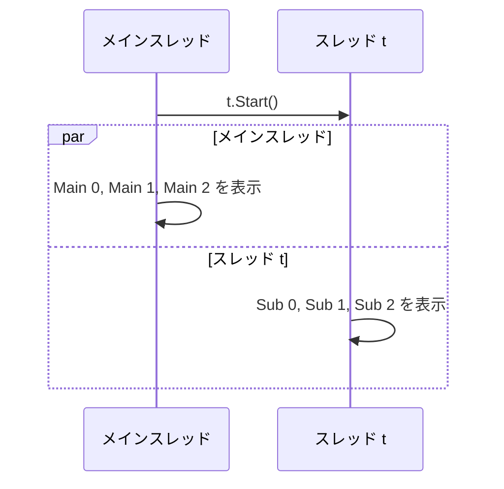
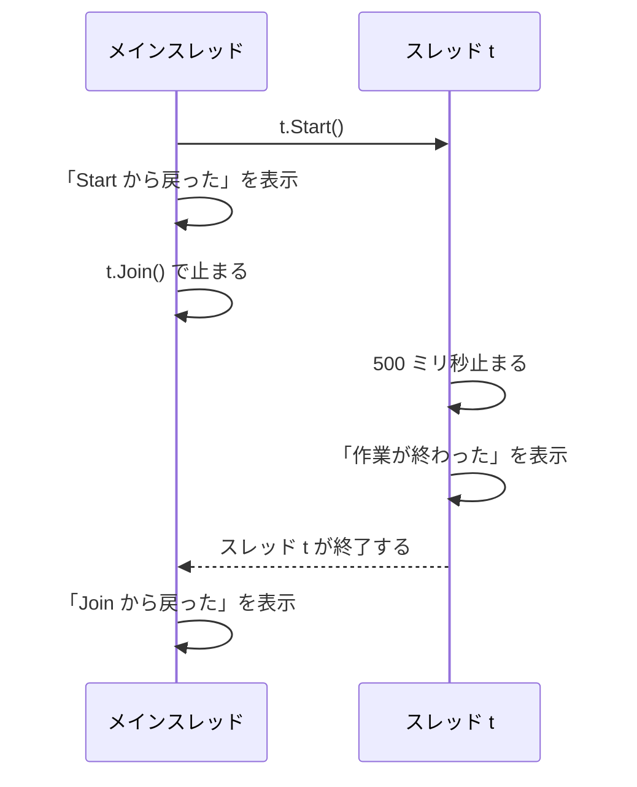

# スレッドの基本

プログラムの処理を上から順に実行していく流れを **スレッド**（thread）といいます。スレッドを増やすと、複数の処理を同時に進められます。このページでは、`Thread` クラスでスレッドを作り、その終了を待つ方法を学びます。

## 学習目標

このページを読み終えると、以下のことができるようになります。

- スレッドとメインスレッドが何かを説明できる
- `Thread` クラスでスレッドを作って開始し、`Join` で終了を待てる
- 複数のスレッドの出力の順序が、実行するたびに変わる理由を説明できる

## 前提知識

- [ラムダ式](/unity-csharp-learning/csharp/lambda/) を読んでいること
- [変数キャプチャ](/unity-csharp-learning/csharp/variable-capture/) を読んでいること

---

## 1. スレッドとは

これまでのプログラムは、文を上から 1 つずつ順に実行してきました。メソッドを呼び出すと、そのメソッドの処理が終わるまで呼び出し元は先に進みません。この「1 つずつ順に実行していく流れ」がスレッドです。

プログラムを起動すると、スレッドが 1 つ作られ、そこでプログラムが実行されます。このスレッドを **メインスレッド** といいます。これまでのコード例は、すべてメインスレッドだけで実行されていました。

スレッドを新しく作ると、メインスレッドとは別の流れで処理を実行できます。CPU に複数のコア（処理を実行する装置）があれば、複数のスレッドが実際に同時に実行されます。コアの数よりスレッドが多いときは、OS がスレッドを短い時間で切り替えながら実行するので、やはり同時に進んでいるように見えます。

---

## 2. Thread クラスでスレッドを作る

スレッドは [Thread クラス](https://learn.microsoft.com/dotnet/api/system.threading.thread) で作ります。コンストラクターに、新しいスレッドで実行するメソッドを渡します。

**書式：[Thread コンストラクター](https://learn.microsoft.com/dotnet/api/system.threading.thread.-ctor)**
```csharp
public Thread(ThreadStart start);
```

| パラメータ | 説明 |
|---|---|
| `start` | 新しいスレッドで実行するメソッド。[ThreadStart](https://learn.microsoft.com/dotnet/api/system.threading.threadstart) は、パラメータも戻り値もないメソッドを表すデリゲート型 |

`Thread` オブジェクトを作っただけでは、まだ何も実行されません。[Start メソッド](https://learn.microsoft.com/dotnet/api/system.threading.thread.start) を呼び出すと、スレッドが開始され、渡したメソッドが実行されます。`Start` はスレッドを開始するとすぐに戻るので、呼び出し元はメソッドの終了を待たずに先へ進みます。

> 💡 **ポイント**: `Thread` クラスは `System.Threading` 名前空間にあります。`System.Threading` は [暗黙的な using ディレクティブ](/unity-csharp-learning/csharp/using-directives/) で読み込まれているので、`using` を書かずに使えます。暗黙的な using ディレクティブが無効な環境では、ファイルの先頭に `using System.Threading;` を書きます。

### Thread.Sleep でスレッドを止める

[Thread.Sleep メソッド](https://learn.microsoft.com/dotnet/api/system.threading.thread.sleep) は、呼び出したスレッドを指定した時間（ミリ秒）だけ止めます。止まるのは `Sleep` を呼び出したスレッドだけで、ほかのスレッドはその間も実行を続けます。

**書式：[Thread.Sleep メソッド](https://learn.microsoft.com/dotnet/api/system.threading.thread.sleep)**
```csharp
public static void Sleep(int millisecondsTimeout);
```

次のコードでは、メインスレッドと新しく作ったスレッドが、それぞれ 100 ミリ秒ずつ止まりながら 3 回ずつ表示します。

```csharp
Thread t = new Thread(Count);
t.Start();

for (int i = 0; i < 3; i++)
{
    Console.WriteLine($"Main {i}");
    Thread.Sleep(100);
}

void Count()
{
    for (int i = 0; i < 3; i++)
    {
        Console.WriteLine($"Sub {i}");
        Thread.Sleep(100);
    }
}
```

実行結果の例です。行の順序は、環境や実行するたびに変わります。

```
Main 0
Sub 0
Sub 1
Main 1
Main 2
Sub 2
```

`Main` と `Sub` の行が混ざって表示されています。2 つのスレッドが同時に進んでいるからです。



---

## 3. 実行の順序は決まらない

どのスレッドをいつ実行するかは、OS が決めます。ほかのプログラムの状況や CPU のコアの数によって変わるので、スレッドどうしの実行の順序は、プログラムからは決められません。上のコードを何回か実行すると、`Main` と `Sub` の並び方が変わります。

ただし、次の順序は必ず守られます。

- **同じスレッドの中の順序**：`Main 0`、`Main 1`、`Main 2` はこの順に表示される。`Sub` も同じ
- **Start より前の処理**：`t.Start()` より前にメインスレッドで実行した処理は、スレッド `t` の処理より先に終わっている

スレッドを使うプログラムでは、「どの順序が保証されていて、どの順序が保証されていないか」を区別することが大切です。

---

## 4. Join で終了を待つ

スレッドの処理が終わってから次へ進みたいときは、[Join メソッド](https://learn.microsoft.com/dotnet/api/system.threading.thread.join) を使います。`Join` を呼び出したスレッドは、対象のスレッドが終了するまで止まります。

**書式：[Thread.Join メソッド](https://learn.microsoft.com/dotnet/api/system.threading.thread.join)**
```csharp
public void Join();
```

```csharp
Thread t = new Thread(Work);
t.Start();
Console.WriteLine("Main: Start から戻った");

t.Join();
Console.WriteLine("Main: Join から戻った");

void Work()
{
    Thread.Sleep(500);
    Console.WriteLine("Sub: 作業が終わった");
}
```

```
Main: Start から戻った
Sub: 作業が終わった
Main: Join から戻った
```

`Start` はすぐに戻るので、`Main: Start から戻った` が先に表示されます。`Work` は 500 ミリ秒止まってから表示するので、その間にメインスレッドが先に進みます。`Join` から戻るのは `Work` が終わった後なので、`Main: Join から戻った` は必ず最後に表示されます。



`Join` を使うと、`Join` の後の処理がスレッドの処理より後になることが保証されます。スレッドの処理の結果を使いたいときは、`Join` で終了を待ってから使います。

### フォアグラウンドスレッドとバックグラウンドスレッド

`Join` を呼ばなくても、前の節のコード例では `Sub` の行がすべて表示されました。`Thread` で作ったスレッドは、既定で **フォアグラウンドスレッド** になるからです。プログラムは、フォアグラウンドスレッドがすべて終わるまで終了しません。

[IsBackground プロパティ](https://learn.microsoft.com/dotnet/api/system.threading.thread.isbackground) を `true` にしたスレッドは **バックグラウンドスレッド** になります。フォアグラウンドスレッドがすべて終わると、バックグラウンドスレッドは途中でも止められ、プログラムが終了します。

```csharp
Thread t = new Thread(Work);
t.IsBackground = true;
t.Start();
Console.WriteLine("Main: 終了");

void Work()
{
    Thread.Sleep(500);
    Console.WriteLine("Sub: 作業が終わった");
}
```

```
Main: 終了
```

メインスレッドが終わった時点で、スレッド `t` はまだ `Sleep` の途中です。`t` はバックグラウンドスレッドなので、`Sub: 作業が終わった` を表示する前にプログラムが終了します。

---

## 5. どのスレッドで実行されているかを調べる

[Environment.CurrentManagedThreadId プロパティ](https://learn.microsoft.com/dotnet/api/system.environment.currentmanagedthreadid) は、このプロパティを読んだスレッドの ID（スレッドごとに割り当てられる番号）を返します。同じ処理でも、どのスレッドで実行されているかによって値が変わります。

```csharp
Console.WriteLine($"Main: スレッド {Environment.CurrentManagedThreadId}");

Thread t = new Thread(Work);
t.Start();
t.Join();

void Work()
{
    Console.WriteLine($"Work: スレッド {Environment.CurrentManagedThreadId}");
}
```

実行結果の例です。ID の値は環境によって変わります。

```
Main: スレッド 1
Work: スレッド 9
```

`Main` と `Work` で ID が異なるので、`Work` がメインスレッドとは別のスレッドで実行されたことがわかります。非同期処理を学ぶときにも、処理がどのスレッドで実行されているかを、この方法で確かめます。

---

## よくあるミス

### ループ変数をキャプチャしてスレッドに渡す

`Thread` のコンストラクターにはラムダ式も渡せます。このとき、`for` ループの変数をキャプチャすると、[変数キャプチャ](/unity-csharp-learning/csharp/variable-capture/) で学んだ罠に当たります。

```csharp
Thread[] threads = new Thread[3];
for (int i = 0; i < 3; i++)
{
    threads[i] = new Thread(() => Console.WriteLine($"i = {i}"));
    threads[i].Start();
}

foreach (Thread t in threads)
{
    t.Join();
}
```

実行結果の例です。表示される値と順序は、実行するたびに変わります。

```
i = 2
i = 3
i = 3
```

3 つのラムダ式は、すべて同じ変数 `i` を参照しています。ラムダ式が実行されるのは、スレッドが開始された後です。そのときにはループが先に進んで `i` が変わっていることがあるので、`0`、`1`、`2` が 1 回ずつ表示されるとは限りません。

`List<Action>` にためてから呼び出したときは、必ず `3` が表示されました。スレッドでは、ラムダ式がいつ実行されるかが決まらないので、表示される値も実行するたびに変わります。ループの中で別の変数にコピーしてからキャプチャすると、スレッドごとに値が固定されます。

```csharp
Thread[] threads = new Thread[3];
for (int i = 0; i < 3; i++)
{
    int n = i;
    threads[i] = new Thread(() => Console.WriteLine($"n = {n}"));
    threads[i].Start();
}

foreach (Thread t in threads)
{
    t.Join();
}
```

実行結果の例です。値は `0`、`1`、`2` が 1 回ずつ表示されますが、順序は実行するたびに変わります。

```
n = 0
n = 2
n = 1
```

---

## まとめ

- スレッドは、処理を順に実行していく流れ。プログラムはメインスレッドで始まる
- `new Thread(メソッド)` でスレッドを作り、`Start` で開始する。`Start` はすぐに戻る
- 別のスレッドどうしの実行の順序は決まらない。同じスレッドの中の順序と、`Join` の後の処理が後になることは保証される
- `Join` は、対象のスレッドが終了するまで呼び出したスレッドを止める
- `Environment.CurrentManagedThreadId` で、処理を実行しているスレッドを調べられる

---

## 理解度チェック

1. `Thread` の `Start` と `Join` は、それぞれ呼び出し元のスレッドをいつまで止めますか？
2. 次のコードを実行すると何が出力されますか？

   ```csharp
   Thread t = new Thread(() =>
   {
       Thread.Sleep(300);
       Console.WriteLine("B");
   });
   Console.WriteLine("A");
   t.Start();
   t.Join();
   Console.WriteLine("C");
   ```

3. 次のコードの出力のうち、実行するたびに変わる可能性があるのはどの部分ですか？

   ```csharp
   Thread t = new Thread(() =>
   {
       Console.WriteLine("X1");
       Console.WriteLine("X2");
   });
   t.Start();
   Console.WriteLine("Y");
   t.Join();
   Console.WriteLine("Z");
   ```

<details markdown="1">
<summary>解答を見る</summary>

1. `Start` はスレッドを開始するとすぐに戻り、呼び出し元を止めません。`Join` は、対象のスレッドが終了するまで呼び出し元を止めます。
2. 次のように出力されます。`A` は `Start` より前、`C` は `Join` より後なので、順序が決まっています。

   ```
   A
   B
   C
   ```

3. `Y` が `X1` や `X2` のどこに入るかが変わります。`X1` が `X2` より先であること（同じスレッドの中の順序）と、`Z` が最後であること（`Join` の後）は変わりません。

</details>

---

## 次のステップ

[共有データと lock](/unity-csharp-learning/csharp/thread-safety/) では、複数のスレッドから同じ変数を書き換えるときに起きる問題と、その防ぎ方を学びます。
