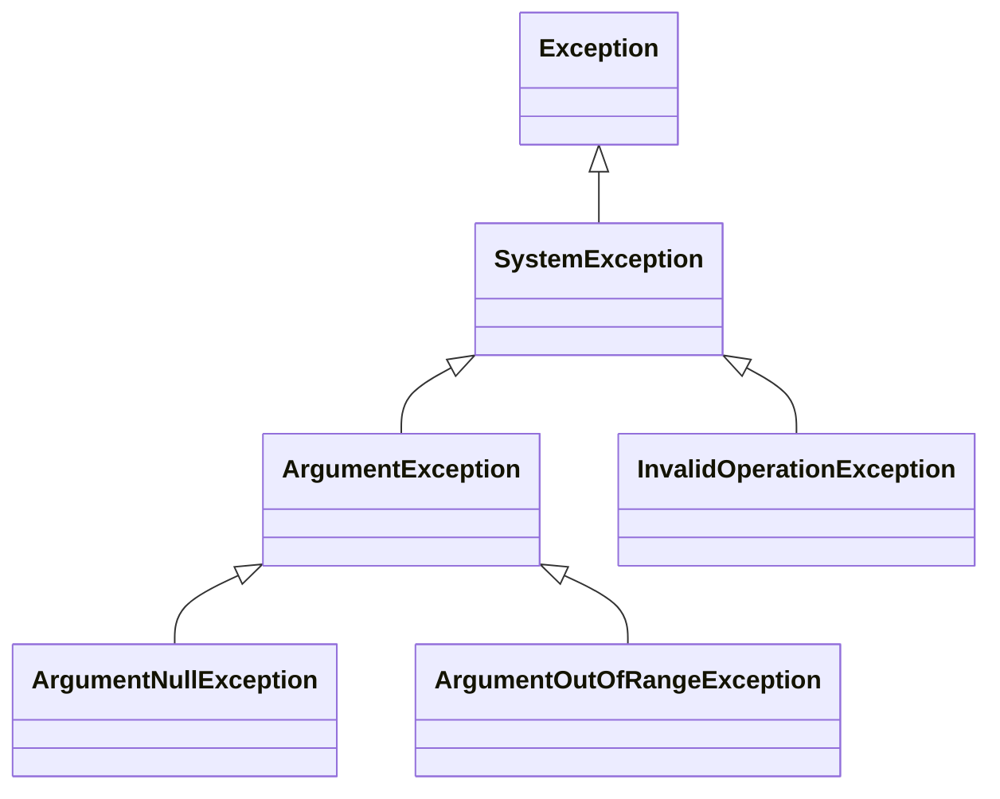
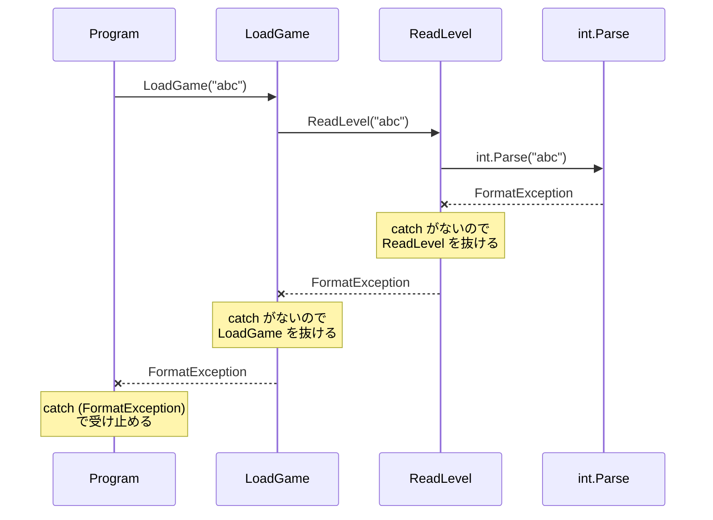

# 例外を投げる

`throw` 文を使うと、自分で書いたメソッドから例外を投げられます。投げた例外は、受け止める `catch` が見つかるまで、呼び出し元へ順にさかのぼって伝わります。

## 学習目標

このページを読み終えると、以下のことができるようになります。

- `throw` 文で例外を投げられる
- 例外が呼び出し元へ伝わる流れを、コールスタックと結び付けて説明できる
- `throw;` で例外を投げ直すときに、`throw ex;` と書いてはいけない理由を説明できる
- `Exception` を継承して、独自の例外クラスを定義できる

## 前提知識

- [例外の基本](/unity-csharp-learning/csharp/exceptions/) を読んでいること
- [再帰関数とコールスタック](/unity-csharp-learning/csharp/recursion/) を読んでいること

---

## 1. throw で例外を投げる

前のページでは、`int.Parse` などの .NET のメソッドが投げた例外を受け止めました。自分で書いたメソッドでも、処理を続けられない状況になったら、`throw` 文で例外を投げられます。

**書式：[throw 文](https://learn.microsoft.com/dotnet/csharp/language-reference/statements/exception-handling-statements#the-throw-statement)**
```
throw new 例外の型(引数);
```

| 要素 | 説明 |
|---|---|
| `throw` | 例外を投げるキーワード。実行すると、その場でメソッドを抜ける |
| `new 例外の型(引数)` | 投げる例外オブジェクト。`Exception` の派生クラスのインスタンスを作る |

次の `Heal` メソッドは、HP を回復します。回復量に負の値が渡されたら、`ArgumentOutOfRangeException`（引数が範囲外であることを表す例外）を投げます。

```csharp
Player p = new Player();
p.Hp = 50;
p.Heal(30);
Console.WriteLine(p.Hp);

try
{
    p.Heal(-10);
}
catch (ArgumentOutOfRangeException e)
{
    Console.WriteLine($"引数 {e.ParamName} が範囲外です");
}
Console.WriteLine(p.Hp);

class Player
{
    public int Hp { get; set; }

    public void Heal(int amount)
    {
        if (amount < 0)
        {
            throw new ArgumentOutOfRangeException(nameof(amount));
        }
        Hp += amount;
    }
}
```

```
80
引数 amount が範囲外です
80
```

`throw` を実行すると、`return` と同じように、その場でメソッドを抜けます。そのため `p.Heal(-10)` では `Hp += amount` が実行されず、HP は 80 のままです。

`nameof(amount)` は、パラメーター名を文字列 `"amount"` にする式です。[nameof 式](https://learn.microsoft.com/dotnet/csharp/language-reference/operators/nameof) を使うと、パラメーター名を変更したときに文字列の書き換え忘れが起きません。渡した名前は、例外の [ParamName プロパティ](https://learn.microsoft.com/dotnet/api/system.argumentexception.paramname) で取り出せます。

### 値を補正するか、例外を投げるか

[プロパティ](/unity-csharp-learning/csharp/properties/) のページでは、HP に負の値を代入したら 0 に補正しました。ダメージで HP が 0 を下回るのは、ゲームの中で普通に起きることだからです。

一方、「回復量が負」は、呼び出し側のコードの誤りです。黙って補正したり無視したりすると、誤りに気付けません。例外を投げると、誤りがあることと、その場所がすぐにわかります。

### よく使う例外の型

自分で例外を投げるときは、.NET に用意されている例外の型から、状況に合うものを選びます。

| 例外の型 | 投げる場面 |
|---|---|
| [ArgumentException](https://learn.microsoft.com/dotnet/api/system.argumentexception) | 引数の値が正しくない |
| [ArgumentNullException](https://learn.microsoft.com/dotnet/api/system.argumentnullexception) | `null` を受け付けない引数に `null` が渡された |
| [ArgumentOutOfRangeException](https://learn.microsoft.com/dotnet/api/system.argumentoutofrangeexception) | 引数の値が許される範囲の外にある |
| [InvalidOperationException](https://learn.microsoft.com/dotnet/api/system.invalidoperationexception) | 引数ではなく、オブジェクトの今の状態では、その操作ができない |



`ArgumentNullException` と `ArgumentOutOfRangeException` は `ArgumentException` の派生クラスなので、`catch (ArgumentException)` でまとめて受け止められます。

---

## 2. 例外が伝わる流れ

メソッドの中で発生した例外を、そのメソッドが受け止めなかった場合、例外はメソッドを抜けて **呼び出し元へ** 伝わります。呼び出し元でも受け止めなければ、さらにその呼び出し元へ伝わります。

```csharp
Console.WriteLine("Program: 開始");
try
{
    LoadGame("abc");
    Console.WriteLine("Program: ロード完了");
}
catch (FormatException)
{
    Console.WriteLine("Program: FormatException を受け止めた");
}
Console.WriteLine("Program: 終了");

void LoadGame(string text)
{
    Console.WriteLine("LoadGame: 開始");
    int level = ReadLevel(text);
    Console.WriteLine($"LoadGame: レベル {level}");
}

int ReadLevel(string text)
{
    Console.WriteLine("ReadLevel: 開始");
    int level = int.Parse(text);
    Console.WriteLine("ReadLevel: 変換完了");
    return level;
}
```

```
Program: 開始
LoadGame: 開始
ReadLevel: 開始
Program: FormatException を受け止めた
Program: 終了
```

`int.Parse` で発生した例外は、`ReadLevel` にも `LoadGame` にも `catch` がないので、両方のメソッドを途中で抜けて、`try` / `catch` を書いた呼び出し元まで伝わります。「変換完了」「レベル」「ロード完了」は、どれも表示されていません。



これは、[コールスタック](/unity-csharp-learning/csharp/recursion/) に積まれたスタックフレームを、`catch` が見つかるまで上から順に取り除いていく動きです。一番下まで取り除いても `catch` が見つからないと、プログラムが終了します。

### スタックトレース

例外オブジェクトの [StackTrace プロパティ](https://learn.microsoft.com/dotnet/api/system.exception.stacktrace) には、例外が発生した場所から受け止めた場所までの、メソッドの呼び出し履歴が記録されています。これを **スタックトレース** といいます。上のコードの `catch` で `StackTrace` を表示すると、次のようになります（ファイルのパスと行番号は省略しています）。

```
   at System.Number.ThrowFormatException[TChar](ReadOnlySpan`1 value)
   at System.Int32.Parse(String s)
   at Program.<<Main>$>g__ReadLevel|0_1(String text)
   at Program.<<Main>$>g__LoadGame|0_0(String text)
   at Program.<Main>$(String[] args)
```

`<<Main>$>g__ReadLevel|0_1` のような名前は、トップレベルのステートメントに書いたローカル関数に、コンパイラーが付けた名前です。名前の中に `ReadLevel` や `LoadGame` が含まれています。

上の行ほど、例外が発生した場所に近いメソッドです。下から上へ読むと、呼び出した順になります。前のページで見た「未処理の例外」の表示にも、このスタックトレースが含まれています。例外の原因を探すときは、スタックトレースの中から自分で書いたメソッドを探すと、どこで問題が起きたかがわかります。

---

## 3. 例外を投げ直す

例外を受け止めてログを出したうえで、例外そのものの対処は呼び出し元に任せたいことがあります。そのときは、`catch` ブロックの中で `throw;` と書くと、受け止めた例外をそのまま投げ直せます。

**書式：例外の再スロー**
```
catch (例外の型)
{
    // ログの出力など
    throw;
}
```

投げ直すときは、`throw ex;` のように例外オブジェクトを指定してはいけません。次のコードで、2 つの書き方を比べます。

```csharp
try
{
    SaveData.Load("abc");
}
catch (FormatException e)
{
    Console.WriteLine(e.StackTrace?.Contains("ReadLevel"));
}

try
{
    SaveData.LoadBad("abc");
}
catch (FormatException e)
{
    Console.WriteLine(e.StackTrace?.Contains("ReadLevel"));
}

class SaveData
{
    public static int ReadLevel(string text)
    {
        return int.Parse(text);
    }

    public static void Load(string text)
    {
        try
        {
            ReadLevel(text);
        }
        catch (FormatException)
        {
            Console.WriteLine("ログ: 読み込みに失敗");
            throw;
        }
    }

    public static void LoadBad(string text)
    {
        try
        {
            ReadLevel(text);
        }
        catch (FormatException ex)
        {
            Console.WriteLine("ログ: 読み込みに失敗");
            throw ex;  // ❌ NG
        }
    }
}
```

```
ログ: 読み込みに失敗
True
ログ: 読み込みに失敗
False
```

どちらも同じ `FormatException` が呼び出し元に届いていますが、`throw ex;` で投げ直したほうは、スタックトレースに `ReadLevel` が含まれていません。`throw ex;` は、例外を「その場所から新しく投げた」ものとして扱い、スタックトレースを投げ直した場所から記録し直すためです。例外が本当に発生した場所がわからなくなります。

`throw ex;` と書くと、ビルド時に CA2200 という警告が表示されます。日本語の環境では「キャッチされた例外が再スローされると、スタック情報が変更されます」と表示されます。

---

## 4. 独自の例外クラスを定義する

.NET の例外の型では状況を表しきれないときは、`Exception` を継承して、独自の例外クラスを定義できます。クラス名は `Exception` で終わる名前にするのが慣習です。

**書式：独自の例外クラス**
```
class クラス名Exception : Exception
{
    public クラス名Exception(string message) : base(message)
    {
    }
}
```

コンストラクターで `base(message)` に渡した文字列は、`Message` プロパティで取り出せます。例外に関する情報を呼び出し元へ渡したいときは、プロパティを追加します。

```csharp
Inventory inventory = new Inventory(new[] { "薬草", "鍵" });
inventory.Use("薬草");

try
{
    inventory.Use("剣");
}
catch (ItemNotFoundException e)
{
    Console.WriteLine(e.Message);
    Console.WriteLine($"探したアイテム: {e.ItemName}");
}

class ItemNotFoundException : Exception
{
    public string ItemName { get; }

    public ItemNotFoundException(string itemName)
        : base($"{itemName} を持っていません")
    {
        ItemName = itemName;
    }
}

class Inventory
{
    private string[] _items;

    public Inventory(string[] items)
    {
        _items = items;
    }

    public void Use(string name)
    {
        if (Array.IndexOf(_items, name) < 0)
        {
            throw new ItemNotFoundException(name);
        }
        Console.WriteLine($"{name} を使った");
    }
}
```

```
薬草 を使った
剣 を持っていません
探したアイテム: 剣
```

独自の例外クラスにすると、呼び出し元は `catch (ItemNotFoundException)` と書いて、「アイテムがない」ときだけを受け止められます。

### 原因の例外を包んで投げる

`int.Parse` の `FormatException` を、そのまま呼び出し元へ伝えると、呼び出し元は「セーブデータを数値で保存していて、`int.Parse` で読んでいる」という内部の事情を知らないと、受け止める型を決められません。こういうときは、独自の例外で包んで投げ直します。

`Exception` には、原因となった例外を受け取るコンストラクターがあります。渡した例外は、[InnerException プロパティ](https://learn.microsoft.com/dotnet/api/system.exception.innerexception) で取り出せます。

```csharp
try
{
    SaveLoader.LoadLevel("abc");
}
catch (SaveDataException e)
{
    Console.WriteLine(e.Message);
    Console.WriteLine($"原因: {e.InnerException?.GetType().Name}");
}

class SaveDataException : Exception
{
    public SaveDataException(string message, Exception innerException)
        : base(message, innerException)
    {
    }
}

class SaveLoader
{
    public static int LoadLevel(string text)
    {
        try
        {
            return int.Parse(text);
        }
        catch (FormatException e)
        {
            throw new SaveDataException("セーブデータが壊れています", e);
        }
    }
}
```

```
セーブデータが壊れています
原因: FormatException
```

呼び出し元は `SaveDataException` だけを受け止めればよく、読み込みの方法が変わっても `catch` を書き換える必要がありません。原因の例外は `InnerException` に残っているので、スタックトレースも失われません。

---

## よくあるミス

### Exception 型をそのまま投げる

```csharp
// ❌ NG: 呼び出し元は catch (Exception) でしか受け止められない
// throw new Exception("回復量が負です");

// ✅ OK: 状況を表す型を選ぶ
// throw new ArgumentOutOfRangeException(nameof(amount));
```

`Exception` をそのまま投げると、呼び出し元は `catch (Exception)` でしか受け止められません。前のページで見たように、`catch (Exception)` はほかの例外まで受け止めてしまいます。状況に合う型を選ぶか、独自の例外クラスを定義しましょう。

---

## ワンポイントアドバイス

### when による例外フィルター

`catch` の後ろに `when (条件式)` を書くと、条件式が `true` のときだけ、その `catch` で受け止めます。これを [例外フィルター](https://learn.microsoft.com/dotnet/csharp/language-reference/statements/exception-handling-statements#a-when-exception-filter) といいます。次のコードは、4. の `ItemNotFoundException` と `Inventory` クラスを使います。

```csharp
Inventory inventory = new Inventory(new[] { "薬草" });
string[] names = { "剣", "鍵" };

foreach (string name in names)
{
    try
    {
        inventory.Use(name);
    }
    catch (ItemNotFoundException e) when (e.ItemName == "鍵")
    {
        Console.WriteLine("鍵がないので扉が開かない");
    }
    catch (ItemNotFoundException e)
    {
        Console.WriteLine(e.Message);
    }
}
```

```
剣 を持っていません
鍵がないので扉が開かない
```

条件が `false` のときは、その `catch` は飛ばされ、次の `catch` が調べられます。そのため、同じ型の `catch` を 2 つ並べられます。

---

## まとめ

- `throw new 例外の型(...)` で例外を投げると、その場でメソッドを抜ける
- 呼び出し側のコードの誤りは、黙って補正せず、例外を投げて知らせる
- 受け止められなかった例外は、`catch` が見つかるまで呼び出し元へ順に伝わる。その履歴がスタックトレースに記録される
- 受け止めた例外を投げ直すときは `throw;` と書く。`throw ex;` はスタックトレースを失う
- `Exception` を継承すると独自の例外クラスを定義でき、`InnerException` で原因の例外を包んで投げられる

---

## 理解度チェック

1. `throw` 文を実行すると、同じメソッドの `throw` より後ろの処理はどうなりますか？
2. 次のコードを実行すると何が出力されますか？

   ```csharp
   try
   {
       A();
       Console.WriteLine("1");
   }
   catch (InvalidOperationException)
   {
       Console.WriteLine("2");
   }
   finally
   {
       Console.WriteLine("3");
   }

   void A()
   {
       try
       {
           Console.WriteLine("4");
           B();
           Console.WriteLine("5");
       }
       finally
       {
           Console.WriteLine("6");
       }
   }

   void B()
   {
       throw new InvalidOperationException();
   }
   ```

3. `catch` ブロックで受け止めた例外を投げ直すとき、`throw ex;` ではなく `throw;` と書くのはなぜですか？
4. （応用）音量を設定する `SetVolume(int volume)` メソッドを書いてください。`volume` が 0〜100 の範囲外なら `ArgumentOutOfRangeException` を投げ、範囲内なら `音量: 値` と表示します。

<details markdown="1">
<summary>解答を見る</summary>

1. 実行されません。`throw` を実行した時点でメソッドを抜けます。
2. 次のように出力されます。`B` で投げた例外は `A` に `catch` がないので、`A` の `finally` を実行してから呼び出し元へ伝わり、`catch (InvalidOperationException)` で受け止められます。

   ```
   4
   6
   2
   3
   ```

3. `throw ex;` は例外を投げ直した場所から新しく投げたものとして扱い、スタックトレースを記録し直すため、例外が本当に発生した場所がわからなくなるからです。
4. ```csharp
   SetVolume(80);
   SetVolume(120);

   void SetVolume(int volume)
   {
       if (volume < 0 || volume > 100)
       {
           throw new ArgumentOutOfRangeException(nameof(volume));
       }
       Console.WriteLine($"音量: {volume}");
   }
   ```

   `SetVolume(120)` で例外が投げられ、受け止める `catch` がないので、`音量: 80` と表示した後にプログラムが終了します。

</details>

---

## 次のステップ

[IDisposable と using](/unity-csharp-learning/csharp/dispose-using/) では、ファイルや通信のように、使い終わったら必ず後片付けが必要なものを、確実に解放する方法を学びます。
