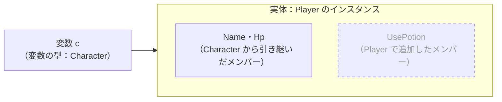

# 型変換と型チェック

継承を使うと、プレイヤーも敵も「キャラクター」として、1 つの配列にまとめて扱えるようになります。派生クラスのインスタンスを基底クラスの型で扱うことを **アップキャスト**、基底クラスの型から派生クラスの型に戻すことを **ダウンキャスト** といいます。このページでは、変数の型とインスタンスの実際の型の違い、2 つの変換の違い、実際の型を調べる `is` と `as` を学びます。

## 学習目標

このページを読み終えると、以下のことができるようになります。

- 派生クラスのインスタンスを、基底クラスの型の変数や配列で扱える（アップキャスト）
- 変数の型と実体の型の違いと、変数の型によって使えるメンバーが決まることを説明できる
- ダウンキャストにキャストの記述が必要な理由と、失敗したときに起きることを説明できる
- `is`・`as`・型パターンで、実体の型を調べてから変換できる

## 前提知識

- [継承](/unity-csharp-learning/csharp/inheritance/) を読んでいること
- [プリミティブ型と型変換](/unity-csharp-learning/csharp/primitive-types/) を読んでいること

---

## 1. 派生クラスを基底クラスの型で扱う

[継承](/unity-csharp-learning/csharp/inheritance/) で作った `Player` と `Enemy` を、パーティーや敵の群れのように、まとめて扱いたいとします。`Player` と `Enemy` は別の型ですが、どちらも `Character` の派生クラスです。そこで、`Character` の型の配列にまとめます。

```csharp
Character[] characters =
{
    new Player("Alice", 100),
    new Enemy("Slime", 20),
    new Enemy("Bat", 15)
};

foreach (Character c in characters)
{
    Console.WriteLine($"{c.Name}: HP={c.Hp}");
}

class Character
{
    public string Name { get; }
    public int Hp { get; set; }

    public Character(string name, int hp)
    {
        Name = name;
        Hp = hp;
    }
}

class Player : Character
{
    public Player(string name, int hp) : base(name, hp)
    {
    }

    public void UsePotion()
    {
        Hp += 20;
        Console.WriteLine($"{Name} は回復薬を使った。HP={Hp}");
    }
}

class Enemy : Character
{
    public Enemy(string name, int hp) : base(name, hp)
    {
    }
}
```

```
Alice: HP=100
Slime: HP=20
Bat: HP=15
```

`Player` のインスタンスも `Enemy` のインスタンスも、`Character` の型の配列の要素に入れられます。`Player` や `Enemy` を `Character` の型に変換することを、**アップキャスト**（upcast）といいます。継承の関係の図で、基底クラスを上に描くことから、この名前があります。

アップキャストは、キャストを書かなくても暗黙的に行われます。派生クラスは基底クラスのメンバーをすべて引き継いでいるので、`Player` のインスタンスは、いつでも `Character` として扱えるからです。変換に失敗することがありません。

---

## 2. 変数の型と実体の型

この節から後のコード例では、1 節の `Character`・`Player`・`Enemy` クラスをそのまま使います。

`Character c = new Player("Alice", 100);` と書いたとき、変数 `c` の型は `Character` です。一方、`c` が指しているインスタンスは `Player` のまま変わりません。この「インスタンスが実際に何のクラスのものか」を、このサイトでは **実体の型** と呼びます。実体の型は、`object` から引き継いだ `GetType` メソッドで調べられます。

```csharp
Character c = new Player("Alice", 100);
Console.WriteLine(c.GetType());
Console.WriteLine(c.Name);

// ❌ NG: Character の型の変数からは、Player で追加したメンバーは使えない（CS1061）
// c.UsePotion();
```

```
Player
Alice
```

実体は `Player` なので、インスタンスは `UsePotion` を持っています。それでも `c.UsePotion()` と書くとコンパイルエラーになります。



点線で描いた `UsePotion` は、実体のインスタンスは持っているけれど、変数 `c` からは使えないメンバーです。

コンパイラーは、変数に何が入っているかを、変数の型でしか判断しません。`Character` の型の変数には、`Player` だけでなく `Enemy` のインスタンスも入れられます。`c` の実体が `Enemy` だったら、`UsePotion` は存在しません。そのため、`Character` の型の変数からは、どの実体でも必ず持っている `Character` のメンバーだけを使えるようにしています。

---

## 3. ダウンキャスト

`Character` の型の変数に入っている `Player` に、回復薬を使わせたいときは、変数の型を `Player` に戻す必要があります。基底クラスの型から派生クラスの型への変換を **ダウンキャスト**（downcast）といいます。ダウンキャストは、[プリミティブ型と型変換](/unity-csharp-learning/csharp/primitive-types/) で学んだキャスト式で、明示的に書きます。

**書式：[キャスト式](https://learn.microsoft.com/dotnet/csharp/language-reference/operators/type-testing-and-cast#cast-expression)**
```
(派生クラスの型)式
```

```csharp
Character c = new Player("Alice", 100);

Player p = (Player)c;
p.UsePotion();

Console.WriteLine($"c から見た HP={c.Hp}");
```

```
Alice は回復薬を使った。HP=120
c から見た HP=120
```

`p.UsePotion()` で増やした HP が、`c` から見ても増えています。キャストしても、新しいインスタンスが作られるわけではありません。`c` と `p` は同じインスタンスを指していて、そのインスタンスを `Character` として見るか、`Player` として見るかが違うだけです。

### ダウンキャストは失敗することがある

アップキャストと違って、ダウンキャストは失敗することがあります。`Character` の型の変数の実体は、`Player` とは限らないからです。実体が変換先の型でないと、実行したときに [InvalidCastException](https://learn.microsoft.com/dotnet/api/system.invalidcastexception) が発生して、プログラムが止まります。

```csharp
Character c = new Enemy("Slime", 20);

Player p = (Player)c;
Console.WriteLine("ここは実行されない");
```

実行すると、次のように表示されてプログラムが終了します（例外の後に続く行は省略）。

```
Unhandled exception. System.InvalidCastException: Unable to cast object of type 'Enemy' to type 'Player'.
```

コンパイラーは、`c` の実体が `Enemy` であることを知りません。キャストを書くのは、「実体は `Player` のはず」とプログラマーがコンパイラーに約束することです。約束が守られていなかったことは、実行するまでわかりません。そこで、変換する前に実体の型を調べる方法が用意されています。

---

## 4. is — 実体の型を調べる

[is 演算子](https://learn.microsoft.com/dotnet/csharp/language-reference/operators/type-testing-and-cast#the-is-operator) は、式の値が、指定した型として扱えるかを調べて、`bool` で返します。

**書式：[is 演算子](https://learn.microsoft.com/dotnet/csharp/language-reference/operators/type-testing-and-cast#the-is-operator)**
```
式 is 型
```

`is` で調べてからダウンキャストすれば、`InvalidCastException` を起こさずに、`Player` にだけ回復薬を使わせられます。

```csharp
Character[] characters =
{
    new Player("Alice", 100),
    new Enemy("Slime", 20)
};

foreach (Character c in characters)
{
    Console.WriteLine($"{c.Name}: is Player={c is Player}, is Character={c is Character}");

    if (c is Player)
    {
        Player p = (Player)c;
        p.UsePotion();
    }
}
```

```
Alice: is Player=True, is Character=True
Alice は回復薬を使った。HP=120
Slime: is Player=False, is Character=True
```

`is` は、実体の型がちょうどその型のときだけでなく、その型の派生クラスのときも `True` を返します。`Player` も `Enemy` も `Character` の派生クラスなので、`c is Character` はどちらも `True` です。

---

## 5. as — 変換できなければ null にする

[as 演算子](https://learn.microsoft.com/dotnet/csharp/language-reference/operators/type-testing-and-cast#the-as-operator) は、式の値を指定した型に変換します。変換できないときは、例外を発生させずに `null` を返します。

**書式：[as 演算子](https://learn.microsoft.com/dotnet/csharp/language-reference/operators/type-testing-and-cast#the-as-operator)**
```
式 as 型
```

```csharp
Character[] characters =
{
    new Player("Alice", 100),
    new Enemy("Slime", 20)
};

foreach (Character c in characters)
{
    Player? p = c as Player;
    if (p != null)
    {
        p.UsePotion();
    }
    else
    {
        Console.WriteLine($"{c.Name} は Player ではない");
    }
}
```

```
Alice は回復薬を使った。HP=120
Slime は Player ではない
```

`Slime` の実体は `Enemy` なので、`Player` には変換できず、`p` は `null` になります。`as` の結果は `null` かもしれないので、変数の型を `Player?` にしています（`?` については [値型と参照型](/unity-csharp-learning/csharp/value-reference-types/) を参照）。`as` の結果を使う前には、必ず `null` でないことを確かめます。

---

## 6. 型パターン — 調べて取り出す

`is` の後に型と変数名を書くと、型を調べると同時に、変換した値を変数に取り出せます。これを **型パターン** といいます。4 節の「`is` で調べてからキャストする」処理を、1 つにまとめて書けます。

**書式：[型パターン](https://learn.microsoft.com/dotnet/csharp/language-reference/operators/patterns#declaration-and-type-patterns)**
```
式 is 型 変数名
```

```csharp
Character[] characters =
{
    new Player("Alice", 100),
    new Enemy("Slime", 20)
};

foreach (Character c in characters)
{
    if (c is Player p)
    {
        p.UsePotion();
    }
}
```

```
Alice は回復薬を使った。HP=120
```

`c is Player p` は、`c` が `Player` として扱えるときに `true` になり、変換した値が変数 `p` に入ります。`if` の中では、`p` を `Player` の型として使えます。

ここまでに学んだ 4 つの書き方を比べると、次のようになります。

| 書き方 | 変換できないとき | 使いどころ |
|---|---|---|
| `(Player)c` | `InvalidCastException` が発生する | 実体が `Player` だと確実にわかっているとき |
| `c is Player` | `false` を返す | 型を調べるだけのとき |
| `c as Player` | `null` を返す | 変換した結果を、`null` かどうかで判断するとき |
| `c is Player p` | `false` を返し、`p` は使えない | 型を調べて、変換した値を使うとき |

型を調べてから使うときは、型パターンがもっとも簡潔で、変換に失敗した値を使ってしまう心配もありません。型パターンは、値が決まった形に当てはまるかを調べる **パターンマッチング** の 1 つです。ほかのパターンは、[パターンと is 演算子](/unity-csharp-learning/csharp/is-patterns/) で学びます。

---

## よくあるミス

### as の結果を確かめずに使う

```csharp
// ❌ NG: as の結果が null かもしれないのに、そのまま使っている
// Character c = new Enemy("Slime", 20);
// Player? p = c as Player;
// p.UsePotion();  // NullReferenceException（コンパイラーも警告 CS8602 を出す）
```

`as` は、変換できないときに `null` を返します。`null` のまま `p.UsePotion()` を呼び出すと、[NullReferenceException](https://learn.microsoft.com/dotnet/api/system.nullreferenceexception) が発生します。`if (p != null)` で確かめるか、6 節の型パターンを使います。

### 型パターンの変数を if の外で使う

```csharp
// ❌ NG: if の外では、p に値が入っているとは限らない
// Character c = new Enemy("Slime", 20);
// if (c is Player p)
// {
// }
// p.UsePotion();  // CS0165
```

型パターンで宣言した変数のスコープは、`if` 文を含むブロック全体です。しかし、値が必ず入っているのは、条件が `true` になった `if` の中だけです。`if` の外で使うと、値が入っていないかもしれない変数を使ったとして、コンパイルエラーになります。

---

## ワンポイントアドバイス

### 種類ごとの if が増えてきたら

「`Player` ならこうする、`Enemy` ならこうする」という `is` の分岐が、プログラムのあちこちに増えてきたら注意が必要です。新しい派生クラスを追加するたびに、すべての分岐を探して書き足さなければならないからです。[オーバーライドとポリモーフィズム](/unity-csharp-learning/csharp/polymorphism/) では、種類ごとの動作の違いを、それぞれのクラスの中に書く方法を学びます。

---

## まとめ

- 派生クラスのインスタンスは、基底クラスの型の変数や配列に入れられる（アップキャスト）。失敗しないので暗黙的に行われる
- 変数の型と実体の型は違うことがある。使えるメンバーは、変数の型で決まる
- 基底クラスの型から派生クラスの型へのダウンキャストは `(型)式` で明示的に書く。実体が違うと `InvalidCastException` が発生する
- キャストしても、インスタンスは作り変えられない。同じインスタンスを別の型として見るだけ
- `is` は型として扱えるかを `bool` で返し、`as` は変換できないときに `null` を返す
- `式 is 型 変数名` の型パターンで、型を調べると同時に、変換した値を変数に取り出せる

---

## 理解度チェック

1. アップキャストに、キャストの記述が必要ないのはなぜですか？
2. `Character c = new Player("Alice", 100);` のとき、`c.UsePotion()` と書けないのはなぜですか？
3. `(B)a` と `a as B` は、変換できないときの動作がどう違いますか？
4. 次のコードを実行すると何が出力されますか？

   ```csharp
   A[] items = { new B(), new A(), new B() };
   int count = 0;

   foreach (A item in items)
   {
       if (item is B)
       {
           count++;
       }
   }
   Console.WriteLine(count);
   Console.WriteLine(items[1] as B == null);

   class A { }
   class B : A { }
   ```

<details markdown="1">
<summary>解答を見る</summary>

1. 派生クラスは基底クラスのメンバーをすべて持っているので、派生クラスのインスタンスは、いつでも基底クラスとして扱えるからです。変換に失敗することがありません。
2. 使えるメンバーは変数の型で決まるからです。`Character` の型の変数には `Enemy` なども入れられるので、コンパイラーは、`c` の実体が `UsePotion` を持つとは判断できません。
3. `(B)a` は、変換できないと `InvalidCastException` が発生します。`a as B` は、変換できないと `null` を返します。
4. 次のように出力されます。実体が `B` の要素は 2 つです。`items[1]` の実体は `A` なので、`as B` は `null` になります。

   ```
   2
   True
   ```

</details>

---

## 次のステップ

[protected 修飾子](/unity-csharp-learning/csharp/protected-modifier/) では、派生クラスからは使えて、クラスの外からは使えないメンバーを作る方法を学びます。
