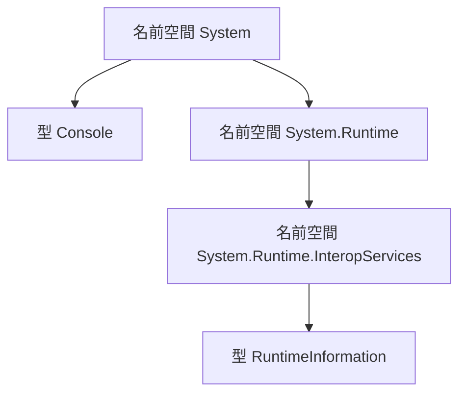

# 名前空間と using ディレクティブ（補足）

このページは、[最初のプログラムと変数](/unity-csharp-learning/csharp/variables/) の補足です。`Console` の正式な名前と、型をまとめる **名前空間**（namespace）を学びます。名前空間を省略して型を書けるようにする **using ディレクティブ**（using directive）と、`Console` を `using` なしで使えた理由も説明します。

## 学習目標

このページを読み終えると、以下のことができるようになります。

- 完全修飾名を、名前空間と型の名前に分けられる
- 名前空間にある型を、完全修飾名と `using` ディレクティブの 2 つの方法で使える
- `Console` を `using` なしで使える理由を、暗黙的な using ディレクティブで説明できる
- 名前空間を読み込んでも、その下の名前空間にある型は使えるようにならないことを説明できる

## 前提知識

- [最初のプログラムと変数](/unity-csharp-learning/csharp/variables/) を読んでいること

---

## 1. Console の正式な名前

.NET には、たくさんの型が用意されています。型の名前がぶつからないように、また探しやすいように、型は **名前空間** という入れ物に分けて整理されています。

`Console` は `System` という名前空間にある型です。名前空間を含めた正式な名前は `System.Console` で、次のように書いても同じように動きます。

```csharp
System.Console.WriteLine("こんにちは");
Console.WriteLine("こんにちは");
```

```
こんにちは
こんにちは
```

`System.Console` のように、名前空間まで含めて書いた型の名前を **完全修飾名**（fully qualified name）といいます。完全修飾名は、最後の `.` の前が名前空間、後ろが型の名前です。

名前空間は、`.` で区切って階層にできます。`System.Runtime.InteropServices` は、`System` の下の `Runtime` の、さらに下にある `InteropServices` という名前空間です。



---

## 2. using なしでは使えない型

`System.Runtime.InteropServices` 名前空間にある [RuntimeInformation クラス](https://learn.microsoft.com/dotnet/api/system.runtime.interopservices.runtimeinformation) は、プログラムを実行している .NET や OS の情報を返します。たとえば [RuntimeInformation.FrameworkDescription プロパティ](https://learn.microsoft.com/dotnet/api/system.runtime.interopservices.runtimeinformation.frameworkdescription) は、.NET のバージョンを表す文字列です。

`Console` と同じ書き方で使おうとすると、コンパイルエラーになります。

```csharp
// ❌ NG: RuntimeInformation という名前が見つからない
// Console.WriteLine(RuntimeInformation.FrameworkDescription);  // CS0103
```

CS0103 は「現在のコンテキストに 'RuntimeInformation' という名前は存在しません」というエラーです。コンパイラーは、`RuntimeInformation` がどの名前空間の型なのかを知りません。直し方は 2 つあります。

---

## 3. 完全修飾名で書く

1 つ目は、名前空間まで含めた完全修飾名で書く方法です。

```csharp
Console.WriteLine(System.Runtime.InteropServices.RuntimeInformation.FrameworkDescription);
```

実行結果の例です。表示されるバージョンは、インストールしている .NET によって変わります。

```
.NET 10.0.12
```

名前空間がわかれば、コンパイラーは型を見つけられます。ただし、使うたびに長い名前空間を書くことになります。

---

## 4. using ディレクティブで名前空間を読み込む

2 つ目は、ファイルの先頭に `using` ディレクティブを書く方法です。

**書式：[using ディレクティブ](https://learn.microsoft.com/dotnet/csharp/language-reference/keywords/using-directive)**
```
using 名前空間;
```

| 要素 | 説明 |
|---|---|
| `using` | 名前空間を読み込むことを表すキーワード |
| `名前空間` | 型の名前だけで書けるようにしたい名前空間 |

`using` ディレクティブを書くと、その名前空間にある型を、名前空間を省略して型の名前だけで書けます。

```csharp
using System.Runtime.InteropServices;

Console.WriteLine(RuntimeInformation.FrameworkDescription);
Console.WriteLine(RuntimeInformation.OSDescription);
```

実行結果の例です。.NET のバージョンと OS の名前は、実行する環境によって変わります。

```
.NET 10.0.12
Microsoft Windows 10.0.26200
```

[RuntimeInformation.OSDescription プロパティ](https://learn.microsoft.com/dotnet/api/system.runtime.interopservices.runtimeinformation.osdescription) は、OS の名前とバージョンを表す文字列です。同じ名前空間の型を何度も使うときは、完全修飾名で書くより `using` ディレクティブのほうが短く書けます。

> 💡 **ポイント**: `using` ディレクティブは、型を書けるようにするものではなく、名前空間を省略できるようにするものです。完全修飾名で書いたプログラムと、`using` ディレクティブで省略したプログラムは、同じ型を使う同じプログラムになります。

---

## 5. Console を using なしで使えた理由

`Console` も名前空間の `System` を省略して書いているので、本来は `using System;` が必要です。それでも書かずに使えたのは、`dotnet new console` で作ったプロジェクトでは、よく使う名前空間があらかじめ読み込まれているからです。これを **暗黙的な using ディレクティブ**（implicit using directives）といいます。

これは C# という言語の決まりではなく、プロジェクトの設定です。[.NET SDK と dotnet CLI](/unity-csharp-learning/csharp/dotnet-sdk/) で見た `.csproj` ファイルの `<ImplicitUsings>enable</ImplicitUsings>` が、この機能を有効にしています。コンソールアプリで読み込まれる名前空間は、次の 7 つです。

| 名前空間 | 主な型の例 |
|---|---|
| `System` | `Console`、`Math` |
| `System.Collections.Generic` | `List<T>`、`Dictionary<TKey, TValue>` |
| `System.IO` | `File`、`Path` |
| `System.Linq` | `Enumerable` |
| `System.Net.Http` | `HttpClient` |
| `System.Threading` | `Thread` |
| `System.Threading.Tasks` | `Task` |

表の型の多くは、この後のページで学びます。ここでは、`System.Runtime.InteropServices` が表にないことを確認してください。

### 下の階層の名前空間は読み込まれない

`System` は読み込まれているのに、`System.Runtime.InteropServices` の `RuntimeInformation` は使えませんでした。`using` ディレクティブで読み込まれるのは、指定した名前空間に直接ある型だけで、その下の階層の名前空間にある型は含まれないからです。

| 書いたもの | 型の名前だけで書けるもの | 書けないもの |
|---|---|---|
| `using System;` | `Console` など、`System` に直接ある型 | `RuntimeInformation` など、`System.Runtime.InteropServices` にある型 |
| `using System.Runtime.InteropServices;` | `RuntimeInformation` など、`System.Runtime.InteropServices` に直接ある型 | `Console` など、`System` にある型 |

名前が `System.` で始まっていても、`System.Runtime.InteropServices` は `System` とは別の名前空間です。使う型の名前空間を、それぞれ `using` で読み込みます。

> 💡 **型の名前空間の調べ方**: .NET の型の公式ドキュメントには、型の名前の近くに「名前空間:」として、その型の名前空間が書かれています。使いたい型が見つからないときは、名前空間を確認し、暗黙的に読み込まれる 7 つにない場合は `using` ディレクティブを書きます。

---

## よくあるミス

### using ディレクティブをステートメントの後に書く

```csharp
// ❌ NG: using ディレクティブはファイルの先頭に書く
// Console.WriteLine(RuntimeInformation.FrameworkDescription);
// using System.Runtime.InteropServices;  // CS1529
```

`using` ディレクティブは、ファイルの中で、ほかのステートメントより前に書く必要があります。後ろに書くと CS1529 のコンパイルエラーになります。

### using ディレクティブに型の名前まで書く

```csharp
// ❌ NG: using ディレクティブに書けるのは名前空間
// using System.Runtime.InteropServices.RuntimeInformation;  // CS0138
```

`System.Runtime.InteropServices.RuntimeInformation` は、名前空間ではなく型の完全修飾名です。`using` ディレクティブには、最後の `.` より前の名前空間の部分だけを書きます。

---

## ワンポイントアドバイス

### using 文との違い

C# には、`using` キーワードを使う **using 文**（using statement）もあります。using 文は、ファイルなどのリソースを使い終わったときに後片付けをする構文で、名前空間を読み込む `using` ディレクティブとは、同じキーワードを使っているだけの別の機能です。using 文は、[IDisposable と using](/unity-csharp-learning/csharp/dispose-using/) で学びます。

### 名前空間を自分で作る

このページでは、.NET が用意している名前空間を使いました。自分で作る型を名前空間に入れる方法や、すべてのファイルに効く `global using` は、[名前空間](/unity-csharp-learning/csharp/namespaces/) で学びます。

---

## まとめ

- 型は名前空間に分けて整理されている。`Console` の完全修飾名は `System.Console`
- 名前空間にある型は、完全修飾名で書くか、`using 名前空間;` を書いて型の名前だけで書く
- `using` ディレクティブは、ファイルの先頭に書く。書けるのは名前空間で、型の名前は書けない
- `Console` を `using` なしで使えたのは、プロジェクトの `ImplicitUsings` の設定で `System` などが暗黙的に読み込まれているから。言語の決まりではない
- `using` で読み込まれるのは、その名前空間に直接ある型だけ。下の階層の名前空間にある型は含まれない

---

## 理解度チェック

1. `System.Runtime.InteropServices.RuntimeInformation` のうち、名前空間はどの部分ですか？
2. `System` は暗黙的に読み込まれています。それでも、`using` ディレクティブを書かずに `RuntimeInformation` を使うとコンパイルエラーになるのはなぜですか？
3. [Encoding クラス](https://learn.microsoft.com/dotnet/api/system.text.encoding) は `System.Text` 名前空間にあります。次のコードはコンパイルエラーになります。2 通りの方法で直してください。

   ```csharp
   Console.WriteLine(Encoding.UTF8.GetByteCount("あいう"));
   ```

4. 次のコードを実行すると何が出力されますか？ `Path` クラスは `System.IO` 名前空間にあり、[Path.GetFileName メソッド](https://learn.microsoft.com/dotnet/api/system.io.path.getfilename) はパスからファイル名の部分を返します。

   ```csharp
   Console.WriteLine(Path.GetFileName("C:/data/save.txt"));
   ```

<details markdown="1">
<summary>解答を見る</summary>

1. `System.Runtime.InteropServices` です。最後の `.` の後ろの `RuntimeInformation` が型の名前です。
2. `RuntimeInformation` は `System` ではなく、`System.Runtime.InteropServices` 名前空間にあるからです。`System` を読み込んでも、その下の階層の名前空間にある型は使えるようになりません。
3. 完全修飾名で書く方法と、`using` ディレクティブを書く方法があります。どちらも `9` と表示されます。`GetByteCount` は、文字列を UTF-8 で表したときのバイト数を返します。

   ```csharp
   Console.WriteLine(System.Text.Encoding.UTF8.GetByteCount("あいう"));
   ```

   ```csharp
   using System.Text;

   Console.WriteLine(Encoding.UTF8.GetByteCount("あいう"));
   ```

4. `save.txt` と出力されます。`System.IO` は暗黙的に読み込まれる名前空間の 1 つなので、`using` ディレクティブを書かなくても `Path` を使えます。

</details>

---

## 次のステップ

[プリミティブ型と型変換](/unity-csharp-learning/csharp/primitive-types/) では、数値型の表現範囲、文字と文字列、型変換の規則を学びます。
