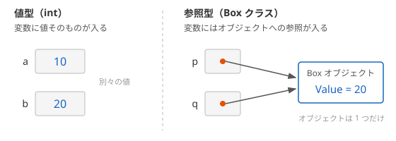
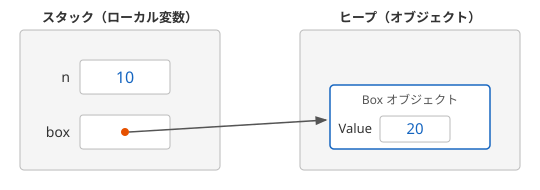

# 値型と参照型

C# の型は、**値型**（value type）と **参照型**（reference type）の 2 種類に分かれます。値型の変数には値そのものが入り、参照型の変数にはオブジェクトの場所を指す **参照** が入ります。この違いによって、代入やメソッドの呼び出しでコピーされるものが変わります。

## 学習目標

このページを読み終えると、以下のことができるようになります。

- 値型と参照型で、代入したときにコピーされるものの違いを説明できる
- 参照型の変数をメソッドに渡したとき、呼び出し元に影響する操作としない操作を区別できる
- `null` と既定値が、値型と参照型でどう違うかを説明できる
- `default` で既定値を書き、ジェネリックメソッドで型パラメータの既定値を返せる

## 前提知識

- [クラスとフィールド](/unity-csharp-learning/csharp/classes/) を読んでいること
- [Array クラスと配列の性質（補足）](/unity-csharp-learning/csharp/array-class/) を読んでいること
- [ref / out / in パラメータ](/unity-csharp-learning/csharp/ref-out-in/) を読んでいること
- [ジェネリックメソッド](/unity-csharp-learning/csharp/generic-methods/) を読んでいること

---

## 1. 値型と参照型

これまでに使ってきた型は、次のように分かれます。

| 種類 | 主な型 |
|---|---|
| [値型](https://learn.microsoft.com/dotnet/csharp/language-reference/builtin-types/value-types) | `int`・`double`・`bool`・`char` などの数値や文字の型、構造体、列挙型 |
| [参照型](https://learn.microsoft.com/dotnet/csharp/language-reference/keywords/reference-types) | クラス、配列、`string`、`object`、インターフェイス、デリゲート |

構造体と列挙型は、このセクションで学びます。自分で定義したクラスは参照型です。[クラスとフィールド](/unity-csharp-learning/csharp/classes/) や [Array クラスと配列の性質（補足）](/unity-csharp-learning/csharp/array-class/) で、クラスや配列を代入すると同じオブジェクトを指すようになることを学びました。これは、クラスや配列が参照型だからです。このページでは、値型と比べながら、その違いを整理します。

---

## 2. 代入でコピーされるもの

次のコードでは、`int` の変数と、自分で定義した `Box` クラスの変数を、それぞれ代入してから書き換えます。

```csharp
int a = 10;
int b = a;
b = 20;
Console.WriteLine($"a = {a}, b = {b}");

Box p = new Box();
p.Value = 10;
Box q = p;
q.Value = 20;
Console.WriteLine($"p.Value = {p.Value}, q.Value = {q.Value}");

class Box
{
    public int Value;
}
```

```
a = 10, b = 20
p.Value = 20, q.Value = 20
```

`int` は値型なので、`b = a` では値の `10` がコピーされます。`b` を書き換えても `a` は変わりません。

`Box` は参照型なので、`q = p` でコピーされるのは、オブジェクトへの参照です。`p` と `q` は同じ 1 つのオブジェクトを指しているので、`q.Value` を書き換えると、`p.Value` も変わったように見えます。



---

## 3. メソッドに渡したときの違い

[ref / out / in パラメータ](/unity-csharp-learning/csharp/ref-out-in/) で学んだように、`ref` などを付けないパラメータには、引数の値のコピーが渡されます（値渡し）。参照型の変数を渡したときにコピーされるのは、参照です。

```csharp
int n = 1;
Box box = new Box();
box.Value = 1;

Change(n, box);
Console.WriteLine($"n = {n}, box.Value = {box.Value}");

Replace(box);
Console.WriteLine($"box.Value = {box.Value}");

void Change(int x, Box b)
{
    x = 100;
    b.Value = 100;
}

void Replace(Box b)
{
    b = new Box();
    b.Value = 999;
}

class Box
{
    public int Value;
}
```

```
n = 1, box.Value = 100
box.Value = 100
```

`Change` の `x` は `n` の値のコピーなので、書き換えても `n` は変わりません。`b` は `box` の参照のコピーで、`box` と同じオブジェクトを指しています。そのため、`b.Value` の書き換えは、呼び出し元の `box` からも見えます。

`Replace` では、パラメータ `b` に新しいオブジェクトを代入しています。変わるのは `b` が指す先だけで、呼び出し元の `box` は元のオブジェクトを指したままです。呼び出し元の変数そのものを書き換えたいときは、参照型であっても `ref` を使います。

| 操作 | 値型のパラメータ | 参照型のパラメータ |
|---|---|---|
| パラメータに別の値やオブジェクトを代入する | 呼び出し元に影響しない | 呼び出し元に影響しない |
| パラメータが指すオブジェクトの中身を書き換える | （該当しない） | 呼び出し元からも見える |

---

## 4. == で比べるもの

[等値演算子 ==](https://learn.microsoft.com/dotnet/csharp/language-reference/operators/equality-operators) は、値型では値が等しいかを比べます。クラスでは、同じオブジェクトを指しているかを比べます。中身が同じでも、別々に作ったオブジェクトは等しくなりません。

```csharp
Box a = new Box();
a.Value = 1;
Box b = new Box();
b.Value = 1;
Box c = a;

Console.WriteLine(a == b);
Console.WriteLine(a == c);

class Box
{
    public int Value;
}
```

```
False
True
```

`string` は参照型ですが、`==` で中身の文字列を比べます。[演算子のオーバーロード](/unity-csharp-learning/csharp/operator-overloading/) で学んだように、`string` クラスが `==` を、文字列の中身を比べるように定義しているからです。同じオブジェクトかどうかは、[Object.ReferenceEquals メソッド](https://learn.microsoft.com/dotnet/api/system.object.referenceequals) で調べられます。

```csharp
string s1 = "aaa";
string s2 = new string('a', 3);

Console.WriteLine(s1 == s2);
Console.WriteLine(object.ReferenceEquals(s1, s2));
```

```
True
False
```

`new string('a', 3)` は、`'a'` を 3 つ並べた文字列を新しく作ります。`s1` と `s2` は別々のオブジェクトですが、中身が同じなので `==` は `True` になります。

---

## 5. null と既定値

参照型の変数には、どのオブジェクトも指していないことを表す **null** を入れられます。値型の変数には `null` を入れられません。

```csharp
// ❌ NG: 値型の変数に null は入れられない
// int n = null;  // CS0037
```

`null` が入った変数からメンバーを使うと、`NullReferenceException` が発生します。

> 💡 **ポイント**: このサイトのコード例では、参照型の変数に `null` を入れるとき、`Box?` のように型名の後に `?` を付けます。`?` のない参照型の変数に `null` を入れると、コンパイラーが警告を出す設定になっているからです。`?` の意味は [null 許容参照型](/unity-csharp-learning/csharp/nullable-reference-types/) で説明します。

フィールドや配列の要素は、値を代入しなくても **既定値** で初期化されます。既定値は、[default 演算子](https://learn.microsoft.com/dotnet/csharp/language-reference/operators/default) で調べられます。

**書式：[default 演算子](https://learn.microsoft.com/dotnet/csharp/language-reference/operators/default#default-operator)**
```
default(型)
```

```csharp
Console.WriteLine(default(int));
Console.WriteLine(default(bool));
Console.WriteLine(default(Box) == null);

Box?[] boxes = new Box?[2];
Console.WriteLine(boxes[0] == null);

class Box
{
}
```

```
0
False
True
True
```

値型の既定値は、`0` や `false` のように、すべてのビットが 0 の値です。参照型の既定値は `null` です。`Box` の配列を作っただけでは、要素は `null` で、`Box` のオブジェクトはまだ 1 つもありません。

### 型を省略した default

C# 7.1 以降では、型を省略して `default` だけを書けます。これを **default リテラル** といいます。型は、代入先の変数の型や、渡す先のパラメータの型から決まります。

**書式：[default リテラル](https://learn.microsoft.com/dotnet/csharp/language-reference/operators/default#default-literal)**
```
default
```

```csharp
int count = default;
string? name = default;
Console.WriteLine(count);
Console.WriteLine(name == null);

Print(default);
Console.WriteLine(GetScore());
Show();
Show(5);

void Print(int n)
{
    Console.WriteLine($"Print: {n}");
}

int GetScore()
{
    return default;
}

void Show(int n = default)
{
    Console.WriteLine($"Show: {n}");
}
```

```
0
True
Print: 0
0
Show: 0
Show: 5
```

| 書いた場所 | 型を決めるもの |
|---|---|
| `int count = default;` | 変数の型 `int` |
| `Print(default)` | `Print` のパラメータの型 `int` |
| `return default;` | `GetScore` の戻り値の型 `int` |
| `int n = default`（[省略可能パラメータ](/unity-csharp-learning/csharp/optional-named-params/) の既定値） | パラメータの型 `int` |

省略可能パラメータの既定値には、定数しか書けません。`default` は書けるので、構造体のパラメータを省略可能にしたいときに使います。

型を決めるものがない場所では、`default` だけは書けません。

```csharp
// ❌ NG: var では、default の型が決まらない
// var x = default;  // CS8716
```

### ジェネリクスと default(T)

`default` が特に役に立つのは、[ジェネリックメソッド](/unity-csharp-learning/csharp/generic-methods/) の中です。配列の指定した位置の要素を返し、位置が範囲外なら「値がない」ことを表す値を返すメソッドを考えます。型パラメータ `T` が何の型になるかは、呼び出す側が決めます。そのため、`T` の値として `null` や `0` を書くことはできません。

```csharp
// ❌ NG: T が int のような値型なら、null は入れられない
// T Get<T>()
// {
//     return null;  // CS0403
// }

// ❌ NG: T が string なら、0 は入れられない
// T Get<T>()
// {
//     return 0;  // CS0029
// }
```

`default(T)`、または型を省略した `default` なら、`T` がどの型でも、その型の既定値になります。CS0403 のエラーメッセージも、`default(T)` を使うよう勧めています。

```csharp
int[] numbers = { 10, 20, 30 };
string[] names = { "Alice", "Bob" };

Console.WriteLine(GetOrDefault(numbers, 1));
Console.WriteLine(GetOrDefault(numbers, 5));
Console.WriteLine(GetOrDefault(names, 0));
Console.WriteLine(GetOrDefault(names, 5) == null);

T? GetOrDefault<T>(T[] array, int index)
{
    if (index < 0 || index >= array.Length)
    {
        return default;
    }
    return array[index];
}
```

```
20
0
Alice
True
```

範囲外の位置を指定すると、`T` が `int` のときは `0`、`string` のときは `null` が返っています。

戻り値の型を `T?` にしているのは、`T` が `string` のような参照型のとき、`null` を返すことがあるからです。`T` のままにすると、コンパイラーが警告 CS8603 を出します（この `?` の意味は [null 許容参照型](/unity-csharp-learning/csharp/nullable-reference-types/) で説明します）。制約のない型パラメータに付けた `?` は、`T` が値型のときには何も変えません。`T` が `int` なら戻り値の型は `int` のままなので、範囲外のときは `null` ではなく `0` が返ります。

`Dictionary<TKey, TValue>` の `TryGetValue` が、キーが見つからないときに `out` パラメータに入れる「`TValue` の既定値」も、`default(TValue)` と同じ値です。

---

## 6. スタックとヒープ

プログラムが使うメモリには、**スタック** と **ヒープ** という 2 つの領域があります。

- **スタック**：メソッドのローカル変数やパラメータが置かれる領域。[再帰関数とコールスタック](/unity-csharp-learning/csharp/recursion/) で学んだように、メソッドを呼び出すと積まれ、メソッドから戻ると取り除かれる
- **ヒープ**：`new` で作ったオブジェクトが置かれる領域。メソッドから戻っても、オブジェクトは残る

次のコードで、変数とオブジェクトがどこに置かれるかを見てみましょう。

```csharp
int n = 10;
Box box = new Box();
box.Value = 20;
Console.WriteLine($"n = {n}, box.Value = {box.Value}");

class Box
{
    public int Value;
}
```

```
n = 10, box.Value = 20
```



ローカル変数 `n` と `box` はスタックに置かれます。`n` には値の `10` がそのまま入っています。`box` に入っているのは参照で、`Box` のオブジェクトそのものはヒープにあります。

「値型はスタックに置かれる」という説明を見かけることがありますが、正確ではありません。`Value` は `int` 型（値型）のフィールドですが、`Box` オブジェクトの一部なので、ヒープに置かれています。値型の値は、**その変数やフィールドがある場所に直接入る**、と覚えておきましょう。ローカル変数ならスタックに、クラスのフィールドならヒープのオブジェクトの中に入ります。

ヒープに作られたオブジェクトは、使い終わっても自分で消す必要はありません。どこからも使われなくなったオブジェクトは、.NET が自動的に片付けます。この仕組みは、次のページで学びます。

---

## よくあるミス

### オブジェクトをコピーしたつもりで、同じオブジェクトを書き換える

```csharp
Box original = new Box();
original.Value = 1;

Box copy = original;
copy.Value = 2;

Console.WriteLine(original.Value);

class Box
{
    public int Value;
}
```

```
2
```

`copy = original` でコピーされるのは参照だけで、オブジェクトは 1 つのままです。別のオブジェクトとして扱いたいときは、`new` で新しいオブジェクトを作り、フィールドの値を移します。

---

## まとめ

- 値型の変数には値そのものが、参照型の変数にはオブジェクトへの参照が入る
- 代入や値渡しでコピーされるのは、値型では値、参照型では参照。参照をコピーした変数どうしは、同じオブジェクトを指す
- クラスの `==` は同じオブジェクトかどうかを比べる。`string` は中身を比べるように定義されている
- 参照型の変数には `null` を入れられるが、値型の変数には入れられない。既定値は、値型ではすべてのビットが 0 の値、参照型では `null`
- `default(型)` で既定値を書ける。型が決まる場所では、型を省略して `default` だけを書ける（default リテラル）
- ジェネリックメソッドでは、`T` がどの型でも、`default` でその型の既定値を返せる
- 値型の値は、変数やフィールドがある場所に直接入る。`new` で作ったオブジェクトはヒープに置かれる

---

## 理解度チェック

1. 値型と参照型の変数で、代入したときにコピーされるものの違いを説明してください。
2. 次のコードを実行すると何が出力されますか？

   ```csharp
   int x = 5;
   Box a = new Box();
   a.Value = 5;

   Update(x, a);
   Console.WriteLine($"{x}, {a.Value}");

   void Update(int n, Box b)
   {
       n++;
       b.Value++;
       b = new Box();
       b.Value = 100;
   }

   class Box
   {
       public int Value;
   }
   ```

3. 「値型の値は必ずスタックに置かれる」という説明が正確でない理由を説明してください。
4. 次のコードを実行すると何が出力されますか？

   ```csharp
   Console.WriteLine(First(new double[0]));
   Console.WriteLine(First(new bool[] { true }));
   Console.WriteLine(First(new string[0]) == null);

   T? First<T>(T[] array)
   {
       if (array.Length == 0)
       {
           return default;
       }
       return array[0];
   }
   ```

<details markdown="1">
<summary>解答を見る</summary>

1. 値型では値そのものがコピーされ、コピー先を書き換えてもコピー元は変わりません。参照型ではオブジェクトへの参照がコピーされ、コピー元とコピー先は同じオブジェクトを指します。
2. `5, 6` が出力されます。`n` は `x` のコピーなので `x` は変わりません。`b.Value++` は `a` と同じオブジェクトを書き換えるので `a.Value` は `6` になります。その後の `b = new Box()` は `b` が指す先を変えるだけで、`a` には影響しません。
3. クラスのフィールドにある値型の値は、オブジェクトの一部としてヒープに置かれるからです。値型の値は、変数やフィールドがある場所に直接入ります。
4. 次のように出力されます。要素のない `double` の配列では `double` の既定値 `0`、要素のある `bool` の配列では最初の要素 `true`、要素のない `string` の配列では `string` の既定値 `null` が返ります。

   ```
   0
   True
   True
   ```

</details>

---

## 次のステップ

[ガベージコレクション](/unity-csharp-learning/csharp/garbage-collection/) では、使われなくなったオブジェクトを .NET が自動的に片付ける仕組みを学びます。
