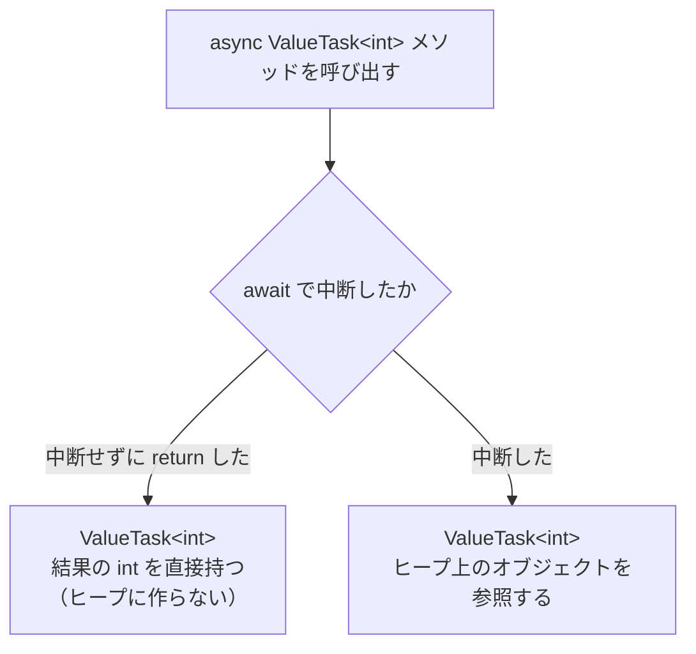

# ValueTask

`Task<TResult>` はクラスなので、async メソッドを呼び出すたびに、ヒープに `Task<TResult>` オブジェクトが作られます。結果がすぐにわかり、`await` で中断しないときでも同じです。**ValueTask\<TResult\>** は、結果がすぐにわかるときにはヒープにオブジェクトを作らずに済む、構造体の `Task` です。このページでは、`ValueTask<TResult>` が解決するパフォーマンスの問題と、使うときの制約を学びます。

## 学習目標

このページを読み終えると、以下のことができるようになります。

- async メソッドが、中断しないときでも `Task<TResult>` オブジェクトを作ることを説明できる
- `ValueTask<TResult>` を返す async メソッドを定義し、ヒープへの割り当てが減ることを確かめられる
- `ValueTask<TResult>` は 1 回だけ `await` する、という制約を説明できる
- `Task<TResult>` と `ValueTask<TResult>` を使い分けられる

## 前提知識

- [キャンセル](/unity-csharp-learning/csharp/task-cancellation/) までの非同期処理のページを読んでいること
- [ガベージコレクション](/unity-csharp-learning/csharp/garbage-collection/) を読んでいること
- [構造体](/unity-csharp-learning/csharp/structs/) と [ボクシングとアンボクシング](/unity-csharp-learning/csharp/boxing/) を読んでいること

---

## 1. async メソッドは Task オブジェクトを作る

async メソッドの戻り値の `Task<TResult>` はクラスです。そのため、async メソッドを呼び出すと、ふつうは結果を入れるための `Task<TResult>` オブジェクトがヒープに作られます。

このことは、async メソッドが `await` で一度も中断せずに `return` したときも変わりません。たとえば、一度求めた値を覚えておき（**キャッシュ**）、2 回目からは覚えた値をすぐに返す async メソッドを考えます。

```csharp
public async Task<int> GetTaskAsync(int key)
{
    if (values.TryGetValue(key, out int value))
    {
        return value;  // キャッシュにあれば、await せずにすぐ返す
    }
    await Task.Delay(100);  // 時間のかかる処理の代わり
    values[key] = key * 100;
    return key * 100;
}
```

2 回目からは `await` に到達しないので、処理は呼び出したスレッドで最後まで進み、結果もすぐにわかります。それでも戻り値は `Task<int>` なので、結果の `int` を `Task<int>` オブジェクトに入れて返さなければなりません。呼び出すたびにヒープにオブジェクトが作られ、[ガベージコレクション](/unity-csharp-learning/csharp/garbage-collection/) で回収されるものが増えます。

---

## 2. ValueTask\<TResult\>

[ValueTask\<TResult\> 構造体](https://learn.microsoft.com/dotnet/api/system.threading.tasks.valuetask-1) は、`await` できる構造体です。async メソッドの戻り値の型として、`Task<TResult>` の代わりに使えます。

**書式：[ValueTask\<TResult\> 構造体](https://learn.microsoft.com/dotnet/api/system.threading.tasks.valuetask-1)**
```
async ValueTask<TResult> メソッド名(パラメータ)
{
    // await を使う処理
    return TResult型の値;
}
```

`ValueTask<TResult>` は、次のどちらかを持ちます。

| async メソッドの終わり方 | `ValueTask<TResult>` が持つもの |
|---|---|
| `await` で中断せずに `return` した | 結果の値そのもの。ヒープにオブジェクトを作らない |
| `await` で中断した | 結果をあとで受け取るための、ヒープ上のオブジェクトへの参照 |



`ValueTask<TResult>` は構造体なので、[値型と参照型](/unity-csharp-learning/csharp/value-reference-types/) で学んだように、変数に値そのものが入り、ヒープにオブジェクトは作られません。中断せずに終わる場合は、結果の値を `ValueTask<TResult>` に入れて返すだけで済みます。

### ヒープに確保されるメモリを比べる

キャッシュから値を返す async メソッドを、`Task<int>` 版と `ValueTask<int>` 版で 1000 回ずつ呼び出し、ヒープに確保されたメモリの量を比べます。[ボクシングとアンボクシング](/unity-csharp-learning/csharp/boxing/) と同じように、[GC.GetAllocatedBytesForCurrentThread メソッド](https://learn.microsoft.com/dotnet/api/system.gc.getallocatedbytesforcurrentthread) を使います。キャッシュには、[インデクサ](/unity-csharp-learning/csharp/indexers/) で紹介した [Dictionary\<TKey, TValue\>](https://learn.microsoft.com/dotnet/api/system.collections.generic.dictionary-2) を使います。[TryGetValue メソッド](https://learn.microsoft.com/dotnet/api/system.collections.generic.dictionary-2.trygetvalue) は、キーが見つかれば `true` を返し、値を `out` パラメータで返します。

このコードは、リリースビルドで実行します。ファイルベース実行では、`dotnet run -c Release Program.cs` のように `-c Release` を付けます。理由は、このページの「よくあるミス」で説明します。

```csharp
ValueCache cache = new ValueCache();
await cache.GetTaskAsync(1);
await cache.GetValueTaskAsync(1);

long before = GC.GetAllocatedBytesForCurrentThread();
for (int i = 0; i < 1000; i++)
{
    await cache.GetTaskAsync(1);
}
long after = GC.GetAllocatedBytesForCurrentThread();
Console.WriteLine($"Task<int>: {after - before} バイト");

before = GC.GetAllocatedBytesForCurrentThread();
for (int i = 0; i < 1000; i++)
{
    await cache.GetValueTaskAsync(1);
}
after = GC.GetAllocatedBytesForCurrentThread();
Console.WriteLine($"ValueTask<int>: {after - before} バイト");

class ValueCache
{
    private readonly Dictionary<int, int> values = new Dictionary<int, int>();

    public async Task<int> GetTaskAsync(int key)
    {
        if (values.TryGetValue(key, out int value))
        {
            return value;
        }
        await Task.Delay(100);
        values[key] = key * 100;
        return key * 100;
    }

    public async ValueTask<int> GetValueTaskAsync(int key)
    {
        if (values.TryGetValue(key, out int value))
        {
            return value;
        }
        await Task.Delay(100);
        values[key] = key * 100;
        return key * 100;
    }
}
```

64 ビットの環境で、リリースビルドで実行した結果の例です。バイト数は実行環境によって変わることがあります。

```
Task<int>: 72000 バイト
ValueTask<int>: 0 バイト
```

最初の 2 行の `await` で、キー `1` の値をキャッシュに入れています。そのため、ループの中の呼び出しはどれも `await Task.Delay(100)` に到達せず、すぐに `return` します。

`Task<int>` 版は、呼び出すたびに 72 バイトの `Task<int>` オブジェクトを作っています。`ValueTask<int>` 版は、結果の `int` を `ValueTask<int>` に入れて返すだけなので、ヒープにメモリを確保していません。

中断した場合は、`ValueTask<TResult>` でもヒープにオブジェクトが作られます。`ValueTask<TResult>` が効果を発揮するのは、この例のキャッシュのように、中断せずに終わる呼び出しが多いメソッドです。

---

## 3. ValueTask の制約

`ValueTask<TResult>` は、ヒープへの割り当てを減らすために、`Task<TResult>` にはない制約を持っています。`ValueTask<TResult>` が参照するオブジェクトは、使い終わると別の呼び出しに使い回されることがあるからです。そのため、`ValueTask<TResult>` は次のように扱います。

- `await` は 1 回だけにする。同じ `ValueTask<TResult>` を 2 回 `await` しない
- 複数の場所から同時に `await` しない
- 完了していない `ValueTask<TResult>` の `Result` を読まない

`ValueTask<TResult>` を変数に入れておいて何度も使う必要がないなら、`await GetValueTaskAsync(1)` のように、呼び出してすぐに `await` するのが安全です。

### AsTask で Task に変換する

何度も `await` したいときや、`Task.WhenAll` に渡したいときは、[AsTask メソッド](https://learn.microsoft.com/dotnet/api/system.threading.tasks.valuetask-1.astask) で `Task<TResult>` に変換します。変換した `Task<TResult>` には、`ValueTask<TResult>` の制約はありません。

```csharp
ValueTask<int> a = GetAsync(1);
ValueTask<int> b = GetAsync(2);
int[] results = await Task.WhenAll(a.AsTask(), b.AsTask());
Console.WriteLine(string.Join(", ", results));

async ValueTask<int> GetAsync(int value)
{
    await Task.Delay(100);
    return value * 10;
}
```

```
10, 20
```

`AsTask` を呼んだあとは、元の `ValueTask<TResult>` は使わず、変換した `Task<TResult>` だけを使います。

---

## 4. Task と ValueTask の使い分け

| | `Task<TResult>` | `ValueTask<TResult>` |
|---|---|---|
| 種類 | クラス | 構造体 |
| 中断せずに終わったとき | ヒープにオブジェクトを作る | ヒープにオブジェクトを作らない |
| `await` できる回数 | 何回でも | 1 回だけ |
| `Task.WhenAll` などに渡す | そのまま渡せる | `AsTask` で変換する |

ふつうは `Task<TResult>` を使います。制約がなく、どのように使われても正しく動くからです。`ValueTask<TResult>` を選ぶのは、次の両方に当てはまるときです。

- 何度も繰り返し呼び出され、ヒープへの割り当てが性能に影響する
- 中断せずに結果を返す呼び出しが多い

値を返さない async メソッドには、`Task` に対応する [ValueTask 構造体](https://learn.microsoft.com/dotnet/api/system.threading.tasks.valuetask) があります。

.NET のライブラリでも、頻繁に呼ばれ、中断せずに終わることの多いメソッドは `ValueTask` を返します。この後のページで学ぶ、非同期に要素を 1 つずつ受け取るための `MoveNextAsync` や、非同期にリソースを解放する `DisposeAsync` がその例です。

---

## よくあるミス

### 同じ ValueTask を 2 回 await する

`ValueTask<TResult>` を 2 回 `await` しても、たまたま正しく動くことがあります。しかし、`ValueTask<TResult>` が参照するオブジェクトが使い回される場合は、2 回目の `await` で例外が発生したり、別の呼び出しの結果を受け取ったりします。

次のコードでは、[AsyncMethodBuilder 属性](https://learn.microsoft.com/dotnet/api/system.runtime.compilerservices.asyncmethodbuilderattribute) に [PoolingAsyncValueTaskMethodBuilder\<TResult\>](https://learn.microsoft.com/dotnet/api/system.runtime.compilerservices.poolingasyncvaluetaskmethodbuilder-1) を指定して、async メソッドが中断したときに作るオブジェクトを、使い終わったら使い回すようにしています。

```csharp
using System.Runtime.CompilerServices;

ValueTask<int> task = GetAsync();
Console.WriteLine(await task);
try
{
    Console.WriteLine(await task);  // ❌ NG: 2 回目の await
}
catch (InvalidOperationException e)
{
    Console.WriteLine($"{e.GetType().Name}");
}

[AsyncMethodBuilder(typeof(PoolingAsyncValueTaskMethodBuilder<>))]
async ValueTask<int> GetAsync()
{
    await Task.Delay(100);
    return 42;
}
```

```
42
InvalidOperationException
```

1 回目の `await` が終わった時点で、`task` が参照していたオブジェクトは使い回しのために返されています。そのため、2 回目の `await` では `InvalidOperationException` が投げられます。どのようなオブジェクトを参照しているかは `ValueTask<TResult>` の外からはわからないので、いつも 1 回だけ `await` するようにします。

### デバッグビルドで割り当てを測る

2 節のコードを、`-c Release` を付けずに（デバッグビルドで）実行すると、次のように `ValueTask<int>` 版でもメモリが確保されます。

```
Task<int>: 128000 バイト
ValueTask<int>: 64000 バイト
```

[async と await](/unity-csharp-learning/csharp/async-await/) で学んだように、コンパイラーは async メソッドをステートマシンに置き換えます。リリースビルドでは、このステートマシンは構造体として作られ、中断したときだけヒープに移されます。一方、デバッグビルドでは、デバッグしやすさのために、ステートマシンがクラスとして作られるので、呼び出すたびにヒープにオブジェクトが作られます。性能を測るときは、リリースビルドで実行します。

---

## ワンポイントアドバイス

### よく使われる Task は使い回される

`Task<int>` を返す async メソッドでも、`return` する値によってはオブジェクトが作られないことがあります。.NET は、完了済みの `Task<bool>` の `true` と `false` や、`-1` から `8` までの小さな `int` を結果とする `Task<int>` などをあらかじめ用意しておき、使い回しているからです。2 節で `return` する値を `100` にしたのは、この使い回しの対象にならないようにするためです。どの値が使い回されるかは .NET の実装によって決まり、バージョンによって変わることがあります。

---

## まとめ

- `Task<TResult>` はクラスなので、async メソッドは、中断せずに終わったときでも `Task<TResult>` オブジェクトを作る
- `ValueTask<TResult>` は構造体で、中断せずに終わったときは結果の値を直接持つので、ヒープにオブジェクトを作らない
- `ValueTask<TResult>` は 1 回だけ `await` する。何度も使うときや `Task.WhenAll` に渡すときは `AsTask` で変換する
- ふつうは `Task<TResult>` を使い、頻繁に呼ばれて中断せずに終わることの多いメソッドにだけ `ValueTask<TResult>` を使う
- 値を返さない async メソッドには `ValueTask` を使える
- ヒープへの割り当ては、リリースビルドで測る

---

## 理解度チェック

1. キャッシュから値を返すことが多い async メソッドの戻り値を、`Task<int>` から `ValueTask<int>` に変えると、ヒープへの割り当てが減るのはなぜですか？
2. 次のコードを実行すると何が出力されますか？

   ```csharp
   ValueTask<int> task = GetAsync(3);
   Console.WriteLine(task.IsCompleted);
   Console.WriteLine(await task);

   async ValueTask<int> GetAsync(int value)
   {
       if (value > 0)
       {
           return value * 2;
       }
       await Task.Delay(100);
       return 0;
   }
   ```

3. `ValueTask<int>` を返すメソッドを 2 つ呼び出し、`Task.WhenAll` でまとめて待ちたいとき、どう書けばよいですか？

<details markdown="1">
<summary>解答を見る</summary>

1. `Task<int>` はクラスなので、中断せずに終わったときでも、結果を入れる `Task<int>` オブジェクトがヒープに作られます。`ValueTask<int>` は構造体なので、中断せずに終わったときは結果の `int` を直接持ち、ヒープにオブジェクトを作らないからです。
2. 次のように出力されます。`value` が `3` なので `await` に到達せずに `return` し、`task` は呼び出した時点で完了しています。

   ```
   True
   6
   ```

3. `AsTask` で `Task<int>` に変換してから渡します。

   ```csharp
   int[] results = await Task.WhenAll(GetAsync(1).AsTask(), GetAsync(2).AsTask());
   ```

</details>

---

## 次のステップ

[IAsyncEnumerable と await foreach](/unity-csharp-learning/csharp/async-streams/) では、要素を 1 つずつ非同期に受け取りながら処理する方法を学びます。
