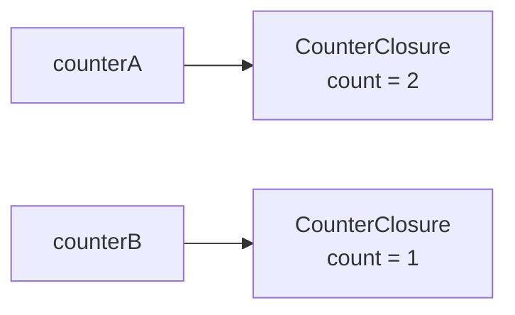

# 変数キャプチャ

ラムダ式は、自分が定義されたスコープの変数を「取り込んで」使えます。この動作を**変数キャプチャ**（またはクロージャ）と呼びます。便利な反面、ループ内で使うときにはまりやすい落とし穴があります。

## 学習目標

このページを読み終えると、以下のことができるようになります。

- ラムダ式が外側スコープの変数を参照できることを説明できる
- キャプチャは値のコピーではなく、変数そのものの共有であることを理解できる
- キャプチャした変数が、コンパイラーの作るオブジェクトのフィールドになることを説明できる
- `for` ループ内のキャプチャの罠とその回避方法を書ける
- `static` ラムダで意図しないキャプチャを禁止できる

## 前提知識

- [ラムダ式](/unity-csharp-learning/csharp/lambda/) を読んでいること

---

## 1. 変数キャプチャとは

通常のメソッドは、自分のパラメータとローカル変数しか使えません。ラムダ式は、それに加えて**定義された時点で見えていた外側の変数**もそのまま使えます。

```csharp
string greeting = "こんにちは";

Action<string> greet = name => Console.WriteLine($"{greeting}、{name}！");

greet("Alice");

greeting = "おはよう";     // 外側の変数を変更
greet("Bob");              // ラムダ式は変更後の値を参照する
```

```
こんにちは、Alice！
おはよう、Bob！
```

`greeting` はラムダ式の外で定義されていますが、ラムダ式の中から参照できています。また、`greeting` を書き換えた後に `greet("Bob")` を呼ぶと、更新後の値 `"おはよう"` が使われます。これはラムダ式がコピーではなく**変数そのもの**を保持しているためです。

---

## 2. キャプチャは値のコピーではなく変数の共有

```csharp
int count = 0;

Action increment = () => count++;

increment();
increment();
increment();

Console.WriteLine(count);   // 外側の count が変更されている
```

```
3
```

`count++` はラムダ式の外の `count` を直接インクリメントしています。ラムダ式が `count` をコピーしているのではなく、**元の変数を共有している**ことがわかります。

---

## 3. キャプチャの仕組み

ローカル変数は、ふつうはメソッドの実行が終わると使えなくなります。ところが、キャプチャした変数は、メソッドが終わったあとも生き続けます。次の `MakeCounter` は、ローカル変数 `count` をキャプチャしたラムダ式を返します。

```csharp
Func<int> counterA = MakeCounter();
Func<int> counterB = MakeCounter();

Console.WriteLine(counterA());
Console.WriteLine(counterA());
Console.WriteLine(counterB());

Func<int> MakeCounter()
{
    int count = 0;
    return () => ++count;
}
```

```
1
2
1
```

`MakeCounter` の実行は `return` で終わっていますが、`counterA()` を呼ぶたびに `count` が `1`、`2` と増えています。また、`counterB` は `counterA` とは別の `count` を数えています。

これは、コンパイラーがキャプチャを次のように書き換えているからです。

- キャプチャされた変数（`count`）を、コンパイラーが作る見えないクラスのフィールドに移す
- ラムダ式の本体を、そのクラスのメソッドにする
- `MakeCounter` を呼ぶたびに、そのクラスのオブジェクトを `new` し、そのオブジェクトのメソッドを指すデリゲートを返す

書き換えた結果を、自分でクラスを書いて再現すると次のようになります（コンパイラーが実際に付ける名前は異なります）。

```csharp
Func<int> counterA = MakeCounter();
Func<int> counterB = MakeCounter();

Console.WriteLine(counterA());
Console.WriteLine(counterA());
Console.WriteLine(counterB());

Func<int> MakeCounter()
{
    var closure = new CounterClosure();   // count を入れるオブジェクトを作る
    closure.count = 0;
    return closure.Next;                  // そのオブジェクトの Next を指すデリゲート
}

class CounterClosure
{
    public int count;

    public int Next() => ++count;
}
```

```
1
2
1
```

`closure.Next` のように、オブジェクトのメソッド（インスタンスメソッド）をデリゲートに代入すると、デリゲートは「どのメソッドか」に加えて「どのオブジェクトのメソッドか」も覚えます。そのため、`counterA` と `counterB` は、それぞれ別の `CounterClosure` オブジェクトの `count` を増やします。



キャプチャした変数は、このオブジェクトのフィールドとしてヒープに置かれます。デリゲートがオブジェクトを参照している間は、[ガベージコレクション](/unity-csharp-learning/csharp/garbage-collection/) に回収されないため、メソッドが終わったあとも使い続けられます。1 節や 2 節で、外側の変数の変更がラムダ式に伝わったのも、外側のコードとラムダ式が、同じオブジェクトの同じフィールドを使っているからです。

---

## 4. `for` ループ内のキャプチャの罠

ループ変数をキャプチャするときに、意図しない動作になりやすい罠があります。

```csharp
var actions = new List<Action>();

for (int i = 0; i < 3; i++)
{
    actions.Add(() => Console.WriteLine(i));
}

foreach (var action in actions)
{
    action();
}
```

```
3
3
3
```

ループが完了すると `i` の値は `3` になっています。3 つのラムダ式がすべて**同じ変数 `i`** を参照しているため、呼び出し時点の値（`3`）が表示されます。`for` の `int i` はループ全体で 1 つしかないので、`i` を入れるオブジェクトも 1 つだけ作られ、3 つのデリゲートがそれを共有します。

ループごとに値を固定するには、ループ内に新しい変数を作ってキャプチャします。

```csharp
var actions = new List<Action>();

for (int i = 0; i < 3; i++)
{
    int captured = i;   // ループ毎に新しい変数を作る
    actions.Add(() => Console.WriteLine(captured));
}

foreach (var action in actions)
{
    action();
}
```

```
0
1
2
```

`captured` はループの本体で宣言しているので、各イテレーションで新しく生成されます。キャプチャのためのオブジェクトもイテレーションごとに作られ、3 つのデリゲートはそれぞれ別の `captured` を持ちます。

> 💡 **ポイント**: `foreach` のループ変数は C# 5 以降、各イテレーションで新しい変数として扱われるためこの問題は起きません。`for` ループの `int i` に注意してください。

---

## 5. `static` ラムダ

3 節で見たように、変数をキャプチャすると、その変数を入れるオブジェクトが作られ、ラムダ式と外側のコードがその変数を共有します。外側の変数を使うつもりがなかったのに、うっかり使ってしまうと、気づかないうちにオブジェクトが作られたり、変数の変更がラムダ式に伝わったりします。

C# 9 から、ラムダ式に `static` を付けると外側の変数や `this` をキャプチャしようとしたときに**コンパイルエラー**にできます。キャプチャしないことがコンパイル時に保証されるので、キャプチャのためのオブジェクトは作られず、外側の変数の変更に影響されることもありません。必要な値は、パラメータで受け取ります。

**書式：[static ラムダ](https://learn.microsoft.com/dotnet/csharp/language-reference/operators/lambda-expressions#capture-of-outer-variables-and-variable-scope-in-lambda-expressions)**
```
static (パラメータ) => 式
```

| 要素 | 説明 |
|---|---|
| `static` | キャプチャを禁止するキーワード |

```csharp
int multiplier = 3;

// ❌ NG: static ラムダで外側の変数をキャプチャしようとするとコンパイルエラー
// Func<int, int> badLambda = static x => x * multiplier;   // CS8820

// ✅ OK: パラメータだけを使う
Func<int, int, int> multiply = static (x, factor) => x * factor;

Console.WriteLine(multiply(5, multiplier));
```

```
15
```

---

## よくあるミス

```csharp
// ❌ NG: for ループ変数を直接キャプチャすると、全ラムダが同じ変数を参照する
for (int i = 0; i < 3; i++)
{
    actions.Add(() => Console.WriteLine(i));   // 全部 3 になる
}

// ✅ OK: ループ内で新しい変数にコピーしてキャプチャする
for (int i = 0; i < 3; i++)
{
    int captured = i;
    actions.Add(() => Console.WriteLine(captured));   // 0, 1, 2 になる
}
```

---

## まとめ

- ラムダ式は外側スコープの変数をキャプチャして使える（クロージャ）
- キャプチャは値のコピーではなく変数の共有のため、元の変数の変化がラムダ式に反映される
- キャプチャした変数は、コンパイラーが作るクラスのフィールドに移され、メソッドが終わったあともデリゲートから使い続けられる
- `for` ループのループ変数を直接キャプチャすると全ラムダが最終値を参照する罠がある
- ループ内で新しい変数を作ってキャプチャすると、各イテレーションの値を固定できる
- `static` ラムダ（C# 9）でキャプチャを禁止すると、意図しないキャプチャをコンパイル時に検出でき、キャプチャのためのオブジェクトも作られない

---

## 理解度チェック

以下の問いに答えられるか確認しましょう。

1. ラムダ式は、外側の変数の値をコピーしますか、それとも変数そのものを共有しますか？それによって何が起きますか？
2. 次のコードの出力結果は何になりますか？

   ```csharp
   var actions = new List<Action>();

   for (int i = 0; i < 4; i++)
   {
       int n = i * 2;
       actions.Add(() => Console.WriteLine(n));
   }

   foreach (var a in actions) a();
   ```

3. （応用）上記コードで `int n = i * 2;` の行を削除し、代わりに `() => Console.WriteLine(i * 2)` と書いた場合、出力結果はどう変わりますか？理由も答えてください。

<details markdown="1">
<summary>解答を見る</summary>

1. 変数そのものを共有します。キャプチャした変数が後から書き換えられると、ラムダ式が次に呼ばれたときに新しい値が使われます。

2. ```
   0
   2
   4
   6
   ```

   各イテレーションで `n` という新しい変数が作られるため、それぞれ `0, 2, 4, 6` がキャプチャされます。

3. 全て `8` が出力されます（`i` の最終値 `4` に対し `4 * 2 = 8`）。ループ終了後に `i` は `4` になっており、4 つのラムダが同じ `i` を参照しているためです。

</details>

---

## 次のステップ

[ローカル関数](/unity-csharp-learning/csharp/local-functions/) では、メソッドの内側に定義できるメソッドと、ラムダ式との使い分けを学びます。
