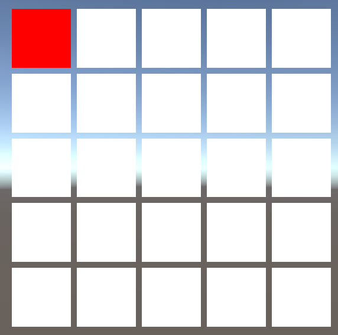
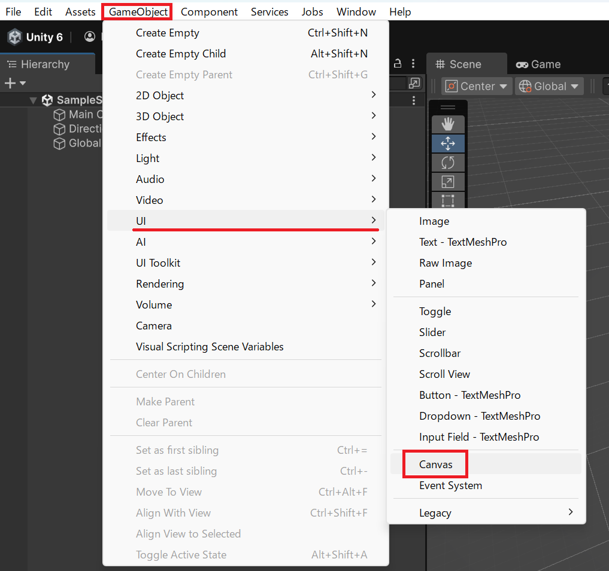
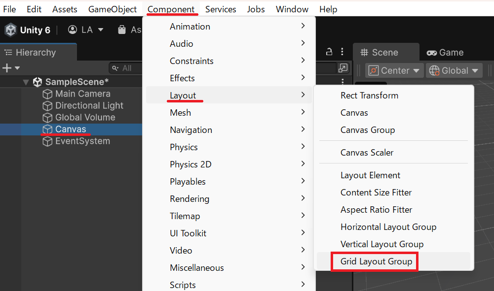
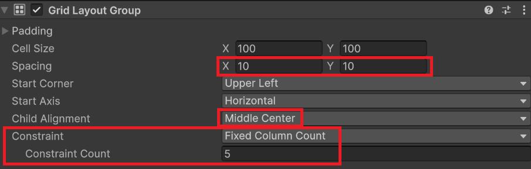
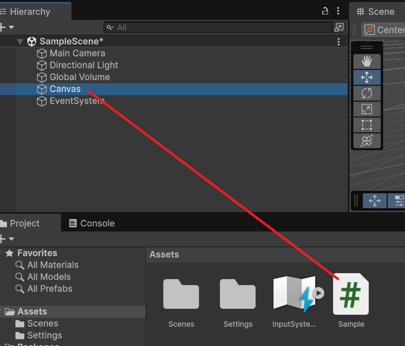
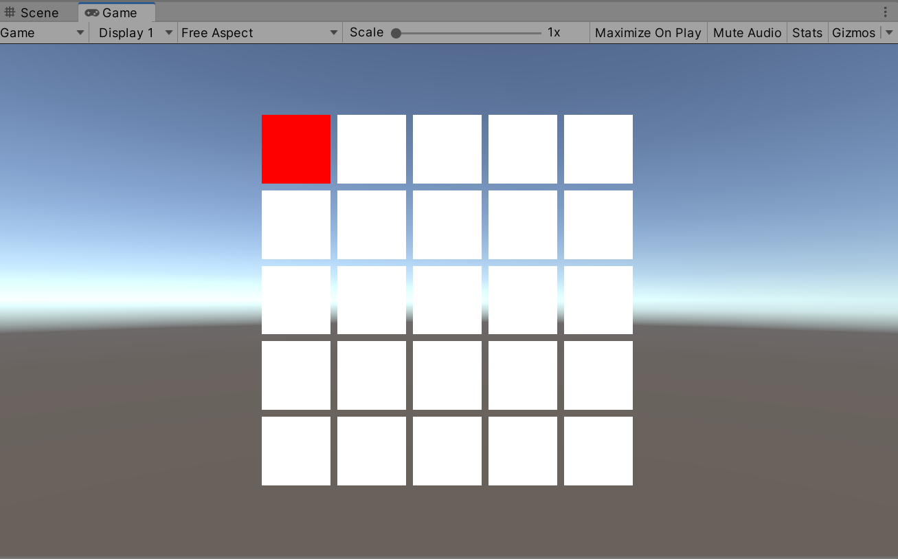
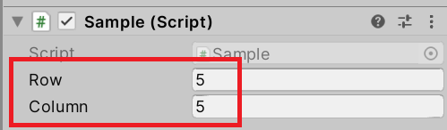

## 概要

このチュートリアルでは、C# における二次元配列（2D配列）の基本を学びます。
一次元配列では「横一列のデータ」を扱いましたが、二次元配列では「行と列を持つ表（グリッド）」としてデータを管理できます。

ゲーム開発では、盤面（マインスイーパーやオセロ）、タイルマップ、格子状 UI の管理などで頻繁に登場します。

### 学習目標

- 二次元配列の概念（行と列）を理解する
- 二次元配列の宣言と初期化方法を習得する
- `配列[row, col]` で要素にアクセスできるようになる
- 入れ子の `for` 文で全要素を走査できるようになる
- `GetLength()` メソッドを使って安全にループを書けるようになる

### 前提知識

- 一次元配列の基礎（添字、`Length`、`for` / `foreach`）を理解している
- Unity の `Debug.Log` でログを確認できる

## 1. 二次元配列とは

二次元配列は、要素が「行（row）」と「列（col）」の 2 つの番号で管理される配列です。

例えば、3 行 × 4 列の表を考えると、次のようなイメージになります。

| 行/列 | 0  | 1  | 2  | 3  |
| --- | --- | --- | --- | --- |
| 0 | 10 | 11 | 12 | 13 |
| 1 | 20 | 21 | 22 | 23 |
| 2 | 30 | 31 | 32 | 33 |

この場合、左上の `10` は `(row=0, col=0)`、右下の `33` は `(row=2, col=3)` です。

一次元配列は `配列[index]` でしたが、二次元配列は `配列[row, col]` でアクセスします。

## 2. 二次元配列の宣言と初期化

### 2-1. 宣言方法

二次元配列は `[,]` を使って宣言します。

```csharp
型[,] 配列名;
```

例：

```csharp
int[,] grid;        // int の二次元配列
string[,] names;    // string の二次元配列
```

#### 補足：多次元（n次元）配列について

C# では、二次元だけではなく 三次元以上の多次元配列も同じルールで作れます。
このチュートリアルでは二次元配列に集中しますが、`[,]` が `[, ,]` や `[, , ,]` に増えるだけだと考えてください。

例：

```csharp
// 三次元配列（x, y, z）
int[,,] space = new int[2, 3, 4];

// アクセスも同じ
space[0, 0, 0] = 1;
int value = space[0, 0, 0];
```

### 2-2. サイズを指定して初期化

一次元配列と同じように `new` を使って配列インスタンスを生成します。

```csharp
型[,] 配列名 = new 型[行数, 列数];
```

例：

```csharp
int[,] grid = new int[3, 4];  // 3行4列の二次元配列
```

この時点では、各要素は型の初期値で埋まります。また、一次元配列と同様に、二次元配列も作成後にサイズを変更できません（行数・列数は固定です）。

- 数値型（int, float など）: `0`
- bool型: `false`
- 参照型（string, オブジェクトなど）: `null`

### 2-3. 初期値が決まっている場合：二次元配列の初期化子

格納する値が初期化の時点で決まっているなら、初期化子でまとめて書けます。

```csharp
int[,] grid =
{
    { 10, 11, 12, 13 },
    { 20, 21, 22, 23 },
    { 30, 31, 32, 33 },
};
```

行ごとに `{ ... }` を並べるイメージです。

## 3. 二次元配列の要素へのアクセス

### 3-1. 添字（インデックス）は 0 から始まる

二次元配列でも、行と列の添字はどちらも `0` から始まります。

- 行の有効範囲: `0` から `行数 - 1`
- 列の有効範囲: `0` から `列数 - 1`

### 3-2. アクセス方法

```csharp
// 要素の取得
変数 = 配列名[row, col];

// 要素の設定
配列名[row, col] = 値;
```

例：

```csharp
int[,] grid = new int[3, 4];

grid[0, 0] = 10;
grid[0, 1] = 11;

grid[2, 3] = 33;

int value = grid[2, 3];
```

## 4. 配列の長さと次元数

二次元配列をループで走査するときは、

- 要素数の総数
- 次元数
- 各次元（行・列など）の要素数

を正しく取得できることが重要です。

### 4-1. Length プロパティ（要素数の総数）

二次元配列の `Length` プロパティは「要素の総数（行数 × 列数）」です。

宣言：

```csharp
public int Length { get; }
```

例：

```csharp
int[,] grid = new int[3, 4];
Debug.Log(grid.Length);  // 12
```

### 4-2. Rank プロパティ（次元数）

`Rank` プロパティは配列の次元数を返します。

宣言：

```csharp
public int Rank { get; }
```

例：

```csharp
int[,] grid2D = new int[3, 4];
Debug.Log(grid2D.Rank);  // 2

int[,,] grid3D = new int[2, 3, 4];
Debug.Log(grid3D.Rank);  // 3
```

### 4-3. GetLength メソッド（各次元の要素数）

各次元の要素数は `GetLength()` メソッドで取得できます。

宣言：

```csharp
public int GetLength(int dimension)
```

- dimension: 次元番号
- 戻り値: 指定した次元の要素数

```csharp
配列名.GetLength(次元番号)
```

次元番号は `0` から始まります。

指定できる範囲は `0` から `Rank - 1` までです。

- 二次元配列の場合
    - `GetLength(0)`: 行数
    - `GetLength(1)`: 列数

例：

```csharp
int[,] grid = new int[3, 4];

int rows = grid.GetLength(0);  // 3
int cols = grid.GetLength(1);  // 4

Debug.Log("rows = " + rows);
Debug.Log("cols = " + cols);
```

この `GetLength()` メソッドを使うと、配列のサイズが変わっても安全にループを書けます。

## 5. 二次元配列のループ処理

二次元配列は「行」と「列」を両方走査する必要があるため、入れ子の `for` 文を使うことが多いです。

### 5-1. 入れ子の `for` で全要素を走査

```csharp
int[,] grid =
{
    { 10, 11, 12, 13 },
    { 20, 21, 22, 23 },
    { 30, 31, 32, 33 },
};

for (int row = 0; row < grid.GetLength(0); row++)
{
    for (int col = 0; col < grid.GetLength(1); col++)
    {
        Debug.Log("grid[" + row + ", " + col + "] = " + grid[row, col]);
    }
}
```

## 6. 実際に動作確認してみましょう

このセクションでは、二次元配列を「盤面データ」として扱い、全要素をログに出して確認します。

### 6-1. `Sample` スクリプトの作成

1. Unity の Project ウィンドウで `Sample.cs` を作成してください
2. 空の GameObject を作成し、`Sample` をアタッチしてください
3. 再生して Console ウィンドウを確認してください

### 6-2. サンプルコード

```csharp
using System.Text;
using UnityEngine;

public class Sample : MonoBehaviour
{
    private void Start()
    {
        // 3行4列の盤面データを作る
        int[,] board = new int[3, 4];

        // 行と列を走査しながら、わかりやすい値を入れる
        for (int row = 0; row < board.GetLength(0); row++)
        {
            for (int col = 0; col < board.GetLength(1); col++)
            {
                // 例: 10,11,12,13 / 20,21,22,23 / 30,31,32,33
                board[row, col] = (row + 1) * 10 + col;
            }
        }

        // 盤面をログに整形して表示する
        Debug.Log(FormatBoard(board));

        // 特定のマス（row=2, col=3）にアクセスしてみる
        int value = board[2, 3];
        Debug.Log("board[2, 3] = " + value);
    }

    private string FormatBoard(int[,] board)
    {
        StringBuilder sb = new StringBuilder();

        sb.AppendLine("=== board ===");

        for (int row = 0; row < board.GetLength(0); row++)
        {
            for (int col = 0; col < board.GetLength(1); col++)
            {
                sb.Append(board[row, col]);

                // 列の区切り
                if (col < board.GetLength(1) - 1)
                {
                    sb.Append(", ");
                }
            }

            // 行の終わりで改行
            sb.AppendLine();
        }

        return sb.ToString();
    }
}
```

### 確認ポイント

- `board[row, col]` で要素にアクセスできている
- `GetLength(0)` と `GetLength(1)` を使って安全にループできている
- 行と列の両方が 0 から始まっている

## 7. よくある間違い

- 行数と列数を間違える
  - `new int[行, 列]` の順番を固定で覚えてください
- `Length` で行数を回そうとしてしまう
    - 二次元配列は `GetLength()` メソッドを使う方が安全です
- 境界チェックを忘れる
  - 隣接マス（上下左右）を調べるときは、範囲外を必ず防いでください

## まとめ

このチュートリアルでは、二次元配列の基本を学びました。

### 学んだ内容

- 二次元配列は `配列[row, col]` でアクセスする
- 行数・列数は `GetLength()` メソッドで取得する
- 走査は入れ子の `for` 文が基本になる

### 次のステップ

二次元配列が理解できたら、次は「盤面を使ったゲーム」に進むと学びが定着します。

- 二次元配列で盤面管理するミニゲーム（マインスイーパー、三目並べ、ライツアウトなど）
- 周囲探索（上下左右、8方向）と境界チェック
- ジャグ配列（`型[][]`）との違いの理解

---

## 課題: 項目選択

### 概要

複数のセルを格子状に並べ、そのうちの1つが常に選択状態になっているものとします。上下左右キーで選択状態を移動できるようにしましょう。



この課題は「小課題 項目選択1」の続きです。わからない場合は「[配列の基礎](/unity-csharp-learning/grid-games/array-basics/)」を先に攻略してください。

### Unity 側の準備

新規シーンの状態から UI の Canvas ゲームオブジェクトを作成します。



作成した Canvas ゲームオブジェクトに Grid Layout Group コンポーネントを追加します。



追加した Grid Layout Group コンポーネントの Spacing の X と Y の値を 10 に、Child Alignment の設定を Middle Center に変更します。

グリッド上に並べるセルの行数または列数を Constraint の設定で固定化できます。例えば Constraint の設定を Fixed Column Count に変更して、下部の Constraint Count を 5 にすると列数が 5 列に固定されます。

この設定は課題に応じて、スクリプトから変更しても構いません。



新規に C# スクリプトを作成し、Canvas ゲームオブジェクトに設定します。



### スクリプト

Canvas ゲームオブジェクトに設定した C# スクリプトで、選択対象のセルを生成するところまでを記述します。

この場では、セルとして UI の Image コンポーネントを使って、色を設定します。

```csharp
using UnityEngine;
using UnityEngine.InputSystem;
using UnityEngine.UI;

public class Sample : MonoBehaviour
{
    private void Start()
    {
        for (var r = 0; r < 5; r++)
        {
            for (var c = 0; c < 5; c++)
            {
                var obj = new GameObject($"Cell({r}, {c})");
                obj.transform.parent = transform;

                var image = obj.AddComponent<Image>();
                if (r == 0 && c == 0) { image.color = Color.red; }
                else { image.color = Color.white; }
            }
        }
    }

    private void Update()
    {
		var keyboard = Keyboard.current;
		if (keyboard == null) { return; } // 入力デバイスがない場合は処理しない
		
        if (keyboard.leftArrowKey.wasPressedThisFrame) // 左キーを押した
        {

        }
        if (keyboard.rightArrowKey.wasPressedThisFrame) // 右キーを押した
        {

        }
        if (keyboard.upArrowKey.wasPressedThisFrame) // 上キーを押した
        {

        }
        if (keyboard.downArrowKey.wasPressedThisFrame) // 下キーを押した
        {

        }
    }
}
```



実行結果

### 課題

#### 課題1

上下左右のキーを押したら選択状態のセルが指定の方向のセルに移動するように仕組みましょう。

右キーを押した場合、現在選択されているセル（赤いセル）が白になり、その１つ右にあるセルが選択状態になり赤くなるようにします。

左キーが押された場合、現在選択されているセル（赤いセル）が白になり、その１つ左にあるセルが選択状態になり赤くなるようにします。

上キーを押した場合、現在選択されているセル（赤いセル）が白になり、その１つ上にあるセルが選択状態になり赤くなるようにします。

下キーが押された場合、現在選択されているセル（赤いセル）が白になり、その１つ下にあるセルが選択状態になり赤くなるようにします。

キーの入力した方向にセルがない場合、無視するか、もしくは反対方向のセルが選択されるようにしてください。このとき、エラーが発生しないように注意してください。

#### 課題2

`SerializeField` を使って行数と列数を Inspector ビューから設定できるようにし、実行時に生成されるセルの数を変更できるようにしてください。

```csharp
[SerializeField]
private int _rows = 5;

[SerializeField]
private int _columns = 5;
```



セル数が変わってもレイアウトや動作に問題がないようにしましょう。

#### 課題3

Space キーを押すと、選択中のセルが消えるようにしてください。ユーザー視点でセルが消えたように見えれば実装方法は自由としますが、レイアウトが崩れないように注意してください。

選択中のセルが削除された時、削除したセルから最も近いセルに選択状態が切り替わるようにしてください。距離が同じセルが複数ある場合、どのセルが選択されてもよいものとします。

削除したセルが最後のセルの場合、選択状態を表すセル自体が存在しないので何もする必要はありません。エラーが出ないように注意してください。
