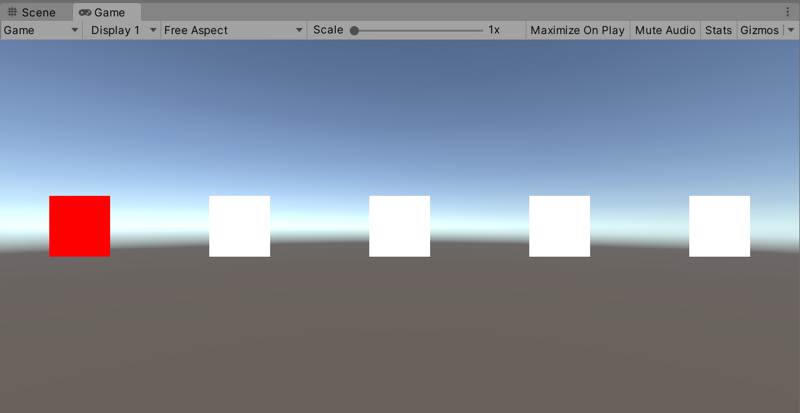
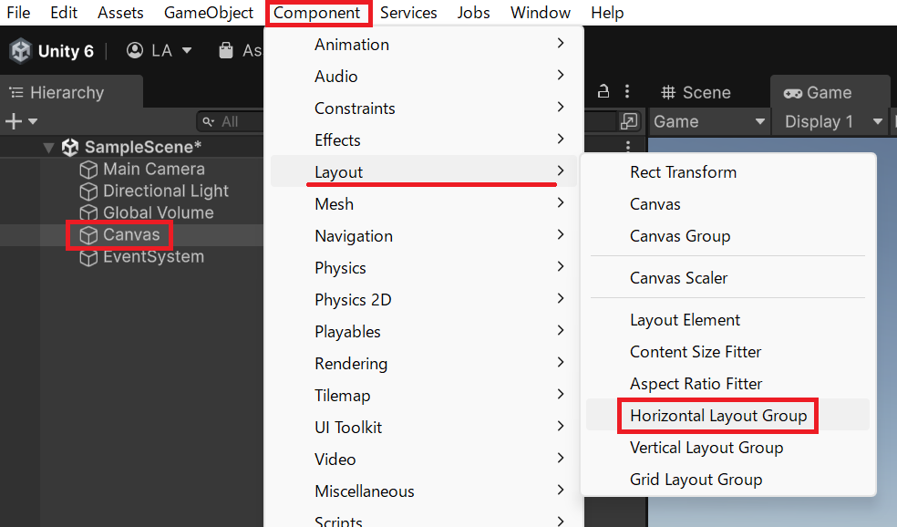
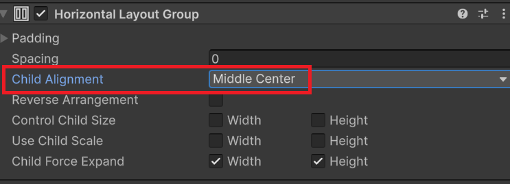
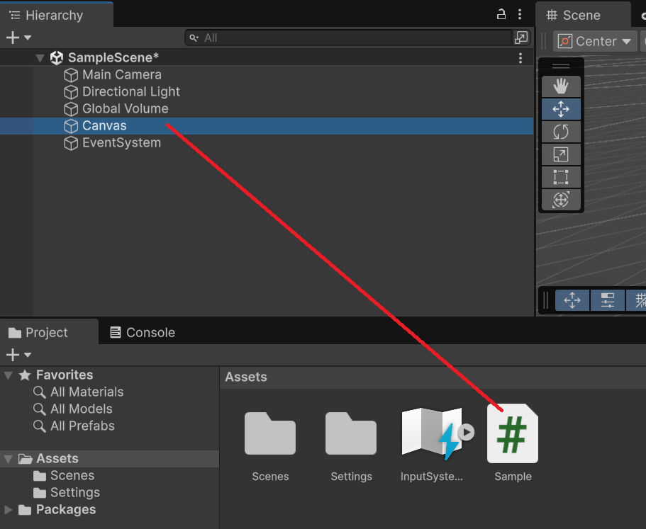
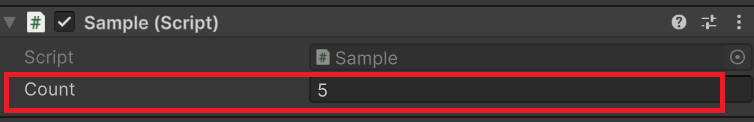

# 配列の基礎

## 概要

配列は同じ型の複数のデータを 1 つの変数でまとめて管理できる仕組みです。C# の文法（宣言・インデックスアクセス・Length・ループ）は以下のページで詳しく解説しています。

- [配列の基礎（C# 基礎）](/unity-csharp-learning/csharp/arrays/) — 宣言・初期化・インデックス・Length・for ループ・IndexOutOfRangeException
- [配列と foreach（補足）](/unity-csharp-learning/csharp/arrays-and-foreach/) — foreach の書式・var 推論・for との使い分け

### 学習目標

- Unity の型（`GameObject`・`Transform`・`Sprite`・`Vector3` など）を配列で扱える
- `[SerializeField]` を使って Inspector から配列を設定できる
- スポーン管理・パトロール・Sprite 切り替えの実践パターンを実装できる

## 1. Unity の型と配列

C# のプリミティブ型（`int`・`float`・`string` など）と同様に、Unity の型もそのまま配列にできます。

```csharp
GameObject[] _enemies;        // 複数のゲームオブジェクト
Transform[] _spawnPoints;     // スポーンポイント（位置と向き）
Sprite[] _itemIcons;          // UI に表示する画像
Vector3[] _waypoints;         // 移動経路の座標リスト
AudioClip[] _soundEffects;    // 効果音
```

> **注意:** 参照型（`GameObject`・`Sprite` など）の配列要素は初期値が `null` です。`Instantiate()` などで値を設定するまで使えません。値型（`int`・`float`・`Vector3` など）の要素は型のデフォルト値（`0` や `Vector3.zero`）で初期化されます。

```csharp
GameObject[] _enemies = new GameObject[3];
// _enemies[0]・_enemies[1]・_enemies[2] はすべて null
```

### 動作確認：Cube を生成して回転させる

`GameObject[]` に Cube を格納し、`Update()` でまとめて回転させるサンプルです。配列を使うことで、複数のオブジェクトをループ 1 本で操作できます。

```csharp
using UnityEngine;

public class CubeArray : MonoBehaviour
{
    private GameObject[] _cubes;

    private void Start()
    {
        _cubes = new GameObject[5];

        for (int i = 0; i < _cubes.Length; i++)
        {
            _cubes[i] = GameObject.CreatePrimitive(PrimitiveType.Cube);
            _cubes[i].transform.position = new Vector3(i * 2f, 0f, 0f);
        }
    }

    private void Update()
    {
        foreach (GameObject cube in _cubes)
        {
            cube.transform.Rotate(0f, 90f * Time.deltaTime, 0f);
        }
    }
}
```

`Start()` で 5 つの Cube を生成し、配列に格納します。`Update()` では `foreach` で全要素を順に取り出し、Y 軸回転を適用します。Cube の数を `5` から変えてもコードの残りはそのままで動作します。

## 2. Inspector で配列を管理する

`[SerializeField]` を使うと、Inspector 上で配列の要素数を設定し、ドラッグ&ドロップで値を登録できます。

```csharp
using UnityEngine;

public class EnemyManager : MonoBehaviour
{
    [SerializeField] private GameObject[] _enemyPrefabs;

    private void Start()
    {
        for (int i = 0; i < _enemyPrefabs.Length; i++)
        {
            Debug.Log($"敵プレハブ[{i}]: {_enemyPrefabs[i].name}");
        }
    }
}
```

### Inspector での設定手順

1. スクリプトをゲームオブジェクトにアタッチする
2. Inspector の `Enemy Prefabs` フィールドを展開し、`Size` で要素数を指定する
3. 各スロットにプレハブやシーンオブジェクトをドラッグ&ドロップする

スクリプトを書き直さずにゲームバランスや配置を調整できるのが Inspector 連携の利点です。

## 3. 実践パターン A：スポーンポイント管理（Transform[]）

複数のスポーン位置を `Transform[]` で管理し、ランダムな位置に敵を出現させるパターンです。シーン上に空の GameObject を複数配置して `_spawnPoints` に登録します。

```csharp
using UnityEngine;

public class SpawnManager : MonoBehaviour
{
    [SerializeField] private Transform[] _spawnPoints;
    [SerializeField] private GameObject _enemyPrefab;

    private void Start()
    {
        SpawnAtRandom();
    }

    // ランダムな 1 か所にスポーン
    private void SpawnAtRandom()
    {
        if (_spawnPoints.Length == 0) { return; }

        int index = Random.Range(0, _spawnPoints.Length);
        Transform spawnPoint = _spawnPoints[index];
        Instantiate(_enemyPrefab, spawnPoint.position, spawnPoint.rotation);
    }

    // 全スポーンポイントにスポーン
    private void SpawnAtAll()
    {
        foreach (Transform spawnPoint in _spawnPoints)
        {
            Instantiate(_enemyPrefab, spawnPoint.position, spawnPoint.rotation);
        }
    }
}
```

`Transform` を使うと位置（`position`）と向き（`rotation`）をまとめて扱えます。スポーン位置をシーン上のオブジェクトとして視覚的に確認・調整できます。

## 4. 実践パターン B：ウェイポイントパトロール（Vector3[]）

あらかじめ定めた経路を巡回するパトロールパターンです。経路点を `Vector3[]` で管理します。

```csharp
using UnityEngine;

public class PatrolEnemy : MonoBehaviour
{
    [SerializeField] private Vector3[] _waypoints;
    [SerializeField] private float _speed = 3f;

    private int _currentIndex;

    private void Update()
    {
        if (_waypoints.Length == 0) { return; }

        Vector3 target = _waypoints[_currentIndex];
        transform.position = Vector3.MoveTowards(transform.position, target, _speed * Time.deltaTime);

        if (Vector3.Distance(transform.position, target) < 0.1f)
        {
            // 次の経路点へ（末尾に達したら最初に戻る）
            _currentIndex = (_currentIndex + 1) % _waypoints.Length;
        }
    }
}
```

`% _waypoints.Length`（剰余演算子）を使うと、末尾に達したとき自動的に `0` に戻ります。これは配列を循環させる定番のテクニックです。

> **補足:** 経路点をシーン上で視覚的に配置したい場合は `Transform[]` を使い、各要素の `.position` で座標を取得する方法もあります。

## 5. 実践パターン C：Sprite 切り替え（Sprite[]）

HP の段階に応じて表示する Sprite を切り替えるパターンです。段階ごとに用意した Sprite を `Sprite[]` で管理します。

```csharp
using UnityEngine;

public class HPDisplay : MonoBehaviour
{
    [SerializeField] private Sprite[] _hpSprites;  // index 0 = HP 空、末尾 = HP 満タン
    [SerializeField] private SpriteRenderer _spriteRenderer;

    private int _currentHp;

    private void Start()
    {
        _currentHp = _hpSprites.Length - 1;
        UpdateSprite();
    }

    public void TakeDamage(int amount)
    {
        _currentHp = Mathf.Max(0, _currentHp - amount);
        UpdateSprite();
    }

    private void UpdateSprite()
    {
        if (_hpSprites.Length == 0) { return; }

        _spriteRenderer.sprite = _hpSprites[_currentHp];
    }
}
```

`_hpSprites[0]` が HP 空（ダメージ最大）、`_hpSprites[末尾]` が HP 満タンの Sprite です。`Mathf.Max(0, ...)` で HP が 0 未満にならないよう保護しているため、インデックスが範囲外になりません。

## まとめ

- Unity の型（`GameObject`・`Transform`・`Sprite`・`Vector3` など）もそのまま配列にできる
- `[SerializeField] private 型[] _名前;` で Inspector から要素を設定できる
- 参照型の配列要素は初期値が `null` — 使用前に必ず設定すること
- スポーン管理：`Transform[]` で位置と向きをまとめて管理
- パトロール経路：`Vector3[]` と剰余演算子で循環
- 画像切り替え：`Sprite[]` のインデックスと HP を対応させる

---

## 課題: 項目選択

### 概要

複数のセルを直列に並べ、そのうちの1つが常に選択状態になっているものとします。左右キーで選択状態を移動できるようにしましょう。



### Unity側の準備

新規シーンの状態から UI の Canvas ゲームオブジェクトを作成します。


作成した Canvas ゲームオブジェクトに Horizontal Layout Group コンポーネントを追加します。



追加した Horizontal Layout Group コンポーネントの Child Alignment の設定を Middle Center に変更します。



新規に C# スクリプトを作成し、Canvas ゲームオブジェクトに設定します。



### スクリプト

Canvas ゲームオブジェクトに設定した C# スクリプトで、選択対象のセルを生成するところまでを記述します。

この場では、セルとして UI の `Image` コンポーネントを使って、色を設定します。

```csharp
using UnityEngine;
using UnityEngine.InputSystem;
using UnityEngine.UI;

public class Sample : MonoBehaviour
{
    private void Start()
    {
        for (var i = 0; i < 5; i++)
        {
            var obj = new GameObject($"Cell{i}");
            obj.transform.SetParent(transform, false);

            var image = obj.AddComponent<Image>();
            if (i == 0) { image.color = Color.red; }
            else { image.color = Color.white; }
        }
    }

    private void Update()
    {
	    
		var keyboard = Keyboard.current;
		if (keyboard == null) { return; } // 入力デバイスがない場合は処理しない
		
		if (keyboard.leftArrowKey.wasPressedThisFrame) // 左キーを押した
		{

		}
		if (keyboard.rightArrowKey.wasPressedThisFrame) // 右キーを押した
		{

		}
    }
}
```


実行結果

### 課題

#### 課題1

左右のキーを押したら選択状態のセルが指定の方向のセルに移動するように仕組みましょう。

右キーを押した場合、現在選択されているセル（赤いセル）が白になり、その１つ右にあるセルが選択状態になり赤くなるようにします。

左キーが押された場合、現在選択されているセル（赤いセル）が白になり、その１つ左にあるセルが選択状態になり赤くなるようにします。

キーの入力した方向にセルがない場合、無視するか、もしくは反対方向のセルが選択されるようにしてください。このとき、エラーが発生しないように注意してください。

#### 課題2

`SerializeField` を使ってセル数を Inspector ビューから設定できるようにし、実行時に生成されるセルの数を変更できるようにしてください。

```csharp
[SerializeField]
private int _count = 5;
```



セル数が変わっても動作に問題がないようにしましょう。

#### 課題3

Space キーを押すと、選択中のセルが消えるようにしてください。ユーザー視点でセルが消えたように見えれば実装方法は自由としますが、レイアウトが崩れないように注意してください。

削除されたセルを選択することはできません。

選択中のセルが削除された時、削除されたセルから最も近い右方向にある有効なセルを選択してください。右方向にセルが存在しない場合、削除されたセルから最も近い左方向にある有効なセルを選択してください。

削除したセルが最後のセルの場合、選択状態を表すセル自体が存在しないので何もする必要はありません。エラーが出ないように注意してください。
