# ライフゲーム

## 学習目標
- 2次元配列で格子状データを表現できるようになる
- 内部データと表示されている見た目を分離して実装できるようになる
- 連続で更新されるデータを正しく取り扱えるようになる

## 前提知識
- [マインスイーパー](/unity-csharp-learning/grid-games/minesweeper/) を完了していること
- Unity の Prefab・Canvas・GridLayoutGroup の基本操作を理解していること

## 概要

このチュートリアルでは「ライフゲーム」の実装を目指します。ライフゲームとは、格子状に並べられたセルが、定められたルールで世代ごとに入れ替わるシミュレーション処理です。基本的なルールは Wikipedia に記載されている「[ライフゲーム](https://ja.wikipedia.org/wiki/%E3%83%A9%E3%82%A4%E3%83%95%E3%82%B2%E3%83%BC%E3%83%A0)」に従うものとします。

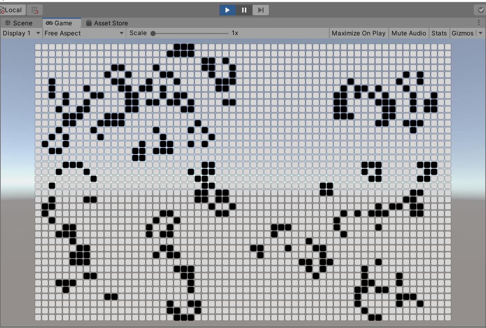

このチュートリアルを通して、以下の機能を学習します。

- 2次元配列による格子状に並べられたデーターの表現
- 内部データと表示されている見た目の分離
- 連続で更新されるデータの取り扱い

本稿はマインスイーパー を履修済みであることを前提としています。セルを準備する手順は、ほぼマインスイーパーと同様です。

# セルを定義する

最初にゲームを構成する要素を分解し、部品単位で実装できるように設計しましょう。

ライフゲームは格子状に並べられたマス目が「生きている」または「死んでいる」状態を持ちます。このチュートリアルでは、マス目上に並べられる矩形をセル（Cell）と呼ぶことにします。

## セルの状態

ライフゲームのセルは「生きている」または「死んでいる」状態しかありません。

生きている状態を「生存」、死んでいる状態を「死滅」と呼ぶことにします。

これらの状態をデータとして表現するなら true または false の2値でも表現可能ですが、より明確に状態を表現できるように、セルの状態を表すデータを `CellState` 列挙型として以下のように定義します。

```csharp
public enum CellState
{
    Dead,
    Alive,
}
```

Dead が死滅、Alive が生存していることを表します。これらが、画面上に表示される個々のセルが持つ状態となります。

## セルとなるゲームオブジェクトを作る

次に、前述した `CellState` 列挙型に対応した見た目となるゲームオブジェクト、つまりセルを作りましょう。セルは原型を作ってから、プレハブにして再利用します。

まず Unity 上部メニューバーから「GameObject」→「UI」→「Image」メニュー項目を選択します。


Image ゲームオブジェクトが追加されるので、ゲームオブジェクトの名前を "Cell" に変更してください。


次にセルのサイズを調整します。最終的な親オブジェクトのサイズに追従するようにしますが、まずはセルのレイアウト確認のためにサイズを固定しましょう。

Cell ゲームオブジェクトを選択している状態で Inspector ビューの 「Rect Transform」コンポーネントの設定を変更します。「Pos X」と「Pos Y」の値を 0 に、「Width」と「Height」の値を 50 に設定してください。アンカーは既定値の中心に合わせます。

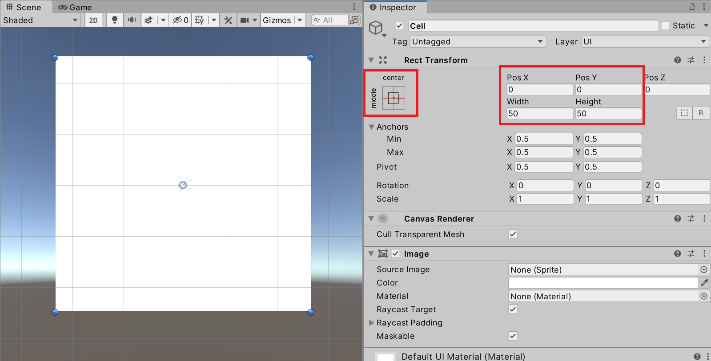

次にセルの背景画像を設定しましょう。任意の背景画像を設定してかまいませんが、特になければ Unity UI が使っている既定の画像を設定しましょう。この場では「InputFieldBackground」を流用します。


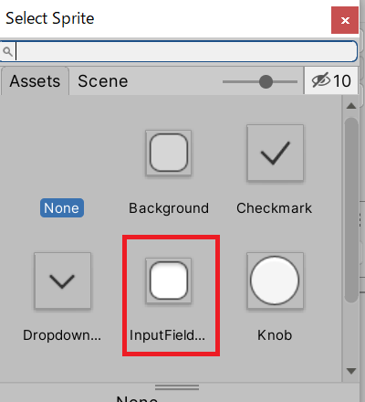

これでセルの背景設定は終了です。

セルの外観の準備ができました。最後に Cell ゲームオブジェクトに制御用のスクリプトを追加しましょう。Cell ゲームオブジェクトを選択している状態で Inspector ビューの「Add Component」ボタンを押してください。

ドロップダウンメニューが表示されるので、上部の入力ボックスに Cell と入力して「New script」を選択します。

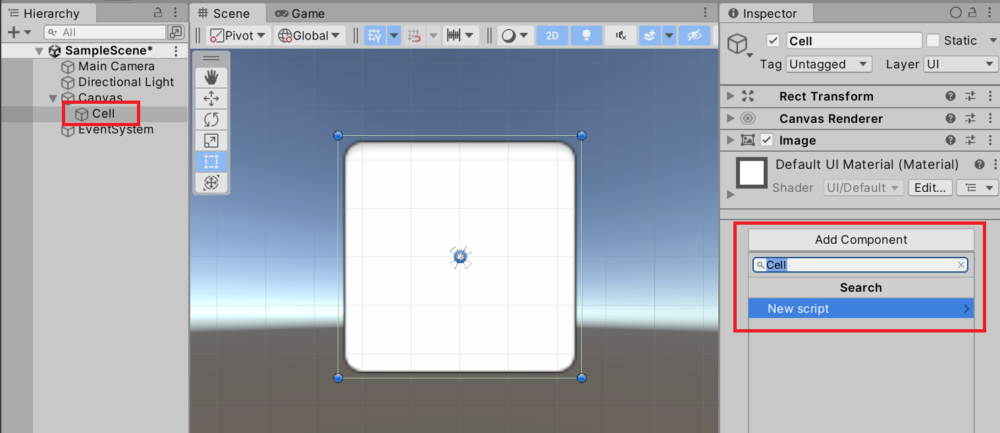

新規作成するスクリプトの名前に前述した Cell が引き継がれていることを確認し、下部の「Create and Add」ボタンを押してください。


これで C# スクリプトが生成され、Cell ゲームオブジェクトに Cell スクリプトが追加されます。

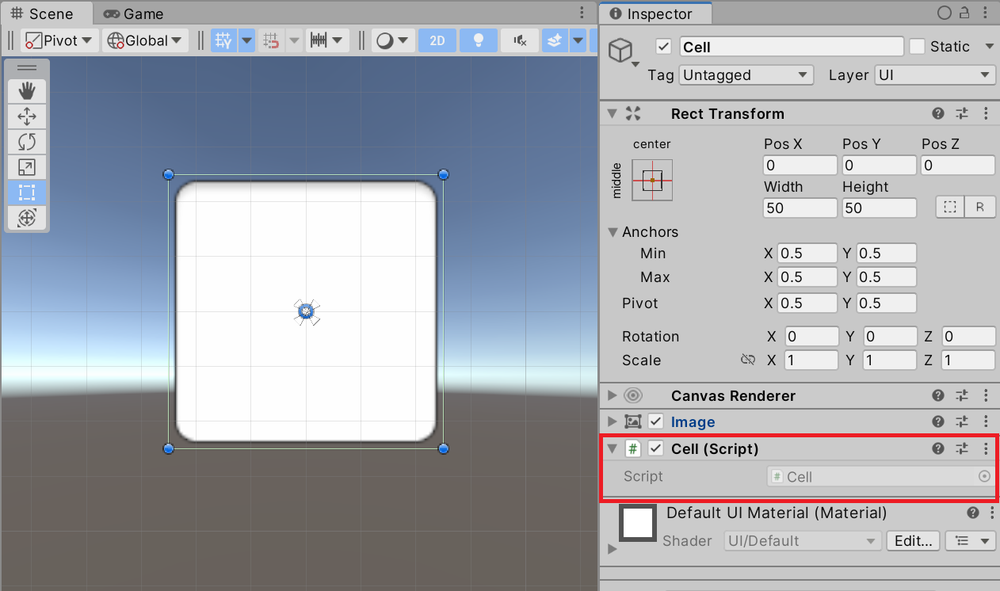

これで Unity での下準備は完了です。作成した Cell スクリプトをダブルクリックしてコードエディターを起動してください。

# Cell スクリプトの準備

`Cell` クラスの役割は、前述したセルの状態（`CellState` 列挙型）とセルの見た目を連動させることです。

まずは、セルの状態を表すデータと、セルの状態に合わせて変更するビューの組み合わせを管理できるように設計する必要があります。これらの情報は Unity の Inspector ビューから設定できるように SerializeField 属性を付けたフィールドとして定義します。

```csharp
[SerializeField]
private Image _image = null;

[SerializeField]
private Color _aliveColor = Color.black;

[SerializeField]
private Color _deadColor = Color.white;

[SerializeField]
private CellState _state = CellState.Dead;
```

上記のコードを Cell クラス内に書き足して保存し、Unity に戻って Inspector ビューから設定をしましょう。`_image` フィールドにセルの見た目を制御する Image コンポーネントを設定します。`_aliveColor` フィールドには生存セルの色を、`_deadColor` には死滅しているセルの色を設定する想定です。

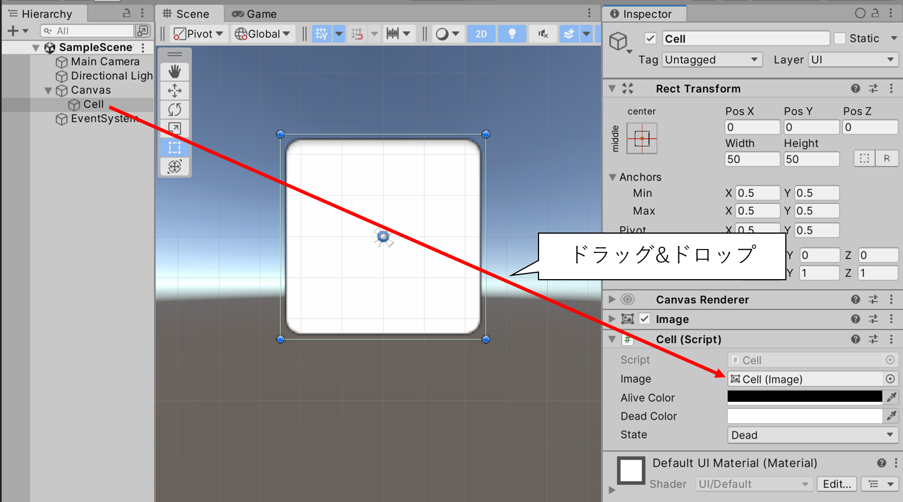

これで C# コードからセルに対応している Image コンポーネントにアクセスできます。

次に、セルの状態 `_state` フィールドの値に連動してセルの色が更新されるように仕組みます。`_state` フィールドの値を調べ、`CellState.Dead` なら `_deadColor` を、`CellState.Alive` なら `_aliveColor` を設定します。

```csharp
private void OnStateChanged()
{
    if (_image == null) { return; }
    _image.color = (State == CellState.Alive) ? _aliveColor : _deadColor;
}
```

上記のコードでは `_state` フィールドの値を調べてセルの色を更新する処理を `OnStateChanged()` メソッドとして定義しています。これを `OnValidate()` メソッドから呼び出せば、Inspector ビューの設定に連動して見た目が切り替わるようになります。

以下のコードで `Cell` クラスの完成です。

```csharp
using UnityEngine;
using UnityEngine.UI;

public class Cell : MonoBehaviour
{
    [SerializeField]
    private Image _image = null;

    [SerializeField]
    private Color _aliveColor = Color.black;

    [SerializeField]
    private Color _deadColor = Color.white;

    [SerializeField]
    private CellState _state = CellState.Dead;

    public CellState State
    {
        get => _state;
        set
        {
            _state = value;
            OnStateChanged();
        }
    }

    private void OnValidate()
    {
        OnStateChanged();
    }

    private void OnStateChanged()
    {
        if (_image == null) { return; }
        _image.color = (State == CellState.Alive) ? _aliveColor : _deadColor;
    }
}
```

これでライフゲームのセルを独立した部品として扱うことができるようになりました。あとは、ゲーム全体を制御するコードから、この `Cell` クラスの機能を呼び出すだけで、自由にセルの状態と見た目を制御できます。

# セルのプレハブ化

ここまでの作業でセルを部品として再利用するための準備ができたのでプレハブ化しましょう。Cell ゲームオブジェクトを Project ビューの任意のフォルダー下にドラッグ&ドロップしてください。

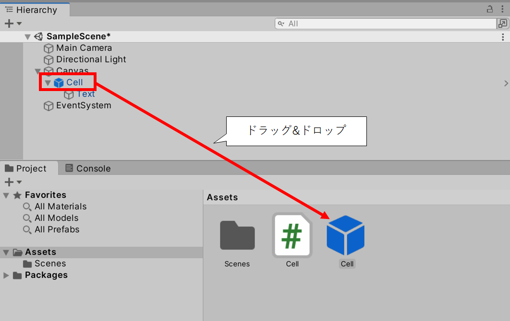

これでライフゲームのセルの準備は完了です。ゲーム全体を制御するコードを作成し、そこから上記のプレハブを使って配置しましょう。

# 格子状の自動レイアウト設定

ライフゲーム全体を管理するゲームオブジェクトを追加しましょう。Unity 上部のメニューバーから「GameObject」→「UI」→「Panel」メニュー項目を選択します。

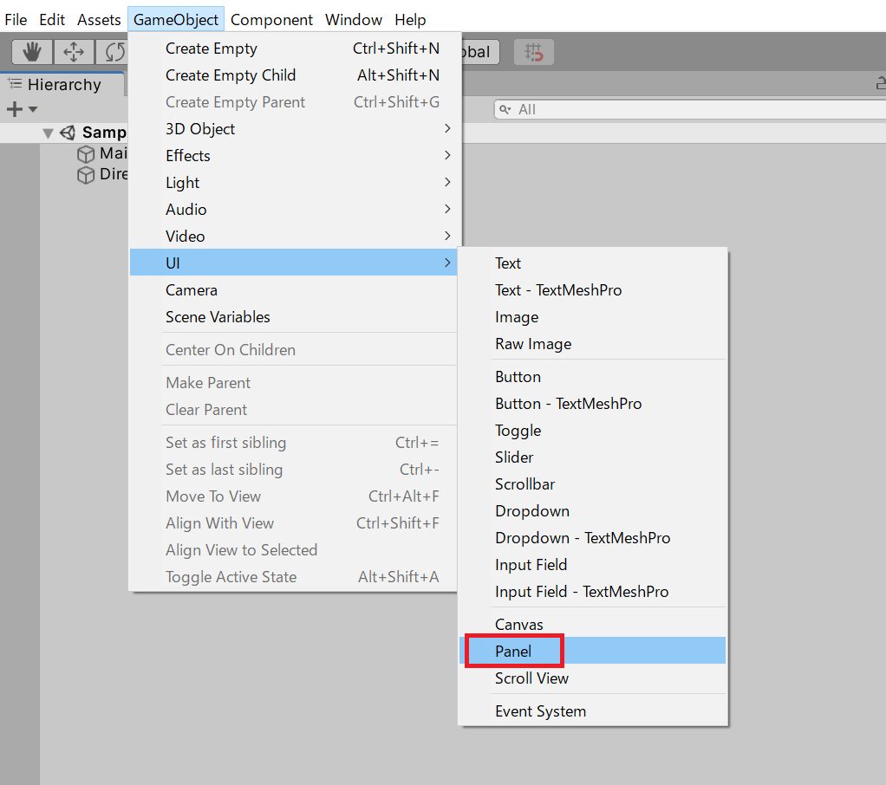

Panel ゲームオブジェクトが追加されるので、名前を LifeGame に修正します。

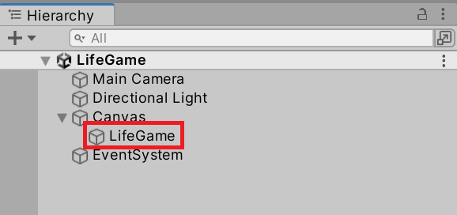

先に作成した Cell プレハブを部品として格子状に並べましょう。ここでは [`Grid Layout Group`](https://docs.unity3d.com/Packages/com.unity.ugui@1.0/manual/script-GridLayoutGroup.html) コンポーネントを使って配置は自動レイアウトに任せます。

LifeGame ゲームオブジェクトに Grid Layout Group コンポーネントを追加しましょう。LifeGame ゲームオブジェクトを選択している状態でメニューバーから「Component」→「Layout」→「Grid Layout Group」メニュー項目を選択します。

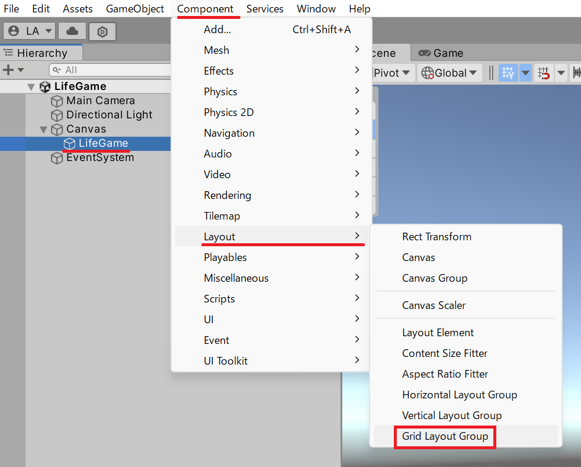

Grid Layout Group コンポーネントを持つゲームオブジェクトの子ゲームオブジェクトは、自動的に格子状に並ぶように Rect Transform コンポーネントの値が修正されます。個々のセルサイズなどは Grid Layout Group コンポーネントの設定で調整できます。

見た目のデザインは好みに合わせて調整して構いませんが、特に希望がなければセルサイズを 20 の中央揃えにしましょう。Grid Layout Group コンポーネントの Cell Size を(x=20, Y=20)に、Child Alignment を Middle Center に修正してください。

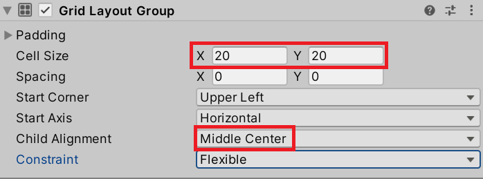

あとは、Cell プレハブからゲームオブジェクトを追加するだけで Grid Layout Group コンポーネントが自動的に子ゲームオブジェクトを格子状に並べてくれます。あとは、Cell プレハブを追加する処理は、スクリプトから行いましょう。

# プレハブからセルを生成して並べる

LifeGame ゲームオブジェクトにスクリプトを追加します。LifeGame ゲームオブジェクトを選択している状態で Inspector ビューの「Add Component」ボタンを押してください。

ドロップダウンメニューが表示されるので、上部の入力ボックスに LifeGame と入力して「New script」を選択します。

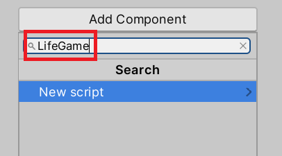

新規作成するスクリプトの名前に前述した LifeGame が引き継がれていることを確認し、下部の「Create and Add」ボタンを押してください。

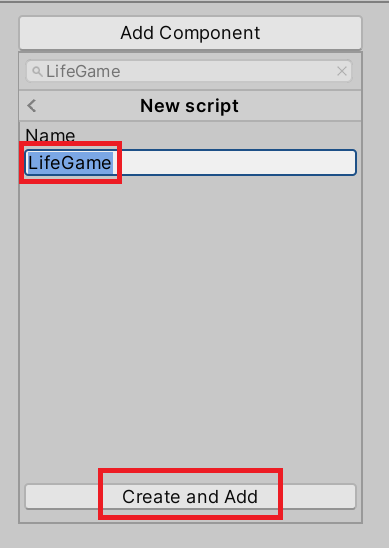

LifeGame コンポーネントが追加されたことを確認できたら、スクリプトを開いてください。

まず、マインスイーパーと同様にプレハブから Cell ゲームオブジェクトを複製して配置します。スクリプトからこれらのデータにアクセスできるようにするために SerializeField 属性付きのフィールドを追加して Inspector ビューから設定できるようにします。

```csharp
using UnityEngine;
using UnityEngine.UI;

public class LifeGame : MonoBehaviour
{
    [SerializeField]
    private GridLayoutGroup _gridLayoutGroup = null;

    [SerializeField]
    private Cell _cellPrefab = null;
}
```

上記のコードを保存して Unity に戻ってください。LifeGame スクリプトの設定に Grid Layout Group と Cell Prefab が追加されています。

Grid Layout Group には Hierarchy ビューから LifeGame ゲームオブジェクト自身を設定します。

Cell Prefab には Project ビューから保存した Cell プレハブをドラッグ&ドロップで設定します。

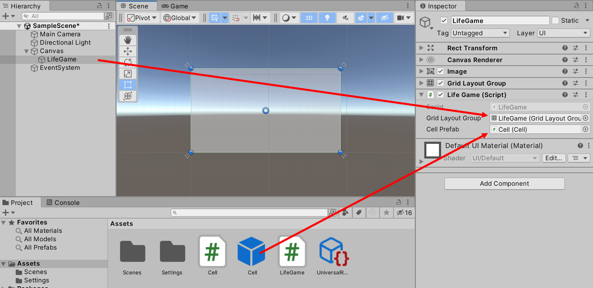

設定された Cell プレハブから新しい Cell ゲームオブジェクトを作成し、Grid Layout Group コンポーネントを持つゲームオブジェクト（ここでは LifeGame ゲームオブジェクト）の子ゲームオブジェクトとして追加しましょう。

格子状に並べるために行数と列数を設定できるようにして、その数に合わせてセルを生成するように仕組みましょう。

```csharp
using UnityEngine;
using UnityEngine.UI;

public class LifeGame : MonoBehaviour
{
    [SerializeField]
    private int _rows = 1;

    [SerializeField]
    private int _columns = 1;

    [SerializeField]
    private GridLayoutGroup _gridLayoutGroup = null;

    [SerializeField]
    private Cell _cellPrefab = null;

    private void Start()
    {
        _gridLayoutGroup.constraint = GridLayoutGroup.Constraint.FixedColumnCount;
        _gridLayoutGroup.constraintCount = _columns;

        var parent = _gridLayoutGroup.gameObject.transform;
        for (var r = 0; r < _rows; r++)
        {
            for (var c = 0; c < _columns; c++)
            {
                var cell = Instantiate(_cellPrefab);
                cell.transform.SetParent(parent);
            }
        }
    }
}
```

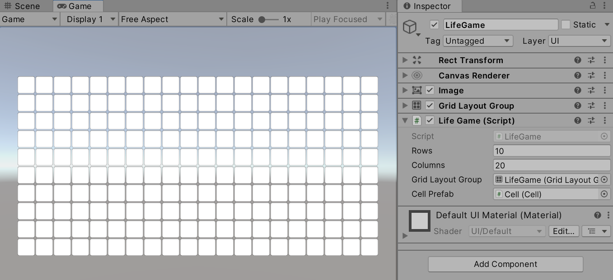

格子状レイアウトでセルを並べることができました。

# セルの状態を編集する

ライフゲームが開始される前に、まずはセルの生死を実行中に編集できるようにしましょう。セル上でマウスがクリックされたら、クリックされたセルの状態を切り替えるように仕組みましょう。

```csharp
using UnityEngine;
using UnityEngine.EventSystems;
using UnityEngine.UI;

public class LifeGame : MonoBehaviour, IPointerClickHandler
{
    [SerializeField]
    private int _rows = 1;

    [SerializeField]
    private int _columns = 1;

    [SerializeField]
    private GridLayoutGroup _gridLayoutGroup = null;

    [SerializeField]
    private Cell _cellPrefab = null;

    private void Start()
    {
        _gridLayoutGroup.constraint = GridLayoutGroup.Constraint.FixedColumnCount;
        _gridLayoutGroup.constraintCount = _columns;

        var parent = _gridLayoutGroup.gameObject.transform;
        for (var r = 0; r < _rows; r++)
        {
            for (var c = 0; c < _columns; c++)
            {
                var cell = Instantiate(_cellPrefab);
                cell.transform.SetParent(parent);
            }
        }
    }

    public void OnPointerClick(PointerEventData eventData)
    {
        var target = eventData.pointerCurrentRaycast.gameObject;
        if (target.TryGetComponent<Cell>(out var cell))
        {
            cell.State = cell.State == CellState.Alive ? CellState.Dead : CellState.Alive;
        }
    }
}
```

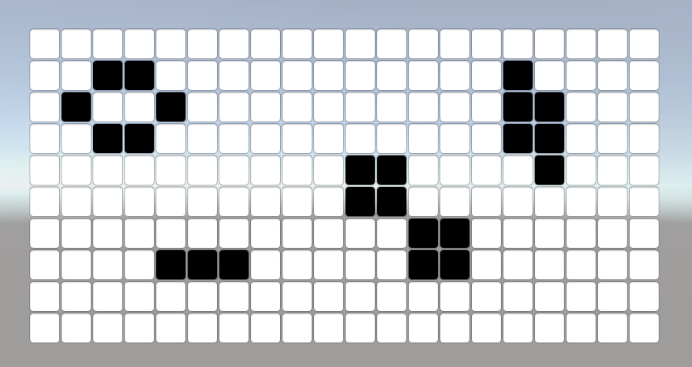

この例では `IPointerClickHandler` インターフェイスを実装し、クリックされたゲームオブジェクトに `Cell` スクリプトが設置されていればセルであると判断して状態を切り替えています。

# 課題

## 課題1 世代交代

ライフゲームが開始されると、現在の周囲のセルの状態によって次の世代の状態が決まります。過疎または過密すぎれば死滅し、そうでなければ誕生または生存を維持します。この世代交代は時間経過で自動的に切り替えわるようにするとシミュレーション的で楽しいですが、最初はデバッグしやすいように1世代ずつ進められるようにすると良いでしょう。

今回は、キーボードの右矢印キーを押すことで次の世代に進むように仕込むことにしましょう。

```csharp
using UnityEngine;
using UnityEngine.EventSystems;
using UnityEngine.InputSystem;
using UnityEngine.UI;

public class LifeGame : MonoBehaviour, IPointerClickHandler
{
    [SerializeField]
    private int _rows = 1;

    [SerializeField]
    private int _columns = 1;

    [SerializeField]
    private GridLayoutGroup _gridLayoutGroup = null;

    [SerializeField]
    private Cell _cellPrefab = null;

    private void Start()
    {
        _gridLayoutGroup.constraint = GridLayoutGroup.Constraint.FixedColumnCount;
        _gridLayoutGroup.constraintCount = _columns;

        var parent = _gridLayoutGroup.gameObject.transform;
        for (var r = 0; r < _rows; r++)
        {
            for (var c = 0; c < _columns; c++)
            {
                var cell = Instantiate(_cellPrefab);
                cell.transform.SetParent(parent);
            }
        }
    }

    private void Update()
    {
        var keyboard = Keyboard.current;
        if (keyboard == null) { return; }

        if (keyboard.rightArrowKey.wasPressedThisFrame)
        {
            OnNext();
        }
    }

    private void OnNext()
    {
        // ここに、全てのセルの状態を更新する処理を書く
    }

    public void OnPointerClick(PointerEventData eventData)
    {
        var target = eventData.pointerCurrentRaycast.gameObject;
        if (target.TryGetComponent<Cell>(out var cell))
        {
            cell.State = cell.State == CellState.Alive ? CellState.Dead : CellState.Alive;
        }
    }
}
```

このコードを参考に、キーを押したら次の世代に進む処理を `OnNext()` メソッドに実装してください。コードは不完全な状態なので、必要に応じてフィールドやメソッドパラメータを追加してください。

## 課題2 時間経過で世代交代する

次に、時間経過で世代が進むように実装を追加しましょう。世代交代が `OnNext()` メソッドの呼び出しで可能になっていれば、キー入力の代わりに時間経過を条件に `OnNext()` メソッドを呼び出すように仕組めば良いはずです。

世代ごとの時間経過は `SerializeField` 付きのフィールドから設定できるようにする物として、スペースキーを押して開始と停止を切り替えられるようにしましょう。

```csharp
using UnityEngine;
using UnityEngine.EventSystems;
using UnityEngine.InputSystem;
using UnityEngine.UI;

public class LifeGame : MonoBehaviour, IPointerClickHandler
{
    [SerializeField]
    private int _rows = 1;

    [SerializeField]
    private int _columns = 1;

    [SerializeField]
    private GridLayoutGroup _gridLayoutGroup = null;

    [SerializeField]
    private Cell _cellPrefab = null;

    [SerializeField]
    private float _duration = 1.0F; // セルを更新する時間間隔（秒単位）
    private bool _isPlaying = false; // 時間経過の更新が実行中かどうか

    private void Start()
    {
        _gridLayoutGroup.constraint = GridLayoutGroup.Constraint.FixedColumnCount;
        _gridLayoutGroup.constraintCount = _columns;

        var parent = _gridLayoutGroup.gameObject.transform;
        for (var r = 0; r < _rows; r++)
        {
            for (var c = 0; c < _columns; c++)
            {
                var cell = Instantiate(_cellPrefab);
                cell.transform.SetParent(parent);
            }
        }
    }

    private void Update()
    {
        var keyboard = Keyboard.current;
        if (keyboard == null) { return; }

        if (keyboard.spaceKey.wasPressedThisFrame)
        {
            _isPlaying = !_isPlaying;
        }

        if (_isPlaying)
        {
            // TODO: 時間経過でセルの状態を更新する処理を書く
        }
        else
        {
            if (keyboard.rightArrowKey.wasPressedThisFrame)
            {
                OnNext();
            }
        }
    }

    private void OnNext()
    {
        // TODO: 全てのセルの状態を更新する処理を書く
    }

    public void OnPointerClick(PointerEventData eventData)
    {
        var target = eventData.pointerCurrentRaycast.gameObject;
        if (target.TryGetComponent<Cell>(out var cell))
        {
            cell.State = cell.State == CellState.Alive ? CellState.Dead : CellState.Alive;
        }
    }
}
```

上記のコードは課題1の設問コードに、課題2を達成するためのコードを加えた物です。課題1ができていれば `OnNext()` が完成しているはずなので、上手く統合して動くようにしましょう。

## 課題3 文字列からセルを初期化する

セルをクリックして初期化する機能は個別にデバッグしたいときには必要ですが、ライフゲームで決まった動きをする有名なパターンなどを試したい場合は毎回クリックして初期設定するのは面倒です。そこで、文字列からセルの状態を初期化できる仕組みを実装しましょう。

例えば 0 を死滅、1 を生存と定め（`CellState` 列挙型の値と同期させると良いでしょう）以下のようなテキストを読み込んでセルの状態を初期化する仕組みを作ります。

```csharp
00000000000000000000000000000000000000
00000000000000000000000001000000000000
00000000000000000000000101000000000000
00000000000001100000011000000000000110
00000000000010001000011000000000000110
01100000000100000100011000000000000000
01100000000100010110000101000000000000
00000000000100000100000001000000000000
00000000000010001000000000000000000000
00000000000001100000000000000000000000
00000000000000000000000000000000000000
```

このテキストを読み込んで初期化した最初のセルの状態は次のような形状を想定しています。

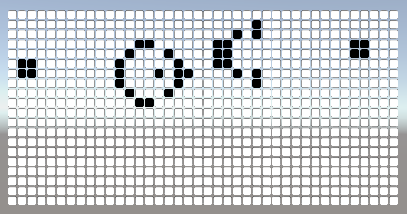

テキストの列方向・行方向の文字数が行数と列数を超えている場合、溢れた部分は無視するとします。また、セルに対して対応する文字が不足している場合は死滅しているセルとします。（簡単に言うと多い部分は無視、足りない部分は何もしない）

文字列の読み込みはファイルなどから行っても構いませんが、この場では `SerializeField` 付きの文字列フィールドから読み込むことを想定します。複数行の文字を入力するには `Multiline` 属性を加えます。

```csharp
[SerializeField]
[Multiline]
private string _data = "";
```

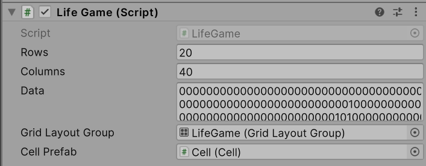

上記のテキストを入力し、上の図と同じ状態で開始できれば成功です。

---

## まとめ

- 二次元配列を2つ使って「現世代」と「次世代」のデータを分離した
- Conway のライフゲームの誕生・生存・死滅ルールを実装した
- 周囲8近傍の生存数を数えるロジックが核心となる
- Multiline 属性で複数行テキストを Inspector から設定した