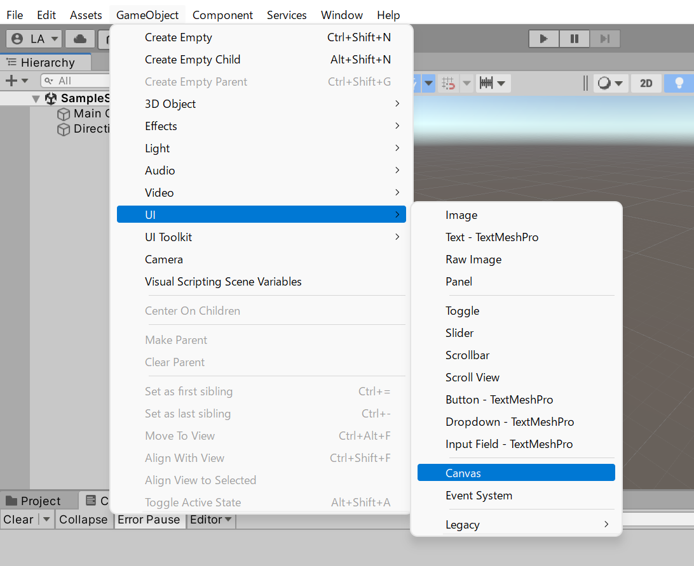
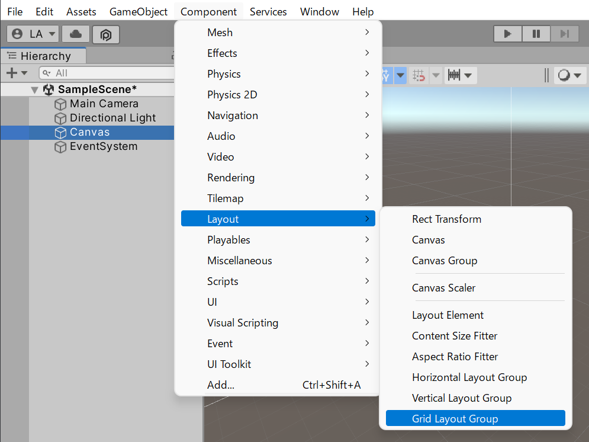
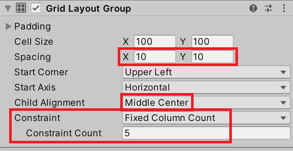
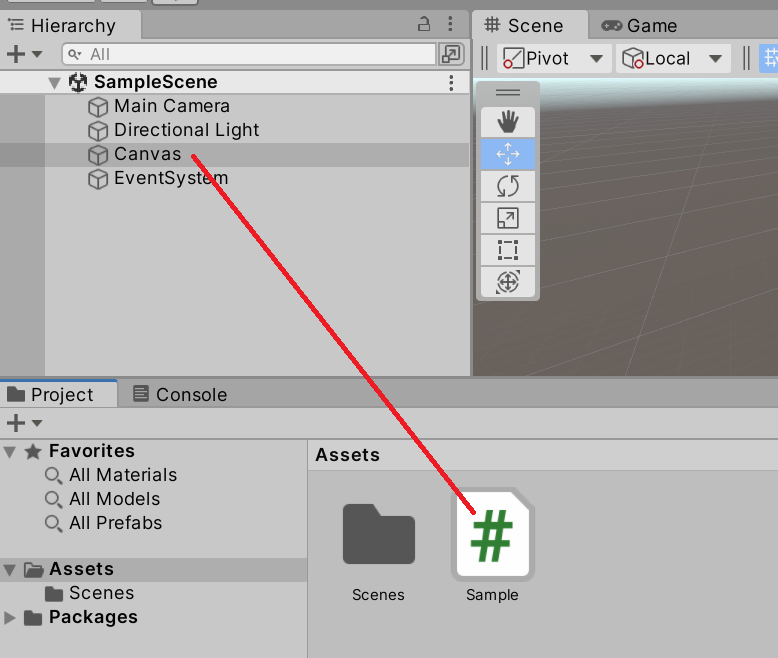
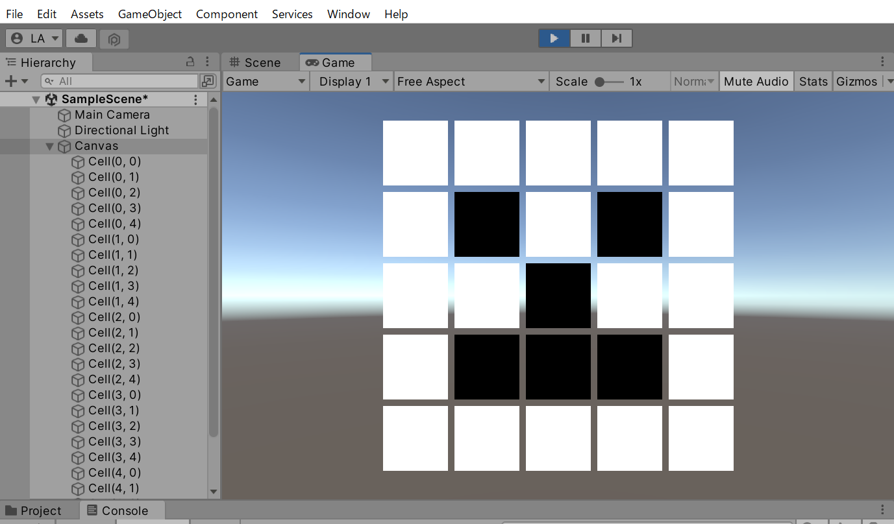

## 学習目標
- グリッドの周囲探索（上下左右）を実装できるようになる
- クリック座標からグリッドセルを特定できるようになる
- クリア判定の仕組みを実装できるようになる

## 前提知識
- [二次元配列](/unity-csharp-learning/grid-games/array-2d/) を理解していること
- Unity の Canvas・Image・GridLayoutGroup の基本操作を理解していること
- `IPointerClickHandler` インターフェースの基本を理解していること

## 概要

格子状に並べられたセルをクリックすると、自身とその上下左右最大4個のセルの色が反転するプログラムを実装を目指します。プレイヤーはルールに従って色が反転するセルを操作し、最終的に全てのセルを指定の色に染めることができれば勝ちとなります。その他、基本的なルールは[ライツアウト](https://ja.wikipedia.org/wiki/%E3%83%A9%E3%82%A4%E3%83%84%E3%82%A2%E3%82%A6%E3%83%88)に従うものとします。

# Unity 準備

新規シーンの状態から UI の Canvas ゲームオブジェクトを作成します。



作成した Canvas ゲームオブジェクトに Grid Layout Group コンポーネントを追加します。



追加した Grid Layout Group コンポーネントの Spacing の X と Y の値を 10 に、Child Alignment の設定を Middle Center に変更します。グリッド上に並べるセルの行数または列数を Constraint の設定で固定化できます。例えば Constraint の設定を Fixed Column Count に変更して、下部の Constraint Count を 5 にすると列数が 5 列に固定されます。この設定は課題に応じて、スクリプトから変更しても構いません。



新規に C# スクリプトを作成し、Canvas ゲームオブジェクトに設定します。



# スクリプト

Canvas ゲームオブジェクトに設定した C# スクリプトを編集して、格子状に並べられたセルを生成しましょう。この場では UI の Image コンポーネントを使ってセルの色を設定します。

```csharp
using UnityEngine;
using UnityEngine.EventSystems;
using UnityEngine.UI;

public class Sample : MonoBehaviour, IPointerClickHandler
{
    private void Start()
    {
        for (var r = 0; r < 5; r++)
        {
            for (var c = 0; c < 5; c++)
            {
                var cell = new GameObject($"Cell({r}, {c})");
                cell.transform.parent = transform;
                cell.AddComponent<Image>();
            }
        }
    }

    public void OnPointerClick(PointerEventData eventData)
    {
        var cell = eventData.pointerCurrentRaycast.gameObject;
        var image = cell.GetComponent<Image>();
        image.color = Color.black;
    }
}
```



この時点ではセルの初期色が白で、クリックすると黒に反転することが確認できます。

# 課題

- クリックしたセルの色を反転（白いセルをクリックすると黒に、黒いセルをクリックすると白に）させましょう。
- クリックしたセル自身に加えて、その上下左右にセルが存在していれば一緒に反転するようにしましょう。
    - ヒント: クリックされたセルは判明しているので、その周囲のセルを探索する手段が必要です。
- 全てのセルが目的の色（ライツアウトのルールに従い白を点灯、黒を消灯と定義するなら黒）に統一されている場合はゲームクリアとなる判定処理を実装してください。
    - クリアまでに掛かった時間と手数を記録して表示しましょう。
- 起動時に全てのセルの色をランダムで（白または黒に）設定してください。
    - 全ての色が同じ、または1手でクリア可能な状態で始まらないようにしてください。
    - 必ずクリア可能な配置であり、クリアまでの手順はチートで把握できる（Debug.Log等に出力）仕組みにしてください。
- `SerializeField` を使って行数と列数を Inspector ビューから設定できるようにし、実行時に生成されるセルの数を変更できるようにしてください。

# 参考リンク

- [ライツアウト（Wikipedia）](https://ja.wikipedia.org/wiki/%E3%83%A9%E3%82%A4%E3%83%84%E3%82%A2%E3%82%A6%E3%83%88)
- [パズルゲーム「白にしろ」](http://www.daiichi-g.co.jp/osusume/forfun/05_white/05.html)

## まとめ
- `IPointerClickHandler` でクリックイベントを受け取った
- `pointerCurrentRaycast.gameObject` でクリックされたセルを特定した
- 周囲探索・クリア判定・ランダム初期化は課題として残っている
