# マインスイーパー

## 学習目標
- ゲームの構成要素を部品（セル）として設計できるようになる
- `GridLayoutGroup` を使って格子状 UI を実装できるようになる
- プロパティを使ってセルの状態と見た目を連動させられるようになる

## 前提知識
- [二次元配列](/unity-csharp-learning/grid-games/array-2d/) を理解していること
- [三目並べ](/unity-csharp-learning/grid-games/tic-tac-toe/) を完了していること
- Unity の Prefab・Canvas・GridLayoutGroup の基本操作を理解していること
- C# のプロパティ（getter/setter）を理解していること

## 概要

本稿は、Unity を使ってゲーム「マインスイーパー」の実装手順を解説するチュートリアルです。基本的なルールは Wikipedia に記載されている「[マインスイーパー#概要](https://ja.wikipedia.org/wiki/%E3%83%9E%E3%82%A4%E3%83%B3%E3%82%B9%E3%82%A4%E3%83%BC%E3%83%91#%E6%A6%82%E8%A6%81)」に従うものとします。

例として [Microsoft Minesweeper](https://www.microsoft.com/ja-jp/p/microsoft-minesweeper/9wzdncrfhwcn?activetab=pivot:overviewtab) のクラシックモードをプレイすると参考になるでしょう。

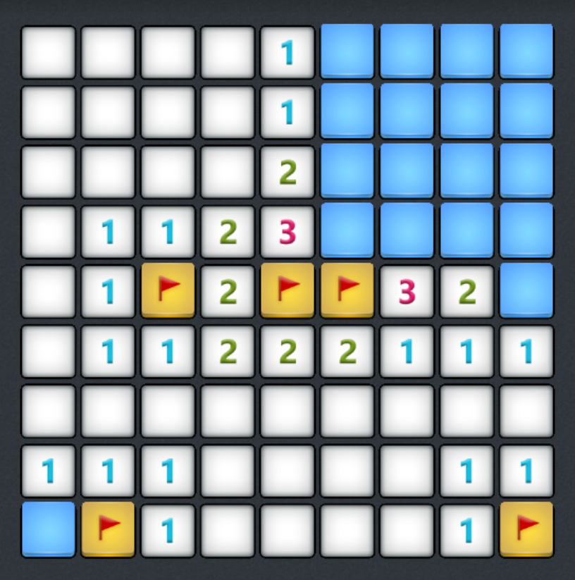

これが、本稿で想定している標準的なマインスイーパーです。

このチュートリアルを通して、以下の機能を学習します。

- 2次元配列による格子状に並べられたデーターの表現
- ゲーム内の要素を適切な単位で部品化する
- GridLayoutGroup コンポーネントを使って格子状に UI を並べる

# セルを定義する

このようなゲームの実装を目指す場合、ゲームを構成する要素を分解し、部品単位で実装できるように設計するべきです。まず、マインスイーパーのゲームは格子状に並べられたマス目に地雷や数値を表示する性質があります。このチュートリアルでは、マス目上に並べられる矩形をセル（Cell）と呼ぶことにします。

## セルの状態

次に、セルが取る状態を考えてみましょう。マインスイーパーのルール上、最も重要な要素は地雷が配置されているかどうかです。地雷が置かれているか、そうでないかだけであれば bool 型のようの2値で表現できます。

加えて、マインスイーパーのセルは周囲8近傍に地雷がある場合、その数を表示しなければなりません。これは周囲のセルを調べることで数を得られますが、地雷は初期配置から移動することはないので一度だけ計算して状態として記録しておいた方が自然な実装になるでしょう。

以上のことから、セルは以下の状態を取るものと想定できます。

- 周囲に地雷がひとつもない（空のセル）
- 周囲に地雷が1つある
- 周囲に地雷が2つある
- 周囲に地雷が3つある
- 周囲に地雷が4つある
- 周囲に地雷が5つある
- 周囲に地雷が6つある
- 周囲に地雷が7つある
- 周囲に地雷が8つある
- 地雷

これらの状態をデータとして表現するなら、整数と互換性を保った方が都合が良さそうです。例えば周囲の地雷の数はそのまま 0 ～ 8 までの整数で表し、地雷は特殊な値として -1 を割り当てるなどの方法です。これなら、1セル当たりの情報量は整数型（限界まで最適化するなら4ビット）の範囲に抑えられます。

しかし、単純に整数型で処理してしまうと範囲外の値が設定されてしまう可能性があるので好ましくありません。このような、取り得る状態が決まっている情報には列挙型を使います。セルの状態を表すデータを `CellState` 列挙型として以下のように定義します。

```csharp
public enum CellState
{
    None = 0,
    One = 1,
    Two = 2,
    Three = 3,
    Four = 4,
    Five = 5,
    Six = 6,
    Seven = 7,
    Eight = 8,

    Mine = -1,
}
```

これが、画面上に表示される個々のセルが持つ状態となります。

## セルとなるゲームオブジェクトを作る

次に、前述した `CellState` 列挙型に対応した見た目となるゲームオブジェクト、つまりセルを作りましょう。セルは原型を作ってから、プレハブにして再利用します。

まず Unity 上部メニューバーから「GameObject」→「UI」→「Image」メニュー項目を選択します。

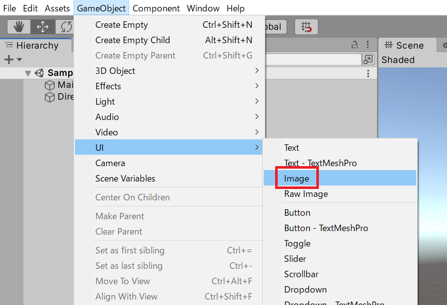

Image ゲームオブジェクトが追加されるので、ゲームオブジェクトの名前を "Cell" に変更してください。

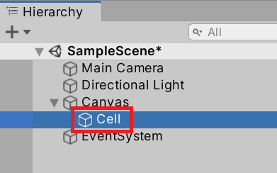

次にセルのサイズを調整します。最終的な親オブジェクトのサイズに追従するようにしますが、まずはセルのレイアウト確認のためにサイズを固定しましょう。

Cell ゲームオブジェクトを選択している状態で Inspector ビューの 「Rect Transform」コンポーネントの設定を変更します。「Pos X」と「Pos Y」の値を 0 に、「Width」と「Height」の値を 50 に設定してください。アンカーは既定値の中心に合わせます。


次にセルの背景画像を設定しましょう。任意の背景画像を設定してかまいませんが、特になければ Unity UI が使っている既定の画像を設定しましょう。この場では「InputFieldBackground」を流用します。

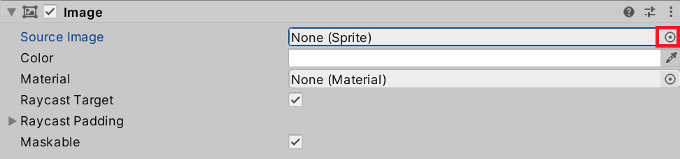


これでセルの背景設定は終了です。

次に、セルの上に表示する数字や地雷の UI を追加しましょう。数字や地雷に画像を使うこともできますが、このチュートリアルでは簡素化のためにテキストを使いましょう。

Hierarchy ビューの Cell ゲームオブジェクトを右クリックして表示されたコンテキストメニューから「UI」→「Legacy」→「Text」項目を選択してください。

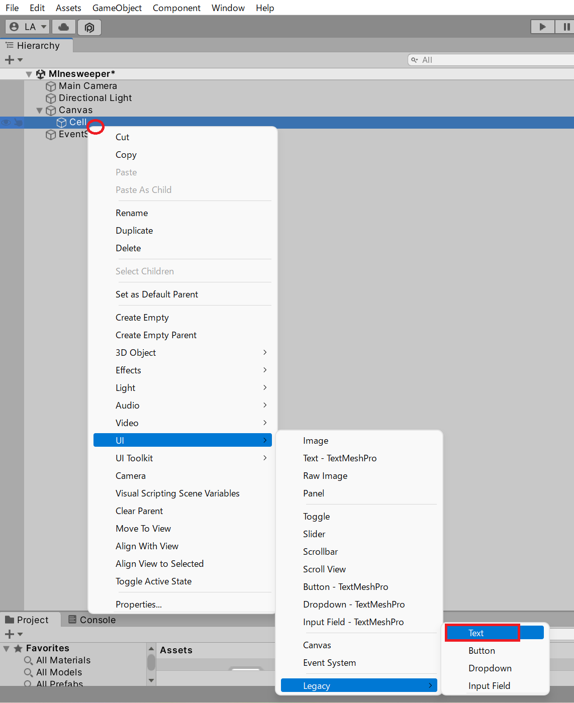

Cell ゲームオブジェクトの子ゲームオブジェクトとして Text ゲームオブジェクトが追加されます。

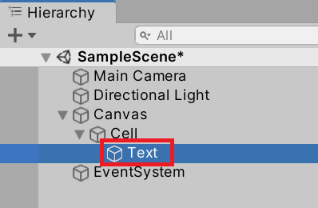

追加された Text ゲームオブジェクトを選択して Inspector ビューの「Rect Transform」コンポーネントの設定を変更します。常にセルの中央に文字が配置されるように調整しましょう。

アンカーを水平方向・垂直方向共に Stretch に変更し、「Left」、「Top」、「Right」、「Bottom」の値をすべて 0 に設定してください。

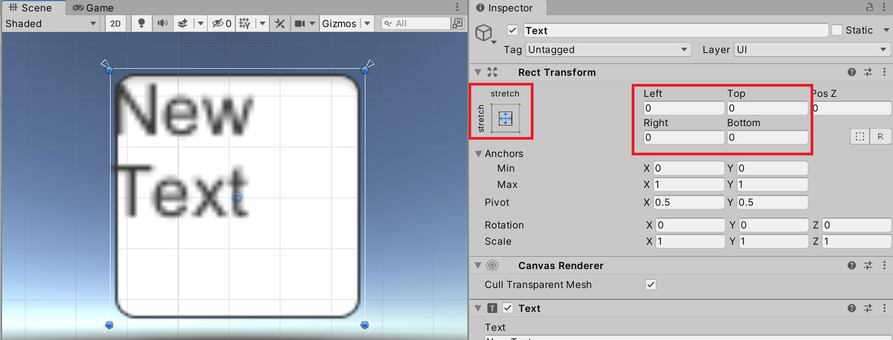

これで、テキストコンポーネントが常に親の Cell ゲームオブジェクトの範囲に拡縮されるようになります。

次にテキスト並び（アライメント）の調整をしましょう。Text ゲームオブジェクトの「Text」コンポーネントの設定を変更します。

セルに表示する文字は1文字だけなので、この場ではレイアウト確認のため「Text」に X の文字を入力しましょう。地雷の場合は X を表示するもとします。周囲に地雷がある場合は 1 ～ 8 までの数字1文字、周囲に地雷がなければ空文字にして画面には文字を表示しないようにする想定です。

文字の大きさは「Font Size」で変更できます。見やすい範囲で任意に調整してください。

文字の配置は「Alignment」で変更できます。水平方向・垂直方向共に中央に変更してください。

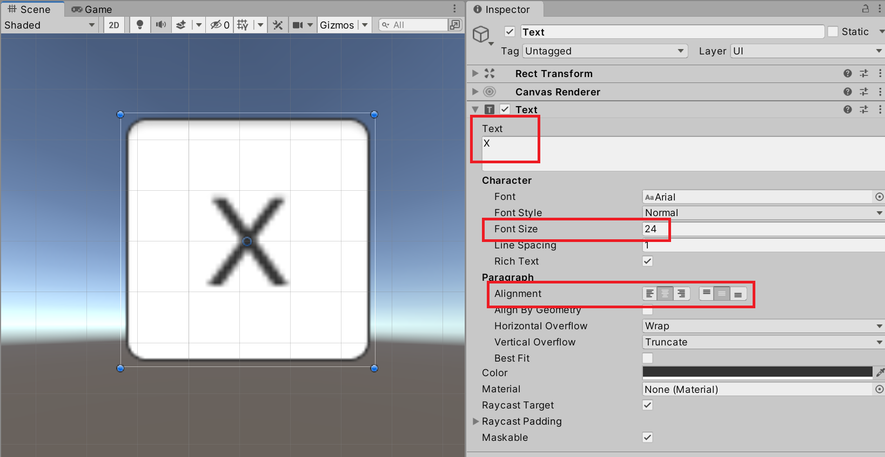

これでセルの外観の準備ができました。最後に Cell ゲームオブジェクトに制御用のスクリプトを追加しましょう。Cell ゲームオブジェクトを選択している状態で Inspector ビューの「Add Component」ボタンを押してください。

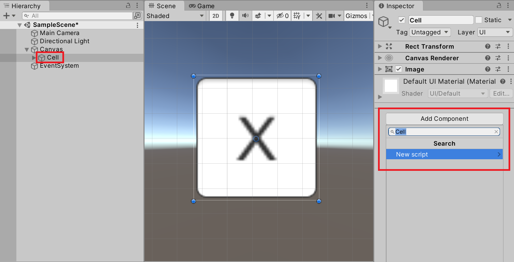

ドロップダウンメニューが表示されるので、上部の入力ボックスに Cell と入力して「New script」を選択します。

新規作成するスクリプトの名前に前述した Cell が引き継がれていることを確認し、下部の「Create and Add」ボタンを押してください。

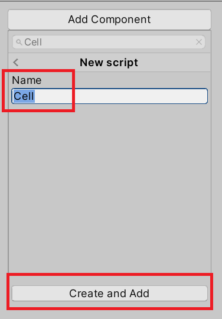

これで C# スクリプトが生成され、Cell ゲームオブジェクトに Cell スクリプトが追加されます。

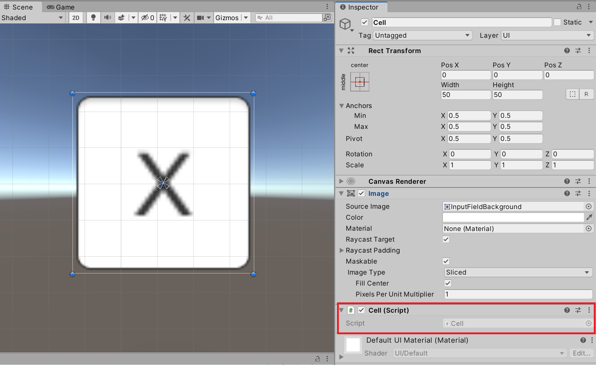

これで Unity での下準備は完了です。作成した Cell スクリプトをダブルクリックしてコードエディターを起動してください。

## C# スクリプトの準備

`Cell` クラスの役割は、前述したセルの状態（`CellState` 列挙型）とセルの見た目を連動させることです。

まずは、セルの状態を表すデータと、セルの状態に合わせて変更するビューの組み合わせを管理できるように設計する必要があります。これらの情報は Unity の Inspector ビューから設定できるように `SerializeField` 属性を付けたフィールドとして定義します。

```csharp
using UnityEngine;
using UnityEngine.UI;

public class Cell : MonoBehaviour
{
    [SerializeField]
    private Text _view = null;

    [SerializeField]
    private CellState _cellState = CellState.None;
}
```

まずはこの状態で保存し、Unity に戻って Inspector ビューから `_view` フィールドの値を設定しましょう。

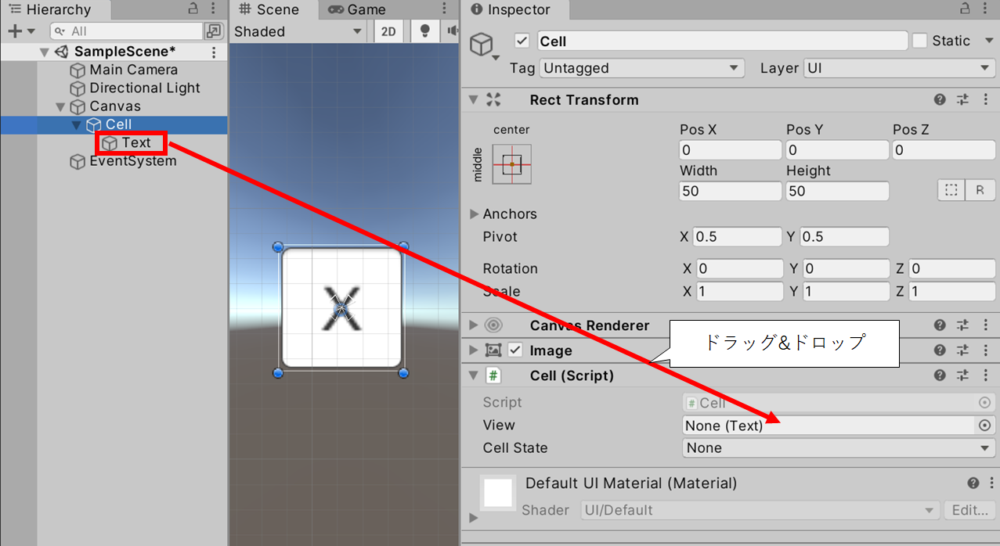

これで C# コードからセルが持っているテキストにアクセスできます。

次に、セルの状態 `_cellState` フィールドの値に連動して Text コンポーネントが更新されるように仕組みます。`_cellState` フィールドの値を調べ、None なら非表示（空文字）、Mine なら地雷（X）、それ以外なら CellState 列挙型の値を整数とした文字をテキストに設定します。

```csharp
if (_cellState == CellState.None)
{
    _view.text = "";
}
else if (_cellState == CellState.Mine)
{
    _view.text = "X";
    _view.color = Color.red;
}
else
{
    _view.text = ((int)_cellState).ToString();
    _view.color = Color.blue;
}
```

これで `_cellState` フィールドの状態に連動して `_view` フィールドの `text` プロパティを更新しています。`_cellState` フィールドの値が更新されたとき、必ず上記のコードを実行するように調整すれば、セルの状態と見た目が常に一致するようになります。

```csharp
using UnityEngine;
using UnityEngine.UI;

public class Cell : MonoBehaviour
{
    [SerializeField]
    private Text _view = null;

    [SerializeField]
    private CellState _cellState = CellState.None;

    private void Start()
    {
        OnCellStateChanged();
    }

    private void OnCellStateChanged()
    {
        if (_view == null) { return; }

        if (_cellState == CellState.None)
        {
            _view.text = "";
        }
        else if (_cellState == CellState.Mine)
        {
            _view.text = "X";
            _view.color = Color.red;
        }
        else
        {
            _view.text = ((int)_cellState).ToString();
            _view.color = Color.blue;
        }
    }
}
```

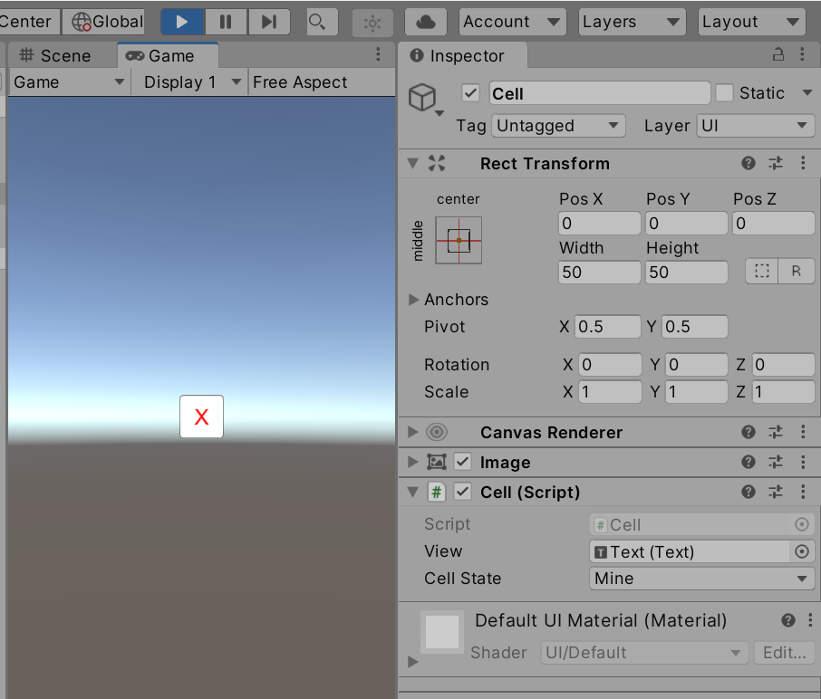

上記のコードでは `_cellState` フィールドの値を調べてテキストを更新する一連のコードを `OnCellStateChanged()` メソッドとして定義しています。これを `Start()` メソッドから呼び出すことで、初期化時にセルの状態と見た目が一致するように仕組んでいます。

しかし、これでは Inspector ビューから状態を変更してもゲームを実行するまでセルの見た目が変わらないため不便です。ゲームを実行しなくても `OnCellStateChanged()` メソッドを実行して、常に状態に一致した表示になる仕組みを作りたいです。

Inspector ビューから設定が変更されたときに更新処理を実行したい場合 `Start()` メソッドに代わって [`OnValidate()` メソッド](https://docs.unity3d.com/ScriptReference/MonoBehaviour.OnValidate.html)を実装します。

```csharp
private void OnValidate();
```

このメソッドは、スクリプトがロードされたとき、または Inspector ビューの値が更新されたときに呼び出されます。

```csharp
using UnityEngine;
using UnityEngine.UI;

public class Cell : MonoBehaviour
{
    [SerializeField]
    private Text _view = null;

    [SerializeField]
    private CellState _cellState = CellState.None;

    private void OnValidate()
    {
        OnCellStateChanged();
    }

    private void OnCellStateChanged()
    {
        if (_view == null) { return; }

        if (_cellState == CellState.None)
        {
            _view.text = "";
        }
        else if (_cellState == CellState.Mine)
        {
            _view.text = "X";
            _view.color = Color.red;
        }
        else
        {
            _view.text = ((int)_cellState).ToString();
            _view.color = Color.blue;
        }
    }
}
```

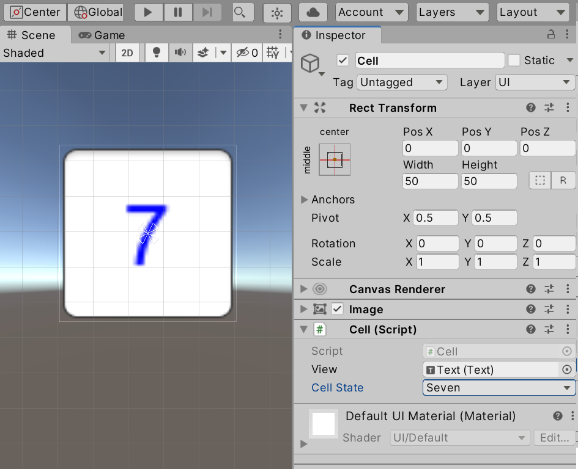

実行結果

上記のコードは `Start()` メソッドの代わりに `OnValidate()` メソッドから `OnCellStateChanged()` メソッドを呼び出しています。これによって、Inspector ビューから `_cellState` フィールドの値を変更したときに必ず `OnCellStateChanged()` メソッドが実行されるようになるため、ゲームを実行しなくてもセルの状態設定と見た目（テキスト）が一致するようになります。

## セルの状態をプロパティとして公開する

最後に、セルの状態を別のスクリプトからも更新できるようにプロパティを公開しましょう。`_cellState` フィールドのアクセス制御は private に設定されているためクラスの外からはアクセスできません。`Cell` クラスは部品として、ゲーム全体を制御するコードから使われることが想定されるので、別のクラスからもセルの状態を読み書きする必要があります。

```csharp
private CellState _cellState = CellState.None;
public CellState CellState
{
    get => _cellState;
    set
    {
        _cellState = value;
        OnCellStateChanged();
    }
}
```

プロパティは setter と getter を介して、隠蔽しているフィールド（バッキングフィールド）にアクセスできます。

外から `CellState` プロパティが参照されると getter が呼び出され、単に `_cellState` フィールドの値を返します。

一方で `CellState` プロパティに値を代入すると setter が呼び出され、`_cellState` フィールドの値を更新すると同時に `OnCellStateChanged()` メソッド呼び出しています。これがポイントです。

## Cell クラスの完成

以下のコードで `Cell` クラスが完成です。

```csharp
using UnityEngine;
using UnityEngine.UI;

public class Cell : MonoBehaviour
{
    [SerializeField]
    private Text _view = null;

    [SerializeField]
    private CellState _cellState = CellState.None;
    public CellState CellState
    {
        get => _cellState;
        set
        {
            _cellState = value;
            OnCellStateChanged();
        }
    }

    private void OnValidate()
    {
        OnCellStateChanged();
    }

    private void OnCellStateChanged()
    {
        if (_view == null) { return; }

        if (_cellState == CellState.None)
        {
            _view.text = "";
        }
        else if (_cellState == CellState.Mine)
        {
            _view.text = "X";
            _view.color = Color.red;
        }
        else
        {
            _view.text = ((int)_cellState).ToString();
            _view.color = Color.blue;
        }
    }
}
```

これでマインスイーパーのセルを独立した部品として扱うことができるようになりました。あとは、ゲーム全体を制御するコードから、この `Cell` クラスの機能を呼び出すだけで、自由にセルの状態と見た目を制御できます。

# セルの配置

ここまでの作業でセルを部品として再利用するための準備ができたのでプレハブ化しましょう。Cell ゲームオブジェクトを Project ビューの任意のフォルダー下にドラッグ&ドロップしてください。


## 自動レイアウト

まずは、マインスイーパーのゲーム全体を管理するゲームオブジェクトを追加しましょう。Unity 上部のメニューバーから「GameObject」→「UI」→「Panel」メニュー項目を選択します。


Panel ゲームオブジェクトが追加されるので、名前を Minesweeper に修正します。

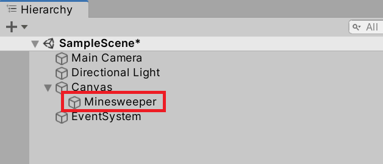

マインスイーパーでは、上記で作成した Cell プレハブを部品として、格子状に並べて制御する必要があります。スクリプトから座標を個別に設定することもできますが Unity UI では自動レイアウトの仕組みが提供されているので、それを使いましょう。

格子状にオブジェクトを並べるには [`Grid Layout Group`](https://docs.unity3d.com/Packages/com.unity.ugui@1.0/manual/script-GridLayoutGroup.html) コンポーネントを使うと便利です。

Minesweeper ゲームオブジェクトに Grid Layout Group コンポーネントを追加しましょう。Minesweeper ゲームオブジェクトを選択している状態でメニューバーから「Component」→「Layout」→「Grid Layout Group」メニュー項目を選択します。

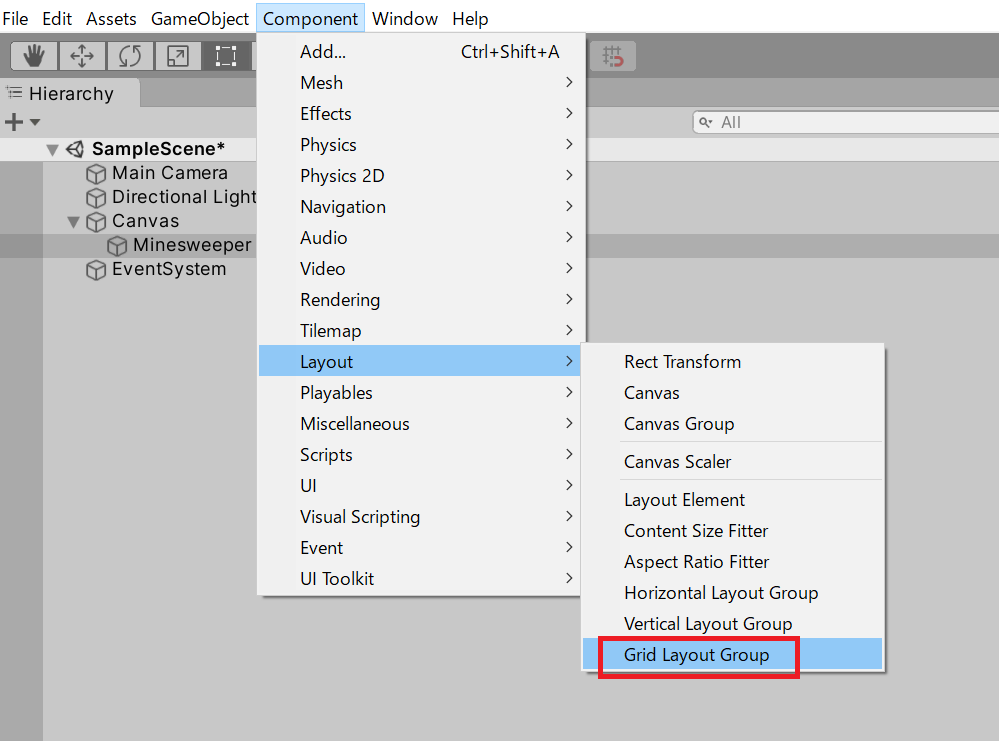

Grid Layout Group コンポーネントを持つゲームオブジェクトの子ゲームオブジェクトは、自動的に格子状に並ぶように Rect Transform コンポーネントの値が修正されます。個々のセルサイズなどは Grid Layout Group コンポーネントの設定で調整できます。

見た目のデザインは好みに合わせて調整して構いませんが、特に希望がなければセルサイズを 50 の中央揃えにしましょう。Grid Layout Group コンポーネントの Cell Size を(x=50, Y=50)に、Child Alignment を Middle Center に修正してください。

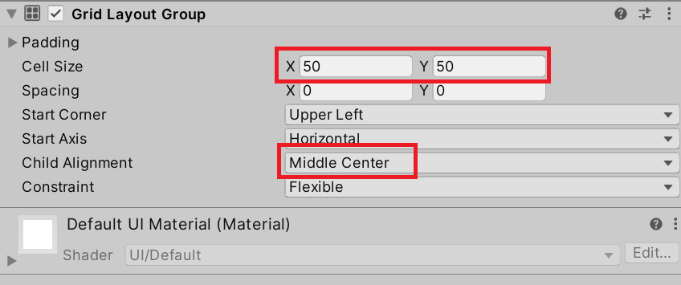

あとは、Cell プレハブからゲームオブジェクトを追加するだけで Grid Layout Group コンポーネントが自動的に子ゲームオブジェクトを格子状に並べてくれます。あとは、Cell プレハブを追加する処理は、スクリプトから行いましょう。

## プレハブからセルを生成して並べる

Minesweeper ゲームオブジェクトにスクリプトを追加します。Minesweeper ゲームオブジェクトを選択している状態で Inspector ビューの「Add Component」ボタンを押してください。

ドロップダウンメニューが表示されるので、上部の入力ボックスに Minesweeper と入力して「New script」を選択します。

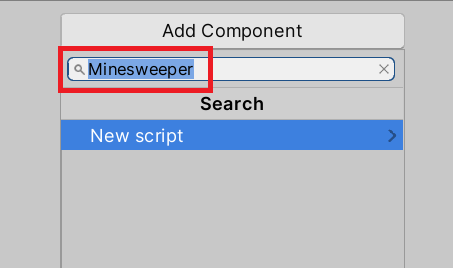

新規作成するスクリプトの名前に前述した Minesweeper が引き継がれていることを確認し、下部の「Create and Add」ボタンを押してください。

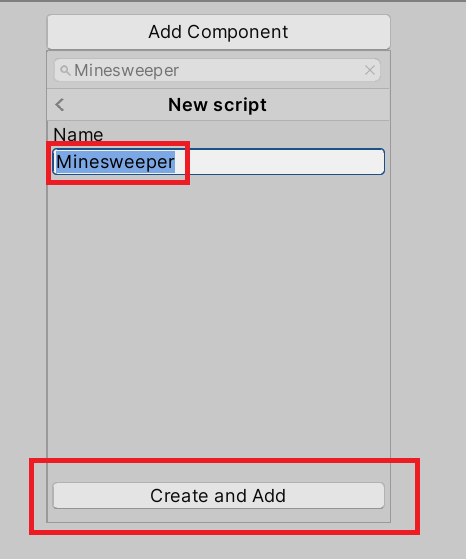

Minesweeper コンポーネントが追加されたことを確認できたら、スクリプトを開いてください。

まず、スクリプトで Cell プレハブから Cell ゲームオブジェクトを作成し、Grid Layout Group コンポーネントを持つゲームオブジェクトの子ゲームオブジェクトとして配置する処理を考えてみましょう。スクリプトからこれらのデータにアクセスできるようにするために SerializeField 属性付きのフィールドを追加して Inspector ビューから設定できるようにします。

```csharp
using UnityEngine;
using UnityEngine.UI;

public class Minesweeper : MonoBehaviour
{
    [SerializeField]
    private GridLayoutGroup _gridLayoutGroup = null;

    [SerializeField]
    private Cell _cellPrefab = null;
}
```

上記のコードを保存して Unity に戻ってください。Minesweeper スクリプトの設定に Grid Layout Group と Cell Prefab が追加されています。Grid Layout Group には Hierarchy ビューから Minesweeper ゲームオブジェクト自身を、Cell Prefab には Project ビューから保存した Cell プレハブをドラッグ&ドロップで設定します。

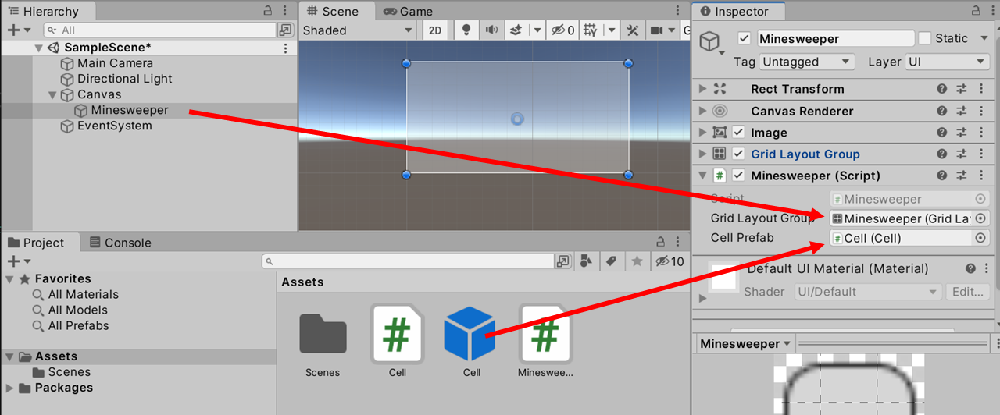

設定された Cell プレハブから新しい Cell ゲームオブジェクトを作成し、Grid Layout Group コンポーネントを持つゲームオブジェクト（このチュートリアルでは Minesweeper スクリプトと同じゲームオブジェクト）の子ゲームオブジェクトとして追加しましょう。

```csharp
var cell = Instantiate(_cellPrefab);
var parent = _gridLayoutGroup.gameObject.transform;
cell.transform.SetParent(parent);
```

上記のコードは `Instantiate()` メソッドでプレハブからゲームオブジェクトを複製し、これを Grid Layout Group コンポーネントを持つゲームオブジェクトが親になるように `SetParent()` メソッドに `_gridLayoutGroup` フィールドに設定されたゲームオブジェクトの Transform コンポーネントを設定しています。

上記のコードを `private void Start()` メソッドに記述して実行すると、次のような実行結果になるでしょう。

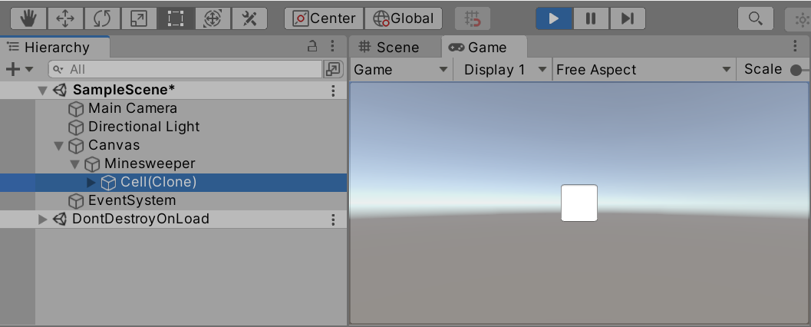

意図通りに Minesweeper ゲームオブジェクトの直下にプレハブから複製した Cell ゲームオブジェクトが追加されています。

格子状に並べたときのデザインを確認するために、行数と列数を設定できるようにして、その数に合わせてセルを生成するように仕組みましょう。

```csharp
using UnityEngine;
using UnityEngine.UI;

public class Minesweeper : MonoBehaviour
{
    [SerializeField]
    private int _rows = 1;

    [SerializeField]
    private int _columns = 1;

    [SerializeField]
    private GridLayoutGroup _gridLayoutGroup = null;

    [SerializeField]
    private Cell _cellPrefab = null;

    private void Start()
    {
        var parent = _gridLayoutGroup.gameObject.transform;
        for (var r = 0; r < _rows; r++)
        {
            for (var c = 0; c < _columns; c++)
            {
                var cell = Instantiate(_cellPrefab);
                cell.transform.SetParent(parent);
            }
        }
    }
}
```

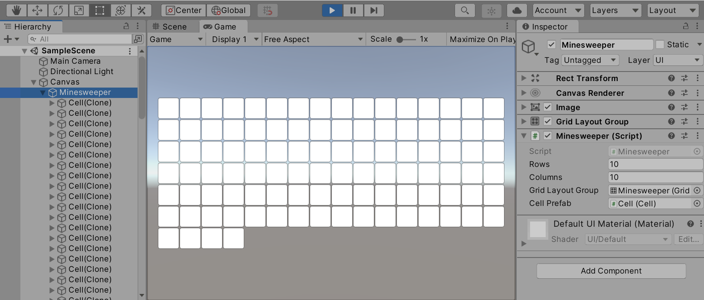

上記のコードは Inspector ビューから行数と列数を設定できるように `_rows` フィールドと `_columns` フィールドを追加しています。これら行数と列数に合わせてセルを生成しています。

しかし Grid Layout Group コンポーネントには行数や列数の設定・制限をしていないため、追加されたセルは単純に Minesweeper ゲームオブジェクトの領域いっぱいに合わせて並べられます。これは、意図したレイアウトではありません。

Grid Layout Group コンポーネントの自動レイアウトで行数または列数を固定するには、まず `GridLayoutGroup.constraint` プロパティの設定を修正します。

```csharp
public Constraint constraint { get; set; }
```

このプロパティには `UnityEngine.UI.GridLayoutGroup.Constraint` 列挙型の値を設定します。

```csharp
public enum Constraint
{
    Flexible = 0,
    FixedColumnCount = 1,
    FixedRowCount = 2
}
```

既定値は Flexible で、上記のコードの実行結果のように GridLayoutGroup の領域に合わせて並べられます。FixedColumnCount は行数を固定、FixedRowCount は列数を固定します。

固定する行数または列数は `GridLayoutGroup.constraintCount` プロパティで設定します。

```csharp
public int constraintCount { get; set; }
```

このプロパティに行数または列数を設定します。`constraint` プロパティが `Constraint.Flexible` の場合、この値は無視されます。

上記のスクリプトでは行数と列数の両方を設定できますが、この場では列数を固定して調整しましょう。

```csharp
_gridLayoutGroup.constraint = GridLayoutGroup.Constraint.FixedColumnCount;
_gridLayoutGroup.constraintCount = _columns;
```

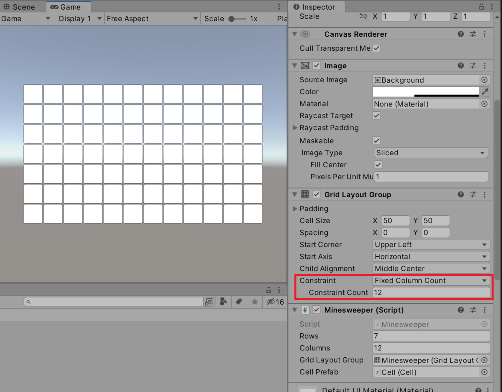

これで、目的の格子状レイアウトでセルを並べることができました。

# 地雷のランダム配置

次に、配置したセルにランダムで地雷を配置してみましょう。生成したセルに対して `CellState.Mine` を設定することで、表示を地雷に切り替えることができました。これを `Minesweeper` クラスから行いましょう。

まず、プレハブから生成した Cell ゲームオブジェクトを後から参照できるように配列に保存しておきましょう。マインスイーパーのような格子状に並べられたデータは、水平方向・垂直方向の2軸から参照できると便利なので、通常は2次元配列を使うことになります。

`_cellPrefab` フィールドの型が `Cell` 型なので、ここから `Instantiate()` メソッドで生成した結果は `Cell` 型のオブジェクトとして返されます。従って、配列の型も `Cell` 型とします。

```csharp
Cell[,] _cells = new Cell[_rows, _columns];
```

上記のような宣言でマインスイーパーのセル全てを保存できる配列を用意できます。セルを生成した後、対応する行番号・列番号の要素に Cell オブジェクトを保存します。セル生成部分のコードを以下のように書き換えましょう。

```csharp
var _cells = new Cell[_rows, _columns];
for (var r = 0; r < _rows; r++)
{
    for (var c = 0; c < _columns; c++)
    {
        var cell = Instantiate(_cellPrefab);
        cell.transform.SetParent(parent);
        _cells[r, c] = cell;
    }
}
```

これで `_cells` 配列に生成したセルが保存されます。あとは、任意の数だけランダムでセルを抽選し、`CellState` プロパティからセルの状態を地雷に変更します。

```csharp
var r = Random.Range(0, _rows);
var c = Random.Range(0, _columns);
var cell = _cells[r, c];
cell.CellState = CellState.Mine;
```

上記のコードを地雷の数だけ実行すれば、マインスイーパーのフィールド上に地雷を巻くことができます。

配置する地雷数は、行数や列数などと同じように SerializeField 属性付きのフィールドにして Unity の Inspector ビューから設定できるようにすると便利です。ただし、セル数を超えた値が設定された場合の対応などにも注意してください。

```csharp
[SerializeField]
private int _mineCount = 1;
```

これで、難易度に応じてセル数や地雷数を調整できるようになりました。ここまでのコードをまとめると、以下のような内容になります。

```csharp
using UnityEngine;
using UnityEngine.UI;

public class Minesweeper : MonoBehaviour
{
    [SerializeField]
    private int _rows = 1;

    [SerializeField]
    private int _columns = 1;

    [SerializeField]
    private int _mineCount = 1;

    [SerializeField]
    private GridLayoutGroup _gridLayoutGroup = null;

    [SerializeField]
    private Cell _cellPrefab = null;

    private void Start()
    {
        _gridLayoutGroup.constraint = GridLayoutGroup.Constraint.FixedColumnCount;
        _gridLayoutGroup.constraintCount = _columns;

        var cells = new Cell[_rows, _columns];
        var parent = _gridLayoutGroup.transform;
        for (var r = 0; r < _rows; r++)
        {
            for(var c = 0; c < _columns; c++)
            {
                var cell = Instantiate(_cellPrefab);
                cell.transform.SetParent(parent);
                cells[r, c] = cell;
            }
        }

        for (var i = 0; i < _mineCount; i++)
        {
            var r = Random.Range(0, _rows);
            var c = Random.Range(0, _columns);
            var cell = cells[r, c];
            cell.CellState = CellState.Mine;
        }
    }
}
```

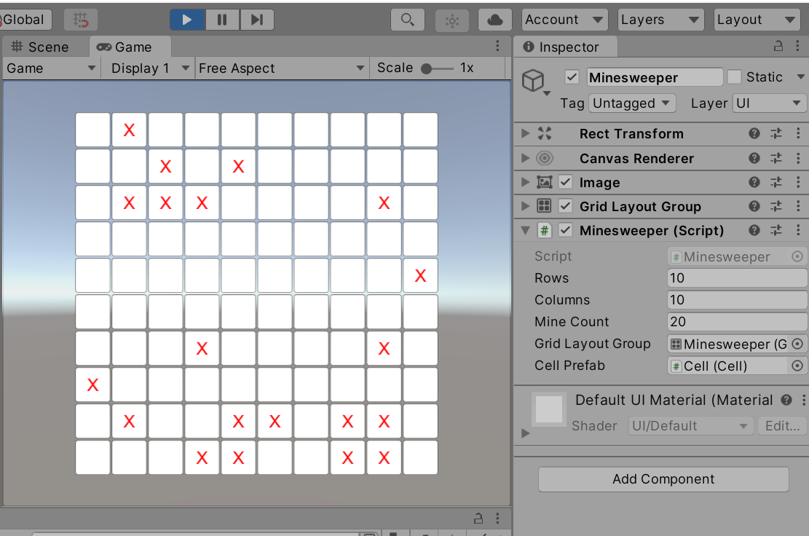

# 課題

## 課題1 地雷数の誤差

上記のコードを何度か実行すると `_mineCount` フィールドに指定した地雷数と、実際に配置される地雷数が異なる（`_mineCount` フィールドの数より地雷の数が少ない）ことがあることが確認できます。この問題の原因を特定し、解決してください。

## 課題2 周囲の地雷数を表示する

地雷以外のセルは、周囲の地雷の数を設定する必要があります。全てのセルに対して、周囲の地雷の数を設定してください。

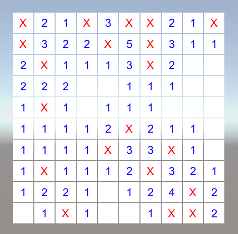

## 課題3 セルを隠しプレイヤーが開けるようにする

最後に、マインスイーパーとして遊べるようにするため、ゲーム開始時にはセルが隠されている状態にし、クリックなどの操作でセルを開く、または旗を立てる（地雷と判断したセルに付けるマーク）ことができるようにしましょう。

前述した Cell プレハブ及び `Cell` クラスを拡張する方法や、セルの上にセルを隠す別のゲームオブジェクトを作るなど、様々な方法が考えられます。適切と思われる設計を考え、ゲームとして遊べるよう拡張しましょう。

## 課題4 ゲーム終了判定

地雷を開いた場合はゲームオーバー、地雷以外の全てのセルを開いた場合はゲームクリアとなるようにプログラムを実装してください。また、ゲームクリアまでの経過時間を記録するようにしましょう。

## 課題5 最初のセルではゲームオーバーにならないようにする

最初のセルを開いたときに、そこが地雷でゲームオーバーになってしまうのはゲームとしては不親切で理不尽です。最初のセルでゲームオーバーになることがないように、必ず1つめに開くセルは地雷にならない仕掛けを入れてください。

## 課題6 周囲に地雷がないセルは自動展開する

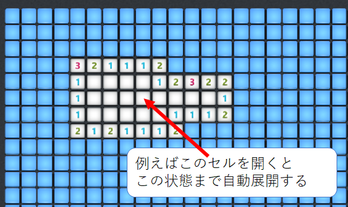

---

## まとめ

- CellState 列挙型でセルの状態（地雷・数値・空）を型安全に表現した
- Cell クラスにプロパティを実装し、状態変化と見た目の更新を連動させた
- GridLayoutGroup を使って格子状に Cell プレハブを自動配置した
- OnValidate() メソッドで Inspector 上での状態変更をリアルタイムに反映した
- 地雷配置・周囲地雷数の計算・セル公開・ゲーム終了判定は課題として残っている