## 学習目標
- 二次元配列でゲーム盤面を管理できるようになる
- 2人対戦ゲームの手番管理を実装できるようになる
- 格子状のマス目を探索して勝敗判定を実装できるようになる

## 前提知識
- [二次元配列](/unity-csharp-learning/grid-games/array-2d/) を理解していること
- Unity の Canvas・Image・GridLayoutGroup の基本操作を理解していること

## 概要

本稿は、俗に「まるばつゲーム」とも呼ばれる格子上に並べたマス目にプレイヤーが交互に「○」と「×」を書き込み、縦・横・斜めのいずれかに自分のマークを並べると勝ちとなるゲームの実装を解説します。

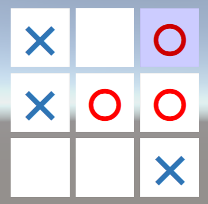

三目並べのルールについては [Wikipedia の三目並べ](https://ja.wikipedia.org/wiki/%E4%B8%89%E7%9B%AE%E4%B8%A6%E3%81%B9)のページを参考にしてください。参考実装としては、[Google で三目並べをキーワードに検索](https://www.google.com/search?q=%E4%B8%89%E7%9B%AE%E4%B8%A6%E3%81%B9)すると遊べます。

このチュートリアルを通して、以下の機能を学習します。

- 2人対戦ゲームの手番の管理
- 格子状のマス目の探索

# Unity 準備

新規シーンの状態から UI の Canvas ゲームオブジェクトを作成します。「GameObject」メニューから「UI」→「Canvas」項目を選択してください。


作成した Canvas ゲームオブジェクトに、スクリプトを設定する用のパネルを追加します。「GameObject」メニューから「UI」→「Panel」項目を選択してください。

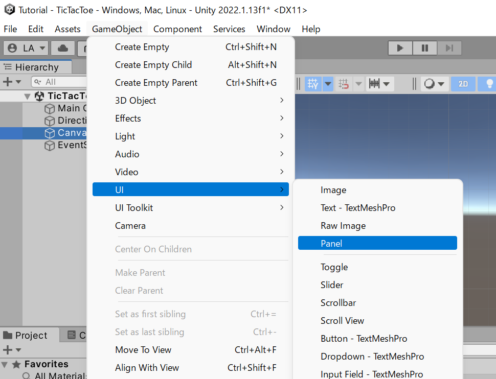

Canvas ゲームオブジェクトの直下に Panel ゲームオブジェクトが追加されます。これを、今回作成する三目並べのルートゲームオブジェクトとして利用するので、名前を "TicTacToe" に修正します。

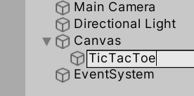

TicTacToe ゲームオブジェクト（上で追加したパネル）に、マス目上に自動レイアウトするための Grid Layout Group コンポーネントを追加します。「Component」メニューから「Layout」→「Grid Layout Group」項目を選択してください。

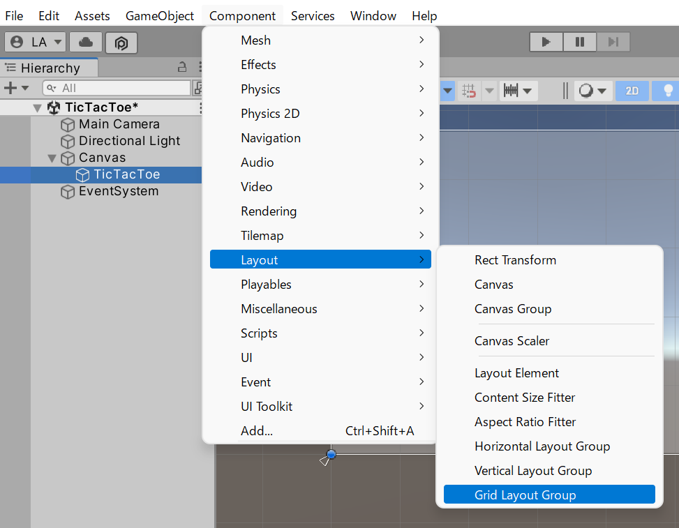

追加した Grid Layout Group コンポーネントの Spacing の X と Y の値を 10 に、Child Alignment の設定を Middle Center に変更します。グリッド上に並べるセルの行数または列数を Constraint の設定で固定化できます。今回は3目並べなので行数と列数は同じ 3 で固定します。そのため、固定するのはどちらでも構いません。例えば Constraint の設定を Fixed Column Count に変更して、下部の Constraint Count を 3 にすると列数が 3 列に固定されます。

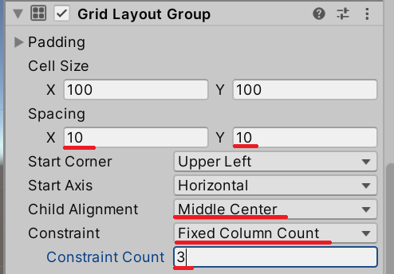

最後に C# スクリプトを作成し、TicTacToe ゲームオブジェクトに設定しましょう。TicTacToe スクリプトを作成して、TicTacToe ゲームオブジェクトに設定してください。

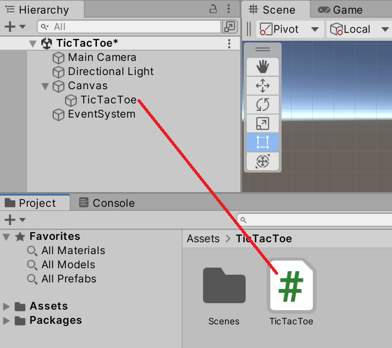

これで Unity 側の基本的な設定は終了です。

# セルの作成

このようなゲームの実装を目指す場合、ゲームを構成する要素を分解し、部品単位で実装できるように設計するべきです。三目並べは格子状に並べられたマス目に○と×を書き込む必要があります。このマス目から作っていきましょう。

このチュートリアルでは、マス目上に並べられる矩形をセル（Cell）と呼ぶことにします。

## セルを並べる

三目並べなので、セル数は3行3列の固定とします。`private void Start()` メソッドで Image コンポーネントを持つ GameObject を生成して、これをセルとして並べます。最後に、生成した GameObject の Image コンポーネントを2次元配列に格納します。

```csharp
using UnityEngine;
using UnityEngine.UI;

public class TicTacToe : MonoBehaviour
{
    private const int Size = 3;

    private Image[,] _cells;

    private void Start()
    {
        _cells = new Image[Size, Size];
        for (var r = 0; r < _cells.GetLength(0); r++)
        {
            for (var c = 0; c < _cells.GetLength(1); c++)
            {
                var obj = new GameObject($"Cell({r},{c})");
                obj.transform.parent = transform;
                var cell = obj.AddComponent<Image>();
                _cells[r, c] = cell;
            }
        }
    }
}
```

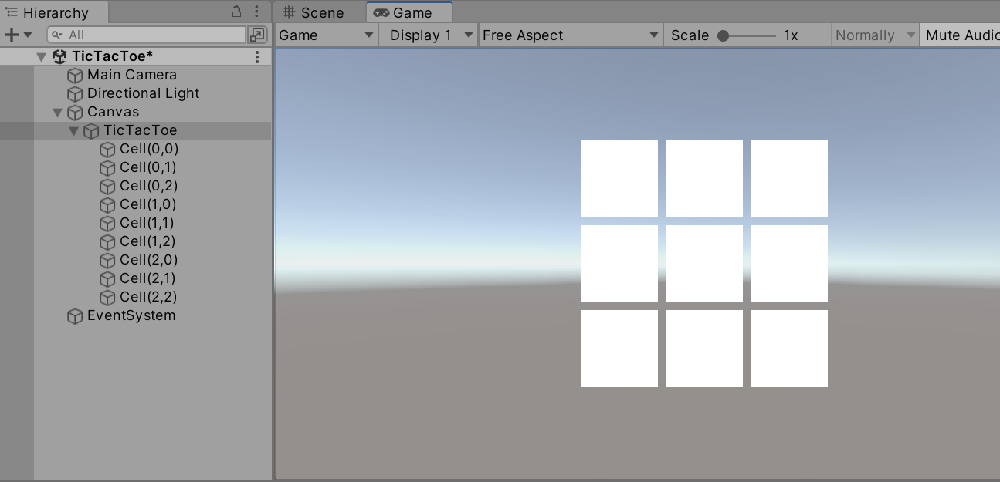

## セルの選択状態

セルに〇や×を書き込むために、まずは選択されている状態と選択されていない状態を操作できるようにしましょう。選択されているセルと選択されていないセルを見分けられるように Image コンポーネントの色を変更します。

柔軟にデザインを編集できるようにするために、選択されているセルと選択されていないセルの色を Inspector ビューから設定できるようにします。

```csharp
[SerializeField]
private Color _normalCell = Color.white;

[SerializeField]
private Color _selectedCell = Color.cyan;
```

選択されているセルを特定するために、選択行と選択列をそれぞれ保存します。選択中の行番号を `_selectedRow`、選択中の列番号を `_selectedColumn` とします。これを `private void Update()` メソッドで動かして、選択中のセルを管理します。

```csharp
using UnityEngine;
using UnityEngine.InputSystem;
using UnityEngine.UI;

public class TicTacToe : MonoBehaviour
{
    private const int Size = 3;

    private Image[,] _cells;

    [SerializeField]
    private Color _normalCell = Color.white;

    [SerializeField]
    private Color _selectedCell = Color.cyan;

    private int _selectedRow;
    private int _selectedColumn;

    private void Start()
    {
        _cells = new Image[Size, Size];
        for (var r = 0; r < _cells.GetLength(0); r++)
        {
            for (var c = 0; c < _cells.GetLength(1); c++)
            {
                var obj = new GameObject($"Cell({r},{c})");
                obj.transform.parent = transform;
                var cell = obj.AddComponent<Image>();
                _cells[r, c] = cell;
            }
        }
    }

    private void Update()
    {
        if (Keyboard.current.leftArrowKey.wasPressedThisFrame) { _selectedColumn--; }
        if (Keyboard.current.rightArrowKey.wasPressedThisFrame) { _selectedColumn++; }
        if (Keyboard.current.upArrowKey.wasPressedThisFrame) { _selectedRow--; }
        if (Keyboard.current.downArrowKey.wasPressedThisFrame) { _selectedRow++; }

        if (_selectedColumn < 0) { _selectedColumn = 0; }
        if (_selectedColumn >= Size) { _selectedColumn = Size - 1; }
        if (_selectedRow < 0) { _selectedRow = 0; }
        if (_selectedRow >= Size) { _selectedRow = Size - 1; }

        for (var r = 0; r < _cells.GetLength(0); r++)
        {
            for (var c = 0; c < _cells.GetLength(1); c++)
            {
                var cell = _cells[r, c];
                cell.color =
                    (r == _selectedRow && c == _selectedColumn)
                    ? _selectedCell : _normalCell;
            }
        }
    }
}
```

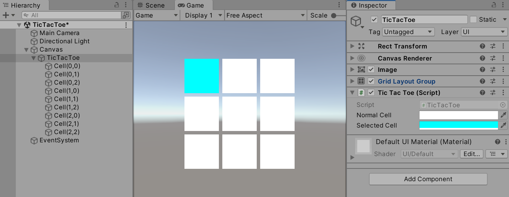

ここまでのプログラムで、上下左右キーを押して選択セルを移動できるようになりました。

## セルの状態

次に、セルが取る状態を考えてみましょう。三目並べのルール上、初期状態のセルは空（何も書かれていない）状態です。これに、プレイヤーに割り当てられた○または×マークを書き込みます。

以上のことから、セルは以下の状態を取るものと想定できます。

- 空のセル
- ○セル
- ×セル

このチュートリアルでは、単純に画像ファイルを使って○/×を表示します。以下の画像をダウンロードし（または、自分で画像を用意してもかまいません）○画像を "Circle.png"、×画像を "Cross.png" という名前で保存してください。

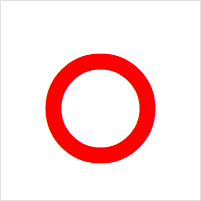


ダウンロードしたファイルを Unity の「Project」ビューの Assets フォルダー以下にドラッグ & ドロップして取り込みます。

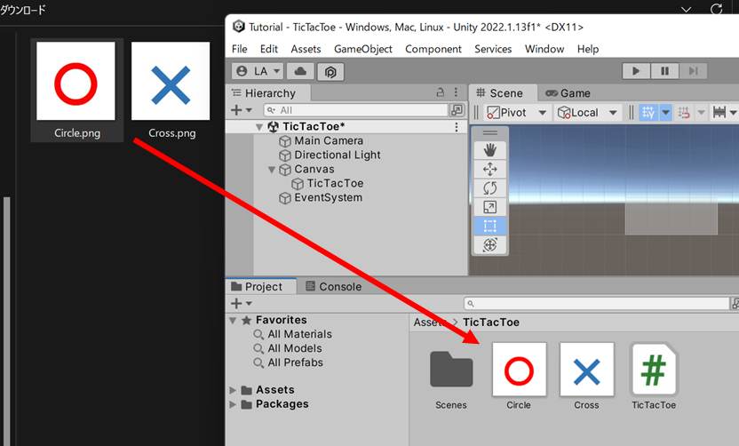

画像ファイルが Assets フォルダー下にコピーされます。次に、取り込んだ画像を UI で使えるように設定します。このファイルを選択し「Inspector」ビューの「Texture Type」を「Sprite (2D and UI)」に、「Sprite Mode」を「Single」に変更してください。

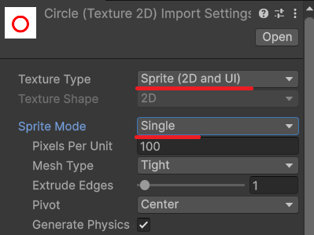

変更後「Inspector」ビュー下部の「Apply」ボタンを押すか、または変更後に Unity 上の別のゲームオブジェクト等をクリックするなどしてフォーカスを移動させようとすると変更を反映させるか確認ダイアログが表示されるので「Save」ボタンで確定させてください。

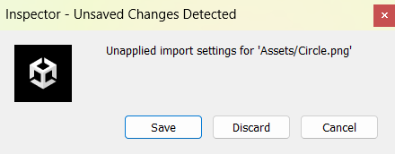

これで、取り込んだ画像ファイルを UI の Image コンポーネント等で表示できる Sprite 型として扱えるようになります。TicTacToe スクリプトで Sprite 型フィールドを用意し SerializeField を付けて Unity の Inspector ビューから設定できるようにしましょう。

```csharp
[SerializeField]
private Sprite _circle = null;

[SerializeField]
private Sprite _cross = null;
```

上記のようなフィールドを追加すれば、Unity の Inspector ビューに設定可能な Circle 項目と Cross 項目が現れます。上記の手順で取り込んだ画像を設定してください。

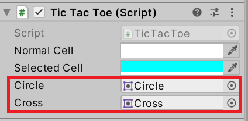

以上で準備は終了です。実行してスペースキーを押すと、選択セルの表示が〇画像に切り替わることを確認してください。

```csharp
using UnityEngine;
using UnityEngine.InputSystem;
using UnityEngine.UI;

public class TicTacToe : MonoBehaviour
{
    private const int Size = 3;

    private Image[,] _cells;

    [SerializeField]
    private Color _normalCell = Color.white;

    [SerializeField]
    private Color _selectedCell = Color.cyan;

    private int _selectedRow;
    private int _selectedColumn;

    [SerializeField]
    private Sprite _circle = null;

    [SerializeField]
    private Sprite _cross = null;

    private void Start()
    {
        _cells = new Image[Size, Size];
        for (var r = 0; r < _cells.GetLength(0); r++)
        {
            for (var c = 0; c < _cells.GetLength(1); c++)
            {
                var obj = new GameObject($"Cell({r},{c})");
                obj.transform.parent = transform;
                var cell = obj.AddComponent<Image>();
                _cells[r, c] = cell;
            }
        }
    }

    private void Update()
    {
        if (Keyboard.current.leftArrowKey.wasPressedThisFrame) { _selectedColumn--; }
        if (Keyboard.current.rightArrowKey.wasPressedThisFrame) { _selectedColumn++; }
        if (Keyboard.current.upArrowKey.wasPressedThisFrame) { _selectedRow--; }
        if (Keyboard.current.downArrowKey.wasPressedThisFrame) { _selectedRow++; }

        if (_selectedColumn < 0) { _selectedColumn = 0; }
        if (_selectedColumn >= Size) { _selectedColumn = Size - 1; }
        if (_selectedRow < 0) { _selectedRow = 0; }
        if (_selectedRow >= Size) { _selectedRow = Size - 1; }

        for (var r = 0; r < _cells.GetLength(0); r++)
        {
            for (var c = 0; c < _cells.GetLength(1); c++)
            {
                var cell = _cells[r, c];
                cell.color =
                    (r == _selectedRow && c == _selectedColumn)
                    ? _selectedCell : _normalCell;
            }
        }

        if (Keyboard.current.spaceKey.wasPressedThisFrame)
        {
            var cell = _cells[_selectedRow, _selectedColumn];
            cell.sprite = _circle;
        }
    }
}
```

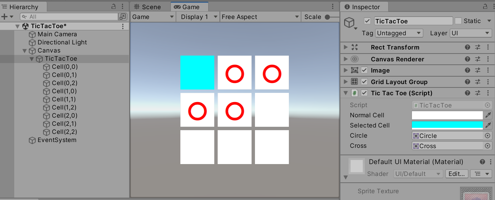

# 課題

1. 交互に○の手番と×の手番を切り替えられるようにしてください。
2. 勝敗判定を実装してください。
    1. 表示方法は自由とします。専用のUIを作ってもよいですが `Debug.Log()`で出力するだけでも構いません。
    2. 勝敗判定後、次のゲームを始めるリセット機能を実装しましょう。
3. AI と対戦できるようにしましょう。
    1. 最初はランダムにおける場所を選ぶ実装でも良いでしょう。
    2. 常に最善手を選ぶ実装を考え、実装しましょう。

## まとめ
- 二次元配列 `Image[,] _cells` でセルを管理した
- `GridLayoutGroup` コンポーネントで格子状 UI を実現した
- 課題として手番管理・勝敗判定・AI対戦の実装が残っている
