# ユニティちゃん 3D チュートリアル

著者: 赤坂玲音 / Unity バージョン: Unity 6

## 概要

本稿ではユニティ・テクノロジーズ・ジャパン株式会社が提供するユニティちゃんの3Dモデルデータを使って、3Dキャラクターを動かすための基本的な手順を解説します。

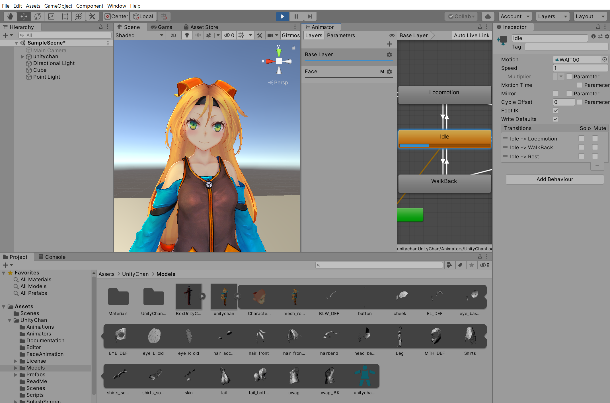

このチュートリアルを通して、以下の機能を学習します。

- アニメーターとアニメーション
    - アニメーション状態とアニメーション遷移
    - パラメータによる状態遷移
- スクリプトからアニメーターを制御する
    - アニメーションのパラメータを設定する

## ユニティちゃん

ユニティちゃんは、Unity の日本法人であるユニティ・テクノロジーズ・ジャパン合同会社が公式で企画・配布しているキャラクターです。ライセンスに従って、開発者が Unity で開発するゲームで自由に使うことができます。

以下、[公式サイト](https://unity-chan.com/)からの引用です。

> 「ユニティちゃん」は Unity Technologies Japan が提供する開発者のためのオリジナルキャラクターです。 ゲームエンジン「Unity」を使っている開発者の皆様へ、キャラクターを自由に設定できるように利用規約に準じる形でアセット（素材）として無料配布しています。
>

ユニティちゃんとして提供されているアセットは3Dキャラクターモデルの他にも、SDキャラクターモデル、2D画像（いわゆる立ち絵）、アニメーション、声（CV 角本明日香さん）などが含まれています。

## ダウンロード

公式サイトの [DATA DOWNLOAD](https://unity-chan.com/contents/guideline/) ページに移動して、ユニティちゃんライセンス条項をよく読み「ユニティちゃんライセンスに同意しました。」にチェックを入れて「データをダウンロードする」をクリックします。

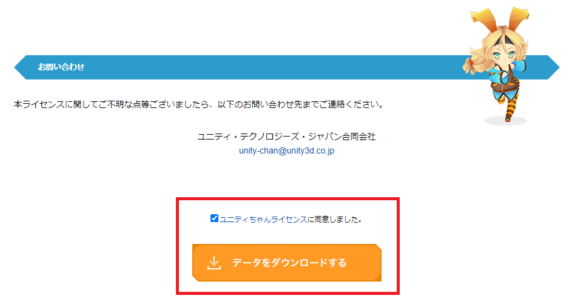

ダウンロード ページに移動するので「ユニティちゃん 3Dモデルデータ」をダウンロードしてください。本校では Version 1.4.0 を想定しています。

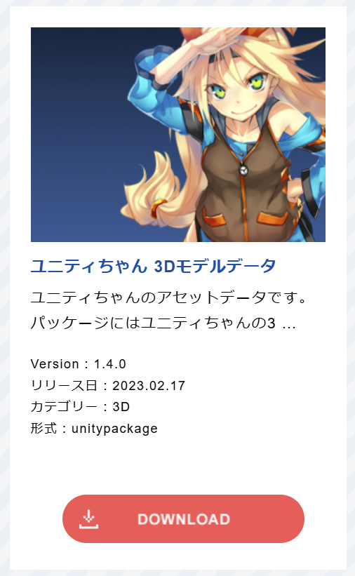

「UnityChan_1_4_0.unitypackage」という Unity パッケージファイルがダウンロードされます。

## Unity Toon Shader

ユニティちゃんの 3D モデルデータの描画には [Unity Toon Shader](https://docs.unity3d.com/ja/Packages/com.unity.toonshader@0.9/manual/index.html) が必須です。この後の項目に進む前に[マニュアルに従ってインストール](https://docs.unity3d.com/ja/Packages/com.unity.toonshader@0.9/manual/installation.html)してください。バージョンは、最新版パッケージ（com.unity.toonshader）で問題ありません。

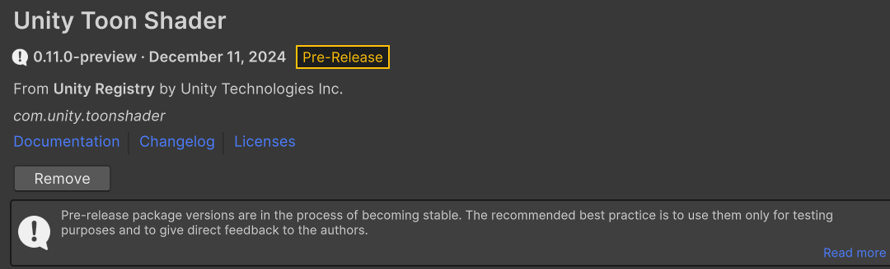

Unity Toon Shader については本稿では割愛しますが、公式マニュアルに従って設定を変更することで、キャラクター描画の塗りや輪郭線の表現を調整できます。

## インポート

新規に 3D の Unity プロジェクトを作成して、上記でダウンロードした「UnityChan_v1.4.0.unitypackage」をダブルクリックして開くか、または Unity の Project ビューにドラッグ & ドロップしてください。「Import Unity Package」ウィンドウが表示されます。

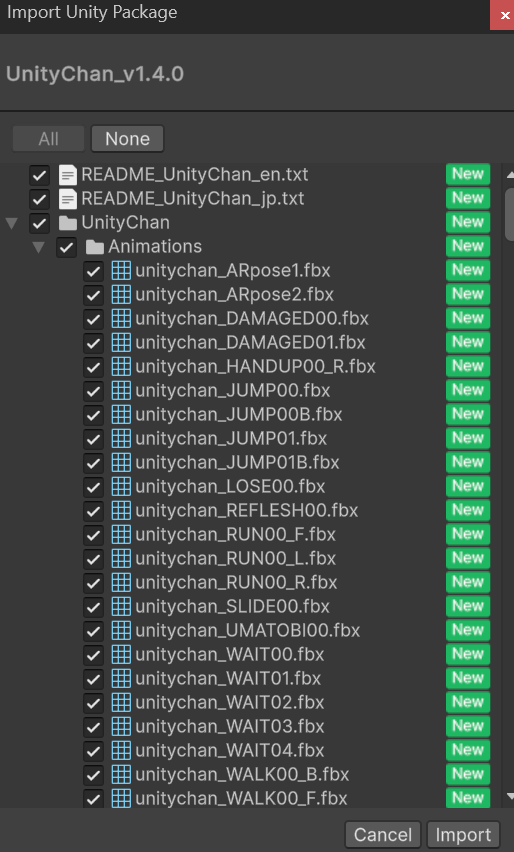

取り込みたいファイルにチェックを入れて「Import」ボタンを押します。不要なファイルがあればチェックをはずして取り込まないようにもできますが、後からファイルを消すこともできるので、とりあえず全部取り込んでしまって構いません。

この場では、全てにチェックが入っている状態で「Import」ボタンを押します。ファイルが Unity プロジェクトにアセットとして取り込まれます。

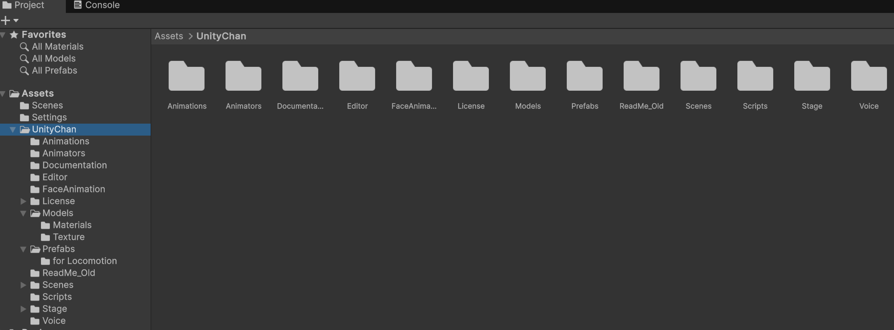

「Project」ビューのトップに「UnityChan」フォルダーが追加されていることを確認してください。

## 地面を作る

まずは Unity ちゃんを配置する地面を作りましょう。上部メニューバーから「GameObject」->「3D Object」->「Cube」を選択します。

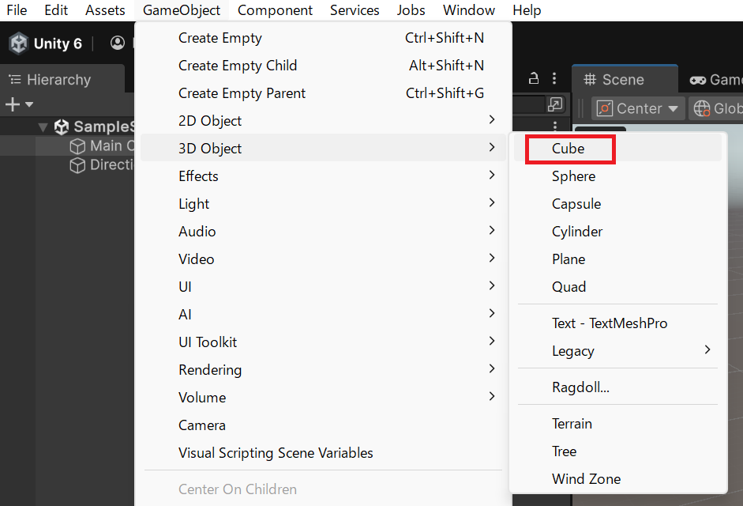

直方体が生成されるので、これを地面として使えるように適当なサイズに広げます。また、地面として使うのでゲームオブジェクトの名前を「Stage」に修正します。

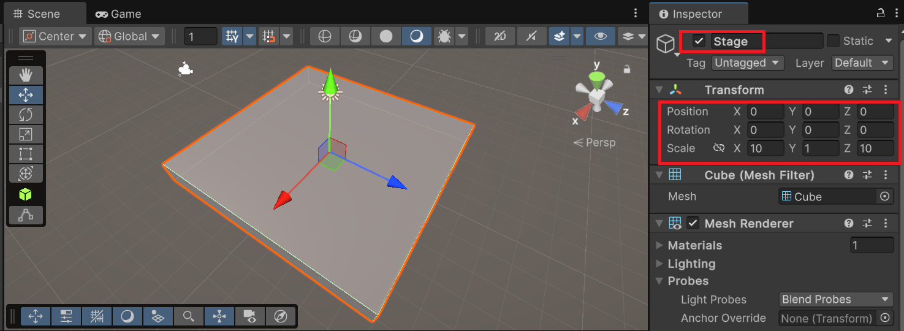

これで地面の設定は終了です。

## ユニティちゃんモデルをプレハブ化する

取り込んだアセットにユニティちゃんの 3D モデルが含まれているので、それをゲームオブジェクト化して表示します。Project ビューの Assets フォルダー内にある「UnityChan」->「Models」フォルダを選択してください。「unitychan」という項目があります。

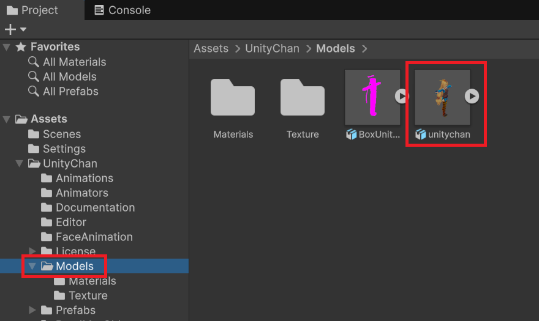

これを、上記で作成した Stage ゲームオブジェクトの上にドラッグ & ドロップしてください。地面の上にユニティちゃんが配置されるようにゲームオブジェクト化されます。

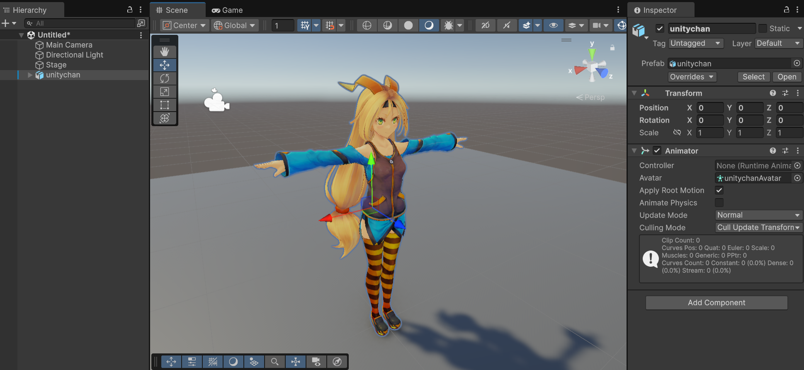

unitychan という名前のゲームオブジェクトが追加されていることを確認してください。このゲームオブジェクト選択すると、Inspector ビューにモデルデータへの参照が表示されています。

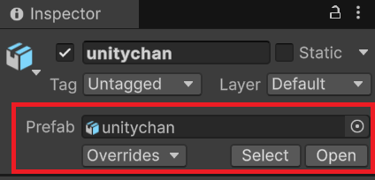

これは、指定のゲームオブジェクトが 3D モデルアセットとリンクしている状態であることを表しています。扱いはプレハブと同じですが、元データが 3D モデルなのでプレハブのようにゲームオブジェクト側の変更を保存（Overrides）できません。

そのまま unitychan ゲームオブジェクトを使っても良いのですが、この場では unitychan ゲームオブジェクトをプレハブ化しましょう。Hierarchy ビューの unitychan ゲームオブジェクトを Project ビューの Assets フォルダー下にドラッグ & ドロップしてください。

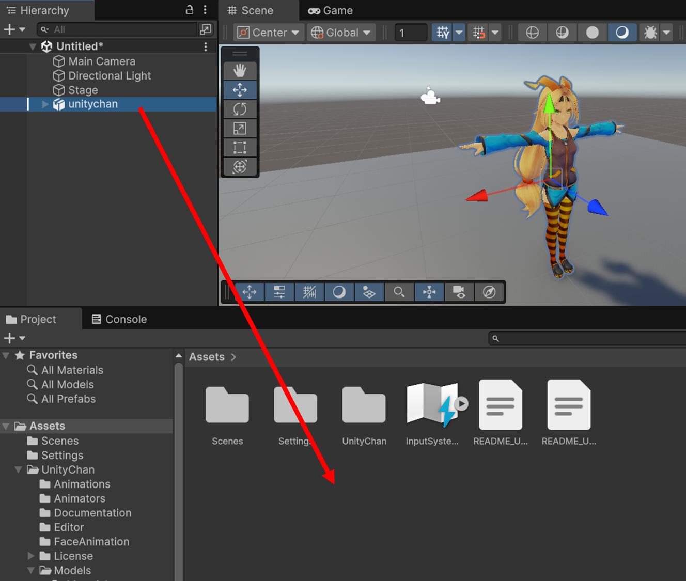

これで元のモデルデータからプレハブ化されたゲームオブジェクトが作れました。

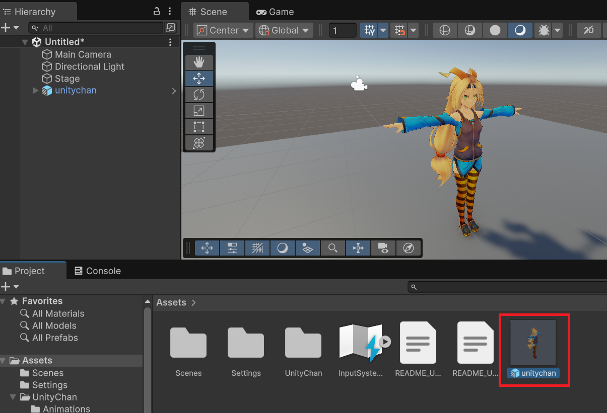

以降、コンポーネントの追加などの編集は、このプレハブ化した unitychan ゲームオブジェクトに対して行いましょう。

## アニメーションの設定

ここまでの作業でユニティちゃんのモデルを表示することができましたが T 時のポーズのままで動きません。ユニティちゃんのアセットには、3D モデルデータを動かすためのアニメーションが含まれているので、これを使ってユニティちゃんを動かしましょう。

アニメーションを有効にするには Animator コンポーネントを使います。3D モデルから作成した unitychan ゲームオブジェクトには Animator コンポーネントが追加されています。Animator コンポーネントの Controller 項目に、再生するアニメーションの状態を管理する Animator Controller を設定します。

unitychan ゲームオブジェクトを選択している状態で、Inspector ビューの「Animator」コンポーネントの「Controller」項目右端にあるボタンを押します。

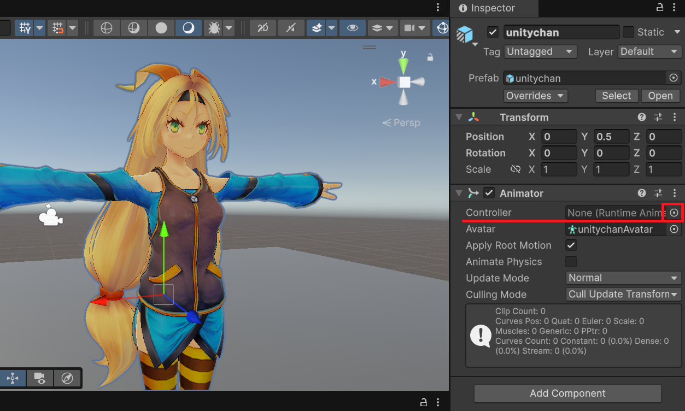

「Select RuntimeAnimatorController」ウィンドウが表示されるので、「Assets」タブから「UnityChanLocomotions」を選択してウィンドウを閉じてください。

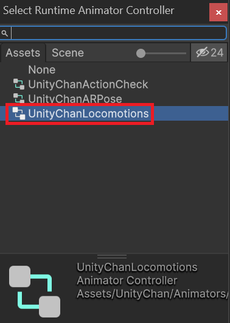

ゲームを実行すると Animator Controller が働いてユニティちゃんを動かしてくれます。ゲームを実行してみましょう。

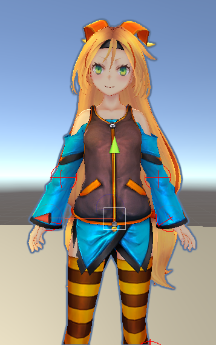

3D モデルの T ポーズから、腕を降ろした立ちポーズになり、拡大するとゆっくりと動いていることを確認できます。

## アニメーションと状態マシン

Animator コンポーネントに設定した Animator Controller とは、状態に応じて再生するアニメーションを切り替える制御を行ってくれています。Animator Controller の動きを確認してみましょう。unitychan ゲームオブジェクトを選択している状態で、Unity 上部メニューバーから「Window」->「Animation」->「Animator」メニュー項目を選択してください。

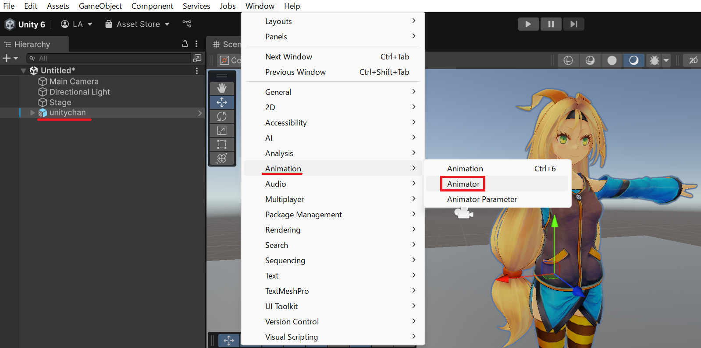

これは、現在選択している unitychan ゲームオブジェクトの Animator コンポーネントに設定されている Animator Controller （UnityChanLocomotions）の状態を表示しています。

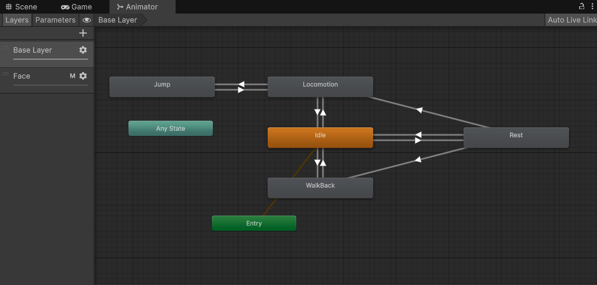

長方形の枠のことをアニメーション状態（State）と呼び、状態の間を繋いでいる矢印付きの線をアニメーション遷移（Transition）と呼びます。または、単に状態・遷移と呼んでも構いません。このような「状態」と「遷移」で挙動を管理する仕組みのことを一般に[状態マシン](https://ja.wikipedia.org/wiki/%E6%9C%89%E9%99%90%E3%82%AA%E3%83%BC%E3%83%88%E3%83%9E%E3%83%88%E3%83%B3)と呼びます。

ゲームを起動すると、この Animation Controller は既定の状態として Idle 状態になります。状態は再生するべきアニメーションを保持しています。Idel 状態をクリックして Inspector ビューを確認してください。この状態で再生するアニメーションの設定が含まれています。

各種設定の詳細は[公式マニュアル](https://docs.unity3d.com/Manual/class-State.html)を参照してください。この場で重要なのは Motion 項目に設定されている「WAIT00」が Idle 状態で再生されるアニメーションということです。

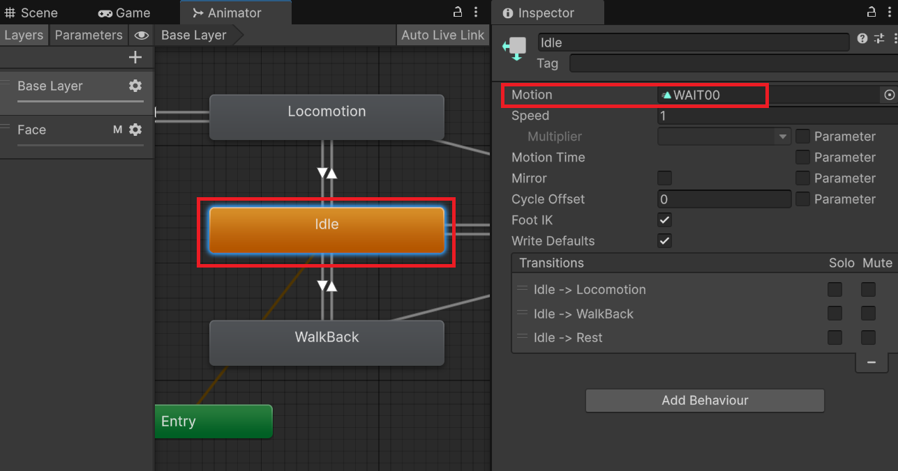

Motion に設定されているデータは Animation Clip と呼ばれる、アニメーションデータです。この Animation Clip に時間経過ごとにゲームオブジェクトを動かす詳細データが含まれています。

実行しながら Animator ビューで再生されている状態の確認を行うことができます。Scene ビューまたは Game ビューと Animator ビューを並べた状態でゲーム実行するとわかりやすいでしょう。

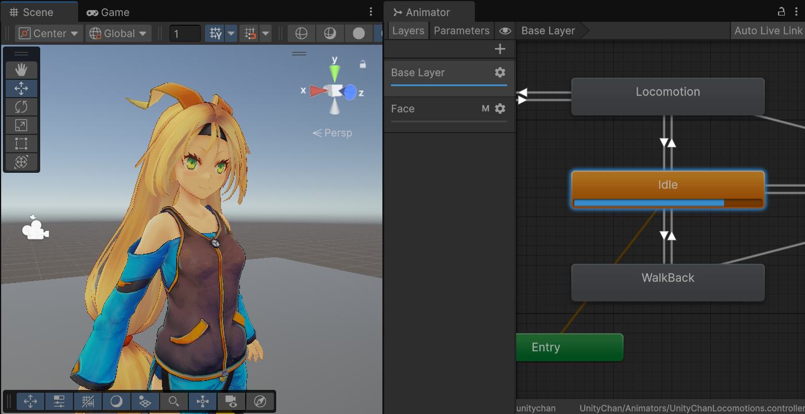

Idle 状態になると Motion に設定されている Animation Clip を繰り返し再生していることが視覚的に確認できます。

ゲームでは、実行中に様々な条件でアニメーションを切り替える必要があります。走る、ジャンプ、攻撃、被ダメージなど、ゲームの進行に合わせて適切なアニメーションを再生しなければなりません。Animator Controller は、まさにこのような状態別に再生するべき適切なアニメーションの選択を制御してくれます。

今回ユニティちゃんのアニメーション再生に使う UnityChanLocomotions では、状態の切り替えにパラメータを使っています。状態の切り替えは、各状態から別の状態に伸びている遷移に従います。例えば、Idle 状態から Locomotion 状態に伸びている矢印を選択してください。

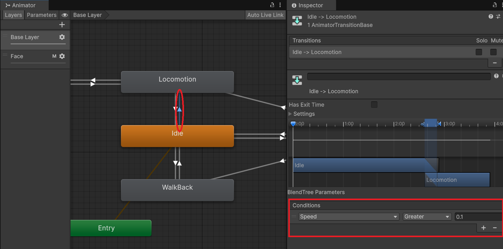

これには Idle 状態から Locomotion 状態に移行する設定や条件が含まれています。Inspector ビューに表示されている Conditions という設定に注目してください。これが遷移条件を表しています。

遷移条件は、指定のパラメータが指定の条件を満たしているかどうかを表します。上記の例では「Speed パラメータが 0.1 より大きければ」 Idle 状態から Locomotion 状態に遷移すること表します。では、Speed パラメータとは何でしょう。

Animator Controller は制作者が任意のパラメータを持たせることができ、これを制御することで状態を切り替えられます。パラメータの確認や編集を行うには Animator ビューの「Paramaters」タブを選択してください。

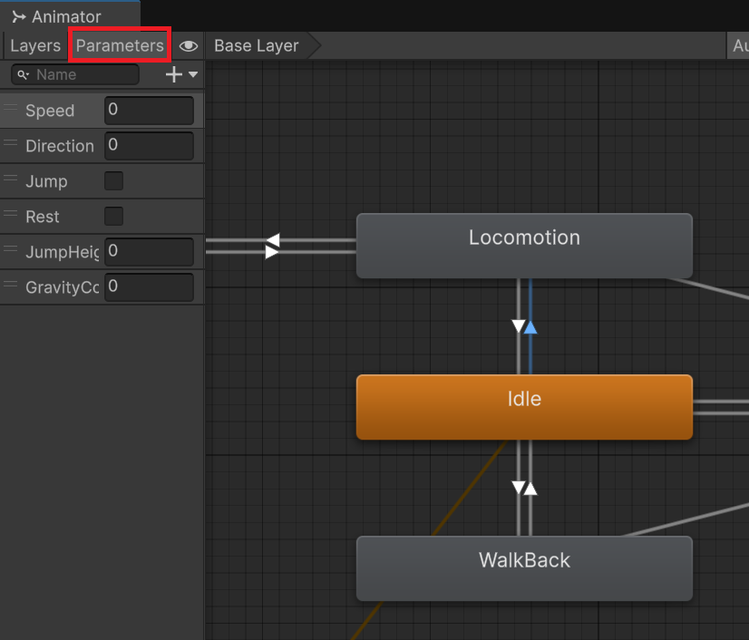

ここに定義されたアニメーション用のパラメータと、その初期値が設定されています。パラメータの種類（型）には整数（Int）、実数（Float）、チェック（Bool）などがあります。

この Paramaters タブの一覧に Speed パラメータが定義済みであることに注目してください。Speed パラメータは実数型で初期値は 0.0 になっています。ここで Idel 状態からLocomotion 状態に遷移する条件を思い出しましょう。Speed パラメータが 0.1 より大きければ遷移する条件なので、この値を 0.1 より大きな値にすれば状態が Locomotion に移動し、再生するアニメーションが変化します。

<video controls src="./video.mp4"></video>

Locomotion は移動アニメーションを表す状態で、内部で歩行アニメーションと走るアニメーションを Speed パラメータから混合して再生しています。例えば Speed 値が 0.1 程度であればゆっくり歩き、1.0 に近くなるほど走るアニメーションになります。実行しながら値を修正できるので、どのようにアニメーションが変化するか試してみてください。

アニメーションの遷移を確認できたら Speed パラメータの値を 0.0 に戻してください。Locomotion 状態から Idle 状態への遷移条件が 「Speed パラメータの値が 0.1 より小さければ」なので、元の Idle 状態に戻ります。

## スクリプトからアニメーションパラメータを設定する

仕掛けを理解できたところで、今度はスクリプトからアニメーションを制御する方法を考えましょう。

まずは unitychan ゲームオブジェクトにスクリプトを追加します。名前は UnityChanLocomotor とします。

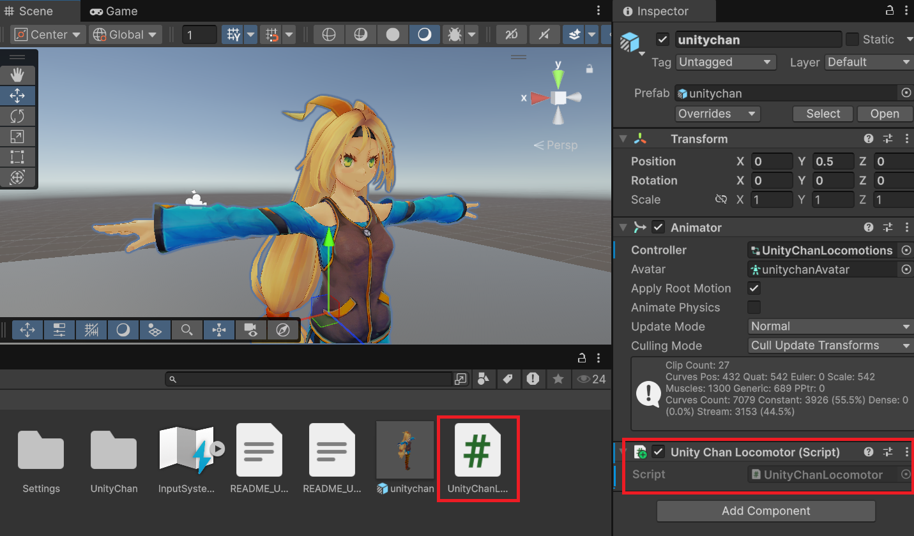

実際のゲームでは、プレイヤーがコントローラーなどを操作した入力を受けてキャラクターを動かすことになります。そのためスクリプトで入力を検知して、そこから `Animator` コンポーネントを通して Animator Controller のパラメータを操作することでアニメーションを切り替えます。

前述した Animator Controller の Speed パラメータをスクリプトから設定するには [Animator クラスの SetFloat() メソッド](https://docs.unity3d.com/ScriptReference/Animator.SetFloat.html)を使います。名前から想像できるように、整数なら [Animator クラスの SetInteger() メソッド](https://docs.unity3d.com/ScriptReference/Animator.SetInteger.html)、チェックなら[Animator クラスの SetBool() メソッド](https://docs.unity3d.com/ScriptReference/Animator.SetBool.html)で設定できます。

```csharp
public void SetFloat(string name, float value);
public void SetInteger(string name, int value);
public void SetBool(string name, bool value);
```

- name パラメータ: パラメータ名
- value パラメータ: 設定するパラメータの値

この場で設定したいのは実数型の Speed パラメータなので、SetFloat() メソッドの name パラメータに文字列で "Speed" を指定し、value パラメータに値を設定します。

```csharp
using UnityEngine;

public class UnityChanLocomotor : MonoBehaviour
{
    private void Start()
    {
        var animator = GetComponent<Animator>();
        animator.SetFloat("Speed", 1.0F);
    }
}
```

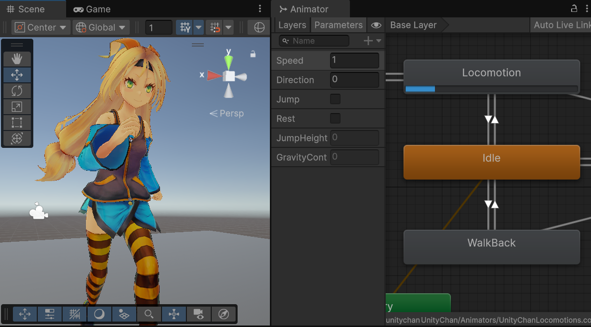

実行結果

上記のコードは、ゲーム実行時にゲームオブジェクトに設定されている Animator コンポーネントを取得し、そこから SetFloat() メソッドで Speed パラメータの値を 1.0 に変更しています。

前述した Unity の Animator ウィンドウから直接値を設定した場合と同じように、Speed パラメータの値が 0.1 より大きくなると Locomotion 状態に移行します。ゲーム開始時点で Unity ちゃんが走るアニメーションになっているはずです。

## 入力に合わせてアニメーションを切り替える

アニメーションパラメータの設定方法が理解できれば、あとは入力に合わせて適切な値を Animator に設定すれば良いだけです。

仮想軸を使えば、都合良く -1.0 ～ 1.0 の範囲でキー入力（方向スティックの傾き）を得ることができます。今回、ユニティちゃんに使っている UnityChanLocomotions のパラメータは、この仮想軸からの入力を想定しているようなので、この値をそのまま渡せば入力とアニメーションが上手く連動します。

> **注意: 旧 Input システム**  
> 以下のコードは旧 Input System（`Input.GetAxis`）を使用しています。Unity 6 では新しい Input System が推奨されますが、旧 Input System も引き続き使用できます。詳しくは [旧 Input](/unity-csharp-learning/unity/legacy-input/) を参照してください。  
> エラーが出る場合は、Project Settings → Player → Active Input Handling を「Input Manager (Old)」または「Both」に変更してください。

```csharp
using UnityEngine;

public class UnityChanLocomotor : MonoBehaviour
{
    private Animator _animator;

    private void Start()
    {
        _animator = GetComponent<Animator>();
    }

    private void Update()
    {
        var v = Input.GetAxis("Vertical");
        _animator.SetFloat("Speed", v);
    }
}
```

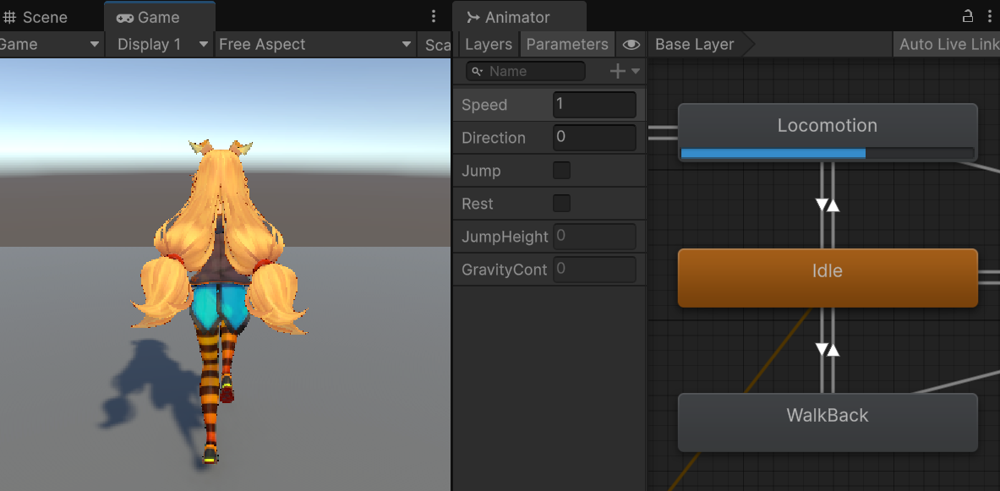

実行結果

上記のコードは Vertical 仮想軸から得られた値を、そのまま Speed アニメーションパラメータに渡しています。そのため ↑ キーを押すと 1.0 に向かう値が得られるので、連動してユニティちゃんが走ります。コントローラーの方向スティックが使える場合、少しだけ傾けると 1.0 より小さい値が得られるので、ゆっくり歩くアニメーションも再生できます。

逆に ↓ キーを押すと -1.0 に向かう値が得られるので Idle 状態から WalkBack 状態への遷移条件が満たされます。Speed パラメータの値が -0.1 より小さければ WalkBack 状態に遷移し、逆に -0.1 より大きければ Idle 状態に戻ります。WalkBack 状態になるとユニティちゃんが後退するような歩行アニメーションが再生されます。

## 課題

### 課題1 左右の傾きモーションを追加しよう

Horizontal 仮想軸に対応して左右に曲がるアニメーションを再生できるようにしましょう。UnityChanLocomotions に Direction パラメータが定義されているので、このパラメータを -1.0 ～ 1.0 の範囲で設定すると左右に傾いて歩行または走るようになります。

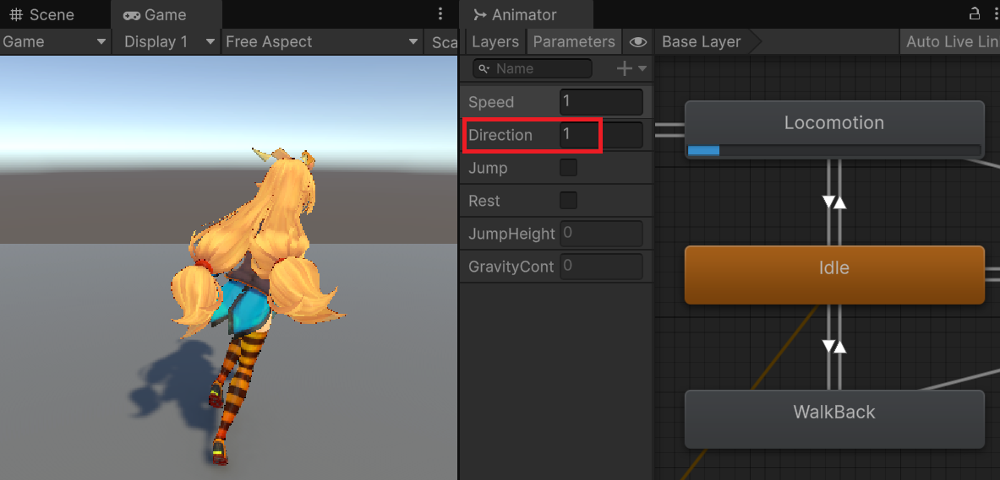

### 課題2 ジャンプさせてみよう

スペースキーなど任意のボタンに反応する形でユニティちゃんをジャンプさせてみましょう。Locomotion 状態から Jump 状態に遷移させれば、ジャンプアニメーションが再生されます。

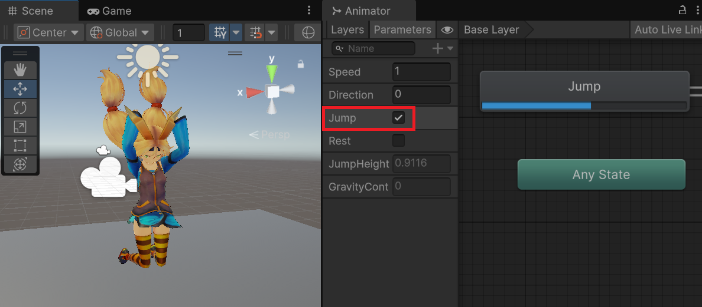

### 課題3 休憩モーション

一定時間（例えば10秒間）何も操作されなかった場合、Rest 状態に遷移させるようにしましょう。ユニティちゃんが休憩（腕を伸ばす）アニメーションに切り替わります。

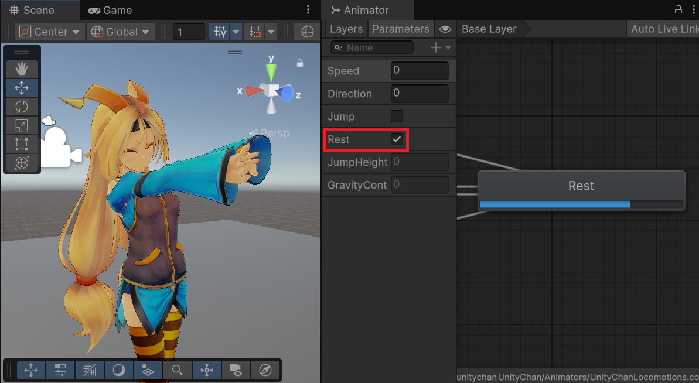

### 課題4 移動とアニメーションの連動

ここまではアニメーションだけを再生しているだけなので、歩く・走るなどのアニメーションを再生してもユニティちゃんはその場で足踏みをしているだけで移動はしませんでした。アニメーションと連動して、ユニティちゃんがステージの上で移動したり、向きを変えたりできるようにしましょう。

移動や回転は Transform コンポーネントを使ってもよいですが、アクション性のあるゲームを前提とするなら Rigidbody コンポーネントを unitychan ゲームオブジェクトに追加して、Rigidbody コンポーネントから力を加えるやり方も検討してください。

## 参考

[UNITY-CHAN! OFFICIAL WEBSITE](https://unity-chan.com/)
