# SD ユニティちゃんチュートリアル

本稿ではユニティ・テクノロジーズ・ジャパン株式会社が提供するユニティちゃんのSDキャラクターモデルを使って、3Dキャラクターを動かすための基本的な手順を解説します。

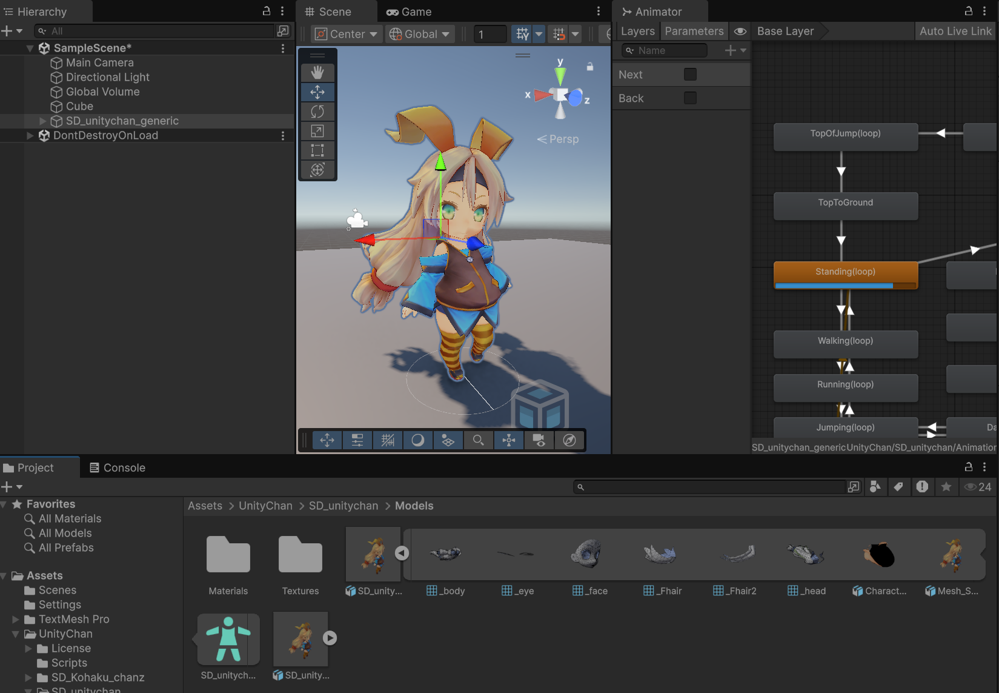

## 学習目標

- スクリプトから `Animator.Play()` を呼び出してアニメーションを切り替えられる
- アニメーションに設定されたイベント（表情変更など）をスクリプトで受信できる
- キーボード入力に連動してキャラクターアニメーションを制御できる

## 前提知識

- [Unity 基礎](/unity-csharp-learning/unity/) を一通り完了していること
- C# の基本的な文法（クラス・メソッド・フィールド）を理解していること

---

## ユニティちゃん

ユニティちゃんは、Unity の日本法人であるユニティ・テクノロジーズ・ジャパン合同会社が公式で企画・配布しているキャラクターです。ライセンスに従って、開発者が Unity で開発するゲームで自由に使うことができます。

以下、[公式サイト](https://unity-chan.com/)からの引用です。

> 「ユニティちゃん」は Unity Technologies Japan が提供する開発者のためのオリジナルキャラクターです。 ゲームエンジン「Unity」を使っている開発者の皆様へ、キャラクターを自由に設定できるように利用規約に準じる形でアセット（素材）として無料配布しています。
>

ユニティちゃんとして提供されているアセットは3Dキャラクターモデルの他にも、SDキャラクターモデル、2D画像（いわゆる立ち絵）、アニメーション、声（CV 角本明日香さん）などが含まれています。

## ダウンロード

公式サイトの [DATA DOWNLOAD](https://unity-chan.com/contents/guideline/) ページに移動して、ユニティちゃんライセンス条項をよく読み「ユニティちゃんライセンスに同意しました。」にチェックを入れて「データをダウンロードする」をクリックします。

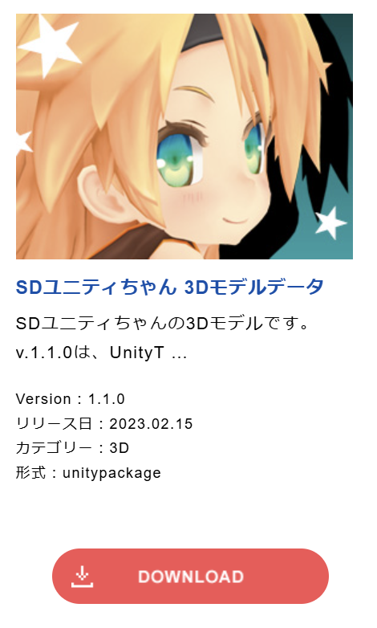

ダウンロード ページに移動するので「SDユニティちゃん 3Dモデルデータ」をダウンロードしてください。本稿では Version 1.1.0 を想定しています。


「SD_UnityChan_v1.1.0.unitypackage」という Unity パッケージファイルがダウンロードされます。

## Unity Toon Shader

ユニティちゃんの 3D モデルデータの描画には [Unity Toon Shader](https://docs.unity3d.com/ja/Packages/com.unity.toonshader@0.9/manual/index.html) が必須です。この後の項目に進む前に[マニュアルに従ってインストール](https://docs.unity3d.com/ja/Packages/com.unity.toonshader@0.9/manual/installation.html)してください。バージョンは、最新版パッケージ（com.unity.toonshader）で問題ありません。

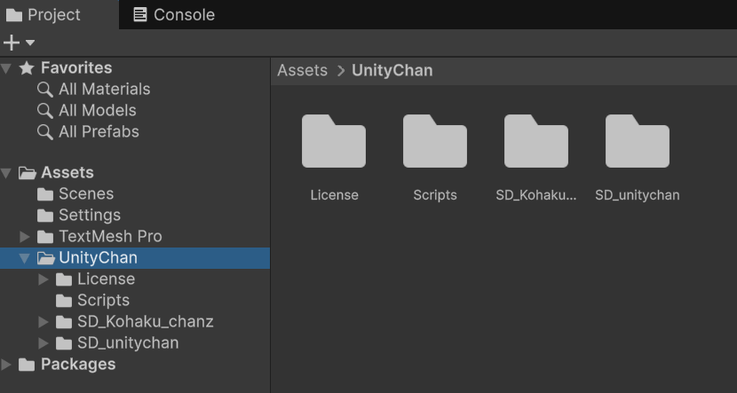

Unity Toon Shader については本稿では割愛しますが、公式マニュアルに従って設定を変更することで、キャラクター描画の塗りや輪郭線の表現を調整できます。

## インポート

新規に 3D の Unity プロジェクトを作成して、上記でダウンロードした「SD_UnityChan_v1.1.0.unitypackage」をダブルクリックして開くか、または Unity の Project ビューにドラッグ & ドロップしてください。「Import Unity Package」ウィンドウが表示されます。

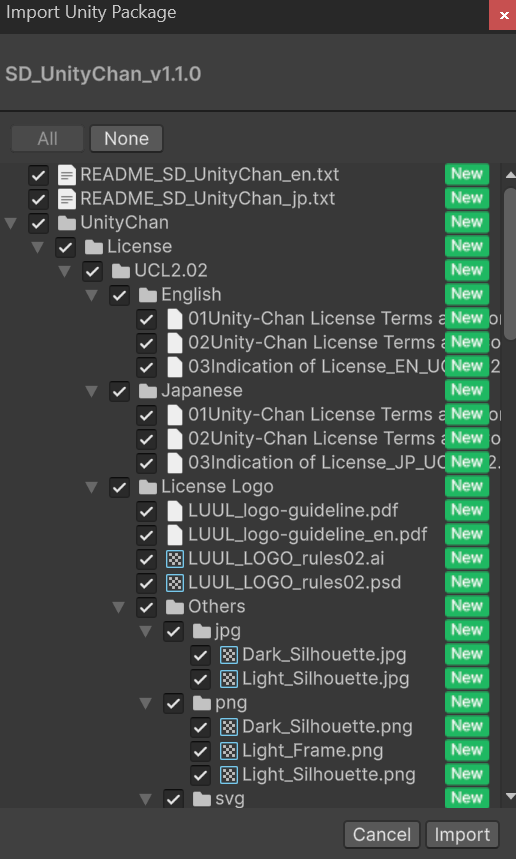

取り込みたいファイルにチェックを入れて「Import」ボタンを押します。不要なファイルがあればチェックをはずして取り込まないようにもできますが、後からファイルを消すこともできるので、とりあえず全部取り込んでしまって構いません。

この場では、全てにチェックが入っている状態で「Import」ボタンを押します。ファイルが Unity プロジェクトにアセットとして取り込まれます。


「Project」ビューのトップに「UnityChan」フォルダーが追加されていることを確認してください。

## 地面を作る

まずは Unity ちゃんを配置する地面を作りましょう。上部メニューバーから「GameObject」→「3D Object」→「Cube」を選択します。

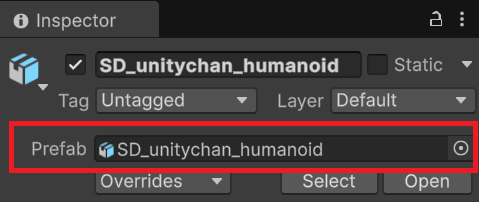

直方体が生成されるので、これを地面として使えるように適当なサイズに広げます。また、地面として使うのでゲームオブジェクトの名前を「Stage」に修正します。

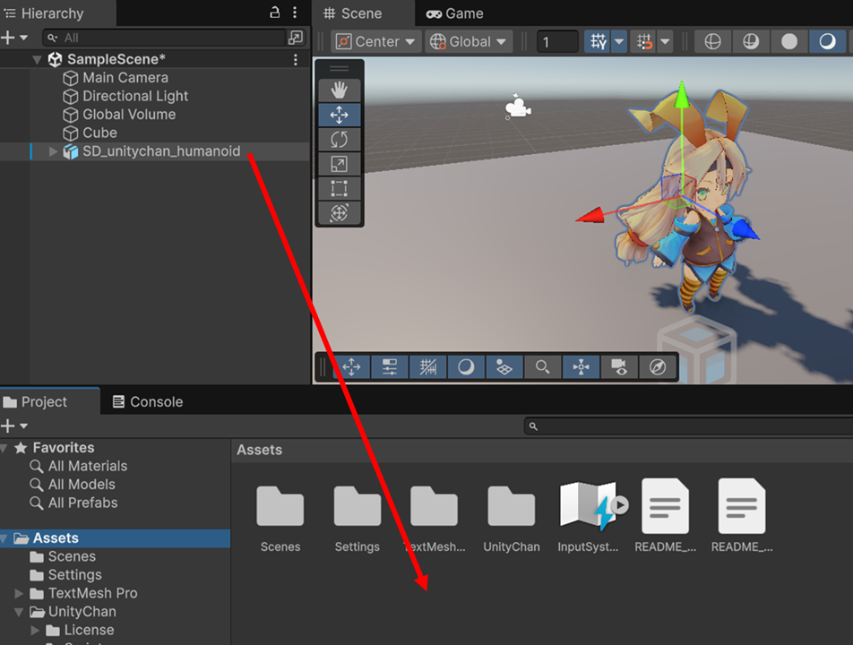

これで地面の設定は終了です。

## ユニティちゃんモデルをプレハブ化する

取り込んだアセットにユニティちゃんの 3D モデルが含まれているので、それをゲームオブジェクト化して表示します。Project ビューの Assets フォルダー内にある「UnityChan」→「SD_unitychan」→「Models」フォルダを選択してください。「SD_unitychan_humanoid」という項目があります。

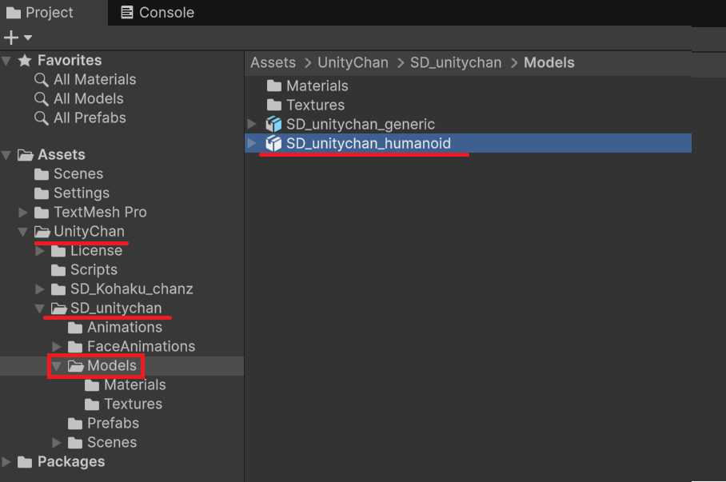

これを、上記で作成した Stage ゲームオブジェクトの上にドラッグ & ドロップしてください。地面の上にユニティちゃんが配置されるようにゲームオブジェクト化されます。

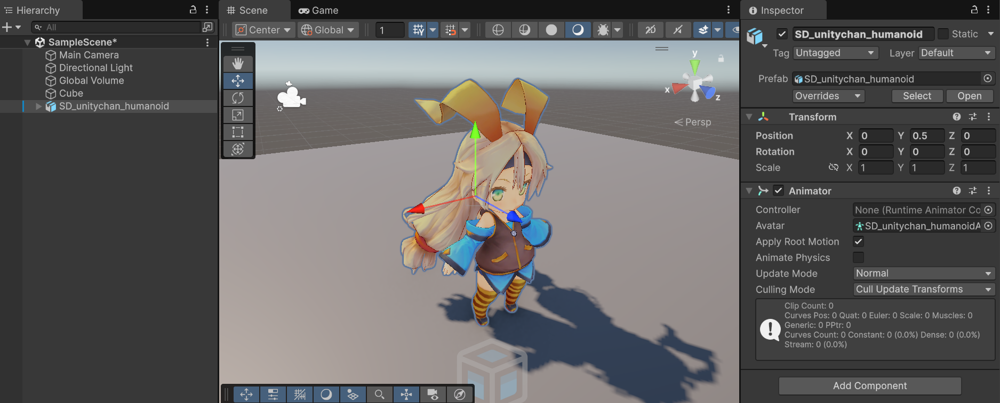

SD_unitychan_humanoid という名前のゲームオブジェクトが追加されていることを確認してください。このゲームオブジェクト選択すると、Inspector ビューにモデルデータへの参照が表示されています。


これは、指定のゲームオブジェクトが 3D モデルアセットとリンクしている状態であることを表しています。扱いはプレハブと同じですが、元データが 3D モデルなのでプレハブのようにゲームオブジェクト側の変更を保存（Overrides）できません。

そのまま unitychan ゲームオブジェクトを使っても良いのですが、この場では unitychan ゲームオブジェクトをプレハブ化しましょう。Hierarchy ビューの SD_unitychan_humanoid ゲームオブジェクトを Project ビューの Assets フォルダー下にドラッグ & ドロップしてください。


これで元のモデルデータからプレハブ化されたゲームオブジェクトが作れました。

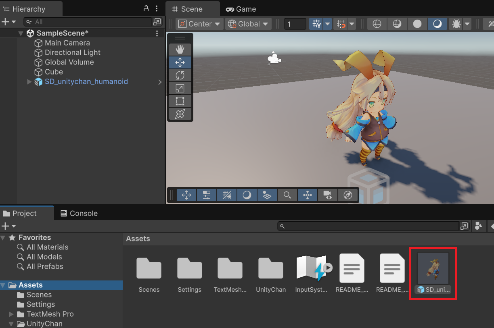

以降、コンポーネントの追加などの編集は、このプレハブ化した SD_unitychan_humanoid ゲームオブジェクトに対して行いましょう。

## アニメーションの設定

ここまでの作業でユニティちゃんのモデルを表示することができましたが T 時のポーズのままで動きません。ユニティちゃんのアセットには、3D モデルデータを動かすためのアニメーションが含まれているので、これを使ってユニティちゃんを動かしましょう。

アニメーションを有効にするには Animator コンポーネントを使います。3D モデルから作成した unitychan ゲームオブジェクトには Animator コンポーネントが追加されています。Animator コンポーネントの Controller 項目に、再生するアニメーションの状態を管理する Animator Controller を設定します。

SD_unitychan_humanoid ゲームオブジェクトを選択している状態で、Inspector ビューの「Animator」コンポーネントの「Controller」項目右端にあるボタンを押します。

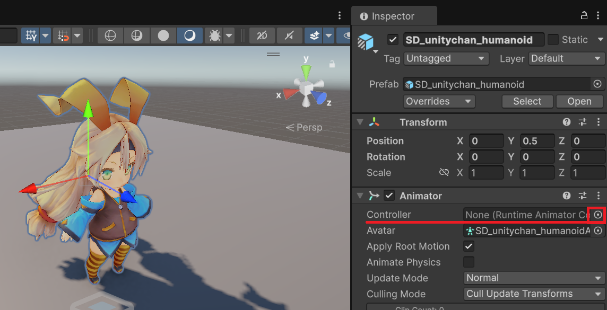

「Select Runtime Animator Controller」ウィンドウが表示されるので、「Assets」タブから「SD_unitychan_motion_humanoid」を選択してウィンドウを閉じてください。

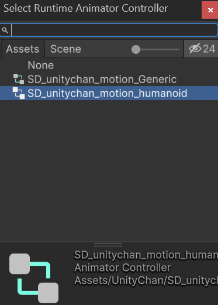

ゲームを実行すると Animator コンポーネントに設定されている Controller が働いてユニティちゃんを動かしてくれます。ゲームを実行してみましょう。

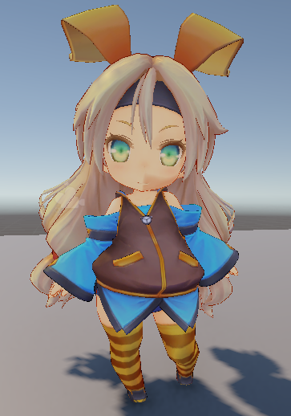

3D モデルの静止した状態ではない立ちポーズ（待機モーション）になり、拡大するとゆっくりと動いていることを確認できます。

## アニメーション クリップ

取り込んだユニティちゃんの 3D モデルには、立ちポーズ以外にも複数のアニメーションデーターが組み込まれています。このような、個別のアニメーションのことをアニメーション クリップと呼びます。

実行する前に、再生可能なアニメーションを確認してみましょう。ユニティちゃん（SD_unitychan_humanoid ゲームオブジェクト）を選択している状態で「Window」メニューの「Animation」→「Animation」項目を選択してください。

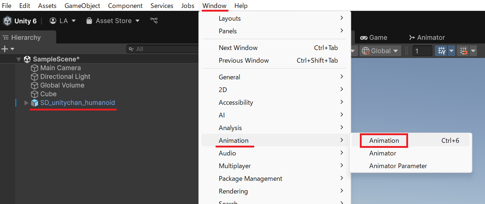

「Animation」ウィンドウが表示され、Animator に設定されている Controller に紐づけられているアニメーションをプレビューできます。

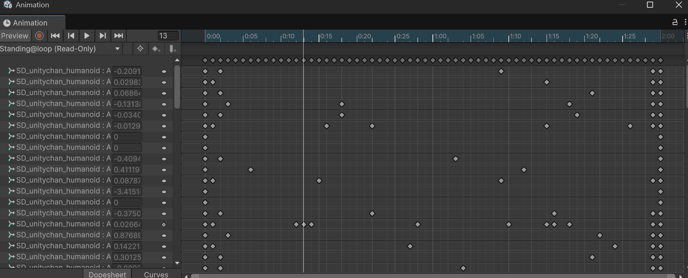

ウィンドウ左上の再生ボタンを押すと、現在設定されているアニメーションクリップをプレビュー再生できます。

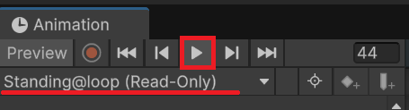

「Standing@loop (Read-Only)」と書かれているドロップダウンリストをクリックすると、選択可能なアニメーションの一覧が表示され、切り替えることができます。

## プログラムからアニメーションを切り替える

スクリプトからアニメーションを制御して、入力に合わせてキャラクターが動くようにしてみましょう。まずは ユニティちゃん（SD_unitychan_humanoid ゲームオブジェクト）にスクリプトを追加します。名前は UnityChanSDMotion とします。

アニメーションの切り替えは [`UnityEngine.Animator` クラス](https://docs.unity3d.com/ScriptReference/Animator.html)を通して行います。

```csharp
public class Animator : Behaviour
```

再生するアニメーションを切り替えるには [`Animator` クラスの `Play()` メソッド](https://docs.unity3d.com/ScriptReference/Animator.Play.html)を使います。

```csharp
public void Play(string stateName)
```

- stateName パラメータ: 再生するアニメーションの状態名。

このメソッドのパラメータに指定する文字列は、Animator に設定されているアニメーションコントローラーに設定されている状態名です。アニメーションコントローラーの詳細は、本稿では割愛します。SDユニティちゃんでは、前述した Animation ウィンドウで確認したアニメーションクリップの名前が、そのまま状態として登録されています。そのため "Standing@loop" や "Running@loop" といった名前で、目的のアニメーションを再生できます。

```csharp
using UnityEngine;

public class UnityChanSDMotion : MonoBehaviour
{
    private void Start()
    {
        var animator = GetComponent<Animator>();
        animator.Play("Running@loop");
    }
}
```

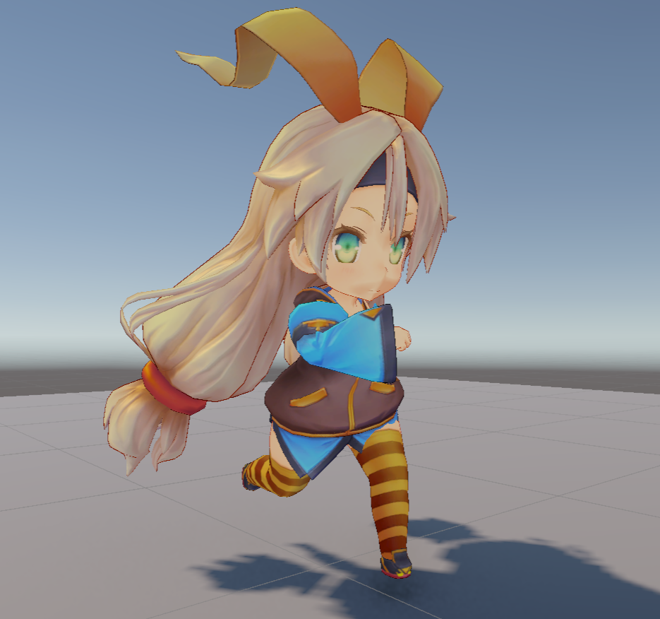

実行結果

上記のコードでは Start() メソッドで Animator コンポーネントを取得し animator 変数に保存しています。このスクリプトを設定するゲームオブジェクトには、必ず Animator コンポーネントが設定されている前提となります。

以降、animator 変数を通して Animator コンポーネントを操作できるようになります。

問題なく動作しているようですが「Console」ビューを見るとエラーが出ていると思います。

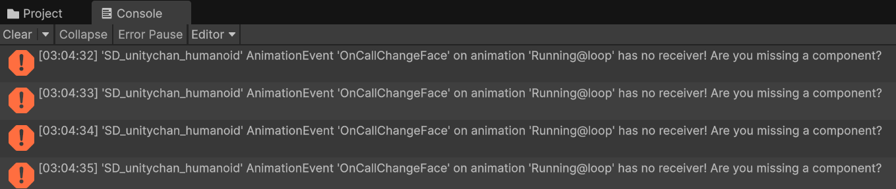

このエラーは再生しているアニメーションが送信しているメッセージを受信するコンポーネントが存在しないことを通知しており、実行動作そのものには影響ありません。このアニメーションには、特定のタイミングで表情を変更する要求が `OnCallChangeFace` というイベントで通知されます。同じゲームオブジェクトに設定している任意のコンポーネントで、以下のメソッドを実装して処理することで警告を消せます。

```csharp
private void OnCallChangeFace(string stateName)
```

stateName パラメータに face レイヤーの再生する状態名が含まれているので、これを再生するだけです。ただし、別のアニメーションに切り替わった時に表情レイヤーをリセットしないと、表情がそのまま継続してしまいます。以下の表情管理を専用に行うスクリプトを作成して SD_unitychan_humanoid ゲームオブジェクトに設定してください。

```csharp
using UnityEngine;

[RequireComponent(typeof(Animator))]
public class FacialHandler : MonoBehaviour
{
    private Animator _animator;
    private int _faceLayer;
    private int _previousState;

    private void Start()
    {
        _animator = GetComponent<Animator>();
        _faceLayer = _animator.GetLayerIndex("face");
    }

    private void Update()
    {
        var info = _animator.GetCurrentAnimatorStateInfo(0);

        if (_previousState != info.shortNameHash)
        {
            // 前の状態と異なる場合、表情レイヤーをリセット
            _animator.SetLayerWeight(_faceLayer, 0);
            _animator.Play("default@sd_hmd", _faceLayer);
            _previousState = info.shortNameHash;
        }
    }

    private void OnCallChangeFace(string stateName)
    {
        // アニメーションに設定されている表情更新イベントを反映
        _animator.SetLayerWeight(_faceLayer, 1);
        _animator.Play(stateName, _faceLayer);
    }
}
```

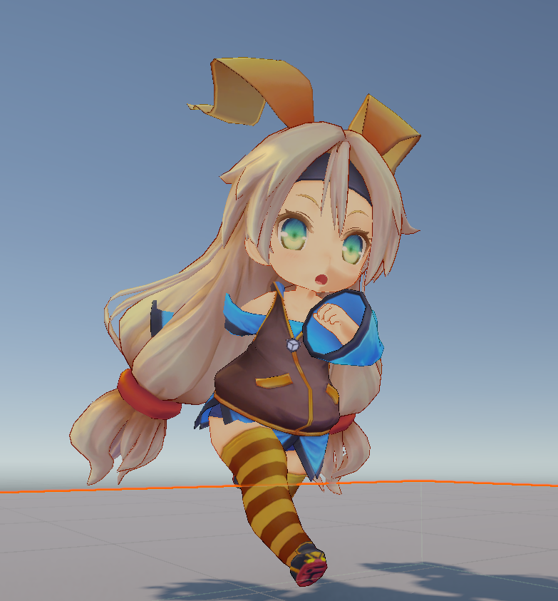

これで、アニメーション再生中の表情変更イベントに対応できます。より細かい表情管理を行いたい場合はアニメーションのデータを研究して工夫してください。

では、キャラクター操作の UnityChanSDMotion クラスに戻りましょう。入力に合わせてアニメーションを切り替えることで、キャラクターを自然に動かすことができるようになります。

```csharp
using UnityEngine;
using UnityEngine.InputSystem;

public class UnityChanSDMotion : MonoBehaviour
{
    private Animator _animator;

    private void Start()
    {
        _animator = GetComponent<Animator>();
    }

    private void Update()
    {
        if (Keyboard.current.upArrowKey.isPressed)
        {
            _animator.Play("Running@loop");
        }
    }
}
```

[Input System](/unity-csharp-learning/unity/input-system/) の `Keyboard.current.upArrowKey.isPressed` は上キーを押している間 `true` を返すので、キーが押されている間、連続で Play() メソッドを呼び出すことになりますが、同じ状態のアニメーションの再生はリセットされることなく維持されるので問題ありません。

Play() メソッドでアニメーションを変更すると状態が維持されるので、キーを離しても走ったままです。キーを離したときに、元の立ちモーションに戻すには "Standing@loop" を再生します。

```csharp
using UnityEngine;
using UnityEngine.InputSystem;

public class UnityChanSDMotion : MonoBehaviour
{
    private Animator _animator;

    private void Start()
    {
        _animator = GetComponent<Animator>();
    }

    private void Update()
    {
        if (Keyboard.current.upArrowKey.isPressed)
        {
            _animator.Play("Running@loop");
        }
        else
        {
            _animator.Play("Standing@loop");
        }
    }
}
```

これで、上キーを押している時に Running@loop を、押していないときに Standing@loop を再生するようになり、アニメーションが正しく切り替わります。

---

## まとめ

- **Animator.Play()** メソッドで再生するアニメーション状態を名前で直接切り替えられます
- Animation Clip 名（例: `"Running@loop"`）をそのまま状態名として指定できます
- アニメーションに仕込まれたイベント（例: 表情変更）は、同じゲームオブジェクトのコンポーネントにメソッドを実装することで受信できます
- `Keyboard.current.upArrowKey.isPressed` でキー入力を検知して、アニメーションの切り替えを制御できます
