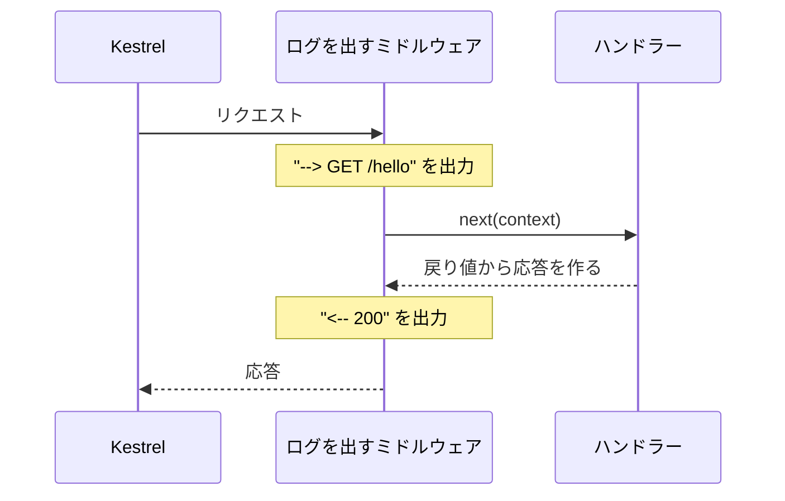

# ASP.NET Core でサーバーを作る

[TCP で受け取る](/unity-csharp-learning/networking/tcp-receive/) と [TCP で送る](/unity-csharp-learning/networking/tcp-send/) では、HTTP のリクエストと応答を手作業で読み書きしました。このページでは、Web アプリを作るためのフレームワークである **ASP.NET Core** を使って、HTTP サーバーを作り直します。リクエストの読み取りや応答の組み立ては ASP.NET Core に任せ、ここからは「どのリクエストに、何を返すか」を書くことに集中します。

## 学習目標

このページを読み終えると、以下のことができるようになります。

- TCP で作ったサーバーに足りなかった機能と、ASP.NET Core が引き受けてくれることを説明できる
- `dotnet new web` でプロジェクトを作り、決まった URL でサーバーを起動できる
- `MapGet` で、パスとハンドラーを結び付けられる
- ミドルウェアを書いて、届いたリクエストと返した応答をログに出せる

## 前提知識

- [TCP で送る](/unity-csharp-learning/networking/tcp-send/) を読んでいること。このページでは、そのページで作ったクライアント（`SampleClient`）も使います
- [ラムダ式](/unity-csharp-learning/csharp/lambda/) を読んでいること

---

## 1. 手作業のサーバーに足りないもの

[TCP で受け取る](/unity-csharp-learning/networking/tcp-receive/) で作ったサーバーは、HTTP の仕組みを確かめるには十分でしたが、実際に使うには足りないものがたくさんあります。

| 足りないもの | 困ること |
|---|---|
| パスを見ていない | `/` にも `/favicon.ico` にも同じ応答を返してしまう |
| 本文を読んでいない | クライアントからデータを受け取れない |
| 接続を 1 つずつしか処理できない | 何も送ってこない接続があると、ほかの接続が待たされる |
| 応答のたびに接続を閉じる | リクエストのたびに接続を作り直すので、無駄が多い |

これらを自分で作るのは大変です。**ASP.NET Core** は、Microsoft が提供する、.NET で Web アプリを作るためのフレームワークです。ASP.NET Core には **Kestrel**（ケストレル）という HTTP サーバーが組み込まれていて、接続の受け付け、リクエストの解析、応答の送信、複数の接続の同時処理などを引き受けてくれます。

ASP.NET Core で作ったサーバーも、コンソールアプリとして起動します。ここまでと同じように、ターミナルで起動して、ログを見ながら動作を確かめられます。

---

## 2. プロジェクトを作る

作業用のフォルダーで、`web` テンプレートからプロジェクトを作ります。`web` は、最小限の ASP.NET Core アプリを作るテンプレートです。

```powershell
dotnet new web -n SampleHttpServer
cd SampleHttpServer
```

次のファイルが作られます。

| ファイル | 説明 |
|---|---|
| `Program.cs` | コードファイル |
| `SampleHttpServer.csproj` | プロジェクト設定ファイル。`Sdk="Microsoft.NET.Sdk.Web"` と書かれていて、ASP.NET Core を使えるようになっている |
| `appsettings.json`、`appsettings.Development.json` | アプリの設定ファイル。このシリーズでは、まだ使わない |
| `Properties/launchSettings.json` | `dotnet run` で起動するときの設定ファイル |

生成された `Program.cs` は、次のようになっています。

```csharp
var builder = WebApplication.CreateBuilder(args);
var app = builder.Build();

app.MapGet("/", () => "Hello World!");

app.Run();
```

`using` ディレクティブがないのは、`.csproj` の設定で、ASP.NET Core でよく使う名前空間が自動で読み込まれるようになっているからです。

---

## 3. 最小のサーバー

`Program.cs` を次のように書き換えます。

```csharp
WebApplicationBuilder builder = WebApplication.CreateBuilder(args);
WebApplication app = builder.Build();

app.MapGet("/", () => "こんにちは、ASP.NET Core です");

app.Run("http://localhost:8080");
```

4 行で、HTTP サーバーができました。1 行ずつ見ていきます。

**書式：[WebApplication.CreateBuilder メソッド](https://learn.microsoft.com/dotnet/api/microsoft.aspnetcore.builder.webapplication.createbuilder)**
```csharp
public static WebApplicationBuilder CreateBuilder(string[] args);
```

**書式：[WebApplicationBuilder.Build メソッド](https://learn.microsoft.com/dotnet/api/microsoft.aspnetcore.builder.webapplicationbuilder.build)**
```csharp
public WebApplication Build();
```

ASP.NET Core のアプリは、2 つの段階で作ります。

| 段階 | 使うもの | すること |
|---|---|---|
| 準備する段階 | `WebApplicationBuilder` | アプリが使う設定や機能を集める |
| 動かす段階 | `WebApplication` | どのリクエストに何を返すかを決めて、サーバーを動かす |

`CreateBuilder` で準備する段階のオブジェクトを作り、`Build` で動かす段階のオブジェクトに変えます。`args` は、コマンドラインから渡された引数です。このページでは準備する段階で何もしないので、すぐに `Build` しています。なぜ 2 つの段階に分かれているのかは、後の回で詳しく扱います。

**書式：[EndpointRouteBuilderExtensions.MapGet メソッド](https://learn.microsoft.com/dotnet/api/microsoft.aspnetcore.builder.endpointroutebuilderextensions.mapget)**
```csharp
public static RouteHandlerBuilder MapGet(this IEndpointRouteBuilder endpoints, string pattern, Delegate handler);
```

| パラメータ | 説明 |
|---|---|
| `pattern` | パスのパターン。ここでは `/` |
| `handler` | リクエストが届いたときに呼び出すメソッド（デリゲート）。ラムダ式で渡せる |

`MapGet` は、「`GET` メソッドで、パスが `pattern` に一致するリクエストが届いたら、`handler` を呼び出す」という対応を登録します。リクエストを処理するメソッドを**ハンドラー**（handler）と呼びます。ハンドラーが文字列を返すと、ASP.NET Core はそれを本文にして、`Content-Type: text/plain; charset=utf-8` の応答を返します。

**書式：[WebApplication.Run メソッド](https://learn.microsoft.com/dotnet/api/microsoft.aspnetcore.builder.webapplication.run)**
```csharp
public void Run(string? url = null);
```

`Run` は、指定した URL でサーバーを起動し、Ctrl+C で止めるまで動き続けます。前の回と同じポート 8080 で待ち受けるように、URL を指定しています。

> 💡 **ポイント**: URL を指定しないと、`Properties/launchSettings.json` の `applicationUrl` に書かれた URL で起動します。この URL のポート番号は、プロジェクトを作るたびにランダムに決まります。このシリーズでは、どの環境でも同じ URL になるように、`Run` で指定します。

サーバーを起動します。前の回の `SampleServer` が動いていたら、先に Ctrl+C で止めておきます（理由は「[よくあるミス](#よくあるミス)」で説明します）。

```powershell
dotnet run
```

実行結果の例です。フォルダーのパスは環境によって変わります。

```
C:\Work\SampleHttpServer\Properties\launchSettings.json からの起動設定を使用中...
ビルドしています...
info: Microsoft.Hosting.Lifetime[14]
      Now listening on: http://localhost:8080
info: Microsoft.Hosting.Lifetime[0]
      Application started. Press Ctrl+C to shut down.
info: Microsoft.Hosting.Lifetime[0]
      Hosting environment: Development
info: Microsoft.Hosting.Lifetime[0]
      Content root path: C:\Work\SampleHttpServer
```

`info:` で始まる行は、ASP.NET Core が出力するログです。`Now listening on: http://localhost:8080` は、ポート 8080 で待ち受けを始めたことを表しています。

別のターミナルから curl でアクセスします。

```powershell
curl.exe -i http://localhost:8080/
```

実行結果の例です。`Date` の日時は実行するたびに変わります。

```
HTTP/1.1 200 OK
Content-Type: text/plain; charset=utf-8
Date: Sun, 27 Sep 2026 17:30:00 GMT
Server: Kestrel
Transfer-Encoding: chunked

こんにちは、ASP.NET Core です
```

[TCP で受け取る](/unity-csharp-learning/networking/tcp-receive/) で手作業で組み立てた応答と、同じ書式の応答が返ってきました。ステータス行と `Content-Type` は、ハンドラーが文字列を返しただけで ASP.NET Core が書いてくれています。`Date`（応答した日時）と `Server`（サーバーのソフトウェアの名前）も、自動で付け加えられています。`Content-Length` の代わりに付いている `Transfer-Encoding: chunked` は、「6. TCP のクライアントで確かめる」で説明します。

---

## 4. パスごとにハンドラーを登録する

`MapGet` を増やすと、パスごとに別のハンドラーを呼び出せます。`app.Run` の前に、次の行を追加します。

```csharp
app.MapGet("/hello", () => "ハンドラーが呼ばれました");
```

サーバーを起動し直して、3 つのパスにアクセスします。

```powershell
curl.exe http://localhost:8080/
curl.exe http://localhost:8080/hello
curl.exe -i http://localhost:8080/nothing
```

`/` と `/hello` には、それぞれのハンドラーが返した文字列が表示されます。

```
こんにちは、ASP.NET Core です
ハンドラーが呼ばれました
```

登録していない `/nothing` には、次の応答が返ります。実行結果の例です。`Date` の日時は実行するたびに変わります。

```
HTTP/1.1 404 Not Found
Content-Length: 0
Date: Sun, 27 Sep 2026 17:30:00 GMT
Server: Kestrel
```

ステータスコード `404` は、「指定されたパスに対応するものが見つからない」ことを表します。どのハンドラーにも一致しないリクエストには、ASP.NET Core が自動で `404` を返します。

リクエストのメソッドとパスを見て、呼び出すハンドラーを決めることを**ルーティング**（routing）と呼びます。TCP で作ったサーバーに足りなかった「パスを見ていない」は、ルーティングで解決します。

---

## 5. リクエストと応答をログに出す

サーバーのターミナルを見ると、起動したときのログのほかには、何も表示されていません。ASP.NET Core は、標準の設定では、届いたリクエストをログに出さないからです。これでは、TCP で作ったサーバーのように、通信の様子を見ることができません。

そこで、届いたリクエストのメソッドとパス、返した応答のステータスコードをログに出す処理を追加します。`Program.cs` を次のように書き換えます。

```csharp
WebApplicationBuilder builder = WebApplication.CreateBuilder(args);
WebApplication app = builder.Build();

app.Use(async (context, next) =>
{
    HttpRequest request = context.Request;
    Console.WriteLine($"--> {request.Method} {request.Path}{request.QueryString}");
    await next(context);
    Console.WriteLine($"<-- {context.Response.StatusCode}");
});

app.MapGet("/", () => "こんにちは、ASP.NET Core です");
app.MapGet("/hello", () => "ハンドラーが呼ばれました");

app.Run("http://localhost:8080");
```

### ミドルウェア

ASP.NET Core では、届いたリクエストは、登録された処理を順番に通ってからハンドラーに届きます。この、ハンドラーの手前に並ぶ処理を**ミドルウェア**（middleware）と呼びます。ミドルウェアは、次の処理を呼び出す前と後の両方で、処理を行えます。



**書式：[UseExtensions.Use メソッド](https://learn.microsoft.com/dotnet/api/microsoft.aspnetcore.builder.useextensions.use)**
```csharp
public static IApplicationBuilder Use(this IApplicationBuilder app, Func<HttpContext, RequestDelegate, Task> middleware);
```

`Use` は、ミドルウェアを登録します。ミドルウェアはラムダ式で書き、2 つの引数を受け取ります。

| 引数 | 型 | 説明 |
|---|---|---|
| `context` | `HttpContext` | 1 回のリクエストと応答に関する情報をまとめたオブジェクト |
| `next` | `RequestDelegate` | 次の処理（次のミドルウェアか、ハンドラー）。`next(context)` で呼び出す |

`next(context)` を `await` すると、次の処理が終わるまで待ちます。その前に書いたコードはリクエストがハンドラーに届く前に、後に書いたコードは応答ができた後に実行されます。そのため、前でリクエストを、後で応答のステータスコードをログに出せます。

[HttpContext](https://learn.microsoft.com/dotnet/api/microsoft.aspnetcore.http.httpcontext) からは、次のような情報を取り出せます。

| 式 | 内容 | 例 |
|---|---|---|
| `context.Request.Method` | メソッド | `GET` |
| `context.Request.Path` | パス | `/hello` |
| `context.Request.QueryString` | `?` から後ろの部分（クエリ文字列） | `?x=1` |
| `context.Response.StatusCode` | 応答のステータスコード | `200` |

クエリ文字列は、URL の `?` の後ろに `名前=値` の形で付け加える情報です。次の回で使います。

サーバーを起動し直して、前の節と同じ 3 つのパスにアクセスすると、サーバーのログに次のように表示されます。

```
--> GET /
<-- 200
--> GET /hello
<-- 200
--> GET /nothing
<-- 404
```

`-->` がサーバーに届いたリクエスト、`<--` がサーバーが返した応答です。どのパスにアクセスし、どんな結果になったのかが、ログで確かめられるようになりました。

> 💡 **ポイント**: ミドルウェアは、登録した順番に並びます。`Use` は、`MapGet` より前に書きます。

---

## 6. TCP のクライアントで確かめる

[TCP で送る](/unity-csharp-learning/networking/tcp-send/) で作った `SampleClient` を、このサーバーに接続してみます。`SampleClient` のリクエストは、[TCP で送る](/unity-csharp-learning/networking/tcp-send/) の「3. リクエストを送る」のときの内容に戻しておきます。「5. サーバーからクライアントは見えない」で書き換えたままだと、`Connection: close` を送らないので、Kestrel は接続を閉じず、`ReadToEndAsync` が戻りません。

```csharp
string request =
    "GET /hello HTTP/1.1\r\n" +
    "Host: localhost:8080\r\n" +
    "Connection: close\r\n" +
    "\r\n";
```

`SampleClient` のフォルダーで実行します。

```powershell
dotnet run
```

実行結果の例です。`Date` の日時は実行するたびに変わります。

```
--- 接続しました
--- リクエストを送りました
HTTP/1.1 200 OK
Connection: close
Content-Type: text/plain; charset=utf-8
Date: Sun, 27 Sep 2026 17:30:18 GMT
Server: Kestrel
Transfer-Encoding: chunked

24
ハンドラーが呼ばれました
0

```

curl では表示されなかった `24` と `0` が、本文の前後に表示されています。これが、`Transfer-Encoding: chunked` の書式です。

`Transfer-Encoding: chunked` は、本文をいくつかのかたまり（**チャンク**）に分けて送る方法です。各チャンクの前に、そのチャンクの長さを 16 進数で書きます。`24` は 16 進数で、10 進数では 36 です。`ハンドラーが呼ばれました` は 12 文字で、UTF-8 では 1 文字 3 バイトなので、ちょうど 36 バイトです。最後に長さ `0` のチャンクを送って、本文の終わりを知らせます。

curl は `Transfer-Encoding: chunked` を理解しているので、長さの行を取り除いて本文だけを表示します。`SampleClient` は応答をそのまま表示しているので、長さの行も見えています。ASP.NET Core は、ハンドラーが文字列を返したときなど、応答の書き方によっては、`Content-Length` の代わりにこの方法を使います。

また、応答に `Connection: close` が付いています。`SampleClient` がリクエストに `Connection: close` を書いたので、Kestrel は応答の後に接続を閉じました。そのため、`SampleClient` の `ReadToEndAsync` は戻ってきます。

サーバーのログには、ほかのクライアントと同じように表示されます。

```
--> GET /hello
<-- 200
```

---

## 7. 同時に複数の接続を処理する

サーバーを動かしたまま、ブラウザで `http://localhost:8080/` を開きます。ブラウザに `こんにちは、ASP.NET Core です` と表示され、サーバーのログには次のように表示されます。

```
--> GET /
<-- 200
--> GET /favicon.ico
<-- 404
```

`/favicon.ico` のハンドラーは登録していないので、`404` が返っています。パスによって応答が変わるようになりました。

[TCP で受け取る](/unity-csharp-learning/networking/tcp-receive/) では、ブラウザが作った何も送ってこない接続のために、ほかの接続が待たされる問題がありました。Kestrel は、複数の接続を同時に処理するので、この問題は起きません。ブラウザで開いた直後に curl を実行しても、すぐに応答が返ってきます。

複数の接続を同時に処理するということは、複数のリクエストのハンドラーが、別々のスレッドで同時に呼び出されることがあるということです。ハンドラーから同じデータを読み書きするときは、この点に注意が必要になります。次の回で扱います。

---

## よくあるミス

### TCP で作ったサーバーを止め忘れる

前の回の `SampleServer` がポート 8080 で動いたままだと、`SampleHttpServer` は起動に失敗します。

```
fail: Microsoft.Extensions.Hosting.Internal.Host[11]
      Hosting failed to start
      System.IO.IOException: Failed to bind to address http://127.0.0.1:8080: address already in use.
```

[TCP で受け取る](/unity-csharp-learning/networking/tcp-receive/) の「よくあるミス」と同じく、1 つのポートで待ち受けられるのは 1 つのプログラムだけです。`SampleServer` を Ctrl+C で止めてから起動し直します。

---

## まとめ

- ASP.NET Core は、.NET で Web アプリを作るためのフレームワーク。組み込みの HTTP サーバー Kestrel が、接続の受け付け、リクエストの解析、応答の送信、複数の接続の同時処理を引き受ける
- `dotnet new web` でプロジェクトを作り、`WebApplication.CreateBuilder` で準備し、`Build` で作った `WebApplication` を `Run` で起動する
- `MapGet` で、パスとハンドラーを結び付ける。一致するハンドラーがないリクエストには、自動で `404` が返る
- ハンドラーの手前に並ぶ処理をミドルウェアと呼ぶ。`Use` で登録し、`next(context)` の前後でリクエストと応答を扱える
- `Transfer-Encoding: chunked` は、本文をチャンクに分け、それぞれの長さを 16 進数で前に書いて送る方法

---

## 理解度チェック

1. TCP で作ったサーバーでは、ブラウザが作った何も送ってこない接続のために、ほかの接続が待たされました。ASP.NET Core のサーバーでこの問題が起きないのはなぜですか？
2. 次のサーバーに `curl.exe http://localhost:8080/bye` を実行すると、ステータスコードはいくつになりますか？

   ```csharp
   WebApplicationBuilder builder = WebApplication.CreateBuilder(args);
   WebApplication app = builder.Build();

   app.MapGet("/hello", () => "こんにちは");

   app.Run("http://localhost:8080");
   ```

3. このページで作ったミドルウェアで、`<--` を出力する行を `await next(context);` より前に移しました。この状態で `curl.exe http://localhost:8080/nothing` を実行すると、ログの `<--` の行には何と表示されますか？
4. `Transfer-Encoding: chunked` の応答で、あるチャンクの長さの行が `1e` でした。このチャンクは何バイトですか？

<details markdown="1">
<summary>解答を見る</summary>

1. Kestrel が、複数の接続を同時に処理するからです。1 つの接続がリクエストを送ってこなくても、ほかの接続のリクエストを処理できます。
2. `404` です。`/bye` に一致するハンドラーが登録されていないので、ASP.NET Core が自動で `404` を返します。
3. `<-- 200` と表示されます。`next(context)` を呼ぶ前は、まだ応答が作られていないので、`StatusCode` は既定の `200` のままです。curl が受け取る応答は `404` なので、ログと実際の応答が食い違います。
4. 30 バイトです。`1e` は 16 進数で、10 進数では 1×16 + 14 = 30 です。

</details>

---

## 次のステップ

[HTTP のメソッドとステータスコード](/unity-csharp-learning/networking/http-methods/) では、`GET` 以外のメソッドを使って、サーバーにデータを追加したり、書き換えたり、削除したりします。
