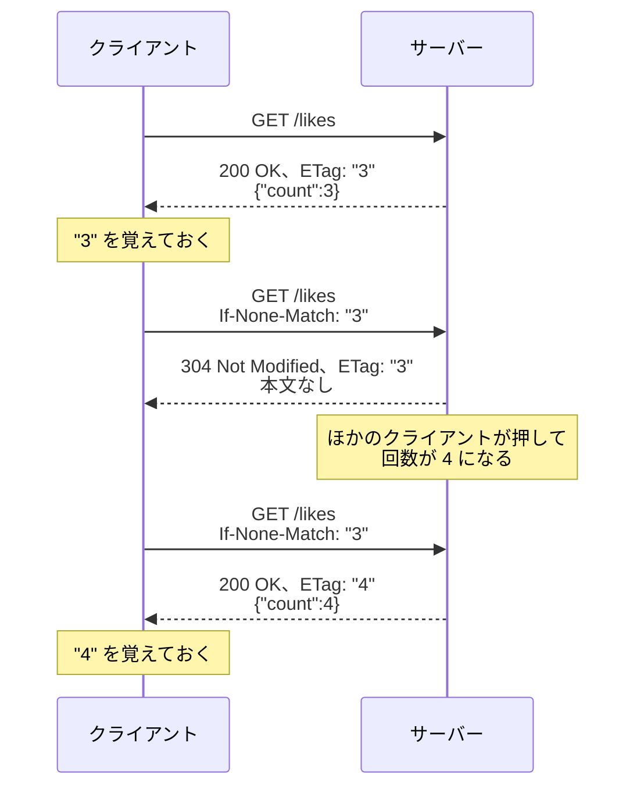

# 変化がなければ本文を返さない（補足）

このページは、[ポーリングで追いつく](/unity-csharp-learning/networking/polling/) の補足です。ポーリングでは、回数が変わっていなくても、サーバーは毎回同じ本文を返しています。このページでは、クライアントが「前に受け取ったもの」をサーバーに伝え、変化がなければ本文を返さずに済ませる**条件付きリクエスト**を作ります。

## 学習目標

このページを読み終えると、以下のことができるようになります。

- `ETag` ヘッダーと `If-None-Match` ヘッダーの役割を説明できる
- ASP.NET Core のハンドラーで、変化がなければ `304 Not Modified` を返せる
- Unity で `If-None-Match` を付けて送り、`304` の応答を扱える
- 条件付きリクエストで減らせるものと、減らせないものを説明できる

## 前提知識

- [ポーリングで追いつく](/unity-csharp-learning/networking/polling/) を読んでいること。このページでは、そのページで完成した `SampleLikeServer` と `LikeButton` を書き換えます

---

## 1. 同じ本文を何度も返している

[ポーリングで追いつく](/unity-csharp-learning/networking/polling/) のクライアントは、1 秒ごとに `GET /likes` を送ります。回数が変わっていなければ、サーバーは毎回 `{"count":3}` のような同じ本文を返し、クライアントは毎回それを JSON として読んでから、「前と同じ」と判断して捨てています。

回数を知らせる本文は 11 バイトほどなので、これでも困りません。しかし、ポーリングで取得するのが、メッセージの一覧やランキングのような大きなデータだったら、変化のないデータを毎回送ることになり、通信量もクライアントの処理も無駄になります。

---

## 2. ETag と If-None-Match

HTTP には、「前に受け取ったものから変わっていなければ、本文は要らない」と伝える仕組みがあります。

| ヘッダー | 送る側 | 意味 |
|---|---|---|
| `ETag` | サーバー（応答） | この応答の内容を表す目印。内容が変わると、目印も変わる |
| `If-None-Match` | クライアント（リクエスト） | 前に受け取った `ETag`。「これと同じなら、本文は要らない」 |

サーバーは、`If-None-Match` の目印が今の内容の目印と同じなら、本文を付けずに **`304 Not Modified`** を返します。「前に受け取ったものから変わっていない」という意味のステータスコードです。このように、条件を付けて送るリクエストを**条件付きリクエスト**（conditional request）と呼びます。



`ETag` の値は、`"3"` のように `"` で囲んだ文字列にする決まりです。目印の作り方は、サーバーが自由に決められます。このページのいいねの回数は増えるだけなので、回数そのものを目印にします。

---

## 3. サーバーで 304 を返す

`SampleLikeServer` の `Program.cs` の `app.MapGet("/likes", ...)` を、次のように書き換えます。全体は「7. 完成したコード」を見てください。

```csharp
app.MapGet("/likes", async (HttpContext context, int? delay) =>
{
    int count = counter.Get();
    // 動作確認用：delay を指定すると、回数を読んでから、その秒数だけ待って応答する
    if (delay != null)
    {
        await Task.Delay(TimeSpan.FromSeconds(delay.Value));
    }

    string etag = $"\"{count}\"";
    context.Response.Headers.ETag = etag;
    if (context.Request.Headers.IfNoneMatch.ToString() == etag)
    {
        return Results.StatusCode(StatusCodes.Status304NotModified);
    }
    return Results.Ok(new LikeCount(count));
});
```

ハンドラーの引数に `HttpContext` を加えています。[ASP.NET Core でサーバーを作る](/unity-csharp-learning/networking/aspnetcore-server/) のミドルウェアで使った、1 回のリクエストと応答の情報をまとめたオブジェクトです。ハンドラーの引数に `HttpContext` 型を書くと、ASP.NET Core がそれを渡してくれます。

**書式：[IHeaderDictionary.ETag プロパティ](https://learn.microsoft.com/dotnet/api/microsoft.aspnetcore.http.iheaderdictionary.etag)**
```csharp
StringValues ETag { get; set; }
```

**書式：[IHeaderDictionary.IfNoneMatch プロパティ](https://learn.microsoft.com/dotnet/api/microsoft.aspnetcore.http.iheaderdictionary.ifnonematch)**
```csharp
StringValues IfNoneMatch { get; set; }
```

`Headers.ETag` と `Headers.IfNoneMatch` は、それぞれ `ETag` と `If-None-Match` のヘッダーを読み書きするプロパティです。`Headers["ETag"]` と書くのと同じですが、ヘッダーの名前を書きまちがえる心配がありません。

ハンドラーは、次の順に処理します。

1. 今の回数から、`"3"` のような目印を作り、応答の `ETag` ヘッダーに設定する
2. リクエストの `If-None-Match` が目印と同じなら、`304 Not Modified` を返す。本文は付けない
3. 違えば（`If-None-Match` がないときも含めて）、これまでどおり、回数の JSON を `200 OK` で返す

`304` の応答にも `ETag` を付けるのは、クライアントが、今の目印を応答から確かめられるようにするためです。

**書式：[Results.StatusCode メソッド](https://learn.microsoft.com/dotnet/api/microsoft.aspnetcore.http.results.statuscode)**
```csharp
public static IResult StatusCode(int statusCode);
```

`Results.StatusCode` は、指定したステータスコードだけの、本文のない応答を返します。[StatusCodes.Status304NotModified](https://learn.microsoft.com/dotnet/api/microsoft.aspnetcore.http.statuscodes.status304notmodified) は、`304` を表す定数です。

ハンドラーは `304` と `200` のどちらかを返すので、`200` のほうも、`LikeCount` をそのまま返すのではなく、`Results.Ok` で返しています。どちらも同じ `IResult` 型になり、1 つのハンドラーから返せます。

---

## 4. curl で確かめる

サーバーを起動し直して、curl で 1 回押します。

```powershell
curl.exe -X POST http://localhost:8080/likes
```

```
{"count":1}
```

`-i` を付けて取得します。

```powershell
curl.exe -i -H "Client-Id: curl-A" http://localhost:8080/likes
```

実行結果の例です。`Date` の日時は実行するたびに変わります。

```
HTTP/1.1 200 OK
Content-Type: application/json; charset=utf-8
Date: Wed, 30 Sep 2026 17:14:09 GMT
Server: Kestrel
ETag: "1"
Transfer-Encoding: chunked

{"count":1}
```

応答に `ETag: "1"` が付いています。

次に、受け取った `ETag` を `If-None-Match` に入れて送ります。`"` を含むヘッダーは、シェルによっては `"` が取り除かれて、正しく送れないことがあります（「よくあるミス」で説明します）。そこで、[JSON でやり取りする](/unity-csharp-learning/networking/json/) で JSON をファイルに書いたのと同じように、ヘッダーをファイルに書いておきます。作業用のフォルダーに、次の 1 行の `if-none-match.txt` を作ります。

`if-none-match.txt`

```
If-None-Match: "1"
```

`-H "@ファイル名"` で、ファイルに書いたヘッダーを付けて送ります。

```powershell
curl.exe -i -H "Client-Id: curl-A" -H "@if-none-match.txt" http://localhost:8080/likes
```

実行結果の例です。

```
HTTP/1.1 304 Not Modified
Date: Wed, 30 Sep 2026 17:14:09 GMT
Server: Kestrel
ETag: "1"

```

`304 Not Modified` が返り、本文はありません。

もう 1 回押します。

```powershell
curl.exe -X POST -H "Client-Id: curl-B" http://localhost:8080/likes
```

```
{"count":2}
```

同じコマンドで取得します。

```powershell
curl.exe -i -H "Client-Id: curl-A" -H "@if-none-match.txt" http://localhost:8080/likes
```

回数が 2 になり、`If-None-Match` の `"1"` と今の目印の `"2"` が違うので、`200 OK` と本文が返ります。

```
HTTP/1.1 200 OK
Content-Type: application/json; charset=utf-8
Date: Wed, 30 Sep 2026 17:14:10 GMT
Server: Kestrel
ETag: "2"
Transfer-Encoding: chunked

{"count":2}
```

サーバーのログでも、`304` と `200` を確かめられます。

```
--> GET /likes (curl-A)
<-- 200 (curl-A)
--> GET /likes (curl-A)
<-- 304 (curl-A)
--> POST /likes (curl-B)
<-- 200 (curl-B)
--> GET /likes (curl-A)
<-- 200 (curl-A)
```

---

## 5. Unity から送る

`LikeButton` に、受け取った `ETag` を覚えておくフィールドを加え、`GetLikesAsync` と `SendAsync` を書き換えます。全体は「7. 完成したコード」を見てください。

`_shownCount` の行の後に、次の行を追加します。

```csharp
private string _etag = null;
```

`GetLikesAsync` を、次のように書き換えます。

```csharp
private async Awaitable GetLikesAsync()
{
    using UnityWebRequest request = UnityWebRequest.Get($"{_baseUrl}/likes?delay={_delaySeconds}");
    if (_etag != null)
    {
        request.SetRequestHeader("If-None-Match", _etag);
    }
    LikeCountData data = await SendAsync(request);
    if (data != null)
    {
        _etag = request.GetResponseHeader("ETag");
        ShowCount(data.count);
    }
}
```

`SendAsync` の、失敗を判定する `if` の後に、次のコードを追加します。

```csharp
if (request.responseCode == 304)
{
    return null;
}
```

- `GetLikesAsync` は、前に受け取った `ETag` があれば、`If-None-Match` ヘッダーに入れて送ります。本文を受け取ったら、応答の `ETag` を `_etag` に覚えてから、回数を表示します。
- `SendAsync` は、`304` の応答なら、本文を読まずに `null` を返します。`GetLikesAsync` は `null` を受け取ると、何もしません。表示は、前に受け取った回数のままです。

`304` は `4xx` や `5xx` ではないので、`result` は `Success` になります。「失敗ではないが、読む本文がない」応答として、`responseCode` で区別しています。

Play モードに入って、サーバーのログを見ます。最初の 1 回は `ETag` を持っていないので `200` ですが、その後は、回数が変わらない間、`304` が続きます。実行結果の例です。

```
--> GET /likes (unity-9ad5)
<-- 200 (unity-9ad5)
--> GET /likes (unity-9ad5)
<-- 304 (unity-9ad5)
--> GET /likes (unity-9ad5)
<-- 304 (unity-9ad5)
```

curl で押すと、次のポーリングで 1 回だけ `200` になり、ボタンの表示が変わります。その後は、また `304` が続きます。

```
--> POST /likes (curl-A)
<-- 200 (curl-A)
--> GET /likes (unity-9ad5)
<-- 200 (unity-9ad5)
--> GET /likes (unity-9ad5)
<-- 304 (unity-9ad5)
```

Unity のボタンを押したときも、次のポーリングで 1 回だけ `200` になります。`POST` の応答には `ETag` を付けていないので、`_etag` は押す前の目印のままだからです。

---

## 6. 減らせるもの、減らせないもの

条件付きリクエストで減らせるのは、変化がないときの**本文**と、クライアントがそれを読む処理です。

一方、**リクエストの数**は減りません。サーバーのログのとおり、クライアントは 1 秒ごとに `GET` を送り、サーバーは毎回、回数を読んで目印を比べています。1000 人のクライアントがつながれば、1 秒間に約 1000 回のリクエストが届くのは、[ポーリングで追いつく](/unity-csharp-learning/networking/polling/) と同じです。

このページの「いいね」のように本文が小さいときは、効果はわずかです。本文が大きく、しかも変化が少ないデータほど、効果が大きくなります。

---

## 7. 完成したコード

`SampleLikeServer` の `Program.cs` です。

```csharp
WebApplicationBuilder builder = WebApplication.CreateBuilder(args);
WebApplication app = builder.Build();

app.Use(async (context, next) =>
{
    HttpRequest request = context.Request;
    string clientId = request.Headers["Client-Id"].ToString();
    if (clientId == "")
    {
        clientId = "名乗っていない";
    }
    Console.WriteLine($"--> {request.Method} {request.Path} ({clientId})");
    await next(context);
    Console.WriteLine($"<-- {context.Response.StatusCode} ({clientId})");
});

LikeCounter counter = new LikeCounter();

app.MapGet("/likes", async (HttpContext context, int? delay) =>
{
    int count = counter.Get();
    // 動作確認用：delay を指定すると、回数を読んでから、その秒数だけ待って応答する
    if (delay != null)
    {
        await Task.Delay(TimeSpan.FromSeconds(delay.Value));
    }

    string etag = $"\"{count}\"";
    context.Response.Headers.ETag = etag;
    if (context.Request.Headers.IfNoneMatch.ToString() == etag)
    {
        return Results.StatusCode(StatusCodes.Status304NotModified);
    }
    return Results.Ok(new LikeCount(count));
});
app.MapPost("/likes", () => new LikeCount(counter.Add()));

app.Run("http://localhost:8080");

record LikeCount(int Count);

class LikeCounter
{
    private readonly object _lock = new object();
    private int _count;

    public int Get()
    {
        lock (_lock)
        {
            return _count;
        }
    }

    public int Add()
    {
        lock (_lock)
        {
            _count++;
            return _count;
        }
    }
}
```

Unity の `LikeButton` です。

```csharp
using System;
using System.Threading;
using TMPro;
using UnityEngine;
using UnityEngine.Networking;

public class LikeButton : MonoBehaviour
{
    [SerializeField] private string _baseUrl = "http://localhost:8080";
    [SerializeField] private int _timeoutSeconds = 3;
    [SerializeField] private float _pollIntervalSeconds = 1f;
    [SerializeField] private int _delaySeconds = 0; // 動作確認用
    [SerializeField] private TMP_Text _label = null;

    private string _clientId;
    private int _shownCount = -1;
    private string _etag = null;

    private void Awake()
    {
        _clientId = "unity-" + Guid.NewGuid().ToString("N").Substring(0, 4);
    }

    private async void Start()
    {
        _label.text = "Like ?";
        CancellationToken token = destroyCancellationToken;
        try
        {
            while (true)
            {
                await GetLikesAsync();
                await Awaitable.WaitForSecondsAsync(_pollIntervalSeconds, token);
            }
        }
        catch (OperationCanceledException)
        {
        }
    }

    private async Awaitable GetLikesAsync()
    {
        using UnityWebRequest request = UnityWebRequest.Get($"{_baseUrl}/likes?delay={_delaySeconds}");
        if (_etag != null)
        {
            request.SetRequestHeader("If-None-Match", _etag);
        }
        LikeCountData data = await SendAsync(request);
        if (data != null)
        {
            _etag = request.GetResponseHeader("ETag");
            ShowCount(data.count);
        }
    }

    public async void OnClick()
    {
        using UnityWebRequest request = new UnityWebRequest(
            $"{_baseUrl}/likes", UnityWebRequest.kHttpVerbPOST, new DownloadHandlerBuffer(), null);
        LikeCountData data = await SendAsync(request);
        if (data != null)
        {
            ShowCount(data.count);
        }
    }

    private void ShowCount(int count)
    {
        if (count < _shownCount)
        {
            Debug.Log($"{_clientId}: 古い回数 {count} は表示しません（表示中は {_shownCount}）");
            return;
        }
        if (count == _shownCount)
        {
            return;
        }
        _shownCount = count;
        _label.text = $"Like {count}";
        Debug.Log($"{_clientId}: Like {count} を表示しました");
    }

    private async Awaitable<LikeCountData> SendAsync(UnityWebRequest request)
    {
        CancellationToken token = destroyCancellationToken;
        request.timeout = _timeoutSeconds;
        request.SetRequestHeader("Client-Id", _clientId);
        using CancellationTokenRegistration registration = token.Register(request.Abort);

        try
        {
            await request.SendWebRequest();
        }
        catch (OperationCanceledException)
        {
            return null;
        }
        if (request.result != UnityWebRequest.Result.Success)
        {
            Debug.LogError($"{_clientId}: {request.method} {request.url} は失敗しました: {request.result} / {request.responseCode} / {request.error}");
            return null;
        }
        if (request.responseCode == 304)
        {
            return null;
        }
        return JsonUtility.FromJson<LikeCountData>(request.downloadHandler.text);
    }
}
```

---

## よくあるミス

### PowerShell で、ヘッダーの `"` が消える

Windows PowerShell（バージョン 5.1）で、`"` を含むヘッダーをコマンドに直接書くと、`"` が取り除かれて curl に渡されます。

```powershell
# ❌ NG: Windows PowerShell 5.1 では、If-None-Match: 1 として送られる
curl.exe -i -H 'If-None-Match: "1"' http://localhost:8080/likes
```

サーバーには `If-None-Match: 1` が届き、目印の `"1"` と一致しないので、回数が変わっていなくても `200 OK` が返ります。PowerShell 7 では、`"` は取り除かれずに渡されます。どちらでも同じ結果になるように、このページでは、ヘッダーをファイルに書いて `-H "@ファイル名"` で渡しています。

---

## まとめ

- 条件付きリクエストでは、サーバーが応答に `ETag`（内容の目印）を付け、クライアントが次のリクエストの `If-None-Match` でそれを送り返す
- 目印が今の内容と同じなら、サーバーは本文のない `304 Not Modified` を返す。違えば、`200 OK` と本文を返す
- ASP.NET Core では、`Headers.ETag` と `Headers.IfNoneMatch` でヘッダーを読み書きし、`Results.StatusCode` で `304` を返す
- `UnityWebRequest` では、`304` の `result` は `Success` になる。`responseCode` で区別し、本文を読まない
- 減らせるのは、変化がないときの本文とその処理。リクエストの数は減らない

---

## 理解度チェック

1. `ETag: "5"` の応答を受け取ったクライアントが、次のリクエストに `If-None-Match: "5"` を付けて送りました。回数が 5 のままなら、サーバーは何を返しますか？ 6 に増えていたらどうですか？
2. `UnityWebRequest` で `304 Not Modified` を受け取ったとき、`result` は何になりますか？
3. ポーリングに条件付きリクエストを取り入れても、サーバーに届くリクエストの数が減らないのはなぜですか？
4. このページの `LikeButton` で、自分のボタンを押した直後のポーリングは、`200` と `304` のどちらになりますか？ その理由も答えてください。

<details markdown="1">
<summary>解答を見る</summary>

1. 5 のままなら、本文のない `304 Not Modified` と `ETag: "5"` を返します。6 に増えていたら、`200 OK` と `{"count":6}`、`ETag: "6"` を返します。
2. `Success` です。`304` は `4xx` や `5xx` ではないので、失敗にはなりません。本文がないので、`responseCode` で区別します。
3. クライアントは、変化があったかどうかにかかわらず、決まった間隔で `GET` を送るからです。条件付きリクエストで省けるのは、変化がないときの本文だけです。
4. `200` です。押すと回数が増えますが、`POST` の応答には `ETag` を付けていないので、`_etag` は押す前の目印のままです。次のポーリングの `If-None-Match` は今の目印と一致しないので、`200` と本文が返ります。

</details>

---

## 次のステップ

ここまでで、「いいね」の回数をサーバーで数え、ポーリングで各クライアントの表示を追いつかせる仕組みができました。次の回では、複数のクライアントが同じデータを同時に書き換えるときに起きる問題を扱います。
