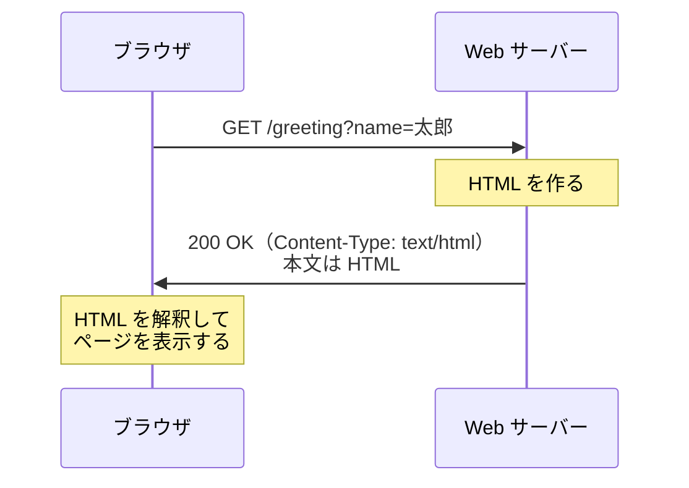
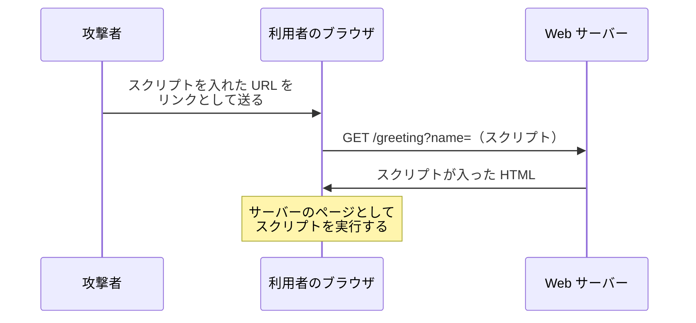

# ブラウザに HTML を返す（補足）

このページは、[値を受け取って結果を返す](/unity-csharp-learning/networking/parameters/) の補足です。ここまでのサーバーは、curl や Unity から使うことを考えて、ただのテキストを返してきました。このページでは、一般的な Web サーバーのように、ブラウザで開くと Web ページとして表示される **HTML** を返します。クエリ文字列で受け取った値を HTML に入れて返し、そのときに気をつけなければならない**インジェクション**の危険と、その防ぎ方を学びます。

## 学習目標

このページを読み終えると、以下のことができるようになります。

- ブラウザが、応答の `Content-Type` を見て本文の扱いを決めていることを説明できる
- `Results.Content` で、HTML の応答を返せる
- HTML のフォームから、`GET` のクエリ文字列で値を送れる
- 受け取った値をそのまま HTML に入れると、何が起きるかを説明できる
- `WebUtility.HtmlEncode` で、値をエスケープしてから HTML に入れられる

## 前提知識

- [値を受け取って結果を返す](/unity-csharp-learning/networking/parameters/) を読んでいること。このページでは新しいプロジェクトを作るので、そのページで作った `SampleHttpServer` のコードは使いません
- [文字列リテラルと書式（補足）](/unity-csharp-learning/csharp/string-literals/) で、生文字列リテラル `"""` を読んでいること
- HTML のタグ（`<h1>` や `<b>` など）を見たことがあること。このページでは、HTML の書き方そのものは説明しません

---

## 1. Web サーバーがしていること

ブラウザのアドレス欄に URL を入れると、ブラウザはその URL に `GET` のリクエストを送ります。サーバーが返した応答の本文が HTML なら、ブラウザはそれを Web ページとして表示します。



Web サーバーが返す HTML には、大きく分けて 2 つの作り方があります。

| 作り方 | 内容 | 例 |
|---|---|---|
| 静的なページ | あらかじめ用意した HTML のファイルを、そのまま返す | 会社の案内、説明書のページ |
| 動的なページ | リクエストのたびに、プログラムが HTML を組み立てて返す | 検索の結果、ランキングの表 |

このページでは、ハンドラーで HTML を組み立てる、動的なページを作ります。仕組みは、ここまでの回でテキストを組み立てて返したのと同じです。違うのは、本文が HTML であることと、それをブラウザに伝える方法です。

---

## 2. 文字列で HTML を返してみる

このページ用に、新しいプロジェクトを作ります。前の回の `SampleHttpServer` とは別のフォルダーで作業し、`SampleHttpServer` が動いていたら Ctrl+C で止めておきます。どちらもポート 8080 を使うからです。

```powershell
dotnet new web -n SampleHtmlServer
cd SampleHtmlServer
```

まず、ここまでと同じように、文字列を返すハンドラーで HTML を返してみます。`Program.cs` を次のように書き換えます。ログを出すミドルウェアは、[ASP.NET Core でサーバーを作る](/unity-csharp-learning/networking/aspnetcore-server/) の「5. リクエストと応答をログに出す」と同じものです。

```csharp
WebApplicationBuilder builder = WebApplication.CreateBuilder(args);
WebApplication app = builder.Build();

app.Use(async (context, next) =>
{
    HttpRequest request = context.Request;
    Console.WriteLine($"--> {request.Method} {request.Path}{request.QueryString}");
    await next(context);
    Console.WriteLine($"<-- {context.Response.StatusCode}");
});

app.MapGet("/plain", () => "<h1>こんにちは</h1>");

app.Run("http://localhost:8080");
```

ここからは、ハンドラーを `app.Run` の前に追加していきます。すべてを追加した `Program.cs` は、「[完成したコード](#完成したコード)」に載せています。

サーバーを起動して、ブラウザで `http://localhost:8080/plain` を開きます。見出しにはならず、次のようにタグがそのまま表示されます。

```
<h1>こんにちは</h1>
```

curl で、応答のヘッダーを確かめます。

```powershell
curl.exe -i http://localhost:8080/plain
```

実行結果の例です。`Date` の日時は実行するたびに変わります。

```
HTTP/1.1 200 OK
Content-Type: text/plain; charset=utf-8
Date: Wed, 30 Sep 2026 14:21:31 GMT
Server: Kestrel
Transfer-Encoding: chunked

<h1>こんにちは</h1>
```

[ASP.NET Core でサーバーを作る](/unity-csharp-learning/networking/aspnetcore-server/) で見たように、ハンドラーが文字列を返すと、`Content-Type` は `text/plain` になります。`text/plain` は「ただのテキスト」という意味なので、ブラウザは本文を HTML として解釈せず、書かれている文字をそのまま表示します。

ブラウザは、本文の中身を見て HTML かどうかを判断するのではありません。応答の `Content-Type` ヘッダーを見て、本文をどう扱うかを決めています。HTML として表示してほしいときは、`Content-Type` を `text/html` にする必要があります。

---

## 3. HTML として返す

`Content-Type` を指定して応答を返すには、[Results.Content メソッド](https://learn.microsoft.com/dotnet/api/microsoft.aspnetcore.http.results.content) を使います。

**書式：[Results.Content メソッド](https://learn.microsoft.com/dotnet/api/microsoft.aspnetcore.http.results.content)**
```csharp
public static IResult Content(string? content, string? contentType = null, Encoding? contentEncoding = null, int? statusCode = null);
```

| パラメータ | 説明 |
|---|---|
| `content` | 本文にする文字列 |
| `contentType` | `Content-Type` ヘッダーの値 |
| `contentEncoding` | 本文の文字コード。省略すると UTF-8 |
| `statusCode` | ステータスコード。省略すると `200` |

`/plain` のハンドラーを残したまま、その後ろに次のハンドラーを追加します。

```csharp
app.MapGet("/html", () => Results.Content("<h1>こんにちは</h1>", "text/html; charset=utf-8"));
```

サーバーを起動し直して、ブラウザで `http://localhost:8080/html` を開くと、今度は `こんにちは` が大きな見出しとして表示されます。

### charset を付け忘れると

`Content-Type` の `; charset=utf-8` は、本文の文字コードが UTF-8 であることを表します。これを付けずに `"text/html"` とだけ書くと、応答は次のようになります。

```
HTTP/1.1 200 OK
Content-Length: 24
Content-Type: text/html
Date: Wed, 30 Sep 2026 14:21:31 GMT
Server: Kestrel

<h1>こんにちは</h1>
```

`Results.Content` は、`contentEncoding` を省略すると本文を UTF-8 で書き込みますが、`Content-Type` に `charset` を書き足してはくれません。文字コードを知らされなかったブラウザは、文字コードを推測して表示します。推測が外れると、次のように文字化けします。

```
ã“ã‚“ã«ã¡ã¯
```

日本語を含む HTML を返すときは、`Content-Type` に `charset=utf-8` を付けます。あわせて、HTML の中にも `<meta charset="utf-8">` を書いておくと、ファイルとして保存したときなど、ヘッダーがない場面でも正しく表示されます。

---

## 4. クエリ文字列を HTML に入れる

[値を受け取って結果を返す](/unity-csharp-learning/networking/parameters/) の「2. クエリ文字列を引数で受け取る」と同じように、クエリ文字列から名前を受け取り、あいさつの HTML を返すハンドラーを、`/html` のハンドラーの後ろに追加します。

```csharp
app.MapGet("/greeting", (string? name) =>
{
    string html = $"""
        <!DOCTYPE html>
        <html>
        <head>
        <meta charset="utf-8">
        <title>あいさつ</title>
        </head>
        <body>
        <h1>こんにちは、{name}さん</h1>
        </body>
        </html>
        """;
    return Results.Content(html, "text/html; charset=utf-8");
});
```

HTML は複数の行にわたり、`"` も含むので、生文字列リテラルで書いています。先頭の `$` によって、`{name}` の部分に引数 `name` の値が入ります。

サーバーを起動し直して、ブラウザで `http://localhost:8080/greeting?name=太郎` を開くと、`こんにちは、太郎さん` という見出しが表示されます。URL の `太郎` を書き換えると、表示される名前も変わります。リクエストのたびに、ハンドラーが HTML を組み立てているからです。

### フォームから送る

URL を手で書く代わりに、ページの入力欄から名前を送れるようにします。入力欄のページを返すハンドラーを、`/greeting` のハンドラーの後ろに追加します。

```csharp
app.MapGet("/", () =>
{
    string html = """
        <!DOCTYPE html>
        <html>
        <head>
        <meta charset="utf-8">
        <title>あいさつ</title>
        </head>
        <body>
        <form action="/greeting" method="get">
        名前：<input name="name">
        <button>送る</button>
        </form>
        </body>
        </html>
        """;
    return Results.Content(html, "text/html; charset=utf-8");
});
```

`<form>` は、入力欄の値をサーバーに送るための HTML の要素です。`method="get"` のフォームでは、ブラウザが入力欄の `name` 属性と値から `名前=値` のクエリ文字列を組み立て、`action` の URL に付けて `GET` のリクエストを送ります。

サーバーを起動し直して、ブラウザで `http://localhost:8080/` を開きます。入力欄に `太郎` と入れて［送る］を押すと、アドレス欄が `http://localhost:8080/greeting?name=太郎` に変わり、URL を手で書いたときと同じページが表示されます。サーバーのログは、次のようになります。

```
--> GET /
<-- 200
--> GET /favicon.ico
<-- 404
--> GET /greeting?name=%E5%A4%AA%E9%83%8E
<-- 200
--> GET /favicon.ico
<-- 404
```

ログでわかることが 2 つあります。

- **URL のエンコード**：アドレス欄には `太郎` と表示されていますが、実際のリクエストでは `%E5%A4%AA%E9%83%8E` のように**エンコード**されています。URL には使える文字が決まっているので、ブラウザが日本語などを `%` と 16 進数の並びに変えて送ります。ASP.NET Core は、ハンドラーに渡す前に元の文字列に戻します。エンコードについては、[JSON でやり取りする](/unity-csharp-learning/networking/json/) の「7. URL に値を入れる」で詳しく扱います。
- **favicon のリクエスト**：[TCP で受け取る](/unity-csharp-learning/networking/tcp-receive/) で見たように、ブラウザはページを開くたびに `/favicon.ico` も要求します。このサーバーには `/favicon.ico` のハンドラーがないので、`404` が返っています。ブラウザはアイコンを表示しないだけで、ページの表示には影響しません。

---

## 5. HTML インジェクション

ここまでのサーバーは、受け取った名前をそのまま HTML に入れています。名前にタグが含まれていたら、どうなるでしょうか。入力欄に `<b>太郎</b>` と入れて送ってみます。

見出しは `こんにちは、<b>太郎</b>さん` とは表示されず、`こんにちは、太郎さん` の `太郎` だけが太字になります。curl で本文を確かめると、タグがそのまま入っています。

```powershell
curl.exe "http://localhost:8080/greeting?name=%3Cb%3E%E5%A4%AA%E9%83%8E%3C%2Fb%3E"
```

```
<!DOCTYPE html>
<html>
<head>
<meta charset="utf-8">
<title>あいさつ</title>
</head>
<body>
<h1>こんにちは、<b>太郎</b>さん</h1>
</body>
</html>
```

ブラウザには、どこまでがサーバーの書いた HTML で、どこからがクエリ文字列から来た値なのかは区別できません。値に含まれる `<b>` も、HTML のタグとして解釈されます。このように、外から受け取った値によって、プログラムが組み立てる文の意味が変わってしまうことを**インジェクション**（injection）と呼びます。

### スクリプトを埋め込まれる

HTML には、`<script>` タグでプログラム（JavaScript）を書けます。入力欄に次の文字列を入れて送ると、ページを開いたときに `XSS` と書かれたダイアログが表示されます。

```
<script>alert('XSS')</script>
```

ダイアログを出すだけなら害はありませんが、同じ方法で、どんなスクリプトでも実行させられます。問題になるのは、このような URL を、ほかの人に開かせたときです。



ブラウザから見ると、このスクリプトは、サーバーが返した正規のページの一部です。そのため、ログインしている利用者の情報を読み取ったり、利用者に代わって操作したりといったことが、そのサイトの権限で行えてしまいます。ほかのサイトから送り込んだスクリプトを実行させるこの攻撃を、**クロスサイトスクリプティング**（cross-site scripting、XSS）と呼びます。

> ⚠️ **注意**: このような文字列を試すのは、自分のパソコンで動かしているサーバー（`localhost`）だけにしてください。ほかの人が運営しているサイトで試すと、攻撃とみなされることがあります。

---

## 6. エスケープする

HTML の中で特別な意味を持つ文字を、意味を持たない書き方に置き換えることを**エスケープ**（escape）と呼びます。HTML では、次のように置き換えます。

| 文字 | 置き換えた後 |
|---|---|
| `<` | `&lt;` |
| `>` | `&gt;` |
| `&` | `&amp;` |
| `"` | `&quot;` |
| `'` | `&#39;` |

`&lt;` と書かれた部分を、ブラウザはタグの始まりではなく、`<` という 1 文字として表示します。.NET では、[WebUtility.HtmlEncode メソッド](https://learn.microsoft.com/dotnet/api/system.net.webutility.htmlencode) でこの置き換えができます。

**書式：[WebUtility.HtmlEncode メソッド](https://learn.microsoft.com/dotnet/api/system.net.webutility.htmlencode)**
```csharp
public static string? HtmlEncode(string? value);
```

`WebUtility` は、`System.Net` 名前空間のクラスです。`Program.cs` の先頭に `using System.Net;` を追加します。

```csharp
using System.Net;
```

そして、`/greeting` のハンドラーを次のように書き換え、`name` をエスケープしてから HTML に入れます。変わったのは `<h1>` の行だけです。

```csharp
app.MapGet("/greeting", (string? name) =>
{
    string html = $"""
        <!DOCTYPE html>
        <html>
        <head>
        <meta charset="utf-8">
        <title>あいさつ</title>
        </head>
        <body>
        <h1>こんにちは、{WebUtility.HtmlEncode(name)}さん</h1>
        </body>
        </html>
        """;
    return Results.Content(html, "text/html; charset=utf-8");
});
```

サーバーを起動し直して、もう一度 `<script>alert('XSS')</script>` を送ります。今度はダイアログが表示されず、見出しに `こんにちは、<script>alert('XSS')</script>さん` と、入力したとおりの文字が表示されます。curl で本文を確かめると、`<` や `'` が置き換えられています。

```powershell
curl.exe "http://localhost:8080/greeting?name=%3Cscript%3Ealert('XSS')%3C%2Fscript%3E"
```

```
<!DOCTYPE html>
<html>
<head>
<meta charset="utf-8">
<title>あいさつ</title>
</head>
<body>
<h1>こんにちは、&lt;script&gt;alert(&#39;XSS&#39;)&lt;/script&gt;さん</h1>
</body>
</html>
```

`name` がないとき（`http://localhost:8080/greeting` を開いたとき）は、`HtmlEncode` に `null` が渡されます。`HtmlEncode` は `null` を渡すと `null` を返し、文字列補間の `null` は空の文字列になるので、見出しは `こんにちは、さん` になります。

> 💡 **ポイント**: エスケープは、値を受け取ったときではなく、HTML に入れる直前に行います。同じ値を、HTML に入れることもあれば、ログに出したり、JSON で返したりすることもあります。受け取った時点で HTML 用に置き換えてしまうと、HTML 以外の場所では `&lt;` のような文字が混ざった、間違った値になります。

---

## 完成したコード

このページで作った `Program.cs` の全体です。

```csharp
using System.Net;

WebApplicationBuilder builder = WebApplication.CreateBuilder(args);
WebApplication app = builder.Build();

app.Use(async (context, next) =>
{
    HttpRequest request = context.Request;
    Console.WriteLine($"--> {request.Method} {request.Path}{request.QueryString}");
    await next(context);
    Console.WriteLine($"<-- {context.Response.StatusCode}");
});

app.MapGet("/plain", () => "<h1>こんにちは</h1>");

app.MapGet("/html", () => Results.Content("<h1>こんにちは</h1>", "text/html; charset=utf-8"));

app.MapGet("/greeting", (string? name) =>
{
    string html = $"""
        <!DOCTYPE html>
        <html>
        <head>
        <meta charset="utf-8">
        <title>あいさつ</title>
        </head>
        <body>
        <h1>こんにちは、{WebUtility.HtmlEncode(name)}さん</h1>
        </body>
        </html>
        """;
    return Results.Content(html, "text/html; charset=utf-8");
});

app.MapGet("/", () =>
{
    string html = """
        <!DOCTYPE html>
        <html>
        <head>
        <meta charset="utf-8">
        <title>あいさつ</title>
        </head>
        <body>
        <form action="/greeting" method="get">
        名前：<input name="name">
        <button>送る</button>
        </form>
        </body>
        </html>
        """;
    return Results.Content(html, "text/html; charset=utf-8");
});

app.Run("http://localhost:8080");
```

---

## よくあるミス

### 入力のチェックで済ませる

「`<` を含む名前はエラーにする」のように、受け取る値を制限するのは、エスケープの代わりにはなりません。

```csharp
// ❌ NG: 危ない文字を思いつく限り弾いても、漏れが出る
if (name != null && name.Contains("<script"))
{
    return Results.BadRequest();
}
```

`<SCRIPT>` のように大文字で書く、`` など `<script>` 以外のタグでスクリプトを動かすなど、弾く条件をすり抜ける書き方はいくらでもあります。また、`<` を名前に使えないように決めても、ほかの画面では `<` を含む文章を正しく表示したいこともあります。入力のチェックは、値が仕様に合っているかを確かめるために行い、HTML に入れるときには、どんな値でもエスケープします。

---

## ワンポイントアドバイス

- **エスケープの方法は、入れる先によって変わる**：HTML の本文、HTML の属性の値、URL、JavaScript、データベースへの命令（SQL）では、特別な意味を持つ文字や、置き換え方が違います。たとえば、データベースへの命令に値をそのまま入れると、**SQL インジェクション**が起きます。どの場合も、原因は「外から来た値を、別の言語の文の中にそのまま入れた」ことです。入れる先に合った方法で、値と文を区別します。
- **フレームワークに任せる**：実際の Web アプリでは、HTML を文字列の連結で組み立てることはあまりありません。ASP.NET Core の Razor など、HTML のテンプレートの仕組みを使うのが一般的です。これらの仕組みは、値を HTML に入れるときに、自動でエスケープします。
- **データを変える操作に GET を使わない**：`GET` は、サーバーのデータを変えないことになっています。ブラウザは、ページを速く開くためにリンク先を先に読み込んでおくことがあります。また、検索エンジンのプログラム（クローラー）は、見つけたリンクを次々に `GET` で開きます。`GET /messages/1/delete` のような URL でデータを消せるようにすると、誰も押していないのに消えることがあります。フォームでデータを変えるときは、`method="post"` にします。`POST` については、[本文でデータを送る](/unity-csharp-learning/networking/request-body/) で扱います。
- **ブラウザの開発者ツール**：ブラウザで F12 キーを押すと、開発者ツールが開きます。［ネットワーク］（Network）タブでは、ブラウザが送ったリクエストと、返ってきた応答のステータスコードやヘッダーを確かめられます。curl の `-i` と同じことを、ブラウザの側から確かめられます。

---

## まとめ

- ブラウザは、応答の `Content-Type` を見て本文の扱いを決める。`text/plain` ならテキストとしてそのまま表示し、`text/html` なら HTML として解釈する
- `Results.Content` で、`Content-Type` を指定して応答を返せる。日本語を含むときは `charset=utf-8` を付ける
- `method="get"` のフォームは、入力欄の値からクエリ文字列を組み立てて送る。日本語などは、ブラウザがエンコードして送る
- 外から受け取った値をそのまま HTML に入れると、値に含まれるタグやスクリプトが解釈される（インジェクション）。スクリプトを実行させる攻撃を XSS と呼ぶ
- HTML に値を入れる直前に、`WebUtility.HtmlEncode` でエスケープする。入力のチェックは、エスケープの代わりにならない

---

## 理解度チェック

1. ハンドラーが `"<h1>見出し</h1>"` という文字列を返すと、ブラウザではどのように表示されますか？ また、それはなぜですか？
2. `Results.Content(html, "text/html")` で日本語を含む HTML を返すと、ブラウザで文字化けすることがあります。どう直せばよいですか？
3. エスケープしていない `/greeting` に、`name` として `<i>花子</i>` を送ると、どのように表示されますか？ エスケープした `/greeting` ではどうなりますか？
4. `WebUtility.HtmlEncode("a < b & c")` の戻り値は何ですか？

<details markdown="1">
<summary>解答を見る</summary>

1. `<h1>見出し</h1>` と、タグがそのまま表示されます。ハンドラーが文字列を返すと `Content-Type` が `text/plain` になり、ブラウザは本文を HTML として解釈しないからです。
2. `Content-Type` に文字コードを書き、`"text/html; charset=utf-8"` にします。`charset` がないと、ブラウザが文字コードを推測し、推測が外れると文字化けします。
3. エスケープしていない場合は、`こんにちは、花子さん` の `花子` が斜体で表示されます。エスケープした場合は、`こんにちは、<i>花子</i>さん` と、タグも文字として表示されます。
4. `a &lt; b &amp; c` です。

</details>

---

## 次のステップ

[本文でデータを送る](/unity-csharp-learning/networking/request-body/) では、[値を受け取って結果を返す](/unity-csharp-learning/networking/parameters/) で作った `SampleHttpServer` を書き換えて、サーバーにデータを送って保存してもらいます。このページの `SampleHtmlServer` は使わないので、動いていたら Ctrl+C で止めてから、`SampleHttpServer` で作業します。
