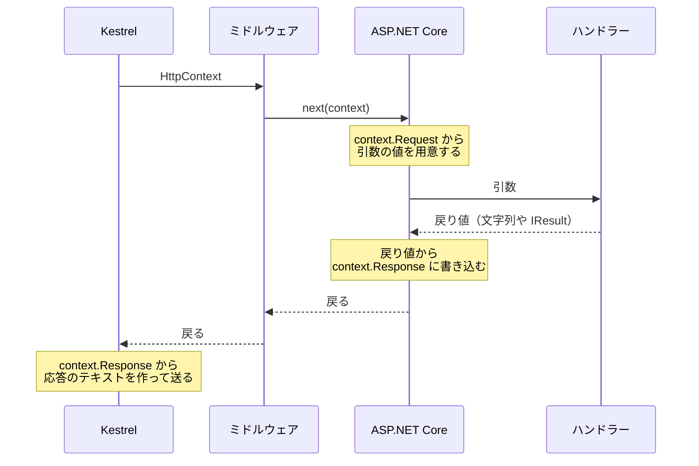

# HttpContext で仕組みを見る（補足）

このページは、[本文でデータを送る](/unity-csharp-learning/networking/request-body/) の補足です。ここまでは、ハンドラーの引数で値を受け取り、文字列や `Results` クラスのメソッドで応答を返してきました。このページでは、同じ処理を **HttpContext** だけを使って書き直し、ASP.NET Core が引数を用意するときや、応答を書き込むときに、何をしているのかを確かめます。[TCP で受け取る](/unity-csharp-learning/networking/tcp-receive/) で見た HTTP のテキストと、ASP.NET Core のコードとの対応も見えるようになります。

## 学習目標

このページを読み終えると、以下のことができるようになります。

- `HttpContext` の `Request` と `Response` が、HTTP のリクエストと応答のどの部分にあたるかを説明できる
- クエリ文字列、ヘッダー、本文を `HttpRequest` から読める
- ステータスコード、`Content-Type`、本文を `HttpResponse` に書ける
- ハンドラーの引数と `IResult` が、`HttpContext` を読み書きする処理の代わりになっていることを説明できる

## 前提知識

- [本文でデータを送る](/unity-csharp-learning/networking/request-body/) を読んでいること。このページでは、そのページまでに作った `SampleHttpServer` のプロジェクトを書き換えます

---

## 1. HttpContext

[ASP.NET Core でサーバーを作る](/unity-csharp-learning/networking/aspnetcore-server/) のミドルウェアでは、`context` という引数で [HttpContext](https://learn.microsoft.com/dotnet/api/microsoft.aspnetcore.http.httpcontext) を受け取っていました。`HttpContext` は、1 回のリクエストと、それに対する応答の情報をまとめたオブジェクトです。

Kestrel は、届いた HTTP のテキストを解析して、リクエストごとに `HttpContext` を 1 つ作ります。ミドルウェアもハンドラーも、この同じ `HttpContext` を受け取って処理します。

| プロパティ | 型 | 内容 |
|---|---|---|
| `Request` | [HttpRequest](https://learn.microsoft.com/dotnet/api/microsoft.aspnetcore.http.httprequest) | 届いたリクエスト。クライアントが送ってきた内容が入っている |
| `Response` | [HttpResponse](https://learn.microsoft.com/dotnet/api/microsoft.aspnetcore.http.httpresponse) | 返す応答。ここに書き込んだ内容が、クライアントに送られる |

[TCP で受け取る](/unity-csharp-learning/networking/tcp-receive/) と [本文でデータを送る](/unity-csharp-learning/networking/request-body/) で見た HTTP のテキストの各部分は、次のプロパティで読み書きできます。

| HTTP のテキスト | リクエスト（`context.Request`） | 応答（`context.Response`） |
|---|---|---|
| 1 行目 | `Method`、`Path`、`QueryString`（`Query`） | `StatusCode` |
| ヘッダー | `Headers`、`ContentType`、`ContentLength` | `Headers`、`ContentType` |
| 本文 | `Body`（読むための `Stream`） | `Body`（書くための `Stream`）、`WriteAsync` |

ここまで使ってきたハンドラーの引数と `Results` のメソッドは、この `HttpContext` を読み書きする処理を、ASP.NET Core が代わりに行ってくれる仕組みです。



このページでは、図の「ASP.NET Core」がしていることを、ハンドラーの中で自分で書きます。

---

## 2. 引数で書いたハンドラー

比べるための元になるハンドラーを、ここまでと同じ書き方で作ります。`SampleHttpServer` の `Program.cs` を、次のように書き換えます。

```csharp
WebApplicationBuilder builder = WebApplication.CreateBuilder(args);
WebApplication app = builder.Build();

app.Use(async (context, next) =>
{
    HttpRequest request = context.Request;
    Console.WriteLine($"--> {request.Method} {request.Path}{request.QueryString}");
    await next(context);
    Console.WriteLine($"<-- {context.Response.StatusCode}");
});

app.MapGet("/hello", (string name) => $"こんにちは、{name}さん");

app.Run("http://localhost:8080");
```

`/hello` のハンドラーは、クエリ文字列の `name` を引数で受け取り、あいさつの文字列を返します。[値を受け取って結果を返す](/unity-csharp-learning/networking/parameters/) で学んだように、`name` がなければ、ASP.NET Core が `400` を返します。

サーバーを起動して、curl で確かめます。

```powershell
dotnet run
```

```powershell
curl.exe -i "http://localhost:8080/hello?name=Taro"
```

実行結果の例です。`Date` の日時は実行するたびに変わります。

```
HTTP/1.1 200 OK
Content-Type: text/plain; charset=utf-8
Date: Sun, 27 Sep 2026 17:30:00 GMT
Server: Kestrel
Transfer-Encoding: chunked

こんにちは、Taroさん
```

---

## 3. HttpContext で書き直す

`/hello` のハンドラーを、`HttpContext` だけを使って書き直します。

```csharp
app.MapGet("/hello", async (HttpContext context) =>
{
    string? name = context.Request.Query["name"];
    if (name == null)
    {
        context.Response.StatusCode = 400;
        return;
    }
    await context.Response.WriteAsync($"こんにちは、{name}さん");
});
```

ハンドラーの引数は `HttpContext` 1 つだけで、値を返していません。値は `context.Request` から自分で取り出し、応答は `context.Response` に自分で書き込みます。

### 2 つの MapGet

引数で書いたハンドラーとは、引数だけでなく、戻り値も変わっています。この違いは、`MapGet` に、ハンドラーを受け取る引数の型が違う 2 つのオーバーロードがあることと関係しています。

**書式：[EndpointRouteBuilderExtensions.MapGet メソッド](https://learn.microsoft.com/dotnet/api/microsoft.aspnetcore.builder.endpointroutebuilderextensions.mapget)**（Delegate）
```csharp
public static RouteHandlerBuilder MapGet(this IEndpointRouteBuilder endpoints, string pattern, Delegate handler);
```

**書式：[EndpointRouteBuilderExtensions.MapGet メソッド](https://learn.microsoft.com/dotnet/api/microsoft.aspnetcore.builder.endpointroutebuilderextensions.mapget)**（RequestDelegate）
```csharp
public static IEndpointConventionBuilder MapGet(this IEndpointRouteBuilder endpoints, string pattern, RequestDelegate requestDelegate);
```

ここまで使ってきたのは、1 つ目の `Delegate` を受け取るオーバーロードです。`Delegate` は、どんな引数と戻り値のデリゲートでも受け取れる型です。ASP.NET Core は、渡されたハンドラーの引数と戻り値の型を調べて、引数の値をリクエストから用意し、戻り値を応答に変換します。

2 つ目は、`RequestDelegate` 型のハンドラーを受け取ります。

**書式：[RequestDelegate デリゲート](https://learn.microsoft.com/dotnet/api/microsoft.aspnetcore.http.requestdelegate)**
```csharp
public delegate Task RequestDelegate(HttpContext context);
```

`RequestDelegate` は、`HttpContext` を 1 つ受け取り、`Task` を返すデリゲート型です。[ASP.NET Core でサーバーを作る](/unity-csharp-learning/networking/aspnetcore-server/) のミドルウェアで、次の処理を呼び出すのに使った `next` も、この型でした。

書き直した `/hello` のラムダ式は、`HttpContext` を 1 つ受け取ります。また、`WriteAsync` を `await` するために `async` を付けていて、値を返さない `async` のラムダ式は `Task` を返します。この形は `RequestDelegate` に一致するので、2 つ目のオーバーロードが選ばれます。

2 つのハンドラーを比べると、次のようになります。

| | 引数で書いたハンドラー | HttpContext で書いたハンドラー |
|---|---|---|
| 選ばれる `MapGet` | `Delegate` を受け取るもの | `RequestDelegate` を受け取るもの |
| 引数 | `string name`。ASP.NET Core がクエリ文字列から用意する | `HttpContext context`。届いたリクエストと、これから返す応答 |
| 戻り値 | `string`。応答の本文になる | `Task`。値はなく、処理が終わったことを知らせるだけ |
| 応答を書き込むのは | ASP.NET Core（戻り値から） | ハンドラー自身（`context.Response` に） |

引数で書いたハンドラーでは、戻り値が応答の中身でした。ASP.NET Core は戻り値を受け取って、ステータスコードや `Content-Type` を決め、本文に書き込みます。`HttpContext` で書いたハンドラーは、応答を `context.Response` に自分で書き込むので、ASP.NET Core に渡すものがありません。戻り値の `Task` は応答の中身ではなく、「ハンドラーの処理がいつ終わったか」を ASP.NET Core に知らせるためのものです。`name` がないときの `return;` が値を持たないのも、このためです。

> 💡 **ポイント**: ハンドラーの書き方には、引数の型と数を自由に決めて、戻り値を応答にしてもらう書き方と、`HttpContext` を受け取って応答を自分で書き込む書き方の 2 つがあります。いま書いているハンドラーがどちらの書き方なのかを、混同しないように注意します。

### クエリ文字列を読む

**書式：[HttpRequest.Query プロパティ](https://learn.microsoft.com/dotnet/api/microsoft.aspnetcore.http.httprequest.query)**
```csharp
public abstract IQueryCollection Query { get; set; }
```

`Query` は、クエリ文字列を `名前=値` の組に分けたものです。`Query["name"]` のように名前を指定すると、その値を取り出せます。指定した名前がクエリ文字列にないときは、`null` になります。

`string name` の引数を書いたときに ASP.NET Core がしていたのは、この「名前で値を取り出し、なければ `400` にする」処理です。引数の名前と、`Query` で指定する名前が同じなのは、そのためです。`int` などの引数では、さらに型の変換も行っていました。

### 応答を書く

**書式：[HttpResponse.StatusCode プロパティ](https://learn.microsoft.com/dotnet/api/microsoft.aspnetcore.http.httpresponse.statuscode)**
```csharp
public abstract int StatusCode { get; set; }
```

`StatusCode` に、応答のステータスコードを設定します。何も設定しなければ `200` です。

**書式：[HttpResponseWritingExtensions.WriteAsync メソッド](https://learn.microsoft.com/dotnet/api/microsoft.aspnetcore.http.httpresponsewritingextensions.writeasync)**
```csharp
public static Task WriteAsync(this HttpResponse response, string text, CancellationToken cancellationToken = default);
```

`WriteAsync` は、文字列を UTF-8 のバイト列にして、応答の本文に書き込みます。

### 確かめる

サーバーを起動し直して、`name` があるときとないときを確かめます。

```powershell
curl.exe -i "http://localhost:8080/hello?name=Taro"
curl.exe -i "http://localhost:8080/hello"
```

実行結果の例です。`Date` の日時は実行するたびに変わります。

```
HTTP/1.1 200 OK
Date: Sun, 27 Sep 2026 17:30:00 GMT
Server: Kestrel
Transfer-Encoding: chunked

こんにちは、Taroさん
HTTP/1.1 400 Bad Request
Content-Length: 0
Date: Sun, 27 Sep 2026 17:30:00 GMT
Server: Kestrel

```

あいさつも `400` も、引数で書いたときと同じように返っています。ただし、`name` がないときに、例外のログや、エラーの詳しい内容は出ていません。自分で `null` かどうかを確かめて、`StatusCode` を設定しているからです。

---

## 4. Content-Type を書く

`200` の応答をよく見ると、`Content-Type` のヘッダーがありません。ハンドラーが文字列を返したときは、ASP.NET Core が `Content-Type: text/plain; charset=utf-8` を付けていました。`HttpContext` で書くときは、`Content-Type` も自分で設定します。

`/hello` のハンドラーの `WriteAsync` の前に、次の行を追加します。

```csharp
context.Response.ContentType = "text/plain; charset=utf-8";
```

ハンドラーは、次のようになります。

```csharp
app.MapGet("/hello", async (HttpContext context) =>
{
    string? name = context.Request.Query["name"];
    if (name == null)
    {
        context.Response.StatusCode = 400;
        return;
    }
    context.Response.ContentType = "text/plain; charset=utf-8";
    await context.Response.WriteAsync($"こんにちは、{name}さん");
});
```

サーバーを起動し直して、もう一度確かめると、`Content-Type` が付きます。

```powershell
curl.exe -i "http://localhost:8080/hello?name=Taro"
```

```
HTTP/1.1 200 OK
Content-Type: text/plain; charset=utf-8
Date: Sun, 27 Sep 2026 17:30:00 GMT
Server: Kestrel
Transfer-Encoding: chunked

こんにちは、Taroさん
```

`Content-Type` がなくても curl は本文を表示しますが、ブラウザは本文の種類や文字コードを推測するしかなくなります。日本語が文字化けする原因になります（[ブラウザに HTML を返す（補足）](/unity-csharp-learning/networking/html-response/) を参照してください）。

---

## 5. IResult は HttpContext に書き込む

`Results.Text` などのメソッドが返す [IResult](https://learn.microsoft.com/dotnet/api/microsoft.aspnetcore.http.iresult) は、「どんな応答を返すか」を表すオブジェクトです。

**書式：[IResult.ExecuteAsync メソッド](https://learn.microsoft.com/dotnet/api/microsoft.aspnetcore.http.iresult.executeasync)**
```csharp
Task ExecuteAsync(HttpContext httpContext);
```

`IResult` の `ExecuteAsync` を呼ぶと、ステータスコード、`Content-Type`、本文を、`HttpContext` の `Response` に書き込みます。ハンドラーが `IResult` を返すと、ASP.NET Core がこのメソッドを呼び出します。

自分で呼び出しても、同じ応答になります。`/hello` のハンドラーの、`Content-Type` と本文を書き込む 2 行を、`Results.Text` の `ExecuteAsync` に置き換えます。

```csharp
app.MapGet("/hello", async (HttpContext context) =>
{
    string? name = context.Request.Query["name"];
    if (name == null)
    {
        context.Response.StatusCode = 400;
        return;
    }
    IResult result = Results.Text($"こんにちは、{name}さん");
    await result.ExecuteAsync(context);
});
```

サーバーを起動し直して、確かめます。

```powershell
curl.exe -i "http://localhost:8080/hello?name=Taro"
```

実行結果の例です。`Date` の日時は実行するたびに変わります。

```
HTTP/1.1 200 OK
Content-Length: 28
Content-Type: text/plain; charset=utf-8
Date: Sun, 27 Sep 2026 17:30:00 GMT
Server: Kestrel

こんにちは、Taroさん
```

`Results.Text` は、`Content-Type` に加えて、本文のバイト数を数えて `Content-Length` も設定しています。そのため、`WriteAsync` で書いたときの `Transfer-Encoding: chunked` ではなく、`Content-Length` の応答になっています。`こんにちは、` と `さん` の 8 文字は UTF-8 で 1 文字 3 バイト、`Taro` は 1 文字 1 バイトなので、合わせて 28 バイトです。

---

## 6. 本文を読む

`POST` で送られた本文と、本文に関するヘッダーを読んでみます。`/hello` のハンドラーの後ろに、次のハンドラーを追加します。届いた本文に `受け取りました: ` を付けて、送り返します。

```csharp
app.MapPost("/echo", async (HttpContext context) =>
{
    HttpRequest request = context.Request;
    Console.WriteLine($"Content-Type: {request.ContentType}");
    Console.WriteLine($"Content-Length: {request.ContentLength}");

    using StreamReader reader = new StreamReader(request.Body);
    string text = await reader.ReadToEndAsync();

    context.Response.ContentType = "text/plain; charset=utf-8";
    await context.Response.WriteAsync($"受け取りました: {text}");
});
```

**書式：[HttpRequest.Body プロパティ](https://learn.microsoft.com/dotnet/api/microsoft.aspnetcore.http.httprequest.body)**
```csharp
public abstract Stream Body { get; set; }
```

`Body` は、リクエストの本文を読むための `Stream` です。[本文でデータを送る](/unity-csharp-learning/networking/request-body/) で、ハンドラーの `Stream` 型の引数に渡されていたのは、この `Body` です。

`ContentType` と `ContentLength` は、それぞれ `Content-Type` と `Content-Length` のヘッダーの値です。ヘッダーがないときは、どちらも `null` になります。

サーバーを起動し直して、日本語の本文を送ります。

```powershell
curl.exe -X POST -d "こんにちは" http://localhost:8080/echo
```

```
受け取りました: こんにちは
```

サーバーのログには、本文のヘッダーの値が表示されます。

```
--> POST /echo
Content-Type: application/x-www-form-urlencoded
Content-Length: 15
<-- 200
```

ハンドラーの中の出力が、ミドルウェアの `-->` と `<--` の間に表示されています。ミドルウェアの `next(context)` の中で、ハンドラーが呼ばれているからです。

---

## 7. ミドルウェアから見る HttpContext

ミドルウェアは、ハンドラーと同じ `HttpContext` を受け取っています。そのため、ハンドラーが `Response` に書いた内容を、`next(context)` から戻った後に読めます。ログを出すミドルウェアが `<--` の行で `context.Response.StatusCode` を出力できるのは、このためです。

反対に、`next(context)` を呼ぶ前は、まだハンドラーが応答を書いていないので、`StatusCode` は既定の `200` のままです。[ASP.NET Core でサーバーを作る](/unity-csharp-learning/networking/aspnetcore-server/) の理解度チェックで、`<--` の行を `next(context)` より前に移すと、`404` になるリクエストでも `<-- 200` と表示されたのは、このためです。

---

## 完成したコード

このページで作った `Program.cs` の全体です。

```csharp
WebApplicationBuilder builder = WebApplication.CreateBuilder(args);
WebApplication app = builder.Build();

app.Use(async (context, next) =>
{
    HttpRequest request = context.Request;
    Console.WriteLine($"--> {request.Method} {request.Path}{request.QueryString}");
    await next(context);
    Console.WriteLine($"<-- {context.Response.StatusCode}");
});

app.MapGet("/hello", async (HttpContext context) =>
{
    string? name = context.Request.Query["name"];
    if (name == null)
    {
        context.Response.StatusCode = 400;
        return;
    }
    IResult result = Results.Text($"こんにちは、{name}さん");
    await result.ExecuteAsync(context);
});

app.MapPost("/echo", async (HttpContext context) =>
{
    HttpRequest request = context.Request;
    Console.WriteLine($"Content-Type: {request.ContentType}");
    Console.WriteLine($"Content-Length: {request.ContentLength}");

    using StreamReader reader = new StreamReader(request.Body);
    string text = await reader.ReadToEndAsync();

    context.Response.ContentType = "text/plain; charset=utf-8";
    await context.Response.WriteAsync($"受け取りました: {text}");
});

app.Run("http://localhost:8080");
```

---

## よくあるミス

### 本文を書いた後にステータスコードを設定する

`StatusCode` は、本文を書く前に設定します。

```csharp
// ❌ NG: 本文を書いた後にステータスコードを設定している
app.MapGet("/late", async (HttpContext context) =>
{
    await context.Response.WriteAsync("エラーです");
    context.Response.StatusCode = 400;
});
```

curl には、`400` ではなく `200` の応答が届きます。サーバーのログには、次の例外が表示されます。

```
System.InvalidOperationException: StatusCode cannot be set because the response has already started.
```

HTTP の応答は、ステータス行、ヘッダー、本文の順に送ります。`WriteAsync` で本文を書き始めると、Kestrel はその前にステータス行とヘッダーを送ってしまいます。送った後では、ステータスコードもヘッダーも変えられません。`Content-Type` などのヘッダーも、同じく本文を書く前に設定します。

---

## まとめ

- `HttpContext` は、1 回のリクエストと応答の情報をまとめたオブジェクト。Kestrel が作り、ミドルウェアとハンドラーが同じものを受け取る
- `context.Request` からは、メソッド、パス、クエリ文字列（`Query`）、ヘッダー、本文（`Body`）を読める
- `context.Response` には、ステータスコード（`StatusCode`）、ヘッダー（`ContentType` など）、本文（`WriteAsync`）を書く。ステータスコードとヘッダーは、本文より先に設定する
- ハンドラーの引数は、`context.Request` から値を取り出す処理を、ASP.NET Core が代わりに行ったもの
- `HttpContext` を受け取って `Task` を返すハンドラーは、`RequestDelegate` を受け取る `MapGet` に渡される。戻り値の `Task` は応答の中身ではなく、応答はハンドラー自身が `context.Response` に書き込む
- `IResult` の `ExecuteAsync` は、ステータスコード、`Content-Type`、本文を `context.Response` に書き込む。ハンドラーが `IResult` を返すと、ASP.NET Core がこれを呼び出す

---

## 理解度チェック

1. このページの完成したコードのサーバーに `GET /hello` を送ると、何が返りますか？ また、変数 `name` には何が入っていますか？
2. 「4. Content-Type を書く」のハンドラーから、`context.Response.ContentType` を設定する行を削除すると、応答はどう変わりますか？
3. [本文でデータを送る](/unity-csharp-learning/networking/request-body/) の `POST /messages` のハンドラーで、`Stream body` の代わりに `HttpContext` を受け取るように書き直すと、本文はどのプロパティから読みますか？
4. 次のハンドラーに `GET /missing` を送ると、curl が受け取るステータスコードはいくつですか？

   ```csharp
   app.MapGet("/missing", async (HttpContext context) =>
   {
       context.Response.StatusCode = 404;
       await context.Response.WriteAsync("見つかりません");
   });
   ```

<details markdown="1">
<summary>解答を見る</summary>

1. 本文のない `400` が返ります。クエリ文字列に `name` がないので、`name` は `null` です。ハンドラーは `StatusCode` を `400` にして、何も書かずに戻ります。
2. 応答のヘッダーから `Content-Type` がなくなります。本文は同じですが、クライアントは本文の種類と文字コードを推測するしかなくなります。
3. `context.Request.Body` です。`Stream` 型の引数には、このプロパティの `Stream` が渡されていました。
4. `404` です。本文を書く前に `StatusCode` を設定しているので、ステータス行には `404` が書かれます。

</details>

---

## 次のステップ

[Unity から通信する](/unity-csharp-learning/networking/unity-webrequest/) では、Unity から `UnityWebRequest` を使って、自分のサーバーからデータを取得したり、サーバーにデータを送ったりします。
