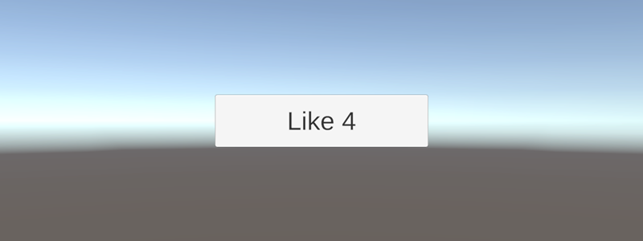
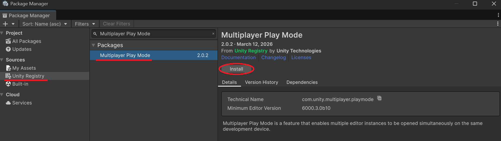
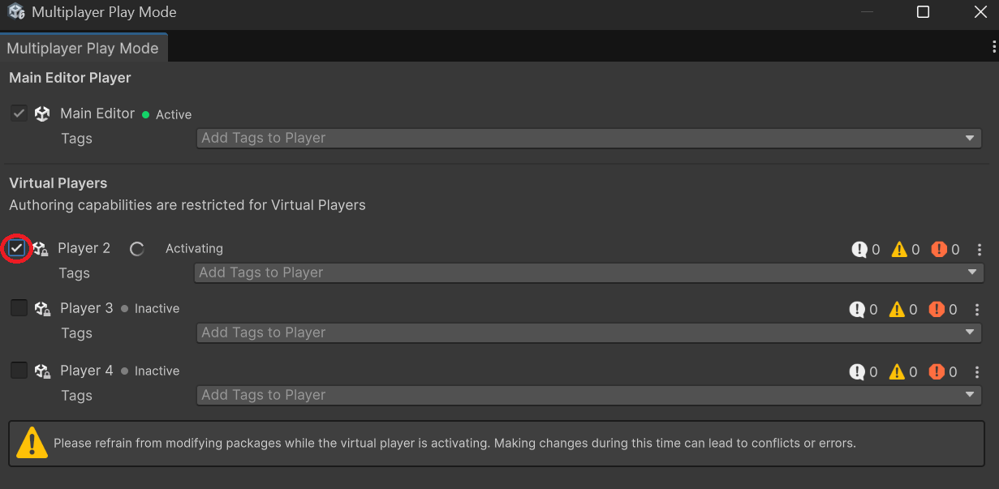
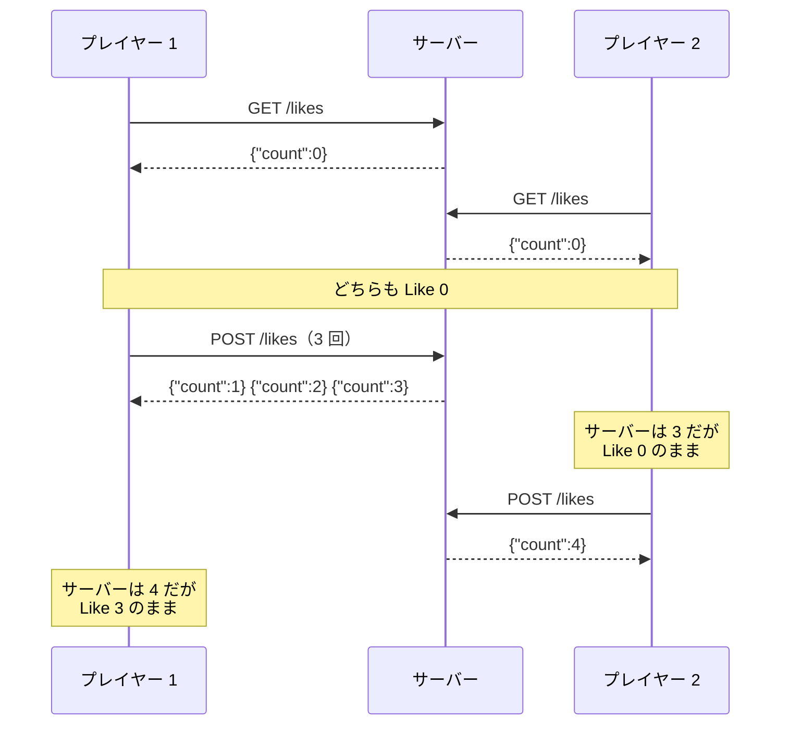

# 複数のクライアントをつなぐ

ここまでは、1 つのサーバーに 1 つのクライアントをつないで通信してきました。しかし、オンラインのゲームでは、たくさんのプレイヤーが同じサーバーにつながり、同じデータを見ています。このページでは、押された回数をサーバーで数える「いいね」のサーバーを作り、curl と Unity から同時に押してみます。Unity を 2 つ同時に動かすために **Multiplayer Play Mode** も使います。そして、ほかのクライアントが起こした変化は、自分からリクエストを送るまでわからないことを確かめます。

## 学習目標

このページを読み終えると、以下のことができるようになります。

- 複数のクライアントで同じデータを使うとき、データはサーバーで持ち、クライアントは操作だけを送る理由を説明できる
- リクエストにヘッダーを付けてクライアントが名乗り、サーバーのログでクライアントを区別できる
- Multiplayer Play Mode を使って、1 つのプロジェクトから Unity のプレイヤーを 2 つ同時に動かせる
- クライアントが表示しているデータは、最後に受け取った応答の時点のものであることを説明できる

## 前提知識

- [失敗に備える](/unity-csharp-learning/networking/failure-handling/) を読んでいること。このページでは新しいプロジェクトを作るので、そのページまでの `SampleHttpServer` のコードは使いません
- [Unity UI とボタン操作](/unity-csharp-learning/unity/unity-ui/) で、ボタンのクリックをスクリプトと結び付けられること
- [TextMesh Pro](/unity-csharp-learning/unity/textmesh-pro/) で、`TMP_Text` の文字列を書き換えられること
- Multiplayer Play Mode を使うため、Unity 6.3 以降を使っていること

---

## 1. 回数はどこで数えるか

[Unity UI とボタン操作](/unity-csharp-learning/unity/unity-ui/) の `Clicker` は、押された回数を自分のフィールド `_count` で数えていました。プレイヤーが 1 人なら、これで困りません。

しかし、「いいね」ボタンのように、全員が押した回数の合計を表示したいときは、そうはいきません。プレイヤー A のゲームの `_count` は A が押した回数しか知らず、B のゲームの `_count` は B が押した回数しか知らないからです。全員の合計を知っているのは、全員のリクエストを受け取るサーバーだけです。

そこで、このページでは、回数をサーバーで数えます。

| 役割 | すること |
|---|---|
| サーバー | 回数を持つ。「押された」というリクエストが届いたら 1 増やし、増やした後の回数を返す |
| クライアント | ボタンが押されたら、「押された」ことだけをサーバーに送る。応答で受け取った回数を表示する |

クライアントは、回数を自分で計算しません。サーバーに操作を伝え、結果を受け取って表示するだけです。

---

## 2. いいねのサーバーを作る

作業用のフォルダーで、新しいプロジェクトを作ります。

```powershell
dotnet new web -n SampleLikeServer
cd SampleLikeServer
```

`Program.cs` を次のように書き換えます。

```csharp
WebApplicationBuilder builder = WebApplication.CreateBuilder(args);
WebApplication app = builder.Build();

app.Use(async (context, next) =>
{
    HttpRequest request = context.Request;
    string clientId = request.Headers["Client-Id"].ToString();
    if (clientId == "")
    {
        clientId = "名乗っていない";
    }
    Console.WriteLine($"--> {request.Method} {request.Path} ({clientId})");
    await next(context);
    Console.WriteLine($"<-- {context.Response.StatusCode} ({clientId})");
});

LikeCounter counter = new LikeCounter();

app.MapGet("/likes", () => new LikeCount(counter.Get()));
app.MapPost("/likes", () => new LikeCount(counter.Add()));

app.Run("http://localhost:8080");

record LikeCount(int Count);

class LikeCounter
{
    private readonly object _lock = new object();
    private int _count;

    public int Get()
    {
        lock (_lock)
        {
            return _count;
        }
    }

    public int Add()
    {
        lock (_lock)
        {
            _count++;
            return _count;
        }
    }
}
```

このサーバーは、次の 2 つのリクエストを受け付けます。

| メソッド | パス | すること | 応答の本文の例 |
|---|---|---|---|
| `GET` | `/likes` | 今の回数を返す | `{"count":3}` |
| `POST` | `/likes` | 回数を 1 増やし、増やした後の回数を返す | `{"count":4}` |

`POST` の応答は、`201 Created` ではなく `200 OK` にしています。[本文でデータを送る](/unity-csharp-learning/networking/request-body/) でメッセージを追加したときとは違い、自分の URL を持つ新しいデータを作るわけではないからです。`LikeCount` を返すと、[JSON でやり取りする](/unity-csharp-learning/networking/json/) で学んだとおり、ASP.NET Core が JSON に変換し、`200 OK` の応答にします。

`POST` の応答で、増やした後の回数を返しているのは、クライアントが押した結果をすぐに表示できるようにするためです。応答で回数を返さないと、クライアントは表示を更新するために、続けて `GET` を送らなければなりません。

`LikeCounter` は、[本文でデータを送る](/unity-csharp-learning/networking/request-body/) の `messages` と同じように、`lock` で回数を守っています。複数のクライアントのリクエストは、別々のスレッドで同時に処理されることがあるからです。

### クライアントに名乗ってもらう

[TCP で送る](/unity-csharp-learning/networking/tcp-send/) で確かめたように、サーバーには、リクエストに書かれたこと以外にクライアントを知る手段がありません。このままでは、ログを見ても、どのクライアントが送ったリクエストなのかがわかりません。

そこで、クライアントに、リクエストの `Client-Id` ヘッダーで名乗ってもらうことにします。`Client-Id` は、HTTP で決められたヘッダーではなく、このシリーズで決めた名前です。ヘッダーの名前は、サーバーとクライアントで合わせておけば、自由に決められます。

**書式：[HttpRequest.Headers プロパティ](https://learn.microsoft.com/dotnet/api/microsoft.aspnetcore.http.httprequest.headers)**
```csharp
public abstract IHeaderDictionary Headers { get; }
```

`Headers` は、リクエストのヘッダーを、名前で引ける形で持っています。名前の大文字と小文字は区別されません。`request.Headers["Client-Id"]` で読んだ値を `ToString` で文字列にすると、ヘッダーがないときは空の文字列になります。そのときは、ログに `名乗っていない` と出力します。

複数のクライアントのリクエストが同時に処理されると、`-->` と `<--` の行が入り混じって出力されることがあります。どのリクエストの応答なのかがわかるように、`<--` の行にもクライアントの名前を出力しています。

---

## 3. curl で確かめる

[TCP で送る](/unity-csharp-learning/networking/tcp-send/) で学んだように、通信する 2 つのプログラムは、片方ずつ確かめます。まず、curl を 2 つのクライアントに見立てて、サーバーを確かめます。

前の回までの `SampleHttpServer` が動いていたら、Ctrl+C で止めておきます。どちらもポート 8080 を使うからです。`SampleLikeServer` のフォルダーで、サーバーを起動します。

```powershell
dotnet run
```

別のターミナルを 2 つ開きます。1 つ目を「クライアント A」、2 つ目を「クライアント B」とします。`-H` で `Client-Id` ヘッダーを付けて、それぞれ名乗ります。

まず、クライアント A で、今の回数を取得します。

```powershell
curl.exe -H "Client-Id: curl-A" http://localhost:8080/likes
```

```
{"count":0}
```

クライアント A で、押します。`-X POST` で、`POST` のリクエストを送ります。本文は送りません。

```powershell
curl.exe -X POST -H "Client-Id: curl-A" http://localhost:8080/likes
```

```
{"count":1}
```

もう一度、同じコマンドを実行します。

```
{"count":2}
```

次に、クライアント B で 1 回押します。

```powershell
curl.exe -X POST -H "Client-Id: curl-B" http://localhost:8080/likes
```

```
{"count":3}
```

B が押したのは 1 回目ですが、応答の回数は `3` です。サーバーは、A と B のどちらのリクエストも同じ回数に数えています。

サーバーのログには、次のように表示されます。

```
--> GET /likes (curl-A)
<-- 200 (curl-A)
--> POST /likes (curl-A)
<-- 200 (curl-A)
--> POST /likes (curl-A)
<-- 200 (curl-A)
--> POST /likes (curl-B)
<-- 200 (curl-B)
```

`Client-Id` ヘッダーのおかげで、どのリクエストをどのクライアントが送ったのかが、ログで区別できます。`-H` を付けずに送ると、`(名乗っていない)` と表示されます。

回数はサーバーが覚えているので、サーバーを止めて起動し直すと、`0` に戻ります。

---

## 4. Unity のクライアントを作る

サーバーは curl で確かめられたので、Unity の側を作ります。サーバーは、起動したままにしておきます。

### ボタンを置く

Unity で新しいシーンを作り、メニューバーの **GameObject → UI (Canvas) → Button - TextMeshPro** を選択して、ボタンを追加します。Unity のバージョンによっては、**GameObject → UI → Button - TextMeshPro** です。位置と大きさは、Game ビューで見やすいように変えてかまいません。このページのスクリーンショットでは、ボタンの大きさを幅 `400`、高さ `100` に、`Text (TMP)` の `Font Size` を `48` にしています。

### スクリプトを書く

Project ビューで **Create → Scripting → Empty C# Script** から `LikeCountData` という名前のスクリプトを作り、次のように書きます。サーバーの `LikeCount` の JSON（`{"count":3}`）を受け取るためのクラスです。

```csharp
using System;

[Serializable]
public class LikeCountData
{
    public int count;
}
```

Hierarchy ビューで `Button` を選択し、Inspector ビューの **Add Component → New script** から `LikeButton` という名前のスクリプトを作ってアタッチします。スクリプトを次のように書きます。

```csharp
using System;
using System.Threading;
using TMPro;
using UnityEngine;
using UnityEngine.Networking;

public class LikeButton : MonoBehaviour
{
    [SerializeField] private string _baseUrl = "http://localhost:8080";
    [SerializeField] private int _timeoutSeconds = 3;
    [SerializeField] private TMP_Text _label = null;

    private string _clientId;

    private void Awake()
    {
        _clientId = "unity-" + Guid.NewGuid().ToString("N").Substring(0, 4);
    }

    private void Start()
    {
        _label.text = "Like ?";
        GetLikes();
    }

    [ContextMenu("最新の回数を取得する")]
    private async void GetLikes()
    {
        using UnityWebRequest request = UnityWebRequest.Get($"{_baseUrl}/likes");
        LikeCountData data = await SendAsync(request);
        if (data != null)
        {
            _label.text = $"Like {data.count}";
        }
    }

    public async void OnClick()
    {
        using UnityWebRequest request = new UnityWebRequest(
            $"{_baseUrl}/likes", UnityWebRequest.kHttpVerbPOST, new DownloadHandlerBuffer(), null);
        LikeCountData data = await SendAsync(request);
        if (data != null)
        {
            _label.text = $"Like {data.count}";
        }
    }

    private async Awaitable<LikeCountData> SendAsync(UnityWebRequest request)
    {
        CancellationToken token = destroyCancellationToken;
        request.timeout = _timeoutSeconds;
        request.SetRequestHeader("Client-Id", _clientId);
        using CancellationTokenRegistration registration = token.Register(request.Abort);

        try
        {
            await request.SendWebRequest();
        }
        catch (OperationCanceledException)
        {
            return null;
        }
        if (request.result != UnityWebRequest.Result.Success)
        {
            Debug.LogError($"{_clientId}: {request.method} {request.url} は失敗しました: {request.result} / {request.responseCode} / {request.error}");
            return null;
        }
        Debug.Log($"{_clientId}: {request.method} {request.url} → {request.downloadHandler.text}");
        return JsonUtility.FromJson<LikeCountData>(request.downloadHandler.text);
    }
}
```

`Button` の子にある `Text (TMP)` を、Inspector ビューの `Label` 欄にドラッグして設定します。続けて、`Button` コンポーネントの `On Click ()` の **＋** を押し、`Button` ゲームオブジェクトを設定して、**LikeButton → OnClick ()** を選択します。手順は、[Unity UI とボタン操作](/unity-csharp-learning/unity/unity-ui/) の「4. クリックに反応する」と同じです。

スクリプトの各部分を見ていきます。

| メソッド | すること |
|---|---|
| `Awake` | このクライアントの名前（`_clientId`）を決める |
| `Start` | ボタンの表示を `Like ?` にしてから、今の回数を取得する |
| `GetLikes` | `GET /likes` を送り、受け取った回数を表示する。コンポーネントのメニューからも呼び出せる |
| `OnClick` | ボタンが押されたら `POST /likes` を送り、受け取った回数を表示する |
| `SendAsync` | リクエストに共通の設定をして送り、応答の JSON を `LikeCountData` に変換して返す。失敗したときや中止したときは `null` を返す |

### 名前を実行するたびに決める

`_clientId` は、`Awake` で、`unity-` の後ろに 4 文字のランダムな文字列を付けて作ります。

**書式：[Guid.NewGuid メソッド](https://learn.microsoft.com/dotnet/api/system.guid.newguid)**
```csharp
public static Guid NewGuid();
```

`Guid.NewGuid` は、ほかと重ならないように作られた 128 ビットの値（**GUID**）を返します。`ToString("N")` で、`3f2a9c...` のような 32 文字の 16 進数の文字列にし、先頭の 4 文字だけを使っています。このページで試す程度の数のクライアントなら、名前が重なることはまずありません。

名前を `[SerializeField]` のフィールドにして Inspector ビューで決めず、実行するたびに作っているのには理由があります。「5. Unity を 2 つ動かす」で、同じシーンを 2 つのプレイヤーで同時に動かすからです。シーンに保存した値は、どちらのプレイヤーでも同じになってしまいます。

### 本文のない POST を作る

**書式：[UnityWebRequest コンストラクター](https://docs.unity3d.com/ScriptReference/Networking.UnityWebRequest-ctor.html)**
```csharp
public UnityWebRequest(string url, string method, DownloadHandler downloadHandler, UploadHandler uploadHandler);
```

| パラメータ | 説明 |
|---|---|
| `url` | リクエストを送る URL |
| `method` | メソッド。`POST` は、定数 [UnityWebRequest.kHttpVerbPOST](https://docs.unity3d.com/ScriptReference/Networking.UnityWebRequest-kHttpVerbPOST.html) で指定できる |
| `downloadHandler` | 応答の本文を受け取る `DownloadHandler` |
| `uploadHandler` | リクエストの本文を送る `UploadHandler`。本文を送らないときは `null` |

「押された」ことを伝えるのに、本文は要りません。そこで、`UnityWebRequest.Post` ではなく、コンストラクターで、本文のない `POST` のリクエストを作っています。応答の本文（回数の JSON）は受け取りたいので、[DownloadHandlerBuffer](https://docs.unity3d.com/ScriptReference/Networking.DownloadHandlerBuffer.html) を渡します。`DownloadHandlerBuffer` は、受け取った本文をメモリにためておき、`text` で文字列として読めるようにする `DownloadHandler` です。`UnityWebRequest.Get` で作ったリクエストには、これがあらかじめ設定されています。

### ヘッダーを付ける

**書式：[UnityWebRequest.SetRequestHeader メソッド](https://docs.unity3d.com/ScriptReference/Networking.UnityWebRequest.SetRequestHeader.html)**
```csharp
public void SetRequestHeader(string name, string value);
```

`SetRequestHeader` は、リクエストにヘッダーを追加します。curl の `-H "Client-Id: curl-A"` にあたります。`SendAsync` では、どのリクエストにも `Client-Id` ヘッダーを付けています。

`SendAsync` のそのほかの部分は、[失敗に備える](/unity-csharp-learning/networking/failure-handling/) で学んだことを使っています。`timeout` で応答を待つ時間に制限を付け、`destroyCancellationToken` に `Abort` を登録して、応答を待つ間に Play モードを終了したときなどにリクエストを中止します。

### 1 つの Unity で確かめる

Play モードに入ると、ボタンの表示が `Like ?` から、サーバーの今の回数に変わります。「3. curl で確かめる」の後にサーバーを起動し直していなければ、`Like 3` になります。


Console ビューには、次のように表示されます。実行結果の例です。`unity-` の後ろの 4 文字は、実行するたびに変わります。

```
unity-7c1e: GET http://localhost:8080/likes → {"count":3}
```

ボタンを 1 回押すと、表示が `Like 4` に変わります。



Console ビューには、次のように表示されます。

```
unity-7c1e: POST http://localhost:8080/likes → {"count":4}
```

サーバーのログにも、Unity が名乗った名前が表示されます。

```
--> GET /likes (unity-7c1e)
<-- 200 (unity-7c1e)
--> POST /likes (unity-7c1e)
<-- 200 (unity-7c1e)
```

続けて、Play モードのまま、ターミナルのクライアント A から 2 回押します。

```powershell
curl.exe -X POST -H "Client-Id: curl-A" http://localhost:8080/likes
```

```
{"count":5}
```

もう一度、同じコマンドを実行します。

```
{"count":6}
```

サーバーの回数は `6` になりました。ところが、Unity のボタンの表示は `Like 4` のままです。

Inspector ビューで `Like Button` コンポーネントの見出しを右クリックし、**最新の回数を取得する** を選ぶと、表示が `Like 6` に変わります。


または、ボタンを押すと、`POST` の応答で回数を受け取るので、表示は `Like 7` に変わります。どちらの場合も、Unity がリクエストを送ったときに初めて、curl が押した分が表示に反映されました。

---

## 5. Unity を 2 つ動かす

curl の代わりに、もう 1 つの Unity をクライアントにします。同じゲームを 2 つ同時に動かすには、ビルドしたアプリと Unity Editor を並べて起動する方法もありますが、コードを変えるたびにビルドし直すのは手間がかかります。**Multiplayer Play Mode** を使うと、1 つのプロジェクトから、Unity Editor のプレイヤーを最大 4 つ同時に動かせます。

Multiplayer Play Mode は、今使っている Unity Editor（**Main Editor**）のほかに、**Virtual Player** と呼ばれる Unity Editor を別のプロセスとして起動し、それぞれで同じプロジェクトの Play モードを動かします。Virtual Player は、プロジェクトの `Library/VP` フォルダーに、自分用の設定やデータを置きます。

> 💡 **ポイント**: このページの手順は、Unity 6.3 以降と、Multiplayer Play Mode パッケージのバージョン 2.0 の画面で説明しています。バージョンによって、メニューやウィンドウの名前が違うことがあります。そのときは、[Multiplayer Play Mode のマニュアル](https://docs.unity3d.com/Packages/com.unity.multiplayer.playmode@2.0/manual/index.html) を参照してください。

### パッケージを入れる

1. メニューバーの **Window → Package Manager** を選択する
2. 左の一覧で **Unity Registry** を選択し、検索欄に `Multiplayer Play Mode` と入力する
3. 一覧から **Multiplayer Play Mode** を選択し、**Install** を押す



### Virtual Player を有効にする

1. メニューバーの **Window → Multiplayer → Multiplayer Play Mode** を選択し、Multiplayer Play Mode ウィンドウを開く
2. **Virtual Players** の **Player 2** のチェックボックスをオンにする
3. Player 2 の状態が **Activating** から **Active** に変わるまで待つ。初めて有効にするときは、準備に時間がかかる



**Main Editor** は、今使っている Unity Editor のプレイヤーです。Player 2 を有効にすると、Player 2 のウィンドウが別に開きます。

### 2 つのプレイヤーで押す

サーバーを Ctrl+C で止めて起動し直し、回数を `0` に戻します。

Main Editor で Play モードに入ると、Player 2 も一緒に Play モードに入ります。以下では、Main Editor のプレイヤーを「プレイヤー 1」、Player 2 を「プレイヤー 2」と呼びます。

Player 2 のウィンドウには、標準では Game ビューだけが表示されます。右上の **Layout** のドロップダウンで **Console** と **Inspector** を選択して **Apply** を押すと、プレイヤー 2 の Console ビューと Inspector ビューも表示できます。

どちらのプレイヤーも、起動したときに `GET /likes` を送るので、ボタンの表示は `Like 0` になります。サーバーのログには、2 つの名前が表示されます。実行結果の例です。名前は実行するたびに変わり、2 つのリクエストの順番が入れ替わることもあります。

```
--> GET /likes (unity-7c1e)
<-- 200 (unity-7c1e)
--> GET /likes (unity-b409)
<-- 200 (unity-b409)
```

プレイヤー 1 のボタンを 3 回押します。プレイヤー 1 の表示は `Like 3` になりますが、プレイヤー 2 の表示は `Like 0` のままです。

次に、プレイヤー 2 のボタンを 1 回押します。プレイヤー 2 の表示は、`Like 1` ではなく、`Like 0` から `Like 4` に変わります。プレイヤー 2 は、`POST` の応答を受け取って初めて、プレイヤー 1 が押した 3 回を知りました。今度は、プレイヤー 1 の表示が `Like 3` のまま取り残されています。

> 💡 **ポイント**: スクリプトやシーンの変更は、Main Editor で行います。変更は Virtual Player にも反映されます。Virtual Player では、ゲームオブジェクトを作ったり、プロパティを変えたりできません。

---

## 6. クライアントの表示は写し

「5. Unity を 2 つ動かす」で起きたことを、図にまとめます。



正しい回数を持っているのは、いつもサーバーだけです。各クライアントが表示しているのは、最後に受け取った応答の時点の回数、つまりサーバーのデータの**写し**です。HTTP では、サーバーはリクエストに応答することしかできません。ほかのクライアントがデータを変えても、サーバーからそれを知らせることはできず、写しは、クライアントが次にリクエストを送るまで古いままです。

ゲームでは、ほかのプレイヤーが起こした変化を、プレイヤーが何もしなくても画面に反映したいことがよくあります。そのためには、クライアントから定期的にリクエストを送って、写しを新しくする必要があります。

---

## よくあるミス

### 前の回のサーバーを止め忘れる

`SampleHttpServer` がポート 8080 で動いたままだと、`SampleLikeServer` は起動に失敗します。

```
System.IO.IOException: Failed to bind to address http://127.0.0.1:8080: address already in use.
```

1 つのポートで待ち受けられるのは 1 つのプログラムだけです。`SampleHttpServer` を Ctrl+C で止めてから起動し直します。

### クライアントの名前をシーンに保存する

クライアントの名前を `[SerializeField]` のフィールドにして、Inspector ビューで `Player1` のように決めると、Multiplayer Play Mode の 2 つのプレイヤーは同じシーンを読み込むので、どちらも `Player1` と名乗ります。サーバーのログで、2 つのクライアントを区別できなくなります。プレイヤーごとに違う値にしたいものは、実行したときに決めます。

---

## ワンポイントアドバイス

- **名乗った名前は信用できない**：`Client-Id` ヘッダーは、クライアントが自分で付けたものです。curl の `-H` で、ほかのクライアントの名前を名乗ることも簡単にできます。このページの名前は、ログを見やすくするためだけのものです。本当に誰が送ったのかを確かめるには、**認証**（authentication）の仕組みが必要です
- **Multiplayer Play Mode のタグ**：Multiplayer Play Mode では、プレイヤーごとに**タグ**を設定し、スクリプトから `Unity.Multiplayer.PlayMode.CurrentPlayer.Tags` で読めます。プレイヤーごとにチームを分けるなど、決まった役割を与えたいときに使います

---

## まとめ

- 全員で共有するデータは、サーバーで持つ。クライアントは「押された」のような操作だけを送り、サーバーが計算した結果を受け取って表示する
- サーバーには、リクエストに書かれたこと以外にクライアントを知る手段がない。クライアントにヘッダーで名乗ってもらうと、ログでクライアントを区別できる。`UnityWebRequest` では `SetRequestHeader` でヘッダーを付ける
- `UnityWebRequest` のコンストラクターで、本文のない `POST` のリクエストを作れる。応答の本文を受け取るには、`DownloadHandlerBuffer` を渡す
- Multiplayer Play Mode を使うと、1 つのプロジェクトから、Unity Editor のプレイヤーを最大 4 つ同時に動かせる。Multiplayer Play Mode ウィンドウで Virtual Player のチェックボックスをオンにすると、そのプレイヤーの Unity Editor が別に起動する
- クライアントが表示しているのは、最後に受け取った応答の時点のデータの写し。ほかのクライアントが起こした変化は、次にリクエストを送るまでわからない

---

## 理解度チェック

1. 全員が押した「いいね」の合計を表示したいとき、各クライアントのフィールドで回数を数えるだけでは足りないのはなぜですか？
2. このページのサーバーで、回数が `5` のときに、次の 2 つのコマンドを続けて実行しました。それぞれ何が表示されますか？

   ```powershell
   curl.exe -X POST -H "Client-Id: curl-A" http://localhost:8080/likes
   curl.exe -H "Client-Id: curl-B" http://localhost:8080/likes
   ```

3. `curl.exe -X POST http://localhost:8080/likes` を実行すると、サーバーのログの `-->` の行には何と表示されますか？
4. プレイヤー 1 の表示が `Like 2`、プレイヤー 2 の表示が `Like 2` のとき、プレイヤー 1 がボタンを 2 回押し、その後プレイヤー 2 がボタンを 1 回押しました。それぞれの表示はどうなりますか？ ほかのクライアントはないものとします。

<details markdown="1">
<summary>解答を見る</summary>

1. 各クライアントのフィールドは、そのクライアントで押された回数しか知らないからです。全員が押した回数を知っているのは、全員のリクエストを受け取るサーバーだけです。
2. 1 つ目は `{"count":6}`、2 つ目も `{"count":6}` です。`POST` は回数を 1 増やして返し、`GET` は今の回数を返すだけです。どちらのクライアントが送っても、同じ回数を数えています。
3. `--> POST /likes (名乗っていない)` と表示されます。`Client-Id` ヘッダーを付けていないので、`Headers["Client-Id"]` は空の文字列になります。
4. プレイヤー 1 は `Like 4`、プレイヤー 2 は `Like 5` になります。プレイヤー 1 は自分が押したときの応答で `4` を受け取った後、リクエストを送っていないので、`Like 4` のままです。プレイヤー 2 は、押したときの応答で、プレイヤー 1 の 2 回を含めた `5` を受け取ります。

</details>

---

## 次のステップ

[ポーリングで追いつく](/unity-csharp-learning/networking/polling/) では、クライアントから定期的にリクエストを送って、ほかのクライアントが起こした変化に追いつきます。
