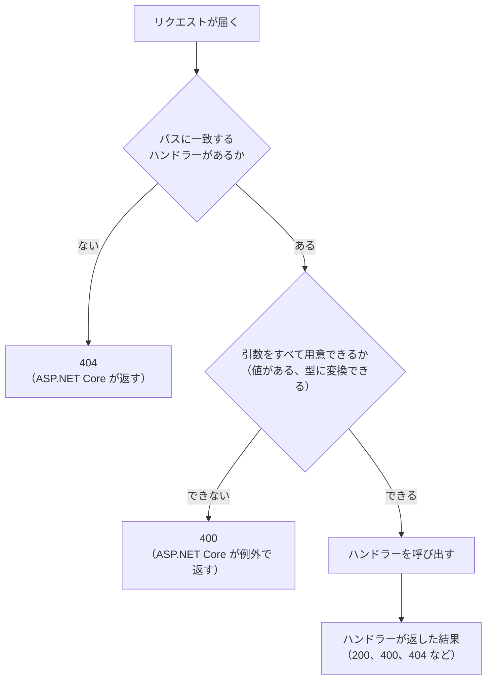

# 値を受け取って結果を返す

[ASP.NET Core でサーバーを作る](/unity-csharp-learning/networking/aspnetcore-server/) では、決まった文字列を返すサーバーを作りました。このページでは、クライアントから値を受け取り、その値を使って計算した結果を返すようにします。メソッドに引数を渡して戻り値を受け取るのと同じように、URL に値を入れてサーバーの処理を呼び出し、結果を応答で受け取ります。あわせて、処理の結果に応じた**ステータスコード**の返し方を学びます。

## 学習目標

このページを読み終えると、以下のことができるようになります。

- クエリ文字列の値を、ハンドラーの引数で受け取れる
- 引数が足りないときや、型に変換できないときに、何が返るかを説明できる
- `Results` クラスのメソッドで、ステータスコードを選んで応答を返せる
- パスの一部（ルートパラメーター）から値を受け取り、ルート制約で値の形を限定できる
- ステータスコードの 1 桁目が表す意味を説明できる

## 前提知識

- [ASP.NET Core でサーバーを作る](/unity-csharp-learning/networking/aspnetcore-server/) を読んでいること。このページでは、そのページで作った `SampleHttpServer` を書き換えます

---

## 1. URL で処理を呼び出す

ゲームで、攻撃力と防御力からダメージを計算するメソッドを考えます。

```csharp
int damage = CalculateDamage(10, 3);
```

この計算をサーバーで行うときは、呼び出す処理と引数を URL に入れて送ります。

```
GET /damage?attack=10&defense=3
```

| メソッドの呼び出し | URL |
|---|---|
| 呼び出すメソッド（`CalculateDamage`） | パス（`/damage`） |
| 引数（`10` と `3`） | クエリ文字列（`attack=10&defense=3`） |
| 戻り値 | 応答の本文 |

**クエリ文字列**（query string）は、URL の `?` の後ろに書く部分です。`名前=値` の組を `&` でつないで、複数の値を渡せます。[ASP.NET Core でサーバーを作る](/unity-csharp-learning/networking/aspnetcore-server/) のミドルウェアで、`request.QueryString` としてログに出していた部分です。

このように、ネットワークの向こうにある処理を、メソッドを呼び出すように使う考え方を **RPC**（Remote Procedure Call、遠隔手続き呼び出し）と呼びます。ゲームのクライアントがサーバーに処理を頼むときは、多くがこの形になります。

---

## 2. クエリ文字列を引数で受け取る

`Program.cs` を次のように書き換えます。ログを出すミドルウェアはそのまま残し、前の回の `/` と `/hello` のハンドラーは削除して、`/damage` のハンドラーを追加します。

```csharp
WebApplicationBuilder builder = WebApplication.CreateBuilder(args);
WebApplication app = builder.Build();

app.Use(async (context, next) =>
{
    HttpRequest request = context.Request;
    Console.WriteLine($"--> {request.Method} {request.Path}{request.QueryString}");
    await next(context);
    Console.WriteLine($"<-- {context.Response.StatusCode}");
});

app.MapGet("/damage", (int attack, int defense) =>
{
    int damage = Math.Max(attack - defense, 1);
    return $"{damage}";
});

app.Run("http://localhost:8080");
```

ハンドラーの引数に `int attack` と `int defense` を書いています。ASP.NET Core は、クエリ文字列から引数と同じ名前の値を探し、引数の型に変換して渡します。クエリ文字列の値は文字列ですが、`int` への変換は ASP.NET Core が引き受けてくれます。

ダメージは攻撃力から防御力を引いた値で、防御力が高くても最低 1 は与えることにしています。

サーバーを起動して、別のターミナルから curl でアクセスします。

```powershell
curl.exe "http://localhost:8080/damage?attack=10&defense=3"
```

```
7
```

サーバーのログには、クエリ文字列を含めたリクエストが表示されます。

```
--> GET /damage?attack=10&defense=3
<-- 200
```

値は名前で対応付けられるので、クエリ文字列の中の順番は関係ありません。`?defense=3&attack=10` でも、同じ `7` が返ります。

> 💡 **ポイント**: クエリ文字列を含む URL は、`"` で囲んで渡します。`&` は PowerShell では特別な意味を持つ記号なので、囲まないと正しく渡せません。

引数の型には、`int` のほかに、`double`、`bool`、`DateTime`、列挙型など、`static` な `TryParse` メソッドを持つ型を書けます。ASP.NET Core は、その型の `TryParse` で文字列を変換し、変換に失敗すると `400` を返します。`string` の引数には、値がそのまま渡されます。自分で作った型でも、`static` な `TryParse` メソッドを用意すれば、引数の型に書けます。

引数がどこから値を受け取るのかについて、詳しくは [Minimal API のパラメーター バインド](https://learn.microsoft.com/aspnet/core/fundamentals/minimal-apis/parameter-binding) を参照してください。

---

## 3. 値が足りないとき、変換できないとき

`defense` を付けずに送ってみます。

```powershell
curl.exe -i "http://localhost:8080/damage?attack=10"
```

実行結果の例です。`Date` の日時は実行するたびに変わります。本文は長いので、先頭の部分だけを示します。

```
HTTP/1.1 400 Bad Request
Content-Type: text/plain; charset=utf-8
Date: Sun, 27 Sep 2026 17:30:00 GMT
Server: Kestrel
Transfer-Encoding: chunked

Microsoft.AspNetCore.Http.BadHttpRequestException: Required parameter "int defense" was not provided from query string.
```

ステータスコード `400 Bad Request` は、「リクエストの内容に問題がある」ことを表します。ハンドラーが必要とする引数がクエリ文字列になかったので、ASP.NET Core はハンドラーを呼び出さずに `400` を返しました。

`int` に変換できない値を送ったときも、同じく `400` になります。

```powershell
curl.exe "http://localhost:8080/damage?attack=abc&defense=3"
```

```
Microsoft.AspNetCore.Http.BadHttpRequestException: Failed to bind parameter "int attack" from "abc".
```

サーバーのログには、`fail:` で始まるエラーのログが表示されます。

```
--> GET /damage?attack=10
fail: Microsoft.AspNetCore.Diagnostics.DeveloperExceptionPageMiddleware[1]
      An unhandled exception has occurred while executing the request.
      Microsoft.AspNetCore.Http.BadHttpRequestException: Required parameter "int defense" was not provided from query string.
```

ASP.NET Core は、引数を用意できないことを例外で知らせます。この例外はミドルウェアを通り抜けるので、ログを出すミドルウェアの `await next(context);` から後ろは実行されず、`<--` の行は表示されません。

本文やログにエラーの詳しい内容が出るのは、`dotnet run` が、`Properties/launchSettings.json` の設定で、アプリを開発中の環境（`Development`）として起動しているからです。起動したときのログの `Hosting environment: Development` が、それを表しています。公開したサーバーでは、詳しい内容を外に見せないように、本文が空の `400` だけを返します。

### 省略できる引数

引数に既定値を書くと、その値は省略できるようになります。`defense` を省略したら `0` として扱うように、ハンドラーを書き換えます。

```csharp
app.MapGet("/damage", (int attack, int defense = 0) =>
{
    int damage = Math.Max(attack - defense, 1);
    return $"{damage}";
});
```

サーバーを起動し直して、`defense` を付けずに送ります。

```powershell
curl.exe "http://localhost:8080/damage?attack=10"
```

```
10
```

ラムダ式の引数に既定値を書く書き方は、[省略可能パラメータと名前付き引数](/unity-csharp-learning/csharp/optional-named-params/) で学んだメソッドの既定値と同じです。

既定値を書く代わりに、引数を `int?` や `string?` のような null 許容の型にしても、省略できるようになります。省略したときは、引数に `null` が渡されます。値が指定されたかどうかを、`null` かどうかで確かめたいときに使います。

---

## 4. 結果に応じてステータスコードを選ぶ

今のハンドラーは、`attack=-5` のような負の値も、そのまま計算してしまいます。

```powershell
curl.exe "http://localhost:8080/damage?attack=-5"
```

```
1
```

負の攻撃力は、このゲームではありえない値です。`int` には変換できるので、ASP.NET Core は `400` を返してくれません。値として正しいかどうかは、ハンドラーで確かめて、自分で `400` を返します。

`/damage` のハンドラーを、次のように書き換えます。

```csharp
app.MapGet("/damage", (int attack, int defense = 0) =>
{
    if (attack < 0 || defense < 0)
    {
        return Results.BadRequest();
    }
    int damage = Math.Max(attack - defense, 1);
    return Results.Text($"{damage}");
});
```

ステータスコードを選んで応答を返すときは、[Results クラス](https://learn.microsoft.com/dotnet/api/microsoft.aspnetcore.http.results) のメソッドを使います。

**書式：[Results.BadRequest メソッド](https://learn.microsoft.com/dotnet/api/microsoft.aspnetcore.http.results.badrequest)**
```csharp
public static IResult BadRequest(object? error = null);
```

`Results.BadRequest` は、`400 Bad Request` の応答を返します。

**書式：[Results.Text メソッド](https://learn.microsoft.com/dotnet/api/microsoft.aspnetcore.http.results.text)**
```csharp
public static IResult Text(string? content, string? contentType = null, Encoding? contentEncoding = null, int? statusCode = null);
```

`Results.Text` は、`content` を本文にした `200 OK` の応答を返します。`Content-Type` は、文字列を返したときと同じ `text/plain; charset=utf-8` です。

どちらのメソッドも、[IResult](https://learn.microsoft.com/dotnet/api/microsoft.aspnetcore.http.iresult) 型の値を返します。`IResult` は「どんな応答を返すか」を表す型です。1 つのハンドラーの中で、ある場合は `400`、別の場合は `200` と返し分けるときは、どちらも `Results` のメソッドで返して、戻り値の型を `IResult` にそろえます。

サーバーを起動し直して、確かめます。

```powershell
curl.exe -i "http://localhost:8080/damage?attack=-5"
```

実行結果の例です。`Date` の日時は実行するたびに変わります。

```
HTTP/1.1 400 Bad Request
Content-Length: 0
Date: Sun, 27 Sep 2026 17:30:00 GMT
Server: Kestrel

```

今度はハンドラーが `400` を返したので、例外のログは出ず、ログを出すミドルウェアの `<--` の行が表示されます。

```
--> GET /damage?attack=-5
<-- 400
```

正しい値を送ったときは、これまでと同じ結果が返ります。

```powershell
curl.exe "http://localhost:8080/damage?attack=10&defense=3"
```

```
7
```

---

## 5. パスで値を受け取る（ルートパラメーター）

次は、番号を指定して、アイテムの名前を返すハンドラーを追加します。`/damage` のハンドラーの後ろに、次のコードを追加します。

```csharp
string[] items = { "剣", "盾", "弓" };

app.MapGet("/items/{id:int}", (int id) =>
{
    if (id < 1 || id > items.Length)
    {
        return Results.NotFound();
    }
    return Results.Text(items[id - 1]);
});
```

パスのパターンに `{id:int}` と書くと、その部分に来た値を、同じ名前の引数 `id` で受け取れます。パスの一部を値として受け取るこの仕組みを、**ルートパラメーター**（route parameter）と呼びます。`/items/2` なら、`id` に `2` が入ります。

`:int` は**ルート制約**（[route constraint](https://learn.microsoft.com/aspnet/core/fundamentals/routing#route-constraints)）で、「この部分は整数に限る」という条件です。`/items/abc` のように整数でない値が来ると、このパターンには一致しません。

アイテムの番号は 1 から始め、配列の添字は 0 から始まるので、`items[id - 1]` で取り出しています。範囲外の番号には、[Results.NotFound](https://learn.microsoft.com/dotnet/api/microsoft.aspnetcore.http.results.notfound) で `404 Not Found` を返します。

サーバーを起動し直して、確かめます。

```powershell
curl.exe http://localhost:8080/items/2
```

```
盾
```

存在しない番号や、整数でない値を指定すると、`404` が返ります。サーバーのログで確かめます。

```powershell
curl.exe http://localhost:8080/items/9
curl.exe http://localhost:8080/items/abc
```

```
--> GET /items/9
<-- 404
--> GET /items/abc
<-- 404
```

同じ `404` でも、`/items/9` はハンドラーが `Results.NotFound` を返したもの、`/items/abc` はどのハンドラーにも一致しなかったものです。

### パスとクエリ文字列の使い分け

ルートパラメーターとクエリ文字列は、どちらも URL で値を渡す方法です。一般に、次のように使い分けます。

| 渡す値 | 入れる場所 | 例 |
|---|---|---|
| どの対象かを指すもの | パス | `/items/2` の `2` |
| 処理の条件や材料 | クエリ文字列 | `/damage?attack=10&defense=3` |

パスは「何に対して」、クエリ文字列は「どのように」を表す、と考えるとわかりやすくなります。

---

## 6. ステータスコード

ステータスコードは、1 桁目で大まかな意味がわかるように決められています。

| 範囲 | 意味 |
|---|---|
| `2xx` | 成功した |
| `3xx` | 別の場所を見てほしい（リダイレクト） |
| `4xx` | クライアントのリクエストに問題がある |
| `5xx` | サーバーの側で問題が起きた |

ステータスコードの一覧と、それぞれの意味は、[HTTP レスポンスステータスコード](https://developer.mozilla.org/ja/docs/Web/HTTP/Reference/Status)（MDN）で確かめられます。

このページで返したステータスコードは、次の 3 か所のどこかで決まっています。



| ステータスコード | 意味 | このページで返した場面 |
|---|---|---|
| `200 OK` | 成功した | ダメージやアイテムの名前を返した |
| `400 Bad Request` | リクエストの内容に問題がある | 引数が足りない、型に変換できない、値が負だった |
| `404 Not Found` | 対象が見つからない | 番号のアイテムがない、パスに一致するハンドラーがない |

ハンドラーの中で例外がスローされ、キャッチされなかったときは、`500 Internal Server Error` が返ります。`500` は、サーバーのプログラムに不具合があることを表します。

クライアントは、本文を読む前にステータスコードを見れば、リクエストがどうなったのかを判断できます。`4xx` ならリクエストを直す必要があり、`5xx` ならサーバーの問題なので、しばらく待って送り直すと成功するかもしれません。Unity からサーバーと通信するときも、まずステータスコードで結果を判断します。

---

## 完成したコード

このページで作った `Program.cs` の全体です。

```csharp
WebApplicationBuilder builder = WebApplication.CreateBuilder(args);
WebApplication app = builder.Build();

app.Use(async (context, next) =>
{
    HttpRequest request = context.Request;
    Console.WriteLine($"--> {request.Method} {request.Path}{request.QueryString}");
    await next(context);
    Console.WriteLine($"<-- {context.Response.StatusCode}");
});

app.MapGet("/damage", (int attack, int defense = 0) =>
{
    if (attack < 0 || defense < 0)
    {
        return Results.BadRequest();
    }
    int damage = Math.Max(attack - defense, 1);
    return Results.Text($"{damage}");
});

string[] items = { "剣", "盾", "弓" };

app.MapGet("/items/{id:int}", (int id) =>
{
    if (id < 1 || id > items.Length)
    {
        return Results.NotFound();
    }
    return Results.Text(items[id - 1]);
});

app.Run("http://localhost:8080");
```

---

## よくあるミス

### クエリ文字列の名前を間違える

クエリ文字列の名前が引数の名前と違うと、値は渡されません。

```powershell
# ❌ NG: attack を atack と書き間違えている
curl.exe "http://localhost:8080/damage?atack=10"
```

```
Microsoft.AspNetCore.Http.BadHttpRequestException: Required parameter "int attack" was not provided from query string.
```

`atack` という名前の値は無視され、`attack` が足りないので `400` になります。既定値のある引数（ここでは `defense`）の名前を間違えたときは、`400` にもならず、既定値で計算されるので、間違いに気づきにくくなります。

### ルートパラメーターに制約を付け忘れる

`{id:int}` の `:int` を付けずに `{id}` と書いても、`/items/2` は同じように動きます。しかし、`/items/abc` にアクセスすると、結果が変わります。

```csharp
// ❌ NG: 制約がないので、整数でない値もこのパターンに一致する
app.MapGet("/items/{id}", (int id) =>
{
    // （中身は同じ）
});
```

`/items/abc` がこのパターンに一致し、ASP.NET Core は `abc` を `int` の引数 `id` に変換しようとして失敗します。その結果、「3. 値が足りないとき、変換できないとき」と同じように、`404` ではなく `400` が返り、ログには例外が表示されます。

```
--> GET /items/abc
fail: Microsoft.AspNetCore.Diagnostics.DeveloperExceptionPageMiddleware[1]
```

ルートパラメーターの型が決まっているときは、制約を付けて、一致しない値をパターンの段階で除外します。

---

## まとめ

- URL のパスで呼び出す処理を、クエリ文字列で引数を指定すると、メソッドを呼び出すようにサーバーの処理を使える（RPC）
- ハンドラーの引数は、同じ名前のクエリ文字列から値を受け取る。型の変換は ASP.NET Core が行う
- 引数が足りないときや変換できないときは、ハンドラーは呼び出されず、`400` が返る。既定値を書いた引数は省略できる
- 値として正しいかどうかはハンドラーで確かめ、`Results.BadRequest` などで自分でステータスコードを返す。返し分けるときは `Results` のメソッドで `IResult` にそろえる
- パスの `{id:int}` はルートパラメーターで、同じ名前の引数で受け取る。`:int` はルート制約
- ステータスコードの 1 桁目は、成功（2）、クライアントの問題（4）、サーバーの問題（5）などを表す

---

## 理解度チェック

1. このページの完成したコードのサーバーに、`curl.exe "http://localhost:8080/damage?attack=3&defense=10"` を実行すると、何が返りますか？
2. 次のリクエストを送ると、ステータスコードはそれぞれいくつになりますか？
   1. `GET /damage?defense=3`
   2. `GET /damage?attack=10&defense=-1`
   3. `GET /items/0`
   4. `GET /items/two`
3. 前の問題の 1 と 2 は、どちらも同じステータスコードですが、サーバーのログの表示が違います。どう違いますか？ また、それはなぜですか？
4. プレイヤーの番号が 5 のプレイヤーの、レベル 10 のときのステータスを取得する API を作ります。プレイヤーの番号とレベルを、パスとクエリ文字列のどちらに入れるのがよいですか？

<details markdown="1">
<summary>解答を見る</summary>

1. `1` が返ります。`3 - 10` は `-7` ですが、`Math.Max` で最低 1 にしています。
2. それぞれ次のとおりです。
   1. `400` です。`attack` には既定値がないので、足りないと ASP.NET Core が `400` を返します。
   2. `400` です。`int` には変換できますが、ハンドラーが負の値を見つけて `Results.BadRequest` を返します。
   3. `404` です。`0` は整数なのでパターンに一致しますが、範囲外なのでハンドラーが `Results.NotFound` を返します。
   4. `404` です。`two` は整数ではないので、`{id:int}` のパターンに一致せず、どのハンドラーにも一致しません。
3. 1 は、ハンドラーが呼ばれる前に ASP.NET Core が例外で `400` を返すので、`fail:` で始まる例外のログが表示され、`<--` の行は表示されません。2 は、ハンドラーが `Results.BadRequest` を返すので、例外は起きず、`<-- 400` と表示されます。
4. 対象を指すプレイヤーの番号はパスに、条件であるレベルはクエリ文字列に入れます。たとえば `/players/5/status?level=10` です。

</details>

---

## 次のステップ

[本文でデータを送る](/unity-csharp-learning/networking/request-body/) では、サーバーにデータを送って保存してもらいます。データを変えるリクエストに使う `POST` メソッドと、URL ではなくリクエストの本文に値を入れて送る方法を学びます。

ブラウザで開いて Web ページとして表示される HTML を返す方法と、そのときに気をつけるインジェクションの危険は、[ブラウザに HTML を返す（補足）](/unity-csharp-learning/networking/html-response/) で扱います。
