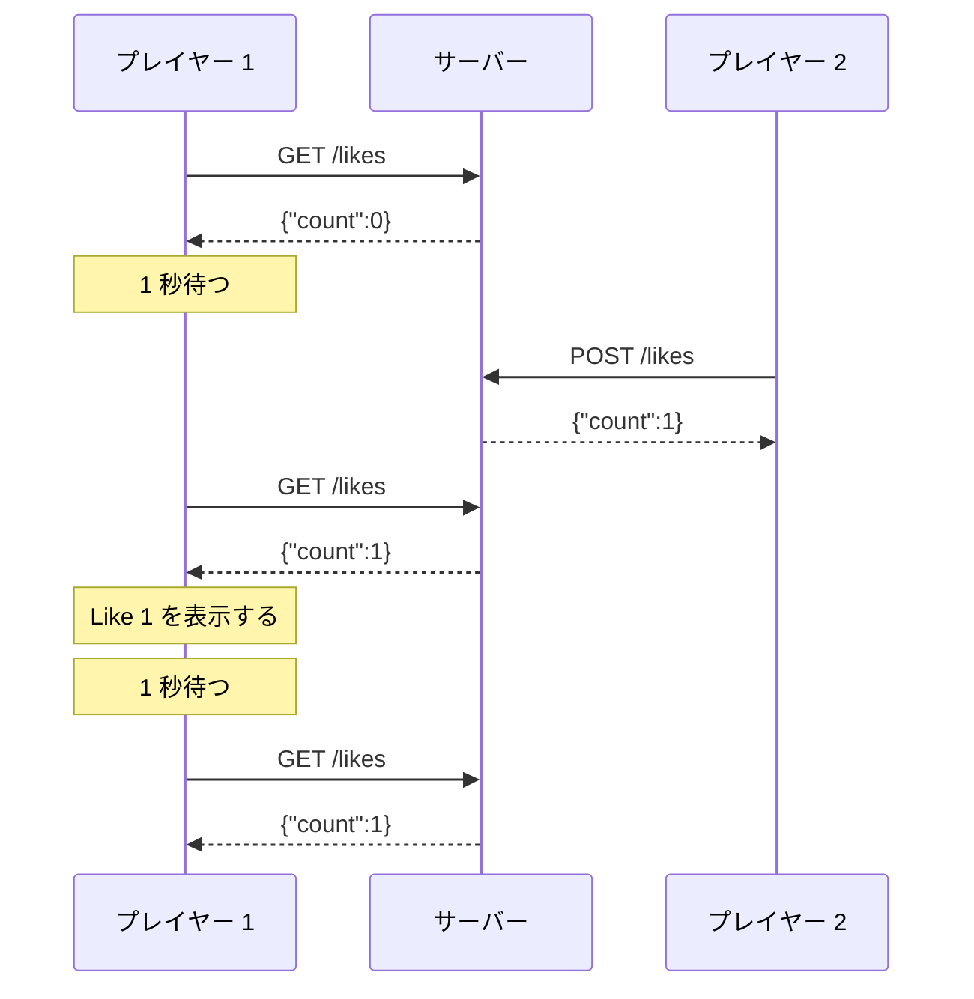
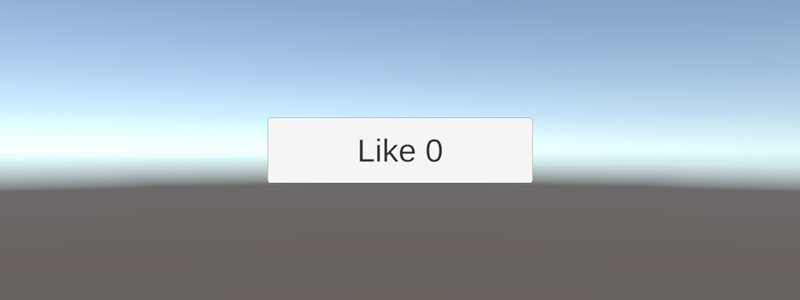
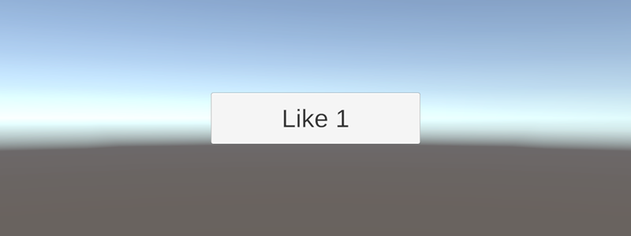
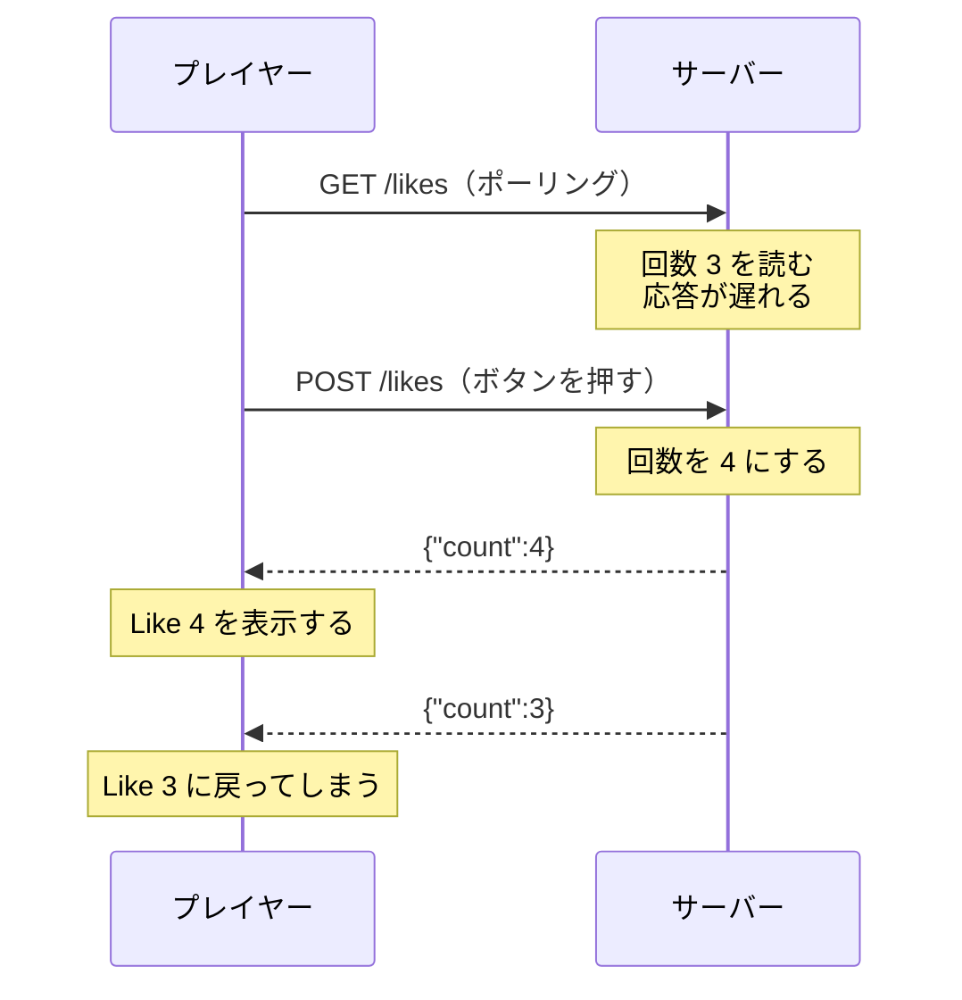

# ポーリングで追いつく

[複数のクライアントをつなぐ](/unity-csharp-learning/networking/multiple-clients/) では、ほかのクライアントが押した「いいね」は、自分からリクエストを送るまで表示に反映されないことを確かめました。このページでは、クライアントから一定の間隔でリクエストを送り、サーバーの回数に表示を追いつかせます。この方法を**ポーリング**と呼びます。あわせて、ポーリングを始めると起きるようになる「表示が古い回数に戻る」問題と、その防ぎ方を学びます。

## 学習目標

このページを読み終えると、以下のことができるようになります。

- ポーリングの仕組みと、間隔を決めるときに考えることを説明できる
- `Awaitable.WaitForSecondsAsync` と `destroyCancellationToken` を使って、コンポーネントが破棄されるまで一定の間隔でリクエストを送れる
- 先に送ったリクエストの応答が、後から届くことがある理由を説明できる
- 増えるだけの値で、今の表示より小さい値を無視して、表示が古い値に戻るのを防げる

## 前提知識

- [複数のクライアントをつなぐ](/unity-csharp-learning/networking/multiple-clients/) を読んでいること。このページでは、そのページの `SampleLikeServer` と `LikeButton` を書き換えます

---

## 1. ポーリング

HTTP では、サーバーはリクエストに応答することしかできません。ほかのクライアントがデータを変えても、サーバーからそれを知らせる手段はありません。そこで、クライアントのほうから、変化があったかどうかにかかわらず、一定の間隔でサーバーに問い合わせます。これを**ポーリング**（polling）と呼びます。



プレイヤー 2 が押した分は、プレイヤー 1 の次の `GET` で表示に反映されます。表示が遅れるのは、長くても、待つ間隔と通信にかかる時間を足した程度です。

---

## 2. 定期的に取得する

サーバーは、[複数のクライアントをつなぐ](/unity-csharp-learning/networking/multiple-clients/) の `SampleLikeServer` のまま使います。起動しておきます。

```powershell
dotnet run
```

Unity の `LikeButton` を、次のように書き換えます。`LikeCountData` とシーンは、そのまま使います。

```csharp
using System;
using System.Threading;
using TMPro;
using UnityEngine;
using UnityEngine.Networking;

public class LikeButton : MonoBehaviour
{
    [SerializeField] private string _baseUrl = "http://localhost:8080";
    [SerializeField] private int _timeoutSeconds = 3;
    [SerializeField] private float _pollIntervalSeconds = 1f;
    [SerializeField] private TMP_Text _label = null;

    private string _clientId;
    private int _shownCount = -1;

    private void Awake()
    {
        _clientId = "unity-" + Guid.NewGuid().ToString("N").Substring(0, 4);
    }

    private async void Start()
    {
        _label.text = "Like ?";
        CancellationToken token = destroyCancellationToken;
        try
        {
            while (true)
            {
                await GetLikesAsync();
                await Awaitable.WaitForSecondsAsync(_pollIntervalSeconds, token);
            }
        }
        catch (OperationCanceledException)
        {
        }
    }

    private async Awaitable GetLikesAsync()
    {
        using UnityWebRequest request = UnityWebRequest.Get($"{_baseUrl}/likes");
        LikeCountData data = await SendAsync(request);
        if (data != null)
        {
            ShowCount(data.count);
        }
    }

    public async void OnClick()
    {
        using UnityWebRequest request = new UnityWebRequest(
            $"{_baseUrl}/likes", UnityWebRequest.kHttpVerbPOST, new DownloadHandlerBuffer(), null);
        LikeCountData data = await SendAsync(request);
        if (data != null)
        {
            ShowCount(data.count);
        }
    }

    private void ShowCount(int count)
    {
        if (count == _shownCount)
        {
            return;
        }
        _shownCount = count;
        _label.text = $"Like {count}";
        Debug.Log($"{_clientId}: Like {count} を表示しました");
    }

    private async Awaitable<LikeCountData> SendAsync(UnityWebRequest request)
    {
        CancellationToken token = destroyCancellationToken;
        request.timeout = _timeoutSeconds;
        request.SetRequestHeader("Client-Id", _clientId);
        using CancellationTokenRegistration registration = token.Register(request.Abort);

        try
        {
            await request.SendWebRequest();
        }
        catch (OperationCanceledException)
        {
            return null;
        }
        if (request.result != UnityWebRequest.Result.Success)
        {
            Debug.LogError($"{_clientId}: {request.method} {request.url} は失敗しました: {request.result} / {request.responseCode} / {request.error}");
            return null;
        }
        return JsonUtility.FromJson<LikeCountData>(request.downloadHandler.text);
    }
}
```

[複数のクライアントをつなぐ](/unity-csharp-learning/networking/multiple-clients/) の `LikeButton` から、次の点を変えています。

| 変えたところ | 内容 |
|---|---|
| `Start` | 一度だけ取得するのをやめ、コンポーネントが破棄されるまで、取得と待機を繰り返す |
| `GetLikes` → `GetLikesAsync` | `Start` から `await` で待てるように、戻り値を `Awaitable` にした。コンポーネントのメニューから呼び出す必要はなくなったので、`[ContextMenu]` を外した |
| `ShowCount` | 回数を表示する処理を、`GetLikesAsync` と `OnClick` から呼び出すメソッドにまとめた。前と同じ回数なら、何もしない |
| `SendAsync` | 成功したときのログを出さないようにした。1 秒ごとにログが出て、Console ビューが埋まってしまうからだ。代わりに、`ShowCount` が、表示を変えたときだけログを出す |

### 繰り返しを書く

`Start` の中心は、次の繰り返しです。

```csharp
while (true)
{
    await GetLikesAsync();
    await Awaitable.WaitForSecondsAsync(_pollIntervalSeconds, token);
}
```

`GetLikesAsync` の応答を待ってから、`_pollIntervalSeconds` 秒だけ待ち、また `GetLikesAsync` を呼び出します。応答を待ってから次の待機に入るので、前のリクエストが終わらないうちに次のリクエストを送ることはありません。[失敗に備える](/unity-csharp-learning/networking/failure-handling/) の「重ねて送らない」を、繰り返しの形で守っています。

`Start` を `async void` にすると、Unity は `Start` を呼び出した後、`await` で待っている間も、ほかの処理を続けます。`while (true)` の繰り返しがあっても、ゲームは止まりません。

**書式：[Awaitable.WaitForSecondsAsync メソッド](https://docs.unity3d.com/ScriptReference/Awaitable.WaitForSecondsAsync.html)**
```csharp
public static Awaitable WaitForSecondsAsync(float seconds, CancellationToken cancellationToken = default);
```

[失敗に備える](/unity-csharp-learning/networking/failure-handling/) では送り直すまでの時間を待つのに使いましたが、ここでは 2 つ目の引数に `destroyCancellationToken` を渡しています。コンポーネントが破棄されると、待っている途中でも `OperationCanceledException` がスローされます。それを `catch` で受けて、繰り返しを終わらせます。Play モードを終了したときも、シーンのゲームオブジェクトが破棄されるので、繰り返しは終わります。

応答を待っている間に破棄されたときは、`SendAsync` がリクエストを中止して `null` を返します。その後の `WaitForSecondsAsync` は、トークンがすでにキャンセルされているので、すぐに `OperationCanceledException` をスローします。

### 確かめる

Play モードに入ると、ボタンの表示が `Like ?` からサーバーの今の回数に変わります。



Console ビューには、次のように表示されます。実行結果の例です。`unity-` の後ろの 4 文字は、実行するたびに変わります。

```
unity-5d0b: Like 0 を表示しました
```

サーバーのログには、1 秒ごとに `GET` が届きます。

```
--> GET /likes (unity-5d0b)
<-- 200 (unity-5d0b)
--> GET /likes (unity-5d0b)
<-- 200 (unity-5d0b)
--> GET /likes (unity-5d0b)
<-- 200 (unity-5d0b)
```

Play モードのまま、ターミナルから curl で押します。

```powershell
curl.exe -X POST -H "Client-Id: curl-A" http://localhost:8080/likes
```

```
{"count":1}
```

Unity では何も操作していないのに、1 秒ほどでボタンの表示が `Like 1` に変わります。



Console ビューには、次のように表示されます。

```
unity-5d0b: Like 1 を表示しました
```

[複数のクライアントをつなぐ](/unity-csharp-learning/networking/multiple-clients/) の「5. Unity を 2 つ動かす」と同じように、Multiplayer Play Mode で Player 2 を有効にして試すと、片方のプレイヤーで押した分が、もう片方のプレイヤーの表示にも 1 秒ほどで反映されます。

### ウィンドウがアクティブでないと止まる

ターミナルで curl を実行している間など、Unity Editor のウィンドウがアクティブでないと、Play モードのゲームが進まず、ポーリングも止まることがあります。Unity Editor に戻ると、また動き出します。Multiplayer Play Mode で Player 2 を操作している間も、Main Editor はアクティブではありません。

これは、Player 設定の **Run In Background**（**Edit → Project Settings → Player → Resolution and Presentation**）がオフのときの動きです。オンにすると、ウィンドウがアクティブでなくても、ゲームが進み続けます。スクリプトからは [Application.runInBackground](https://docs.unity3d.com/ScriptReference/Application-runInBackground.html) にあたります。ポーリングを試すときは、オンにしておくと確かめやすくなります。

---

## 3. 間隔を決める

ポーリングの間隔は、表示の遅れと、リクエストの数のどちらを優先するかで決めます。

| 間隔 | 表示の遅れ | 1 人のクライアントが 1 分間に送る `GET` |
|---|---|---|
| 0.1 秒 | ほとんどない | 約 600 回 |
| 1 秒 | 1 秒ほど | 約 60 回 |
| 5 秒 | 最大で 5 秒ほど | 約 12 回 |

リクエストの数は、クライアントの数に比例します。間隔が 1 秒でも、1000 人のプレイヤーがつながれば、サーバーには 1 秒間に約 1000 回の `GET` が届きます。そのほとんどは、前と同じ回数を返すだけです。

Inspector ビューで `Poll Interval Seconds` を `5` にして Play モードに入り、curl で押すと、表示が変わるまでに最大で 5 秒ほどかかります。サーバーのログに届く `GET` は、5 秒に 1 回になります。

どれくらいの遅れなら許されるかは、データによって違います。「いいね」の回数なら数秒遅れても困りませんが、対戦相手の位置のように、遅れるとゲームにならないデータもあります。遅れを小さくしたいからといって、間隔をどこまでも短くすることはできません。

> 💡 **ポイント**: 変化がないときに、同じ本文を何度も返さないようにする方法を、[変化がなければ本文を返さない（補足）](/unity-csharp-learning/networking/conditional-get/) で扱います。

---

## 4. 表示が古い回数に戻る

ポーリングを始めると、それまでは起きなかった問題が起きるようになります。ポーリングの `GET` の応答を待っている間にボタンを押すと、表示が一瞬、古い回数に戻ることがあるのです。

### 応答は送った順に届くとは限らない

サーバーは、複数のリクエストを同時に処理します。そのため、先に送ったリクエストの応答が、後から送ったリクエストの応答より遅れて届くことがあります。



`GET` の応答には、サーバーが回数を読んだ時点の `3` が入っています。その応答が `POST` の応答より後に届くと、クライアントは `Like 4` の後に `Like 3` を表示してしまいます。次のポーリングで `Like 4` に戻りますが、プレイヤーには、押したのに回数が減ったように見えます。

`localhost` では通信が速いので、この問題はめったに起きません。しかし、インターネットを通る通信では、応答にかかる時間はリクエストごとに大きく変わります。

### 遅い応答を作る

問題を確かめるために、サーバーの応答をわざと遅らせます。`SampleLikeServer` の `Program.cs` の `app.MapGet("/likes", ...)` の行を、次のように書き換えます。

```csharp
app.MapGet("/likes", async (int? delay) =>
{
    int count = counter.Get();
    // 動作確認用：delay を指定すると、回数を読んでから、その秒数だけ待って応答する
    if (delay != null)
    {
        await Task.Delay(TimeSpan.FromSeconds(delay.Value));
    }
    return new LikeCount(count);
});
```

クエリ文字列で `delay` を指定すると、回数を読んでから、指定した秒数だけ待って応答します。回数を読むのは待つ前なので、待っている間に回数が増えても、応答には読んだときの回数が入ります。遅いネットワークを通って、応答が遅れて届く様子をまねています。

サーバーを起動し直して、まず curl で確かめます。ターミナルのクライアント A で、`delay=3` を付けて取得します。

```powershell
curl.exe -H "Client-Id: curl-A" "http://localhost:8080/likes?delay=3"
```

3 秒たつ前に、クライアント B で押します。

```powershell
curl.exe -X POST -H "Client-Id: curl-B" http://localhost:8080/likes
```

クライアント B には、すぐに応答が返ります。

```
{"count":1}
```

その後、クライアント A に応答が返ります。

```
{"count":0}
```

後から届いた A の応答のほうが、古い回数です。サーバーのログでも、先に届いた `GET` より先に、`POST` の応答を返しています。

```
--> GET /likes (curl-A)
--> POST /likes (curl-B)
<-- 200 (curl-B)
<-- 200 (curl-A)
```

### Unity で確かめる

`LikeButton` に、ポーリングの応答を遅らせる秒数を指定するフィールドを追加します。`_pollIntervalSeconds` の行の後に、次の行を追加します。

```csharp
[SerializeField] private int _delaySeconds = 0; // 動作確認用
```

`GetLikesAsync` の 1 行目を、次のように書き換えます。

```csharp
using UnityWebRequest request = UnityWebRequest.Get($"{_baseUrl}/likes?delay={_delaySeconds}");
```

`LikeButton` の全体は、「6. 完成したコード」を見てください。ただし、「6. 完成したコード」の `ShowCount` は、次の「5. 小さい値を無視する」の変更を入れた後のものです。この節では、`ShowCount` は「2. 定期的に取得する」のままにしておきます。

Inspector ビューで `Delay Seconds` を `2`、`Poll Interval Seconds` を `1` にして、Play モードに入ります。応答に 2 秒かかり、その後 1 秒待つので、ポーリングの `GET` の応答を待っている時間が、全体の 3 分の 2 ほどになります。ボタンを何回か押すと、Console ビューに次のように表示されることがあります。

```
unity-5d0b: Like 4 を表示しました
unity-5d0b: Like 3 を表示しました
unity-5d0b: Like 4 を表示しました
```

1 行目が `POST` の応答、2 行目が押す前に送っていた `GET` の遅れた応答、3 行目が次のポーリングの応答です。ボタンの表示も、`Like 4` から `Like 3` に戻り、また `Like 4` になります。

---

## 5. 小さい値を無視する

いいねの回数は、増えることはあっても、減ることはありません。そこで、今表示している回数より小さい回数を受け取ったら、それは古い応答だと判断して、表示しないことにします。`ShowCount` を、次のように書き換えます。

```csharp
private void ShowCount(int count)
{
    if (count < _shownCount)
    {
        Debug.Log($"{_clientId}: 古い回数 {count} は表示しません（表示中は {_shownCount}）");
        return;
    }
    if (count == _shownCount)
    {
        return;
    }
    _shownCount = count;
    _label.text = $"Like {count}";
    Debug.Log($"{_clientId}: Like {count} を表示しました");
}
```

`_shownCount` は、今表示している回数です。最初は、まだ何も表示していないことを表す `-1` にしているので、最初に受け取った回数は必ず表示されます。

「4. 表示が古い回数に戻る」と同じように試すと、Console ビューに次のように表示されます。

```
unity-5d0b: Like 4 を表示しました
unity-5d0b: 古い回数 3 は表示しません（表示中は 4）
```

遅れて届いた `GET` の応答は無視され、ボタンの表示は `Like 4` のまま戻りません。

この方法が使えるのは、回数が増えるだけの値だからです。「いいねを取り消す」機能を加えて回数が減ることもあるようにすると、小さい値が古い応答なのか、取り消された後の新しい応答なのかを、値だけでは区別できなくなります。

---

## 6. 完成したコード

`SampleLikeServer` の `Program.cs` です。

```csharp
WebApplicationBuilder builder = WebApplication.CreateBuilder(args);
WebApplication app = builder.Build();

app.Use(async (context, next) =>
{
    HttpRequest request = context.Request;
    string clientId = request.Headers["Client-Id"].ToString();
    if (clientId == "")
    {
        clientId = "名乗っていない";
    }
    Console.WriteLine($"--> {request.Method} {request.Path} ({clientId})");
    await next(context);
    Console.WriteLine($"<-- {context.Response.StatusCode} ({clientId})");
});

LikeCounter counter = new LikeCounter();

app.MapGet("/likes", async (int? delay) =>
{
    int count = counter.Get();
    // 動作確認用：delay を指定すると、回数を読んでから、その秒数だけ待って応答する
    if (delay != null)
    {
        await Task.Delay(TimeSpan.FromSeconds(delay.Value));
    }
    return new LikeCount(count);
});
app.MapPost("/likes", () => new LikeCount(counter.Add()));

app.Run("http://localhost:8080");

record LikeCount(int Count);

class LikeCounter
{
    private readonly object _lock = new object();
    private int _count;

    public int Get()
    {
        lock (_lock)
        {
            return _count;
        }
    }

    public int Add()
    {
        lock (_lock)
        {
            _count++;
            return _count;
        }
    }
}
```

Unity の `LikeButton` です。`LikeCountData` は、[複数のクライアントをつなぐ](/unity-csharp-learning/networking/multiple-clients/) のままです。

```csharp
using System;
using System.Threading;
using TMPro;
using UnityEngine;
using UnityEngine.Networking;

public class LikeButton : MonoBehaviour
{
    [SerializeField] private string _baseUrl = "http://localhost:8080";
    [SerializeField] private int _timeoutSeconds = 3;
    [SerializeField] private float _pollIntervalSeconds = 1f;
    [SerializeField] private int _delaySeconds = 0; // 動作確認用
    [SerializeField] private TMP_Text _label = null;

    private string _clientId;
    private int _shownCount = -1;

    private void Awake()
    {
        _clientId = "unity-" + Guid.NewGuid().ToString("N").Substring(0, 4);
    }

    private async void Start()
    {
        _label.text = "Like ?";
        CancellationToken token = destroyCancellationToken;
        try
        {
            while (true)
            {
                await GetLikesAsync();
                await Awaitable.WaitForSecondsAsync(_pollIntervalSeconds, token);
            }
        }
        catch (OperationCanceledException)
        {
        }
    }

    private async Awaitable GetLikesAsync()
    {
        using UnityWebRequest request = UnityWebRequest.Get($"{_baseUrl}/likes?delay={_delaySeconds}");
        LikeCountData data = await SendAsync(request);
        if (data != null)
        {
            ShowCount(data.count);
        }
    }

    public async void OnClick()
    {
        using UnityWebRequest request = new UnityWebRequest(
            $"{_baseUrl}/likes", UnityWebRequest.kHttpVerbPOST, new DownloadHandlerBuffer(), null);
        LikeCountData data = await SendAsync(request);
        if (data != null)
        {
            ShowCount(data.count);
        }
    }

    private void ShowCount(int count)
    {
        if (count < _shownCount)
        {
            Debug.Log($"{_clientId}: 古い回数 {count} は表示しません（表示中は {_shownCount}）");
            return;
        }
        if (count == _shownCount)
        {
            return;
        }
        _shownCount = count;
        _label.text = $"Like {count}";
        Debug.Log($"{_clientId}: Like {count} を表示しました");
    }

    private async Awaitable<LikeCountData> SendAsync(UnityWebRequest request)
    {
        CancellationToken token = destroyCancellationToken;
        request.timeout = _timeoutSeconds;
        request.SetRequestHeader("Client-Id", _clientId);
        using CancellationTokenRegistration registration = token.Register(request.Abort);

        try
        {
            await request.SendWebRequest();
        }
        catch (OperationCanceledException)
        {
            return null;
        }
        if (request.result != UnityWebRequest.Result.Success)
        {
            Debug.LogError($"{_clientId}: {request.method} {request.url} は失敗しました: {request.result} / {request.responseCode} / {request.error}");
            return null;
        }
        return JsonUtility.FromJson<LikeCountData>(request.downloadHandler.text);
    }
}
```

`Delay Seconds` は、動作を確かめるためのものです。確かめ終わったら `0` に戻します。

---

## よくあるミス

### 待たずに繰り返す

`WaitForSecondsAsync` を書き忘れると、応答が届くたびに、すぐ次のリクエストを送ります。

```csharp
// ❌ NG: 待たずに、次のリクエストを送ってしまう
while (true)
{
    await GetLikesAsync();
}
```

ゲームは止まりませんが、サーバーのログが `GET` で埋め尽くされます。`localhost` では通信が速いので、1 秒間に何百回ものリクエストが届きます。ポーリングの繰り返しには、必ず待つ時間を入れます。

### 間隔を短くしすぎる

表示の遅れを減らそうとして、間隔を `0.1` 秒のように短くすると、「3. 間隔を決める」のとおり、クライアントの数に比例してサーバーに届くリクエストが増えます。間隔は、そのデータにどれくらいの遅れが許されるかから決めます。

---

## まとめ

- ポーリングは、変化があったかどうかにかかわらず、クライアントから一定の間隔でサーバーに問い合わせる方法。サーバーから知らせる手段がない HTTP でも、ほかのクライアントの変化に追いつける
- 繰り返しは、応答を待ってから `Awaitable.WaitForSecondsAsync` で待つ形で書く。前のリクエストと重ならない。`destroyCancellationToken` を渡すと、コンポーネントが破棄されたときに繰り返しが終わる
- 間隔を短くすると表示の遅れは減るが、リクエストの数がクライアントの数に比例して増える。間隔は、そのデータに許される遅れから決める
- 応答は、送った順に届くとは限らない。ポーリングの古い応答が、後から届くことがある
- 増えるだけの値なら、今の表示より小さい値を無視すると、表示が古い値に戻るのを防げる

---

## 理解度チェック

1. ポーリングの間隔を 2 秒にしました。ほかのクライアントが押してから、表示に反映されるまでの時間は、およそ最大で何秒ですか？ 通信にかかる時間は無視できるものとします。
2. ポーリングの間隔が 1 秒のクライアントが 300 人つながっています。サーバーに届く `GET` は、1 分間におよそ何回ですか？
3. 「5. 小さい値を無視する」の `ShowCount` で、表示中が `Like 5` のとき、`5`、`4`、`6` の順に回数を受け取りました。それぞれの回数を受け取った後、ボタンの表示はどうなっていますか？
4. 「いいねを取り消す」機能を加えて、回数が減ることもあるようにすると、小さい値を無視する方法が使えなくなるのはなぜですか？

<details markdown="1">
<summary>解答を見る</summary>

1. 約 2 秒です。押された直後にポーリングの応答を受け取った場合、次の `GET` を送るのは 2 秒後です。
2. 約 18000 回です。1 人が 1 分間に約 60 回送るので、60 × 300 = 18000 です。
3. `5` を受け取った後は `Like 5` のまま（同じ回数なので何もしない）、`4` を受け取った後も `Like 5` のまま（古い回数として無視する）、`6` を受け取った後は `Like 6` です。
4. 小さい値を受け取ったとき、それが遅れて届いた古い応答なのか、取り消された後の新しい応答なのかを、値だけでは区別できないからです。取り消された後の正しい回数まで、無視してしまいます。

</details>

---

## 次のステップ

[変化がなければ本文を返さない（補足）](/unity-csharp-learning/networking/conditional-get/) では、ポーリングで変化がないときに、サーバーが本文を返さずに済ませる方法を扱います。
