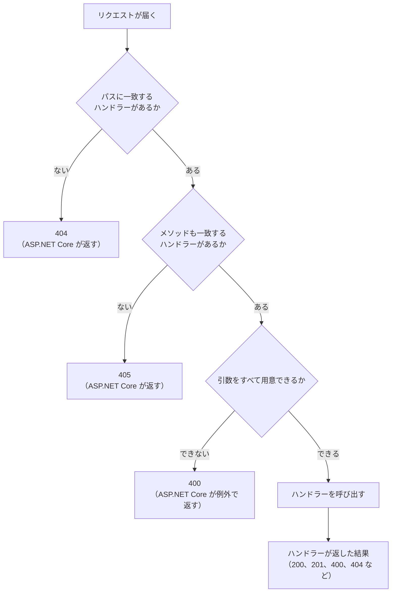

# 本文でデータを送る

[値を受け取って結果を返す](/unity-csharp-learning/networking/parameters/) では、URL で値を渡して、サーバーに計算してもらいました。このページでは、サーバーにメッセージを送って保存してもらい、保存したメッセージを取り出せるようにします。サーバーのデータを変えるリクエストに使う **`POST`** メソッドと、URL ではなくリクエストの**本文**に値を入れて送る方法を学びます。

## 学習目標

このページを読み終えると、以下のことができるようになります。

- データを変える操作に `GET` ではなく `POST` を使う理由を説明できる
- URL に値を入れて送る方法と、本文に入れて送る方法の違いを説明できる
- ハンドラーの `Stream` 型の引数で、リクエストの本文を読める
- `201 Created` と `405 Method Not Allowed` が返る場面を説明できる
- 複数のリクエストから同じデータを使うときに、`lock` で守る必要がある理由を説明できる

## 前提知識

- [値を受け取って結果を返す](/unity-csharp-learning/networking/parameters/) を読んでいること。このページでは、そのページで作った `SampleHttpServer` を書き換えます
- [List\<T\>](/unity-csharp-learning/csharp/list/) を読んでいること
- [共有データと lock](/unity-csharp-learning/csharp/thread-safety/) を読んでいること

---

## 1. データを変える操作には POST を使う

ここまでのリクエストは、すべて `GET` メソッドでした。`GET` は「取得する」という意味のメソッドで、サーバーのデータを変えないことになっています。何度送っても、サーバーの状態は変わりません。

この約束があるので、ブラウザやネットワークの途中にある仕組みは、`GET` のリクエストを気軽に送ります。

- ブラウザは、ページを速く開くために、リンク先を先に読み込んでおくことがある
- 検索エンジンのプログラム（クローラー）は、見つけたリンクを次々に `GET` で開く
- 通信に失敗したとき、`GET` なら送り直しても問題ないとみなされる

`GET /messages/add?text=Hello` のような URL でメッセージを追加できるようにすると、誰も追加していないのに、メッセージが増えることがあります。サーバーのデータを変える操作には、`GET` 以外のメソッドを使います。

データを変えるメソッドには、次のようなものがあります。

| メソッド | 意味 | 同じリクエストを何度送っても結果が同じか |
|---|---|---|
| `POST` | データを送って処理してもらう（新しく作るなど） | 違う（送るたびに増える） |
| `PUT` | 指定したもので置き換える | 同じ |
| `DELETE` | 削除する | 同じ（2 回目は、もうないだけ） |

このシリーズでは、データを変える操作には `POST` を使います。`POST` は、同じリクエストを 2 回送ると、同じメッセージが 2 つ追加されるかもしれない点に注意が必要です。この性質は、通信の失敗に備える回で、もう一度扱います。

---

## 2. 本文に値を入れて送る

`POST` でメッセージを送るとき、メッセージの文字列をどこに入れるかを考えます。前のページのように URL のクエリ文字列に入れることもできますが、URL には次のような弱点があります。

- **長さに限りがある**：サーバーやブラウザは、受け付ける URL の長さに上限を設けている。長い文章や大きなデータは送れない
- **記録に残る**：URL は、ブラウザの履歴や、サーバーのログに残る。このシリーズのサーバーも、ミドルウェアでクエリ文字列をログに出している
- **文字しか入れられない**：画像のような、文字ではないデータはそのまま入れられない

そこで、送るデータはリクエストの**本文**（body）に入れます。[TCP で受け取る](/unity-csharp-learning/networking/tcp-receive/) では、リクエストを「リクエスト行、ヘッダー、空行」と見ましたが、空行の後ろに本文を付けて送ることもできます。

```
POST /messages HTTP/1.1
Host: localhost:8080
Content-Type: text/plain
Content-Length: 5

Hello
```

本文に何が入っているかは、ヘッダーで相手に伝えます。

| ヘッダー | 内容 |
|---|---|
| `Content-Type` | 本文のデータの種類。`text/plain` は、ただのテキスト |
| `Content-Length` | 本文の長さ（バイト数） |

本文は、ただのバイト列です。テキストは、本文に入れられるデータの 1 つにすぎません。`Content-Type` を変えれば、画像などのテキストではないデータも送れます。

---

## 3. メッセージを保存するクラス

まず、メッセージを保存しておくクラスを作ります。メッセージは `List<string>` に追加した順に保存し、1 から始まる番号で取り出せるようにします。このサーバーではメッセージを削除しないので、番号は、リストの中の位置に 1 を足したものになります。

[ASP.NET Core でサーバーを作る](/unity-csharp-learning/networking/aspnetcore-server/) の「7. 同時に複数の接続を処理する」で見たように、Kestrel は、複数のリクエストのハンドラーを別々のスレッドで同時に呼び出すことがあります。`List<T>` は、複数のスレッドから同時に書き換えると、中身が壊れることがあります。そこで、[共有データと lock](/unity-csharp-learning/csharp/thread-safety/) で学んだ `lock` 文を使い、一度に 1 つのスレッドだけがメッセージを読み書きするようにします。

```csharp
class MessageStore
{
    private readonly List<string> _messages = new List<string>();

    public List<string> GetAll()
    {
        lock (_messages)
        {
            return new List<string>(_messages);
        }
    }

    public bool TryGet(int id, out string? text)
    {
        lock (_messages)
        {
            if (id < 1 || id > _messages.Count)
            {
                text = null;
                return false;
            }
            text = _messages[id - 1];
            return true;
        }
    }

    public int Add(string text)
    {
        lock (_messages)
        {
            _messages.Add(text);
            return _messages.Count;
        }
    }
}
```

`GetAll` は、`List` そのものではなく、中身をコピーした新しい `List` を返します。`List` そのものを返すと、呼び出し側が `lock` の外で読んでいる最中に、別のスレッドが書き換えるおそれがあるからです。

`Add` は、追加したメッセージの番号を返します。追加した後の要素の数が、そのまま追加したメッセージの番号になります。

---

## 4. 一覧と 1 件を返す

`SampleHttpServer` の `Program.cs` を、次のように書き換えます。ログを出すミドルウェアはそのまま残し、前の回の `/damage` と `/items` のハンドラーは削除します。最後に、前の節の `MessageStore` クラスを書いています。トップレベルのステートメントと同じファイルに型を宣言するときは、型の宣言をステートメントより後ろに書きます。

```csharp
using System.Text;

WebApplicationBuilder builder = WebApplication.CreateBuilder(args);
WebApplication app = builder.Build();

app.Use(async (context, next) =>
{
    HttpRequest request = context.Request;
    Console.WriteLine($"--> {request.Method} {request.Path}{request.QueryString}");
    await next(context);
    Console.WriteLine($"<-- {context.Response.StatusCode}");
});

MessageStore store = new MessageStore();

app.MapGet("/messages", (string? contains) =>
{
    List<string> messages = store.GetAll();
    StringBuilder sb = new StringBuilder();
    for (int i = 0; i < messages.Count; i++)
    {
        if (contains == null || messages[i].Contains(contains))
        {
            sb.Append($"{i + 1}: {messages[i]}\n");
        }
    }
    return sb.ToString();
});

app.MapGet("/messages/{id:int}", (int id) =>
{
    if (store.TryGet(id, out string? text))
    {
        return Results.Text(text);
    }
    return Results.NotFound();
});

app.Run("http://localhost:8080");

class MessageStore
{
    private readonly List<string> _messages = new List<string>();

    public List<string> GetAll()
    {
        lock (_messages)
        {
            return new List<string>(_messages);
        }
    }

    public bool TryGet(int id, out string? text)
    {
        lock (_messages)
        {
            if (id < 1 || id > _messages.Count)
            {
                text = null;
                return false;
            }
            text = _messages[id - 1];
            return true;
        }
    }

    public int Add(string text)
    {
        lock (_messages)
        {
            _messages.Add(text);
            return _messages.Count;
        }
    }
}
```

`store` は、`app.Run` でサーバーが動いている間、ずっと同じオブジェクトが使われます。すべてのリクエストのハンドラーが、この 1 つの `store` を共有します。

`/messages` のハンドラーは、メッセージの一覧を、1 行に 1 つずつ `番号: メッセージ` の形で並べた文字列にして返します。引数 `contains` は、[値を受け取って結果を返す](/unity-csharp-learning/networking/parameters/) の「3. 値が足りないとき、変換できないとき」で見たように、null 許容の型にして省略できるようにしています。`contains` を指定したときは、その文字列を含むメッセージだけを返し、省略したとき（`null` のとき）は、すべてのメッセージを返します。

`/messages/{id:int}` のハンドラーは、[値を受け取って結果を返す](/unity-csharp-learning/networking/parameters/) の `/items/{id:int}` と同じように、番号のメッセージを返し、なければ `404` を返します。

サーバーを起動して、curl でアクセスします。

```powershell
curl.exe -i http://localhost:8080/messages
```

まだメッセージがないので、本文は空です。実行結果の例です。`Date` の日時は実行するたびに変わります。

```
HTTP/1.1 200 OK
Content-Type: text/plain; charset=utf-8
Date: Sun, 27 Sep 2026 17:30:00 GMT
Server: Kestrel
Transfer-Encoding: chunked

```

---

## 5. メッセージを追加する（POST）

メッセージを追加するハンドラーを、`app.Run` の前に追加します。

```csharp
app.MapPost("/messages", async (Stream body) =>
{
    using StreamReader reader = new StreamReader(body);
    string text = await reader.ReadToEndAsync();
    if (text == "")
    {
        return Results.BadRequest();
    }
    int id = store.Add(text);
    return Results.Created($"/messages/{id}", null);
});
```

**書式：[EndpointRouteBuilderExtensions.MapPost メソッド](https://learn.microsoft.com/dotnet/api/microsoft.aspnetcore.builder.endpointroutebuilderextensions.mappost)**
```csharp
public static RouteHandlerBuilder MapPost(this IEndpointRouteBuilder endpoints, string pattern, Delegate handler);
```

`MapPost` は、`POST` メソッドのリクエストに対するハンドラーを登録します。使い方は `MapGet` と同じです。同じ `/messages` のパスでも、`GET` なら一覧の取得、`POST` ならメッセージの追加と、メソッドによって呼び出されるハンドラーが変わります。

### 本文を読む

ハンドラーの引数に [Stream](https://learn.microsoft.com/dotnet/api/system.io.stream) 型の引数を書くと、ASP.NET Core は、リクエストの本文を読むための `Stream` を渡します。`int` や `string` の引数がクエリ文字列から値を受け取るのとは違い、`Stream` の引数は本文を受け取ります。

`Stream` は、バイト列を先頭から順に読み書きするためのクラスの基底クラスです。[TCP で受け取る](/unity-csharp-learning/networking/tcp-receive/) で使った `NetworkStream` も、`Stream` を継承したクラスの 1 つです。読む元が TCP の接続でも、リクエストの本文でも、`Stream` であれば同じ `StreamReader` で読めます。

[TCP で送る](/unity-csharp-learning/networking/tcp-send/) で `NetworkStream` を読んだときと同じように、`StreamReader` の `ReadToEndAsync` で、本文をすべて文字列として読みます。本文の終わりは、ASP.NET Core が `Content-Length` などのヘッダーを見て判断してくれるので、接続が閉じられるのを待つ必要はありません。

本文が空のときは、追加するメッセージがないので、`400` を返しています。

### 結果を返す

**書式：[Results.Created メソッド](https://learn.microsoft.com/dotnet/api/microsoft.aspnetcore.http.results.created)**
```csharp
public static IResult Created(string? uri, object? value);
```

| パラメータ | 説明 |
|---|---|
| `uri` | 作ったデータのパス。応答の `Location` ヘッダーになる |
| `value` | 本文にするデータ。`null` なら本文は空になる |

`Results.Created` は、`201 Created` の応答を返します。`201` は「リクエストによって新しいデータを作った」ことを表します。`Location` ヘッダーで、追加したメッセージを取得できるパスをクライアントに知らせます。

### curl で追加する

サーバーを起動し直して、curl でメッセージを追加します。`-X` でメソッドを、`-d` で本文を指定します。

```powershell
curl.exe -i -X POST -d "Hello" http://localhost:8080/messages
```

実行結果の例です。`Date` の日時は実行するたびに変わります。

```
HTTP/1.1 201 Created
Content-Length: 0
Date: Sun, 27 Sep 2026 17:30:00 GMT
Server: Kestrel
Location: /messages/1

```

もう 1 つ追加します。

```powershell
curl.exe -i -X POST -d "Good morning" http://localhost:8080/messages
```

2 つ目の応答では、`Location` が `/messages/2` になります。一覧と、`Location` のパスを取得します。

```powershell
curl.exe http://localhost:8080/messages
curl.exe http://localhost:8080/messages/2
```

```
1: Hello
2: Good morning
Good morning
```

クエリ文字列の `contains` で、一覧を絞り込めます。

```powershell
curl.exe "http://localhost:8080/messages?contains=Good"
```

```
2: Good morning
```

サーバーのログを見ると、`POST` のリクエストのパスには、メッセージの内容が含まれていません。

```
--> POST /messages
<-- 201
--> POST /messages
<-- 201
--> GET /messages
<-- 200
--> GET /messages/2
<-- 200
--> GET /messages?contains=Good
<-- 200
```

本文を付けずに `POST` を送ると、`400` が返ります。

```powershell
curl.exe -i -X POST http://localhost:8080/messages
```

```
HTTP/1.1 400 Bad Request
Content-Length: 0
Date: Sun, 27 Sep 2026 17:30:00 GMT
Server: Kestrel

```

サーバーを起動し直すと、メッセージは消えています。メッセージはサーバーのメモリにしか保存していないので、サーバーを止めると失われるからです。

### 送ったリクエストを見る

curl に `-v` を付けると、送ったリクエストと受け取った応答のヘッダーを表示します。日本語のメッセージを送って、確かめます。

```powershell
curl.exe -v -X POST -d "こんにちは" http://localhost:8080/messages
```

実行結果のうち、`>` で始まる行が、curl が送ったリクエストです。実行結果の例です。`User-Agent` の値は、curl のバージョンによって変わります。

```
> POST /messages HTTP/1.1
> Host: localhost:8080
> User-Agent: curl/8.21.0
> Accept: */*
> Content-Length: 15
> Content-Type: application/x-www-form-urlencoded
>
```

`Content-Length` は `15` です。`こんにちは` は 5 文字ですが、curl は本文を UTF-8 で送り、UTF-8 では 1 文字が 3 バイトなので、15 バイトになります。`Content-Length` は、文字数ではなくバイト数です。

`Content-Type` には、curl が `-d` のときに付ける `application/x-www-form-urlencoded`（Web ページのフォームの形式）が入っています。このサーバーは `Content-Type` を見ずに、本文をそのまま 1 つのメッセージとして扱っています。本文の形式を決めてやり取りする方法は、JSON の回で扱います。

---

## 6. 登録していないメソッド

`/messages/2` には、`GET` のハンドラーだけを登録しています。ここに `DELETE` のリクエストを送ってみます。

```powershell
curl.exe -i -X DELETE http://localhost:8080/messages/2
```

実行結果の例です。`Date` の日時は実行するたびに変わります。

```
HTTP/1.1 405 Method Not Allowed
Content-Length: 0
Date: Sun, 27 Sep 2026 17:30:00 GMT
Server: Kestrel
Allow: GET

```

パスに一致するハンドラーはあるが、メソッドが一致しないときは、ASP.NET Core が自動で `405 Method Not Allowed` を返します。`Allow` ヘッダーには、このパスで使えるメソッドが並んでいます。

[値を受け取って結果を返す](/unity-csharp-learning/networking/parameters/) の「6. ステータスコード」の図に、メソッドの確認を加えると、次のようになります。



このページで新しく使ったステータスコードは次のとおりです。

| ステータスコード | 意味 | このページで返した場面 |
|---|---|---|
| `201 Created` | 新しいデータを作った | `POST` でメッセージを追加した |
| `405 Method Not Allowed` | そのメソッドは使えない | ハンドラーを登録していないメソッドが来た |

---

## 完成したコード

このページで作った `Program.cs` の全体です。

```csharp
using System.Text;

WebApplicationBuilder builder = WebApplication.CreateBuilder(args);
WebApplication app = builder.Build();

app.Use(async (context, next) =>
{
    HttpRequest request = context.Request;
    Console.WriteLine($"--> {request.Method} {request.Path}{request.QueryString}");
    await next(context);
    Console.WriteLine($"<-- {context.Response.StatusCode}");
});

MessageStore store = new MessageStore();

app.MapGet("/messages", (string? contains) =>
{
    List<string> messages = store.GetAll();
    StringBuilder sb = new StringBuilder();
    for (int i = 0; i < messages.Count; i++)
    {
        if (contains == null || messages[i].Contains(contains))
        {
            sb.Append($"{i + 1}: {messages[i]}\n");
        }
    }
    return sb.ToString();
});

app.MapGet("/messages/{id:int}", (int id) =>
{
    if (store.TryGet(id, out string? text))
    {
        return Results.Text(text);
    }
    return Results.NotFound();
});

app.MapPost("/messages", async (Stream body) =>
{
    using StreamReader reader = new StreamReader(body);
    string text = await reader.ReadToEndAsync();
    if (text == "")
    {
        return Results.BadRequest();
    }
    int id = store.Add(text);
    return Results.Created($"/messages/{id}", null);
});

app.Run("http://localhost:8080");

class MessageStore
{
    private readonly List<string> _messages = new List<string>();

    public List<string> GetAll()
    {
        lock (_messages)
        {
            return new List<string>(_messages);
        }
    }

    public bool TryGet(int id, out string? text)
    {
        lock (_messages)
        {
            if (id < 1 || id > _messages.Count)
            {
                text = null;
                return false;
            }
            text = _messages[id - 1];
            return true;
        }
    }

    public int Add(string text)
    {
        lock (_messages)
        {
            _messages.Add(text);
            return _messages.Count;
        }
    }
}
```

---

## よくあるミス

### 本文を string の引数で受け取ろうとする

`int` や `string` のような単純な型の引数は、本文ではなく、クエリ文字列から値を受け取ります。`POST` のハンドラーでも同じです。

```csharp
// ❌ NG: text はクエリ文字列から探される
app.MapPost("/messages", (string text) =>
{
    int id = store.Add(text);
    return Results.Created($"/messages/{id}", null);
});
```

本文に `Hello` を入れて送っても、クエリ文字列に `text` がないので、`400` が返ります。

```
Microsoft.AspNetCore.Http.BadHttpRequestException: Required parameter "string text" was not provided from query string.
```

本文をそのまま読むときは、`Stream` 型の引数で受け取ります。

### 本文を ReadToEnd で読む

`ReadToEndAsync` の代わりに、`await` のいらない `ReadToEnd` で本文を読むと、例外がスローされ、`500 Internal Server Error` が返ります。

```csharp
// ❌ NG: 本文を、待たずに読もうとしている
app.MapPost("/messages", (Stream body) =>
{
    using StreamReader reader = new StreamReader(body);
    string text = reader.ReadToEnd();
    // （後は同じ）
});
```

```
System.InvalidOperationException: Synchronous operations are disallowed. Call ReadAsync or set AllowSynchronousIO to true instead.
```

本文は、ネットワークから少しずつ届きます。`ReadToEnd` は、届くまでスレッドを止めて待つので、多くのリクエストを同時に処理するサーバーでは、スレッドが足りなくなるおそれがあります。そのため Kestrel は、本文を待たずに読む操作を、標準では禁止しています。本文は、`ReadToEndAsync` のように `Async` の付いたメソッドで読みます。

---

## まとめ

- `GET` はサーバーのデータを変えない。ブラウザやクローラーは `GET` を気軽に送るので、データを変える操作には `POST` などのメソッドを使う
- `POST` は、同じリクエストを何度も送ると、そのたびに結果が変わる
- 送るデータは、URL ではなくリクエストの本文に入れる。本文の種類は `Content-Type` で、長さは `Content-Length` のバイト数で伝える
- `MapPost` で `POST` のハンドラーを登録する。`Stream` 型の引数で本文を受け取り、`ReadToEndAsync` で読む
- `Results.Created` は、`201 Created` と、作ったデータのパスを表す `Location` ヘッダーを返す
- パスに一致するハンドラーがあっても、メソッドが一致しなければ `405` が返る
- ハンドラーは同時に呼び出されることがあるので、共有するデータは `lock` で守る

---

## 理解度チェック

1. ゲームのプレイヤーが、自分の名前を変更する API を作ります。`GET /rename?name=Taro` のように作ってはいけないのはなぜですか？
2. このページのサーバーを起動した直後に、`curl.exe -X POST -d "Hi" http://localhost:8080/messages` を 2 回送り、続けて `curl.exe http://localhost:8080/messages` を送りました。表示される内容を答えてください。
3. このページのサーバーに、次のリクエストを送ると、ステータスコードはそれぞれいくつになりますか？
   1. `DELETE /messages`
   2. `GET /messages/1`（メッセージがないとき）
   3. `POST /messages/1`
4. `curl.exe -v -X POST -d "あいう" http://localhost:8080/messages` を実行すると、`Content-Length` はいくつになりますか？
5. `MessageStore` のメソッドで `lock` を使わないと、どのような問題が起きる可能性がありますか？

<details markdown="1">
<summary>解答を見る</summary>

1. `GET` は、サーバーのデータを変えないことになっているからです。ブラウザの先読みやクローラーが、誰も操作していないのにこの URL を開くと、名前が変わってしまいます。また、名前が URL に入るので、ログや履歴にも残ります。データを変える操作には `POST` を使い、名前は本文に入れて送ります。
2. 次のように表示されます。`POST` は送るたびに追加されるので、同じ内容のメッセージが 2 つできます。

   ```
   1: Hi
   2: Hi
   ```

3. それぞれ次のとおりです。
   1. `405` です。`/messages` には `GET` と `POST` のハンドラーがありますが、`DELETE` のハンドラーはありません。
   2. `404` です。ハンドラーは呼び出されますが、番号 1 のメッセージがないので、`Results.NotFound` を返します。
   3. `405` です。`/messages/1` には `GET` のハンドラーしかありません。
4. `9` です。`あいう` は 3 文字で、UTF-8 では 1 文字が 3 バイトなので、9 バイトです。
5. Kestrel は複数のリクエストのハンドラーを別々のスレッドで同時に呼び出すことがあるので、`List` が同時に書き換えられて中身が壊れたり、2 つのメッセージに同じ番号が返されたりする可能性があります。

</details>

---

## 次のステップ

[Unity から通信する](/unity-csharp-learning/networking/unity-webrequest/) では、Unity から `UnityWebRequest` を使って、公開されている文書を取得し、自分のサーバーにデータを送ります。

ハンドラーの引数や `Results` のメソッドが、実際にはリクエストと応答をどのように扱っているのかは、[HttpContext で仕組みを見る（補足）](/unity-csharp-learning/networking/http-context/) で扱います。
