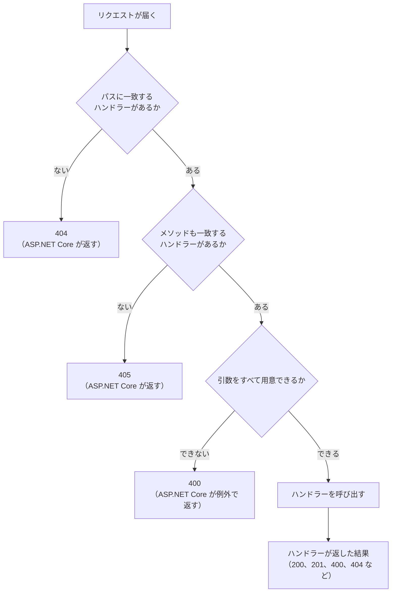

# 本文でデータを送る

[値を受け取って結果を返す](/unity-csharp-learning/networking/parameters/) では、URL で値を渡しました。このページでは、URL ではなく、リクエストの**本文**に入れてデータを送ります。HTTP のリクエストの本文とは何かを確かめ、`POST` メソッドで送られた本文をサーバーで読みます。最後に、送られたメッセージをサーバーに保存する例を作ります。

## 学習目標

このページを読み終えると、以下のことができるようになります。

- HTTP のリクエストの本文と、本文に関するヘッダー（`Content-Type`、`Content-Length`）を説明できる
- `MapPost` でハンドラーを登録し、`Stream` 型の引数で本文を読める
- 本文を送るときや、データを変える操作に、`GET` ではなく `POST` を使う理由を説明できる
- `201 Created` と `405 Method Not Allowed` が返る場面を説明できる
- 複数のリクエストから同じデータを使うときに、`lock` で守る必要がある理由を説明できる

## 前提知識

- [値を受け取って結果を返す](/unity-csharp-learning/networking/parameters/) を読んでいること。このページでは、そのページまでに作った `SampleHttpServer` のプロジェクトを書き換えます
- [List\<T\>](/unity-csharp-learning/csharp/list/) を読んでいること
- [共有データと lock](/unity-csharp-learning/csharp/thread-safety/) を読んでいること

---

## 1. リクエストの本文

[TCP で受け取る](/unity-csharp-learning/networking/tcp-receive/) では、ブラウザや curl が送ってきたリクエストを、空行まで読みました。リクエストは「リクエスト行、ヘッダー、空行」でできていて、空行がヘッダーの終わりを表していました。

空行まで読めば十分だったのは、それらが `GET` のリクエストで、空行の後ろに何も付いていなかったからです。リクエストには、空行の後ろにデータを付けて送ることもできます。この部分を、リクエストの**本文**（body）と呼びます。

```
POST /echo HTTP/1.1
Host: localhost:8080
Content-Type: text/plain
Content-Length: 5

Hello
```

この例では、空行の後ろの `Hello` が本文です。本文がどんなデータで、どこまで続くのかは、ヘッダーで相手に伝えます。

| ヘッダー | 内容 |
|---|---|
| `Content-Type` | 本文のデータの種類。`text/plain` は、ただのテキスト |
| `Content-Length` | 本文の長さ（バイト数） |

[TCP で送る](/unity-csharp-learning/networking/tcp-send/) で見た応答の本文と、同じ仕組みです。受け取る側は、`Content-Length` のバイト数だけ読めば、本文の終わりがわかります。

本文は、ただのバイト列です。テキストは、本文に入れられるデータの 1 つにすぎません。`Content-Type` を変えれば、画像などのテキストではないデータも送れます。

### URL で送る方法との違い

前のページのように、値は URL のクエリ文字列に入れても送れます。しかし、URL には次のような弱点があります。

- **長さに限りがある**：サーバーやブラウザは、受け付ける URL の長さに上限を設けている。長い文章や大きなデータは送れない
- **記録に残る**：URL は、ブラウザの履歴や、サーバーのログに残る。このシリーズのサーバーも、ミドルウェアでクエリ文字列をログに出している
- **文字しか入れられない**：画像のような、文字ではないデータはそのまま入れられない

送るデータが大きいときや、URL に残したくないときは、本文に入れて送ります。

---

## 2. MapPost で本文を受け取る

### 本文を送るときのメソッド

ここまでのリクエストは、すべて `GET` メソッドでした。HTTP の仕様（[RFC 9110 の GET の節](https://www.rfc-editor.org/rfc/rfc9110.html#name-get)）では、`GET` のリクエストの本文には、決まった意味がないとされています。本文を受け付けないサーバーもあるので、本文でデータを送るときは、**`POST`** メソッドを使います。

### サーバーを作る

`SampleHttpServer` の `Program.cs` を、次のように書き換えます。ログを出すミドルウェアのほかには、届いた本文に `受け取りました: ` を付けて送り返すハンドラーを 1 つだけ登録します。

```csharp
WebApplicationBuilder builder = WebApplication.CreateBuilder(args);
WebApplication app = builder.Build();

app.Use(async (context, next) =>
{
    HttpRequest request = context.Request;
    Console.WriteLine($"--> {request.Method} {request.Path}{request.QueryString}");
    await next(context);
    Console.WriteLine($"<-- {context.Response.StatusCode}");
});

app.MapPost("/echo", async (Stream body) =>
{
    using StreamReader reader = new StreamReader(body);
    string text = await reader.ReadToEndAsync();
    return $"受け取りました: {text}";
});

app.Run("http://localhost:8080");
```

**書式：[EndpointRouteBuilderExtensions.MapPost メソッド](https://learn.microsoft.com/dotnet/api/microsoft.aspnetcore.builder.endpointroutebuilderextensions.mappost)**
```csharp
public static RouteHandlerBuilder MapPost(this IEndpointRouteBuilder endpoints, string pattern, Delegate handler);
```

`MapPost` は、`POST` メソッドで、パスが `pattern` に一致するリクエストが届いたときに呼び出すハンドラーを登録します。使い方は `MapGet` と同じで、違うのは、対象のメソッドが `GET` ではなく `POST` であることです。

### 本文を読む

ハンドラーの引数に [Stream](https://learn.microsoft.com/dotnet/api/system.io.stream) 型の引数を書くと、ASP.NET Core は、リクエストの本文を読むための `Stream` を渡します。`int` や `string` の引数がクエリ文字列から値を受け取るのとは違い、`Stream` の引数は本文を受け取ります。

`Stream` は、バイト列を先頭から順に読み書きするためのクラスの基底クラスです。[TCP で受け取る](/unity-csharp-learning/networking/tcp-receive/) で使った `NetworkStream` も、`Stream` を継承したクラスの 1 つです。読む元が TCP の接続でも、リクエストの本文でも、`Stream` であれば同じ `StreamReader` で読めます。

[TCP で送る](/unity-csharp-learning/networking/tcp-send/) で `NetworkStream` を読んだときと同じように、`StreamReader` の `ReadToEndAsync` で、本文をすべて文字列として読みます。本文の終わりは、ASP.NET Core が `Content-Length` などのヘッダーを見て判断してくれるので、接続が閉じられるのを待つ必要はありません。

---

## 3. curl で送る

サーバーを起動します。

```powershell
dotnet run
```

別のターミナルから、curl で本文を送ります。`-X` でメソッドを、`-d` で本文を指定します。

```powershell
curl.exe -X POST -d "Hello" http://localhost:8080/echo
```

```
受け取りました: Hello
```

サーバーのログには、次のように表示されます。

```
--> POST /echo
<-- 200
```

ログに出ているのはメソッドとパスだけで、送った `Hello` は含まれていません。本文は URL の外にあるからです。

---

## 4. 送ったリクエストを見る

curl に `-v` を付けると、送ったリクエストと受け取った応答のヘッダーを表示します。日本語の本文を送って、確かめます。

```powershell
curl.exe -v -X POST -d "こんにちは" http://localhost:8080/echo
```

実行結果のうち、`>` で始まる行が、curl が送ったリクエストです。実行結果の例です。`User-Agent` の値は、curl のバージョンによって変わります。

```
> POST /echo HTTP/1.1
> Host: localhost:8080
> User-Agent: curl/8.21.0
> Accept: */*
> Content-Length: 15
> Content-Type: application/x-www-form-urlencoded
>
```

`Content-Length` は `15` です。`こんにちは` は 5 文字ですが、curl は本文を UTF-8 で送り、UTF-8 では 1 文字が 3 バイトなので、15 バイトになります。`Content-Length` は、文字数ではなくバイト数です。

`Content-Type` には、curl が `-d` のときに付ける `application/x-www-form-urlencoded`（Web ページのフォームの形式）が入っています。このサーバーは `Content-Type` を見ずに、本文をそのまま文字列として扱っています。本文の形式を決めてやり取りする方法は、JSON の回で扱います。

---

## 5. 登録していないメソッド

`/echo` には、`POST` のハンドラーだけを登録しています。ここに `GET` のリクエストを送ってみます。curl は、`-X` も `-d` も付けなければ `GET` を送ります。

```powershell
curl.exe -i http://localhost:8080/echo
```

実行結果の例です。`Date` の日時は実行するたびに変わります。

```
HTTP/1.1 405 Method Not Allowed
Content-Length: 0
Date: Sun, 27 Sep 2026 17:30:00 GMT
Server: Kestrel
Allow: POST

```

パスに一致するハンドラーはあるが、メソッドが一致しないときは、ASP.NET Core が自動で `405 Method Not Allowed` を返します。`Allow` ヘッダーには、このパスで使えるメソッドが並んでいます。ブラウザで `http://localhost:8080/echo` を開いたときも、ブラウザは `GET` を送るので、同じく `405` になります。

[値を受け取って結果を返す](/unity-csharp-learning/networking/parameters/) の「6. ステータスコード」の図に、メソッドの確認を加えると、次のようになります。



---

## 6. 実用例：メッセージを保存する

ここまでのサーバーは、受け取った本文を送り返すだけでした。最後に、送られたメッセージをサーバーに保存し、後から取り出せるようにします。

### データを変える操作には POST を使う

`GET` は「取得する」という意味のメソッドで、サーバーのデータを変えないことになっています。何度送っても、サーバーの状態は変わりません。

この約束があるので、ブラウザやネットワークの途中にある仕組みは、`GET` のリクエストを気軽に送ります。

- ブラウザは、ページを速く開くために、リンク先を先に読み込んでおくことがある
- 検索エンジンのプログラム（クローラー）は、見つけたリンクを次々に `GET` で開く
- 通信に失敗したとき、`GET` なら送り直しても問題ないとみなされる

`GET /messages/add?text=Hello` のような URL でメッセージを追加できるようにすると、誰も追加していないのに、メッセージが増えることがあります。サーバーのデータを変える操作には、`GET` 以外のメソッドを使います。

データを変えるメソッドには、次のようなものがあります。

| メソッド | 意味 | 同じリクエストを何度送っても結果が同じか |
|---|---|---|
| `POST` | データを送って処理してもらう（新しく作るなど） | 違う（送るたびに増える） |
| `PUT` | 指定したもので置き換える | 同じ |
| `DELETE` | 削除する | 同じ（2 回目は、もうないだけ） |

このシリーズでは、データを変える操作には `POST` を使います。`POST` は、同じリクエストを 2 回送ると、同じデータが 2 つ作られるかもしれない点に注意が必要です。この性質は、通信の失敗に備える回で、もう一度扱います。

### サーバーを書き換える

`Program.cs` を、次のように書き換えます。`/echo` のハンドラーは削除し、メッセージの一覧を取得する `GET`、1 件を取得する `GET`、メッセージを追加する `POST` の 3 つのハンドラーを登録します。

```csharp
WebApplicationBuilder builder = WebApplication.CreateBuilder(args);
WebApplication app = builder.Build();

app.Use(async (context, next) =>
{
    HttpRequest request = context.Request;
    Console.WriteLine($"--> {request.Method} {request.Path}{request.QueryString}");
    await next(context);
    Console.WriteLine($"<-- {context.Response.StatusCode}");
});

List<string> messages = new List<string>();

app.MapGet("/messages", () =>
{
    lock (messages)
    {
        return string.Join("\n", messages);
    }
});

app.MapGet("/messages/{id:int}", (int id) =>
{
    lock (messages)
    {
        if (id < 1 || id > messages.Count)
        {
            return Results.NotFound();
        }
        return Results.Text(messages[id - 1]);
    }
});

app.MapPost("/messages", async (Stream body) =>
{
    using StreamReader reader = new StreamReader(body);
    string text = await reader.ReadToEndAsync();
    lock (messages)
    {
        messages.Add(text);
        return Results.Created($"/messages/{messages.Count}", null);
    }
});

app.Run("http://localhost:8080");
```

メッセージは `List<string>` の `messages` に、追加した順に保存します。メッセージには 1 から番号を付け、`/messages/{id:int}` で番号を指定して取り出せるようにしています。番号は、リストの中の位置に 1 を足したものです。ルートパラメーターは、[値を受け取って結果を返す](/unity-csharp-learning/networking/parameters/) で学んだものです。

`messages` は、`app.Run` でサーバーが動いている間、ずっと同じオブジェクトが使われます。すべてのリクエストのハンドラーが、この 1 つの `messages` を共有します。

### 共有するデータを lock で守る

[ASP.NET Core でサーバーを作る](/unity-csharp-learning/networking/aspnetcore-server/) の「7. 同時に複数の接続を処理する」で見たように、Kestrel は、複数のリクエストのハンドラーを別々のスレッドで同時に呼び出すことがあります。`List<T>` は、複数のスレッドから同時に書き換えると、中身が壊れることがあります。

そこで、[共有データと lock](/unity-csharp-learning/csharp/thread-safety/) で学んだ `lock` 文を使い、一度に 1 つのスレッドだけが `messages` を読み書きするようにしています。`POST` のハンドラーでは、メッセージを追加してから番号を決めるまでを 1 つの `lock` の中で行っているので、2 つのメッセージに同じ番号が付くことはありません。本文を読む `ReadToEndAsync` は `await` するので、`lock` の外で行っています（`lock` の中では `await` を使えません）。

### 結果を返す

**書式：[Results.Created メソッド](https://learn.microsoft.com/dotnet/api/microsoft.aspnetcore.http.results.created)**
```csharp
public static IResult Created(string? uri, object? value);
```

| パラメータ | 説明 |
|---|---|
| `uri` | 作ったデータのパス。応答の `Location` ヘッダーになる |
| `value` | 本文にするデータ。`null` なら本文は空になる |

`Results.Created` は、`201 Created` の応答を返します。`201` は「リクエストによって新しいデータを作った」ことを表します。`Location` ヘッダーで、作ったメッセージを取得できるパスをクライアントに知らせます。

### 確かめる

サーバーを起動し直して、curl でメッセージを 2 つ追加します。

```powershell
curl.exe -i -X POST -d "Hello" http://localhost:8080/messages
```

実行結果の例です。`Date` の日時は実行するたびに変わります。

```
HTTP/1.1 201 Created
Content-Length: 0
Date: Sun, 27 Sep 2026 17:30:00 GMT
Server: Kestrel
Location: /messages/1

```

```powershell
curl.exe -i -X POST -d "Good morning" http://localhost:8080/messages
```

2 つ目の応答では、`Location` が `/messages/2` になります。一覧と、`Location` のパスを取得します。

```powershell
curl.exe http://localhost:8080/messages
curl.exe http://localhost:8080/messages/2
```

```
Hello
Good morning
Good morning
```

1 つ目のコマンドで一覧の 2 行が、2 つ目のコマンドで 2 番のメッセージが表示されています。`GET` は何度送っても、一覧は変わりません。

一方、`POST` は送るたびにメッセージが増えます。最初の `POST` を、もう一度送ってみます。

```powershell
curl.exe -i -X POST -d "Hello" http://localhost:8080/messages
curl.exe http://localhost:8080/messages
```

応答の `Location` は `/messages/3` になり、一覧には同じ `Hello` が 2 つ並びます。

```
Hello
Good morning
Hello
```

サーバーのログで、それぞれのリクエストの結果を確かめます。

```
--> POST /messages
<-- 201
--> POST /messages
<-- 201
--> GET /messages
<-- 200
--> GET /messages/2
<-- 200
--> POST /messages
<-- 201
--> GET /messages
<-- 200
```

サーバーを起動し直すと、メッセージは消えています。メッセージはサーバーのメモリにしか保存していないので、サーバーを止めると失われるからです。

---

## 7. ステータスコード

このページで新しく使ったステータスコードは次のとおりです。

| ステータスコード | 意味 | このページで返した場面 |
|---|---|---|
| `201 Created` | 新しいデータを作った | `POST` でメッセージを追加した |
| `405 Method Not Allowed` | そのメソッドは使えない | ハンドラーを登録していないメソッドが来た |

---

## 完成したコード

このページで作った `Program.cs` の全体です。

```csharp
WebApplicationBuilder builder = WebApplication.CreateBuilder(args);
WebApplication app = builder.Build();

app.Use(async (context, next) =>
{
    HttpRequest request = context.Request;
    Console.WriteLine($"--> {request.Method} {request.Path}{request.QueryString}");
    await next(context);
    Console.WriteLine($"<-- {context.Response.StatusCode}");
});

List<string> messages = new List<string>();

app.MapGet("/messages", () =>
{
    lock (messages)
    {
        return string.Join("\n", messages);
    }
});

app.MapGet("/messages/{id:int}", (int id) =>
{
    lock (messages)
    {
        if (id < 1 || id > messages.Count)
        {
            return Results.NotFound();
        }
        return Results.Text(messages[id - 1]);
    }
});

app.MapPost("/messages", async (Stream body) =>
{
    using StreamReader reader = new StreamReader(body);
    string text = await reader.ReadToEndAsync();
    lock (messages)
    {
        messages.Add(text);
        return Results.Created($"/messages/{messages.Count}", null);
    }
});

app.Run("http://localhost:8080");
```

---

## よくあるミス

### 本文を string の引数で受け取ろうとする

`int` や `string` のような単純な型の引数は、本文ではなく、クエリ文字列から値を受け取ります。`POST` のハンドラーでも同じです。

```csharp
// ❌ NG: text はクエリ文字列から探される
app.MapPost("/echo", (string text) => $"受け取りました: {text}");
```

本文に `Hello` を入れて送っても、クエリ文字列に `text` がないので、`400` が返ります。

```
Microsoft.AspNetCore.Http.BadHttpRequestException: Required parameter "string text" was not provided from query string.
```

本文をそのまま読むときは、`Stream` 型の引数で受け取ります。

### 本文を ReadToEnd で読む

`ReadToEndAsync` の代わりに、`await` のいらない `ReadToEnd` で本文を読むと、例外がスローされ、`500 Internal Server Error` が返ります。

```csharp
// ❌ NG: 本文を、待たずに読もうとしている
app.MapPost("/echo", (Stream body) =>
{
    using StreamReader reader = new StreamReader(body);
    string text = reader.ReadToEnd();
    return $"受け取りました: {text}";
});
```

```
System.InvalidOperationException: Synchronous operations are disallowed. Call ReadAsync or set AllowSynchronousIO to true instead.
```

本文は、ネットワークから少しずつ届きます。`ReadToEnd` は、届くまでスレッドを止めて待つので、多くのリクエストを同時に処理するサーバーでは、スレッドが足りなくなるおそれがあります。そのため Kestrel は、本文を待たずに読む操作を、標準では禁止しています。本文は、`ReadToEndAsync` のように `Async` の付いたメソッドで読みます。

---

## まとめ

- リクエストの本文は、空行の後ろに付けて送るデータ。種類は `Content-Type` で、長さは `Content-Length` のバイト数で伝える
- 送るデータが大きいときや、URL に残したくないときは、URL ではなく本文に入れて送る
- `GET` の本文には決まった意味がないので、本文でデータを送るときは `POST` を使う
- `MapPost` で `POST` のハンドラーを登録する。`Stream` 型の引数で本文を受け取り、`ReadToEndAsync` で読む
- パスに一致するハンドラーがあっても、メソッドが一致しなければ `405` が返る
- `GET` はサーバーのデータを変えない。ブラウザやクローラーは `GET` を気軽に送るので、データを変える操作には `POST` などのメソッドを使う。`POST` は、同じリクエストを何度も送ると、そのたびに結果が変わる
- `Results.Created` は、`201 Created` と、作ったデータのパスを表す `Location` ヘッダーを返す
- ハンドラーは同時に呼び出されることがあるので、共有するデータは `lock` で守る

---

## 理解度チェック

1. ゲームのプレイヤーが、自分の名前を変更する API を作ります。`GET /rename?name=Taro` のように作ってはいけないのはなぜですか？
2. このページの完成したコードのサーバーを起動した直後に、`curl.exe -X POST -d "Hi" http://localhost:8080/messages` を 2 回送り、続けて `curl.exe http://localhost:8080/messages` を送りました。表示される内容を答えてください。
3. このページの完成したコードのサーバーに、次のリクエストを送ると、ステータスコードはそれぞれいくつになりますか？
   1. `DELETE /messages`
   2. `GET /messages/1`（メッセージがないとき）
   3. `POST /messages/1`
4. `curl.exe -v -X POST -d "あいう" http://localhost:8080/messages` を実行すると、`Content-Length` はいくつになりますか？
5. `messages` を読み書きするときに `lock` を使わないと、どのような問題が起きる可能性がありますか？

<details markdown="1">
<summary>解答を見る</summary>

1. `GET` は、サーバーのデータを変えないことになっているからです。ブラウザの先読みやクローラーが、誰も操作していないのにこの URL を開くと、名前が変わってしまいます。また、名前が URL に入るので、ログや履歴にも残ります。データを変える操作には `POST` を使い、名前は本文に入れて送ります。
2. 次のように表示されます。`POST` は送るたびに追加されるので、同じ内容のメッセージが 2 つできます。

   ```
   Hi
   Hi
   ```

3. それぞれ次のとおりです。
   1. `405` です。`/messages` には `GET` と `POST` のハンドラーがありますが、`DELETE` のハンドラーはありません。
   2. `404` です。ハンドラーは呼び出されますが、番号 1 のメッセージがないので、`Results.NotFound` を返します。
   3. `405` です。`/messages/1` には `GET` のハンドラーしかありません。
4. `9` です。`あいう` は 3 文字で、UTF-8 では 1 文字が 3 バイトなので、9 バイトです。
5. Kestrel は複数のリクエストのハンドラーを別々のスレッドで同時に呼び出すことがあるので、`List` が同時に書き換えられて中身が壊れたり、2 つのメッセージに同じ番号が返されたりする可能性があります。

</details>

---

## 次のステップ

[Unity から通信する](/unity-csharp-learning/networking/unity-webrequest/) では、Unity から `UnityWebRequest` を使って、自分のサーバーからデータを取得したり、サーバーにデータを送ったりします。

ハンドラーの引数や `Results` のメソッドが、実際にはリクエストと応答をどのように扱っているのかは、[HttpContext で仕組みを見る（補足）](/unity-csharp-learning/networking/http-context/) で扱います。
