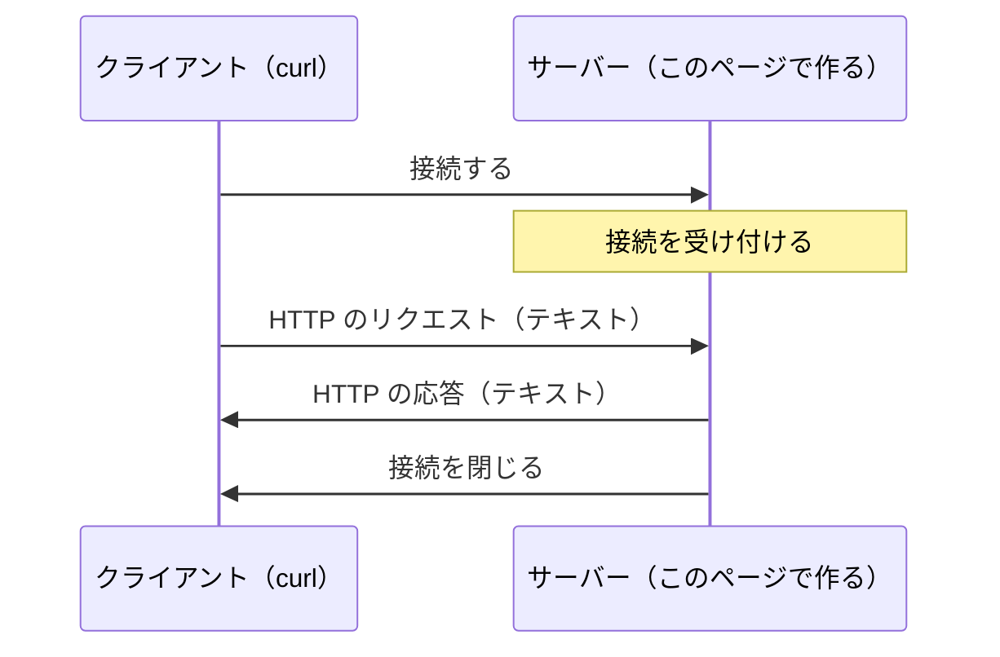
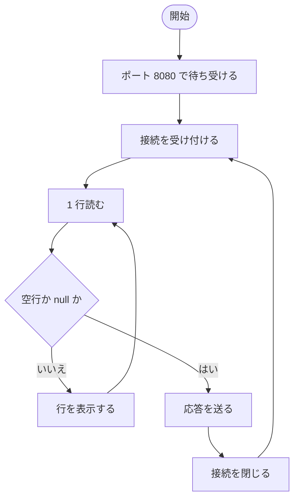

# TCP で受け取る

ブラウザで Web ページを開くとき、ブラウザとサーバーの間では何がやり取りされているのでしょうか。このページでは、**TCP** で接続を待ち受ける小さなサーバーを作り、届いたデータをそのまま画面に表示します。すると、Web の通信に使われる **HTTP** のリクエストが、決まった書式で書かれたただのテキストであることがわかります。

## 学習目標

このページを読み終えると、以下のことができるようになります。

- サーバーとクライアント、IP アドレスとポートの役割を説明できる
- `TcpListener` で接続を待ち受け、届いたデータを読める
- HTTP のリクエストと応答の書式を説明できる
- `Content-Length` に、文字数ではなくバイト数を書く理由を説明できる

## 前提知識

- [.NET SDK と dotnet CLI](/unity-csharp-learning/csharp/dotnet-sdk/) で、コンソールアプリを作って実行できること
- [async と await](/unity-csharp-learning/csharp/async-await/) を読んでいること
- [キャンセル](/unity-csharp-learning/csharp/task-cancellation/) を読んでいること（「7. 思いどおりに動かない接続に備える」で使います）
- [例外](/unity-csharp-learning/csharp/exceptions/) を読んでいること（同じく「7.」で使います）

---

## 1. サーバーとクライアント

通信では、2 つのプログラムが接続してデータをやり取りします。このとき、接続を待っている側を**サーバー**（server）、接続しに行く側を**クライアント**（client）と呼びます。ブラウザで Web ページを開くときは、ブラウザがクライアントで、Web ページを返すプログラムがサーバーです。

クライアントは、接続先を次の 2 つで指定します。

| 項目 | 説明 | 例 |
|---|---|---|
| **IP アドレス** | ネットワーク上のコンピューターを表す番号 | `127.0.0.1` |
| **ポート番号** | コンピューターの中で、どのプログラムにつなぐかを表す番号（0〜65535） | `8080` |

1 台のコンピューターでは、たくさんのプログラムが同時に通信しています。IP アドレスでコンピューターを決め、ポート番号でその中のプログラムを決めます。サーバーは、使うポート番号を先に決めて待ち受けます。

`127.0.0.1` は、**ループバックアドレス**と呼ばれる特別な IP アドレスで、「自分自身のコンピューター」を表します。`localhost` という名前も、同じく自分自身を表します。このシリーズでは、サーバーもクライアントも同じコンピューターで動かすので、接続先は `localhost` にします。

> 💡 **ポイント**: ループバックアドレスで待ち受けたサーバーには、同じコンピューターからしか接続できません。ほかのコンピューターからは見えないので、試しに作ったサーバーを安全に動かせます。

---

## 2. TCP の接続

**TCP**（Transmission Control Protocol）は、2 つのプログラムの間に接続を作り、データを送り合うための決まりです。TCP は、送ったデータが順番どおりに、欠けずに相手に届くことを保証します。途中でデータが失われたときは、TCP が自動で送り直します。

TCP で送れるのは、**バイト列**（`byte` の並び）です。TCP 自体は、そのバイト列が何を意味するかを気にしません。文字列や画像を送るには、送る側と受け取る側で「バイト列をどう読むか」を決めておく必要があります。**HTTP**（Hypertext Transfer Protocol）は、その決まりの 1 つです。HTTP では、リクエストと応答をテキストで書き、TCP の接続を使って送ります。



このページでは、この図のサーバー側を作ります。クライアントには、コマンドで HTTP のリクエストを送れる **curl** を使います。curl は Windows 10（バージョン 1803）以降に標準で入っています。

---

## 3. 接続を待ち受ける

作業用のフォルダーで、サーバー用のコンソールアプリを作ります。

```powershell
dotnet new console -n SampleServer
cd SampleServer
```

`Program.cs` を次のように書き換えます。

```csharp
using System.Net;
using System.Net.Sockets;

TcpListener listener = new TcpListener(IPAddress.Loopback, 8080);
listener.Start();
Console.WriteLine("ポート 8080 で待ち受けています");

using TcpClient client = await listener.AcceptTcpClientAsync();
Console.WriteLine($"--- 接続されました: {client.Client.RemoteEndPoint}");
```

**`TcpListener`** は、TCP の接続を待ち受けるクラスです。コンストラクターで、待ち受ける IP アドレスとポート番号を指定します。

**書式：[TcpListener コンストラクター](https://learn.microsoft.com/dotnet/api/system.net.sockets.tcplistener.-ctor)**
```csharp
public TcpListener(IPAddress localaddr, int port);
```

| パラメータ | 説明 |
|---|---|
| `localaddr` | 待ち受ける IP アドレス。[IPAddress.Loopback](https://learn.microsoft.com/dotnet/api/system.net.ipaddress.loopback) はループバックアドレス `127.0.0.1` を表す |
| `port` | 待ち受けるポート番号 |

**書式：[TcpListener.Start メソッド](https://learn.microsoft.com/dotnet/api/system.net.sockets.tcplistener.start)**
```csharp
public void Start();
```

`Start` を呼ぶと、待ち受けが始まります。この時点から、クライアントはこのポートに接続できるようになります。

**書式：[TcpListener.AcceptTcpClientAsync メソッド](https://learn.microsoft.com/dotnet/api/system.net.sockets.tcplistener.accepttcpclientasync)**
```csharp
public Task<TcpClient> AcceptTcpClientAsync();
```

`AcceptTcpClientAsync` は、クライアントが接続してくるまで待ち、接続を表す **`TcpClient`** を返します。接続が来るまで、`await` の先には進みません。`TcpClient` は、使い終わったら `Dispose` して接続を閉じる必要があるので、`using` で宣言します。

`client.Client.RemoteEndPoint` は、接続してきた相手の IP アドレスとポート番号です。

サーバーを起動します。

```powershell
dotnet run
```

```
ポート 8080 で待ち受けています
```

サーバーは、接続が来るまでここで止まっています。別のターミナルを開き、curl で接続します。PowerShell では、`curl` ではなく `curl.exe` と入力します（理由は「[よくあるミス](#よくあるミス)」で説明します）。

```powershell
curl.exe http://localhost:8080/
```

サーバー側に、次のように表示されます。実行結果の例です。ポート番号（`:` の後ろの数字）は、実行するたびに変わります。

```
ポート 8080 で待ち受けています
--- 接続されました: 127.0.0.1:51824
```

接続した直後に、プログラムの終わりまで進みます。`using` で宣言した `client` が `Dispose` されて接続が閉じ、サーバーは終了します。curl 側には、接続が切られたというエラーが表示されます。

```
curl: (56) Recv failure: Connection was reset
```

curl が送ったデータを、サーバーは読まないまま接続を閉じました。受け取ったデータを読まずに接続を閉じると、TCP は接続を強制的に切ったこと（**リセット**）を相手に知らせます。

`127.0.0.1:51824` の `51824` は、クライアント側のポート番号です。クライアントのポート番号は、接続するたびに OS が空いている番号を自動で割り当てます。

---

## 4. リクエストを読む

接続しただけでは、何が送られてきたのかわかりません。届いたデータを読んで表示します。`Program.cs` を次のように書き換えます。

```csharp
using System.Net;
using System.Net.Sockets;
using System.Text;

TcpListener listener = new TcpListener(IPAddress.Loopback, 8080);
listener.Start();
Console.WriteLine("ポート 8080 で待ち受けています");

using TcpClient client = await listener.AcceptTcpClientAsync();
Console.WriteLine($"--- 接続されました: {client.Client.RemoteEndPoint}");

NetworkStream stream = client.GetStream();
StreamReader reader = new StreamReader(stream, Encoding.UTF8);
while (true)
{
    string? line = await reader.ReadLineAsync();
    if (string.IsNullOrEmpty(line))
    {
        break;
    }
    Console.WriteLine(line);
}
```

**書式：[TcpClient.GetStream メソッド](https://learn.microsoft.com/dotnet/api/system.net.sockets.tcpclient.getstream)**
```csharp
public NetworkStream GetStream();
```

`GetStream` は、接続でデータを読み書きするための **`NetworkStream`** を返します。`NetworkStream` から読むと相手が送ったバイト列を受け取れ、`NetworkStream` に書くと相手にバイト列を送れます。

`NetworkStream` から読めるのはバイト列なので、そのままでは文字列として扱えません。**`StreamReader`** は、バイト列を文字列に変換しながら読むクラスです。コンストラクターの 2 つ目の引数で、バイト列を文字に変換する規則（**文字エンコーディング**）を指定します。ここでは、Web で広く使われている **UTF-8** を指定しています。

**書式：[StreamReader.ReadLineAsync メソッド](https://learn.microsoft.com/dotnet/api/system.io.streamreader.readlineasync)**
```csharp
public override Task<string?> ReadLineAsync();
```

`ReadLineAsync` は、1 行を読んで、改行を取り除いた文字列を返します。1 行分のデータがまだ届いていなければ、届くまで待ちます。戻り値は次のようになります。

| 戻り値 | 意味 |
|---|---|
| 文字列 | 読んだ 1 行 |
| `""`（空文字列） | 何も書かれていない行（空行） |
| `null` | 相手が接続を閉じたので、これ以上読むものがない |

`string.IsNullOrEmpty` で、空行と `null` のどちらでもループを抜けます。空行で抜ける理由は、次で説明します。

サーバーを起動し直して、別のターミナルからもう一度 curl で接続します。

```powershell
curl.exe http://localhost:8080/
```

サーバー側に、次のように表示されます。実行結果の例です。ポート番号と、`User-Agent` の curl のバージョンは環境によって変わります。

```
ポート 8080 で待ち受けています
--- 接続されました: 127.0.0.1:51824
GET / HTTP/1.1
Host: localhost:8080
User-Agent: curl/8.6.0
Accept: */*
```

これが、curl が送った **HTTP のリクエスト**です。読めるテキストで書かれていることがわかります。今度はデータを読んでから接続を閉じたので、curl 側には、応答がないまま接続が閉じられたというエラーが表示されます。

```
curl: (52) Empty reply from server
```

### リクエストの書式

HTTP のリクエストは、次の 3 つの部分でできています。

| 部分 | 内容 | この例では |
|---|---|---|
| **リクエスト行** | 1 行目。メソッド、パス、HTTP のバージョンを空白で区切って並べる | `GET / HTTP/1.1` |
| **ヘッダー** | 2 行目から。`名前: 値` の形で、リクエストの付加情報を 1 行に 1 つずつ書く | `Host: localhost:8080` など |
| **空行** | ヘッダーの終わりを表す | （何も書かれていない行） |

リクエスト行の意味は次のとおりです。

| 要素 | 意味 |
|---|---|
| `GET` | **メソッド**。何をしてほしいか。`GET` は「データを取得したい」 |
| `/` | **パス**。何に対してか。URL の `http://localhost:8080` より後ろの部分 |
| `HTTP/1.1` | 使っている HTTP のバージョン |

ヘッダーの `Host` は接続先の名前とポート番号、`User-Agent` はクライアントのプログラムの名前、`Accept` は受け取れるデータの種類（`*/*` は何でもよい）です。

TCP で届くのはバイト列の流れなので、どこまでがヘッダーなのかは、データの中に書いて知らせる必要があります。HTTP では、それが空行です。このサーバーが空行でループを抜けるのは、そこでリクエストのヘッダーが終わるからです。

> 💡 **ポイント**: HTTP の改行は、`\r\n`（CR と LF の 2 文字）と決められています。`ReadLineAsync` は `\r\n` を 1 つの改行として扱い、取り除いた文字列を返します。

---

## 5. 応答を返す

リクエストを読んだら、**HTTP の応答**を返します。`Program.cs` の最後に、次のコードを追加します。

```csharp
string body = "こんにちは、TCP サーバーです";
byte[] bodyBytes = Encoding.UTF8.GetBytes(body);
string header =
    "HTTP/1.1 200 OK\r\n" +
    "Content-Type: text/plain; charset=utf-8\r\n" +
    $"Content-Length: {bodyBytes.Length}\r\n" +
    "Connection: close\r\n" +
    "\r\n";
await stream.WriteAsync(Encoding.ASCII.GetBytes(header));
await stream.WriteAsync(bodyBytes);
Console.WriteLine("--- 応答を返しました");
```

### 応答の書式

HTTP の応答は、リクエストとよく似た書式で、次の 4 つの部分でできています。

| 部分 | 内容 | この例では |
|---|---|---|
| **ステータス行** | 1 行目。HTTP のバージョン、**ステータスコード**、その説明 | `HTTP/1.1 200 OK` |
| **ヘッダー** | 応答の付加情報 | `Content-Type` など |
| **空行** | ヘッダーの終わりを表す | `\r\n` だけの行 |
| **本文** | 返すデータそのもの | `こんにちは、TCP サーバーです` |

ステータスコードは、リクエストがどうなったかを表す 3 桁の数字です。`200` は「成功した」ことを表します。ヘッダーの意味は次のとおりです。

| ヘッダー | 意味 |
|---|---|
| `Content-Type` | 本文のデータの種類。`text/plain; charset=utf-8` は「UTF-8 で書かれたテキスト」 |
| `Content-Length` | 本文の長さ（**バイト数**） |
| `Connection: close` | 応答を送ったら、この接続を閉じる |

### 文字列をバイト列にして送る

`NetworkStream` に書き込めるのはバイト列なので、文字列をバイト列に変換してから送ります。

**書式：[Encoding.GetBytes メソッド](https://learn.microsoft.com/dotnet/api/system.text.encoding.getbytes)**
```csharp
public virtual byte[] GetBytes(string s);
```

`Encoding.UTF8.GetBytes` は、文字列を UTF-8 のバイト列に変換します。ヘッダーは英数字と記号で書く決まりなので、`Encoding.ASCII` で変換しています。

**書式：[Stream.WriteAsync メソッド](https://learn.microsoft.com/dotnet/api/system.io.stream.writeasync)**
```csharp
public virtual ValueTask WriteAsync(ReadOnlyMemory<byte> buffer, CancellationToken cancellationToken = default);
```

`WriteAsync` は、バイト列を相手に送ります。`byte[]` は `ReadOnlyMemory<byte>` に自動で変換されるので、そのまま渡せます。

`Content-Length` には、本文の文字数（`body.Length`）ではなく、バイト列の長さ（`bodyBytes.Length`）を書いています。UTF-8 では、英数字は 1 文字 1 バイトですが、日本語の文字は 1 文字 3 バイトになるからです。`こんにちは、TCP サーバーです` は 16 文字ですが、UTF-8 では 40 バイトになります。

サーバーを起動し直して、curl で接続します。curl に `-i` を付けると、本文だけでなく、ステータス行とヘッダーも表示されます。

```powershell
curl.exe -i http://localhost:8080/
```

curl 側に、サーバーが送った応答が表示されます。

```
HTTP/1.1 200 OK
Content-Type: text/plain; charset=utf-8
Content-Length: 40
Connection: close

こんにちは、TCP サーバーです
```

サーバー側には、リクエストの後ろに `--- 応答を返しました` と表示されます。

---

## 6. 繰り返し受け付ける

今のサーバーは、1 回応答すると終了してしまいます。接続を受け付けてから応答を返すまでを `while` ループで囲み、何度でも受け付けるようにします。ここまでのコードをまとめると、次のようになります。

```csharp
using System.Net;
using System.Net.Sockets;
using System.Text;

TcpListener listener = new TcpListener(IPAddress.Loopback, 8080);
listener.Start();
Console.WriteLine("ポート 8080 で待ち受けています");

while (true)
{
    using TcpClient client = await listener.AcceptTcpClientAsync();
    Console.WriteLine($"--- 接続されました: {client.Client.RemoteEndPoint}");

    NetworkStream stream = client.GetStream();
    StreamReader reader = new StreamReader(stream, Encoding.UTF8);
    while (true)
    {
        string? line = await reader.ReadLineAsync();
        if (string.IsNullOrEmpty(line))
        {
            break;
        }
        Console.WriteLine(line);
    }

    string body = "こんにちは、TCP サーバーです";
    byte[] bodyBytes = Encoding.UTF8.GetBytes(body);
    string header =
        "HTTP/1.1 200 OK\r\n" +
        "Content-Type: text/plain; charset=utf-8\r\n" +
        $"Content-Length: {bodyBytes.Length}\r\n" +
        "Connection: close\r\n" +
        "\r\n";
    await stream.WriteAsync(Encoding.ASCII.GetBytes(header));
    await stream.WriteAsync(bodyBytes);
    Console.WriteLine("--- 応答を返しました");
}
```

`client` は `using` で宣言しているので、ループの 1 回分が終わるたびに `Dispose` され、接続が閉じます。応答の `Connection: close` は、この動作をクライアントに伝えています。サーバーを止めるときは、サーバーのターミナルで **Ctrl+C** を押します。



### ブラウザで開く

サーバーを起動して、ブラウザで `http://localhost:8080/` を開きます。ブラウザに `こんにちは、TCP サーバーです` と表示されます。

サーバー側のログを見ると、1 回開いただけなのに、リクエストが 2 つ届いています。実行結果の例です。ヘッダーの内容はブラウザによって変わるので、ここでは一部だけを示しています。

```
--- 接続されました: 127.0.0.1:60998
GET / HTTP/1.1
Host: localhost:8080
Connection: keep-alive
User-Agent: Mozilla/5.0 (Windows NT 10.0; Win64; x64) ...
Accept: text/html,application/xhtml+xml,...
（中略）
--- 応答を返しました
--- 接続されました: 127.0.0.1:61009
GET /favicon.ico HTTP/1.1
Host: localhost:8080
（中略）
--- 応答を返しました
```

2 つ目は `/favicon.ico` へのリクエストです。ブラウザは、タブに表示する小さなアイコン（favicon）を取得するために、自動でこのリクエストを送ります。このサーバーはパスを見ていないので、どちらのリクエストにも同じ応答を返しています。パスによって応答を変えるのは、HTTP サーバーの大事な仕事の 1 つです。

curl のリクエストと比べると、ブラウザはたくさんのヘッダーを送っていることもわかります。

---

## 7. 思いどおりに動かない接続に備える

ここまでのサーバーは、クライアントが正しいリクエストを最後まで送ってくることを前提にしています。しかし、実際の接続はいつもそうとは限りません。ここでは、2 つの場合に備えます。

### 何も送ってこない接続

ブラウザで開いた後、サーバーのログに、リクエストが続かない接続が表示されることがあります。

```
--- 接続されました: 127.0.0.1:59144
```

ブラウザは、次のリクエストにすぐ使えるように、リクエストを送る前に接続だけを作っておくことがあります。このサーバーは、この接続の `ReadLineAsync` でリクエストを待ち続けるので、ほかの接続を受け付けられなくなります。この状態で curl を実行すると、応答が返ってきません。

そこで、一定の時間待ってもリクエストが届かなければ、その接続をあきらめるようにします。`ReadLineAsync` には、`CancellationToken` を受け取るオーバーロードがあります。

**書式：[StreamReader.ReadLineAsync メソッド](https://learn.microsoft.com/dotnet/api/system.io.streamreader.readlineasync)**（CancellationToken）
```csharp
public override ValueTask<string?> ReadLineAsync(CancellationToken cancellationToken);
```

[キャンセル](/unity-csharp-learning/csharp/task-cancellation/) で学んだように、`CancellationTokenSource` のコンストラクターに時間を渡すと、その時間が経ったときにキャンセルされます。キャンセルされると、`ReadLineAsync` は `OperationCanceledException` をスローします。

### 途中で閉じられる接続

クライアントが、リクエストを最後まで送らずに接続を閉じることもあります。このとき `ReadLineAsync` は `null` を返します。今のサーバーは、`null` を空行と同じように扱って応答を送ろうとしますが、相手はもう接続を閉じています。閉じられた接続に書き込むと、`WriteAsync` は `IOException` をスローします。例外をキャッチしていないので、サーバーは止まってしまいます。

そこで、`null` と空行を分けて扱います。`null` のときは、リクエストが途中で終わったことを表す `EndOfStreamException` をスローします。`EndOfStreamException` は `IOException` を継承したクラスなので、`WriteAsync` がスローする `IOException` と一緒にキャッチできます。

### 完成したサーバー

2 つの備えを加えた、完成したサーバーのコードは次のとおりです。

```csharp
using System.Net;
using System.Net.Sockets;
using System.Text;

TcpListener listener = new TcpListener(IPAddress.Loopback, 8080);
listener.Start();
Console.WriteLine("ポート 8080 で待ち受けています");

while (true)
{
    using TcpClient client = await listener.AcceptTcpClientAsync();
    Console.WriteLine($"--- 接続されました: {client.Client.RemoteEndPoint}");

    NetworkStream stream = client.GetStream();
    StreamReader reader = new StreamReader(stream, Encoding.UTF8);

    // 3 秒たってもリクエストを読み終わらなければ、あきらめる
    using CancellationTokenSource cts = new CancellationTokenSource(TimeSpan.FromSeconds(3));
    try
    {
        while (true)
        {
            string? line = await reader.ReadLineAsync(cts.Token);
            if (line == null)
            {
                throw new EndOfStreamException("リクエストの途中で接続が閉じられました");
            }
            if (line == "")
            {
                break;
            }
            Console.WriteLine(line);
        }

        string body = "こんにちは、TCP サーバーです";
        byte[] bodyBytes = Encoding.UTF8.GetBytes(body);
        string header =
            "HTTP/1.1 200 OK\r\n" +
            "Content-Type: text/plain; charset=utf-8\r\n" +
            $"Content-Length: {bodyBytes.Length}\r\n" +
            "Connection: close\r\n" +
            "\r\n";
        await stream.WriteAsync(Encoding.ASCII.GetBytes(header));
        await stream.WriteAsync(bodyBytes);
        Console.WriteLine("--- 応答を返しました");
    }
    catch (OperationCanceledException)
    {
        Console.WriteLine("--- 3 秒待ってもリクエストが届かないので切断します");
    }
    catch (IOException e)
    {
        Console.WriteLine($"--- 通信できなくなりました: {e.Message}");
    }
}
```

どちらの例外をキャッチした後も、ループの 1 回分が終わるので、`using` で宣言した `client` は `Dispose` されて接続が閉じます。1 つの接続で問題が起きても、サーバーは止まらずに次の接続を受け付けます。

ブラウザで開いてから curl を実行すると、次のように、何も送ってこない接続を 3 秒で切り上げてから、curl のリクエストに応答します。実行結果の例です。

```
--- 接続されました: 127.0.0.1:54440
--- 3 秒待ってもリクエストが届かないので切断します
--- 接続されました: 127.0.0.1:54442
GET / HTTP/1.1
Host: localhost:8080
User-Agent: curl/8.6.0
Accept: */*
--- 応答を返しました
```

このサーバーは、1 つの接続を処理し終わるまで次の接続を受け付けないので、ほかの接続は最大で 3 秒待たされます。複数の接続を同時に処理するのは、次の回以降で使う HTTP サーバーの仕組みに任せます。

---

## よくあるミス

### PowerShell で `curl` と入力すると、別のコマンドが動く

Windows PowerShell（バージョン 5.1）では、`curl` は `Invoke-WebRequest` という別のコマンドの別名になっています。オプションの書き方も表示の形式も curl とは違うので、このページの手順どおりに動きません。PowerShell では、`curl.exe` と拡張子まで入力してください。

### サーバーを 2 つ起動してしまう

サーバーが動いたままのターミナルがあるのに、別のターミナルでもう一度 `dotnet run` すると、`Start` で例外がスローされます。

```
Unhandled exception. System.Net.Sockets.SocketException (10048): 通常、各ソケット アドレスに対してプロトコル、ネットワーク アドレス、またはポートのどれか 1 つのみを使用できます。
```

1 つのポートで待ち受けられるのは、1 つのプログラムだけです。動いているサーバーを Ctrl+C で止めてから起動し直してください。ほかのアプリがポート 8080 を使っている場合も同じ例外になるので、そのときはポート番号を変えます。

### `Content-Length` に文字数を書く

`Content-Length` に `bodyBytes.Length` ではなく `body.Length` を書くと、次のような応答になります。

```powershell
curl.exe -i http://localhost:8080/
```

```
HTTP/1.1 200 OK
Content-Type: text/plain; charset=utf-8
Content-Length: 16
Connection: close

こんにちは�
```

`Content-Length: 16` を受け取った curl は、本文を 16 バイトだけ読んで、残りを捨てます。`こんにちは` の 15 バイトと、`、` の 3 バイトのうち 1 バイト目までしか読まないので、最後の文字が壊れて表示されます。`Content-Length` には、必ずバイト列の長さを書きます。

---

## まとめ

- 接続を待つ側がサーバー、接続しに行く側がクライアント。接続先は IP アドレスとポート番号で指定する
- TCP は、2 つのプログラムの間でバイト列を順番どおり、欠けずに届ける
- `TcpListener` で待ち受け、`AcceptTcpClientAsync` で接続を受け付け、`GetStream` で得た `NetworkStream` で読み書きする
- HTTP のリクエストは「リクエスト行、ヘッダー、空行」、応答は「ステータス行、ヘッダー、空行、本文」でできたテキスト
- ヘッダーの終わりは空行で、本文の長さは `Content-Length` のバイト数で相手に伝える
- 何も送ってこない接続には読み取りの時間制限で、途中で閉じられる接続には `IOException` のキャッチで備える

---

## 理解度チェック

1. サーバーとクライアントの違いは何ですか？
2. `ReadLineAsync` が空文字列を返したときと、`null` を返したときは、それぞれ何を意味しますか？
3. 本文が `OK です` のとき、`Content-Length` に書く値はいくつですか？ 本文は UTF-8 で送ります。
4. ブラウザでサーバーを 1 回開いただけなのに、ログにリクエストが 2 つ表示されました。2 つ目は何のリクエストですか？

<details markdown="1">
<summary>解答を見る</summary>

1. 接続を待っている側がサーバー、接続しに行く側がクライアントです。
2. 空文字列は、何も書かれていない行（空行）を読んだことを意味します。HTTP のリクエストでは、ヘッダーの終わりです。`null` は、相手が接続を閉じて、これ以上読むものがないことを意味します。
3. `9` です。`O`、`K`、空白は 1 バイトずつで 3 バイト、`で` と `す` は 3 バイトずつで 6 バイト、合わせて 9 バイトです。
4. `/favicon.ico` へのリクエストです。ブラウザは、タブに表示するアイコンを取得するために、自動でこのリクエストを送ります。

</details>

---

## 次のステップ

[TCP で送る](/unity-csharp-learning/networking/tcp-send/) では、このページで作ったサーバーに、curl の代わりに自分で作ったクライアントからリクエストを送ります。
