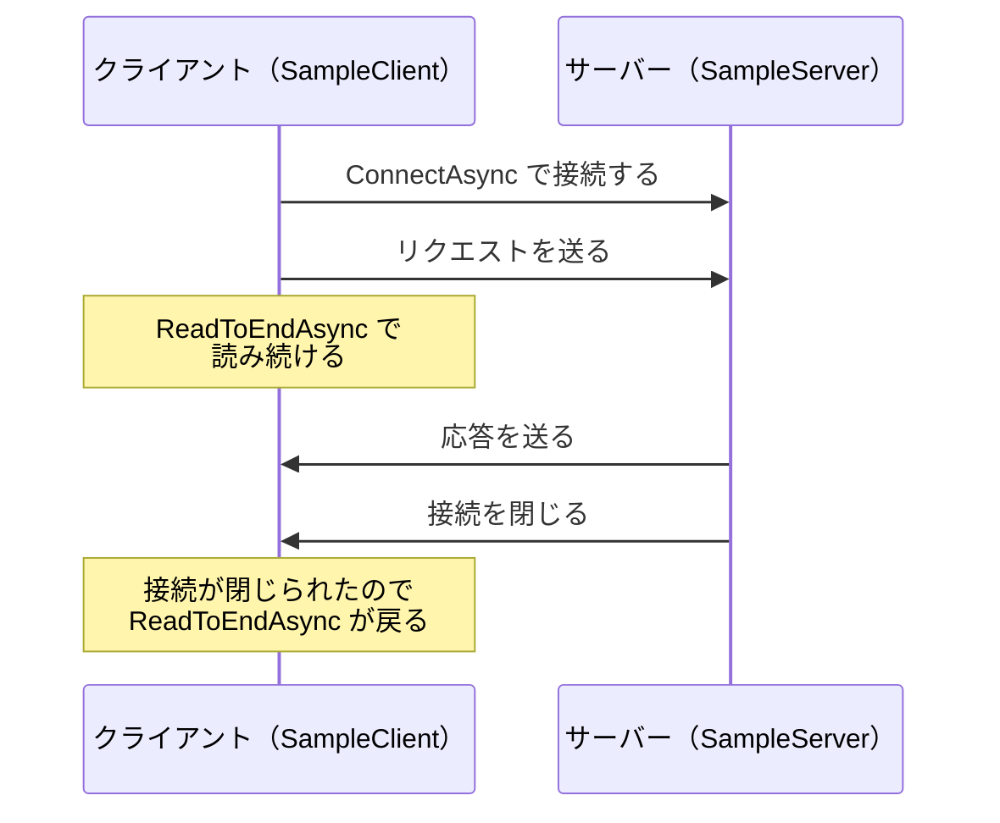

# TCP で送る

[TCP で受け取る](/unity-csharp-learning/networking/tcp-receive/) では、サーバーを作り、curl から送ったリクエストを受け取りました。このページでは、curl の代わりに、クライアントも自分で作ります。HTTP のリクエストを文字列で組み立てて送り、サーバーの応答を受け取ります。応答がどこで終わるのかをクライアントがどうやって知るのかも、確かめます。

## 学習目標

このページを読み終えると、以下のことができるようになります。

- 通信する 2 つのプログラムを、片方ずつ確かめながら作る理由を説明できる
- `TcpClient` でサーバーに接続し、HTTP のリクエストを送れる
- 応答の終わりを、接続が閉じられたことで知る方法と、`Content-Length` で知る方法を説明できる
- サーバーは、リクエストに書かれたこと以外にクライアントを知る手段がないことを説明できる

## 前提知識

- [TCP で受け取る](/unity-csharp-learning/networking/tcp-receive/) を読んでいること。このページでは、そのページの最後に完成したサーバーを使います

---

## 1. 片方ずつ確かめる

前のページでは、サーバーを作るときに、クライアントとして curl を使いました。curl は多くの人に使われていて、正しい HTTP のリクエストを送ることがわかっています。そのため、うまく動かないときは、サーバーの側に原因があると考えられました。

もし、作ったばかりのサーバーに、作ったばかりのクライアントからつないでいたら、うまく動かないときに、どちらに原因があるのかわかりません。通信する 2 つのプログラムを作るときは、動作が確かな相手を使って片方ずつ確かめます。

このページでは、curl で確かめ済みのサーバーを相手にして、クライアントを作ります。この手順は、後の回で Unity からサーバーに接続するときにも使います。

---

## 2. サーバーに接続する

前のページで完成したサーバー（`SampleServer`）を起動しておきます。

```powershell
dotnet run
```

```
ポート 8080 で待ち受けています
```

別のターミナルを開き、`SampleServer` とは別の作業フォルダーで、クライアント用のコンソールアプリを作ります。

```powershell
dotnet new console -n SampleClient
cd SampleClient
```

`Program.cs` を次のように書き換えます。

```csharp
using System.Net.Sockets;

using TcpClient client = new TcpClient();
await client.ConnectAsync("localhost", 8080);
Console.WriteLine("--- 接続しました");
```

前のページでは、サーバーの `AcceptTcpClientAsync` が `TcpClient` を返しました。クライアントの側では、`TcpClient` を自分で作り、`ConnectAsync` でサーバーに接続します。

**書式：[TcpClient.ConnectAsync メソッド](https://learn.microsoft.com/dotnet/api/system.net.sockets.tcpclient.connectasync)**
```csharp
public Task ConnectAsync(string host, int port);
```

| パラメータ | 説明 |
|---|---|
| `host` | 接続先のコンピューターの名前か IP アドレス |
| `port` | 接続先のポート番号 |

`ConnectAsync` は、接続が確立するまで待ちます。

クライアントを実行します。

```powershell
dotnet run
```

```
--- 接続しました
```

サーバー側には、次のように表示されます。実行結果の例です。ポート番号は実行するたびに変わります。

```
--- 接続されました: 127.0.0.1:54224
--- 通信できなくなりました: リクエストの途中で接続が閉じられました
```

クライアントは、接続した直後にプログラムの終わりまで進み、`client` が `Dispose` されて接続が閉じました。サーバーはリクエストを待っていましたが、`ReadLineAsync` が `null` を返したので、前のページで備えたとおり、この接続をあきらめて次の接続を待ちます。

---

## 3. リクエストを送る

接続できたので、リクエストを送ります。前のページで curl が送ったリクエストを参考に、同じ書式の文字列を組み立てます。`Program.cs` を次のように書き換えます。

```csharp
using System.Net.Sockets;
using System.Text;

using TcpClient client = new TcpClient();
await client.ConnectAsync("localhost", 8080);
Console.WriteLine("--- 接続しました");

NetworkStream stream = client.GetStream();
string request =
    "GET /hello HTTP/1.1\r\n" +
    "Host: localhost:8080\r\n" +
    "Connection: close\r\n" +
    "\r\n";
await stream.WriteAsync(Encoding.ASCII.GetBytes(request));
Console.WriteLine("--- リクエストを送りました");

StreamReader reader = new StreamReader(stream, Encoding.UTF8);
string response = await reader.ReadToEndAsync();
Console.WriteLine(response);
```

リクエストは、リクエスト行、ヘッダー、空行を `\r\n` で区切って並べた文字列です。サーバーの応答と同じように、`Encoding.ASCII.GetBytes` でバイト列にしてから `WriteAsync` で送ります。

| 行 | 意味 |
|---|---|
| `GET /hello HTTP/1.1` | `/hello` というパスのデータを取得したい |
| `Host: localhost:8080` | 接続先の名前とポート番号。HTTP/1.1 では、必ず送る決まりになっている |
| `Connection: close` | 応答を送ったら、接続を閉じてほしい |
| （空行） | ヘッダーの終わり |

**書式：[StreamReader.ReadToEndAsync メソッド](https://learn.microsoft.com/dotnet/api/system.io.streamreader.readtoendasync)**
```csharp
public override Task<string> ReadToEndAsync();
```

`ReadToEndAsync` は、読めるものがなくなるまで読み続け、読んだものすべてを 1 つの文字列にして返します。`NetworkStream` では、「読めるものがなくなる」のは、相手が接続を閉じたときです。

クライアントを実行します。

```powershell
dotnet run
```

```
--- 接続しました
--- リクエストを送りました
HTTP/1.1 200 OK
Content-Type: text/plain; charset=utf-8
Content-Length: 40
Connection: close

こんにちは、TCP サーバーです
```

サーバー側には、自分で組み立てたリクエストがそのまま表示されます。実行結果の例です。ポート番号は実行するたびに変わります。

```
--- 接続されました: 127.0.0.1:54232
GET /hello HTTP/1.1
Host: localhost:8080
Connection: close
--- 応答を返しました
```

---

## 4. 応答の終わりを知る

TCP で届くのはバイト列の流れなので、クライアントは、どこで応答が終わったのかを何らかの方法で知る必要があります。このクライアントは、サーバーが接続を閉じたことで、応答の終わりを知っています。



リクエストに `Connection: close` を書いているのは、このためです。HTTP/1.1 では、1 つの接続で複数のリクエストを送れるように、応答を送った後も接続を開いたままにしておくのが標準の動作です。`Connection: close` を送らないと、一般的なサーバーは次のリクエストを待って接続を閉じないので、`ReadToEndAsync` は戻りません。サーバーは、しばらく何も届かない接続をいずれ閉じますが、それまでクライアントは待たされます。前のページのサーバーは、リクエストに関係なく必ず接続を閉じるので、このクライアントでは問題が起きませんが、`Connection: close` を送っておくのが正しい書き方です。

接続を開いたまま応答の終わりを知るには、`Content-Length` を使います。ヘッダーの後ろから `Content-Length` に書かれたバイト数だけ読めば、そこが応答の終わりです。

| 方法 | 応答の終わり | 接続 |
|---|---|---|
| 接続が閉じられるまで読む | サーバーが接続を閉じたところ | 1 回ごとに閉じる |
| `Content-Length` のバイト数だけ読む | ヘッダーの後ろから、指定されたバイト数を読んだところ | 開いたまま、次のリクエストに使える |

このほかに、本文をいくつかに分け、それぞれの長さを前に付けて送る `Transfer-Encoding: chunked` という方法もあります。本文を作りながら送るときなど、送り始める時点で全体の長さがわからない場合に使われます。

### 試してみよう：Content-Length をまちがえたサーバー

前のページの「よくあるミス」では、サーバーが `Content-Length` に文字数（16）を書くと、curl の表示で本文の最後の文字が壊れることを確かめました。curl は、`Content-Length` を見て、本文を 16 バイトだけ読んだからです。

同じサーバーに、このページのクライアントから接続すると、次のようになります。

```
--- 接続しました
--- リクエストを送りました
HTTP/1.1 200 OK
Content-Type: text/plain; charset=utf-8
Content-Length: 16
Connection: close

こんにちは、TCP サーバーです
```

`Content-Length: 16` と書かれているのに、本文はすべて表示されています。このクライアントは `Content-Length` を見ずに、接続が閉じられるまで読んでいるからです。同じ応答でも、クライアントが終わりをどう判断するかで、受け取る結果が変わります。応答の書き方とその読み方を、送る側と受け取る側で同じ決まりに合わせることが、通信の基本です。

---

## 5. サーバーからクライアントは見えない

curl から送ったときと、このページのクライアントから送ったときの、サーバーのログを比べます。

```
GET / HTTP/1.1
Host: localhost:8080
User-Agent: curl/8.6.0
Accept: */*
```

```
GET /hello HTTP/1.1
Host: localhost:8080
Connection: close
```

サーバーが受け取るのは、クライアントが送ったテキストだけです。サーバーは、ヘッダーに書かれていること以外に、相手がどんなプログラムなのかを知る手段がありません。前のページでは `User-Agent` を「クライアントのプログラムの名前」と説明しましたが、これもクライアントが自分で書いた文字列にすぎません。

このページのクライアントのリクエストに、curl と同じヘッダーを書き足してみます。

```csharp
string request =
    "GET / HTTP/1.1\r\n" +
    "Host: localhost:8080\r\n" +
    "User-Agent: curl/8.6.0\r\n" +
    "Accept: */*\r\n" +
    "\r\n";
```

サーバーのログには、curl から送ったときと同じ 4 行が表示されます。サーバーからは、curl から届いたリクエストと区別できません。

このため、サーバーはリクエストに書かれた内容をそのまま信用してはいけません。たとえば、ゲームのクライアントが「自分はプレイヤー A だ」と書いて送ってきても、本当にそうなのかはサーバーにはわかりません。本人であることを確かめる方法は、後の回で扱います。

> 💡 **ポイント**: このリクエストには `Connection: close` を書いていませんが、前のページのサーバーは必ず接続を閉じるので、`ReadToEndAsync` は戻ります。ほかのサーバーに送るときは、`Connection: close` を忘れないようにします。

---

## よくあるミス

### サーバーを起動していない

サーバーが動いていないときにクライアントを実行すると、`ConnectAsync` で例外がスローされます。

```
Unhandled exception. System.Net.Sockets.SocketException (10061): 対象のコンピューターによって拒否されたため、接続できませんでした。
```

ポート 8080 で待ち受けているプログラムがないので、接続が拒否されました。サーバーを起動してから、クライアントを実行します。

### 最後の空行を送り忘れる

リクエストの最後の `"\r\n"` を書き忘れると、ヘッダーの終わりがサーバーに伝わりません。

```csharp
// ❌ NG: 最後の空行がない
string request =
    "GET /hello HTTP/1.1\r\n" +
    "Host: localhost:8080\r\n" +
    "Connection: close\r\n";
```

サーバーは、ヘッダーの続きが届くのを待ち続けます。クライアントも、サーバーの応答を `ReadToEndAsync` で待ち続けるので、お互いに相手を待ったまま、どちらも先に進めません。前のページのサーバーには 3 秒の時間制限があるので、3 秒後にサーバーが接続を閉じ、次のように表示されます。

```
--- 接続されました: 127.0.0.1:61287
GET /hello HTTP/1.1
Host: localhost:8080
Connection: close
--- 3 秒待ってもリクエストが届かないので切断します
```

クライアントは、何も受け取らないまま接続を閉じられたので、`ReadToEndAsync` は空文字列を返します。クライアントの表示は、`--- リクエストを送りました` の後に空の行が出るだけになります。

---

## まとめ

- 通信する 2 つのプログラムは、動作が確かな相手を使って片方ずつ確かめる
- クライアントは `TcpClient` を作り、`ConnectAsync` でサーバーに接続する
- HTTP のリクエストは、リクエスト行、ヘッダー、空行を `\r\n` で区切った文字列にして送る
- 応答の終わりは、接続が閉じられたことか、`Content-Length` のバイト数で知る。HTTP/1.1 では接続を開いたままにするのが標準なので、閉じてほしいときは `Connection: close` を送る
- サーバーは、リクエストに書かれたテキスト以外にクライアントを知る手段がない。書かれた内容をそのまま信用しない

---

## 理解度チェック

1. 作ったばかりのサーバーを確かめるとき、作ったばかりのクライアントではなく curl を使うのはなぜですか？
2. このページのクライアントは、応答の終わりをどうやって知っていますか？
3. リクエストから `Connection: close` の行を消して、一般的な HTTP サーバーに送ると、このページのクライアントはどうなりますか？
4. リクエストの `User-Agent` を見れば、サーバーは相手のプログラムを確実に知ることができますか？

<details markdown="1">
<summary>解答を見る</summary>

1. うまく動かないときに、原因がどちらにあるのかわかるようにするためです。curl は正しいリクエストを送ることがわかっているので、問題があればサーバーの側にあると判断できます。
2. サーバーが接続を閉じたことで知っています。`ReadToEndAsync` は、接続が閉じられるまで読み続けてから戻ります。
3. サーバーが接続を閉じるまで、`ReadToEndAsync` が戻らなくなります。HTTP/1.1 では、サーバーは応答を送った後も次のリクエストを待って接続を開いたままにするので、クライアントは読み続けます。
4. できません。`User-Agent` はクライアントが自分で書く文字列なので、どんな値でも送れます。

</details>

---

## 次のステップ

次の回では、ASP.NET Core を使って HTTP サーバーを作ります。このページまでで手作業で行っていた、リクエストの読み取りや応答の組み立てを、ASP.NET Core がどのように引き受けてくれるのかを見ていきます。
