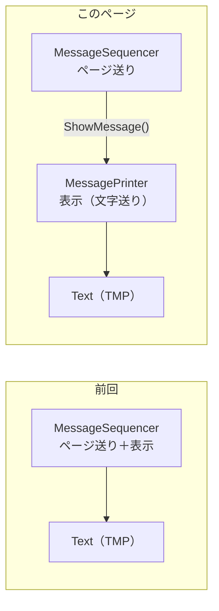
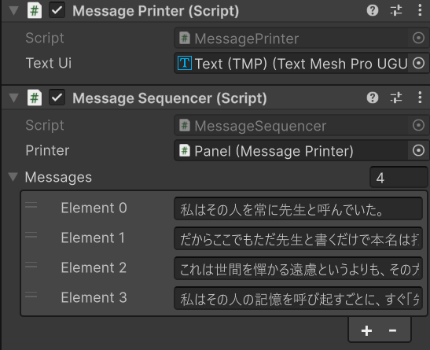
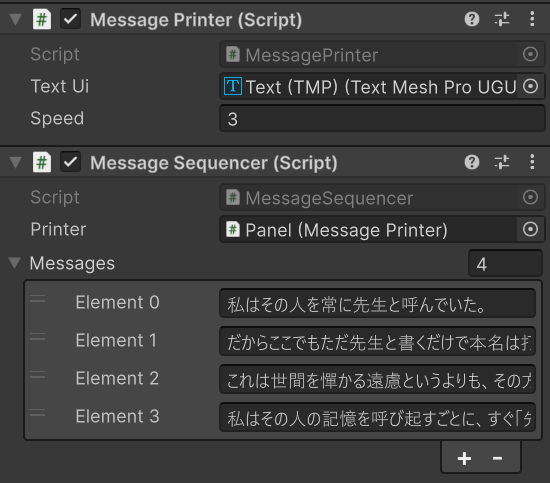

# メッセージウィンドウ — 文字送り

[メッセージウィンドウ — ページ送り](/unity-csharp-learning/tutorials/conversation-scenes/message-window-pagination/) の続きです。テキストが 1 文字ずつ流れるように表示される**文字送りアニメーション**を実装します。先に、単一責任の原則に基づいてテキストを表示する役割を別のコンポーネントに分離し、そのコンポーネントの中に文字送りを実装します。

## 学習目標

このページを読み終えると、以下のことができるようになります。

- 単一責任の原則に基づいて、既存のコンポーネントから役割を分離できる
- 時間経過を使って文字列を 1 文字ずつ表示できる
- プロパティやメソッドを使ってコンポーネント間の連携を設計できる
- アニメーションの終了待ちとスキップ機能を実装できる

## 前提知識

- [メッセージウィンドウ — ページ送り](/unity-csharp-learning/tutorials/conversation-scenes/message-window-pagination/) を読んでいること
- [Time クラスと時間制御](/unity-csharp-learning/unity/time-basics/) を読んでいること

---

## ページ送りと文字送りを分離する

前回のチュートリアルでは、次の `MessageSequencer` クラスでページ送りを実装しました。

```csharp
using TMPro;
using UnityEngine;
using UnityEngine.InputSystem;

public class MessageSequencer : MonoBehaviour
{
    [SerializeField]
    private TMP_Text _textUi = default;

    [SerializeField]
    private string[] _messages = default;

    // _messages フィールドから表示する現在のメッセージのインデックス。
    // 何も指していない場合は -1 とする。
    private int _currentIndex = -1;

    private void Start()
    {
        MoveNext();
    }

    private void Update()
    {
        if (Mouse.current.leftButton.wasPressedThisFrame)
        {
            MoveNext();
        }
    }

    /// <summary>
    /// 次のページに進む。
    /// 次のページが存在しない場合は無視する。
    /// </summary>
    private void MoveNext()
    {
        if (_messages is null or { Length: 0 }) { return; }

        if (_currentIndex + 1 < _messages.Length)
        {
            _currentIndex++;
            ShowMessage(_messages[_currentIndex]);
        }
    }

    /// <summary>
    /// 指定のメッセージを表示する。
    /// </summary>
    /// <param name="message">テキストとして表示するメッセージ。</param>
    private void ShowMessage(string message)
    {
        if (_textUi == null) { return; }
        _textUi.text = message;
    }
}
```

このクラスには、性質の違う 2 つの仕事が入っています。

| 仕事 | 担当している部分 |
|---|---|
| どのメッセージを、いつ表示するかを決める（ページ送り） | `_messages`、`_currentIndex`、`Update()`、`MoveNext()` |
| 渡されたメッセージを、テキストとして画面に表示する | `_textUi`、`ShowMessage()` |

文字送りアニメーションは、2 つ目の「どう表示するか」を変える機能です。これをそのまま `MessageSequencer` に書き足すと、経過時間や表示中の文字の位置を管理するフィールドが、ページ送りのフィールドと同じクラスに並びます。`Update()` の中でも、クリックの処理と 1 文字ずつ表示する処理が混ざります。異なる役割（責任）を 1 つのコンポーネントに混在させると、コードの複雑さが増し、バグの原因にもなります。

そこで、**1 つのクラスには 1 つの役割だけを持たせる**ことにします。この考え方を**単一責任の原則**といいます。言い換えると、クラスを変更する理由が 1 つだけになるように分けます。ページ送りのルールを変えるときは `MessageSequencer` だけを、表示のしかたを変えるときはテキストを表示するクラスだけを直せばよい、という状態を目指します。

このページでは、次の 2 段階で進めます。

1. `ShowMessage()` と `_textUi` を、新しい `MessagePrinter` クラスに移す。表示のしかたは変えないので、実行結果は前回と同じになる
2. `MessagePrinter` の中だけを書き換えて、文字送りアニメーションにする



先に分離しておくと、2 段階目で文字送りを実装するときに `MessageSequencer` を変更する必要がなくなります。

---

## テキストを表示する MessagePrinter を作る

テキストの表示を担当する `MessagePrinter` クラスを作りましょう。前回と同様の手順で、Panel ゲームオブジェクトに `MessagePrinter` という名前の C# スクリプトを新規作成して追加してください。

`MessagePrinter` の役割は、**与えられた 1 つの文字列をテキストとして表示すること**です。`MessageSequencer` のように複数の文字列を扱うことや、クリックに反応することは考えません。まずは `MessageSequencer` の `ShowMessage()` と `_textUi` を、そのまま移します。

```csharp
using TMPro;
using UnityEngine;

public class MessagePrinter : MonoBehaviour
{
    [SerializeField]
    private TMP_Text _textUi = default;

    /// <summary>
    /// 指定のメッセージを表示する。
    /// </summary>
    /// <param name="message">テキストとして表示するメッセージ。</param>
    public void ShowMessage(string message)
    {
        if (_textUi == null) { return; }
        _textUi.text = message;
    }
}
```

`MessageSequencer` では `ShowMessage()` は `private` でしたが、`MessagePrinter` では `public` にしています。`MessageSequencer` という別のクラスから呼び出すためです。

---

## MessageSequencer から MessagePrinter を使う

次に、`MessageSequencer` がテキストを直接書き換えるのをやめ、`MessagePrinter` に表示を頼むように変更します。

`_textUi` フィールドを削除し、代わりに `MessagePrinter` 型のフィールドを追加します。

```csharp
[SerializeField]
private MessagePrinter _printer = default;
```

`MoveNext()` では、自分の `ShowMessage()` の代わりに `_printer.ShowMessage()` を呼びます。表示の処理は `MessagePrinter` に移したので、`MessageSequencer` の `ShowMessage()` メソッドは削除します。`TMP_Text` を使わなくなるので、`using TMPro;` も不要です。

変更後の `MessageSequencer` の全体は次のとおりです。

```csharp
using UnityEngine;
using UnityEngine.InputSystem;

public class MessageSequencer : MonoBehaviour
{
    [SerializeField]
    private MessagePrinter _printer = default;

    [SerializeField]
    private string[] _messages = default;

    // _messages フィールドから表示する現在のメッセージのインデックス。
    // 何も指していない場合は -1 とする。
    private int _currentIndex = -1;

    private void Start()
    {
        MoveNext();
    }

    private void Update()
    {
        if (Mouse.current.leftButton.wasPressedThisFrame)
        {
            MoveNext();
        }
    }

    /// <summary>
    /// 次のページに進む。
    /// 次のページが存在しない場合は無視する。
    /// </summary>
    private void MoveNext()
    {
        if (_messages is null or { Length: 0 } || _printer == null) { return; }

        if (_currentIndex + 1 < _messages.Length)
        {
            _currentIndex++;
            _printer.ShowMessage(_messages[_currentIndex]);
        }
    }
}
```

スクリプトを保存したら、Inspector ビューで参照を設定します。`MessageSequencer` の `_textUi` フィールドは削除したので、Text（TMP）の参照は `MessagePrinter` 側に設定し直します。

| コンポーネント | フィールド | 設定するもの |
|---|---|---|
| Message Printer | Text Ui | Text（TMP）ゲームオブジェクト |
| Message Sequencer | Printer | Panel ゲームオブジェクト（同じ Panel に追加した Message Printer） |

Printer には、Hierarchy ビューから Panel ゲームオブジェクトをドラッグ&ドロップします。フィールドの型が `MessagePrinter` なので、Panel に追加された Message Printer コンポーネントが設定されます。Messages に設定したメッセージは、そのまま使えます。



実行すると、前回と同じように、クリックするたびに次のメッセージが表示されます。


見た目は何も変わっていませんが、テキストの表示を `MessagePrinter` に任せる形になりました。

---

## MessagePrinter に文字送りを実装する

`MessagePrinter` の `ShowMessage()` を、**受け取った文字列を先頭から時間経過で 1 文字ずつ表示する**ように変えましょう。

まず必要なフィールドを追加します。

```csharp
[SerializeField]
private float _speed = 1.0f; // メッセージ全体を表示する時間（秒）

private string _message = ""; // 表示中のメッセージ
```

`_speed` は Inspector ビューから設定できるようにします。`_message` は `ShowMessage()` で受け取った文字列を、1 文字ずつ表示し終わるまで覚えておくためのフィールドです。

時間経過で文字を表示するには、前の文字を表示してからの経過時間と 1 文字あたりの待ち時間も必要です。

```csharp
private float _elapsed = 0;   // 文字を表示してからの経過時間（秒）
private float _interval;      // 文字毎の待ち時間（秒）

// _message フィールドから表示する現在の文字インデックス。
// 何も指していない場合は -1 とする。
private int _currentIndex = -1;
```

`_interval` は、全体の表示時間（`_speed`）を文字数で割ると求められます。文字数はメッセージごとに変わるので、`ShowMessage()` でメッセージを受け取るたびに計算します。

`ShowMessage()` では、テキストを一度に代入する代わりに、次の準備だけを行います。

- `_message` フィールドを受け取った文字列で更新する
- `_textUi.text` を空にリセットする
- `_currentIndex` と `_elapsed` を初期値に戻す
- `_interval` を新しい文字数で計算する

```csharp
public void ShowMessage(string message)
{
    if (_textUi == null || message is null or { Length: 0 }) { return; }

    _message = message;
    _textUi.text = "";
    _currentIndex = -1;
    _elapsed = 0;
    _interval = _speed / _message.Length;
}
```

> ※ `is null or { Length: 0 }` の `or` キーワードを使ったパターンマッチングは C# 9 から使えます。これは「`null` である、または Length が 0 の空文字列であるなら true」という意味です。

実際に 1 文字ずつ表示するのは `Update()` です。

**`Time.deltaTime`** — 前フレームからの経過時間（秒）を返すプロパティです。`Update()` 内で加算することでゲーム時間を計測できます。

**書式：[Time.deltaTime プロパティ](https://docs.unity3d.com/ScriptReference/Time-deltaTime.html)**
```csharp
float Time.deltaTime { get; }
```

| 戻り値 | 型 | 説明 |
|---|---|---|
| `deltaTime` | `float` | 前フレームからの経過時間を秒単位で返します |

```csharp
private void Update()
{
    if (_textUi == null || _currentIndex + 1 >= _message.Length) { return; }

    _elapsed += Time.deltaTime;
    if (_elapsed > _interval)
    {
        _elapsed = 0;
        _currentIndex++;
        _textUi.text += _message[_currentIndex];
    }
}
```

`Update()` で `Time.deltaTime` を加算して経過時間を計測し、`_interval` を超えたら `_currentIndex` を進めて次の文字を追加します。すべての文字を表示し終わると、`_currentIndex + 1` が `_message.Length` 以上になるので、何もしなくなります。

変更後の `MessagePrinter` の全体は次のとおりです。

```csharp
using TMPro;
using UnityEngine;

public class MessagePrinter : MonoBehaviour
{
    [SerializeField]
    private TMP_Text _textUi = default;

    [SerializeField]
    private float _speed = 1.0f; // メッセージ全体を表示する時間（秒）

    private string _message = ""; // 表示中のメッセージ

    private float _elapsed = 0;   // 文字を表示してからの経過時間（秒）
    private float _interval;      // 文字毎の待ち時間（秒）

    // _message フィールドから表示する現在の文字インデックス。
    // 何も指していない場合は -1 とする。
    private int _currentIndex = -1;

    private void Update()
    {
        if (_textUi == null || _currentIndex + 1 >= _message.Length) { return; }

        _elapsed += Time.deltaTime;
        if (_elapsed > _interval)
        {
            _elapsed = 0;
            _currentIndex++;
            _textUi.text += _message[_currentIndex];
        }
    }

    /// <summary>
    /// 指定のメッセージを文字送りで表示する。
    /// </summary>
    /// <param name="message">テキストとして表示するメッセージ。</param>
    public void ShowMessage(string message)
    {
        if (_textUi == null || message is null or { Length: 0 }) { return; }

        _message = message;
        _textUi.text = "";
        _currentIndex = -1;
        _elapsed = 0;
        _interval = _speed / _message.Length;
    }
}
```

スクリプトを保存すると、Inspector ビューの Message Printer に Speed が表示されます。1 ページ分のメッセージを表示し終わるまでの秒数を設定してください。ここでは 3 に設定します。



`MessageSequencer` は変更していません。実行すると、ページが切り替わるたびに文字送りアニメーションが始まります。


`MessageSequencer` は `_printer.ShowMessage()` を呼ぶだけで、表示のしかたは `MessagePrinter` に任せています。そのため、表示のしかたを変えても `MessageSequencer` に影響しません。これが、先に役割を分離しておいた効果です。

ただし、この時点ではテキストが流れている途中にクリックすると、全体の表示を待たずに次のページへ移動してしまいます。


これは一般的なゲームでは許容されない動作です。次の課題で解決しましょう。

---

## 課題 1: アニメーションの終了を待つ

この問題を解決するには、`MessagePrinter` がテキストアニメーション中かどうかを `MessageSequencer` から判断できる仕組みが必要です。

`MessagePrinter` クラスに以下のプロパティを実装しましょう。

```csharp
public bool IsPrinting { get; }
```

このプロパティはアニメーション中であれば `true`、表示が完了していれば `false` を返します。

`IsPrinting` が実装できたら、`MessageSequencer` の `Update()` を次のように変更します。

```csharp
private void Update()
{
    if (Mouse.current.leftButton.wasPressedThisFrame)
    {
        if (!_printer.IsPrinting) { MoveNext(); }
    }
}
```

`IsPrinting` が `true` の間はクリックを無視し、アニメーションが終わってから `MoveNext()` を呼ぶことで問題が解消されます。


<details markdown="1">
<summary>IsPrinting の参考実装を見る</summary>

```csharp
public bool IsPrinting
{
    get => _currentIndex + 1 < _message.Length;
}
```

`_currentIndex + 1` がまだ表示していない文字の位置を示します。この値が文字列の長さより小さい間は表示途中（`true`）、それ以上になると表示完了（`false`）です。`Update()` で文字の追加をやめる条件の、ちょうど反対になっています。C# のゲッター専用プロパティはこのように `get =>` を使って 1 行で記述できます。

</details>

---

## 課題 2: アニメーションのスキップ

文字が流れている途中でクリックすると全体を即座に表示するスキップ機能を実装しましょう。多くのゲームで採用されている一般的な動作です。

`MessagePrinter` クラスに以下のメソッドを実装します。

```csharp
public void Skip();
```

`Skip()` はアニメーションを省略して `_message` の全文字を即座に表示します（`_textUi.text = _message` を設定し、状態を「表示完了」にします）。

`MessageSequencer` の `Update()` を次のように変更します。

```csharp
private void Update()
{
    if (Mouse.current.leftButton.wasPressedThisFrame)
    {
        if (_printer.IsPrinting) { _printer.Skip(); }
        else { MoveNext(); }
    }
}
```

アニメーション中にクリックすれば全文字が表示され、表示完了後のクリックで次のページへ進みます。


<details markdown="1">
<summary>Skip() の参考実装を見る</summary>

```csharp
public void Skip()
{
    if (!IsPrinting) { return; }

    _textUi.text = _message;
    _currentIndex = _message.Length - 1;
}
```

`_textUi.text` に `_message` を直接代入して全文字を即座に表示し、`_currentIndex` を末尾に設定することで `IsPrinting` が `false` になり「表示完了」状態になります。

</details>

---

## 完成したコード

課題 1 と課題 2 を終えたときの、2 つのスクリプトの全体です。課題の解答を含むので、自分で実装してから見比べてください。

<details markdown="1">
<summary>完成したコードを見る</summary>

```csharp
using TMPro;
using UnityEngine;

public class MessagePrinter : MonoBehaviour
{
    [SerializeField]
    private TMP_Text _textUi = default;

    [SerializeField]
    private float _speed = 1.0f; // メッセージ全体を表示する時間（秒）

    private string _message = ""; // 表示中のメッセージ

    private float _elapsed = 0;   // 文字を表示してからの経過時間（秒）
    private float _interval;      // 文字毎の待ち時間（秒）

    // _message フィールドから表示する現在の文字インデックス。
    // 何も指していない場合は -1 とする。
    private int _currentIndex = -1;

    /// <summary>
    /// 文字送りの途中なら true、表示が完了していれば false。
    /// </summary>
    public bool IsPrinting
    {
        get => _currentIndex + 1 < _message.Length;
    }

    private void Update()
    {
        if (_textUi == null || !IsPrinting) { return; }

        _elapsed += Time.deltaTime;
        if (_elapsed > _interval)
        {
            _elapsed = 0;
            _currentIndex++;
            _textUi.text += _message[_currentIndex];
        }
    }

    /// <summary>
    /// 指定のメッセージを文字送りで表示する。
    /// </summary>
    /// <param name="message">テキストとして表示するメッセージ。</param>
    public void ShowMessage(string message)
    {
        if (_textUi == null || message is null or { Length: 0 }) { return; }

        _message = message;
        _textUi.text = "";
        _currentIndex = -1;
        _elapsed = 0;
        _interval = _speed / _message.Length;
    }

    /// <summary>
    /// 文字送りを省略して、メッセージの全文を表示する。
    /// </summary>
    public void Skip()
    {
        if (!IsPrinting) { return; }

        _textUi.text = _message;
        _currentIndex = _message.Length - 1;
    }
}
```

```csharp
using UnityEngine;
using UnityEngine.InputSystem;

public class MessageSequencer : MonoBehaviour
{
    [SerializeField]
    private MessagePrinter _printer = default;

    [SerializeField]
    private string[] _messages = default;

    // _messages フィールドから表示する現在のメッセージのインデックス。
    // 何も指していない場合は -1 とする。
    private int _currentIndex = -1;

    private void Start()
    {
        MoveNext();
    }

    private void Update()
    {
        if (Mouse.current.leftButton.wasPressedThisFrame)
        {
            if (_printer.IsPrinting) { _printer.Skip(); }
            else { MoveNext(); }
        }
    }

    /// <summary>
    /// 次のページに進む。
    /// 次のページが存在しない場合は無視する。
    /// </summary>
    private void MoveNext()
    {
        if (_messages is null or { Length: 0 } || _printer == null) { return; }

        if (_currentIndex + 1 < _messages.Length)
        {
            _currentIndex++;
            _printer.ShowMessage(_messages[_currentIndex]);
        }
    }
}
```

</details>

---

## 課題 Ex: 文字毎の演出

> この課題は上級者向けの発展課題です。

ここまでの実装では、文字がシンプルに追加されるだけです。さらなる挑戦として、**文字が浮かび上がるような演出**を考えてみましょう。


> 💡 **ヒント**: TextMesh Pro には文字単位でアルファや色を操作する機能があります。どのような設計でこの演出を実現するか考えてみてください。

---

## まとめ

- **単一責任の原則**に基づき、ページ送り（`MessageSequencer`）からテキストの表示（`MessagePrinter`）を分離した
- 分離では動作を変えず、表示のしかたは分離したあとで `MessagePrinter` の中だけを変更した
- `Time.deltaTime` を使った時間計測で 1 文字ずつ表示するアニメーションを実装した
- `ShowMessage()` メソッドで外部から文字列を受け取り、アニメーションをリセット・開始できるようにした
- `IsPrinting` プロパティでアニメーション中かどうかを外部から判定できるようにした
- `Skip()` メソッドでアニメーションを省略して全文字を即座に表示できるようにした

---

## 理解度チェック

以下の問いに答えられるか確認しましょう。

1. 「単一責任の原則」とは何ですか？今回の実装ではどのように適用しましたか？
2. `MessagePrinter` に文字送りを実装したとき、`MessageSequencer` は変更しませんでした。変更せずに済んだのはなぜですか？
3. `MessagePrinter` の `ShowMessage()` で、`_interval` をメッセージを受け取るたびに計算しているのはなぜですか？
4. `IsPrinting` プロパティはどのような条件で `true` を返すべきですか？

<details markdown="1">
<summary>解答を見る</summary>

1. 1 つのクラスには 1 つの役割だけを持たせる設計原則です。今回は「ページを切り替える（`MessageSequencer`）」と「文字列をテキストとして表示する（`MessagePrinter`）」という 2 つの役割を別クラスに分離しました。
2. `MessageSequencer` は `_printer.ShowMessage()` に表示するメッセージを渡すだけで、どのように表示するかは `MessagePrinter` に任せているからです。文字送りは表示のしかたの変更なので、`MessagePrinter` の中だけで完結します。
3. `_interval` は全体の表示時間（`_speed`）を文字数で割った値で、文字数はメッセージごとに変わるからです。メッセージを受け取るたびに計算し直さないと、前のメッセージの文字数に合わせた待ち時間のまま表示してしまいます。
4. `_currentIndex + 1 < _message.Length` が成立する間、つまりまだ表示していない文字が残っている間に `true` を返すのが自然です。

</details>

---

## 次のステップ

文字送りとページ送りを組み合わせることで、本格的な会話シーンが実現できます。次は [キャラクター配置](/unity-csharp-learning/tutorials/conversation-scenes/character-placement/) で、会話シーンにキャラクターの立ち絵を追加しフェードイン・フェードアウトを実装します。
