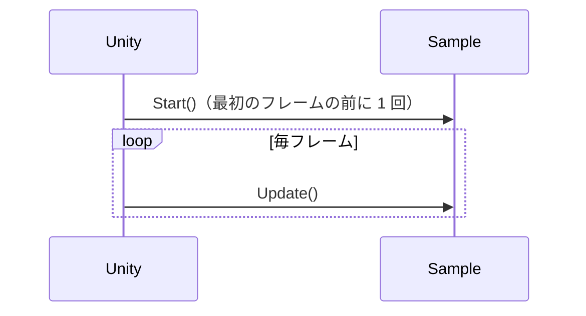

# ページタイトル

1〜2文でこのページの概要を説明します。何ができるようになるのか（どんな動きを作るのか）を最初に示します。

## 学習目標

このページを読み終えると、以下のことができるようになります。

- 〇〇を使って△△できる
- 〇〇の仕組みを説明できる

## 前提知識

- [前のページ名](/unity-csharp-learning/unity/前のページ/) を読んでいること

---

## 1. シーンとゲームオブジェクトを準備する

<!-- Editor 操作は、メニューのパスやボタン名を太字で示し、読者が同じ状態を再現できるように書く -->
<!-- 数値（位置・大きさなど）を設定する場合は、具体的な値を書く。文書だけで値が決まらないと動作確認できない -->

メニューバーの **GameObject → Create Empty** を選択し、空のゲームオブジェクトを作成します。名前を `〇〇` に変更してください。


---

## 2. スクリプトを作成する

<!-- スクリプトは using からクラスの閉じ括弧まで、そのままコピーして動く完全な形で示す -->
<!-- 前の節のコードを変更する場合も、変更後の全体を示す。変更箇所はコメントで示す -->

`〇〇` を選択し、Inspector ビューの **Add Component → New script** から `Sample` という名前のスクリプトを作成してアタッチします。スクリプトを次のように書き換えます。

```csharp
using UnityEngine;

public class Sample : MonoBehaviour
{
    private void Start()
    {
        Debug.Log("Start");
    }
}
```

コードの動きを説明します。

---

## 3. 〇〇() で△△する

<!-- Unity の API を初めて紹介するときのパターン: シグネチャを csharp ブロックで示し、パラメータを表で説明する -->
<!-- 書式ヘッダーは AGENTS.md の「公式ドキュメントリンクのルール」に従ってリンクにする（Input System はリンクしない） -->

**`Rigidbody.AddForce()`** — Rigidbody に力を加えます。

**書式：[Rigidbody.AddForce メソッド](https://docs.unity3d.com/ScriptReference/Rigidbody.AddForce.html)**
```csharp
public void AddForce(Vector3 force);
```

| パラメータ | 説明 |
|---|---|
| `force` | 加える力の方向と大きさ（`Vector3`） |

<!-- C# の文法を初めて紹介するときは、C# 版テンプレートと同じ文法パターン（擬似コード＋要素の表、C# 言語リファレンスへのリンク）を使う -->

API を使ったコード例と、その説明を書きます。

<!-- 図解（任意）: 呼び出しの順序やオブジェクトの構造が文章だけでは伝わりにくい場合に入れる。AGENTS.md の「図解のルール」を参照 -->
<!-- Editor の画面を示すスクリーンショットとは役割が違う。図解は仕組みを説明し、スクリーンショットは操作や結果を示す -->
<!-- 流れ・順序は Mermaid で書く。図の順序はスクリプトの実際の呼び出し順と一致させる -->



<!-- 座標や物理量のグラフなど、配置に意味がある図は SVG をページと同じフォルダーに別ファイルで置く -->
<!--  -->

> 💡 **ポイント**: 重要な補足事項をここに書きます。

---

## 動作確認

<!-- ページの最終的なスクリプトを動かす手順と、観察できる結果を書く。この節が UnionAir による検証の基準になる -->
<!-- 期待する結果は、Console の出力、ゲームオブジェクトの状態（位置・数・名前など）、画面の見た目の順に、確認できるものを書く -->

1. **File → New Scene** で新しいシーンを作成する
2. **GameObject → Create Empty** で空のゲームオブジェクトを追加する
3. 空のゲームオブジェクトに `Sample` スクリプトを作成してアタッチする
4. Play ボタンを押す

Console に次のように表示されます。

```
Start
```

〇〇が△△することを確認してください。


<!-- 時間や物理に依存する動きは、動画を添えるとわかりやすい -->
<!-- <video controls src="video.mp4" title="実行結果"></video> -->

---

<!-- ## よくあるミス（任意）: コンポーネントの付け忘れ、Inspector での設定漏れなど、Editor 側の原因も含めて紹介する -->
<!--
## よくあるミス

### 〇〇が動かない

原因と確認方法を説明します。

---
-->

<!-- ## ワンポイントアドバイス（任意）: 関連機能や知っておくと役立つ周辺知識を紹介する -->
<!--
## ワンポイントアドバイス

〇〇と合わせて知っておくと便利な機能や考え方を紹介します。

---
-->

## まとめ

- このページで学んだこと 1
- このページで学んだこと 2

---

## 理解度チェック

1. 〇〇とは何ですか？
2. 次のスクリプトを実行すると、Console に何が表示されますか？

   ```csharp
   // 問題のコードをここに書く
   ```

3. （応用）〇〇を使って△△を実現するにはどうすればよいですか？

<details markdown="1">
<summary>解答を見る</summary>

1. 〇〇の答え
2. `出力結果` が表示されます。理由を 1 文で説明します。
3. ```csharp
   // 解答コード
   ```

</details>

---

## 次のステップ

[次のページ名](/unity-csharp-learning/unity/次のページ/) では、〇〇について学びます。
