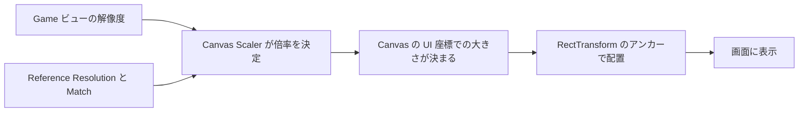
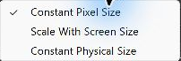
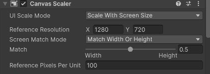
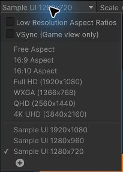
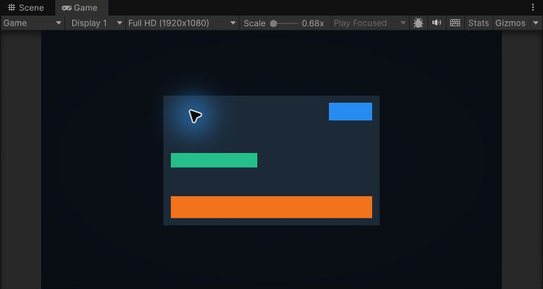
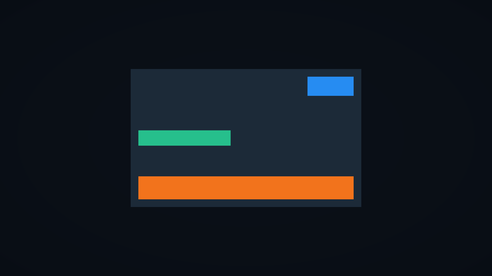
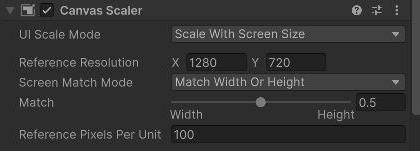
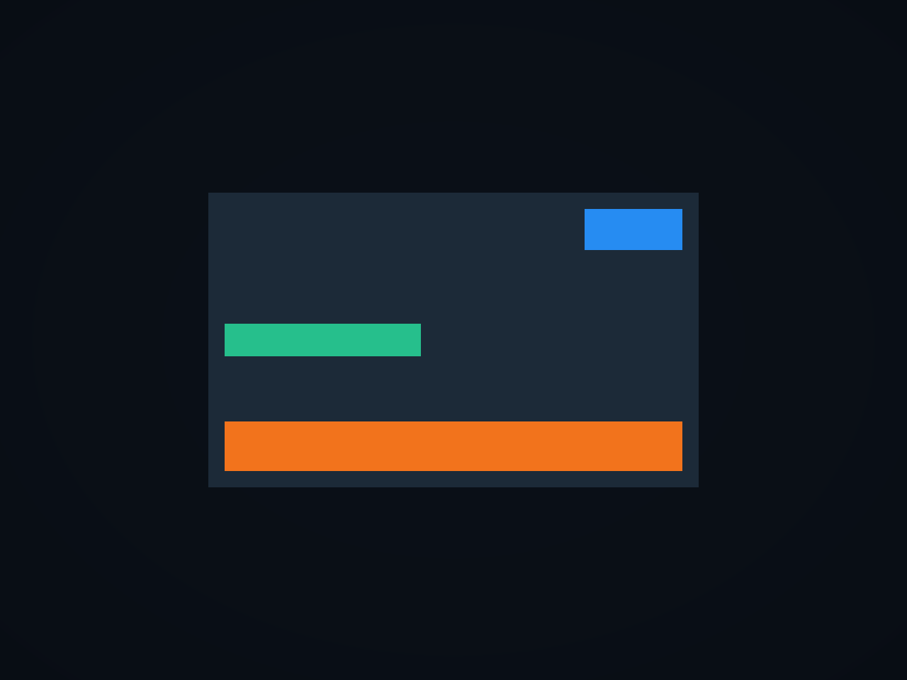
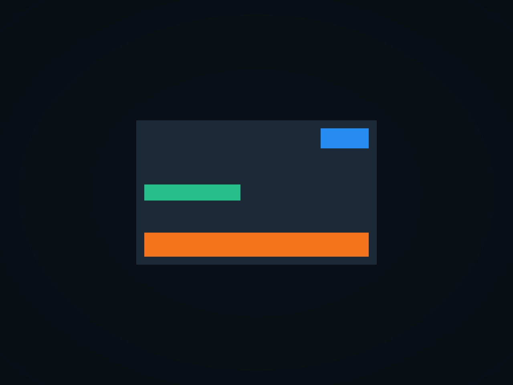
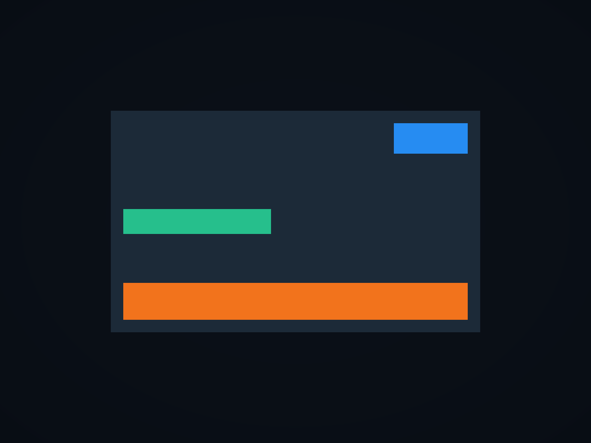

# Canvas Scaler と画面サイズへの対応

同じ UI でも、画面の解像度が高くなると小さく見えることがあります。**Canvas Scaler** で基準となる解像度を決め、画面サイズに合わせて UI 全体を拡大縮小する方法を学びます。スクリプトは使いません。

## 学習目標

- Constant Pixel Size と Scale With Screen Size の違いを説明できる
- Reference Resolution と Match を設定できる
- Game ビューで解像度と縦横比を変えて表示を確認できる

## 前提知識

- [RectTransform — アンカーとピボット](/unity-csharp-learning/unity/rect-transform/) のシーンを作っていること

---

## 1. 基準となる配置を確認する

前のページの `SampleUILayout` シーンを開きます。停止中に、次の状態に戻してください。

| オブジェクト | Anchors Min / Max | Pivot | 位置・サイズ |
|---|---|---|---|
| LayoutArea | 両方 `(0.5, 0.5)` | `(0.5, 0.5)` | Pos `(0, 0)`、600×360 |
| Corner | 両方 `(1, 1)` | `(1, 1)` | Pos `(-20, -20)`、120×50 |
| Strip | Min `(0, 0)`、Max `(1, 0)` | `(0.5, 0)` | Left / Right = 20、Pos Y = 20、Height = 60 |
| Bar | 両方 `(0, 0.5)` | `(0, 0.5)` | Pos `(20, 0)`、240×40 |

Corner、Strip、Bar は LayoutArea の子です。Pos Z、Rotation、Scale は前のページのままで、変更しません。

---

## 2. Canvas Scaler の役割

**Canvas Scaler** は Canvas 内の UI 全体のスケールを管理します。RectTransform の Width / Height を1つずつ変更する代わりに、全体の表示倍率を決めます。

**書式：[Canvas Scaler コンポーネント](https://docs.unity3d.com/Packages/com.unity.ugui@2.0/manual/script-CanvasScaler.html)**
```csharp
public class CanvasScaler : UIBehaviour
```

UI を初めて追加したとき、Canvas には **Canvas**、**Canvas Scaler**、**Graphic Raycaster** が付いています。今回見るのは、このうち Canvas Scaler です。Hierarchy で `Canvas` を選択すると、Inspector に表示されます。

Canvas の **Render Mode** は、UI を画面や空間のどこに描くかを決めます。UI を追加して自動作成された Canvas は、初期値の **Screen Space - Overlay** です。これはカメラが描いた画面の上に UI を重ねる方式で、このページでも変更せず使います。

Canvas Scaler の **UI Scale Mode** は、UI の拡大縮小の基準を選ぶ項目です。初期値は **Constant Pixel Size** で、前のページではこの設定を使っていました。

| UI Scale Mode | 何を基準にするか |
|---|---|
| Constant Pixel Size | ピクセル数。Scale Factor = 1 なら、UI の1単位を画面の1ピクセルに対応させる |
| Scale With Screen Size | 基準解像度と実際の画面サイズの比 |
| Constant Physical Size | DPI を使った物理的な大きさ。機器の DPI 情報にも依存する |

このページでは **Scale With Screen Size** を使います。アンカーは親の中での配置、Canvas Scaler は UI 全体の表示倍率を決めるので、両方を組み合わせて使います。



---

## 3. 基準解像度を設定する

Hierarchy で `Canvas` を選択し、Inspector の **Canvas Scaler** を開きます。**UI Scale Mode** のドロップダウンから **Scale With Screen Size** を選んでください。画面のピクセル数に関係なく同じサイズで描く設定から、画面サイズに応じて拡大縮小する設定へ切り替える操作です。



切り替えると、**Reference Resolution** と **Screen Match Mode** が表示されます。Reference Resolution は、UI を設計する基準の幅と高さです。**X** に `1280`、**Y** に `720` を入力してください。

**Screen Match Mode** は、実際の画面が基準と異なる縦横比のとき、どの方法で倍率を決めるかを選びます。初期表示の **Match Width Or Height** は、幅と高さのどちらを重視するかを **Match** で調整する方式です。この方式のまま、Match の数値欄に `0.5` を入力します。幅と高さを同じ重みで扱う設定です。



Reference Resolution は、ゲームを実行する画面をこの解像度に固定する設定ではありません。実行画面の解像度は、次の節の Game ビューで切り替えます。

---

## 4. 同じ縦横比で解像度を変える

Game ビューの解像度を切り替えて、基準と同じ16:9の画面で比較します。解像度の登録方法は、前のページの [Game ビューの解像度を登録する](/unity-csharp-learning/unity/rect-transform/#game-ビューの解像度を登録する) を使います。

**Game** タブを開き、上部の解像度メニューから **Sample UI 1280x720** を選んで、Play ボタンを押してください。Gizmos は前のページと同じくオフにします。

次に、同じ解像度メニューを開きます。**Full HD (1920x1080)** があれば選択してください。なければリスト下部の **＋** から、Fixed Resolution の幅 `1920`、高さ `1080` を登録します。



**Game ビュー上部の解像度名が1920×1080に変わったこと**を確認します。解像度メニューは描画するピクセル数を変える機能です。Game ビューのタブやウィンドウをドラッグして広げる操作とは区別してください。



**1280×720 の実行結果：**


**1920×1080 の実行結果：**



どちらも16:9なので、横と縦の倍率が一致します。1920×1080では倍率が `1920 / 1280 = 1080 / 720 = 1.5` になり、LayoutArea は画面上で900×540ピクセルになります。RectTransform に入力した600×360というサイズは、そのままです。

| 解像度 | 表示倍率 | LayoutArea の画面上の大きさ |
|---|---|---|
| 1280×720 | 1 | 600×360 ピクセル |
| 1920×1080 | 1.5 | 900×540 ピクセル |

Game ビューが小さいと、Editor が画像を縮小して表示します。Game ビュー上部の **Scale** はプレビューの倍率です。Canvas Scaler の表示倍率とは別なので、スクリーン上で定規を当てた寸法で判断しないでください。掲載した実行結果は Game ビューの描画画像です。

---

## 5. 縦横比が変わるときの Match

**Match** は、幅の比率と高さの比率のどちらを重視するかを指定します。

| Match | 基準 | この例の表示倍率 |
|---|---|---|
| 0（Width） | 幅 | `1280 / 1280 = 1` |
| 0.5 | 幅と高さの比率を対数で均等に混ぜる | 約1.155 |
| 1（Height） | 高さ | `960 / 720 ≒ 1.333` |

解像度の登録手順を使い、**1280×960** を **Fixed Resolution** として追加し、再生中に選択します。幅は基準と同じで、高さだけが大きい4:3の画面です。

Hierarchy で `Canvas` を選び、Canvas Scaler の **Match** を変更します。スライダーの右の数値欄に `0`、`0.5`、`1` と入力し、それぞれの表示を比べてください。



0.5 は、幅と高さの倍率の単純な算術平均ではありません。この例では `√(1 × 4/3)` に相当します。まずは両端の0と1を試し、それから0.5にすると違いを把握しやすくなります。

**Match = 0.5 の実行結果：**



**Match = 0 の実行結果：**



**Match = 1 の実行結果：**



UI 全体は縦横で同じ倍率を使うため、パネルを4:3へ引き伸ばすわけではありません。また、Canvas Scaler だけでは、縦長画面で項目を並べ替えたり、画面からはみ出す大きなパネルを自動で作り直したりはしません。アンカーや、次のページで学ぶ自動配置も使って調整します。

---

## 動作確認

再生中に解像度と Match を切り替え、次の点を確認してください。

- 1280×720と1920×1080では、UI が画面に占める割合が同じになる
- 1280×960では、Match を0から1へ変えると UI 全体が大きくなる
- どの設定でも、青・オレンジ・緑の Image が親の中での配置を維持する
- LayoutArea の RectTransform の Width / Height は600×360のままになる

この構成では、Console にログは出しません。比較が終わったら再生を停止し、**停止中に Match を0.5、Game ビューを1280×720** に戻して、シーンを保存します。

## よくあるミス

### 高解像度で UI が小さく見える

UI Scale Mode が Constant Pixel Size のままになっていないか確認します。Scale With Screen Size に変え、Reference Resolution を設定してください。

### Reference Resolution を変えたら UI の大きさが変わった

基準を変えると画面との比率も変わります。既存のレイアウトを保ったままゲームの解像度だけを切り替えたい場合は、Game ビューの解像度を変更します。

## まとめ

- Reference Resolution は UI を設計する基準解像度
- 同じ縦横比では、解像度に比例して UI 全体が拡大縮小する
- 縦横比が変わる場合は Match で幅と高さの重みを選ぶ
- アンカーと Canvas Scaler は、配置と表示倍率をそれぞれ担当する

## 理解度チェック

1. Reference Resolution を1280×720にすると、ゲームの解像度も1280×720に固定されますか？
2. この設定で1920×1080に表示するとき、UI の表示倍率はいくつですか？
3. Match = 0 は、幅と高さのどちらを基準にしますか？

<details markdown="1">
<summary>解答を見る</summary>

1. 固定されません。UI のスケールを計算する基準を設定しています。
2. 1.5倍です。
3. 幅です。

</details>

## 次のステップ

[Layout Group による自動配置](/unity-csharp-learning/unity/layout-group/) では、複数の UI を等間隔に並べ、項目数が変わったときの配置を自動化します。

## 参考

- [Designing UI for Multiple Resolutions](https://docs.unity3d.com/Packages/com.unity.ugui@2.0/manual/HOWTO-UIMultiResolution.html)
