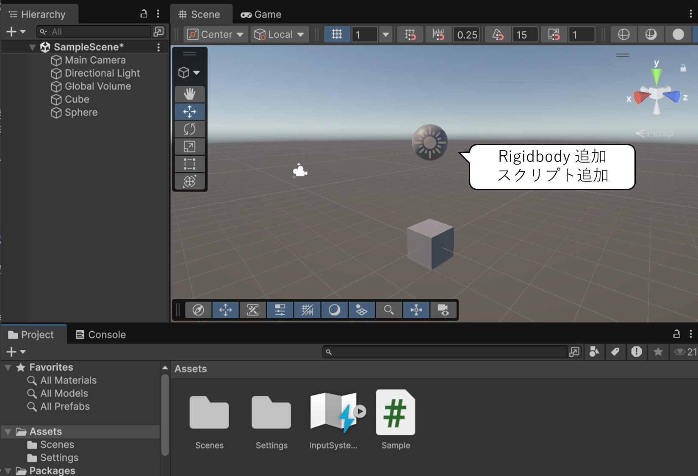

# Collider — 衝突とトリガー判定

Unity の **Collider（コライダー）** コンポーネントはオブジェクトの当たり判定の形状を定義します。このページでは、オブジェクト同士の**物理衝突**をスクリプトで検知する方法と、衝突せずに「触れた」ことだけを検知する**トリガー**の使い方を学びます。

## 学習目標

このページを読み終えると、以下のことができるようになります。

- Collider の役割を説明できる
- `OnCollisionEnter` メソッドで物理衝突を検知できる
- Is Trigger と `OnTriggerEnter` メソッドの違いを説明できる
- `other.gameObject` プロパティ / `collision.gameObject` プロパティで相手のオブジェクトを取得できる
- `Destroy()` メソッドでシーンからオブジェクトを削除できる

## 前提知識

- [Rigidbody で力を加える](/unity-csharp-learning/unity/rigidbody-force/) を読んでいること

---

## 1. Collider とは

**Collider** コンポーネントはゲームオブジェクトの**当たり判定の形状**を定義します。`GameObject.CreatePrimitive()` や Unity エディターで 3D オブジェクトを作成すると、形状に合った Collider（Sphere Collider、Box Collider など）が自動的に追加されます。

Rigidbody を持つオブジェクトが Collider を持つ別のオブジェクトに触れると、物理エンジンによって**衝突（押し合い・反発）**が発生します。

---

## 2. ゲームオブジェクトとスクリプトの準備

衝突判定の実験のため、まずは以下の図のようにゲームオブジェクトを配置してください。メニューバーの **GameObject → 3D Object** 項目から Cube と Sphere を追加し、立方体の直上に球体を配置してください。



球体ゲームオブジェクトに Rigidbody コンポーネントとスクリプトを追加して準備完了です。

## 3. OnCollisionEnter — 衝突を検知する

Rigidbody を持つオブジェクトが別の Collider に触れたとき、**`OnCollisionEnter()` メソッド** が呼ばれます。

**`MonoBehaviour.OnCollisionEnter()`** — Collider または Rigidbody が別の Collider / Rigidbody に接触したとき呼ばれます。<!-- [公式ドキュメント]() -->

**書式：OnCollisionEnter メソッド**
```csharp
private void OnCollisionEnter(Collision collision);
```

| パラメータ | 説明 |
|---|---|
| `collision` | 衝突情報を持つ `Collision` オブジェクト |

`collision.gameObject` プロパティで衝突した相手の GameObject を取得できます。

```csharp
using UnityEngine;

public class Sample : MonoBehaviour
{
    private void OnCollisionEnter(Collision collision)
    {
        Debug.Log($"衝突: {collision.gameObject.name}");
    }
}
```

物理的な衝突（反発・押し合い）はそのまま継続します。`OnCollisionEnter()` メソッドはあくまで「ぶつかったことをスクリプトに知らせる」だけです。

---

## 4. Destroy() — オブジェクトをシーンから削除する

衝突したゲームオブジェクトを削除するプログラムを作成しましょう。ゲームオブジェクトをスクリプトから削除するには `Destroy()` メソッドを使います。

**`Object.Destroy()`** — ゲームオブジェクトやコンポーネントをシーンから削除します。<!-- [公式ドキュメント]() -->

**書式：Object.Destroy メソッド**

```csharp
public static void Destroy(Object obj);
```

| パラメータ | 説明 |
|---|---|
| `obj` | 削除する Object（GameObject やコンポーネント） |

`OnCollisionEnter()` メソッドの中で `Destroy(collision.gameObject)` を呼ぶと、衝突した相手を削除できます。

```csharp
using UnityEngine;

public class Sample : MonoBehaviour
{
    private void OnCollisionEnter(Collision collision)
    {
        Destroy(collision.gameObject);
    }
}
```

<video controls src="video.mp4" title="実行結果"></video>

---

## 5. Is Trigger — 衝突せずに交差を検知する

アイテム回収のように「触れたことを検知したいが、ぶつかって弾き飛ばされたくない」場合は、Collider の **Is Trigger** をオンにします。


| Is Trigger | 動作 |
|---|---|
| オフ（既定） | Rigidbody と物理的に衝突する（反発・押し合い） |
| オン | 交差しても弾かれない。交差をスクリプトで検知できる |

> 💡 **補足**: Is Trigger をオンにしても Collider は消えません。「見えない交差検知ゾーン」として機能します。

---

## 6. OnTriggerEnter — 交差を検知するイベントメソッド

Rigidbody を持つオブジェクトが、Is Trigger がオンの Collider に侵入したとき、**`OnTriggerEnter()` メソッド** が呼ばれます。

**`MonoBehaviour.OnTriggerEnter()`** — Is Trigger の Collider に別のオブジェクトが侵入したとき呼ばれます。<!-- [公式ドキュメント]() -->

**書式：OnTriggerEnter メソッド**
```csharp
private void OnTriggerEnter(Collider other);
```

| パラメータ | 説明 |
|---|---|
| `other` | 交差した相手の `Collider` コンポーネント |

`OnCollisionEnter()` メソッドとの違いに注目してください。パラメータの型が `Collision`（衝突情報）ではなく `Collider`（コンポーネント）になっています。相手の GameObject は `other.gameObject` プロパティで取得します。

衝突と同じように、交差した相手を削除するスクリプトを実行してみましょう。

```csharp
using UnityEngine;

public class Sample : MonoBehaviour
{
    private void OnTriggerEnter(Collider other)
    {
        Debug.Log($"触れた: {other.gameObject.name}");
        Destroy(other.gameObject);
    }
}
```

<video controls src="video-1.mp4" title="実行結果"></video>

`OnCollisionEnter` の場合は衝突が発生した後オブジェクトを削除するので、衝突した瞬間に球体が停止する「突っかかり」のようなものがありますが、`OnTriggerEnter` の場合は衝突が発生しないので球体の落下は妨げられていません。

---

## まとめ

- Collider はオブジェクトの当たり判定形状。3D Object を作成すると自動付与される
- `OnCollisionEnter(Collision collision)` メソッドは物理衝突が発生したとき呼ばれる。衝突自体はそのまま起きる
- **Is Trigger** をオンにすると物理衝突しなくなり、交差をスクリプトで検知できる
- `OnTriggerEnter(Collider other)` メソッドは Rigidbody が Is Trigger の Collider に入ったとき呼ばれる
- どちらも `gameObject` プロパティで相手の GameObject を取得できる
- `Destroy(gameObject)` メソッドでシーンからオブジェクトを削除できる

---

## 理解度チェック

1. `OnCollisionEnter` メソッドと `OnTriggerEnter` メソッドはどちらも「触れたとき」に呼ばれますが、何が違いますか？
2. Collider の Is Trigger をオンにすると、衝突の動作はどう変わりますか？
3. `Destroy(gameObject)` と `Destroy(other.gameObject)` の違いは何ですか？

<details markdown="1">
<summary>解答を見る</summary>

1. `OnCollisionEnter` メソッドは Is Trigger がオフの通常の物理衝突で呼ばれ、反発が起きる。`OnTriggerEnter` メソッドは Is Trigger がオンの Collider に侵入したとき呼ばれ、オブジェクトはすり抜ける。
2. 物理的な衝突（反発）が起きなくなり、オブジェクト同士がすり抜ける。その代わり、交差を `OnTriggerEnter` メソッドで検知できるようになる。
3. `Destroy(gameObject)` メソッドは**自分自身**を削除し、`Destroy(other.gameObject)` メソッドは**触れた相手**を削除する。

</details>

---

## 次のステップ

[プレハブ（Prefab）](/unity-csharp-learning/unity/prefab-basics/) では、同じ設定のゲームオブジェクトを大量に配置するための「ひな形」の仕組みを学びます。

