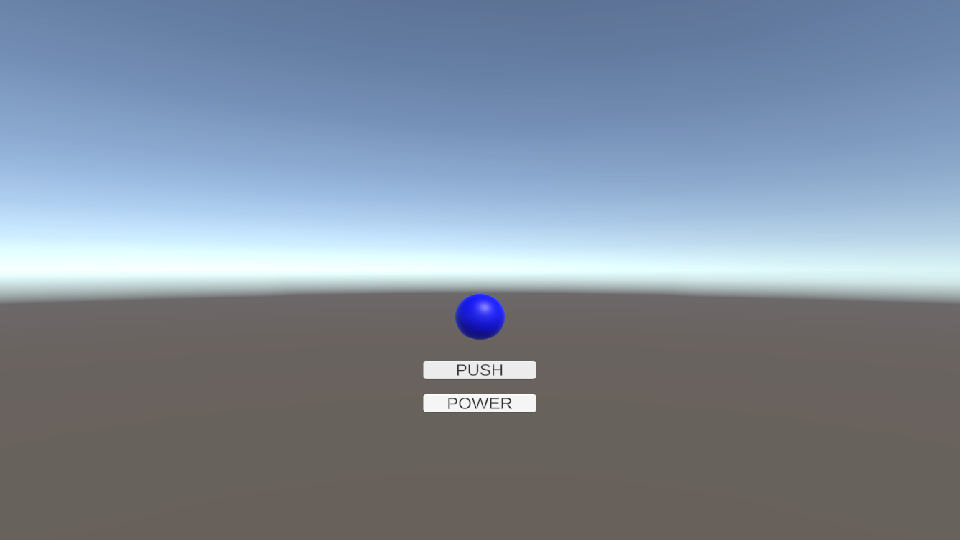
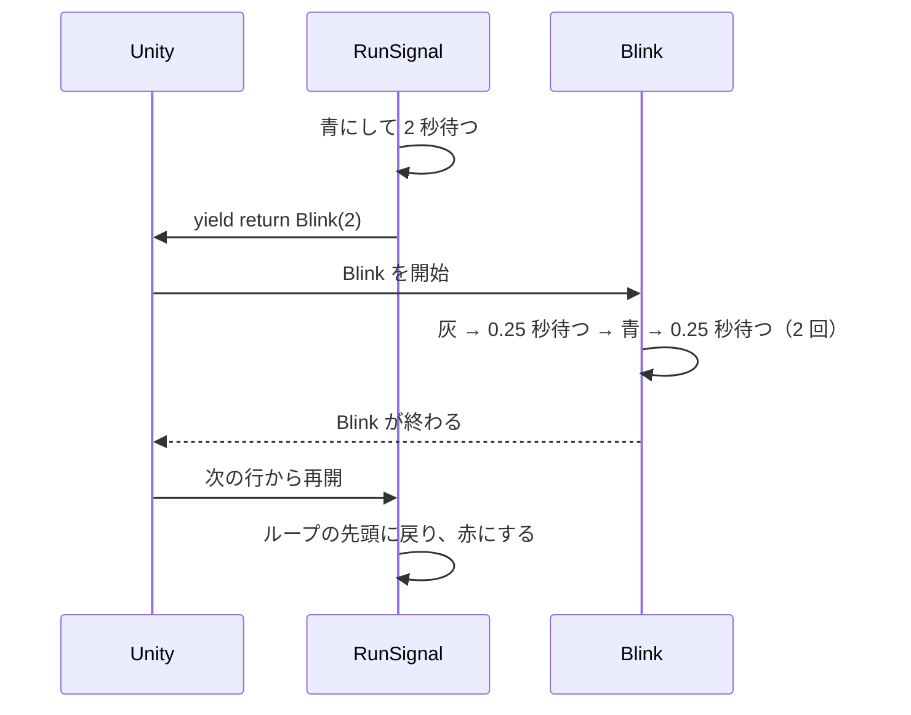

# コルーチンの制御

[コルーチンの基本](/unity-csharp-learning/unity/coroutines/) では、決まった秒数で色が切り替わる信号機をコルーチンで書きました。このページでは、ボタンが押されるまで待つ押しボタン式の信号機を作りながら、条件を満たすまで待つ方法、コルーチンから別のコルーチンを呼び出す方法、動いているコルーチンを止める方法を学びます。



## 学習目標

このページを読み終えると、以下のことができるようになります。

- `WaitUntil` を使って、条件が満たされるまでコルーチンを待たせられる
- `yield return` で別のコルーチンを呼び出し、その終わりを待てる
- `StartCoroutine` の戻り値を保存しておき、`StopCoroutine` で止められる
- 同じコルーチンを二重に開始しないように書ける
- ゲームオブジェクトを非アクティブにしたり、コンポーネントを無効にしたりしたときに、コルーチンがどうなるかを説明できる

## 前提知識

- [コルーチンの基本](/unity-csharp-learning/unity/coroutines/) を読んでいること
- [Unity UI とボタン操作](/unity-csharp-learning/unity/unity-ui/) を読んでいること

---

## 1. シーンを準備する

押しボタン式の信号機は、次のように動きます。

1. ふだんは赤のまま、ボタンが押されるまで待つ
2. ボタンが押されたら、1 秒後に青にする
3. 青を 3 秒表示したら赤に戻り、またボタンを待つ

信号機の球体と、押しボタンにする UI のボタンを用意します。

1. メニューバーの **File → New Scene** で新しいシーンを作成する
2. **GameObject → 3D Object → Sphere** で球体を追加し、名前を `Signal` に変更する
3. `Signal` を選択し、Inspector ビューの **Add Component → New script** から `PushButtonSignal` という名前のスクリプトを作成してアタッチする
4. **GameObject → UI (Canvas) → Button - TextMeshPro** でボタンを追加し、名前を `PushButton` に変更する。Unity のバージョンによっては、メニューの名前が **GameObject → UI → Button - TextMeshPro** になっている
5. `PushButton` の `RectTransform` の `Pos Y` を `-150` にして、ボタンを球体の下へ移す
6. `PushButton` の子の `Text (TMP)` を選択し、Inspector ビューの `Text Input` の文字を `PUSH` に変更する

ボタンの文字を英語にしているのは、TextMesh Pro の標準のフォントでは日本語を表示できないためです（[TextMesh Pro](/unity-csharp-learning/unity/textmesh-pro/) を参照）。

---

## 2. ボタンが押されるまで待つ

`PushButtonSignal` スクリプトを次のように書き換えます。

```csharp
using System.Collections;
using UnityEngine;

public class PushButtonSignal : MonoBehaviour
{
    private Renderer _renderer;
    private bool _isRequested;

    private void Start()
    {
        _renderer = GetComponent<Renderer>();
        StartCoroutine(RunSignal());
    }

    public void OnPushButton()
    {
        Debug.Log($"{Time.time:F2} 秒: 押しボタン");
        _isRequested = true;
    }

    private IEnumerator RunSignal()
    {
        while (true)
        {
            SetColor(Color.red, "赤");
            yield return new WaitUntil(() => _isRequested);
            _isRequested = false;

            yield return new WaitForSeconds(1f);

            SetColor(Color.blue, "青");
            yield return new WaitForSeconds(3f);
        }
    }

    private void SetColor(Color color, string label)
    {
        _renderer.material.color = color;
        Debug.Log($"{Time.time:F2} 秒: {label}");
    }
}
```

[Unity UI とボタン操作](/unity-csharp-learning/unity/unity-ui/) と同じ手順で、`PushButton` がクリックされたときに `OnPushButton` メソッドが呼ばれるようにします。

1. `PushButton` を選択し、Inspector ビューの `Button` コンポーネントにある **On Click ()** の **+** ボタンを押す
2. 追加された欄に、Hierarchy ビューから `Signal` をドラッグ＆ドロップする
3. **No Function** のリストから **PushButtonSignal → OnPushButton ()** を選択する

Play ボタンを押すと、球体は赤のまま変わりません。**PUSH** ボタンをクリックすると、約 1 秒後に青になり、3 秒後に赤に戻ります。Console には次のように表示されます。これは実行結果の例です。秒数は、ボタンをクリックした時刻とフレームレートによって変わります。

```
0.00 秒: 赤
1.00 秒: 押しボタン
2.04 秒: 青
5.06 秒: 赤
```

### WaitUntil で条件を待つ

**`WaitUntil`** — `yield return` に渡すと、指定した条件が `true` になるまでコルーチンを中断します。

**書式：[WaitUntil コンストラクター](https://docs.unity3d.com/ScriptReference/WaitUntil-ctor.html)**
```csharp
public WaitUntil(Func<bool> predicate);
```

| パラメータ | 説明 |
|---|---|
| `predicate` | 待つのを終える条件。`bool` を返すメソッドを渡す |

Unity は、中断しているコルーチンの条件をフレームごとに調べ、`true` になっていたらコルーチンを再開します。

`() => _isRequested` は**ラムダ式**です。引数を受け取らず、`_isRequested` の値を返すメソッドを、その場で書いています（詳しくは [ラムダ式](/unity-csharp-learning/csharp/lambda/) を参照）。`WaitUntil` は、このメソッドをフレームごとに呼んで条件を調べます。

ボタンがクリックされると、`OnPushButton` が `_isRequested` を `true` にします。次のフレームで `WaitUntil` が条件を満たしたことに気付き、コルーチンが再開します。

再開した直後に `_isRequested` を `false` に戻しているのは、次に赤になったとき、もう一度ボタンを待つためです。`true` のままだと、2 回目以降の赤では `WaitUntil` の条件が最初から満たされているので、ボタンを待たずに先へ進んでしまいます。

> 💡 **ポイント**: 条件が `true` の間だけ待ちたいときは、[WaitWhile](https://docs.unity3d.com/ScriptReference/WaitWhile.html) を使います。`new WaitWhile(() => _isRequested)` は、`new WaitUntil(() => !_isRequested)` と同じ意味です。

---

## 3. 点滅を別のコルーチンに分ける

[コルーチンの基本](/unity-csharp-learning/unity/coroutines/) の信号機と同じように、青の残り 1 秒で点滅させます。今回は、点滅の処理を `Blink` という別のコルーチンに分けます。`PushButtonSignal` スクリプトを次のように書き換えます。

```csharp
using System.Collections;
using UnityEngine;

public class PushButtonSignal : MonoBehaviour
{
    private Renderer _renderer;
    private bool _isRequested;

    private void Start()
    {
        _renderer = GetComponent<Renderer>();
        StartCoroutine(RunSignal());
    }

    public void OnPushButton()
    {
        Debug.Log($"{Time.time:F2} 秒: 押しボタン");
        _isRequested = true;
    }

    private IEnumerator RunSignal()
    {
        while (true)
        {
            SetColor(Color.red, "赤");
            yield return new WaitUntil(() => _isRequested);
            _isRequested = false;

            yield return new WaitForSeconds(1f);

            SetColor(Color.blue, "青");
            yield return new WaitForSeconds(2f);

            yield return Blink(2); // 追加：点滅が終わるまで待つ
        }
    }

    // 追加：灰色と青を 0.25 秒ずつ、count 回繰り返す
    private IEnumerator Blink(int count)
    {
        for (int i = 0; i < count; i++)
        {
            SetColor(Color.gray, "灰");
            yield return new WaitForSeconds(0.25f);

            SetColor(Color.blue, "青");
            yield return new WaitForSeconds(0.25f);
        }
    }

    private void SetColor(Color color, string label)
    {
        _renderer.material.color = color;
        Debug.Log($"{Time.time:F2} 秒: {label}");
    }
}
```

`RunSignal` の中の `yield return Blink(2);` のように、`yield return` に別のコルーチンの `IEnumerator` を渡すと、Unity はそれをコルーチンとして実行し、**終わるまで呼び出し元を中断します**。`Blink` が終わると、`RunSignal` は次の行から再開します。

Play ボタンを押して **PUSH** ボタンをクリックすると、Console には次のように表示されます。これは実行結果の例です。

```
0.00 秒: 赤
1.00 秒: 押しボタン
2.04 秒: 青
4.06 秒: 灰
4.32 秒: 青
4.58 秒: 灰
4.84 秒: 青
5.10 秒: 赤
```

呼び出しの流れを図にすると、次のようになります。`Blink` の始まりと終わりで、フレームを余分に待つことはありません。`Blink` は `yield return Blink(2)` を実行したフレームで始まり、`RunSignal` は `Blink` が終わったフレームで再開します。



点滅を別のコルーチンに分けると、`RunSignal` には「青にして 2 秒待つ → 点滅する」という流れだけが残り、読みやすくなります。点滅の回数を引数で変えられるので、別の場面で回数を変えて使うこともできます。

> 💡 **ポイント**: `yield return StartCoroutine(Blink(2));` と書いても、同じように `Blink` が終わるまで待ちます。`yield return` には、`IEnumerator` のほかに、`StartCoroutine` が返す `Coroutine` も渡せます。

---

## 4. コルーチンを止める

信号機に電源のボタンを加えます。動いているときに押すと信号を消し、消えているときに押すと最初から動かし直します。

1. Hierarchy ビューで `PushButton` を選択し、**Ctrl + D**（macOS では **Cmd + D**）で複製する。複製したボタンの名前を `PowerButton` に変更する
2. `PowerButton` の `RectTransform` の `Pos Y` を `-200` にする
3. `PowerButton` の子の `Text (TMP)` の `Text Input` を `POWER` に変更する

`PushButtonSignal` スクリプトを次のように書き換えます。

```csharp
using System.Collections;
using UnityEngine;

public class PushButtonSignal : MonoBehaviour
{
    private Renderer _renderer;
    private bool _isRequested;
    private Coroutine _signalRoutine; // 追加：動いているコルーチン

    private void Start()
    {
        _renderer = GetComponent<Renderer>();
        _signalRoutine = StartCoroutine(RunSignal()); // 変更：戻り値を保存する
    }

    public void OnPushButton()
    {
        Debug.Log($"{Time.time:F2} 秒: 押しボタン");
        _isRequested = true;
    }

    // 追加：電源のボタンが押されたときに呼ばれる
    public void OnPowerButton()
    {
        if (_signalRoutine != null)
        {
            StopCoroutine(_signalRoutine);
            _signalRoutine = null;
            SetColor(Color.black, "消灯");
        }
        else
        {
            _isRequested = false;
            _signalRoutine = StartCoroutine(RunSignal());
        }
    }

    private IEnumerator RunSignal()
    {
        while (true)
        {
            SetColor(Color.red, "赤");
            yield return new WaitUntil(() => _isRequested);
            _isRequested = false;

            yield return new WaitForSeconds(1f);

            SetColor(Color.blue, "青");
            yield return new WaitForSeconds(2f);

            yield return Blink(2);
        }
    }

    private IEnumerator Blink(int count)
    {
        for (int i = 0; i < count; i++)
        {
            SetColor(Color.gray, "灰");
            yield return new WaitForSeconds(0.25f);

            SetColor(Color.blue, "青");
            yield return new WaitForSeconds(0.25f);
        }
    }

    private void SetColor(Color color, string label)
    {
        _renderer.material.color = color;
        Debug.Log($"{Time.time:F2} 秒: {label}");
    }
}
```

`PowerButton` の **On Click ()** には、複製元の `PushButton` の設定がそのまま残っています。**PushButtonSignal → OnPushButton ()** になっている欄を、**PushButtonSignal → OnPowerButton ()** に変更してください。

### StartCoroutine の戻り値でコルーチンを止める

`StartCoroutine` は、開始したコルーチンを表す [Coroutine](https://docs.unity3d.com/ScriptReference/Coroutine.html) 型のオブジェクトを返します。これを `_signalRoutine` フィールドに保存しておき、止めるときに `StopCoroutine` に渡します。

**`MonoBehaviour.StopCoroutine()`** — 動いているコルーチンを止めます。

**書式：[MonoBehaviour.StopCoroutine メソッド](https://docs.unity3d.com/ScriptReference/MonoBehaviour.StopCoroutine.html)**
```csharp
public void StopCoroutine(Coroutine routine);
```

| パラメータ | 説明 |
|---|---|
| `routine` | 止めるコルーチン。`StartCoroutine` の戻り値を渡す |

止められたコルーチンは、中断している `yield return` の位置で終わり、二度と再開しません。もう一度動かすには、`StartCoroutine` で新しく開始します。新しく開始したコルーチンは、止めた位置からではなく、メソッドの最初から実行されます。

`OnPowerButton` では、`_signalRoutine` が `null` かどうかで、信号が動いているかを判断しています。止めたときに `_signalRoutine` を `null` に戻しておかないと、次に押されたときにも「動いている」と判断してしまいます。

動かし直す前に `_isRequested` を `false` に戻しているのは、信号が消えている間に押された **PUSH** ボタンを取り消すためです。

> 💡 **ポイント**: このスクリプトのすべてのコルーチンをまとめて止めるときは、[MonoBehaviour.StopAllCoroutines](https://docs.unity3d.com/ScriptReference/MonoBehaviour.StopAllCoroutines.html) を使います。

### 止めたときの後片付けは、止めた側で行う

`StopCoroutine` は、コルーチンをその場で打ち切ります。コルーチンの残りの行は実行されません。たとえば点滅の途中、球体が灰色のときに止めると、球体は灰色のまま残ります。

そのため、`OnPowerButton` では、止めた後に `SetColor(Color.black, "消灯")` で球体の色を決め直しています。コルーチンを止めるときは、そのコルーチンがやりかけていたことの後始末を、止めた側で行う必要があります。

> 💡 **ポイント**: コルーチンの中に `try` / `finally` を書いても、`StopCoroutine` で止めたときには `finally` ブロックは実行されません。後片付けを `finally` に任せることはできません。

---

## 5. コルーチンが止まるとき

コルーチンは、`StopCoroutine` を呼んだときのほかにも止まることがあります。コルーチンは、`StartCoroutine` を呼んだスクリプトのゲームオブジェクトに結び付いていて、ゲームオブジェクトの状態によって止まるかどうかが決まります。

| 操作 | コルーチン |
|---|---|
| `StopCoroutine` / `StopAllCoroutines` を呼ぶ | 止まる |
| ゲームオブジェクトを非アクティブにする（`SetActive(false)`） | 止まる。アクティブに戻しても再開しない |
| ゲームオブジェクトやスクリプトを破棄する（`Destroy`） | 止まる |
| スクリプトのコンポーネントを無効にする（`enabled = false`） | **止まらない** |

Play 中に Inspector ビューで確かめてみましょう。

1. Play ボタンを押し、**PUSH** ボタンをクリックする
2. `Signal` を選択し、Inspector ビューで `PushButtonSignal` コンポーネントの名前の左にあるチェックボックスを外す。コンポーネントは無効になるが、コルーチンは動き続け、球体の色は変わり続ける。**PUSH** ボタンをクリックすると、これまでどおり青になる
3. 球体が青の間に、Inspector ビューの一番上（ゲームオブジェクトの名前の左）にあるチェックボックスを外し、`Signal` を非アクティブにする。球体が見えなくなる
4. もう一度チェックを入れて、`Signal` をアクティブに戻す。球体は青のまま、色が変わらない。**PUSH** ボタンをクリックしても、Console に「押しボタン」と表示されるだけで、色は変わらない

4 で色が変わらないのは、3 で非アクティブにしたときに `RunSignal` のコルーチンが止まり、アクティブに戻しても再開しないためです。`_signalRoutine` には止まったコルーチンが残っているので、**POWER** ボタンを 1 回押すと「消灯」になり、もう 1 回押すと最初の赤から動き出します。

非アクティブなゲームオブジェクトでは、コルーチンを開始することもできません。3 の状態（`Signal` が非アクティブのまま）で **POWER** ボタンを 2 回クリックすると、2 回目の `StartCoroutine` で Console に次のエラーが表示され、コルーチンは開始されません。

```
Coroutine couldn't be started because the the game object 'Signal' is inactive!
```

---

## 動作確認

1. 1 節の手順でシーンを準備し、4 節の手順で `PowerButton` を追加する
2. `PushButtonSignal` スクリプトを 4 節のコードに書き換える
3. `PushButton` の **On Click ()** に **PushButtonSignal → OnPushButton ()** を、`PowerButton` の **On Click ()** に **PushButtonSignal → OnPowerButton ()** を設定する
4. Play ボタンを押す

次の操作をして、球体の色と Console の表示を確認してください。

1. 何もしない間、球体は赤のまま変わらない
2. **PUSH** ボタンをクリックすると、約 1 秒後に青になる
3. 青になってから約 2 秒後に点滅が始まる。点滅している間に **POWER** ボタンをクリックすると、球体が黒になる
4. 黒の間に **PUSH** ボタンをクリックしてから、**POWER** ボタンをクリックすると、球体は赤になり、ボタンを待つ（黒の間の **PUSH** は取り消される）
5. **PUSH** ボタンをクリックすると、約 1 秒後に青になる

Console には次のように表示されます。これは実行結果の例です。秒数は、ボタンをクリックした時刻とフレームレートによって変わります。

```
0.00 秒: 赤
1.00 秒: 押しボタン
2.04 秒: 青
4.06 秒: 灰
4.32 秒: 青
4.40 秒: 消灯
4.90 秒: 押しボタン
5.40 秒: 赤
6.40 秒: 押しボタン
7.44 秒: 青
```

---

## よくあるミス

### 動いているかを確かめずに、もう一度開始する

`StartCoroutine` は、呼ぶたびに新しいコルーチンを開始します。動いているコルーチンを止めずに、もう一度 `StartCoroutine` を呼ぶと、同じコルーチンが 2 つ同時に動きます。

```csharp
public void OnPowerButton()
{
    // ❌ NG: 動いているかどうかを確かめずに開始する
    _signalRoutine = StartCoroutine(RunSignal());
}
```

4 節の `OnPowerButton` をこのように書き換えて、**POWER** ボタンを 1 回クリックしてから、**PUSH** ボタンを 2 回続けてクリックすると、2 つの `RunSignal` がずれて動き、色の変わり方が乱れます。

```
0.00 秒: 赤
1.00 秒: 赤
2.00 秒: 押しボタン
2.50 秒: 押しボタン
3.04 秒: 青
3.54 秒: 青
5.06 秒: 灰
5.32 秒: 青
5.56 秒: 灰
5.58 秒: 灰
5.82 秒: 青
5.84 秒: 青
6.08 秒: 灰
6.10 秒: 赤
6.34 秒: 青
6.60 秒: 赤
```

6.10 秒に赤になった直後に、もう 1 つの `RunSignal` が点滅を続けて、6.34 秒に青にしています。また、`_signalRoutine` には後から開始したコルーチンしか残らないので、最初に開始したコルーチンは `StopCoroutine` で止められなくなります。

コルーチンを開始する前に、4 節のように `Coroutine` のフィールドが `null` かどうかを確かめます。

### StopCoroutine にメソッドの呼び出しを渡す

`StopCoroutine` には、`IEnumerator` を受け取るオーバーロードもあります。そのため、次のように書いてもコンパイルエラーにはなりません。

```csharp
// ❌ NG: 新しい IEnumerator を作って渡しているので、動いているコルーチンは止まらない
StopCoroutine(RunSignal());

// ✅ OK: StartCoroutine の戻り値を渡す
StopCoroutine(_signalRoutine);
```

`RunSignal()` を呼ぶと、そのたびに新しい `IEnumerator` が作られます。`StartCoroutine` に渡したものとは別のオブジェクトなので、動いているコルーチンは止まりません。エラーも警告も表示されないので、気付きにくいミスです。

---

## まとめ

- `yield return new WaitUntil(() => 条件)` は、条件が `true` になるまでコルーチンを中断する。条件はフレームごとに調べられる
- `yield return` に別のコルーチンの `IEnumerator` を渡すと、そのコルーチンが終わるまで呼び出し元が中断する
- `StartCoroutine` の戻り値の `Coroutine` を保存しておくと、`StopCoroutine` で止められる。止めたコルーチンは再開せず、動かし直すと最初から実行される
- `StopCoroutine` で止めると残りの行は実行されないので、後片付けは止めた側で行う
- 同じコルーチンを二重に開始しないように、`Coroutine` のフィールドで動いているかを確かめる
- ゲームオブジェクトを非アクティブにするとコルーチンは止まるが、コンポーネントを無効にしても止まらない

---

## 理解度チェック

1. 2 節の `RunSignal` で、`WaitUntil` の後の `_isRequested = false;` を消すと、どうなりますか？
2. 次のスクリプトをゲームオブジェクトにアタッチして Play ボタンを押すと、Console にどの順で表示されますか？

   ```csharp
   using System.Collections;
   using UnityEngine;

   public class NestedSample : MonoBehaviour
   {
       private IEnumerator Start()
       {
           Debug.Log("A");
           yield return Inner();
           Debug.Log("D");
       }

       private IEnumerator Inner()
       {
           Debug.Log("B");
           yield return null;
           Debug.Log("C");
       }
   }
   ```

3. コルーチンを動かしているスクリプトのコンポーネントを Inspector ビューで無効にしたときと、そのゲームオブジェクトを非アクティブにしたときの違いを説明してください。
4. （応用）4 節のスクリプトでは、青の間に **PUSH** ボタンを押すと、その操作が記憶され、次に赤になったときにすぐ青へ進みます。赤になってから押されたボタンだけを受け付けるように、`RunSignal` を変更してください。

<details markdown="1">
<summary>解答を見る</summary>

1. 1 回目にボタンが押された後、`_isRequested` が `true` のまま残ります。2 回目以降に赤になったとき、`WaitUntil` の条件が最初から満たされているので、ボタンを待たずに先へ進みます。そのため、ボタンを 1 回押しただけで、赤（約 1 秒）→ 青（3 秒）→ 赤 … と、ボタンを押さなくても繰り返すようになります。
2. `A`、`B`、`C`、`D` の順に表示されます。`yield return Inner();` で `Inner` が始まり、`Inner` が終わるまで `Start` は中断するので、`D` は `C` の後に表示されます。
3. コンポーネントを無効にしても、コルーチンは止まらずに動き続けます。ゲームオブジェクトを非アクティブにすると、そのゲームオブジェクトのスクリプトが動かしているコルーチンは止まり、アクティブに戻しても再開しません。
4. `_isRequested = false;` を、`WaitUntil` の前に移します。赤にした時点で、それまでに押されたボタンを取り消してから待つようになります。

   ```csharp
   using System.Collections;
   using UnityEngine;

   public class PushButtonSignal : MonoBehaviour
   {
       private Renderer _renderer;
       private bool _isRequested;
       private Coroutine _signalRoutine;

       private void Start()
       {
           _renderer = GetComponent<Renderer>();
           _signalRoutine = StartCoroutine(RunSignal());
       }

       public void OnPushButton()
       {
           Debug.Log($"{Time.time:F2} 秒: 押しボタン");
           _isRequested = true;
       }

       public void OnPowerButton()
       {
           if (_signalRoutine != null)
           {
               StopCoroutine(_signalRoutine);
               _signalRoutine = null;
               SetColor(Color.black, "消灯");
           }
           else
           {
               _isRequested = false;
               _signalRoutine = StartCoroutine(RunSignal());
           }
       }

       private IEnumerator RunSignal()
       {
           while (true)
           {
               SetColor(Color.red, "赤");
               _isRequested = false; // 変更：赤になる前に押されたボタンを取り消す
               yield return new WaitUntil(() => _isRequested);

               yield return new WaitForSeconds(1f);

               SetColor(Color.blue, "青");
               yield return new WaitForSeconds(2f);

               yield return Blink(2);
           }
       }

       private IEnumerator Blink(int count)
       {
           for (int i = 0; i < count; i++)
           {
               SetColor(Color.gray, "灰");
               yield return new WaitForSeconds(0.25f);

               SetColor(Color.blue, "青");
               yield return new WaitForSeconds(0.25f);
           }
       }

       private void SetColor(Color color, string label)
       {
           _renderer.material.color = color;
           Debug.Log($"{Time.time:F2} 秒: {label}");
       }
   }
   ```

</details>

---

## 次のステップ

[コルーチンでは書きにくいこと](/unity-csharp-learning/unity/coroutine-limits/) では、押しボタン式の信号機に機能を加えながら、コルーチンでは結果を返したり失敗を `try` / `catch` で受け取ったりできないことを確かめ、C# の `Task` と `async` / `await` との対応を整理します。
