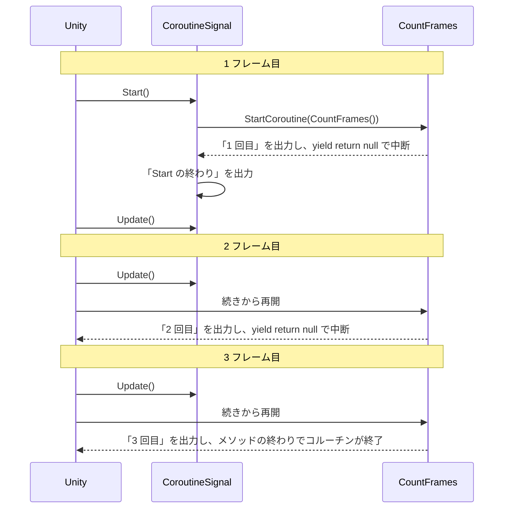

# コルーチンの基本

**コルーチン**（coroutine）は、途中で中断して、次のフレームや指定した秒数の後に続きから再開できる処理です。`Update` で書くと状態やタイマーのフィールドが必要になる「赤を 3 秒 → 青を 2 秒 → 点滅を 1 秒」のような順番のある処理を、上から下へ順に書けます。このページでは、[チュートリアル: 信号機](/unity-csharp-learning/unity/traffic-light/) の点滅する信号機を、コルーチンで書き直します。

## 学習目標

このページを読み終えると、以下のことができるようになります。

- `Update` だけで順番のある処理を書くと、状態やタイマーのフィールドが増える理由を説明できる
- `IEnumerator` を返すメソッドを書き、`StartCoroutine` でコルーチンとして開始できる
- `yield return null` で次のフレームまで、`WaitForSeconds` で指定した秒数だけ待てる
- コルーチンが `Start` や `Update` に対してどの順序で実行されるかを説明できる

## 前提知識

- [Update メソッドと連続実行](/unity-csharp-learning/unity/update-basics/) を読んでいること
- [Time クラスと時間制御](/unity-csharp-learning/unity/time-basics/) を読んでいること
- [チュートリアル: 信号機](/unity-csharp-learning/unity/traffic-light/) の課題 3 まで読んでいること
- [イテレーターと yield return](/unity-csharp-learning/csharp/iterators/) を読んでいると、コルーチンの仕組みを理解しやすくなります

---

## 1. Update で書いた点滅を振り返る

[チュートリアル: 信号機](/unity-csharp-learning/unity/traffic-light/) の課題 3 では、赤と青を 3 秒ずつ切り替え、青の残り 1 秒で点滅させました。解答のスクリプトは次のとおりです。

```csharp
using UnityEngine;

public class Signal : MonoBehaviour
{
    private int _state = 0;
    private float _timer = 0f;
    private float _redDuration = 3f;
    private float _blueDuration = 3f;
    private float _blinkTimer = 0f;
    private bool _isBlinkOn = true;
    private Renderer _renderer;

    private void Start()
    {
        _renderer = GetComponent<Renderer>();
        TransitionTo(_state);
    }

    private void Update()
    {
        _timer += Time.deltaTime;

        switch (_state)
        {
            case 0:  UpdateRed();  break;
            case 1: UpdateBlue(); break;
        }
    }

    private void UpdateRed()
    {
        if (_timer >= _redDuration)
            TransitionTo(1); // 青に遷移
    }

    private void UpdateBlue()
    {
        // 残り 1 秒で点滅
        if (_timer >= _blueDuration - 1f)
        {
            _blinkTimer += Time.deltaTime;
            if (_blinkTimer >= 0.25f)
            {
                _blinkTimer -= 0.25f;
                _isBlinkOn = !_isBlinkOn;
                _renderer.material.color = _isBlinkOn ? Color.blue : Color.gray;
            }
        }

        if (_timer >= _blueDuration)
            TransitionTo(0); // 赤に遷移
    }

    private void TransitionTo(int next) // 状態遷移（リセット）
    {
        _timer = 0f;
        _blinkTimer = 0f;
        _isBlinkOn = true;
        _state = next;
        _renderer.material.color = next == 0 ? Color.red : Color.blue;
    }
}
```

このスクリプトは正しく動きます。しかし、やりたいことは「赤を 3 秒 → 青を 2 秒 → 点滅を 1 秒 → 最初に戻る」という順番だけなのに、コードからはその順番が読み取りにくくなっています。

`Update` は毎フレーム最初から呼ばれ、前のフレームでどこまで進んだかを覚えていません。そのため、進み具合をすべてフィールドに保存しておく必要があります。

| フィールド | 覚えておくこと |
|---|---|
| `_state` | 今、赤と青のどちらの段階にいるか |
| `_timer` | その段階に入ってから何秒たったか |
| `_blinkTimer` | 点滅の切り替えから何秒たったか |
| `_isBlinkOn` | 点滅の今の色が青か灰色か |

段階が変わるたびに、これらを `TransitionTo` でリセットする必要もあります。黄色の段階を加えたり、点滅の回数を変えたりするたびに、フィールドと `if` が増えていきます。

コルーチンを使うと、「どこまで進んだか」をフィールドではなく、**メソッドの中で実行している位置**として Unity に覚えておいてもらえます。

---

## 2. シーンを準備する

1. メニューバーの **File → New Scene** で新しいシーンを作成する
2. **GameObject → 3D Object → Sphere** で球体を追加し、名前を `Signal` に変更する
3. `Signal` を選択し、Inspector ビューの **Add Component → New script** から `CoroutineSignal` という名前のスクリプトを作成してアタッチする

球体の位置は、作成されたときの (0, 0, 0) のままでかまいません。このページでは、`CoroutineSignal` スクリプトを書き換えながら進めます。

---

## 3. コルーチンを書いて開始する

`CoroutineSignal` スクリプトを次のように書き換えます。

```csharp
using System.Collections;
using UnityEngine;

public class CoroutineSignal : MonoBehaviour
{
    private void Start()
    {
        StartCoroutine(CountFrames());
    }

    private IEnumerator CountFrames()
    {
        Debug.Log($"{Time.frameCount} フレーム目: 1 回目");
        yield return null;

        Debug.Log($"{Time.frameCount} フレーム目: 2 回目");
        yield return null;

        Debug.Log($"{Time.frameCount} フレーム目: 3 回目");
    }
}
```

Play ボタンを押すと、Console に次のように表示されます。`Time.frameCount` は、ゲームを開始してから何フレーム目かを表すプロパティです。

```
1 フレーム目: 1 回目
2 フレーム目: 2 回目
3 フレーム目: 3 回目
```

3 つの `Debug.Log` が、1 フレームに 1 つずつ実行されました。

### コルーチンにするメソッド

コルーチンにするメソッドは、戻り値の型を `IEnumerator` にして、中に `yield return` を書きます。`IEnumerator` は `System.Collections` 名前空間にあるので、`using System.Collections;` を追加します。

`yield return` は、そこでメソッドの実行を中断する文です。`yield return null;` と書くと、コルーチンは**次のフレームまで**中断し、次のフレームで `yield return` の次の行から再開します。

`yield return` を含むメソッドは、C# では**イテレーター**と呼ばれます。イテレーターは、呼び出すたびに少しずつ先へ進められるメソッドです（詳しくは [イテレーターと yield return](/unity-csharp-learning/csharp/iterators/) を参照）。Unity は、このしくみを使って、コルーチンをフレームごとに少しずつ進めます。

### StartCoroutine でコルーチンを開始する

**`MonoBehaviour.StartCoroutine()`** — `IEnumerator` を返すメソッドを、コルーチンとして開始します。

**書式：[MonoBehaviour.StartCoroutine メソッド](https://docs.unity3d.com/ScriptReference/MonoBehaviour.StartCoroutine.html)**
```csharp
public Coroutine StartCoroutine(IEnumerator routine);
```

| パラメータ | 説明 |
|---|---|
| `routine` | コルーチンとして実行する `IEnumerator`。コルーチンにするメソッドを呼び出した結果を渡す |

`StartCoroutine(CountFrames())` は、`CountFrames()` を呼び出して得た `IEnumerator` を Unity に渡します。Unity はそれを預かり、`yield return` で中断するたびに、再開するタイミングを見計らって続きを実行します。

> 💡 **ポイント**: `yield return` で中断するのは、そのコルーチンだけです。ゲーム全体が止まるわけではありません。コルーチンが中断している間も、`Update` やほかのスクリプトは通常どおり実行されます。

---

## 4. コルーチンが実行される順序

コルーチンが `Start` や `Update` に対していつ実行されるのかを確かめます。`CoroutineSignal` スクリプトを次のように書き換えます。`Start` の始めと終わり、`Update` にも `Debug.Log` を追加しています。

```csharp
using System.Collections;
using UnityEngine;

public class CoroutineSignal : MonoBehaviour
{
    private void Start()
    {
        Debug.Log($"{Time.frameCount} フレーム目: Start の始め");
        StartCoroutine(CountFrames());
        Debug.Log($"{Time.frameCount} フレーム目: Start の終わり");
    }

    private void Update()
    {
        if (Time.frameCount <= 3)
        {
            Debug.Log($"{Time.frameCount} フレーム目: Update");
        }
    }

    private IEnumerator CountFrames()
    {
        Debug.Log($"{Time.frameCount} フレーム目: 1 回目");
        yield return null;

        Debug.Log($"{Time.frameCount} フレーム目: 2 回目");
        yield return null;

        Debug.Log($"{Time.frameCount} フレーム目: 3 回目");
    }
}
```

`Update` の `Debug.Log` は、Console が埋まらないように 3 フレーム目までに限っています。Play ボタンを押すと、Console に次のように表示されます。

```
1 フレーム目: Start の始め
1 フレーム目: 1 回目
1 フレーム目: Start の終わり
1 フレーム目: Update
2 フレーム目: Update
2 フレーム目: 2 回目
3 フレーム目: Update
3 フレーム目: 3 回目
```

この出力から、2 つのことがわかります。

- **`StartCoroutine` を呼んだ時点で、最初の `yield return` までが実行される。** 「1 回目」は「Start の終わり」より前に表示されています。`StartCoroutine` は、コルーチンを最初の `yield return` まで実行してから戻ります。
- **`yield return null` で中断したコルーチンは、次のフレームの `Update` の後で再開する。** 2 フレーム目と 3 フレーム目では、「Update」の後に、コルーチンの続きが表示されています。

順序を図にすると、次のようになります。



---

## 5. WaitForSeconds で秒数を待つ

`yield return null` は 1 フレームだけ待ちます。信号機のように秒数で待ちたいときは、`yield return` に `WaitForSeconds` のオブジェクトを渡します。

**`WaitForSeconds`** — `yield return` に渡すと、指定した秒数（ゲーム時間）だけコルーチンを中断します。

**書式：[WaitForSeconds コンストラクター](https://docs.unity3d.com/ScriptReference/WaitForSeconds-ctor.html)**
```csharp
public WaitForSeconds(float seconds);
```

| パラメータ | 説明 |
|---|---|
| `seconds` | 中断する秒数 |

`CoroutineSignal` スクリプトを次のように書き換えます。球体を赤にして、3 秒後に青にします。

```csharp
using System.Collections;
using UnityEngine;

public class CoroutineSignal : MonoBehaviour
{
    private Renderer _renderer;

    private void Start()
    {
        _renderer = GetComponent<Renderer>();
        StartCoroutine(ChangeColor());
    }

    private IEnumerator ChangeColor()
    {
        SetColor(Color.red, "赤");
        yield return new WaitForSeconds(3f);

        SetColor(Color.blue, "青");
    }

    private void SetColor(Color color, string label)
    {
        _renderer.material.color = color;
        Debug.Log($"{Time.time:F2} 秒: {label}");
    }
}
```

`SetColor` メソッドは、球体の色を変えて、そのときの `Time.time`（ゲーム開始からの秒数）と色の名前を Console に出力します。Play ボタンを押すと、球体が赤になり、約 3 秒後に青に変わります。Console には次のように表示されます。秒数の小数部分は、フレームレートによって変わります。

```
0.00 秒: 赤
3.02 秒: 青
```

青になる時刻が 3.00 秒ちょうどではないのは、コルーチンの再開がフレーム単位だからです。`WaitForSeconds` で中断したコルーチンは、3 秒たった後の最初のフレームで再開します。

`WaitForSeconds` が待つのはゲーム時間なので、[Time クラスと時間制御](/unity-csharp-learning/unity/time-basics/) で学んだ `Time.timeScale` の影響を受けます。`Time.timeScale` を `0` にしてゲームを一時停止している間は、待ち時間も進みません。一時停止中も現実の時間で待ちたいときは、[WaitForSecondsRealtime](https://docs.unity3d.com/ScriptReference/WaitForSecondsRealtime.html) を使います。

---

## 6. 信号機をコルーチンで書き直す

`yield return null` と `WaitForSeconds` を使って、1 節の点滅する信号機を書き直します。`CoroutineSignal` スクリプトを次のように書き換えます。

```csharp
using System.Collections;
using UnityEngine;

public class CoroutineSignal : MonoBehaviour
{
    [SerializeField] private float _redDuration = 3f;
    [SerializeField] private float _blueDuration = 3f;

    private Renderer _renderer;

    private void Start()
    {
        _renderer = GetComponent<Renderer>();
        StartCoroutine(RunSignal());
    }

    private IEnumerator RunSignal()
    {
        while (true)
        {
            SetColor(Color.red, "赤");
            yield return new WaitForSeconds(_redDuration);

            SetColor(Color.blue, "青");
            yield return new WaitForSeconds(_blueDuration - 1f);

            // 青の残り 1 秒で、0.25 秒ごとに灰色と青を切り替える
            for (int i = 0; i < 2; i++)
            {
                SetColor(Color.gray, "灰");
                yield return new WaitForSeconds(0.25f);

                SetColor(Color.blue, "青");
                yield return new WaitForSeconds(0.25f);
            }
        }
    }

    private void SetColor(Color color, string label)
    {
        _renderer.material.color = color;
        Debug.Log($"{Time.time:F2} 秒: {label}");
    }
}
```

`RunSignal` を上から読むと、「赤にして 3 秒待つ → 青にして 2 秒待つ → 灰色と青を 0.25 秒ずつ 2 回繰り返す → 最初に戻る」という順番が、そのまま書かれています。

`while (true)` は終わらないループですが、ループの中に `yield return` があるので、ゲームは止まりません。`yield return` のたびにコルーチンが中断し、Unity はその間にほかの処理やフレームの描画を進めます。

1 節の `Update` 版で使っていたフィールドは、次のものに置き換わりました。

| `Update` 版 | コルーチン版 |
|---|---|
| `_state`（どの段階か） | `RunSignal` の中で、今実行している位置 |
| `_timer`（段階に入ってからの秒数） | `WaitForSeconds` |
| `_blinkTimer`、`_isBlinkOn`（点滅の状態） | `for` 文の `i` と、順に並べた 2 つの `SetColor` |
| `TransitionTo` でのリセット | 不要。次の段階は次の行に書く |

`for` 文の変数 `i` は、フィールドではなくローカル変数です。コルーチンが中断している間も、ローカル変数の値は保たれます。

---

## 動作確認

1. **File → New Scene** で新しいシーンを作成する
2. **GameObject → 3D Object → Sphere** で球体を追加し、名前を `Signal` に変更する
3. `Signal` に `CoroutineSignal` スクリプトを作成してアタッチし、6 節のコードに書き換える
4. Play ボタンを押す

Game ビューで、球体が次の順に色を変え、これを繰り返すことを確認してください。

1. 赤（3 秒）
2. 青（2 秒）
3. 灰色と青を 0.25 秒ずつ交互に 2 回（1 秒）

Console には次のように表示されます。これは実行結果の例です。秒数の小数部分は、フレームレートによって変わります。コルーチンの再開はフレーム単位なので、繰り返すうちに少しずつ遅れていきます。

```
0.00 秒: 赤
3.02 秒: 青
5.04 秒: 灰
5.30 秒: 青
5.56 秒: 灰
5.82 秒: 青
6.08 秒: 赤
```

---

## よくあるミス

### StartCoroutine を付けずに呼び出す

コルーチンにするメソッドを、普通のメソッドのように呼び出しても、何も実行されません。

```csharp
// ❌ NG: IEnumerator が作られるだけで、Console に何も表示されない
CountFrames();

// ✅ OK: Unity にコルーチンとして渡す
StartCoroutine(CountFrames());
```

`yield return` を含むメソッドは、呼び出しても中身を実行せず、`IEnumerator` のオブジェクトを返すだけです。中身を実行するのは、`IEnumerator` の `MoveNext` メソッドが呼ばれたときです。`StartCoroutine` に渡すと、Unity が `MoveNext` を呼んで進めてくれます。

### yield return のないループを書く

`while (true)` のループの中で `yield return` を通らないと、コルーチンは中断しません。ループが同じフレームの中で回り続け、Unity Editor が応答しなくなります。

```csharp
// ❌ NG: yield return がないので、ループが終わらず Unity Editor が固まる
while (true)
{
    SetColor(Color.red, "赤");
    SetColor(Color.blue, "青");
}
```

ループで時間をかけたい処理には、ループの中に必ず `yield return` を書きます。`if` の中だけに `yield return` を書いた場合も、条件を満たさない間は同じことが起きます。

### Update の中で StartCoroutine を呼ぶ

`StartCoroutine` は、呼ぶたびに新しいコルーチンを開始します。`Update` の中で呼ぶと、毎フレーム新しいコルーチンが増えていきます。

```csharp
using System.Collections;
using UnityEngine;

public class CoroutineSignal : MonoBehaviour
{
    private void Update()
    {
        // ❌ NG: 毎フレーム、新しいコルーチンを開始してしまう
        StartCoroutine(CountFrames());
    }

    private IEnumerator CountFrames()
    {
        Debug.Log($"{Time.frameCount} フレーム目: 1 回目");
        yield return null;

        Debug.Log($"{Time.frameCount} フレーム目: 2 回目");
        yield return null;

        Debug.Log($"{Time.frameCount} フレーム目: 3 回目");
    }
}
```

Console には、1 フレームに複数の行が表示されます。3 フレーム目以降は、3 つのコルーチンが同時に進んでいます。

```
1 フレーム目: 1 回目
2 フレーム目: 1 回目
2 フレーム目: 2 回目
3 フレーム目: 1 回目
3 フレーム目: 2 回目
3 フレーム目: 3 回目
```

コルーチンは、`Start` や、ボタンが押されたときなど、開始したいときに 1 回だけ `StartCoroutine` を呼びます。

---

## ワンポイントアドバイス

### Start メソッドをコルーチンにする

`Start` メソッドは、戻り値の型を `IEnumerator` にすると、それ自体がコルーチンになります。`StartCoroutine` を呼ばなくても、Unity がコルーチンとして開始します。

```csharp
using System.Collections;
using UnityEngine;

public class CoroutineSignal : MonoBehaviour
{
    private IEnumerator Start()
    {
        Debug.Log($"{Time.time:F2} 秒: Start の始め");
        yield return new WaitForSeconds(1f);

        Debug.Log($"{Time.time:F2} 秒: 1 秒後");
    }
}
```

Console には次のように表示されます。これは実行結果の例です。秒数の小数部分は、フレームレートによって変わります。

```
0.00 秒: Start の始め
1.02 秒: 1 秒後
```

ゲームの開始時に、少し待ってから何かをしたいときに便利です。

---

## まとめ

- `Update` で順番のある処理を書くと、どの段階か、何秒たったかをフィールドに保存し、段階が変わるたびにリセットする必要がある
- コルーチンは、`IEnumerator` を返し、`yield return` を含むメソッドとして書き、`StartCoroutine` で開始する
- `yield return null` は次のフレームまで、`yield return new WaitForSeconds(秒数)` は指定した秒数だけ、そのコルーチンを中断する
- `StartCoroutine` を呼ぶと最初の `yield return` まで実行され、中断したコルーチンはフレームの `Update` の後で再開する
- 中断している間も、ローカル変数の値と実行している位置は保たれる

---

## 理解度チェック

1. 1 節の `Update` 版の信号機で、`_blinkTimer` と `_isBlinkOn` のフィールドが必要だったのはなぜですか？
2. `CoroutineSignal` スクリプトを次のように書き換えて Play ボタンを押すと、Console にどの順で表示されますか？

   ```csharp
   using System.Collections;
   using UnityEngine;

   public class CoroutineSignal : MonoBehaviour
   {
       private void Start()
       {
           Debug.Log("A");
           StartCoroutine(Routine());
           Debug.Log("B");
       }

       private IEnumerator Routine()
       {
           Debug.Log("C");
           yield return null;
           Debug.Log("D");
       }
   }
   ```

3. `StartCoroutine(RunSignal());` と `RunSignal();` の違いを説明してください。
4. （応用）6 節の信号機に、青の点滅の後で黄色を 1 秒表示する段階を加えてください。黄色の秒数は Inspector から変更できるようにします。

<details markdown="1">
<summary>解答を見る</summary>

1. `Update` は毎フレーム最初から呼ばれ、前のフレームでどこまで進んだかを覚えていないためです。点滅の切り替えから何秒たったか、今の色が青か灰色かをフィールドに保存しておかないと、次のフレームで点滅を続けられません。
2. `A`、`C`、`B`、`D` の順に表示されます。`StartCoroutine` を呼んだ時点で最初の `yield return` まで実行されるので `C` が `B` より先に表示され、`D` は次のフレームで表示されます。
3. `StartCoroutine(RunSignal())` は、`RunSignal()` が返す `IEnumerator` を Unity に渡し、コルーチンとして進めてもらいます。`RunSignal()` だけでは `IEnumerator` のオブジェクトが作られるだけで、メソッドの中身は 1 行も実行されません。
4. `_yellowDuration` フィールドを追加し、`for` 文の後ろに黄色の段階を書きます。

   ```csharp
   using System.Collections;
   using UnityEngine;

   public class CoroutineSignal : MonoBehaviour
   {
       [SerializeField] private float _redDuration = 3f;
       [SerializeField] private float _blueDuration = 3f;
       [SerializeField] private float _yellowDuration = 1f;

       private Renderer _renderer;

       private void Start()
       {
           _renderer = GetComponent<Renderer>();
           StartCoroutine(RunSignal());
       }

       private IEnumerator RunSignal()
       {
           while (true)
           {
               SetColor(Color.red, "赤");
               yield return new WaitForSeconds(_redDuration);

               SetColor(Color.blue, "青");
               yield return new WaitForSeconds(_blueDuration - 1f);

               // 青の残り 1 秒で、0.25 秒ごとに灰色と青を切り替える
               for (int i = 0; i < 2; i++)
               {
                   SetColor(Color.gray, "灰");
                   yield return new WaitForSeconds(0.25f);

                   SetColor(Color.blue, "青");
                   yield return new WaitForSeconds(0.25f);
               }

               SetColor(Color.yellow, "黄");
               yield return new WaitForSeconds(_yellowDuration);
           }
       }

       private void SetColor(Color color, string label)
       {
           _renderer.material.color = color;
           Debug.Log($"{Time.time:F2} 秒: {label}");
       }
   }
   ```

   `Update` 版では、段階を表す番号と、段階ごとの秒数の選び方と色の選び方を、それぞれ変更する必要がありました。コルーチン版では、段階を加える位置に 2 行を書き足すだけです。

</details>

---

## 次のステップ

[コルーチンの制御](/unity-csharp-learning/unity/coroutine-control/) では、ボタンが押されるまで待つ押しボタン式の信号機を作りながら、条件を満たすまで待つ方法と、動いているコルーチンを止める方法を学びます。

`yield return` を含むメソッドが `IEnumerator` になる仕組みと、Unity がそれをフレームごとに進める仕組みは、[補足: IEnumerator と yield return](/unity-csharp-learning/unity/ienumerator-yield/) で学べます。
