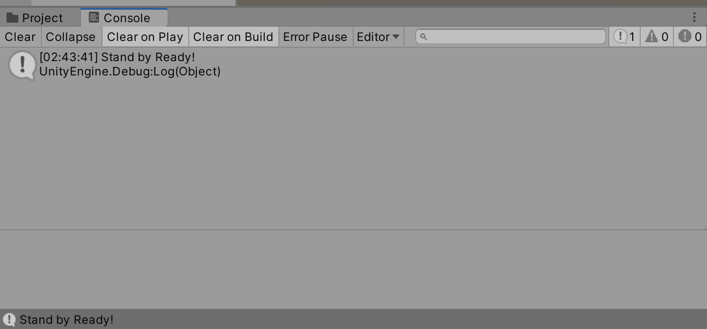

# Debug.Log でスクリプトの実行を確認する

スクリプトが正しく動いているかどうかは、目で見るだけでは判断しにくいことがあります。`Debug.Log()` を使うと、Console ビューにメッセージを出力して動作を確認できます。

## 学習目標

このページを読み終えると、以下のことができるようになります。

- `Debug.Log()` を使って Console ビューにメッセージを出力できる
- ゲームに影響を与えずにプログラム内部の状態を確認できる

## 前提知識

- [Start メソッドとスクリプトの仕組み](/unity-csharp-learning/unity/start-method/) を読んでいること

---

## 1. Debug クラスとは

Unity のデバッグ機能は **`Debug` クラス**にまとめられています。

**`Debug`** — Unity のデバッグ機能を提供するクラスです。<!-- [公式ドキュメント]() -->

**書式：Debug クラス**
```csharp
public class Debug
```

このクラスの代表的なメソッドが、任意のメッセージを Console ビューに出力する `Debug.Log()` です。

---

## 2. Debug.Log() でメッセージを出力する

**`Debug.Log`** — Console ビューにメッセージを出力します。<!-- [公式ドキュメント]() -->

**書式：Debug.Log メソッド**
```csharp
public static void Log(object message);
```

| パラメータ | 型 | 説明 |
|---|---|---|
| `message` | `object` | Console ビューに出力する内容。文字列以外のオブジェクトも渡せる |

---

`Debug.Log()` に文字列を渡すと、その内容が Console ビューに表示されます。

```csharp
using UnityEngine;

public class MyScript : MonoBehaviour
{
    private void Start()
    {
        Debug.Log("Stand by Ready!");
    }
}
```



このコードをアタッチしてゲームを実行すると、Game ビューには何も変化がありませんが、Console ビューに `Stand by Ready!` と出力されます。`Start` メソッドがゲーム開始時に呼び出されていることを確認できました。

> 💡 **ポイント**: `Debug.Log()` はゲームには影響しません（プレイヤーには見えません）。複雑な処理の途中経過が想定通りかどうかを確認するために使います。確認が終わったら削除しても問題ありません。

---

## よくあるミス

```csharp
// ❌ NG: スクリプトをプロジェクトに作成しただけでは実行されない

// ✅ OK: ゲームオブジェクトにアタッチしてから実行する
```

ログが出力されない場合は、スクリプトが何らかのゲームオブジェクトに正しくアタッチされているか Inspector ビューで確認してください。アタッチされていなければ `Start` は呼び出されません。

---

## まとめ

- **`Debug.Log()`** を使うと Console ビューにメッセージを出力できる
- Game ビューには影響しないので、開発中の動作確認に使う
- ログが出力されないときは、スクリプトがゲームオブジェクトにアタッチされているか確認する

---

## 理解度チェック

以下の問いに答えられるか確認しましょう。

1. `Debug.Log()` を使うと、メッセージはどこに表示されますか？
2. 次のコードを実行すると、何が出力されますか？

   ```csharp
   using UnityEngine;

   public class MyScript : MonoBehaviour
   {
       private void Start()
       {
           Debug.Log("Hello, Unity!");
       }
   }
   ```

3. `Debug.Log()` を呼び出しているのにログが出力されません。考えられる原因は何ですか？

<details markdown="1">
<summary>解答を見る</summary>

1. **Console ビュー**に表示される。
2. `Hello, Unity!`
3. スクリプトがゲームオブジェクトに**アタッチされていない**可能性がある。スクリプトをゲームオブジェクトに Add Component でアタッチしてから実行する。

</details>

---

## 次のステップ

[GameObject の生成と操作](/unity-csharp-learning/unity/gameobject-basics/) では、Start メソッドの中でゲームオブジェクトをコードから生成する方法を学びます。
