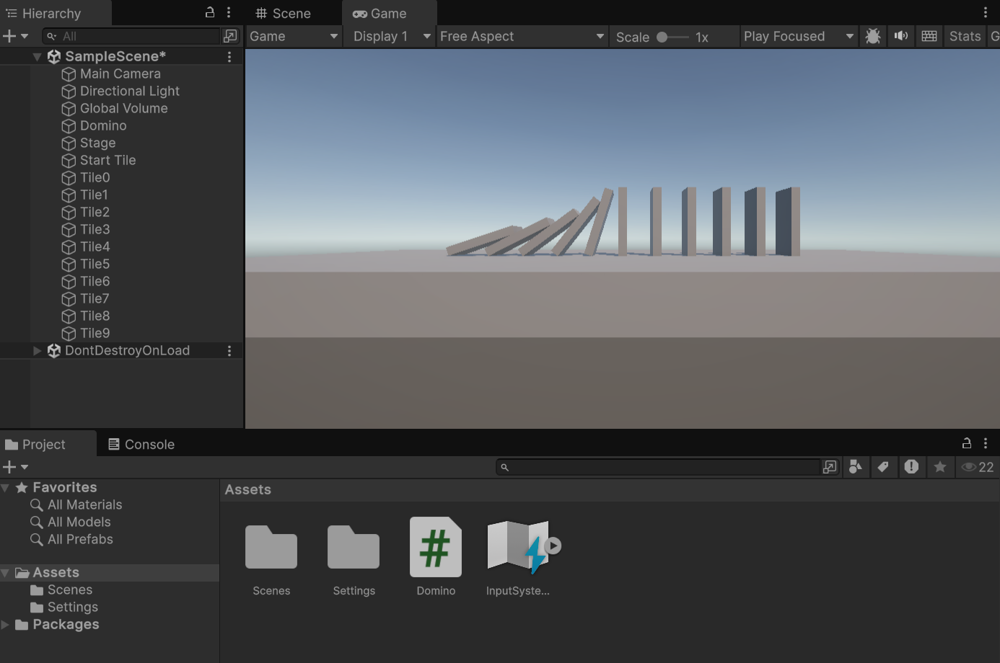
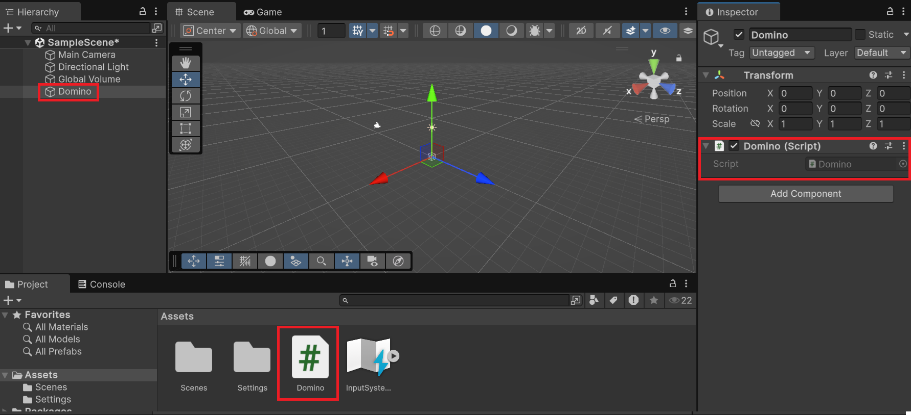
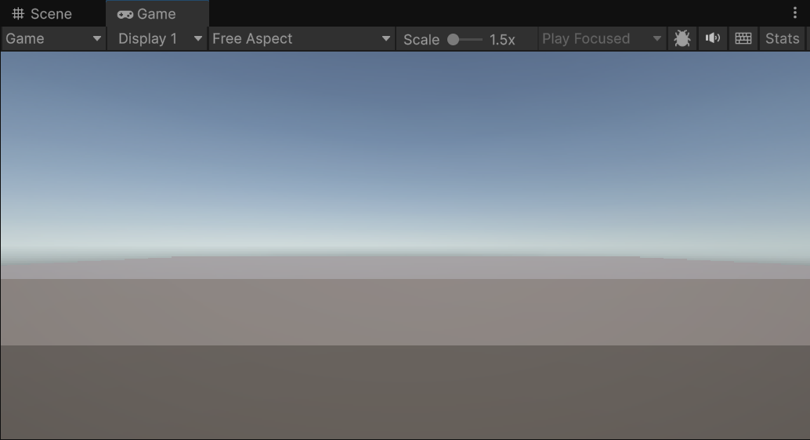
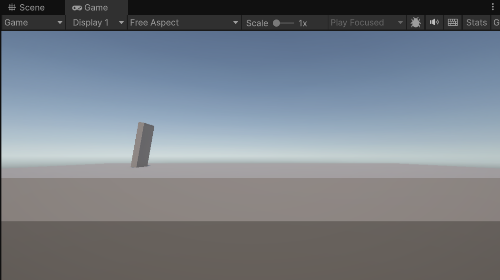
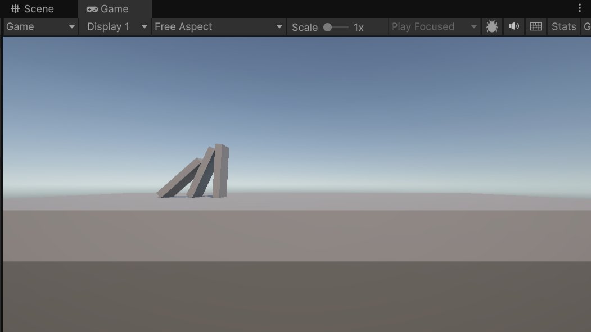
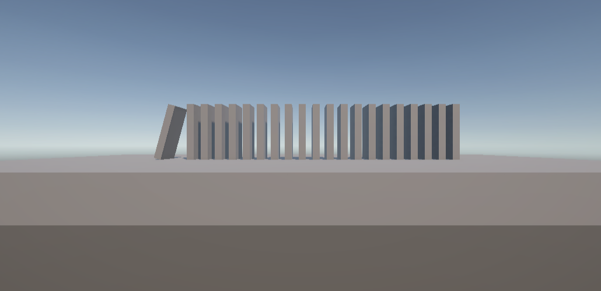
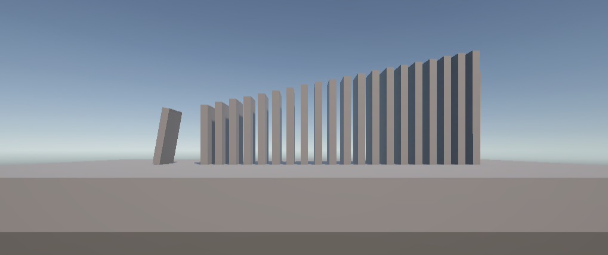
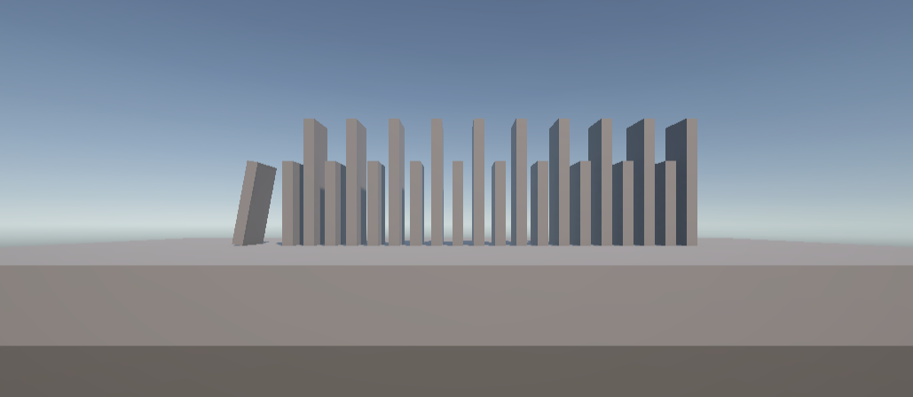
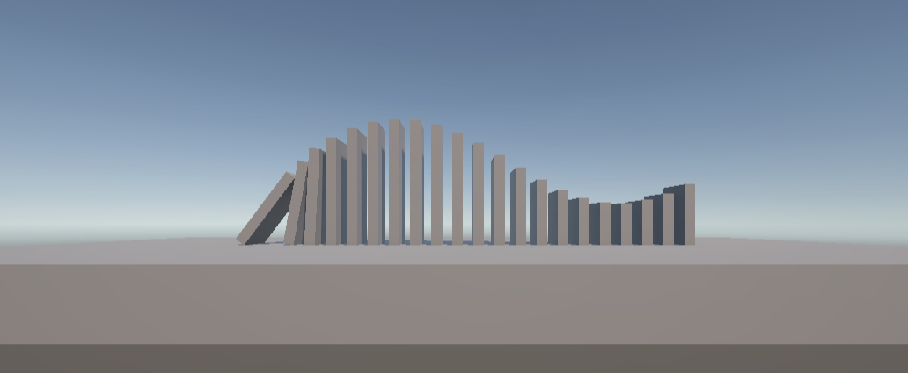

# チュートリアル: ドミノ倒し

板を並べ、物理的な挙動で順に倒れていく「ドミノ倒し」を Unity でシミュレーションします。これまで学んだ Start メソッド・GameObject の生成・Transform・Rigidbody を組み合わせた総合演習です。



## 学習目標

- これまでの学習内容（Start・CreatePrimitive・Transform・Rigidbody）を組み合わせてシーンを構築できる
- for 文を使って繰り返し処理でオブジェクトを量産できる
- スクリプトだけで Unity シーンを構成できることを体験できる

## 前提知識

- [Start メソッドとスクリプトの仕組み](/unity-csharp-learning/unity/start-method/)
- [GameObject の生成と操作](/unity-csharp-learning/unity/gameobject-basics/)
- [Transform でオブジェクトを操作する](/unity-csharp-learning/unity/transform/)
- [AddComponent と物理演算](/unity-csharp-learning/unity/rigidbody/)
- C# のループ（for 文）の基本 <!-- TODO: C# 基礎 ループページが作成されたらリンクを追加 -->

---

## 1. スクリプトを準備する

新しいシーンを作成し、空の GameObject を作ります（メニューバー **GameObject → Create Empty**）。Hierarchy ビューで `Domino` という名前に変更してください。

この GameObject に `Domino` という名前のスクリプトを作成してアタッチします（Inspector ビューの **Add Component → New script**）。



スクリプトを開いて、以降の手順に従いコードを書いていきましょう。

---

## 2. ステージ（土台）を作る

板を並べる地面となるステージを、立方体を横に引き伸ばして作ります。

```csharp
using UnityEngine;

public class Domino : MonoBehaviour
{
    private void Start()
    {
        var stage = GameObject.CreatePrimitive(PrimitiveType.Cube);
        stage.name = "Stage";
        stage.transform.localScale = new Vector3(20, 1, 10);
    }
}
```



---

## 3. 最初の板を追加して倒す

倒れる起点となる1枚目の板を追加します。板は縦長の直方体として作ります。

```csharp
var startTile = GameObject.CreatePrimitive(PrimitiveType.Cube);
startTile.name = "Start Tile";
startTile.transform.localScale = new Vector3(0.25F, 2, 1);
startTile.transform.position = new Vector3(-5, 1.5F, 0);
```

板がステージの中央（原点）に生成されてめり込まないよう、`position` で左端かつ上面に乗る位置に移動させています。

次に、板を少し傾けます。

```csharp
startTile.transform.rotation = Quaternion.Euler(0, 0, -10);
```



このままでは板は動きません。Rigidbody を追加して物理演算を有効にします。

```csharp
startTile.AddComponent<Rigidbody>();
```

<video controls src="./video.mp4"></video>

ここまでのコード全体：

```csharp
using UnityEngine;

public class Domino : MonoBehaviour
{
    private void Start()
    {
        var stage = GameObject.CreatePrimitive(PrimitiveType.Cube);
        stage.name = "Stage";
        stage.transform.localScale = new Vector3(20, 1, 10);

        var startTile = GameObject.CreatePrimitive(PrimitiveType.Cube);
        startTile.name = "Start Tile";
        startTile.transform.localScale = new Vector3(0.25F, 2, 1);
        startTile.transform.position = new Vector3(-5, 1.5F, 0);
        startTile.transform.rotation = Quaternion.Euler(0, 0, -10);
        startTile.AddComponent<Rigidbody>();
    }
}
```

---

## 4. 複数の板を並べる

倒される板を1枚追加して、連鎖が起きることを確認します。

```csharp
var tile = GameObject.CreatePrimitive(PrimitiveType.Cube);
tile.name = "Tile";
tile.transform.localScale = new Vector3(0.25F, 2, 1);
tile.transform.position = new Vector3(-4, 1.5F, 0);
tile.AddComponent<Rigidbody>();
```

<video controls src="./video-1.mp4"></video>

さらに板を増やすにはこのコードをコピーして X 座標をずらすだけです。

```csharp
var tile1 = GameObject.CreatePrimitive(PrimitiveType.Cube);
tile1.name = "Tile1";
tile1.transform.localScale = new Vector3(0.25F, 2, 1);
tile1.transform.position = new Vector3(-4, 1.5F, 0);
tile1.AddComponent<Rigidbody>();

var tile2 = GameObject.CreatePrimitive(PrimitiveType.Cube);
tile2.name = "Tile2";
tile2.transform.localScale = new Vector3(0.25F, 2, 1);
tile2.transform.position = new Vector3(-3, 1.5F, 0);
tile2.AddComponent<Rigidbody>();
```



しかし、数十枚・数百枚と増えていくとコピーは現実的ではありません。

---

## 5. for 文で板を量産する

同じ処理を繰り返すには **for 文**を使います。

```csharp
for (var i = 0; i < 繰り返す回数; i++)
{
    // 繰り返したい処理
}
```

- `var i = 0` — 繰り返し回数を数える変数 `i` を 0 で開始
- `i < 繰り返す回数` — この条件が満たされている間 `{ }` 内を繰り返す
- `i++` — `{ }` 内を1回実行するたびに `i` を 1 増やす（`i = i + 1` と同義）

<!-- TODO: C# 基礎 ループページが作成されたら for 文の詳細解説へのリンクを追加 -->

板の生成コードをよく見ると、X 座標の値だけが異なります。`i` は繰り返すたびに 1 ずつ増えるので、これをそのまま X 座標の計算に使えます。

```csharp
using UnityEngine;

public class Domino : MonoBehaviour
{
    private void Start()
    {
        var stage = GameObject.CreatePrimitive(PrimitiveType.Cube);
        stage.name = "Stage";
        stage.transform.localScale = new Vector3(20, 1, 10);

        var startTile = GameObject.CreatePrimitive(PrimitiveType.Cube);
        startTile.name = "Start Tile";
        startTile.transform.localScale = new Vector3(0.25F, 2, 1);
        startTile.transform.position = new Vector3(-5, 1.5F, 0);
        startTile.transform.rotation = Quaternion.Euler(0, 0, -10);
        startTile.AddComponent<Rigidbody>();

        for (var i = 0; i < 10; i++)
        {
            var tile = GameObject.CreatePrimitive(PrimitiveType.Cube);
            tile.name = $"Tile{i}";
            tile.transform.localScale = new Vector3(0.25F, 2, 1);
            tile.transform.position = new Vector3(-4 + i, 1.5F, 0);
            tile.AddComponent<Rigidbody>();
        }
    }
}
```

<video controls src="./video-2.mp4"></video>

`i` は 0〜9 の値を取るので、`-4 + i` は `-4` から `-4 + 9 = 5` まで変化し、10枚の板が等間隔に並びます。

> 💡 **ポイント**: for 文の `i` は `0` から始まり `< 10`（10未満）なので、`i` の範囲は `0〜9` の10回です。`1〜10` ではないことに注意してください。

完成版のサンプルコードは [`samples/unity/Domino.cs`](https://github.com/leon/unity-csharp-learning/blob/main/samples/unity/Domino.cs) にあります。<!-- TODO: リポジトリのユーザー名を確認してリンクを修正 -->

---

## 課題

### 課題 1: 板の数を増やし間隔を短くする

for 文の繰り返し回数を変更して板を **20枚** 生成してください。このとき、板と板の間隔が**半分（0.5単位）** になるように X 座標の計算を調整してください。



ヒント: `tile.transform.position = new Vector3(-4 + i, 1.5F, 0);` の `-4 + i` の部分を調整します。乗算（`*`）・除算（`/`）を使ってみましょう。

<details>
<summary>解答を見る</summary>

**倍率で調整する方法（推奨）**

```csharp
tile.transform.position = new Vector3(-4 + i * 0.5F, 1.5F, 0);
```

`i * 0.5F` とすることで、`i` が 1 増えるたびに X 座標が 0.5 ずつ増えます。

</details>

---

### 課題 2: 板の高さを段階的に変える

並べる板の高さが順に変化するようにプログラムを改良してください。



ヒント: `localScale` の Y 値を `i` を使って変化させます。高さを変えると板の中心を軸に拡縮されるため、板がめり込まないよう `position` の Y 値も合わせて調整してください。

<details>
<summary>解答を見る</summary>

```csharp
for (var i = 0; i < 20; i++)
{
    var tile = GameObject.CreatePrimitive(PrimitiveType.Cube);
    tile.name = $"Tile{i}";
    tile.transform.localScale = new Vector3(0.25F, 2 + i * 0.1F, 1);
    tile.transform.position = new Vector3(-4 + i * 0.5F, 1.5F + i * 0.05F, 0);
    tile.AddComponent<Rigidbody>();
}
```

`i * 0.1F` で高さを増やし、増やした高さの半分（`i * 0.05F`）だけ Y 位置を上げることで板が地面にめり込まないようにしています。

</details>

---

### 課題 3: 板の高さを交互に変える

板の高さが1枚ごとに交互に変わるようにプログラムを変更してください。



ヒント: 整数同士の除算では小数点が切り捨てられます。`3 / 2` の結果は `1` です。小数を含む結果が必要な場合はいずれかの値を小数にします（例: `3 / 2.0F` → `1.5`）。

<details>
<summary>解答を見る</summary>

```csharp
for (var i = 0; i < 20; i++)
{
    var y = i % 2;  // i が偶数なら 0、奇数なら 1
    var tile = GameObject.CreatePrimitive(PrimitiveType.Cube);
    tile.name = $"Tile{i}";
    tile.transform.localScale = new Vector3(0.25F, 2 + y, 1);
    tile.transform.position = new Vector3(-4 + i * 0.5F, 1.5F + y / 2.0F, 0);
    tile.AddComponent<Rigidbody>();
}
```

`i % 2`（剰余）を使うと `i` が偶数なら `0`、奇数なら `1` となり、2種類の高さを交互に表現できます。`y / 2.0F` としているのは整数除算による切り捨てを防ぐためです。

</details>

---

### 課題 4: 板の高さを波形にする（発展）

板の高さが正弦波（サインカーブ）で変化するようにプログラムを変更してください。数学が好きな方向けの発展課題です。



ヒント: 一般的な数学関数は `UnityEngine.Mathf` 構造体で提供されています。正弦波は `Mathf.Sin()` メソッドで計算できます。<!-- [公式ドキュメント]() -->

<details>
<summary>解答を見る</summary>

```csharp
for (var i = 0; i < 20; i++)
{
    var y = Mathf.Sin(i / 3.0F);
    var tile = GameObject.CreatePrimitive(PrimitiveType.Cube);
    tile.name = $"Tile{i}";
    tile.transform.localScale = new Vector3(0.25F, 2 + y, 1);
    tile.transform.position = new Vector3(-4 + i * 0.5F, 1.5F + y / 2.0F, 0);
    tile.AddComponent<Rigidbody>();
}
```

`Mathf.Sin(i / 3.0F)` で -1〜1 の範囲の波形値を得て、高さに加算しています。`i / 3.0F` で波の周期を調整しています。

</details>

---

## まとめ

- Start メソッド・CreatePrimitive・Transform・Rigidbody を組み合わせてシーン全体をスクリプトで構築できた
- for 文を使うことで、同じコードの繰り返しを短く書ける
- `i` 変数を座標計算に活用することで、オブジェクトを等間隔に並べられる
